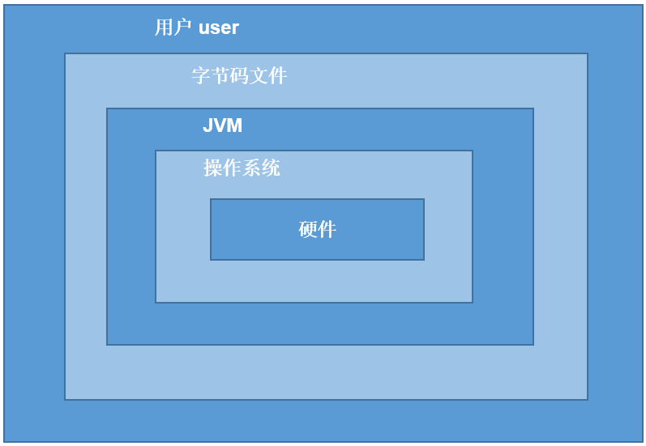
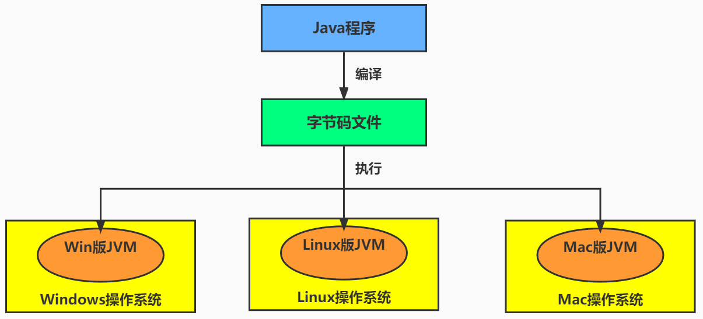
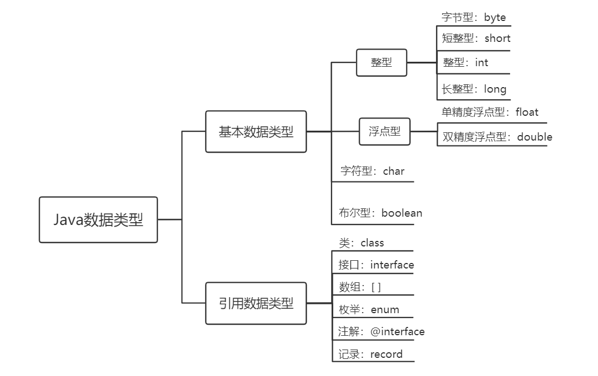
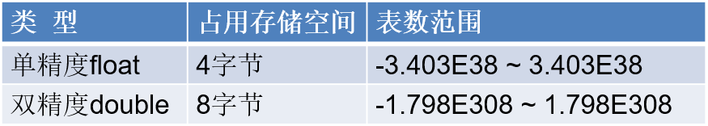
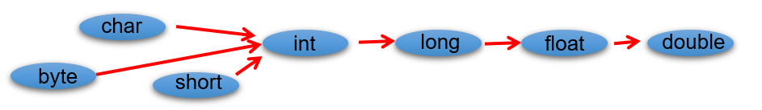
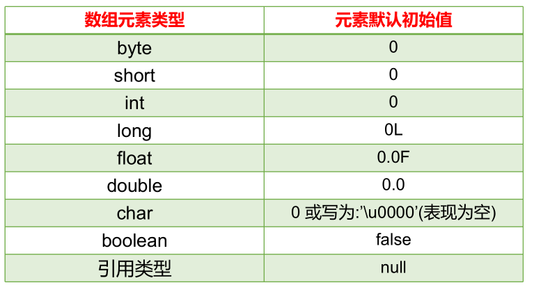
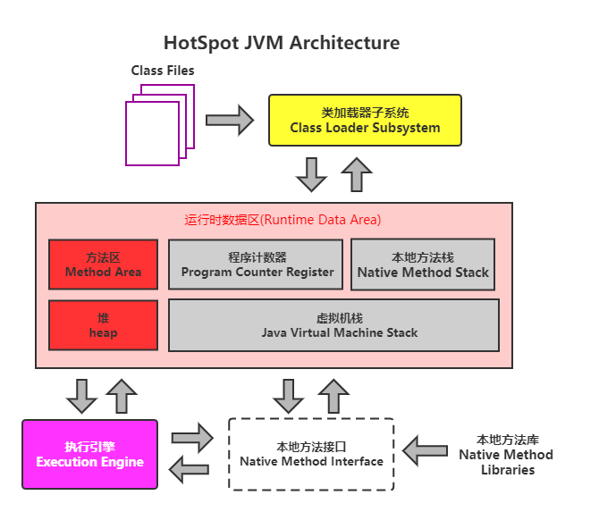
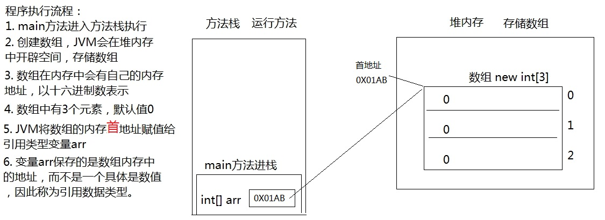
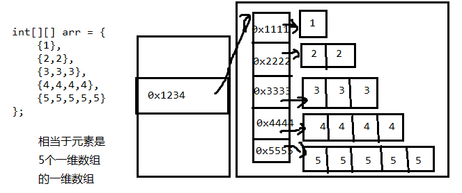

# Java概述

## JavaSE、JavaEE、JavaME

- **Java SE(Java Standard Edition)标准版**
  - 支持面向`桌面级应用`（如Windows下的应用程序）的Java平台，即定位个人计算机的应用开发。
  - 包括用户界面接口AWT及Swing，网络功能与国际化、图像处理能力以及输入输出支持等。
  - 此版本以前称为J2SE
- **Java EE(Java Enterprise Edition)企业版**
  - 为开发企业环境下的应用程序提供的一套解决方案，即定位`在服务器端的Web应用开发`。
  - JavaEE是JavaSE的扩展，增加了用于服务器开发的类库。如：Servlet能够延伸服务器的功能，通过请求-响应的模式来处理客户端的请求；JSP是一种可以将Java程序代码内嵌在网页内的技术。
  - 版本以前称为J2EE
- **Java ME(Java Micro Edition)小型版**
  - 支持Java程序运行在`移动终端（手机、机顶盒）上的平台`，即定位在消费性电子产品的应用开发
  - JavaME是JavaSE的内伸，精简了JavaSE 的核心类库，同时也提供自己的扩展类。增加了适合微小装置的类库：javax.microedition.io.*等。
  - 此版本以前称为J2ME


## JDK、JRE、JVM

- **JDK**  (`J`ava `D`evelopment `K`it)：是Java程序开发工具包，包含`JRE` 和开发人员使用的工具。
- **JRE ** (`J`ava `R`untime `E`nvironment) ：是Java程序的运行时环境，包含`JVM` 和运行时所需要的`核心类库`。


## Java运行过程

Java程序开发三步骤：**编写**、**编译**、**运行**。

- 将 Java 代码**编写**到扩展名为 .java 的源文件中
- 通过 `javac 源文件名.java` 命令对该 java 文件进行**编译**，生成一个或多个字节码文件
- 通过 `java 主类名字` 命令对生成的 class 文件进行**运行**


> （1）源文件名是否必须与类名一致？public呢？
>
> ```java
> 如果这个类不是public，那么源文件名可以和类名不一致。但是不便于代码维护。
> 
> 如果这个类是public，那么要求源文件名必须与类名一致。否则编译报错。
> 
> 建议源文件名都与源文件名保持一致，而且一个源文件尽量只写一个类，目的是为了好维护。
> ```
>
> （2）一个源文件中是否可以有多个类？public呢？
>
> ```java
> 一个源文件中可以有多个类，编译后会生成多个.class字节码文件。
> 
> 但是一个源文件只能有一个public的类。
> ```
>
> 


## Java注释

+ 单行注释

```java
//注释文字
```

+ 多行注释
  + 对于单行和多行注释，被注释的文字，不会不会出现在字节码文件中，不会被JVM（java虚拟机）解释执行。
  + 多行注释里面不允许有多行注释嵌套。

```java
/* 
注释1 
注释2
*/
```

+ 文档注释
  + 文档注释内容可以被JDK提供的工具 javadoc 所解析，生成一套以网页文件形式体现的该程序的说明文档。

```java
/**
  @author  指定java程序的作者
  @version  指定源文件的版本
*/ 
```


## Java核心机制：JVM

**JVM**（`J`ava `V`irtual `M`achine ，Java虚拟机）：是一个虚拟的计算机，是Java程序的运行环境。JVM具有指令集并使用不同的存储区域，负责执行指令，管理数据、内存、寄存器。



+ 实现了Java程序的跨平台性




+ 实现了自动内存管理
  + Java程序在运行过程中，涉及到运算的`数据的分配`、`存储`等都由JVM来完成
  + Java提供了一种系统级线程跟踪存储空间的分配情况，在内存空间达到相应阈值时，检查并释放可被释放的存储器空间。
  + GC的自动回收，提高了内存空间的利用效率，也提高了编程人员的效率，很大程度上`减少了`因为没有释放空间而导致的`内存泄漏`。

> Java程序还会出现内存溢出和内存泄漏问题吗？  Yes!


# 变量与运算符

## 关键字

定义：被Java语言赋予了特殊含义，用做专门用途的字符串（或单词）

特点：全部关键字都是`小写字母`。


> 1. 关键字一共`50个`，其中`const`和`goto`是`保留字`(reserved word)。
> 2. `true`，`false`，`null`不在其中，它们看起来像关键字，其实是字面量，表示特殊的布尔值和空值。


## 标识符

Java中变量、方法、类等要素命名时使用的字符序列，称为标识符。

凡是自己可以起名字的地方都叫标识符。

命名规则：

```java
> 由26个英文字母大小写，0-9 ，_或 $ 组成  
> 数字不可以开头。
> 不可以使用关键字和保留字，但能包含关键字和保留字。
> Java中严格区分大小写，长度无限制。
> 标识符不能包含空格。
```

命名规范：

```java
> 包名：多单词组成时所有字母都小写：xxxyyyzzz。
  例如：java.lang、com.demo.bean
  
> 类名、接口名：多单词组成时，所有单词的首字母大写：XxxYyyZzz
  例如：HelloWorld，String，System等
  
> 变量名、方法名：多单词组成时，第一个单词首字母小写，第二个单词开始每个单词首字母大写：xxxYyyZzz
  例如：age,name,bookName,main,binarySearch,getName
  
> 常量名：所有字母都大写。多单词时每个单词用下划线连接：XXX_YYY_ZZZ
  例如：MAX_VALUE,PI,DEFAULT_CAPACITY
```

## 变量

- 变量的概念：

  - 内存中的一个存储区域，该区域的数据可以在同一类型范围内不断变化
  - 变量的构成包含三个要素：`数据类型`、`变量名`、`存储的值`
- 变量的作用：用于在内存中保存数据。
- 使用变量注意：

  - Java中每个变量必须先声明，后使用。
  - 使用变量名来访问这块区域的数据。
  - 变量的作用域：其定义所在的一对{ }内。
  - 变量只有在其`作用域`内才有效。出了作用域，变量不可以再被调用。
  - 同一个作用域内，不能定义重名的变量。

### Java中变量的数据类型




## 基本数据类型

### 整数类型：byte、short、int、long

Java各整数类型有固定的表数范围和字段长度，不受具体操作系统的影响，以保证Java程序的可移植性。


- 定义long类型的变量，赋值时需要以"`l`"或"`L`"作为后缀。

- Java程序中变量通常声明为int型，除非不足以表示较大的数，才使用long。

- Java的整型`常量默认为 int 型`。

> - **字节（Byte）：**是计算机用于`计量存储容量`的`基本`单位，一个字节等于8 bit。
>
> - **位（bit）：**是数据存储的`最小`单位。二进制数系统中，每个0或1就是一个位，叫做bit（比特），其中8 bit 就称为一个字节(Byte)。
>
> - **转换关系：**
>   - 8 bit = 1 Byte
>   - 1024 Byte = 1 KB
>   - 1024 KB = 1 MB
>   - 1024 MB = 1 GB
>   - 1024 GB = 1 TB


### 浮点类型：float、double

与整数类型类似，Java 浮点类型也有固定的表数范围和字段长度，不受具体操作系统的影响。



- 浮点型常量有两种表示形式：
  - 十进制数形式。如：5.12       512.0f        .512   (必须有小数点）
  - 科学计数法形式。如：5.12e2      512E2     100E-2
- float：`单精度`，尾数可以精确到7位有效数字。很多情况下，精度很难满足需求。    
- double：`双精度`，精度是float的两倍。通常采用此类型。
- 定义float类型的变量，赋值时需要以"`f`"或"`F`"作为后缀。
- Java 的浮点型`常量默认为double型`。

#### 关于浮点数精度问题

- 并不是所有的小数都能可以精确的用二进制浮点数表示。二进制浮点数不能精确的表示0.1、0.01、0.001这样10的负次幂。

- 浮点类型float、double的数据不适合在`不容许舍入误差`的金融计算领域。如果需要`精确`数字计算或保留指定位数的精度，需要使用`BigDecimal类`。

```java
System.out.println(0.1 + 0.2);//0.30000000000000004
```

### 字符类型：char

- char 型数据用来表示通常意义上“`字符`”（占2字节）

- Java中的所有字符都使用Unicode编码，故一个字符可以存储一个字母，一个汉字，或其他书面语的一个字符。

- 字符型变量的三种表现形式：
  - 使用单引号 `' '` 括起来的`单个字符`。例如：`char c1 = 'a';   char c2 = '中'; char c3 =  '9';`

  - 直接使用 `Unicode值`来表示字符型常量：`'\uXXXX'`。其中，XXXX代表一个十六进制整数。例如：`'\u0023'` 表示 `'#'`。

  - Java中还允许使用`转义字符'\'`来将其后的字符转变为特殊字符型常量。例如：`char c3 = '\n';`  

| 转义字符 |  说明  | Unicode表示方式 |
| :------: | :----: | :-------------: |
|   `\n`   | 换行符 |    `\u000a`     |
|   `\t`   | 制表符 |    `\u0009`     |
|   `\"`   | 双引号 |    `\u0022`     |
|   `\'`   | 单引号 |    `\u0027`     |
|   `\\`   | 反斜线 |    `\u005c`     |
|   `\b`   | 退格符 |    `\u0008`     |
|   `\r`   | 回车符 |    `\u000d`     |


+ char类型是可以进行运算的。因为它都对应有Unicode码，可以看做是一个数值。


### 布尔类型：boolean

- boolean 类型用来判断逻辑条件，用于流程控制语句中： 

- **boolean类型数据只有两个值：true、false。**
  - 不可以使用0或非 0 的整数替代false和true，这和C语言不同。
  - 拓展：Java虚拟机中没有任何供boolean值专用的字节码指令，Java语言表达所操作的boolean值，在编译之后都使用java虚拟机中的int数据类型来代替：true用1表示，false用0表示。——《java虚拟机规范 8版》

> 建议不要这样写：`if ( isFlag = = true )`，建议的写法是 `if (isFlag)` 或者`if (!isFlag) `。


### 基本数据类型变量间的运算规则

在Java程序中，不同的基本数据类型（7种，不包含boolean类型）变量的值经常需要进行相互转换。

转换的方式有两种：`自动类型提升`和`强制类型转换`。

#### 自动类型提升

将取值范围小（或容量小）的类型自动提升为取值范围大（或容量大）的类型 。



（1）当把存储范围小的值（常量值、变量的值、表达式计算的结果值）赋值给了存储范围大的变量时

```java
int i = 'A';//char自动升级为int，其实就是把字符的编码值赋值给i变量了
double d = 10;//int自动升级为double
long num = 1234567; 

//byte bigB = 130;//错误，右边的整数常量值超过byte范围
long bigNum = 12345678912L;//右边的整数常量值如果超过int范围，必须加L，显式表示long类型。否则编译不通过
```

（2）当存储范围小的数据类型与存储范围大的数据类型变量一起混合运算时，会按照其中最大的类型运算。

```java
int i = 1;
byte b = 1;
double d = 1.0;

double sum = i + b + d;//混合运算，升级为double
```

（3）当byte,short,char数据类型的变量进行算术运算时，按照int类型处理。

```java
byte b1 = 1;
byte b2 = 2;
byte b3 = b1 + b2;//编译报错，b1 + b2自动升级为int

char c1 = '0';
char c2 = 'A';
int i = c1 + c2;//至少需要使用int类型来接收
System.out.println(c1 + c2);//113 
```

> 设 x 为float型变量，y为double型变量，a为int型变量，b为long型变量，c为char型变量，则表达式
> x + y * a / x + b / y + c的值类型为：double

#### 强制类型转换

将取值范围大（或容量大）的类型强制转换成取值范围小（或容量小）的类型。

> 自动类型提升是Java自动执行的，而强制类型转换是自动类型提升的逆运算，需要自己手动执行。

转换格式：

```java
数据类型1 变量名 = (数据类型1)被强转变量值;  
//()中的数据类型必须<=变量值的数据类型
```

（1）当把存储范围大的值（常量值、变量的值、表达式计算的结果值）强制转换为存储范围小的变量时，可能会`损失精度`或`溢出`。

```java
int i = (int)3.14;//损失精度

double d = 1.2;
int num = (int)d;//损失精度

int i = 200;
byte b = (byte)i;//溢出
```

（2）当某个值想要提升数据类型时，也可以使用强制类型转换。这种情况的强制类型转换是`没有风险`的，通常省略。

```java
int i = 1;
int j = 2;
double bigger = (double)(i/j); //0.0
```

（3）声明long类型变量时，可以出现省略后缀的情况。float则不同。

```java
long l1 = 123L;
long l2 = 123;//如何理解： 可以看做是int类型的123自动类型提升为long类型

//long l3 = 123123123123; //报错，因为123123123123超出了int的范围。
long l4 = 123123123123L;


//float f1 = 12.3; //报错，因为12.3看做是double，不能自动转换为float类型
float f2 = 12.3F;
float f3 = (float)12.3;
```

> 判断能否通过编译：
>
> ```java
> 1）short  s = 5;
>    s = s-2;                     //判断：no
> 2） byte b = 3;
>     b = b + 4;                  //判断：no
>     b = (byte)(b+4);            //判断：yes
> 3）char c = ‘a’;
>    int  i = 5;
>    float d = .314F;
>    double result = c+i+d;       //判断：yes
> 4） byte b = 5;
>     short s = 3;
>     short t = s + b;            //判断：no
> 
> ```
>
> 为什么标识符的声明规则里要求不能数字开头:
>
> ```java
> //如果允许数字开头，则如下的声明编译就可以通过：
> int 123L = 12;
> //进而，如下的声明中l的值到底是123？还是变量123L对应的取值12呢？ 出现歧义了。
> long l = 123L;
> ```
>
> 


### 基本数据类型与String的运算

#### 字符串类型：String

- String不是基本数据类型，属于引用数据类型
- 使用一对`""`来表示一个字符串，内部可以包含0个、1个或多个字符。
- 声明方式与基本数据类型类似。例如：String str = “demo”;

#### 运算规则

1、八种基本数据类型的数据与String类型只能进行连接“+”运算，且结果一定也是String类型

```java
System.out.println("" + 1 + 2);//12

int num = 10;
boolean b1 = true;
String s1 = "abc";

String s2 = s1 + num + b1;
System.out.println(s2);//abc10true

//String s3 = num + b1 + s1;//编译不通过，因为int类型不能与boolean运算
String s4 = num + (b1 + s1);//编译通过
```

> * `+`两边都是数值的话，`+`就是加法的意思
> * `+`两边至少有一边是字符串的话，`+`就是拼接的意思

2、String类型不能通过强制类型()转换为其他的类型

```java
String str = "123";
int num = (int)str;//错误的

int num = Integer.parseInt(str);//借助包装类的方法才能转
```

## 运算符

运算符是一种特殊的符号，用以表示数据的运算、赋值和比较等。

**运算符的分类**：

- 按照`功能`分为：算术运算符、赋值运算符、比较(或关系)运算符、逻辑运算符、位运算符、条件运算符、Lambda运算符

|           分类            |                        运算符                         |
| :-----------------------: | :---------------------------------------------------: |
|     算术运算符（7个）     |                `+、-、*、/、%、++、--`                |
|    赋值运算符（12个）     | `=、+=、-=、*=、/=、%=、>>=、<<=、>>>=、&=、|=、^=等` |
| 比较(或关系)运算符（6个） |                `>、>=、<、<=、==、!=`                 |
|     逻辑运算符（6个）     |                 `&、|、^、!、&&、||`                  |
|      位运算符（7个）      |               `&、|、^、~、<<、>>、>>>`               |
|     条件运算符（1个）     |              `(条件表达式)?结果1:结果2`               |
|    Lambda运算符（1个）    |                         `->`                          |

* 按照`操作数个数`分为：一元运算符（单目运算符）、二元运算符（双目运算符）、三元运算符 （三目运算符）

|           分类            |                  运算符                  |
| :-----------------------: | :--------------------------------------: |
| 一元运算符（单目运算符）  |    正号（+）、负号（-）、++、--、!、~    |
| 二元运算符（双目运算符）  | 除了一元和三元运算符剩下的都是二元运算符 |
| 三元运算符 （三目运算符） |         (条件表达式)?结果1:结果2         |

> **注意：**
>
> + **自增自减运算**
>
> 和`其他变量放在一起使用`或者和`输出语句放在一起使用`，`前++`和`后++`就产生了不同：
>
> 1. 变量`前++` ：变量先自增1，然后再运算。
> 2. 变量`后++` ：变量先运算，然后再自增1。
>
> ```java
> public class ArithmeticTest4 {
> 	public static void main(String[] args) {
> 		// 其他变量放在一起使用
> 		int x = 3;
> 		//int y = ++x; // y的值是4，x的值是4，
> 		int y = x++; // y的值是3，x的值是4
> 	
>         
> 		// 和输出语句一起
> 		int z = 5;
> 		//System.out.println(++z);// 输出结果是6，z的值也是6
> 		System.out.println(z++);// 输出结果是5，z的值是6
>         
> 	} 
> }
> ```
>
> + **`=`赋值运算符可以实现连续赋值：**
>
> ```java
> //连续赋值的写法
> int a2,b2;
> a2 = b2 = 10;
> ```
>
> + **比较运算符**
>
> `>   <   >=  <= `：只适用于基本数据类型（除boolean类型之外）
>
> `==   != `：适用于基本数据类型和引用数据类型
>
> + `^`异或运算符
>
> 当符号左右两边布尔值不同时，结果为true。当两边布尔值相同时，结果为false。追求的是“异”！
>
> + **区分`&`和`&&`、`|`和`||`**
>
> `&` ： 如果符号左边是false,则继续执行符号右边的操作；`&&` ：如果符号左边是false,则不再继续执行符号右边的操作；建议使用`&&`
>
> `|` ： 如果符号左边是true，则继续执行符号右边的操作；`|| `：如果符号左边是true，则不再继续执行符号右边的操作；建议使用 `||`
>
> 


### 运算符优先级

| 优先级 |    运算符说明    |             Java运算符             |
| ------ | :--------------: | :--------------------------------: |
| 1      |       括号       |          `()`、`[]`、`{}`          |
| 2      |      正负号      |              `+`、`-`              |
| 3      |    单元运算符    |       `++`、`--`、`~`、`！`        |
| 4      | 乘法、除法、求余 |           `*`、`/`、`%`            |
| 5      |    加法、减法    |              `+`、`-`              |
| 6      |    移位运算符    |         `<<`、`>>`、`>>>`          |
| 7      |    关系运算符    | `<`、`<=`、`>=`、`>`、`instanceof` |
| 8      |    等价运算符    |             `==`、`!=`             |
| 9      |      按位与      |                `&`                 |
| 10     |     按位异或     |                `^`                 |
| 11     |      按位或      |                `|`                 |
| 12     |      条件与      |                `&&`                |
| 13     |      条件或      |                `||`                |
| 14     |    三元运算符    |               `? :`                |
| 15     |    赋值运算符    | `=`、`+=`、`-=`、`*=`、`/=`、`%=`  |
| 16     |   位赋值运算符   |  `&=`、`|=`、`<<=`、`>>=`、`>>>=`  |

> 尽量使用 `()` 来控制表达式的执行顺序。


# 流程控制语句

## 分支语句

### if-else条件判断结构

### switch-case选择结构

语法格式：

```java
switch(表达式){
    case 常量值1:
        语句块1;
        //break;
    case 常量值2:
        语句块2;
        //break; 
    // ...
   [default:
        语句块n+1;
        break;
   ]
}
```

执行流程：

+ 第1步：根据switch中表达式的值，依次匹配各个case。如果表达式的值等于某个case中的常量值，则执行对应case中的执行语句。

+ 第2步：执行完此case的执行语句以后，
  + 情况1：如果遇到break,则执行break并跳出当前的switch-case结构
  + 情况2：如果没有遇到break，则会继续执行当前case之后的其它case中的执行语句（case穿透）。直到遇到break关键字或执行完所有的case及default的执行语句，跳出当前的switch-case结构

**注意：**

- switch(表达式)中表达式的值必须是下述几种类型之一：byte，short，char，int，枚举 (jdk 5.0)，String (jdk 7.0)；

- case子句中的值必须是常量，不能是变量名或不确定的表达式值或范围；

- 同一个switch语句，所有case子句中的常量值互不相同；

- break语句用来在执行完一个case分支后使程序跳出switch语句块；如果没有break，程序会顺序执行到switch结尾；

- default子句是可选的，位置灵活。当没有匹配的case时，执行default语句。

> case穿透案例：
>
> 对学生成绩大于60分的，输出“合格”。低于60分的，输出“不合格”。
>
> ```java
> class SwitchCaseTest3 {
> 	public static void main(String[] args) {
> 		int score = 67;
>         
> 		switch(score / 10){
> 			case 0:
> 			case 1:
> 			case 2:
> 			case 3:
> 			case 4:
> 			case 5:
> 				System.out.println("不及格");
> 				break;
> 			case 6:
> 			case 7:
> 			case 8:
> 			case 9:
> 			case 10:
> 				System.out.println("及格");
> 				break; //如果执行到这里没有break会发生case穿透，进而接着执行default里面的语句。
> 			default:
> 				System.out.println("输入的成绩有误");
> 				break;
> 		}
> 
> 		//写法2：
> 		switch(score / 60){
> 			case 0:
> 				System.out.println("不及格");
> 				break;
> 			case 1:
> 				System.out.println("及格");
> 				break;
> 			default:
> 				System.out.println("输入的成绩有误");
> 				break;
> 		}
> 	}
> }
> ```
>
> 

## 循环语句

### for循环

### while循环

### do-while循环

do-while结构的循环体语句是至少会执行一次

### 无限循环

`while(true)` 

 `for(;;)` 

## 关键字：break、continue

| 关键字   | 适用范围              | 在循环结构中的作用                   |
| -------- | --------------------- | ------------------------------------ |
| break    | switch-case、循环结构 | 一旦执行，就结束(或跳出)当前循环结构 |
| continue | 循环结构              | 一旦执行，就结束(或跳出)当次循环结构 |

这俩关键字的后面，不能声明语句

## Scanner：键盘输入功能实现

- 如何从键盘获取不同类型（基本数据类型、String类型）的变量：使用Scanner类。

- 四个步骤：
  1. 导包：`import java.util.Scanner;`
  2. 创建Scanner类型的对象：`Scanner scan = new Scanner(System.in);`
  3. 调用Scanner类的相关方法（`next() / nextXxx()`），来获取指定类型的变量
  4. 释放资源：`scan.close();`
- 注意：如果输入的数据类型与要求的类型不匹配时，会报异常导致程序终止。

## 如何获取一个随机数

如何产生一个指定范围的随机整数？

1. Math类的random()的调用，会返回一个[0,1)范围的一个double型值
2. `Math.random() * 100  --->  [0,100)`
3. ``(int)(Math.random() * 100)	---> [0,99]`
4.  `(int)(Math.random() * 100) + 5  ----> [5,104]`

如何获取`[a,b]`范围内的随机整数呢？

`(int)(Math.random() * (b - a + 1)) + a`


# 数组

数组的特点：

- 数组本身是`引用数据类型`，而数组中的元素可以是`任何数据类型`
- 创建数组对象会在内存中开辟一整块`连续的空间`。占据的空间的大小，取决于数组的长度和数组中元素的类型。
- 数组中的元素在内存中是依次紧密排列的，有序的。
- 数组，一旦初始化完成，其长度就是确定的。数组的`长度一旦确定，就不能修改`。
- 可以直接通过下标(或索引)的方式调用指定位置的元素，速度很快。
- 数组名中引用的是这块连续空间的首地址。

## 数组分类

**1、按照元素类型分：**

- 基本数据类型元素的数组：每个元素位置存储基本数据类型的值
- 引用数据类型元素的数组：每个元素位置存储对象（本质是存储对象的首地址）

**2、按照维度分：**

- 一维数组：存储一组数据
- 二维数组：存储多组数据，相当于二维表，一行代表一组数据，只是这里的**二维表每一行长度不要求一样**。


## 一维数组

### 一维数组声明

格式：

```java
//推荐
元素的数据类型[] 一维数组的名称;

//不推荐
元素的数据类型  一维数组名[];
```

> 注意：Java语言中声明数组时不能指定其长度(数组中元素的个数)。 
>
> 例如： int a[5]; //非法


### 一维数组初始化

#### 静态初始化

+ 如果数组变量的初始化和数组元素的赋值操作同时进行，那就称为静态初始化。
+ 格式：

```java
数据类型[] 数组名 = new 数据类型[]{元素1,元素2,元素3,...};
```

```java
数据类型[] 数组名;
数组名 = new 数据类型[]{元素1,元素2,元素3,...};
```

```java
数据类型[] 数组名 = {元素1,元素2,元素3...};//必须在一个语句中完成，不能分成两个语句写
```

> 案例：
>
> ```java
> public class ArrayTest2 {
>     public static void main(String[] args) {
>         int[] arr = {1,2,3,4,5};//右边不需要写new int[]
> 
>         int[] nums;
>         nums = new int[]{10,20,30,40}; 
> 
>         char[] word = {'h','e','l','l','o'};
> 
>         String[] heros = {"袁隆平","邓稼先","钱学森"};
>     }
> }
> ```
>
> 

#### 动态初始化

数组变量的初始化和数组元素的赋值操作分开进行，即为动态初始化。

格式：

```java
数据类型[] 数组名字 = new 数据类型[长度];
```

```java
数据类型[] 数组名字;
数组名字 = new 数据类型[长度];
```

> + 长度一旦指定，不可更改

> + 错误写法：
>
> `int[] arr = new int[5]{1,2,3,4,5};`  //错误的，后面有`{}`指定元素列表，就不需要在`[]`中指定元素个数了。


### 一维数组的使用

Java中数组的下标从[0]开始，下标范围是`[0, 数组的长度-1]`，即`[0, 数组名.length-1]`

数组元素下标可以是整型常量或整型表达式。如`a[3] , b[i] , c[6*i];`


### 数组元素的默认值

数组是引用类型，当使用动态初始化方式创建数组时，元素值只是默认值

对于基本数据类型而言，默认初始化值各有不同。

对于引用数据类型而言，默认初始化值为null




### 一维数组内存分析

#### Java虚拟机的内存划分

为了提高运算效率，就对空间进行了不同区域的划分，因为每一片区域都有特定的处理数据方式和内存管理方式。



|  区域名称  |                             作用                             |
| :--------: | :----------------------------------------------------------: |
|  虚拟机栈  | 用于存储正在执行的每个Java方法的局部变量表等。局部变量表存放了编译期可知长度的各种基本数据类型、对象引用，方法执行完，自动释放。 |
|   堆内存   |   存储对象（包括数组对象），new来创建的，都存储在堆内存。    |
|   方法区   | 存储已被虚拟机加载的类信息、常量、（静态变量）、即时编译器编译后的代码等数据。 |
| 本地方法栈 | 当程序中调用了native的本地方法时，本地方法执行期间的内存区域 |
| 程序计数器 | 程序计数器是CPU中的寄存器，它包含每一个线程下一条要执行的指令的地址 |


#### 一维数组在内存中的存储

```java
public static void main(String[] args) {
  	int[] arr = new int[3];
  	System.out.println(arr);//[I@5f150435
}

```




## 多维数组

- 对于二维数组，可以看成是一维数组array1又作为另一个一维数组array2的元素而存在。
- 其实，从数组底层的运行机制来看，其实没有多维数组。

### 二维数组的声明

格式：

```java
//推荐
元素的数据类型[][] 二维数组的名称;

//不推荐
元素的数据类型  二维数组名[][];
//不推荐
元素的数据类型[]  二维数组名[];
```

> `int[] x, y[];`
> //x是一维数组，y是二维数组


### 二维数组初始化

#### 静态初始化

格式：

```java
int[][] arr = new int[][]{{3,8,2},{2,7},{9,0,1,6}};
```

```java
int[][] arr = {{1,2,3},{4,5,6},{7,8,9,10}};//声明与初始化必须在一句完成
```

```java
int[][] arr;
arr = new int[][]{{1,2,3},{4,5,6},{7,8,9,10}};
```

> `arr = new int[3][3]{{1,2,3},{4,5,6},{7,8,9,10}}; `  //错误，静态初始化右边new 数据类型[][]中不能写数字


#### 动态初始化

如果二维数组的每一个数据，甚至是每一行的列数，需要后期单独确定，那么就只能使用动态初始化方式了

格式：

+ 每一行的列数都是相同的

```java
//（1）确定行数和列数
元素的数据类型[][] 二维数组名 = new 元素的数据类型[m][n];
	//其中，m:表示这个二维数组有多少个一维数组。或者说一共二维表有几行
	//其中，n:表示每一个一维数组的元素有多少个。或者说每一行共有一个单元格

//此时创建完数组，行数、列数确定，而且元素也都有默认值

//（2）再为元素赋新值
二维数组名[行下标][列下标] = 值;
```

+ 每一行的列数不一样

```java
//（1）先确定总行数
元素的数据类型[][] 二维数组名 = new 元素的数据类型[总行数][];

//此时只是确定了总行数，每一行里面现在是null

//（2）再确定每一行的列数，创建每一行的一维数组
二维数组名[行下标] = new 元素的数据类型[该行的总列数];

//此时已经new完的行的元素就有默认值了，没有new的行还是null

//(3)再为元素赋值
二维数组名[行下标][列下标] = 值;
```

> 注：`int[][]arr = new int[][3]; ` //非法


### 数组的长度和角标

- 二维数组的长度`/`行数：`二维数组名.length`
- 二维数组的某一行：`二维数组名[行下标]`，此时相当于获取其中一组数据。它本质上是一个一维数组。行下标的范围：`[0, 二维数组名.length-1]`。
- 某一行的列数：`二维数组名[行下标].length`，因为二维数组的每一行是一个一维数组。
- 某一个元素：`二维数组名[行下标][列下标]`，即先确定行`/`组，再确定列。


### 二维数组内存解析

二维数组本质上是元素类型是一维数组的一维数组。




## Arrays工具类的使用

java.util.Arrays类即为操作数组的工具类，包含了用来操作数组（比如排序和搜索）的各种方法。

