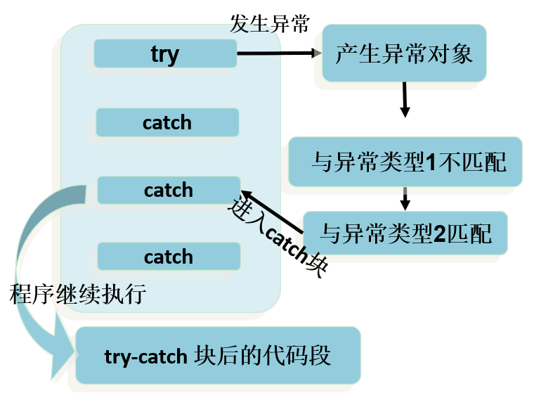

# Javaimg/异常体系

## img/异常概述

**img/异常** ：指的是程序在执行过程中，出现的非正常情况，如果不处理最终会导致JVM的非正常停止。

> img/异常指的并不是语法错误和逻辑错误。语法错了，编译不通过，不会产生字节码文件，根本不能运行。

Java中把不同的img/异常用不同的类表示，一旦发生某种img/异常，就`创建该img/异常类型的对象`，并且抛出（throw）。然后程序员可以捕获(catch)到这个img/异常对象，并处理；如果没有捕获(catch)这个img/异常对象，那么这个img/异常对象将会导致程序终止。


## Throwable

`java.lang.Throwable` 类是Java程序执行过程中发生的img/异常事件对应的类的根父类。

**Throwable中的常用方法：**

* `public void printStackTrace()`：打印img/异常的详细信息。

  包含了img/异常的类型、img/异常的原因、img/异常出现的位置、在开发和调试阶段都得使用printStackTrace。

* `public String getMessage()`：获取发生img/异常的原因。

## Error和Exception

Throwable可分为两类：Error和Exception。分别对应着`java.lang.Error`与`java.lang.Exception`两个类。

**Error：**Java虚拟机无法解决的严重问题。如：JVM系统内部错误、资源耗尽等严重情况。一般不编写针对性的代码进行处理。

- 例如：StackOverflowError（栈内存溢出）和OutOfMemoryError（堆内存溢出，简称OOM）。

**Exception:** 其它因编程错误或偶然的外在因素导致的一般性问题，需要使用针对性的代码进行处理，使程序继续运行。否则一旦发生img/异常，程序也会挂掉。

+ 例如：空指针访问、试图读取不存在的文件、网络连接中断、数组角标越界

## 编译时img/异常和运行时img/异常

Java程序的执行分为编译时过程和运行时过程。有的错误只有在`运行时`才会发生。比如：除数为0，数组下标越界等。

根据img/异常可能出现的阶段，可以将img/异常分为：

* **编译时期img/异常**（即checkedimg/异常、受检img/异常）：在代码编译阶段，编译器就能明确`警示`当前代码`可能发生（不是一定发生）`xximg/异常，并`明确督促`程序员提前编写处理它的代码。如果程序员`没有编写`对应的img/异常处理代码，则编译器就会直接判定编译失败，从而不能生成字节码文件。通常，这类img/异常的发生不是由程序员的代码引起的，或者不是靠加简单判断就可以避免的，例如：FileNotFoundException（文件找不到img/异常）。
* **运行时期img/异常**（即runtimeimg/异常、uncheckedimg/异常、非受检img/异常）：在代码编译阶段，编译器完全不做任何检查，无论该img/异常是否会发生，编译器都不给出任何提示。只有等代码运行起来并确实发生了xximg/异常，它才能被发现。通常，这类img/异常是由程序员的代码编写不当引起的，只要稍加判断，或者细心检查就可以避免。
  * **java.lang.RuntimeException**类及它的子类都是运行时img/异常。比如：ArrayIndexOutOfBoundsException数组下标越界img/异常，ClassCastException类型转换img/异常。


# img/异常的处理

## 方式1：捕获img/异常（try-catch-finally）

Java提供了img/异常处理的**抓抛模型**。

- Java程序的执行过程中如出现img/异常，会生成一个img/异常类对象，该img/异常对象将被提交给Java运行时系统，这个过程称为`抛出(throw)img/异常`。
- 如果一个方法内抛出img/异常，该img/异常对象会被抛给调用者方法中处理。如果img/异常没有在调用者方法中处理，它继续被抛给这个调用方法的上层方法。这个过程将一直继续下去，直到img/异常被处理。这一过程称为`捕获(catch)img/异常`。
- 如果一个img/异常回到main()方法，并且main()也不处理，则程序运行终止。

语法格式：

```java
try{
	......	//可能产生img/异常的代码
}
// 如果有多个catch分支，并且多个img/异常类型有父子类关系，必须保证小的子img/异常类型在上，大的父img/异常类型在下。否则，报错。
catch( img/异常类型1 e ){
	......	//当产生img/异常类型1型img/异常时的处置措施
}
catch( img/异常类型2 e ){
	...... 	//当产生img/异常类型2型img/异常时的处置措施
}  
finally{
	...... //无论是否发生img/异常，都无条件执行的语句
} 

```

整体执行流程：



> 如果在程序运行时，try块中的代码发生了img/异常，但是所有catch分支都无法匹配（捕获）这个img/异常，那么JVM将会终止当前方法的执行，并把img/异常对象“抛”给调用者。如果调用者不处理，程序就挂了。

- 对于img/异常是`RuntimeException类`或是它的`子类`，即使没有使用try和catch捕获，Java自己也能捕获，并且编译通过 ( 但运行时会发生img/异常使得程序运行终止 )。所以，对于这类img/异常，可以不作处理，因为这类img/异常很普遍，若全处理可能会对程序的可读性和运行效率产生影响。

- 如果抛出的img/异常是IOException等类型的`非运行时img/异常`，则必须捕获，否则`编译错误`。

## 方式2：声明抛出img/异常类型（throws）

如果在编写方法体的代码时，某句代码可能发生某个`编译时img/异常`，不处理编译不通过，但是在当前方法体中可能`不适合处理`或`无法给出合理的处理方式`，则此方法应`显示地`声明抛出img/异常，表明该方法将不对这些img/异常进行处理，而由该方法的调用者负责处理。


语法格式：

```java
修饰符 返回值类型 方法名(参数) throws img/异常类名1,img/异常类名2…{   }	
```

> throws后面的img/异常类型可以是方法中产生的img/异常类型，也可以是它的父类。


## 两种img/异常处理方式的选择

前提：对于img/异常，使用相应的处理方式。此时的img/异常，主要指的是编译时img/异常。

- 如果程序代码中，涉及到资源的调用（流、数据库连接、网络连接等），则必须考虑使用try-catch-finally来处理，保证不出现内存泄漏。
- 如果父类被重写的方法没有throwsimg/异常类型，则子类重写的方法中如果出现img/异常，只能考虑使用try-catch-finally进行处理，不能throws。
- 开发中，方法a中依次调用了方法b,c,d等方法，方法b,c,d之间是递进关系。此时，如果方法b,c,d中有img/异常，我们通常选择使用throws，而方法a中通常选择使用try-catch-finally。


# 手动抛出img/异常对象-throw

语法格式：

```java
throw new img/异常类名(参数);
```

+ 可以抛出的img/异常必须是Throwable或其子类的实例。如下面的语句在编译时将会产生语法错误：`throw new String("want to throw");`
+ throw语句是明确抛出一个img/异常对象，因此它`下面的代码将不会执行`。
+ 自定义img/异常对象只能手动抛出。抛出后由try..catch处理，也可以甩锅throws给调用者处理。。


# 自定义img/异常

（1）要继承一个img/异常类型

+ 自定义一个编译时img/异常类型：自定义类继承`java.lang.Exception`。
+ 自定义一个运行时img/异常类型：自定义类继承`java.lang.RuntimeException`。

（2）建议提供至少两个构造器，一个是无参构造，一个是(String message)构造器。

（3）自定义img/异常需要提供`serialVersionUID`

总结img/异常处理5个关键字：


