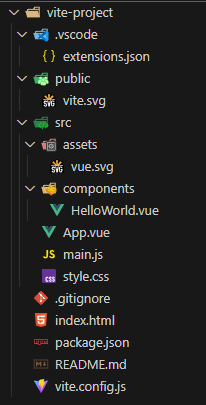
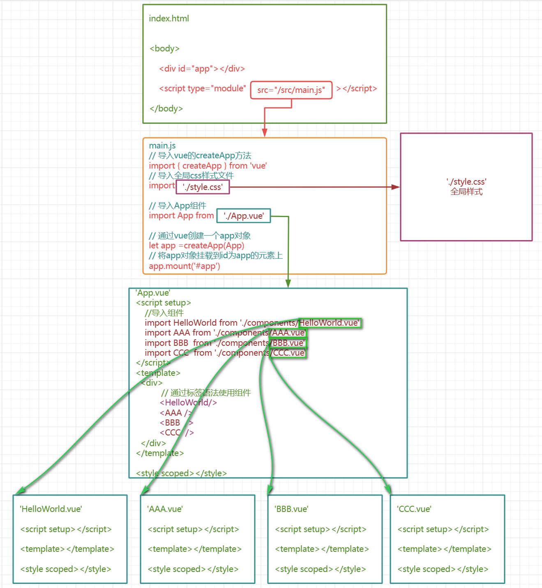

## es6

> 于**2015**年发布，是原来的ECMAScript标准的第六个版本


### 变量和模板字符串

**let&var**：

+ let 不能重复声明

+ let有块级作用域，非函数的花括号遇见let会有块级作用域，也就是只能在花括号里面访问。

+ let不会预解析进行变量提升

+ let 定义的全局变量不会作为window的属性

**const&var**：

+ const和let一样有块作用域
+ const定义的变量指向的那个内存地址所保存的数据不得改动。

**模板字符串**，使用反引号标识

+ 字符串中可以出现换行符

+ 可以使用` ${xxx}` 形式输出变量和拼接变量


### 解析表达式

+ 数组解构赋值

```javascript
let [a, b, c] = [1, 2, 3]; //新增变量名任意合法即可，本质是按照顺序进行初始化变量的值
console.log(a); // 1
console.log(b); // 2
console.log(c); // 3

let [a, b, c, d = 4] = [1, 2, 3];
console.log(d); // 4
```

+ 对象解构赋值

```javascript
let {a, b} = {a: 1, b: 2};
//新增变量名必须和属性名相同，本质是初始化变量的值为对象中同名属性的值
//等价于 let a = 对象.a  let b = 对象.b
  
console.log(a); // 1
console.log(b); // 2

let {a: x, b: y} = {a: 1, b: 2}; //为标识符分配不同的变量名称
console.log(x); // 1
console.log(y); // 2
```

+ 函数参数解构赋值

```javascript
function add([x, y]) {
  return x + y;
}
add([1, 2]); // 3
```


### 箭头函数

```html
<script>

    //ES6 允许使用“箭头”（=>）定义函数。
    //1. 函数声明
    let fn1 = function(){}
    let fn2 = ()=>{} //箭头函数,此处不需要书写function关键字
    let fn3 = x =>{} //单参数可以省略(),多参数无参数不可以!
    let fn4 = x => console.log(x) //只有一行方法体可以省略{};
    let fun5 = x => x + 1 //当函数体只有一句返回值时，可以省略花括号和 return 语句
    //2. 使用特点 箭头函数this关键字
    // 在 JavaScript 中，this 关键字通常用来引用函数所在的对象，
    // 或者在函数本身作为构造函数时，来引用新对象的实例。
    // 但是在箭头函数中，this 的含义与常规函数定义中的含义不同，
    // 并且是由箭头函数定义时的上下文来决定的，而不是由函数调用时的上下文来决定的。
    // 箭头函数没有自己的this，this指向的是外层上下文环境的this
    
    let person ={
        name:"张三",
        showName:function (){
            console.log(this) //  这里的this是person
            console.log(this.name)
        },
        viewName: () =>{
            console.log(this) //  这里的this是window
            console.log(this.name)
        }
    }
    person.showName()
    person.viewName()
 
    //this应用
    function Counter() {
        this.count = 0;
        setInterval(() => {
            // 这里的 this 是上一层作用域中的 this，即 Counter实例化对象
            this.count++;
            console.log(this.count);
        }, 1000);
    }
    let counter = new Counter();

</script>
```

案例：

```html
<!DOCTYPE html>
<html lang="en">
<head>
    <meta charset="UTF-8">
    <title>Document</title>
    <style>
        #xdd{
            display: inline-block;
            width: 200px;
            height: 200px;
            background-color: red;
        }
    </style>
</head>
<body>
    <div id="xdd"></div>
    <script>
       let xdd = document.getElementById("xdd");
       // 方案1 
       xdd.onclick = function(){
            console.log(this)
            let _this= this;  //this 是<div id="xdd"></div>
            //开启定时器
            setTimeout(function(){
                console.log(this) //this是window
                //变粉色
                _this.style.backgroundColor = 'pink';
            },2000);
        }
        // // 方案2
        xdd.onclick = function(){
            console.log(this) // this是<div id="xdd"></div>
            //开启定时器
            setTimeout(()=>{
                console.log(this)// 使用setTimeout() 方法所在环境时的this对象
                //变粉色
                this.style.backgroundColor = 'pink';
            },2000);
        }
    </script>
</body>
</html>
```


+ **rest和spread**

```html
<script>
    // 1 参数列表中多个普通参数  普通函数和箭头函数中都支持
    let fun1 = function (a,b,c,d=10){console.log(a,b,c,d)}
    let fun2 = (a,b,c,d=10) =>{console.log(a,b,c,d)}
    fun1(1,2,3)
    fun2(1,2,3,4)
    // 2 ...作为参数列表,称之为rest参数 普通函数和箭头函数中都支持 ,因为箭头函数中无法使用arguments,rest是一种解决方案
    let fun3 = function (...args){console.log(args)}
    let fun4 = (...args) =>{console.log(args)}
    fun3(1,2,3)
    fun4(1,2,3,4)
    // rest参数在一个参数列表中的最后一个只,这也就无形之中要求一个参数列表中只能有一个rest参数
    //let fun5 =  (...args,...args2) =>{} // 这里报错
</script>
```

```html
<script>
    let arr =[1,2,3]
    //let arrSpread = ...arr;// 这样不可以,...arr必须在调用方法时作为实参使用
    let fun1 =(a,b,c) =>{
        console.log(a,b,c)
    }
    // 调用方法时,对arr进行转换 转换为1,2,3 
    fun1(...arr)
    //应用场景1 合并数组
    let arr2=[4,5,6]
    let arr3=[...arr,...arr2]
    console.log(arr3)
    //应用场景2 合并对象属性
    let p1={name:"张三"}
    let p2={age:10}
    let p3={gender:"boy"}
    let person ={...p1,...p2,...p3}
    console.log(person)

</script>
```


### es6的对象创建和拷贝

+ 对象创建的语法糖

```javascript
class Person{
      // 属性
      #n;
      age;
      get name(){
          return this.n;
      }
      set name(n){
          this.n =n;
      }
      // 实例方法
      eat(food){
          console.log(this.age+"岁的"+this.n+"用筷子吃"+food)
      }
      // 静态方法
      static sum(a,b){
          return a+b;
      }
      // 构造器
      constructor(name,age){
          this.n=name;
          this.age = age;

      }
  }
  let person =new Person("张三",10);
  // 访问对象属性
  // 调用对象方法
  console.log(person.name)
  console.log(person.n)
  person.name="小明"
  console.log(person.age)
  person.eat("火锅")
  console.log(Person.sum(1,2))

  class Student extends  Person{
      grade ;
      score ;
      study(){

      }
      constructor(name,age ) {
          super(name,age);
      }
  }

  let stu =new Student("学生小李",18);
  stu.eat("面条")
```

+ 浅拷贝

```html
<script>
    let arr  =['java','c','python']
    let person ={
        name:'张三',
        language:arr
    }
    // 浅拷贝,person2和person指向相同的内存
    let person2 = person;
    person2.name="小黑"
    console.log(person.name)
</script>
```

+ 深拷贝

```html
<script>
    let arr  =['java','c','python']
    let person ={
        name:'张三',
        language:arr
    }
    // 深拷贝,通过JSON和字符串的转换形成一个新的对象
    let person2 = JSON.parse(JSON.stringify(person))
    person2.name="小黑"
    console.log(person.name)
    console.log(person2.name) 
</script>
```


### es6的模块化处理

端模块化有多种规范和实现，包括 CommonJS、AMD 和 ES6 模块化。ES6 模块化是 JavaScript 语言的模块标准，使用 import 和 export 关键字来实现模块的导入和导出。

+ ES6模块化的几种暴露和导入方式
  + 分别导出
  + 统一导出
  + 默认导出
+ ES6中无论以何种方式导出,导出的都是一个对象,导出的内容都可以理解为是向这个对象中添加属性或者方法


#### 分别导出

+ module.js 向外分别暴露成员

``` javascript
//1.分别暴露
// 模块想对外导出,添加export关键字即可!
// 导出一个变量
export const PI = 3.14
// 导出一个函数
export function sum(a, b) {
  return a + b;
}
// 导出一个类
export class Person {
  constructor(name, age) {
    this.name = name;
    this.age = age;
  }
  sayHello() {
    console.log(`Hello, my name is ${this.name}, I'm ${this.age} years old.`);
  }
}
```

+ app.js 导入module.js中的成员

``` javascript
/* 
    *代表module.js中的所有成员
    m1代表所有成员所属的对象
*/
import * as m1 from './module.js'
// 使用暴露的属性
console.log(m1.PI)
// 调用暴露的方法
let result =m1.sum(10,20)
console.log(result)
// 使用暴露的Person类
let person =new m1.Person('张三',10)
person.sayHello()
```

+ index.html作为程序启动的入口  导入 app.js  

``` html
<!-- 导入JS文件 添加type='module' 属性,否则不支持ES6的模块化 -->
<script src="./app.js" type="module" /> 
```


#### 统一导出

+ module.js向外统一导出成员

``` javascript
//2.统一暴露
// 模块想对外导出,export统一暴露想暴露的内容!
// 定义一个常量
const PI = 3.14
// 定义一个函数
function sum(a, b) {
  return a + b;
}
// 定义一个类
class Person {
  constructor(name, age) {
    this.name = name;
    this.age = age;
  }
  sayHello() {
    console.log(`Hello, my name is ${this.name}, I'm ${this.age} years old.`);
  }
}
// 统一对外导出(暴露)
export {
	PI,
    sum,
    Person
}
```

+ app.js导入module.js中的成员

``` javascript
/* 
    {}中导入要使用的来自于module.js中的成员
    {}中导入的名称要和module.js中导出的一致,也可以在此处起别名
    {}中如果定义了别名,那么在当前模块中就只能使用别名
    {}中导入成员的顺序可以不是暴露的顺序
    一个模块中可以同时有多个import
    多个import可以导入多个不同的模块,也可以是同一个模块
*/
//import {PI ,Person ,sum }  from './module.js'
//import {PI as pi,Person as People,sum as add}  from './module.js'
import {PI ,Person ,sum,PI as pi,Person as People,sum as add}  from './module.js'
// 使用暴露的属性
console.log(PI)
console.log(pi)
// 调用暴露的方法
let result1 =sum(10,20)
console.log(result1)
let result2 =add(10,20)
console.log(result2)
// 使用暴露的Person类
let person1 =new Person('张三',10)
person1.sayHello()
let person2 =new People('李四',11)
person2.sayHello()
```


#### 默认导出

+ modules混合向外导出

``` javascript
// 3默认和混合暴露
/* 
    默认暴露语法  export default sum
    默认暴露相当于是在暴露的对象中增加了一个名字为default的属性
    三种暴露方式可以在一个module中混合使用

*/
export const PI = 3.14
// 导出一个函数
function sum(a, b) {
  return a + b;
}
// 导出一个类
class Person {
  constructor(name, age) {
    this.name = name;
    this.age = age;
  }
  sayHello() {
    console.log(`Hello, my name is ${this.name}, I'm ${this.age} years old.`);
  }
}

// 导出默认
export default sum
// 统一导出
export {
   Person
}

```

+ app.js 的default和其他导入写法混用

``` javascript
/* 
    *代表module.js中的所有成员
    m1代表所有成员所属的对象
*/
import * as m1 from './module.js'
import {default as add} from './module.js' // 用的少
import add2 from './module.js' // 等效于 import {default as add2} from './module.js'

// 调用暴露的方法
let result =m1.default(10,20)
console.log(result)
let result2 =add(10,20)
console.log(result2)
let result3 =add2(10,20)
console.log(result3)

// 引入其他方式暴露的内容
import {PI,Person} from './module.js'
// 使用暴露的Person类
let person =new Person('张三',10)
person.sayHello()
// 使用暴露的属性
console.log(PI)
```


## node.js环境搭建

node.js特点：

-   单线程，采用了**事件驱动、异步 I/O 模型**，可以处理高并发请求。
-   轻量级
-   模块化，Node.js 内置了大量模块，同时也可以通过第三方模块扩展功能。
-   跨平台


### npm的配置

+ 安装node
+ 配置npm阿里镜像源
  + `npm config set registry http://registry.npm.taobao.org`
  + `npm config get registry`
+ 配置全局依赖安装位置
  + `npm config set prefix "D:\GlobalNodeModules"`
  + `npm config get prefix`

+ npm更新
  + `npm install -g npm`
+ npm清除缓存
  + `npm cache clean --force`


### npm常用命令

+ 项目初始化
  + npm init
    + 进入一个vscode创建好的项目中, 执行 npm init 命令后，npm 会引导在命令行界面上回答一些问题,例如项目名称、版本号、作者、许可证等信息，并最终生成一个package.json 文件。package.json信息会包含项目基本信息！类似maven的pom.xml
  + npm init -y
    + 执行，所有信息使用当前文件夹的默认值！不用挨个填写！
+ 安装依赖
  + npm install 包名 或者 npm install 包名@版本号
    + 安装包或者指定版本的依赖包(安装到当前项目中)
  + npm install -g 包名
    + 安装全局依赖包(安装到`d:/GlobalNodeModules`)则可以在任何项目中使用它，而无需在每个项目中独立安装该包。
  + npm install
    + 安装package.json中的所有记录的依赖
+ 升级依赖
  + `npm update 包名`，升级到最新版本
+ 卸载依赖
  + `npm uninstall 包名`
+ 查看项目依赖
  + `npm ls`
+ 查看全局依赖
  + `npm list -g`

+ 运行命令

  + npm run 命令是在执行 npm 脚本时使用的命令。npm 脚本是一组在 package.json 文件中定义的可执行命令。npm 脚本可用于启动应用程序，运行测试，生成文档等，还可以自定义命令以及配置需要运行的脚本。

  + 在 package.json 文件中，scripts 字段是一个对象，其中包含一组键值对，键是要运行的脚本的名称，值是要执行的命令。如以下一个简单的 package.json 文件：

    + 

      ```json
      {
      	"name": "my-app",
        	"version": "1.0.0",
          "scripts": {
              "start": "node index.js",
              "test": "jest",
              "build": "webpack"
          },
          "dependencies": {
              "express": "^4.17.1",
              "jest": "^27.1.0",
              "webpack": "^5.39.0"
          }
      }
      ```

  + scripts 对象包含 start、test 和 build 三个脚本。当运行 npm run start 时，将运行 node index.js，并启动应用程序。同样，运行 npm run test 时，将运行 Jest 测试套件，而 npm run build 将运行 webpack 命令以生成最终的构建输出。


## vue3

 **Vue的两个核心功能：**

-   **声明式渲染**：Vue 基于标准 HTML 拓展了一套模板语法，使得我们可以声明式地描述最终输出的 HTML 和 JavaScript 状态之间的关系。
-   **响应性**：Vue 会自动跟踪 JavaScript 状态并在其发生变化时响应式地更新 DOM  


### vite

#### vite创建、启动、停止Vue3项目

+ vite创建项目：`npm create vite@latest`

+ 进入项目目录

  + ` cd ./项目名`
  + `npm install`

+ 启动项目

  + 项目下的package.json

    + 

      ```json
      {
        "name": "vite-project",
        "private": true,
        "version": "0.0.0",
        "type": "module",
        "scripts": {
          "dev": "vite", // 启动开发服务器
          "build": "vite build", // 为生产环境构建产物
          "preview": "vite preview" // 本地预览生产构建产物
        },
        "dependencies": {
          "vue": "^3.5.13"
        },
        "devDependencies": {
          "@vitejs/plugin-vue": "^5.2.1",
          "vite": "^6.0.5"
        }
      }
      
      ```

  + `npm run dev`

+ 停止运行：命令行 ctrl+c


#### 项目目录结构



-   public/ 目录：用于存放一些公共资源，如 HTML 文件、图像、字体等，这些资源会被直接复制到构建出的目标目录中。
-   src/ 目录：存放项目的源代码，包括 JavaScript、CSS、Vue 组件、图像和字体等资源。在开发过程中，这些文件会被 Vite 实时编译和处理，并在浏览器中进行实时预览和调试。src内部目录：
    -   `assets/` ：用于存放一些项目中用到的静态资源，如图片、字体、样式文件等。
    -   `components/` ：用于存放组件相关的文件。组件是代码复用的一种方式，用于抽象出一个可复用的 UI 部件，方便在不同的场景中进行重复使用。
    -   `layouts/` ：用于存放布局组件的文件。布局组件通常负责整个应用程序的整体布局，如头部、底部、导航菜单等。
    -   `pages/` ：用于存放页面级别的组件文件，通常是路由对应的组件文件。在这个目录下，可以创建对应的文件夹，用于存储不同的页面组件。
    -   `plugins/` ：用于存放 Vite 插件相关的文件，可以按需加载不同的插件来实现不同的功能，如自动化测试、代码压缩等。
    -   `router/` ：用于存放 Vue.js 的路由配置文件，负责管理视图和 URL 之间的映射关系，方便实现页面之间的跳转和数据传递。
    -   `store/` ：用于存放 Vuex 状态管理相关的文件，负责管理应用程序中的数据和状态，方便统一管理和共享数据，提高开发效率。
    -   `utils/` ：用于存放一些通用的工具函数，如日期处理函数、字符串操作函数等。
-   vite.config.js 文件：Vite 的配置文件，可以通过该文件配置项目的参数、插件、打包优化等。该文件可以使用 CommonJS 或 ES6 模块的语法进行配置。
-   package.json 文件：标准的 Node.js 项目配置文件，包含了项目的基本信息和依赖关系。其中可以通过 scripts 字段定义几个命令，如 dev、build、serve 等，用于启动开发、构建和启动本地服务器等操作。
-   Vite 项目的入口为 src/main.js 文件，这是 Vue.js 应用程序的启动文件，也是整个前端应用程序的入口文件。在该文件中，通常会引入 Vue.js 及其相关插件和组件，同时会创建 Vue 实例，挂载到 HTML 页面上指定的 DOM 元素中。

+ 设置运行端口（vite.config.js）

  + 

    ```js
    //修改vite项目配置文件 vite.config.js
    export default defineConfig({
      plugins: [vue()],
      server:{
        port:3000
      }
    })
    ```


#### 项目组件

+ vue文件
  + .vue文件对js/css/html统一封装
    + template标签     代表组件的html部分代码	代替传统的.html文件
    + script标签           代表组件的js代码 代替传统的.js文件
    + style标签            代表组件的css样式代码 代替传统的.css文件
+ index.html是项目的入口,其中 `<div id ='app'></div>`是用于挂载所有组建的元素
+ index.html中的script标签引入了一个main.js文件,具体的挂载过程在main.js中执行
+ main.js是vue工程中非常重要的文件,他决定这项目使用哪些依赖,导入的第一个组件
+ App.vue是vue中的核心组件,所有的其他组件都要通过该组件进行导入,该组件通过路由可以控制页面的切换




#### 响应式入门和setup函数

```vue
<script type="module">
    //存储vue页面逻辑js代码
    import {ref} from 'vue'
    export default{
        setup(){
            //非响应式数据: 修改后VUE不会更新DOM
            //响应式数据:   修改后VUE会更新DOM
            //VUE2中数据默认是响应式的
            //VUE3中数据要经过ref或者reactive处理后才是响应式的
            //ref是VUE3框架提供的一个函数,需要导入
            //let counter = 1
            //ref处理的响应式数据在js编码修改的时候需要通过.value操作
            //ref响应式数据在绑定到html上时不需要.value

            let counter = ref(1)
            function increase(){
                // 通过.value修改响应式数据
                counter.value++
            }
            function decrease(){
                counter.value--
            }
            return {
                counter,
                increase,
                decrease
            }
        }
    }
</script>
<template>
    <div>
      <button @click="decrease()">-</button>
      {{ counter }}
      <button @click="increase()">+</button>
    </div>
    
</template>

<style scoped>
    button{
        border: 1px solid red;
    }
</style>
```

+ setup函数和语法糖

```vue
<script type="module" setup>
   
/* <script type="module" setup> 通过setup关键字
可以省略 export default {setup(){   return{}}}这些冗余的语法结构 */
    import {ref} from 'vue'
    // 定义响应式数据
    let counter = ref(1)
    // 定义函数
    function increase(){
        counter.value++
    }
    function decrease(){
        counter.value--
    }
    
</script>
<template>
    <div>
      <button @click="decrease()">-</button>
      {{ counter }}
      <button @click="increase()">+</button>
    </div>
    
</template>

<style scoped>
    button{
        border: 1px solid red;
    }
</style>

```


#### 样式导入方式

+ 在全局main.js中引入

```javascript
import './style/reset.css' //书写引入的资源的相对路径即可！
```

+ vue文件script标签内引入

```javascript
import './style/reset.css'
```

+ Vue文件style标签内引入

```javascript
@import './style/reset.css'
```


### vue3视图渲染

#### 模板语法

+ **插值表达式**:最基本的数据绑定形式是文本插值，它使用双大括号`{{}}`

  + 插值表达式不绝对依赖标签,其位置相对自由

  + 插值表达式中支持javascript的运算表达式

  + 插值表达式中也支持函数的调用

  + 

     ```vue
     <script setup type="module">
       let msg ="hello vue3"
       let getMsg= ()=>{
         return 'hello vue3 message'
       }
       let age = 19
       let bee = '蜜 蜂'
       // 购物车
       const carts = [{name:'可乐',price:3,number:10},{name:'薯片',price:6,number:8}];
       //计算购物车总金额
       function compute(){
           let count = 0;
           for(let index in carts){
               count += carts[index].price*carts[index].number;
           }
           return count;
       }
     </script>
     
     <template>
       <div>
         <h1>{{ msg }}</h1>
         msg的值为: {{ msg }} <br>
         getMsg返回的值为:{{ getMsg() }}  <br>
         是否成年: {{ age>=18?'true':'false' }} <br>
         反转: {{ bee.split(' ').reverse().join('-') }} <br>
         购物车总金额: {{ compute() }} <br/>
         购物车总金额: {{carts[0].price*carts[0].number + carts[1].price*carts[1].number}} <br>
       </div>
     </template>
     
     <style scoped>
     
     </style>
     ```

+ **`v-***`**

  + v-***的命令必须依赖元素,并且要写在元素的开始标签中

  + v-***指令支持ES6中的字符串模板

  + 插值表达式中支持javascript的运算表达式

  + 插值表达式中也支持函数的调用

  + v-text可以将数据渲染成双标签中间的文本,但是不识别html元素结构的文本

  + v-html可以将数据渲染成双标签中间的文本,识别html元素结构的文本

  + 

    ```vue
    <script setup type="module">
      let msg ='hello vue3'
      let getMsg= ()=>{
        return msg
      }
      let age = 19
      let bee = '蜜 蜂'
      let redMsg ='<font color=\'red\'>msg</font>'
      let greenMsg =`<font color=\'green\'>${msg}</font>`
    </script>
    
    <template>
      <div>
        <span v-text='msg'></span> <br>
        <span v-text='redMsg'></span> <br>
        <span v-text='getMsg()'></span> <br>
        <span v-text='age>18?"成年":"未成年"'></span> <br>
        <span v-text='bee.split(" ").reverse().join("-")'></span> <br>
        <span v-html='msg'></span> <br>
        <span v-html='redMsg'></span> <br>
        <span v-html='greenMsg'></span> <br>
        <span v-html="`<font color='green'>${msg}</font>`"></span> <br>
      </div>
    </template>
    
    <style scoped>
    
    </style>
    ```

+ **Attribute属性渲染**

  + 由于插值表达式不能直接放在标签的属性中,所有要渲染元素的属性就应该使用v-bind

  + v-bind可以用于渲染任何元素的属性,语法为 `v-bind:属性名='数据名'`, 可以简写为 `:属性名='数据名'`

  + 

    ```vue
    <script setup type="module">
      const data = {
        name:'尚硅谷',
        url:"http://www.atguigu.com",
        logo:"http://www.atguigu.com/images/index_new/logo.png"
      }
    </script>
    
    <template>
      <div>
        <a 
          v-bind:href='data.url' 
          target="_self">
          
          <br>
          <input type="button" 
                 :value="`点击访问${data.name}`">
        </a>
      </div>
    </template>
    
    <style scoped>
    </style>
    ```


+ 事件的绑定

  + `v-on:click="handler"` 或简写为 `@click="handler"`

  + vue中的事件名=原生事件名去掉`on` 前缀   如:`onClick --> click`

  + handler的值可以是方法事件处理器,也可以是内联事件处理器

  + 绑定事件时,可以通过一些绑定的修饰符,常见的事件修饰符如下

    + `.once：只触发一次事件。`
    + `.prevent：阻止默认事件。`
    + .stop：阻止事件冒泡。
    + .capture：使用事件捕获模式而不是冒泡模式。
    + .self：只在事件发送者自身触发时才触发事件。

  + 

    ```vue
    <script setup type="module">
      import {ref} from 'vue'
      // 响应式数据 当发生变化时,会自动更新 dom树
      let count=ref(0)
      let addCount= ()=>{
        count.value++
      }
      let incrCount= (event)=>{
        count.value++
        // 通过事件对象阻止组件的默认行为
        event.preventDefault();
        
      }
    </script>
    
    <template>
      <div>
        <h1>count的值是:{{ count }}</h1>
        <!-- 方法事件处理器 -->
        <button v-on:click="addCount()">addCount</button> <br>
        <!-- 内联事件处理器 -->
        <button @click="count++">incrCount</button> <br>
        <!-- 事件修饰符 once 只绑定事件一次 -->
        <button @click.once="count++">addOnce</button> <br>
        <!-- 事件修饰符 prevent 阻止组件的默认行为 -->
        <a href="http://www.atguigu.com" target="_blank" @click.prevent="count++">prevent</a> <br>
        <!-- 原生js方式阻止组件默认行为 (推荐) -->
        <a href="http://www.atguigu.com" target="_blank" @click="incrCount($event)">prevent</a> <br>
      </div>
    </template>
    
    <style scoped>
    
    </style>
    ```


#### 响应式基础

+ `ref` ：可以将一个基本类型的数据（如字符串，数字等）转换为一个响应式对象。 `ref` 只能包裹单一元素
  + 在访问该对象时使用 `.value` 来获取其实际值。
+ 使用 `reactive()` 函数创建一个响应式对象或数组
  +  `reactive` 可以递归追踪所有响应式对象内部的变化，从而保证界面的自动更新。
  + `ref` 适用与简单情形下的数据双向绑定，对于只有一个字符等基本类型数据或自定义组件等情况，建议可以使用 `ref`；而对于对象、函数等较为复杂的数据结构，以及需要递归监听的属性变化，建议使用 `reactive`。
+ toRef基于reactive响应式对象上的一个属性，创建一个对应的 ref响应式数据。这样创建的 ref 与其源属性保持同步：改变源属性的值将更新 ref 的值，反之亦然。toRefs将一个响应式对象多个属性转换为一个多个ref数据，这个普通对象的每个属性都是指向源对象相应属性的 ref。每个单独的 ref 都是使用 toRef()创建的。

```vue
<script type="module" setup>
    /* 从vue中引入reactive方法 */
    import {ref,reactive,toRef,toRefs} from 'vue'
    let data = reactive({
      counter:0,
      name:"test"
    })

    // 将一个reactive响应式对象中的某个属性转换成一个ref响应式对象
    let ct =toRef(data,'counter');
    // 将一个reactive响应式对象中的多个属性转换成多个ref响应式对象
    let {counter,name} = toRefs(data)

    function show(){
        alert(data.counter);
        // 获取ref的响应对象,需要通过.value属性
        alert(counter.value);
        alert(name.value)
    }
    /* 函数中要操作ref处理过的数据,需要通过.value形式 */
    let decr = () =>{
      data.counter--;
    }
    let incr = () =>{
      /* ref响应式数据,要通过.value属性访问 */
      counter.value++;
    }
</script>

<template>
  <div>
    <button @click="data.counter--">-</button> 
    <button @click="decr()">-</button> 
    {{ data.counter }} 
    &amp;
    {{ ct }} 
    <button @click="data.counter++">+</button>
    <button @click="incr()">+</button> 
    <hr>
    <button @click="show()">显示counter值</button>
   </div>
</template> 

<style scoped>

</style>

```


#### 条件和列表渲染

+ `v-if`
  + `v-if='表达式' `只会在指令的表达式返回真值时才被渲染
  + 可以使用 `v-else`，但必须跟在一个 `v-if` 元素后面，否则它将不会被识别。
+ `v-show`
  + 会在DOM中保留元素，仅切换了该元素上名为 `display` 的 CSS 属性。
  + `v-show` 不支持在 `<template>` 元素上使用，也不能和 `v-else` 搭配使用。
+ `v-for`

#### 双向绑定

+ **单向绑定**: 响应式数据的变化会更新dom树,但是dom树上用户的操作造成的数据改变不会同步更新到响应式数据
+ **双向绑定**: 响应式数据的变化会更新dom树,但是dom树上用户的操作造成的数据改变会同步更新到响应式数据
  + 用户通过表单标签才能够输入数据,所以双向绑定都是应用到表单标签上的,其他标签不行
  + v-model专门用于双向绑定表单标签的value属性,语法为 `v-model:value=''`,可以简写为 `v-model=''`
  + v-model还可以用于各种不同类型的输入，`<textarea>`、`<select>` 元素。
