# 存储引擎

## MySQL体系结构

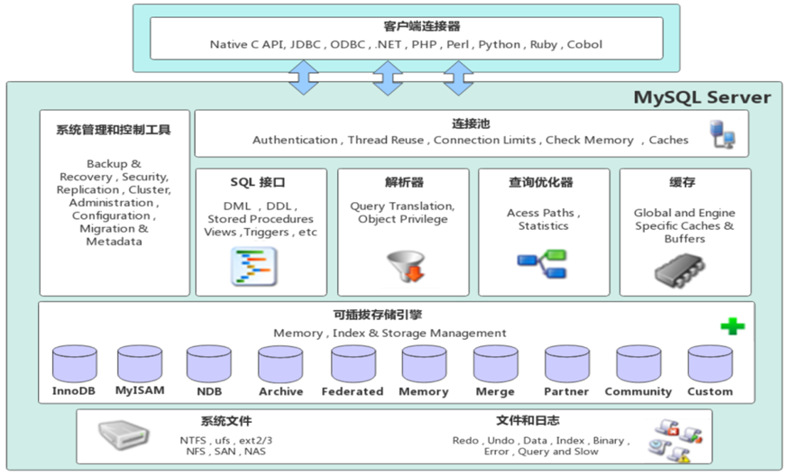

+ 连接层

最上层是一些客户端和链接服务，包含本地sock 通信和大多数基于客户端/服务端工具实现的通信。主要完成一些类似于连接处理、授权认证、及相关的安全方案。在该层上引入了线程池的概念，为通过认证安全接入的客户端提供线程。同样在该层上可以实现基于SSL的安全链接。服务器也会为安全接入的每个客户端验证它所具有的操作权限。

+ 服务层

第二层架构主要完成大多数的核心服务功能，如SQL接口，并完成缓存的查询，SQL的分析和优化，部分内置函数的执行。所有跨存储引擎的功能也在这一层实现，如 过程、函数等。在该层，服务器会解析查询并创建相应的内部解析树，并对其完成相应的优化如确定表的查询的顺序，是否利用索引等，最后生成相应的执行操作。如果是select语句，服务器还会查询内部的缓存，如果缓存空间足够大，这样在解决大量读操作的环境中能够很好的提升系统的性能。

+ 引擎层

存储引擎层， 存储引擎真正的负责了MySQL中数据的存储和提取，服务器通过API和存储引擎进行通信。不同的存储引擎具有不同的功能，可以根据自己的需选取合适的存储引擎。数据库中的索引是在存储引擎层实现的。

+ 存储层

数据存储层， 主要是将数据(如: redolog、undolog、数据、索引、二进制日志、错误日志、查询日志、慢查询日志等)存储在文件系统之上，并完成与存储引擎的交互。和其他数据库相比，MySQL有点与众不同，它的架构可以在多种不同场景中应用并发挥良好作用。主要体现在存储引擎上，插件式的存储引擎架构，将查询处理和其他的系统任务以及数据的存储提取分离。这种架构可以根据业务的需求和实际需要选择合适的存储引擎。

## 存储引擎介绍

存储引擎就是存储数据、建立索引、更新/查询数据等技术的实现方式 。存储引擎是基于表的，而不是基于库的，所以存储引擎也可被称为表类型。可以在创建表的时候，来指定选择的存储引擎，如果没有指定将自动选择默认的存储引擎。

+ 建表时指定存储引擎

```sql
CREATE TABLE 表名(
    字段1 字段1类型 [ COMMENT 字段1注释 ] ,
    ......
    字段n 字段n类型 [COMMENT 字段n注释 ]
) ENGINE = INNODB [ COMMENT 表注释 ] ;
```

+ 查询当前数据库支持的存储引擎

```sql
show engines;
```

### 各存储引擎特点

#### InnoDB

mysql的默认存储引擎

特点：

+ DML操作遵循ACID模型，支持事务；
+ 行级锁，提高并发访问性能；
+ 支持外键FOREIGN KEY约束，保证数据的完整性和正确性；

文件：

xxx.ibd：xxx代表的是表名，innoDB引擎的每张表都会对应这样一个表空间文件，存储该表的表结构（frm-早期的 、sdi-新版的）、数据和索引。

如果该参数开启，代表对于InnoDB引擎的表，每一张表都对应一个ibd文件:

```sql
mysql> show variables like 'innodb_file_per_table';
+-----------------------+-------+
| Variable_name         | Value |
+-----------------------+-------+
| innodb_file_per_table | ON    |
+-----------------------+-------+
1 row in set (0.01 sec)

mysql> 
```

在win系统中，MySQL的数据存放目录： `C:\ProgramData\MySQL\MySQL Server 8.0\Data`，这个目录下有很多文件夹，不同的文件夹代表不同的数据库，文件夹下面的每个.ibd文件代表每张数据库表。

逻辑存储结构：


+ **表空间** : InnoDB存储引擎逻辑结构的最高层，ibd文件其实就是表空间文件，在表空间中可以包含多个Segment段。
+ **段** : 表空间是由各个段组成的， 常见的段有数据段、索引段、回滚段等。InnoDB中对于段的管理，都是引擎自身完成，不需要人为对其控制，一个段中包含多个区。
+ **区** : 区是表空间的单元结构，每个区的大小为1M。 默认情况下， InnoDB存储引擎页大小为16K， 即一个区中一共有64个连续的页。
+ **页** : 页是组成区的最小单元，页也是InnoDB 存储引擎磁盘管理的最小单元，每个页的大小默认为 16KB。为了保证页的连续性，InnoDB 存储引擎每次从磁盘申请 4-5 个区。
+ **行** : InnoDB 存储引擎是面向行的，也就是说数据是按行进行存放的，在每一行中除了定义表时所指定的字段以外，还包含两个隐藏字段。

#### MyISAM

mysql早期的默认存储引擎

特点：

+ 不支持事务，不支持外键
+ 支持表锁，不支持行锁
+ 访问速度快

文件：

+ xxx.sdi：存储表结构信息
+ xxx.MYD: 存储数据
+ xxx.MYI: 存储索引

#### MeMory

表数据存储在内存中的，由于受到硬件问题、或断电问题的影响，只能将这些表作为临时表或缓存使用。

特点：

+ 内存存放
+ hash索引（默认）

文件：

+ xxx.sdi：存储表结构信息


### 存储引擎区别

| 特点         | InnoDB              | MyISAM | Memory |
| ------------ | ------------------- | ------ | ------ |
| 存储限制     | 64TB                | 有     | 有     |
| 事务安全     | 支持                | -      | -      |
| 锁机制       | 行锁                | 表锁   | 表锁   |
| B+tree 索引  | 支持                | 支持   | 支持   |
| Hash 索引    | -                   | -      | 支持   |
| 全文索引     | 支持 (5.6 版本之后) | 支持   | -      |
| 空间使用     | 高                  | 低     | N/A    |
| 内存使用     | 高                  | 低     | 中等   |
| 批量插入速度 | 低                  | 高     | 高     |
| 支持外键     | 支持                | -      | -      |

> InnoDB引擎与MyISAM引擎的区别 ?
>
> ①. InnoDB引擎, 支持事务, 而MyISAM不支持。
>
> ②. InnoDB引擎, 支持行锁和表锁, 而MyISAM仅支持表锁, 不支持行锁。
>
> ③. InnoDB引擎, 支持外键, 而MyISAM是不支持的。


### 存储引擎选择

在选择存储引擎时，应该根据应用系统的特点选择合适的存储引擎。对于复杂的应用系统，还可以根据实际情况选择多种存储引擎进行组合。

+ InnoDB: 是Mysql的默认存储引擎，支持事务、外键。如果应用对事务的完整性有比较高的要求，在并发条件下要求数据的一致性，数据操作除了插入和查询之外，还包含很多的更新、删除操作，那么InnoDB存储引擎是比较合适的选择。

+ MyISAM ： 如果应用是以读操作和插入操作为主，只有很少的更新和删除操作，并且对事务的完整性、并发性要求不是很高，那么选择这个存储引擎是非常合适的。

+ MEMORY：将所有数据保存在内存中，访问速度快，通常用于临时表及缓存。MEMORY的缺陷就是对表的大小有限制，太大的表无法缓存在内存中，而且无法保障数据的安全性。


# 索引

## 索引特点

| 优势                                                         | 劣势                                                         |
| ------------------------------------------------------------ | ------------------------------------------------------------ |
| 提高数据检索的效率，降低数据库的 IO 成本                     | 索引列也是要占用空间的。                                     |
| 通过索引列对数据进行排序，降低数据排序的成本，降低 CPU 的消耗 | 索引大大提高了查询效率，同时却也降低更新表的速度，如对表进行 INSERT、UPDATE、DELETE 时，效率降低。 |


## 索引结构

### 概述

MySQL的索引是在存储引擎层实现的，不同的存储引擎有不同的索引结构，主要包含以下几种：

| 索引结构               | 描述                                                         |
| ---------------------- | ------------------------------------------------------------ |
| B+Tree 索引            | 最常见的索引类型，大部分引擎都支持 B + 树索引                |
| Hash 索引              | 底层数据结构是用哈希表实现的，只有精确匹配索引列的查询才有效，不支持范围查询 |
| R - tree (空间索引)    | 空间索引是 MyISAM 引擎的一个特殊索引类型，主要用于地理空间数据类型，通常使用较少 |
| Full - text (全文索引) | 是一种通过建立倒排索引，快速匹配文档的方式。类似于 Lucene, Solr, ES |


不同的存储引擎对于索引结构的支持：

| 索引        | InnoDB           | MyISAM | Memory |
| ----------- | ---------------- | ------ | ------ |
| B+tree 索引 | 支持             | 支持   | 支持   |
| Hash 索引   | 不支持           | 不支持 | 支持   |
| R-tree 索引 | 不支持           | 支持   | 不支持 |
| Full-text   | 5.6 版本之后支持 | 支持   | 不支持 |


### 二叉树

如果mysql采用二叉树索引结构，如果主键是顺序插入的，则会形成一个单向链表：

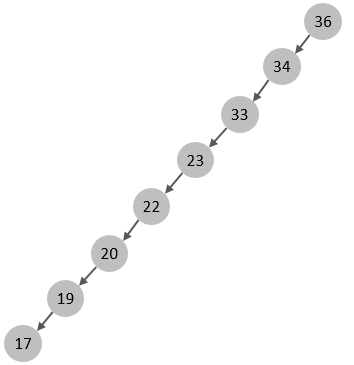

在大数据量情况下，层级较深，检索速度慢。

可以选择红黑树，红黑树是一颗自平衡二叉树，那这样即使是顺序插入数
据，最终形成的数据结构也是一颗平衡的二叉树：

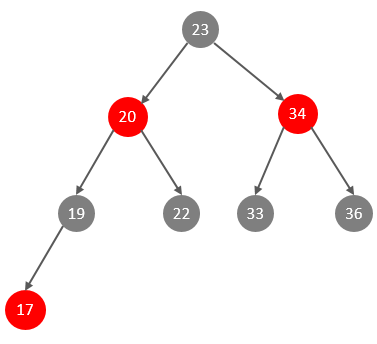

由于红黑树也是一颗二叉树，所以也会存在大数据量情况下，层级较深，检索速度慢。

所以，在MySQL的索引结构中，并没有选择二叉树或者红黑树，而选择的是B+Tree


### B-Tree

B-Tree，B树是一种多叉路衡查找树，相对于二叉树，B树每个节点可以有多个分支，即多叉。

以一颗最大度数（树的度数指的是一个节点的子节点个数）为5(5阶)的b-tree为例，那这个B树每个节点最多存储4个key，5个指针：


特点：

+ 一旦节点存储的key数量到达5，就会裂变，中间元素向上分裂。
+ 在B树中，非叶子节点和叶子节点都会存放数据。


### B+Tree

B+Tree是B-Tree的变种

以一颗最大度数为4（4阶）的b+tree为例：

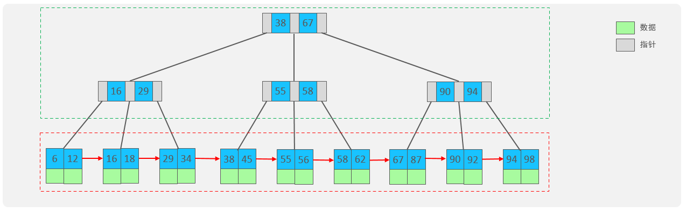

绿色框框起来的部分，是索引部分，仅仅起到索引数据的作用，不存储数据；红色框框起来的部分，是数据存储部分，在其叶子节点中要存储具体的数据。

与 B-Tree相比，主要有以下三点区别：

+ 所有的数据都会出现在叶子节点。
+ 叶子节点形成一个单向链表。
+ 非叶子节点仅仅起到索引数据作用，具体的数据都是在叶子节点存放的。

MySQL索引数据结构对经典的B+Tree进行了优化。在原B+Tree的基础上，增加一个指向相邻叶子节点的链表指针，就形成了带有顺序指针的B+Tree，提高区间访问的性能，利于排序。

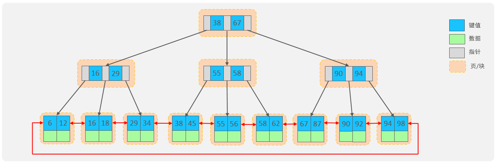


### Hash

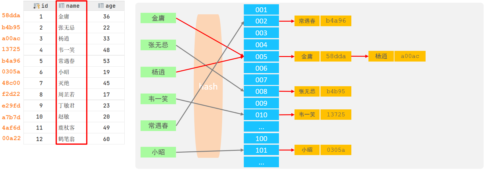

特点

+ Hash索引只能用于对等比较(=，in)，不支持范围查询（between，>，< ，...）
+ 无法利用索引完成排序操作
+ 查询效率高，通常(不存在hash冲突的情况)只需要一次检索就可以了，效率通常要高于B+tree索引

在MySQL中，支持hash索引的是Memory存储引擎。 而InnoDB中具有自适应hash功能，hash索引是InnoDB存储引擎根据B+Tree索引在指定条件下自动构建的。


> 为什么InnoDB存储引擎选择使用B+tree索引结构?
>
> + 相对于二叉树，层级更少，搜索效率高；
> + 对于B-tree，无论是叶子节点还是非叶子节点，都会保存数据，这样导致一页中存储的键值减少，指针跟着减少，要同样保存大量数据，只能增加树的高度，导致性能降低；
> + 相对Hash索引，B+tree支持范围匹配及排序操作；


## 索引分类

### 索引分类

在MySQL数据库，将索引的具体类型主要分为：主键索引、唯一索引、常规索引、全文索引

| 分类     | 含义                                                 | 特点                     | 关键字   |
| -------- | ---------------------------------------------------- | ------------------------ | -------- |
| 主键索引 | 针对于表中主键创建的索引                             | 默认自动创建，只能有一个 | PRIMARY  |
| 唯一索引 | 避免同一个表中某数据列中的值重复                     | 可以有多个               | UNIQUE   |
| 常规索引 | 快速定位特定数据                                     | 可以有多个               |          |
| 全文索引 | 全文索引查找的是文本中的关键词，而不是比较索引中的值 | 可以有多个               | FULLTEXT |


### 聚集索引&二级索引

在InnoDB存储引擎中，根据索引的存储形式，分为以下两种：

| 分类                       | 含义                                                       | 特点                 |
| -------------------------- | ---------------------------------------------------------- | -------------------- |
| 聚集索引 (Clustered Index) | 将数据存储与索引放到了一块，索引结构的叶子节点保存了行数据 | 必须有，而且只有一个 |
| 二级索引 (Secondary Index) | 将数据与索引分开存储，索引结构的叶子节点关联的是对应的主键 | 可以存在多个         |

**聚集索引选取规则**:

+ 如果存在主键，主键索引就是聚集索引。
+ 如果不存在主键，将使用第一个唯一（UNIQUE）索引作为聚集索引。
+ 如果表没有主键，且没有合适的唯一索引，则InnoDB会自动生成一个rowid作为隐藏的聚集索引。

聚集索引和二级索引的具体结构如下：


> 聚集索引的叶子节点下挂的是这一行的数据 。
> 二级索引的叶子节点下挂的是该字段值对应的主键值。

具体的查找过程：

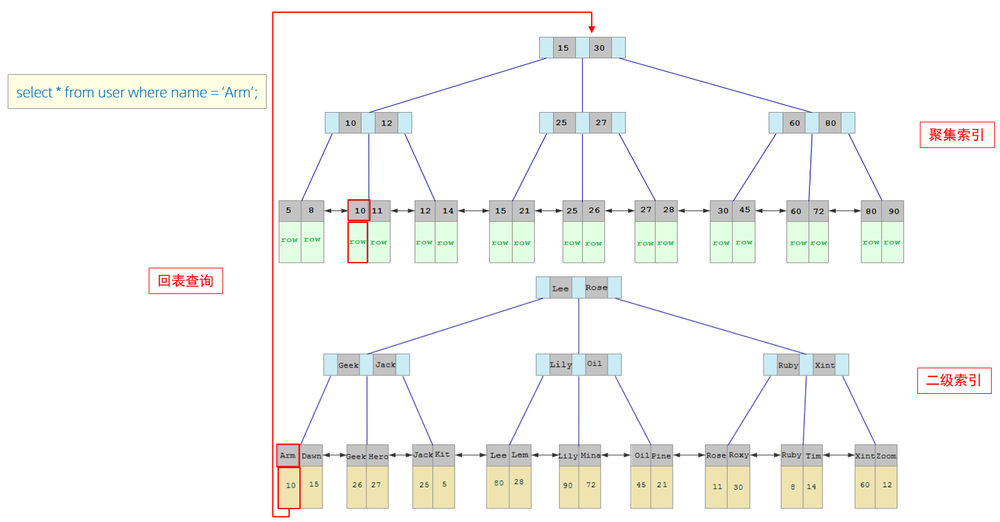

> 具体步骤：
>
> 1. 由于是根据name字段进行查询，所以先根据name='Arm'到name字段的二级索引中进行匹配查找。在二级索引中只能查找到 Arm 对应的主键值 10
> 2. 由于查询返回的数据是*，所以此时，还需要根据主键值10，到聚集索引中查找10对应的记录，最终找到10对应的行row。
> 3. 拿到这一行的数据，直接返回。
>
> 这种先到二级索引中查找数据，找到主键值，然后再到聚集索引中根据主键值，获取
> 数据的方式，就称之为回表查询。


> 一、以下两条SQL语句，那个执行效率高? 
> A. select * from user where id = 10 ; B. select * from user where name = 'Arm' ;
>
> A 语句的执行性能要高于B 语句。因为A语句直接走聚集索引，直接返回数据。 而B语句需要先查询name字段的二级索引，然后再查询聚集索引，也就是需要进行回表查询。

> 二、InnoDB主键索引的B+tree高度为多高呢?
>
> 假设一行数据大小为1k，一页中可以存储16行这样的数据。InnoDB的指针占用6个字节的空
> 间，主键即使为bigint，占用字节数为8。
>
> 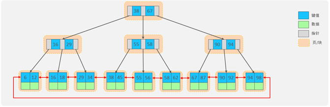
>
> 高度为2：
> 	n * 8 + (n + 1) * 6 = 16*1024 , 算出n约为 1170
> 	1171* 16 = 18736
> 	也就是说，如果树的高度为2，则可以存储 18000 多条记录。
> 高度为3：
> 	1171 * 1171 * 16 = 21939856
> 	也就是说，如果树的高度为3，则可以存储 2200w 左右的记录。


## 索引语法

+ 创建索引

```sql
CREATE [ UNIQUE | FULLTEXT ] INDEX index_name ON table_name (
index_col_name,... ) ;
```

+ 查看索引

```sql
SHOW INDEX 1 FROM table_name ;
```

+ 删除索引

```sql
DROP INDEX index_name ON table_name ;
```


### 测试

+ 创建表并插入数据

```sql
create table tb_user(
                        id int primary key auto_increment comment '主键',
                        name varchar(50) not null comment '用户名',
                        phone varchar(11) not null comment '手机号',
                        email varchar(100) comment '邮箱',
                        profession varchar(11) comment '专业',
                        age tinyint unsigned comment '年龄',
                        gender char(1) comment '性别 , 1: 男, 2: 女',
                        status char(1) comment '状态',
                        createtime datetime comment '创建时间'
) comment '系统用户表';


INSERT INTO test.tb_user (name, phone, email, profession, age, gender, status, createtime) VALUES ('吕布', '17799990000', 'lvbu666@163.com', '软件工程', 23, '1', '6', '2001-02-02 00:00:00');
INSERT INTO test.tb_user (name, phone, email, profession, age, gender, status, createtime) VALUES ('曹操', '17799990001', 'caocao666@qq.com', '通讯工程', 33, '1', '0', '2001-03-05 00:00:00');
INSERT INTO test.tb_user (name, phone, email, profession, age, gender, status, createtime) VALUES ('赵云', '17799990002', '17799990@139.com', '英语', 34, '1', '2', '2002-03-02 00:00:00');
INSERT INTO test.tb_user (name, phone, email, profession, age, gender, status, createtime) VALUES ('孙悟空', '17799990003', '17799990@sina.com', '工程造价', 54, '1', '0', '2001-07-02 00:00:00');
INSERT INTO test.tb_user (name, phone, email, profession, age, gender, status, createtime) VALUES ('花木兰', '17799990004', '19980729@sina.com', '软件工程', 23, '2', '1', '2001-04-22 00:00:00');
INSERT INTO test.tb_user (name, phone, email, profession, age, gender, status, createtime) VALUES ('大乔', '17799990005', 'daqiao666@sina.com', '舞蹈', 22, '2', '0', '2001-02-07 00:00:00');
INSERT INTO test.tb_user (name, phone, email, profession, age, gender, status, createtime) VALUES ('露娜', '17799990006', 'luna_love@sina.com', '应用数学', 24, '2', '0', '2001-02-08 00:00:00');
INSERT INTO test.tb_user (name, phone, email, profession, age, gender, status, createtime) VALUES ('程咬金', '17799990007', 'chengyaojin@163.com', '化工', 38, '1', '5', '2001-05-23 00:00:00');
INSERT INTO test.tb_user (name, phone, email, profession, age, gender, status, createtime) VALUES ('项羽', '17799990008', 'xiaoyu666@qq.com', '金属材料', 43, '1', '0', '2001-09-18 00:00:00');
INSERT INTO test.tb_user (name, phone, email, profession, age, gender, status, createtime) VALUES ('白起', '17799990009', 'baiqi666@sina.com', '机械工程及其自动化', 27, '1', '2', '2001-08-16 00:00:00');
INSERT INTO test.tb_user (name, phone, email, profession, age, gender, status, createtime) VALUES ('韩信', '17799990010', 'hanxin520@163.com', '无机非金属材料工程', 27, '1', '0', '2001-06-12 00:00:00');
INSERT INTO test.tb_user (name, phone, email, profession, age, gender, status, createtime) VALUES ('荆轲', '17799990011', 'jingke123@163.com', '会计', 29, '1', '0', '2001-05-11 00:00:00');
INSERT INTO test.tb_user (name, phone, email, profession, age, gender, status, createtime) VALUES ('兰陵王', '17799990012', 'lanlinwang666@126.com', '工程造价', 44, '1', '1', '2001-04-09 00:00:00');
INSERT INTO test.tb_user (name, phone, email, profession, age, gender, status, createtime) VALUES ('狂铁', '17799990013', 'kuangtie@sina.com', '应用数学', 43, '1', '2', '2001-04-10 00:00:00');
INSERT INTO test.tb_user (name, phone, email, profession, age, gender, status, createtime) VALUES ('貂蝉', '17799990014', '84958948374@qq.com', '软件工程', 40, '2', '3', '2001-02-12 00:00:00');
INSERT INTO test.tb_user (name, phone, email, profession, age, gender, status, createtime) VALUES ('妲己', '17799990015', '2783238293@qq.com', '软件工程', 31, '2', '0', '2001-01-30 00:00:00');
INSERT INTO test.tb_user (name, phone, email, profession, age, gender, status, createtime) VALUES ('芈月', '17799990016', 'xiaomin2001@sina.com', '工业经济', 35, '2', '0', '2000-05-03 00:00:00');
INSERT INTO test.tb_user (name, phone, email, profession, age, gender, status, createtime) VALUES ('嬴政', '17799990017', '8839434342@qq.com', '化工', 38, '1', '1', '2001-08-08 00:00:00');
INSERT INTO test.tb_user (name, phone, email, profession, age, gender, status, createtime) VALUES ('狄仁杰', '17799990018', 'jujiamlm8166@163.com', '国际贸易', 30, '1', '0', '2007-03-12 00:00:00');
INSERT INTO test.tb_user (name, phone, email, profession, age, gender, status, createtime) VALUES ('安琪拉', '17799990019', 'jdodm1h@126.com', '城市规划', 51, '2', '0', '2001-08-15 00:00:00');
INSERT INTO test.tb_user (name, phone, email, profession, age, gender, status, createtime) VALUES ('典韦', '17799990020', 'ycaunanjian@163.com', '城市规划', 52, '1', '2', '2000-04-12 00:00:00');
INSERT INTO test.tb_user (name, phone, email, profession, age, gender, status, createtime) VALUES ('廉颇', '17799990021', 'lianpo321@126.com', '土木工程', 19, '1', '3', '2002-07-18 00:00:00');
INSERT INTO test.tb_user (name, phone, email, profession, age, gender, status, createtime) VALUES ('后羿', '17799990022', 'altycj2000@139.com', '城市园林', 20, '1', '0', '2002-03-10 00:00:00');
INSERT INTO test.tb_user (name, phone, email, profession, age, gender, status, createtime) VALUES ('姜子牙', '17799990023', '37483844@qq.com', '工程造价', 29, '1', '4', '2003-05-26 00:00:00');


```

+ 为name字段（可能会重复）创建索引

```sql
create index idx_user_name on  tb_user(name);
```

+ 为name字段（非空、唯一）创建索引

```sql
create unique index idx_user_iphone on tb_user(phone);
```

+ 为profession、age、status创建联合索引

```sql
create index idx_user_pro_age_sta on tb_user(profession,age,status)
```

+ 为email建立合适的索引来提升查询效率

```sql
create index idx_user_email on tb_user(email)
```


+ 查看tb_user表的所有的索引数据

```sql
show index from tb_user
```

| Table    | Non\_unique | Key\_name                | Seq\_in\_index | Column\_name | Collation | Cardinality | Sub\_part | Packed | Null | Index\_type | Comment | Index\_comment | Visible | Expression |
| :------- | :---------- | :----------------------- | :------------- | :----------- | :-------- | :---------- | :-------- | :----- | :--- | :---------- | :------ | :------------- | :------ | :--------- |
| tb\_user | 0           | PRIMARY                  | 1              | id           | A         | 24          | null      | null   |      | BTREE       |         |                | YES     | null       |
| tb\_user | 0           | idx\_user\_iphone        | 1              | phone        | A         | 24          | null      | null   |      | BTREE       |         |                | YES     | null       |
| tb\_user | 1           | idx\_user\_name          | 1              | name         | A         | 24          | null      | null   |      | BTREE       |         |                | YES     | null       |
| tb\_user | 1           | idx\_user\_pro\_age\_sta | 1              | profession   | A         | 16          | null      | null   | YES  | BTREE       |         |                | YES     | null       |
| tb\_user | 1           | idx\_user\_pro\_age\_sta | 2              | age          | A         | 22          | null      | null   | YES  | BTREE       |         |                | YES     | null       |
| tb\_user | 1           | idx\_user\_pro\_age\_sta | 3              | status       | A         | 24          | null      | null   | YES  | BTREE       |         |                | YES     | null       |
| tb\_user | 1           | idx\_user\_email         | 1              | email        | A         | 24          | null      | null   | YES  | BTREE       |         |                | YES     | null       |


## SQL性能分析

### SQL执行频率

MySQL 客户端连接成功后，通过 `show [session|global] status` 命令可以提供服务器状态信
息。

通过如下指令，可以查看当前数据库的INSERT、UPDATE、DELETE、SELECT的访问频次：

```sql
-- session 是查看当前会话 ;
-- global 是查询全局数据 ;
SHOW GLOBAL STATUS LIKE 'Com_______';
```

| Variable\_name | Value |
| :------------- | :---- |
| Com\_binlog    | 0     |
| Com\_commit    | 0     |
| Com\_delete    | 0     |
| Com\_import    | 0     |
| Com\_insert    | 24    |
| Com\_repair    | 0     |
| Com\_revoke    | 0     |
| Com\_select    | 521   |
| Com\_signal    | 0     |
| Com\_update    | 0     |
| Com\_xa\_end   | 0     |

> 可以查看到当前数据库到底是以查询为主，还是以增删改为主，从而为数据库优化提供参考据。 
>
> 如果是以增删改为主，可以不对其进行索引的优化。 如果是以查询为主，就要考虑对数据库的索引进行优化了。
>
> 假如以查询为主，该如何定位针对那些查询语句进行优化？可以借助于慢查询日志。


### 慢查询日志

慢查询日志记录了所有执行时间超过指定参数（long_query_time，单位：秒，默认10秒）的所有SQL语句的日志。

MySQL的慢查询日志默认没有开启，可以查看一下系统变量 `slow_query_log`

```sql
show variables like 'slow_query_log'
```

| Variable\_name   | Value |
| :--------------- | :---- |
| slow\_query\_log | OFF   |

如果要开启慢查询日志，需要在MySQL的配置文件（/etc/mysql/my.cnf）中配置如下信息：

```sql
[mysqld]
# 开启MySQL慢日志查询开关
slow_query_log=1
# 设置慢日志的时间为2秒，SQL语句执行时间超过2秒，就会视为慢查询，记录慢查询日志
long_query_time=2
```

配置完毕之后，通过以下指令重新启动MySQL:

```sql
systemctl restart mysqld
```

再次执行命令可以看到慢查询日志已打开：

```sql
show variables like 'slow_query_log'
```

| Variable\_name   | Value |
| :--------------- | :---- |
| slow\_query\_log | ON    |

查看慢查询日志的位置：

```sql
SHOW VARIABLES LIKE 'slow_query_log_file';
```

| Variable\_name         | Value                            |
| :--------------------- | :------------------------------- |
| slow\_query\_log\_file | /var/lib/mysql/ubuntu-1-slow.log |

#### 测试

+ 创建tb_sku表并插入大量数据

```sql
CREATE TABLE `tb_sku` (
  `id` int(11) NOT NULL AUTO_INCREMENT COMMENT '商品id',
  `sn` varchar(100) NOT NULL COMMENT '商品条码',
  `name` varchar(200) NOT NULL COMMENT 'SKU名称',
  `price` int(20) NOT NULL COMMENT '价格（分）',
  `num` int(10) NOT NULL COMMENT '库存数量',
  `alert_num` int(11) DEFAULT NULL COMMENT '库存预警数量',
  `image` varchar(200) DEFAULT NULL COMMENT '商品图片',
  `images` varchar(2000) DEFAULT NULL COMMENT '商品图片列表',
  `weight` int(11) DEFAULT NULL COMMENT '重量（克）',
  `create_time` datetime DEFAULT NULL COMMENT '创建时间',
  `update_time` datetime DEFAULT NULL COMMENT '更新时间',
  `category_name` varchar(200) DEFAULT NULL COMMENT '类目名称',
  `brand_name` varchar(100) DEFAULT NULL COMMENT '品牌名称',
  `spec` varchar(200) DEFAULT NULL COMMENT '规格',
  `sale_num` int(11) DEFAULT '0' COMMENT '销量',
  `comment_num` int(11) DEFAULT '0' COMMENT '评论数',
  `status` char(1) DEFAULT '1' COMMENT '商品状态 1-正常，2-下架，3-删除',
  PRIMARY KEY (`id`) USING BTREE
) ENGINE=InnoDB DEFAULT CHARSET=utf8mb4 COMMENT='商品表';

```

```sql
-- 执行以下SQL
select * from tb_user;
select count(*) from tb_sku; 
```

```sql
# 查看慢SQL日志
user1@ubuntu-1:~$ sudo cat /var/lib/mysql/ubuntu-1-slow.log
[sudo] password for user1: 
/usr/sbin/mysqld, Version: 8.0.41-0ubuntu0.22.04.1 ((Ubuntu)). started with:
Tcp port: 3306  Unix socket: /var/run/mysqld/mysqld.sock
Time                 Id Command    Argument
# Time: 2025-03-08T10:51:48.774030Z
# User@Host: username[username] @  [192.168.163.1]  Id:     8
# Query_time: 4.477160  Lock_time: 0.000009 Rows_sent: 1  Rows_examined: 0
use test;
SET timestamp=1741431104;
/* ApplicationName=DataGrip 2024.3.1 */ select count(*) from tb_sku;
user1@ubuntu-1:~$ 
```

在慢查询日志中，只会记录执行时间超多预设时间（2s）的SQL，执行较快的SQL是不会记录的


### profile详情

show profiles 能够在做SQL优化时帮助我们了解时间都耗费到哪里去了。

```sql
SELECT @@have_profiling ;
```

| @@have\_profiling |
| :---------------- |
| YES               |

可以看到数据是支持profile的。

```sql
SELECT @@profiling ;
```

| @@profiling |
| :---------- |
| 0           |

但是开关是关闭的。可以通过set语句在session / global级别开启profiling：

```sql
SET profiling = 1;
```

接下来，执行的SQL语句，都会被MySQL记录，并记录执行时间消耗到哪儿去
了。执行如下的SQL语句：

```sql
select * from tb_user;
select * from tb_user where id = 1;
select * from tb_user where name = '白起';
select count(*) from tb_sku;
```

```sql
-- 查看每一条SQL的耗时基本情况
show profiles;
-- 查看指定query_id的SQL语句各个阶段的耗时情况
show profile for query query_id;
-- 查看指定query_id的SQL语句CPU的使用情况
show profile cpu for query query_id;
```

> **show profiles;**
>
> | Query_ID | Duration   | Query                                      |
> | -------- | ---------- | ------------------------------------------ |
> | 1        | 0.00022225 | select * from tb_user                      |
> | 2        | 0.00025325 | select * from tb_user where id = 1         |
> | 3        | 0.00031850 | select * from tb_user where name = ' 白起' |
> | 4        | 1.81512775 | select count(*) from tb_sku                |
>
> 
>
> **show profile for query 3;**
>
> | Status                        | Duration |
> | ----------------------------- | -------- |
> | starting                      | 0.000074 |
> | Executing hook on transaction | 0.000003 |
> | starting                      | 0.000006 |
> | checking permissions          | 0.000004 |
> | Opening tables                | 0.000036 |
> | init                          | 0.000004 |
> | System lock                   | 0.000007 |
> | optimizing                    | 0.000009 |
> | statistics                    | 0.000082 |
> | preparing                     | 0.000012 |
> | executing                     | 0.000025 |
> | end                           | 0.000003 |
> | query end                     | 0.000003 |
> | waiting for handler commit    | 0.000018 |
> | closing tables                | 0.000005 |
> | freeing items                 | 0.000022 |
> | cleaning up                   | 0.000007 |
>
> *17 rows in set, 1 warning (0.01 sec)*
>
> 
>
> **show profile cpu for query 4;**
>
> | Status                        | Duration | CPU_user | CPU_system |
> | ----------------------------- | -------- | -------- | ---------- |
> | starting                      | 0.000071 | 0.000011 | 0.000041   |
> | Executing hook on transaction | 0.000003 | 0.000001 | 0.000002   |
> | starting                      | 0.000007 | 0.000001 | 0.000005   |
> | checking permissions          | 0.000004 | 0.000001 | 0.000003   |
> | Opening tables                | 0.000049 | 0.000011 | 0.000038   |
> | init                          | 0.000004 | 0.000001 | 0.000003   |
> | System lock                   | 0.000006 | 0.000001 | 0.000005   |
> | optimizing                    | 0.000004 | 0.000001 | 0.000004   |
> | statistics                    | 0.000010 | 0.000002 | 0.000008   |
> | preparing                     | 0.000022 | 0.000005 | 0.000017   |
> | executing                     | 1.814616 | 2.170008 | 4.282302   |
> | end                           | 0.000014 | 0.000002 | 0.000007   |
> | query end                     | 0.000006 | 0.000002 | 0.000004   |
> | waiting for handler commit    | 0.000013 | 0.000002 | 0.000010   |
> | closing tables                | 0.000012 | 0.000003 | 0.000009   |
> | freeing items                 | 0.000028 | 0.000007 | 0.000021   |
> | logging slow query            | 0.000247 | 0.000015 | 0.000050   |
> | cleaning up                   | 0.000013 | 0.000003 | 0.000010   |
>
> 18 rows in set, 1 warning (0.00 sec)


### explain

EXPLAIN 或者 DESC命令获取 MySQL 如何执行 SELECT 语句的信息，包括在 SELECT 语句执行过程中表如何连接和连接的顺序。

```sql
-- 直接在select语句之前加上关键字 explain / desc
EXPLAIN SELECT 字段列表 FROM 表名 WHERE 条件 ;
```

```sql
explain select * from tb_user where id=1
```

| id   | select\_type | table    | partitions | type  | possible\_keys | key     | key\_len | ref   | rows | filtered | Extra |
| :--- | :----------- | :------- | :--------- | :---- | :------------- | :------ | :------- | :---- | :--- | :------- | :---- |
| 1    | SIMPLE       | tb\_user | null       | const | PRIMARY        | PRIMARY | 4        | const | 1    | 100      | null  |

Explain 执行计划中各个字段的含义:

| 字段         | 含义                                                         |
| ------------ | ------------------------------------------------------------ |
| id           | select 查询的序列号，表示查询中执行 select 子句或者是操作表的顺序（id 相同，执行顺序从上到下；id 不同，值越大，越先执行）。 |
| select_type  | 表示 SELECT 的类型，常见的取值有 SIMPLE（简单表，即不使用表连接或者子查询）、PRIMARY（主查询，即外层的查询）、UNION（UNION 中的第二个或者后面的查询语句）、SUBQUERY（SELECT / WHERE 之后包含了子查询）等 |
| type         | 表示连接类型，性能由好到差的连接类型为 NULL、system、const、eq_ref、ref、range、 index、all 。 |
| possible_key | 显示可能应用在这张表上的索引，一个或多个。                   |
| key          | 实际使用的索引，如果为 NULL，则没有使用索引。                |
| key_len      | 表示索引中使用的字节数， 该值为索引字段最大可能长度，并非实际使用长度，在不损失精确性的前提下， 长度越短越好 。 |
| rows         | MySQL 认为必须要执行查询的行数，在 innodb 引擎的表中，是一个估计值，可能并不总是准确的。 |
| filtered     | 表示返回结果的行数占需读取行数的百分比， filtered 的值越大越好。 |

## 索引使用

### 最左前缀法则

如果索引了多列（联合索引），要遵守最左前缀法则。最左前缀法则指的是查询从索引的最左列开始，并且不跳过索引中的列。如果跳跃某一列，索引将会部分失效(后面的字段索引失效)。

如在 tb_user 表中，有一个联合索引，这个联合索引涉及到三个字段（profession，age，status），查询时，profession必须存在，否则索引全部失效。而且中间不能跳过某一列，否则该列后面的字段索引将失效。 

 测试：

```sql
explain select * from tb_user where profession = '软件工程' and age = 31 and status= '0';
```

| id   | select\_type | table    | partitions | type | possible\_keys           | key                      | key\_len | ref               | rows | filtered | Extra                 |
| :--- | :----------- | :------- | :--------- | :--- | :----------------------- | :----------------------- | :------- | :---------------- | :--- | :------- | :-------------------- |
| 1    | SIMPLE       | tb\_user | null       | ref  | idx\_user\_pro\_age\_sta | idx\_user\_pro\_age\_sta | 54       | const,const,const | 1    | 100      | Using index condition |

```sql
explain select * from tb_user where profession = '软件工程' and age = 31;
```

| id   | select\_type | table    | partitions | type | possible\_keys           | key                      | key\_len | ref         | rows | filtered | Extra |
| :--- | :----------- | :------- | :--------- | :--- | :----------------------- | :----------------------- | :------- | :---------- | :--- | :------- | :---- |
| 1    | SIMPLE       | tb\_user | null       | ref  | idx\_user\_pro\_age\_sta | idx\_user\_pro\_age\_sta | 49       | const,const | 1    | 100      | null  |

```sql
explain select * from tb_user where profession = '软件工程';
```

| id   | select\_type | table    | partitions | type | possible\_keys           | key                      | key\_len | ref   | rows | filtered | Extra |
| :--- | :----------- | :------- | :--------- | :--- | :----------------------- | :----------------------- | :------- | :---- | :--- | :------- | :---- |
| 1    | SIMPLE       | tb\_user | null       | ref  | idx\_user\_pro\_age\_sta | idx\_user\_pro\_age\_sta | 47       | const | 4    | 100      | null  |

以上的这三组测试中，发现只要联合索引最左边的字段 profession存在，索引就会生效，只不
过索引的长度不同。 可以推测出profession字段索引长度为47、age字段索引长度为2、status字段索引长度为5。


```sql
explain select * from tb_user where age = 31 and status = '0';
```

| id   | select\_type | table    | partitions | type | possible\_keys | key  | key\_len | ref  | rows | filtered | Extra       |
| :--- | :----------- | :------- | :--------- | :--- | :------------- | :--- | :------- | :--- | :--- | :------- | :---------- |
| 1    | SIMPLE       | tb\_user | null       | ALL  | null           | null | null     | null | 24   | 4.17     | Using where |

可以看到索引并未生效，原因是因为不满足最左前缀法则


```sql
explain select * from tb_user where profession = '软件工程' and status = '0';
```

| id   | select\_type | table    | partitions | type | possible\_keys           | key                      | key\_len | ref   | rows | filtered | Extra                 |
| :--- | :----------- | :------- | :--------- | :--- | :----------------------- | :----------------------- | :------- | :---- | :--- | :------- | :-------------------- |
| 1    | SIMPLE       | tb\_user | null       | ref  | idx\_user\_pro\_age\_sta | idx\_user\_pro\_age\_sta | 47       | const | 4    | 10       | Using index condition |

存在profession字段，最左边的列是存在的，索引满足最左前缀法则的基本条件。但是查询时，跳过了age这个列，所以后面的列索引是不会使用的，也就是索引部分生效，所以索引的长度就是47。


```sql
explain select * from tb_user where age = 31 and status = '0' and profession = '软件工程';
```

| id   | select\_type | table    | partitions | type | possible\_keys           | key                      | key\_len | ref               | rows | filtered | Extra                 |
| :--- | :----------- | :------- | :--------- | :--- | :----------------------- | :----------------------- | :------- | :---------------- | :--- | :------- | :-------------------- |
| 1    | SIMPLE       | tb\_user | null       | ref  | idx\_user\_pro\_age\_sta | idx\_user\_pro\_age\_sta | 54       | const,const,const | 1    | 100      | Using index condition |

这个SQL也满足最左前缀法则，最左边的列是指在查询时，联合索引的最左边的字段(即是第一个字段)必须存在，与编写SQL时，条件编写的先后顺序无关。


### 范围查询

联合索引中，出现范围查询(>,<)，范围查询右侧的列索引失效。

测试：

```sql
explain select * from tb_user where profession = '软件工程' and age > 30 and status = '0';
```

| id   | select\_type | table    | partitions | type  | possible\_keys           | key                      | key\_len | ref  | rows | filtered | Extra                 |
| :--- | :----------- | :------- | :--------- | :---- | :----------------------- | :----------------------- | :------- | :--- | :--- | :------- | :-------------------- |
| 1    | SIMPLE       | tb\_user | null       | range | idx\_user\_pro\_age\_sta | idx\_user\_pro\_age\_sta | 49       | null | 2    | 10       | Using index condition |

范围查询右边的status字段是没有走索引的。


```sql
explain select * from tb_user where profession = '软件工程' and age >= 30 and status = '0';
```

| id   | select\_type | table    | partitions | type  | possible\_keys           | key                      | key\_len | ref  | rows | filtered | Extra                 |
| :--- | :----------- | :------- | :--------- | :---- | :----------------------- | :----------------------- | :------- | :--- | :--- | :------- | :-------------------- |
| 1    | SIMPLE       | tb\_user | null       | range | idx\_user\_pro\_age\_sta | idx\_user\_pro\_age\_sta | 54       | null | 2    | 10       | Using index condition |

当范围查询使用>= 或 <= 时，走联合索引了；索引的长度为54，就说明所有的字段都是走索引
的。

所以尽可能的使用类似于 >= 或 <= 这类的范围查询，而避免使用 > 或 <


### 索引失效情况

#### 索引列运算

在tb_user表中，phone字段有单列索引。

测试：

```sql
explain select * from tb_user where phone = '17799990015';
```

当根据phone字段进行等值匹配查询时, 索引生效

```sql
explain select * from tb_user where substring(phone,10,2) = '15';
```

| id   | select\_type | table    | partitions | type | possible\_keys | key  | key\_len | ref  | rows | filtered | Extra       |
| :--- | :----------- | :------- | :--------- | :--- | :------------- | :--- | :------- | :--- | :--- | :------- | :---------- |
| 1    | SIMPLE       | tb\_user | null       | ALL  | null           | null | null     | null | 24   | 100      | Using where |

当根据phone字段进行函数运算操作之后，索引失效


#### 字符串不加引号

字符串类型字段使用时，不加引号，索引将失效

测试：

```sql
explain select * from tb_user where profession = '软件工程' and age = 31 and status = 0;
```

| id   | select\_type | table    | partitions | type | possible\_keys           | key                      | key\_len | ref         | rows | filtered | Extra                 |
| :--- | :----------- | :------- | :--------- | :--- | :----------------------- | :----------------------- | :------- | :---------- | :--- | :------- | :-------------------- |
| 1    | SIMPLE       | tb\_user | null       | ref  | idx\_user\_pro\_age\_sta | idx\_user\_pro\_age\_sta | 49       | const,const | 1    | 10       | Using index condition |

status字段没走索引

```sql
explain select * from tb_user where phone = 17799990015;
```

| id   | select\_type | table    | partitions | type | possible\_keys    | key  | key\_len | ref  | rows | filtered | Extra       |
| :--- | :----------- | :------- | :--------- | :--- | :---------------- | :--- | :------- | :--- | :--- | :------- | :---------- |
| 1    | SIMPLE       | tb\_user | null       | ALL  | idx\_user\_iphone | null | null     | null | 24   | 10       | Using where |

phone字段没走索引

可以发现：如果字符串不加单引号，对于查询结果，没什么影响，但是数据库存在隐式类型转换，索引将失效。


#### 模糊查询

如果仅仅是尾部模糊匹配，索引不会失效。如果是头部模糊匹配，索引失效

测试：

```sql
explain select * from tb_user where profession like '软件%';
```

| id   | select\_type | table    | partitions | type  | possible\_keys           | key                      | key\_len | ref  | rows | filtered | Extra                 |
| :--- | :----------- | :------- | :--------- | :---- | :----------------------- | :----------------------- | :------- | :--- | :--- | :------- | :-------------------- |
| 1    | SIMPLE       | tb\_user | null       | range | idx\_user\_pro\_age\_sta | idx\_user\_pro\_age\_sta | 47       | null | 4    | 100      | Using index condition |

```sql
explain select * from tb_user where profession like '%工程';
```

| id   | select\_type | table    | partitions | type | possible\_keys | key  | key\_len | ref  | rows | filtered | Extra       |
| :--- | :----------- | :------- | :--------- | :--- | :------------- | :--- | :------- | :--- | :--- | :------- | :---------- |
| 1    | SIMPLE       | tb\_user | null       | ALL  | null           | null | null     | null | 24   | 11.11    | Using where |


#### or连接条件

用or分割开的条件， 如果or前的条件中的列有索引，而后面的列中没有索引，那么涉及的索引都不会被用到。

测试：

```sql
explain select * from tb_user where phone = '17799990017' or age = 23;
```

| id   | select\_type | table    | partitions | type | possible\_keys    | key  | key\_len | ref  | rows | filtered | Extra       |
| :--- | :----------- | :------- | :--------- | :--- | :---------------- | :--- | :------- | :--- | :--- | :------- | :---------- |
| 1    | SIMPLE       | tb\_user | null       | ALL  | idx\_user\_iphone | null | null     | null | 24   | 13.75    | Using where |

由于age没有索引，所以即使phone有索引，索引也会失效。所以需要针对于age也要建立索引


#### 数据分布影响

MySQL在查询时，会评估使用索引的效率与走全表扫描的效率，如果走全表扫描更快，则放弃索引，走全表扫描。 因为索引是用来索引少量数据的，如果通过索引查询返回大批量的数据，则还不如走全表扫描来的快，此时索引就会失效。

测试：

```sql
explain select * from tb_user where profession is null;
```

| id   | select\_type | table    | partitions | type | possible\_keys           | key                      | key\_len | ref   | rows | filtered | Extra                 |
| :--- | :----------- | :------- | :--------- | :--- | :----------------------- | :----------------------- | :------- | :---- | :--- | :------- | :-------------------- |
| 1    | SIMPLE       | tb\_user | null       | ref  | idx\_user\_pro\_age\_sta | idx\_user\_pro\_age\_sta | 47       | const | 1    | 100      | Using index condition |

```sql
explain select * from tb_user where profession is not null;
```

| id   | select\_type | table    | partitions | type | possible\_keys           | key  | key\_len | ref  | rows | filtered | Extra       |
| :--- | :----------- | :------- | :--------- | :--- | :----------------------- | :--- | :------- | :--- | :--- | :------- | :---------- |
| 1    | SIMPLE       | tb\_user | null       | ALL  | idx\_user\_pro\_age\_sta | null | null     | null | 24   | 100      | Using where |

可以看到is null走了索引但是  is not  null没有走索引。

做一个操作将profession字段值全部更新为null：`update tb_user set profession = null;`

```sql
explain select * from tb_user where profession is null;
```

| id   | select\_type | table    | partitions | type | possible\_keys           | key  | key\_len | ref  | rows | filtered | Extra       |
| :--- | :----------- | :------- | :--------- | :--- | :----------------------- | :--- | :------- | :--- | :--- | :------- | :---------- |
| 1    | SIMPLE       | tb\_user | null       | ALL  | idx\_user\_pro\_age\_sta | null | null     | null | 24   | 100      | Using where |

```sql
explain select * from tb_user where profession is not null;
```

| id   | select\_type | table    | partitions | type  | possible\_keys           | key                      | key\_len | ref  | rows | filtered | Extra                 |
| :--- | :----------- | :------- | :--------- | :---- | :----------------------- | :----------------------- | :------- | :--- | :--- | :------- | :-------------------- |
| 1    | SIMPLE       | tb\_user | null       | range | idx\_user\_pro\_age\_sta | idx\_user\_pro\_age\_sta | 47       | null | 1    | 100      | Using index condition |

可以看到is null没有走索引，但是  is  null走了索引。

这是和数据库的数据分布有关系。查询时MySQL会评估，走索引快，还是全表扫描快，如果全表扫描更快，则放弃索引走全表扫描。 因此，is null 、is not null是否走索引，得具体情况具体分析，并不是固定的


### SQL提示

创建profession的单列索引：`create index idx_user_pro on tb_user(profession);`

执行SQL : `explain select * from tb_user where profession = '软件工程';`

| id   | select\_type | table    | partitions | type | possible\_keys                          | key                      | key\_len | ref   | rows | filtered | Extra |
| :--- | :----------- | :------- | :--------- | :--- | :-------------------------------------- | :----------------------- | :------- | :---- | :--- | :------- | :---- |
| 1    | SIMPLE       | tb\_user | null       | ref  | idx\_user\_pro\_age\_sta,idx\_user\_pro | idx\_user\_pro\_age\_sta | 47       | const | 1    | 100      | null  |

可以看到，possible_keys中 idx_user_pro_age_sta,idx_user_pro 这两个索引都可能用到，最终MySQL选择了idx_user_pro_age_sta索引。这是MySQL自动选择的结果。

我们可以借助SQL提示来指定使用哪个索引。

SQL提示，是优化数据库的一个重要手段，简单来说，就是在SQL语句中加入一些人为的提示来达到优化操作的目的

+ use index ： 建议MySQL使用哪一个索引完成此次查询（仅仅是建议，mysql内部还会再次进行评估

```sql
explain select * from tb_user use index(idx_user_pro) where profession = '软件工程';
```

| id   | select\_type | table    | partitions | type | possible\_keys | key            | key\_len | ref   | rows | filtered | Extra |
| :--- | :----------- | :------- | :--------- | :--- | :------------- | :------------- | :------- | :---- | :--- | :------- | :---- |
| 1    | SIMPLE       | tb\_user | null       | ref  | idx\_user\_pro | idx\_user\_pro | 47       | const | 1    | 100      | null  |


+ ignore index ： 忽略指定的索引。

```sql
explain select * from tb_user ignore index(idx_user_pro) where profession = '软件工程';
```

| id   | select\_type | table    | partitions | type | possible\_keys           | key                      | key\_len | ref   | rows | filtered | Extra |
| :--- | :----------- | :------- | :--------- | :--- | :----------------------- | :----------------------- | :------- | :---- | :--- | :------- | :---- |
| 1    | SIMPLE       | tb\_user | null       | ref  | idx\_user\_pro\_age\_sta | idx\_user\_pro\_age\_sta | 47       | const | 1    | 100      | null  |


+ force index ： 强制使用索引。

```sql
explain select * from tb_user force index(idx_user_pro) where profession = '软件工程';
```

| id   | select\_type | table    | partitions | type | possible\_keys | key            | key\_len | ref   | rows | filtered | Extra |
| :--- | :----------- | :------- | :--------- | :--- | :------------- | :------------- | :------- | :---- | :--- | :------- | :---- |
| 1    | SIMPLE       | tb\_user | null       | ref  | idx\_user\_pro | idx\_user\_pro | 47       | const | 24   | 100      | null  |


### 覆盖索引

覆盖索引是指 查询使用了索引，并且需要返回的列，在该索引中已经全部能够找到 。

测试：

```sql
explain select id, profession from tb_user where profession = '软件工程' and age = 31 and status = '0' ;
explain select id,profession,age, status from tb_user where profession = '软件工程' and age = 31 and status = '0' ;
explain select id,profession,age, status, name from tb_user where profession = '软件工程' and age = 31 and status = '0' ;
explain select * from tb_user where profession = '软件工程' and age = 31 and status = '0';
```

| id   | select\_type | table    | partitions | type | possible\_keys                          | key                      | key\_len | ref               | rows | filtered | Extra                    |
| :--- | :----------- | :------- | :--------- | :--- | :-------------------------------------- | :----------------------- | :------- | :---------------- | :--- | :------- | :----------------------- |
| 1    | SIMPLE       | tb\_user | null       | ref  | idx\_user\_pro\_age\_sta,idx\_user\_pro | idx\_user\_pro\_age\_sta | 54       | const,const,const | 1    | 100      | Using where; Using index |
| 1 | SIMPLE | tb\_user | null | ref | idx\_user\_pro\_age\_sta,idx\_user\_pro | idx\_user\_pro\_age\_sta | 54 | const,const,const | 1 | 100 | Using where; Using index |
| 1 | SIMPLE | tb\_user | null | ref | idx\_user\_pro\_age\_sta,idx\_user\_pro | idx\_user\_pro\_age\_sta | 54 | const,const,const | 1 | 100 | Using index condition |
| 1 | SIMPLE | tb\_user | null | ref | idx\_user\_pro\_age\_sta,idx\_user\_pro | idx\_user\_pro\_age\_sta | 54 | const,const,const | 1 | 100 | Using index condition |

前面两条SQL的结果为 Using where; UsingIndex ; 而后面两条SQL的结果为: Using index condition 。

| Extra                    | 含义                                                         |
| ------------------------ | ------------------------------------------------------------ |
| Using where; Using Index | 查找使用了索引，但是需要的数据都在索引列中能找到，所以不需要回表查询数据 |
| Using index condition    | 查找使用了索引，但是需要回表查询数据                         |

因为，在tb_user表中有一个联合索引 idx_user_pro_age_sta，该索引关联了三个字段profession、age、status，而这个索引也是一个二级索引，所以叶子节点下面挂的是这一行的主键id。 所以当查询返回的数据在 id、profession、age、status 之中，则直接走二级索引直接返回数据了。 如果超出这个范围，就需要拿到主键id，再去扫描聚集索引，再获取额外的数据，这个过程就是回表。 而如果一直使用select * 查询返回所有字段值，很容易就会造成回表查询（除非是根据主键查询，此时只会扫描聚集索引）。

SQL的执行过程：

+ 表结构及索引（id是主键，是一个聚集索引。 name字段建立了普通索引，是一个二级索引）

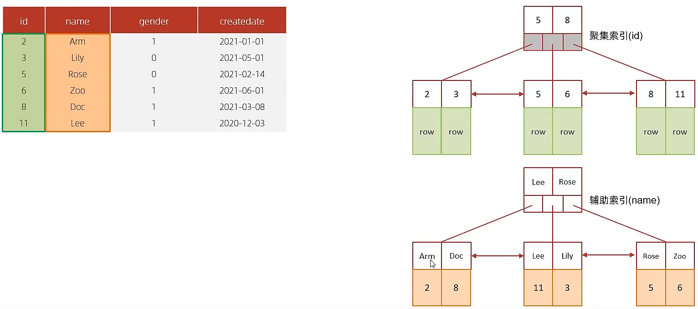

+ 执行SQL : `select * from tb_user where id = 2;`
  + 根据id查询，直接走聚集索引查询，一次索引扫描，直接返回数据，性能高。


+ 执行SQL：`selet id,name from tb_user where name = 'Arm';`
  + 虽然是根据name字段查询，查询二级索引，但是由于查询返回在字段为 id，name，在name的二级索引中，这两个值都是可以直接获取到的，因为覆盖索引，所以不需要回表查询，性能高。

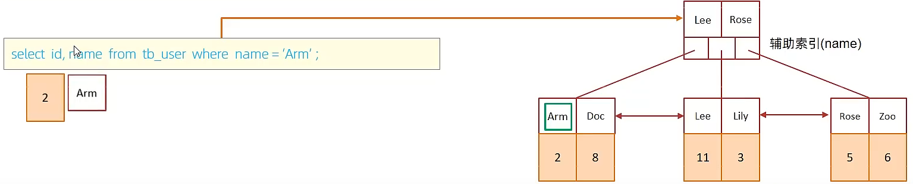

+ 执行SQL：`selet id,name,gender from tb_user where name = 'Arm';`
  + 由于在name的二级索引中，不包含gender，所以，需要两次索引扫描，也就是需要回表查询，性能相对较差一点。


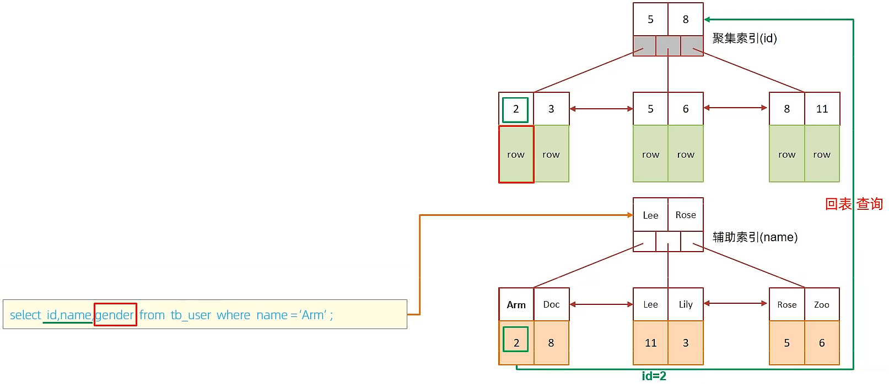

> 一张表, 有四个字段(id, username, password, status), 由于数据量大, 需要对以下SQL语句进行优化, 该如何进行才是最优方案 ? `select id,username,password from tb_user where username ='tom';`
>
> 针对于 username, password建立联合索引, sql为: `create index
> idx_user_name_pass on tb_user(username,password);`这样可以避免上述的SQL语句，在查询的过程中，出现回表查询。


### 前缀索引

当字段类型为字符串（varchar，text，longtext等）时，有时候需要索引很长的字符串，这会让索引变得很大，查询时，浪费大量的磁盘IO， 影响查询效率。此时可以只将字符串的一部分前缀，建立索引，这样可以大大节约索引空间，从而提高索引效率。

测试：

+ 为tb_user表的email字段，建立长度为5的前缀索引。`create index idx_email_5 on tb_user(email(5));`

+ 前缀长度：
  + 可以根据索引的选择性来决定，而选择性是指不重复的索引值（基数）和数据表的记录总数的比值，索引选择性越高则查询效率越高， 唯一索引的选择性是1，这是最好的索引选择性，性能也是最好的
+ 前缀索引的查询流程

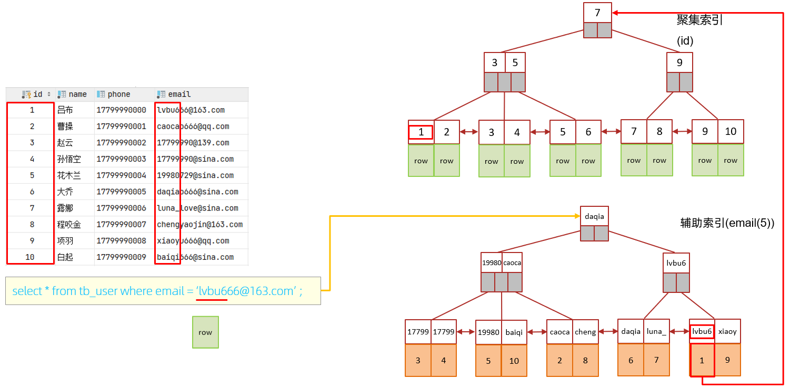


> Temporary file write failure.如果建立索引失败，告知临时空间不足，解决方法：
>
> 编辑 `/etc/mysql/my.cnf`，添加
>
> ```
> [mysqld]
> tmp_table_size = 256M
> max_heap_table_size = 256M
> ```
>
> 然后重启mysql服务：`sudo systemctl restart mysql`


### 单列索引和联合索引

在tb_user表中，phone、email两个字段都有单列索引。

+ 执行SQL:`explain select id,phone,email from tb_user where phone='17799990000' and email='lvbu666@163.com'`

| id   | select\_type | table    | partitions | type  | possible\_keys                  | key               | key\_len | ref   | rows | filtered | Extra |
| :--- | :----------- | :------- | :--------- | :---- | :------------------------------ | :---------------- | :------- | :---- | :--- | :------- | :---- |
| 1    | SIMPLE       | tb\_user | null       | const | idx\_user\_iphone,idx\_email\_5 | idx\_user\_iphone | 46       | const | 1    | 100      | null  |

可以看出：mysql只会选择一个索引，也就是说，只能走一个字段的索引，此时是会回表查询的。


+ 创建一个phone和name字段的联合索引后再执行SQL。`explain select id,phone,email from tb_user  use index(idx_user_phone_email) where phone='17799990000' and email='lvbu666@163.com';`

| id   | select\_type | table    | partitions | type  | possible\_keys          | key                     | key\_len | ref         | rows | filtered | Extra       |
| :--- | :----------- | :------- | :--------- | :---- | :---------------------- | :---------------------- | :------- | :---------- | :--- | :------- | :---------- |
| 1    | SIMPLE       | tb\_user | null       | const | idx\_user\_phone\_email | idx\_user\_phone\_email | 449      | const,const | 1    | 100      | Using index |


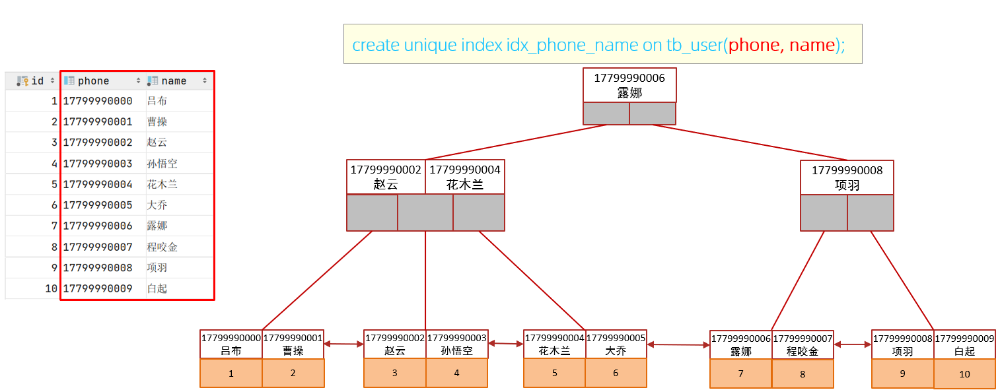


> 在业务场景中，如果存在多个查询条件，考虑针对于查询字段建立索引时，建议建立联合索引，而非单列索引。


## 索引设计原则

1. 针对于数据量较大，且查询比较频繁的表建立索引。
2. 针对于常作为查询条件（where）、排序（order by）、分组（group by操作的字段建立索引。
3. 尽量选择区分度高的列作为索引，尽量建立唯一索引，区分度越高，使用索引的效率越高。
4. 如果是字符串类型的字段，字段的长度较长，可以针对于字段的特点，建立前缀索引。
5. 尽量使用联合索引，减少单列索引，查询时，联合索引很多时候可以覆盖索引，节省存储空间，避免回表，提高查询效率。
6. 要控制索引的数量，索引并不是多多益善，索引越多，维护索引结构的代价也就越大，会影响增删改的效率。
7. 如果索引列不能存储NULL值，请在创建表时使用NOT NULL约束它。当优化器知道每列是否包含NULL值时，它可以更好地确定哪个索引最有效地用于查询。


# SQL优化


## 插入数据

如果需要一次性往数据库表中插入多条记录，可以从以下三个方面进行优化。

+ 批量插入数据
+ 手动控制事务
+ 主键顺序插入，性能要高于乱序插入。

如果一次性需要插入大批量数据(如几百万的记录)，使用insert语句插入性能较低，此时可以使用MySQL数据库提供的load指令进行插入。操作如下：

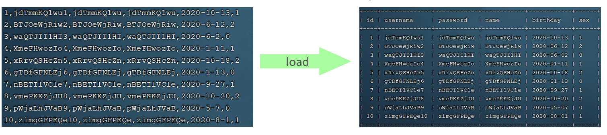

```sql
-- 客户端连接服务端时，加上参数 -–local-infile
mysql –-local-infile -u root -p
-- 设置全局参数local_infile为1，开启从本地加载文件导入数据的开关
set global local_infile = 1;
-- 执行load指令将准备好的数据，加载到表结构中
load data local infile '/root/sql1.log' into table tb_user fields terminated by ',' lines terminated by '\n' ;
```


## 主键优化

+ 数据组织方式

在InnoDB存储引擎中，表数据都是根据主键顺序组织存放的；行数据，都是存储在聚集索引的叶子节点上的。

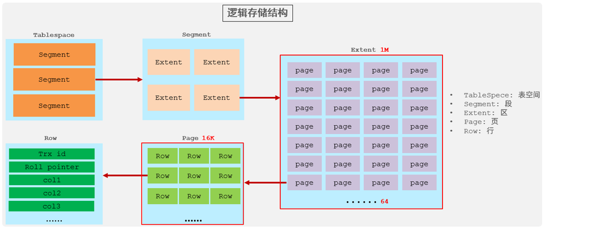

在InnoDB引擎中，数据行是记录在逻辑结构 page 页中的，而每一个页的大小是固定的，默认16K。那也就意味着， 一个页中所存储的行也是有限的，如果插入的数据行row在该页存储不小，将会存储到下一个页中，页与页之间会通过指针连接。

+ 页分裂

页可以为空，也可以填充一半，也可以填充100%。每个页包含了2-N行数据(如果一行数据过大，会行溢出)，根据主键排列。

主键顺序插入效果：

1. 从磁盘中申请页， 主键顺序插入
2. 第一个页没有满，继续往第一页插入
3. 当第一个也写满之后，再写入第二个页，页与页之间会通过指针连接


主键乱序插入效果：

1. 假设1,2页都已经写满了，如图所示
2. 此时再插入id为50的记录，按照顺序，应该存储在47之后。但是47所在的第一页写满了，此时会开辟一个新的页。但是并不会直接将50存入第3页，而是会将第1页后一半的数据，移动到第3页，然后在第3页，插入50。最后需要重新设置链表指针。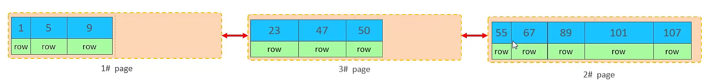
3. 页分裂是比较耗费性能的操作。


+ 页合并

假设表中已有数据的索引结构(叶子节点)如下：


当删除一行记录时，实际上记录并没有被物理删除，只是记录被标记（flaged）为删除并且它的空间变得允许被其他记录声明使用。

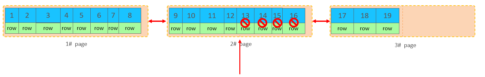

当页中删除的记录达到 MERGE_THRESHOLD（默认为页的50%），InnoDB会开始寻找最靠近的页（前或后）看看是否可以将两个页合并以优化空间使用。


删除数据，并将页合并之后，再次插入新的数据21，则直接插入第3页：


> 合并页的阈值，可以自己设置，在创建表或者创建索引时指定。


+ 索引设计原则
  + 尽量降低主键的长度。
  + 插入数据时，尽量选择顺序插入，选择使用AUTO_INCREMENT自增主键。
  + 尽量不要使用UUID做主键或者是其他自然主键，如身份证号。
  + 业务操作时，避免对主键的修改。


## order by优化

MySQL的排序，有两种方式：

+ Using filesort : 通过表的索引或全表扫描，读取满足条件的数据行，然后在排序缓冲区sort buffer中完成排序操作，所有不是通过索引直接返回排序结果的排序都叫 FileSort 排序。
+ Using index : 通过有序索引顺序扫描直接返回有序数据，这种情况即为 using index，不需要额外排序，操作效率高。

测试：

+ 删除tb_user表中的phone、name的单列索引和联合索引。
+ 执行SQL:`explain select id,age,phone from tb_user order by age ;`

| id   | select\_type | table    | partitions | type | possible\_keys | key  | key\_len | ref  | rows | filtered | Extra          |
| :--- | :----------- | :------- | :--------- | :--- | :------------- | :--- | :------- | :--- | :--- | :------- | :------------- |
| 1    | SIMPLE       | tb\_user | null       | ALL  | null           | null | null     | null | 24   | 100      | Using filesort |

由于 age, phone 都没有索引，所以此时再排序时，出现Using filesort， 排序性能较低。

+ 创建age、phone的联合索引：`create index idx_user_age_phone_aa on tb_user(age,phone);`

+ 执行SQL：`explain select id,age,phone from tb_user order by age;`

| id   | select\_type | table    | partitions | type  | possible\_keys | key                       | key\_len | ref  | rows | filtered | Extra       |
| :--- | :----------- | :------- | :--------- | :---- | :------------- | :------------------------ | :------- | :--- | :--- | :------- | :---------- |
| 1    | SIMPLE       | tb\_user | null       | index | null           | idx\_user\_age\_phone\_aa | 48       | null | 24   | 100      | Using index |

+ 执行SQL：`explain select id,age,phone from tb_user order by age , phone;`

| id   | select\_type | table    | partitions | type  | possible\_keys | key                       | key\_len | ref  | rows | filtered | Extra       |
| :--- | :----------- | :------- | :--------- | :---- | :------------- | :------------------------ | :------- | :--- | :--- | :------- | :---------- |
| 1    | SIMPLE       | tb\_user | null       | index | null           | idx\_user\_age\_phone\_aa | 48       | null | 24   | 100      | Using index |

+ 根据age, phone进行降序排序：`explain select id,age,phone from tb_user order by age desc , phone desc ;`

| id   | select\_type | table    | partitions | type  | possible\_keys | key                       | key\_len | ref  | rows | filtered | Extra                            |
| :--- | :----------- | :------- | :--------- | :---- | :------------- | :------------------------ | :------- | :--- | :--- | :------- | :------------------------------- |
| 1    | SIMPLE       | tb\_user | null       | index | null           | idx\_user\_age\_phone\_aa | 48       | null | 24   | 100      | Backward index scan; Using index |

Extra中出现了 Backward index scan，这个代表反向扫描索引，因为在MySQL中创建的索引，默认索引的叶子节点是从小到大排序的，而此时查询排序时，是从大到小，所以，在扫描时，就是反向扫描，就会出现 Backward index scan。

 在MySQL8版本中，支持降序索引，也可以创建降序索引。

+ 根据phone，age进行升序排序，phone在前，age在后。`explain select id,age,phone from tb_user order by phone , age;`

| id   | select\_type | table    | partitions | type  | possible\_keys | key                       | key\_len | ref  | rows | filtered | Extra                       |
| :--- | :----------- | :------- | :--------- | :---- | :------------- | :------------------------ | :------- | :--- | :--- | :------- | :-------------------------- |
| 1    | SIMPLE       | tb\_user | null       | index | null           | idx\_user\_age\_phone\_aa | 48       | null | 24   | 100      | Using index; Using filesort |

排序时,也需要满足最左前缀法则,否则也会出现 filesort。因为在创建索引的时候， age是第一个字段，phone是第二个字段，所以排序时，也就该按照这个顺序来，否则就会出现 Using filesort。


+ 根据age, phone进行降序，一个升序，一个降序。`explain select id,age,phone from tb_user order by age asc , phone desc ;`

| id   | select\_type | table    | partitions | type  | possible\_keys | key                       | key\_len | ref  | rows | filtered | Extra                       |
| :--- | :----------- | :------- | :--------- | :---- | :------------- | :------------------------ | :------- | :--- | :--- | :------- | :-------------------------- |
| 1    | SIMPLE       | tb\_user | null       | index | null           | idx\_user\_age\_phone\_aa | 48       | null | 24   | 100      | Using index; Using filesort |

创建索引时，如果未指定顺序，默认都是按照升序排序的，而查询时，一个升序，一个降序，此时就会出现Using filesort。

+ 为了解决上述的问题，可以在创建联合索引中 age 升序排序，phone 倒序排序。`create index idx_user_age_phone_ad on tb_user(age asc ,phone desc);`

+ 执行SQL：`explain select id,age,phone from tb_user order by age asc , phone desc ;`

| id   | select\_type | table    | partitions | type  | possible\_keys | key                       | key\_len | ref  | rows | filtered | Extra       |
| :--- | :----------- | :------- | :--------- | :---- | :------------- | :------------------------ | :------- | :--- | :--- | :------- | :---------- |
| 1    | SIMPLE       | tb\_user | null       | index | null           | idx\_user\_age\_phone\_ad | 48       | null | 24   | 100      | Using index |


通过以上，得出order by优化原则:

+ 根据排序字段建立合适的索引，多字段排序时，也遵循最左前缀法则。
+ 尽量使用覆盖索引。
+ 多字段排序, 一个升序一个降序，此时需要注意联合索引在创建时的规则（ASC/DESC）。
+ 如果不可避免的出现filesort，大数据量排序时，可以适当增大排序缓冲区大小sort_buffer_size(默认256k)。


## group by优化

删除tb_user表中的全部索引

在没有索引情况下执行SQL：`explain select profession , count(*) from tb_user group by profession ;`

| id   | select\_type | table    | partitions | type | possible\_keys | key  | key\_len | ref  | rows | filtered | Extra           |
| :--- | :----------- | :------- | :--------- | :--- | :------------- | :--- | :------- | :--- | :--- | :------- | :-------------- |
| 1    | SIMPLE       | tb\_user | null       | ALL  | null           | null | null     | null | 24   | 100      | Using temporary |

针对于 profession ， age， status 创建一个联合索引。再执行前面相同的SQL.

| id   | select\_type | table    | partitions | type  | possible\_keys           | key                      | key\_len | ref  | rows | filtered | Extra       |
| :--- | :----------- | :------- | :--------- | :---- | :----------------------- | :----------------------- | :------- | :--- | :--- | :------- | :---------- |
| 1    | SIMPLE       | tb\_user | null       | index | idx\_user\_pro\_age\_sta | idx\_user\_pro\_age\_sta | 54       | null | 24   | 100      | Using index |

执行SQL:`explain select profession,count(*) from tb_user group by profession,age;`

| id   | select\_type | table    | partitions | type  | possible\_keys           | key                      | key\_len | ref  | rows | filtered | Extra       |
| :--- | :----------- | :------- | :--------- | :---- | :----------------------- | :----------------------- | :------- | :--- | :--- | :------- | :---------- |
| 1    | SIMPLE       | tb\_user | null       | index | idx\_user\_pro\_age\_sta | idx\_user\_pro\_age\_sta | 54       | null | 24   | 100      | Using index |

执行SQL：`explain select age,count(*) from tb_user group by age;`

| id   | select\_type | table    | partitions | type  | possible\_keys           | key                      | key\_len | ref  | rows | filtered | Extra                        |
| :--- | :----------- | :------- | :--------- | :---- | :----------------------- | :----------------------- | :------- | :--- | :--- | :------- | :--------------------------- |
| 1    | SIMPLE       | tb\_user | null       | index | idx\_user\_pro\_age\_sta | idx\_user\_pro\_age\_sta | 54       | null | 24   | 100      | Using index; Using temporary |

如果仅仅根据age分组，就会出现 Using temporary ；而如果是根据
profession,age两个字段同时分组，则不会出现 Using temporary。因为对于分组操作，在联合索引中，也是符合最左前缀法则的。


所以，在分组操作中，需要通过以下两点进行优化，以提升性能：

+ 在分组操作时，可以通过索引来提高效率。
+ 分组操作时，索引的使用也是满足最左前缀法则的。


## limit优化

在数据量比较大时，如果进行limit分页查询，在查询时，越往后，分页查询效率越低。

> `select * from tb_sku limit 2000000,10;`。当在进行分页查询时，如果执行 limit 2000000,10 ，此时需要依次扫描前2000010 记录，仅仅返回 2000000 - 2000010 的记录，其他记录丢弃，查询排序的代价非常大 。

一般分页查询时，通过创建 覆盖索引 能够比较好地提高性能，可以通过覆盖索引加子查询形式进行优化。

```sql
explain select * from tb_sku t , (select id from tb_sku order by id limit 2000000,10) a where t.id = a.id;
```

> 这俩SQL对比：
>
> test> select * from tb_sku limit 2000000,10
>
> [2025-03-12 23:37:27] 在 3 s 711 ms (execution: 3 s 484 ms, fetching: 227 ms) 内检索到从 1 开始的 10 行
>
> test> select * from tb_sku t , (select id from tb_sku order by id limit 2000000,10) a where t.id = a.id
>
> [2025-03-12 23:37:44] 在 870 ms (execution: 772 ms, fetching: 98 ms) 内检索到从 1 开始的 10 行


##  count优化

count() 是一个聚合函数，对于返回的结果集，一行行地判断，如果 count 函数的参数不是NULL，累计值就加 1，否则不加，最后返回累计值

| count 用法   | 含义                                                         |
| ------------ | ------------------------------------------------------------ |
| count (主键) | InnoDB 引擎会遍历整张表，把每一行的 主键 id 值都取出来，返回给服务层。服务层拿到主键后，直接按行进行累加 (主键不可能为 null) |
| count (字段) | 没有 not null 约束 ：InnoDB 引擎会遍历整张表把每一行的字段值都取出来，返回给服务层，服务层判断是否为 null，不为 null，计数累加。 有 not null 约束：InnoDB 引擎会遍历整张表把每一行的字段值都取出来，返回给服务层，直接按行进行累加 |
| count (数字) | InnoDB 引擎遍历整张表，但不取值。服务层对于返回的每一行，放一个数字 “1” 进去，直接按行进行累加 |
| count(*)     | InnoDB 引擎并不会把全部字段取出来，而是专门做了优化，不取值，服务层直接按行进行累加 |

按照效率排序的话，`count(字段) < count(主键 id) < count(1) ≈ count(*)，所以尽量使用 count(*)`。


## update优化

+ SQL:`update course set name = 'javaEE' where id = 1 ;`

在执行删除的SQL语句时，会锁定id为1这一行的数据，然后事务提交之后，行锁释放。

+ SQL:`update course set name = 'Spring' where name = 'PHP' ;`

执行上述的SQL时，行锁升级为了表锁。 导致该update语句的性能大大降低。

InnoDB的行锁是针对索引加的锁，不是针对记录加的锁 ,并且该索引不能失效，否则会从行锁升级为表锁 。


# 视图、存储过程、触发器

## 视图

视图（View）是一种虚拟存在的表。视图中的数据并不在数据库中实际存在，行和列数据来自定义视图的查询中使用的表，并且是在使用视图时动态生成的。

通俗的讲，视图只保存了查询的SQL逻辑，不保存查询结果。

### 语法

+ 创建

```sql
CREATE [OR REPLACE] VIEW 视图名称[(列名列表)] AS SELECT语句 [ WITH [CASCADED | LOCAL ] CHECK OPTION ]
```

+ 查询

```sql
查看创建视图语句：SHOW CREATE VIEW 视图名称;
查看视图数据：SELECT * FROM 视图名称 ...... ;
```

+ 修改

```sql
方式一：CREATE [OR REPLACE] VIEW 视图名称[(列名列表)] AS SELECT语句 [ WITH [ CASCADED | LOCAL ] CHECK OPTION ]
方式二：ALTER VIEW 视图名称[(列名列表)] AS SELECT语句 [ WITH [ CASCADED | LOCAL ] CHECK OPTION ]
```

+ 删除

```sql
DROP VIEW [IF EXISTS] 视图名称 [,视图名称] ...
```


测试：

```sql
-- 创建视图
create or replace view stu_v_1 as select id,name from student where id <= 10;
-- 查询视图
show create view stu_v_1;
select * from stu_v_1;
select * from stu_v_1 where id < 3;
-- 修改视图
create or replace view stu_v_1 as select id,name,no from student where id <= 10;
alter view stu_v_1 as select id,name from student where id <= 10;
-- 删除视图
drop view if exists stu_v_1;
```

测试插入数据：

```sql
insert into stu_v_1 values(6,'Tom');
insert into stu_v_1 values(17,'Tom22');
```

id为6和17的数据都是可以成功插入的。 但是执行`select * from stu_v_1;`，查询出来的数据却没有id为17的记录。

因为在创建视图的时候，指定的条件为 id<=10, id为17的数据，是不符合条件的，所以没有查
询出来，但是这条数据确实是已经成功的插入到了基表中。

### 检查选项

当使用WITH CHECK OPTION子句创建视图时，MySQL会通过视图检查正在更改的每个行，例如 插入，更新，删除，以使其符合视图的定义。 MySQL允许基于另一个视图创建视图，它还会检查依视图中的规则以保持一致性。为了确定检查的范围，mysql提供了两个选项： CASCADED 和 LOCAL
，默认值为 CASCADED 。

+ CASCADED

级联。比如，v2视图是基于v1视图的，如果在v2视图创建的时候指定了检查选项为 cascaded，但是v1视图创建时未指定检查选项。 则在执行检查时，不仅会检查v2，还会级联检查v2的关联视图v1。

+ LOCAL

本地。比如，v2视图是基于v1视图的，如果在v2视图创建的时候指定了检查选项为 local ，但是v1视图创建时未指定检查选项。 则在执行检查时，知会检查v2，不会检查v2的关联视图v1。


### 视图的更新

要使视图可更新，视图中的行与基础表中的行之间必须存在一对一的关系。如果视图包含以下任何一
项，则该视图不可更新：

+ 聚合函数或窗口函数（SUM()、 MIN()、 MAX()、 COUNT()等）
+ DISTINCT
+ GROUP BY
+ HAVING
+ UNION 或者 UNION ALL

测试：

```sql
create view stu_v_count as select count(*) from student;

-- 插入报错：[HY000][1471] The target table stu_v_count of the INSERT is not insertable-into
insert into stu_v_count values(10);
```


### 视图作用

+ 简单：视图不仅可以简化用户对数据的理解，也可以简化他们的操作。那些被经常使用的查询可以被定义为视图，从而使得用户不必为以后的操作每次指定全部的条件。
+ 安全：数据库可以授权，但不能授权到数据库特定行和特定的列上。通过视图用户只能查询和修改他们所能见到的数据
+ 数据独立：视图可帮助用户屏蔽真实表结构变化带来的影响。

> 例子：
>
> 1). 为了保证数据库表的安全性，开发人员在操作tb_user表时，只能看到的用户的基本字段，屏蔽手机号和邮箱两个字段。
>
> ```sql
> create view tb_user_view as select id,name,profession,age,gender,status,createtime
> from tb_user;
> 
> select * from tb_user_view;
> ```
>
> 2). 查询每个学生所选修的课程（三张表联查），这个功能在很多的业务中都有使用到，为了简化操作，定义一个视图。
>
> ```sql
> create view tb_stu_course_view as select s.name student_name , s.no student_no ,
> c.name course_name from student s, student_course sc , course c where s.id =
> sc.studentid and sc.courseid = c.id;
> 
> select * from tb_stu_course_view;
> ```
>
> 


## 存储过程

存储过程是事先经过编译并存储在数据库中的一段 SQL 语句的集合，调用存储过程可以简化应用开发
人员的很多工作，减少数据在数据库和应用服务器之间的传输，对于提高数据处理的效率是有好处的。

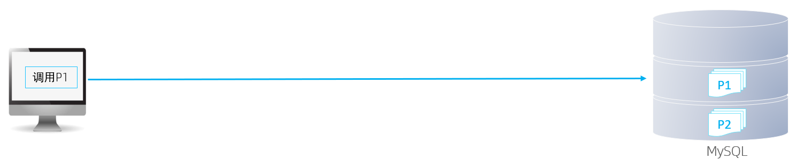

+ 封装，复用 -----------------------> 可以把某一业务SQL封装在存储过程中，需要用到
  的时候直接调用即可。

+ 可以接收参数，也可以返回数据 --------> 在存储过程中，可以传递参数，也可以接收返回
  值。
+ 减少网络交互，效率提升 -------------> 如果涉及到多条SQL，每执行一次都是一次网络传
  输。 而如果封装在存储过程中，我们只需要网络交互一次可能就可以了。


### 语法

+ 创建

```sql
CREATE PROCEDURE 存储过程名称 ([ 参数列表 ])
BEGIN
	-- SQL语句
END ;
```

+ 调用

```sql
CALL 名称 ([ 参数 ]);
```

+ 查看

```sql
SELECT * FROM INFORMATION_SCHEMA.ROUTINES WHERE ROUTINE_SCHEMA = 'xxx'; -- 查询指定数据库的存储过程及状态信息
SHOW CREATE PROCEDURE 存储过程名称 ; -- 查询某个存储过程的定义
```

+ 删除

```sql
DROP PROCEDURE [ IF EXISTS ] 存储过程名称 ；
```


> 在命令行中，执行创建存储过程的SQL时，需要通过关键字 delimiter 指定SQL语句的结束符。


测试：

```sql
-- 创建
create procedure p1()
begin
    select count(*) from student;
end;
-- 调用
call p1();
-- 查看
select * from information_schema.ROUTINES where ROUTINE_SCHEMA = 'itcast';
show create procedure p1;
-- 删除
drop procedure if exists p1;
```


### 变量

在MySQL中变量分为三种类型: 系统变量、用户定义变量、局部变量。

#### 系统变量

分为全局变量（GLOBAL）: 全局变量针对于所有的会话。

会话变量（SESSION）: 会话变量针对于单个会话，在另外一个会话窗口就不生效了。

查看系统变量： 

```sql
SHOW [ SESSION | GLOBAL ] VARIABLES ; -- 查看所有系统变量
SHOW [ SESSION | GLOBAL ] VARIABLES LIKE '......'; -- 可以通过LIKE模糊匹配方式查找变量
SELECT @@[SESSION | GLOBAL] 系统变量名; -- 查看指定变量的值
```

设置系统变量：

```sql
SET [ SESSION | GLOBAL ] 系统变量名 = 值 ;
SET @@[SESSION | GLOBAL]系统变量名 = 值 ;
```

> 如果没有指定SESSION/GLOBAL，默认是SESSION，会话变量。
>
> mysql服务重新启动之后，所设置的全局参数会失效，要想不失效，可以在 /etc/my.cnf 中配置。


#### 用户自定义变量

用户根据需要自己定义的变量，不用提前声明，在用的时候直接用 "@变量名" 使用就可以，只不过获取到的值为NULL。其作用域为当前连接。

+ 赋值

方式一：

```sql
SET @var_name = expr [, @var_name = expr] ... ;
SET @var_name := expr [, @var_name := expr] ... ;
```

可以使用 = ，也可以使用 := 。

方式二：

```sql
SELECT @var_name := expr [, @var_name := expr] ... ;
SELECT 字段名 INTO @var_name FROM 表名;
```


+ 使用

```sql
SELECT @var_name ;
```


测试：

```sql
-- 赋值
set @myname = 'tom';
set @myage := 10;
set @mygender := '男',@myhobby := 'java';

select @mycolor := 'red';
select count(*) into @mycount from tb_user;

-- 使用
select @myname,@myage,@mygender,@myhobby;

select @mycolor , @mycount;

select @abc;
```


#### 局部变量

局部变量 是根据需要定义的在局部生效的变量，访问之前，需要DECLARE声明。可用作存储过程内的局部变量和输入参数，局部变量的范围是在其内声明的BEGIN ... END块。

+ 声明

```sql
DECLARE 变量名 变量类型 [DEFAULT ... ] ;
```

变量类型就是数据库字段类型：INT、BIGINT、CHAR、VARCHAR、DATE、TIME等。

+ 赋值

```sql
SET 变量名 = 值 ;
SET 变量名 := 值 ;
SELECT 字段名 INTO 变量名 FROM 表名 ... ;
```


测试：

```sql
create procedure p2()
begin
    declare stu_count int default 0;
    select count(*) into stu_count from student;
    select stu_count;
end;
call p2();
```


### if

测试：

```sql
create procedure p3()
begin
    declare score int default 58;
    declare result varchar(10);
    if score >= 85 then
    	set result := '优秀';
    elseif score >= 60 then
    	set result := '及格';
    else
    	set result := '不及格';
    end if;
    select result;
    end;
call p3();
```


### 参数

参数的类型，主要分为以下三种：IN、OUT、INOUT。

| 类型  | 含义                                         | 备注 |
| ----- | -------------------------------------------- | ---- |
| IN    | 该类参数作为输入，也就是需要调用时传入值     | 默认 |
| OUT   | 该类参数作为输出，也就是该参数可以作为返回值 |      |
| INOUT | 既可以作为输入参数，也可以作为输出参数       |      |

测试：

+ 案例一：

```sql
create procedure p4(in score int, out result varchar(10))
begin
    if score >= 85 then
        set result := '优秀';
    elseif score >= 60 then
        set result := '及格';
    else
        set result := '不及格';
    end if;
end;
-- 定义用户变量 @result来接收返回的数据, 用户变量可以不用声明
call p4(18, @result);
select @result;
```

+ 案例二

```sql
create procedure p5(inout score double)
begin
    set score := score * 0.5;
end;
set @score = 198;
call p5(@score);
select @score;
```


### case

+ 语法一

```sql
-- 含义： 当case_value的值为 when_value1时，执行statement_list1，当值为 when_value2时，执行statement_list2， 否则就执行 statement_list
CASE case_value
    WHEN when_value1 THEN statement_list1
    [ WHEN when_value2 THEN statement_list2] ...
    [ ELSE statement_list ]
END CASE;
```

+ 语法二

 ```sql
 -- 含义： 当条件search_condition1成立时，执行statement_list1，当条件search_condition2成立时，执行statement_list2， 否则就执行 statement_list
 CASE
     WHEN search_condition1 THEN statement_list1
     [WHEN search_condition2 THEN statement_list2] ...
     [ELSE statement_list]
 END CASE;
 ```


测试：

```sql
create procedure p6(in month int)
begin
    declare result varchar(10);
    case
        when month >= 1 and month <= 3 then
            set result := '第一季度';
        when month >= 4 and month <= 6 then
            set result := '第二季度';
        when month >= 7 and month <= 9 then
            set result := '第三季度';
        when month >= 10 and month <= 12 then
            set result := '第四季度';
        else
            set result := '非法参数';
        end case ;
    select concat('您输入的月份为: ',month, ', 所属的季度为: ',result);
end;
call p6(16);
```


### while

测试：

```sql
create procedure p7(in n int)
begin
    declare total int default 0;
    while n>0 do
            set total := total + n;
            set n := n - 1;
    end while;
    select total;
end;
call p7(100);
```


### repeat

测试：

```sql
create procedure p8(in n int)
begin
    declare total int default 0;
    repeat
        set total := total + n;
        set n := n - 1;
    until n <= 0
        end repeat;
    select total;
end;
call p8(10);
call p8(100);
```


### loop

LOOP 实现简单的循环，如果不在SQL逻辑中增加退出循环的条件，可以用其来实现简单的死循环。

LOOP可以配合一下两个语句使用：

+ LEAVE ：配合循环使用，退出循环。
+ ITERATE：必须用在循环中，作用是跳过当前循环剩下的语句，直接进入下一次循环。

语法格式：

```sql
[begin_label:] LOOP
	SQL逻辑...
END LOOP [end_label];
```


测试：

+ 案例一

```sql
create procedure p9(in n int)
begin
    declare total int default 0;
    sum:loop
        if n<=0 then
            leave sum;
        end if;
        set total := total + n;
        set n := n - 1;
    end loop sum;
    select total;
end;
call p9(100);
```

+ 案例二

```sql
-- 计算从1到n之间的偶数累加的值
create procedure p10(in n int)
begin
    declare total int default 0;
    sum:loop
        if n<=0 then
            leave sum;
        end if;
        if n%2 = 1 then
            set n := n - 1;
            iterate sum;
        end if;
        set total := total + n;
        set n := n - 1;
    end loop sum;
    select total;
end;
call p10(100);
```


### 游标

游标（CURSOR）是用来存储查询结果集的数据类型 , 在存储过程和函数中可以使用游标对结果集进行循环的处理。游标的使用包括游标的声明、OPEN、FETCH 和 CLOSE，其语法分别如下。

+ 声明游标

```sql
DECLARE 游标名称 CURSOR FOR 查询语句 ;
```

+ 打开游标

```sql
OPEN 游标名称 ;
```

+ 获取游标记录

```sql
FETCH 游标名称 INTO 变量 [, 变量 ] ;
```

+ 关闭游标

```sql
CLOSE 游标名称 ;
```


测试：

根据传入的参数uage，来查询用户表tb_user中，所有的用户年龄小于等于uage的用户姓名（name）和专业（profession），并将用户的姓名和专业插入到所创建的一张新表(id,name,profession)中。

```sql
create procedure p11(in uage int)
begin
    declare uname varchar(100);
    declare upro varchar(100);
    declare u_cursor cursor for select name,profession from tb_user where age <= uage;
    drop table if exists tb_user_pro;
    create table if not exists tb_user_pro(
                                              id int primary key auto_increment,
                                              name varchar(100),
                                              profession varchar(100)
    );
    open u_cursor;
    while true do
            fetch u_cursor into uname,upro;
            insert into tb_user_pro values (null, uname, upro);
        end while;
    close u_cursor;
end;
call p11(30);
```

会报错 No data - zero rows fetched, selected, or processed，因为上面的while循环中，并没有退出条件。当游标的数据集获取完毕之后，再次获取数据，就会报错，从而终止了程序的执行。

但是此时，tb_user_pro表结构及其数据都已经插入成功了。


### 条件处理程序

条件处理程序（Handler）可以用来定义在流程控制结构执行过程中遇到问题时相应的处理步骤。

语法：

```sql
DECLARE handler_action HANDLER FOR condition_value [, condition_value] ... statement ;

handler_action 的取值：
	CONTINUE: 继续执行当前程序
	EXIT: 终止执行当前程序
	
condition_value 的取值：
	SQLSTATE sqlstate_value: 状态码，如 02000
	SQLWARNING: 所有以01开头的SQLSTATE代码的简写
	NOT FOUND: 所有以02开头的SQLSTATE代码的简写
	SQLEXCEPTION: 所有没有被SQLWARNING 或 NOT FOUND捕获的SQLSTATE代码的简写
```


测试：

```sql
create procedure p12(in uage int)
begin
    declare uname varchar(100);
    declare upro varchar(100);
    declare u_cursor cursor for select name,profession from tb_user where age <= uage;

    -- 声明条件处理程序 ： 当SQL语句执行抛出的状态码为02000时，将关闭游标u_cursor，并退出
    declare exit handler for SQLSTATE '02000' close u_cursor;
    
    -- 或者 声明条件处理程序 ： 当SQL语句执行抛出的状态码为02开头时，将关闭游标u_cursor，并退出
    -- declare exit handler for not found close u_cursor;

    drop table if exists tb_user_pro;
    create table if not exists tb_user_pro(
                                              id int primary key auto_increment,
                                              name varchar(100),
                                              profession varchar(100)
    );
    open u_cursor;
    while true do
            fetch u_cursor into uname,upro;
            insert into tb_user_pro values (null, uname, upro);
        end while;
    close u_cursor;
end;
call p12(30);
```

具体的错误代码  查看文档


## 存储函数

存储函数是有返回值的存储过程，存储函数的参数只能是IN类型的。具体语法如下：

```sql
CREATE FUNCTION 存储函数名称 ([ 参数列表 ])
RETURNS type [characteristic ...]
BEGIN
	-- SQL语句
	RETURN ...;
END ;
```

characteristic说明：

+ DETERMINISTIC：相同的输入参数总是产生相同的结果
+ NO SQL ：不包含 SQL 语句。
+ READS SQL DATA：包含读取数据的语句，但不包含写入数据的语句。

测试：

```sql
create function fun1(n int)
    returns int deterministic
begin
    declare total int default 0;
    while n>0 do
            set total := total + n;
            set n := n - 1;
        end while;
    return total;
end;
select fun1(50);
```


在mysql8.0版本中binlog默认是开启的，一旦开启了，mysql就要求在定义存储过程时，需要指定
characteristic特性，否则会报错误。


## 触发器

触发器是与表有关的数据库对象，指在insert  update  delete之前(BEFORE)或之后(AFTER)，触
发并执行触发器中定义的SQL语句集合。触发器的这种特性可以协助应用在数据库端确保数据的完整性, 日志记录 , 数据校验等操作 。

使用别名OLD和NEW来引用触发器中发生变化的记录内容。

现在触发器还只支持行级触发，不支持语句级触发。

| 触发器类型      | NEW 和 OLD                                              |
| --------------- | ------------------------------------------------------- |
| INSERT 型触发器 | NEW 表示将要或者已经新增的数据                          |
| UPDATE 型触发器 | OLD 表示修改之前的数据 ，NEW 表示将要或已经修改后的数据 |
| DELETE 型触发器 | OLD 表示将要或者已经删除的数据                          |


语法：

+ 创建

```sql
CREATE TRIGGER trigger_name
BEFORE/AFTER INSERT/UPDATE/DELETE
ON tbl_name FOR EACH ROW -- 行级触发器
BEGIN
	trigger_stmt ;
END;
```

+ 查看

```sql
SHOW TRIGGERS ;
```

+ 删除

```sql
DROP TRIGGER [schema_name.]trigger_name ; -- 如果没有指定 schema_name，默认为当前数据库 。
```


测试：

通过触发器记录 tb_user 表的数据变更日志，将变更日志插入到日志表user_logs中, 包含增加，修改 ，删除 ;

```sql
-- 准备工作 : 日志表 user_logs
create table user_logs(
    id int(11) not null auto_increment,
    operation varchar(20) not null comment '操作类型, insert/update/delete',
    operate_time datetime not null comment '操作时间',
    operate_id int(11) not null comment '操作的ID',
    operate_params varchar(500) comment '操作参数',
    primary key(`id`)
)engine=innodb default charset=utf8;

-- 插入数据触发器
create trigger tb_user_insert_trigger
    after insert on tb_user for each row
begin
    insert into user_logs(id, operation, operate_time, operate_id, operate_params) VALUES (null, 'insert', now(), new.id, concat('插入的数据内容为: id=',new.id,',name=',new.name, ', phone=', NEW.phone, ', email=', NEW.email, ',profession=', NEW.profession));
end;

-- 查看
show triggers ;
-- 插入数据到tb_user
insert into tb_user(id, name, phone, email, profession, age, gender, status,createtime) VALUES (26,'三皇子','18809091212','erhuangzi@163.com','软件工程',23,'1','1',now());

-- 修改数据触发器
create trigger tb_user_update_trigger
    after update on tb_user for each row
begin
    insert into user_logs(id, operation, operate_time, operate_id, operate_params)
    VALUES(null, 'update', now(), new.id,concat('更新之前的数据: id=',old.id,',name=',old.name, ', phone=',old.phone, ', email=', old.email, ', profession=', old.profession,' | 更新之后的数据: id=',new.id,',name=',new.name, ', phone=',NEW.phone, ', email=', NEW.email, ', profession=', NEW.profession));
end;

-- 查看
show triggers ;
-- 更新
update tb_user set profession = '会计' where id = 23;
update tb_user set profession = '会计' where id <= 5;

-- 删除数据触发器
create trigger tb_user_delete_trigger
    after delete on tb_user for each row
begin
    insert into user_logs(id, operation, operate_time, operate_id, operate_params) VALUES (null, 'delete', now(), old.id,concat('删除之前的数据: id=',old.id,',name=',old.name, ', phone=',old.phone, ', email=', old.email, ', profession=', old.profession));
end;

-- 查看
show triggers ;
-- 删除数据
delete from tb_user where id = 26;
```


# 锁

锁是计算机协调多个进程或线程并发访问某一资源的机制。在数据库中，除传统的计算资源（CPU、
RAM、I/O）的争用以外，数据也是一种供许多用户共享的资源。保证数据并发访问的一致性、有效性是所有数据库必须解决的一个问题，锁冲突也是影响数据库并发访问性能的一个重要因素。从这个
角度来说，锁对数据库而言显得尤其重要，也更加复杂。

MySQL中的锁，按照锁的粒度分，分为以下三类：

+ 全局锁：锁定数据库中的所有表。
+ 表级锁：每次操作锁住整张表。
+ 行级锁：每次操作锁住对应的行数据。


## 全局锁

全局锁就是对整个数据库实例加锁，加锁后整个实例就处于只读状态，后续的DML的写语句，DDL语
句，已经更新操作的事务提交语句都将被阻塞。

其典型的使用场景是做全库的逻辑备份，对所有的表进行锁定，从而获取一致性视图，保证数据的完整性。

语法：

+ 加全局锁

```sql
flush tables with read lock ;
```

+ 数据备份

```sql
mysqldump -uroot –p1234 demo > demo.sql
```

+ 释放锁

```sql
unlock tables ;
```


数据库中加全局锁，是一个比较重的操作，存在以下问题：

+ 如果在主库上备份，那么在备份期间都不能执行更新，业务基本上就得停摆。
+ 如果在从库上备份，那么在备份期间从库不能执行主库同步过来的二进制日志（binlog），会导
  致主从延迟。

在InnoDB引擎中，可以在备份时加上参数 --single-transaction 参数来完成不加锁的一致性数据备份。

```sql
mysqldump --single-transaction -uroot –p123456 demo > demo.sql
```


## 表级锁

表级锁，每次操作锁住整张表。锁定粒度大，发生锁冲突的概率最高，并发度最低。应用在MyISAM、InnoDB、BDB等存储引擎中。、

对于表级锁，主要分为以下三类：

+ 表锁
+ 元数据锁（meta data lock，MDL）
+ 意向锁


### 表锁

对于表锁，分为两类：

+ 表共享读锁（read lock）
+ 表独占写锁（write lock）

语法：

+ 加锁：lock tables 表名... read/write。
+ 释放锁：unlock tables 或者 客户端断开连接 。


特点：

+ 读锁

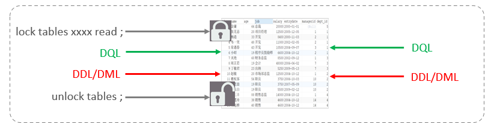

+ 写锁

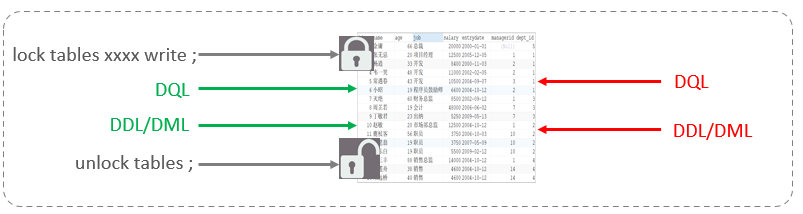


### 元数据锁

meta data lock , 元数据锁，简写MDL。

MDL加锁过程是系统自动控制，无需显式使用，在访问一张表的时候会自动加上。MDL锁主要作用是维护表元数据的数据一致性，在表上有活动事务的时候，不可以对元数据进行写入操作。为了避免DML与DDL冲突，保证读写的正确性。

这里的元数据，可以简单理解为就是一张表的表结构。 也就是说，某一张表涉及到未提交的事务
时，是不能够修改这张表的表结构的。

在MySQL5.5中引入了MDL，当对一张表进行增删改查的时候，加MDL读锁(共享)；当对表结构进行变更操作的时候，加MDL写锁(排他)。

常见的SQL操作时，所添加的元数据锁：

| 对应SQL                                        | 锁类型                                  | 说明                                             |
| ---------------------------------------------- | --------------------------------------- | ------------------------------------------------ |
| lock tables xxx read / write                   | SHARED_READ_ONLY / SHARED_NO_READ_WRITE |                                                  |
| select 、select ... lock in share mode         | SHARED_READ                             | 与SHARED_READ、SHARED_WRITE兼容，与EXCLUSIVE互斥 |
| insert 、update、delete、select ... for update | SHARED_WRITE                            | 与SHARED_READ、SHARED_WRITE兼容，与EXCLUSIVE互斥 |
| alter table ...                                | EXCLUSIVE                               | 与其他的MDL都互斥                                |

测试：

+ 当执行SELECT、INSERT、UPDATE、DELETE等语句时，添加的是元数据共享锁（SHARED_READ/SHARED_WRITE），之间是兼容的。

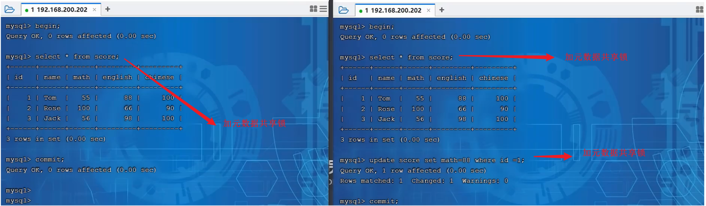


+ 当执行SELECT语句时，添加的是元数据共享锁（SHARED_READ），会阻塞元数据排他锁（EXCLUSIVE），之间是互斥的。

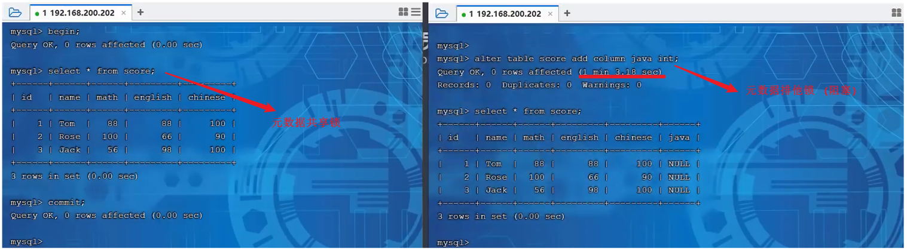


可以通过下面的SQL，来查看数据库中的元数据锁的情况:

```sql
select object_type,object_schema,object_name,lock_type,lock_duration from performance_schema.metadata_locks ;
```

### 意向锁

为了避免DML在执行时，加的行锁与表锁的冲突，在InnoDB中引入了意向锁，使得表锁不用检查每行数据是否加锁，使用意向锁来减少表锁的检查。

客户端一，在执行DML操作时，会对涉及的行加行锁，同时也会对该表加上意向锁；而其他客户端，在对这张表加表锁的时候，会根据该表上所加的意向锁来判定是否可以成功加表锁，而不用逐行判断行锁情况了。

分类：

+ 意向共享锁(IS): 由语句select ... lock in share mode添加 。 与 表锁共享锁(read)兼容，与表锁排他锁(write)互斥。
+ 意向排他锁(IX): 由insert、update、delete、select...for update添加 。与表锁共享锁(read)及排他锁(write)都互斥，意向锁之间不会互斥。

> 一旦事务提交了，意向共享锁、意向排他锁，都会自动释放。


可以通过以下SQL，查看意向锁及行锁的加锁情况：

```sql
select object_schema,object_name,index_name,lock_type,lock_mode,lock_data from
performance_schema.data_locks;
```


## 行级锁

行级锁，每次操作锁住对应的行数据。锁定粒度最小，发生锁冲突的概率最低，并发度最高。应用在InnoDB存储引擎中。

InnoDB的数据是基于索引组织的，行锁是通过对索引上的索引项加锁来实现的，而不是对记录加的锁。对于行级锁，主要分为以下三类：

+ 行锁（Record Lock）：锁定单个行记录的锁，防止其他事务对此行进行update和delete。在RC、RR隔离级别下都支持。

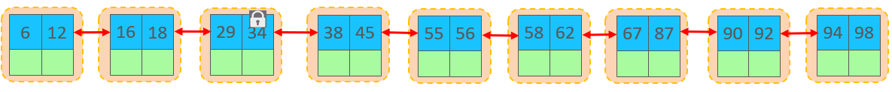

+ 间隙锁（Gap Lock）：锁定索引记录间隙（不含该记录），确保索引记录间隙不变，防止其他事务在这个间隙进行insert，产生幻读。在RR隔离级别下都支持。

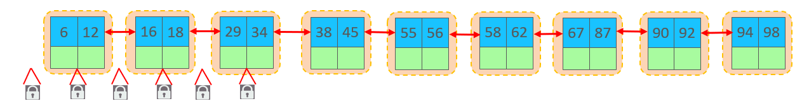

+ 临键锁（Next-Key Lock）：行锁和间隙锁组合，同时锁住数据，并锁住数据前面的间隙Gap。
  在RR隔离级别下支持。

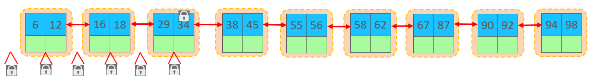


### 行锁

InnoDB实现了以下两种类型的行锁：

+ 共享锁（S）：允许一个事务去读一行，阻止其他事务获得相同数据集的排它锁。
+ 排他锁（X）：允许获取排他锁的事务更新数据，阻止其他事务获得相同数据集的共享锁和排他
  锁。

两种锁的兼容情况：


常见的SQL语句，在执行时，所加的行锁如下：

| SQL                           | 行锁类型   | 说明                                     |
| ----------------------------- | ---------- | ---------------------------------------- |
| INSERT ...                    | 排他锁     | 自动加锁                                 |
| UPDATE ...                    | 排他锁     | 自动加锁                                 |
| DELETE ...                    | 排他锁     | 自动加锁                                 |
| SELECT (正常)                 | 不加任何锁 |                                          |
| SELECT ... LOCK IN SHARE MODE | 共享锁     | 需要手动在SELECT之后加LOCK IN SHARE MODE |
| SELECT ... FOR UPDATE         | 排他锁     | 需要手动在SELECT之后加FOR UPDATE         |

默认情况下，InnoDB在 REPEATABLE READ事务隔离级别运行，InnoDB使用 next-key 锁进行搜索和索引扫描，以防止幻读。

+ 针对唯一索引进行检索时，对已存在的记录进行等值匹配时，将会自动优化为行锁。
+ InnoDB的行锁是针对于索引加的锁，不通过索引条件检索数据，那么InnoDB将对表中的所有记录加锁，此时 就会升级为表锁。

可以通过以下SQL，查看意向锁及行锁的加锁情况：

```sql
select object_schema,object_name,index_name,lock_type,lock_mode,lock_data from
performance_schema.data_locks;
```


测试：

数据：

```sql
CREATE TABLE `stu` (
	`id` int NOT NULL PRIMARY KEY AUTO_INCREMENT,
	`name` varchar(255) DEFAULT NULL,
	`age` int NOT NULL
) ENGINE = InnoDB CHARACTER SET = utf8mb4;

INSERT INTO `stu` VALUES (1, 'tom', 1);
INSERT INTO `stu` VALUES (3, 'cat', 3);
INSERT INTO `stu` VALUES (8, 'rose', 8);
INSERT INTO `stu` VALUES (11, 'jetty', 11);
INSERT INTO `stu` VALUES (19, 'lily', 19);
INSERT INTO `stu` VALUES (25, 'luci', 25);
```


+ 普通select语句，执行不加锁

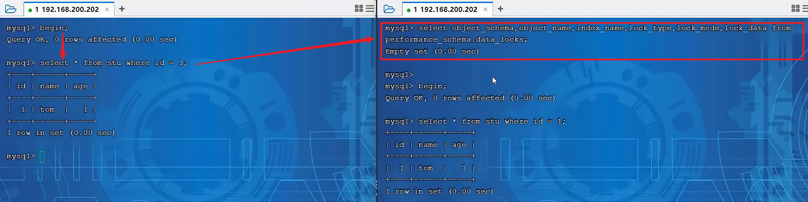

+ select...lock in share mode，加共享锁，共享锁与共享锁之间兼容。

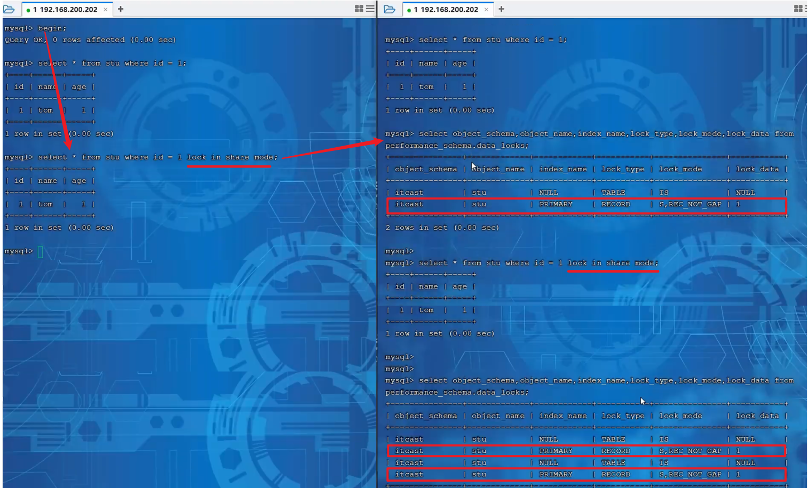

共享锁与排他锁之间互斥。


客户端一获取的是id为1这行的共享锁，客户端二是可以获取id为3这行的排它锁的，因为不是同一行数据。 而如果客户端二想获取id为1这行的排他锁，会处于阻塞状态，以为共享锁与排他锁之间互斥。

+ 排它锁与排它锁之间互斥


当客户端一，执行update语句，会为id为1的记录加排他锁； 客户端二，如果也执行update语句更新id为1的数据，也要为id为1的数据加排他锁，但是客户端二会处于阻塞状态，因为排他锁之间是互斥的。 直到客户端一，把事务提交了，才会把这一行的行锁释放，此时客户端二，解除阻塞。

+ 无索引行锁升级为表锁

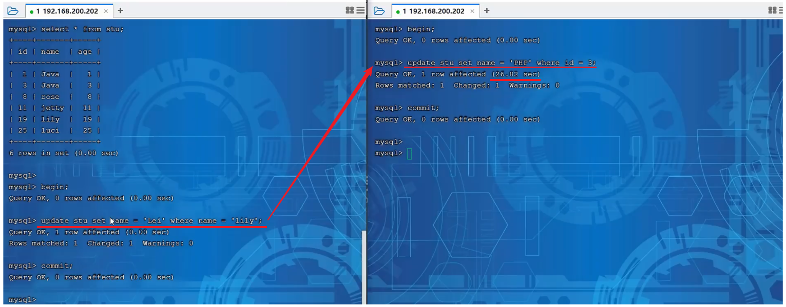

在客户端一中，开启事务，并执行update语句，更新name为Lily的数据，也就是id为19的记录 。然后在客户端二中更新id为3的记录，却不能直接执行，会处于阻塞状态，原因就是因为此时，客户端一，根据name字段进行更新时，name字段是没有索引的，如果没有索引，此时行锁会升级为表锁(因为行锁是对索引项加的锁，而name没有索引)。

接下来，针对name字段建立索引，索引建立之后：

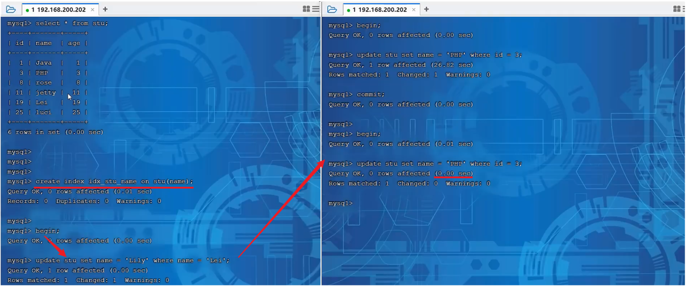

可以看到，客户端一，开启事务，然后依然是根据name进行更新。而客户端二，在更新id为3的数据时，更新成功，并未进入阻塞状态。 这样就说明，根据索引字段进行更新操作，就可以避免行锁升级为表锁的情况。


### 间隙锁和临键锁

默认情况下，InnoDB在 REPEATABLE READ事务隔离级别运行，InnoDB使用 next-key 锁进行搜索和索引扫描，以防止幻读。

+ 索引上的等值查询(唯一索引)，给不存在的记录加锁时, 优化为间隙锁 。
+ 索引上的等值查询(非唯一普通索引)，向右遍历时最后一个值不满足查询需求时，next-key lock 退化为间隙锁。
+ 索引上的范围查询(唯一索引)--会访问到不满足条件的第一个值为止。

> 间隙锁唯一目的是防止其他事务插入间隙。间隙锁可以共存，一个事务采用的间隙锁不会阻止另一个事务在同一间隙上采用间隙锁。


测试：

+ 索引上的等值查询(唯一索引)，给不存在的记录加锁时, 优化为间隙锁 。

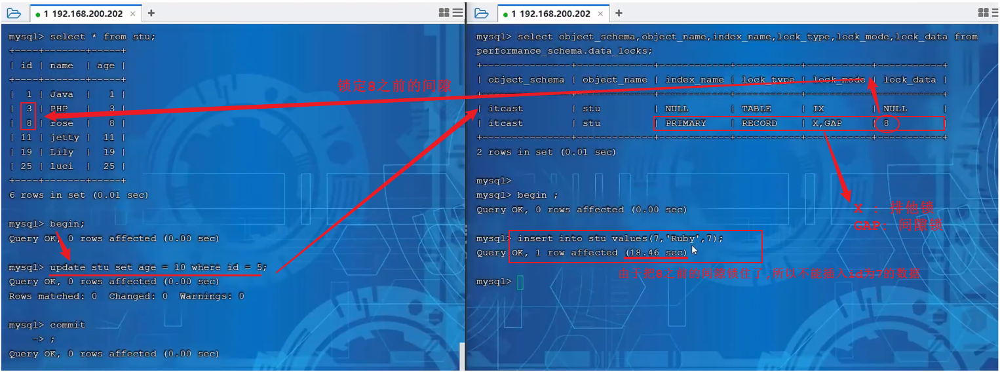

+ 索引上的等值查询(非唯一普通索引)，向右遍历时最后一个值不满足查询需求时，next-key lock 退化为间隙锁。

InnoDB的B+树索引，叶子节点是有序的双向链表。 假如要根据这个二级索引查询值为18的数据，并加上共享锁，只锁定18这一行就可以了吗？ 并不是，因为是非唯一索引，这个结构中可能有多个18的存在，所以，在加锁时会继续往后找，找到一个不满足条件的值（案例中也就是29）。此时会对18加临键锁，并对29之前的间隙加锁。

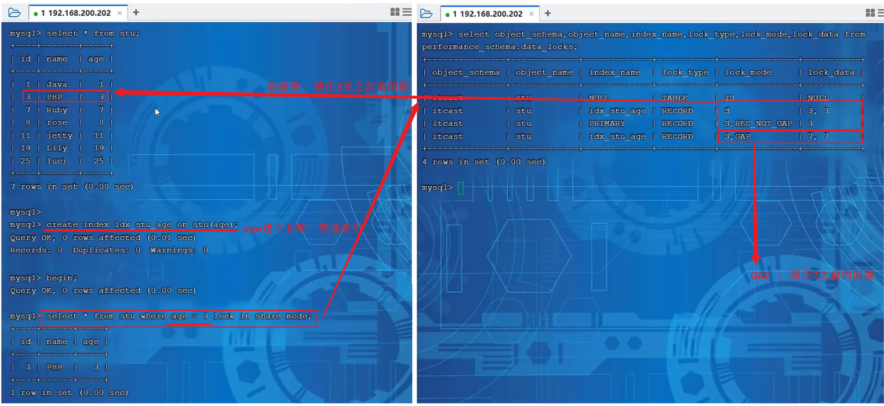


+ 索引上的范围查询(唯一索引)--会访问到不满足条件的第一个值为止。


查询的条件为id>=19，并添加共享锁。 此时可以根据数据库表中现有的数据，将数据分为三个部分：
[19]、(19,25]、(25,+∞]。所以数据库数据在加锁是，就是将19加了行锁，25的临键锁（包含25及25之前的间隙），正无穷的临键锁(正无穷及之前的间隙)。


# InnoDB引擎

## 逻辑存储结构


+ 表空间

表空间是InnoDB存储引擎逻辑结构的最高层， 如果用户启用了参数 innodb_file_per_table(在8.0版本中默认开启) ，则每张表都会有一个表空间（xxx.ibd），一个mysql实例可以对应多个表空间，用于存储记录、索引等数据。

+ 段

段，分为数据段（Leaf node segment）、索引段（Non-leaf node segment）、回滚段（Rollback segment），InnoDB是索引组织表，数据段就是B+树的叶子节点， 索引段即为B+树的非叶子节点。段用来管理多个Extent（区）。

+ 区

区，表空间的单元结构，每个区的大小为1M。 默认情况下， InnoDB存储引擎页大小为16K， 即一个区中一共有64个连续的页。

+ 页

页，是InnoDB 存储引擎磁盘管理的最小单元，每个页的大小默认为 16KB。为了保证页的连续性，InnoDB 存储引擎每次从磁盘申请 4-5 个区。

+ 行

行，InnoDB 存储引擎数据是按行进行存放的。在行中，默认有两个隐藏字段：

Trx_id：每次对某条记录进行改动时，都会把对应的事务id赋值给trx_id隐藏列。

Roll_pointer：每次对某条引记录进行改动时，都会把旧的版本写入到undo日志中，然后这个隐藏列就相当于一个指针，可以通过它来找到该记录修改前的信息。


## 架构

MySQL5.5 版本开始，默认使用InnoDB存储引擎，它擅长事务处理，具有崩溃恢复特性，在日常开发中使用非常广泛。下面是InnoDB架构图，左侧为内存结构，右侧为磁盘结构。

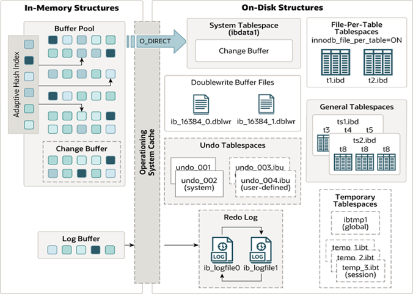

### 内存结构

在左侧的内存结构中，主要分为这么四大块儿： Buffer Pool、Change Buffer、Adaptive Hash Index、Log Buffer

+ Buffer Pool

InnoDB存储引擎基于磁盘文件存储，访问物理硬盘和在内存中进行访问，速度相差很大，为了尽可能弥补这两者之间的I/O效率的差值，就需要把经常使用的数据加载到缓冲池中，避免每次访问都进行磁盘I/O。

在InnoDB的缓冲池中不仅缓存了索引页和数据页，还包含了undo页、插入缓存、自适应哈希索引以及InnoDB的锁信息等等。

缓冲池 Buffer Pool，是主内存中的一个区域，里面可以缓存磁盘上经常操作的真实数据，在执行增
删改查操作时，先操作缓冲池中的数据（若缓冲池没有数据，则从磁盘加载并缓存），然后再以一定频率刷新到磁盘，从而减少磁盘IO，加快处理速度。

缓冲池以Page页为单位，底层采用链表数据结构管理Page。根据状态，将Page分为三种类型：

free page：空闲page，未被使用。

clean page：被使用page，数据没有被修改过。

dirty page：脏页，被使用page，数据被修改过，也中数据与磁盘的数据产生了不一致。

在专用服务器上，通常将多达80％的物理内存分配给缓冲池 。参数设置： `show variables
like 'innodb_buffer_pool_size';`

+ Change Buffer

Change Buffer，更改缓冲区（针对于非唯一二级索引页），在执行DML语句时，如果这些数据Page没有在Buffer Pool中，不会直接操作磁盘，而会将数据变更存在更改缓冲区 Change Buffer中，在未来数据被读取时，再将数据合并恢复到Buffer Pool中，再将合并后的数据刷新到磁盘中。

> 二级索引通常是非唯一的，并且以相对随机的顺序插入二级索引。删除和更新可能会影响索引树中不相邻的二级索引页，如果每一次都操作磁盘，会造成大量的磁盘IO。有了ChangeBuffer之后，可以在缓冲池中进行合并处理，减少磁盘IO。


+ Adaptive Hash Index

自适应hash索引，用于优化对Buffer Pool数据的查询。MySQL的innoDB引擎中虽然没有直接支持hash索引，但是给我们提供了一个功能就是这个自适应hash索引。因为hash索引在进行等值匹配时，一般性能是要高于B+树的，因为hash索引一般只需要一次IO即可，而B+树，可能需要几次匹配，所以hash索引的效率要高，但是hash索引又不适合做范围查询、模糊匹配等。

InnoDB存储引擎会监控对表上各索引页的查询，如果观察到在特定的条件下hash索引可以提升速度，则建立hash索引，称之为自适应hash索引。

自适应哈希索引是系统根据情况自动完成。参数： adaptive_hash_index

+ Log Buffer

Log Buffer：日志缓冲区，用来保存要写入到磁盘中的log日志数据（redo log 、undo log），默认大小为 16MB，日志缓冲区的日志会定期刷新到磁盘中。如果需要更新、插入或删除许多行的事务，增加日志缓冲区的大小可以节省磁盘 I/O。

### 磁盘结构

+ System Tablespace

系统表空间是更改缓冲区的存储区域。如果表是在系统表空间而不是每个表文件或通用表空间中创建的，它也可能包含表和索引数据。(在MySQL5.x版本中还包含InnoDB数据字典、undolog等)

+ File-Per-Table Tablespaces

如果开启了innodb_file_per_table开关 ，则每个表的文件表空间包含单个InnoDB表的数据和索引 ，并存储在文件系统上的单个数据文件中 。默认开启，意味着每创建一个表，都会产生一个表空间文件，而不是出现在系统表空间中。

+ General Tablespaces

需手动创建，通过 CREATE TABLESPACE 语法创建通用表空间，在创建表时，可以指定该表空间。

创建表空间：

```sql
CREATE TABLESPACE ts_name ADD DATAFILE 'ts_name.ibd' ENGINE = engine_name;
```

创建表时指定表空间

```sql
CREATE TABLE xxx ... TABLESPACE ts_name;
```


+ Undo Tablespaces

撤销表空间，MySQL实例在初始化时会自动创建两个默认的undo表空间（初始大小16M），用于存储undo log日志。

+ Temporary Tablespaces

InnoDB 使用会话临时表空间和全局临时表空间。存储用户创建的临时表等数据。

+ Doublewrite Buffer Files

双写缓冲区，innoDB引擎将数据页从Buffer Pool刷新到磁盘前，先将数据页写入双写缓冲区文件中，便于系统异常时恢复数据。

+ Redo Log

重做日志，是用来实现事务的持久性。该日志文件由两部分组成：重做日志缓冲（redo log buffer）以及重做日志文件（redo log）,前者是在内存中，后者在磁盘中。当事务提交之后会把所有修改信息都会存到该日志中, 用于在刷新脏页到磁盘时,发生错误时, 进行数据恢复使用。


### 后台线程

作用是将innodb引擎内存中的数据在合适的时机刷入到磁盘中。

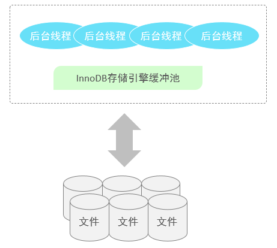

+ Master Thread

核心后台线程，负责调度其他线程，还负责将缓冲池中的数据异步刷新到磁盘中, 保持数据的一致性，还包括脏页的刷新、合并插入缓存、undo页的回收 。

+ IO Thread

在InnoDB存储引擎中大量使用了AIO（异步非阻塞IO）来处理IO请求, 这样可以极大地提高数据库的性能，而IO Thread主要负责这些IO请求的回调。

| 线程类型             | 默认个数 | 职责                         |
| -------------------- | -------- | ---------------------------- |
| Read thread          | 4        | 负责读操作                   |
| Write thread         | 4        | 负责写操作                   |
| Log thread           | 1        | 负责将日志缓冲区刷新到磁盘   |
| Insert buffer thread | 1        | 负责将写缓冲区内容刷新到磁盘 |


+ Purge Thread

主要用于回收事务已经提交了的undo log，在事务提交之后，undo log可能不用了，就用它来回收。

+ Page Cleaner Thread

协助 Master Thread 刷新脏页到磁盘的线程，它可以减轻 Master Thread 的工作压力，减少阻塞。


## 事务原理

### 事务

事务 是一组操作的集合，它是一个不可分割的工作单位，事务会把所有的操作作为一个整体一起向系统提交或撤销操作请求，即这些操作要么同时成功，要么同时失败。

四大特性：

1. 原子性（Atomicity）：事务是不可分割的最小操作单元，要么全部成功，要么全部失败。
2. 一致性（Consistency）：事务完成时，必须使所有的数据都保持一致状态。
3. 隔离性（Isolation）：数据库系统提供的隔离机制，保证事务在不受外部并发操作影响的独立环
   境下运行。（四个隔离级别）
4. 持久性（Durability）：事务一旦提交或回滚，它对数据库中的数据的改变就是永久的。


对于这四大特性，分为两个部分。 其中的原子性、一致性、持久化，是由InnoDB中的两份日志来保证的，一份是redo log日志，一份是undo log日志。 而持久性是通过数据库的锁，加上MVCC来保证的。


### redo log

重做日志，记录的是事务提交时数据页的物理修改，是用来实现事务的**持久性**。

该日志文件由两部分组成：重做日志缓冲（redo log buffer）以及重做日志文件（redo log file）,前者是在内存中，后者在磁盘中。当事务提交之后会把所有修改信息都存到该日志文件中, 用于在刷新脏页到磁盘,发生错误时, 进行数据恢复使用。

在InnoDB引擎中的内存结构中，主要的内存区域就是缓冲池，在缓冲池中缓存了很多的数据页。 在一个事务中，执行多个增删改的操作时，InnoDB引擎会先操作缓冲池中的数据，如果缓冲区没有对应的数据，会通过后台线程将磁盘中的数据加载出来，存放在缓冲区中，然后将缓冲池中的数据修改，修改后的数据页称为脏页。 而脏页则会在一定的时机，通过后台线程刷新到磁盘中，从而保证缓冲区与磁盘的数据一致。 而缓冲区的脏页数据并不是实时刷新的，而是一段时间之后将缓冲区的数据刷新到磁盘中，假如刷新到磁盘的过程出错了，而提示给用户事务提交成功，而数据却没有持久化下来，这就出现问题了，没有保证事务的持久性。

通过redolog如何解决这个问题：

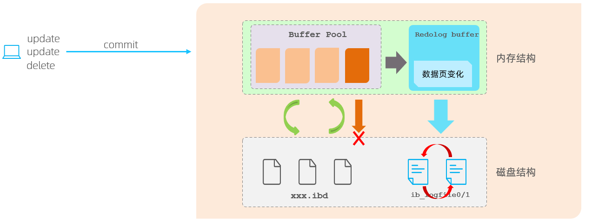

有了redolog之后，当对缓冲区的数据进行增删改之后，会首先将操作的数据页的变化，记录在redo log buffer中。在事务提交时，会将redo log buffer中的数据刷新到redo log磁盘文件中。过一段时间之后，如果刷新缓冲区的脏页到磁盘时，发生错误，此时就可以借助于redo log进行数据恢复，这样就保证了事务的持久性。 而如果脏页成功刷新到磁盘 或者 涉及到的数据已经落盘，此时redolog就没有作用了，就可以删除了，所以存在的两个redolog文件是循环写的。

在每一次提交事务，要刷新redo log 到磁盘中呢，而不是直接将buffer pool中的脏页刷新到磁盘：

因为在业务操作中，操作数据一般都是随机读写磁盘的，而不是顺序读写磁盘。 而redo log在往磁盘文件中写入数据，由于是日志文件，所以都是顺序写的。顺序写的效率，要远大于随机写。 这种先写日志的方式，称之为 WAL（Write-Ahead Logging）。


### undo log

回滚日志，用于记录数据被修改前的信息 , 作用包含两个 : 提供回滚(保证事务的**原子性**) 和MVCC(多版本并发控制) 。

undo log和redo log记录物理日志不一样，它是逻辑日志。可以认为当delete一条记录时，undo log中会记录一条对应的insert记录，反之亦然，当update一条记录时，它记录一条对应相反的update记录。当执行rollback时，就可以从undo log中的逻辑记录读取到相应的内容并进行回滚。

Undo log销毁：undo log在事务执行时产生，事务提交时，并不会立即删除undo log，因为这些日志可能还用于MVCC。

Undo log存储：undo log采用段的方式进行管理和记录，存放在前面介绍的 rollback segment
回滚段中，内部包含1024个undo log segment。


## MVCC

### 基本概念

+ 当前读

读取的是记录的最新版本，读取时还要保证其他并发事务不能修改当前记录，会对读取的记录进行加锁。对于日常的操作，如：select ... lock in share mode(共享锁)，select ...for update、update、insert、delete(排他锁)都是一种当前读。


在测试中可以看到，即使是在默认的RR隔离级别下，事务A中依然可以读取到事务B最新提交的内容，因为在查询语句后面加上了 lock in share mode 共享锁，此时是当前读操作。当然，加排他锁的时候，也是当前读操作。


+ 快照读

简单的select（不加锁）就是快照读，快照读，读取的是记录数据的可见版本，有可能是历史数据，不加锁，是非阻塞读。

Read Committed：每次select，都生成一个快照读。

Repeatable Read：开启事务后第一个select语句才是快照读的地方。

Serializable：快照读会退化为当前读。

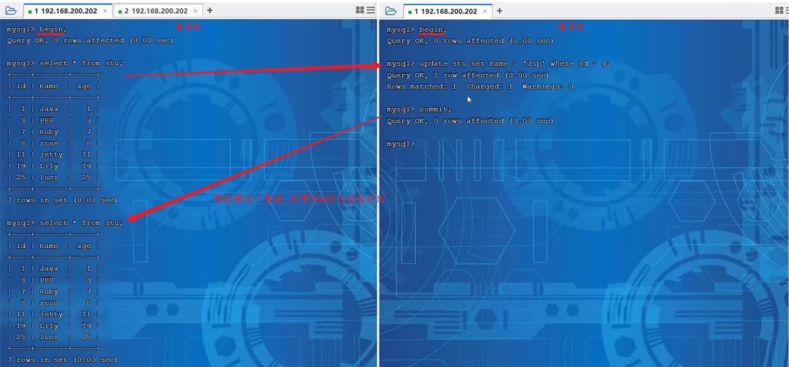

在当前默认的RR隔离级别下，开启事务后第一个select语句才是快照读的地方，后面执行相同的select语句都是从快照中获取数据，可能不是当前的最新数据，这样也就保证了可重复读。

+ MVCC

全称 Multi-Version Concurrency Control，多版本并发控制。指维护一个数据的多个版本，使得读写操作没有冲突，快照读为MySQL实现MVCC提供了一个非阻塞读功能。MVCC的具体实现，还需要依赖于数据库记录中的 三个隐式字段、undo log日志、readView。


### 隐藏字段

当创建了下面的这张表，在查看表结构的时候，就可以显式的看到这三个字段。 

| id   | age  | name |
| ---- | ---- | ---- |
| 1    | 1    | tom  |
| 3    | 3    | cat  |

实际上除了以上这三个字段，InnoDB还会自动添加三个隐藏字段及其含义分别是：

| 隐藏字段    | 含义                                                         |
| ----------- | ------------------------------------------------------------ |
| DB_TRX_ID   | 最近修改事务ID，记录插入这条记录或最后一次修改该记录的事务ID。 |
| DB_ROLL_PTR | 回滚指针，指向这条记录的上一个版本，用于配合undo log，指向上一个版本。 |
| DB_ROW_ID   | 隐藏主键，如果表结构没有指定主键，将会生成该隐藏字段。       |

前两个字段是肯定会添加的， 是否添加最后一个字段DB_ROW_ID，得看当前表有没有主键，如果有主键，则不会添加该隐藏字段。


### undo log版本连

回滚日志，在insert、update、delete的时候产生的便于数据回滚的日志。

当insert的时候，产生的undo log日志只在回滚时需要，在事务提交后，可被立即删除。

而update、delete的时候，产生的undo log日志不仅在回滚时需要，在快照读时也需要，不会立即被删除。


版本链：

一张表原始数据如下：

| id   | age  | name | DB_TRX_ID | DB_ROLL_PTR |
| ---- | ---- | ---- | --------- | ----------- |
| 30   | 30   | A30  | 1         | null        |

> DB_TRX_ID : 代表最近修改事务ID，记录插入这条记录或最后一次修改该记录的事务ID，是自增的。
>
> DB_ROLL_PTR ： 由于这条数据是才插入的，没有被更新过，所以该字段值为null。

然后，有四个并发事务同时在访问这张表：
事务2：

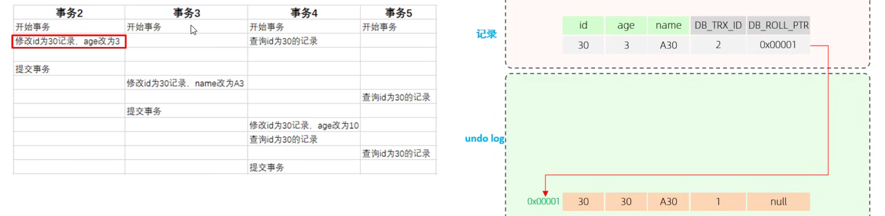

当事务2执行第一条修改语句时，会记录undo log日志，记录数据变更之前的样子; 然后更新记录，并且记录本次操作的事务ID，回滚指针，回滚指针用来指定如果发生回滚，回滚到哪一个版本。

事务3：

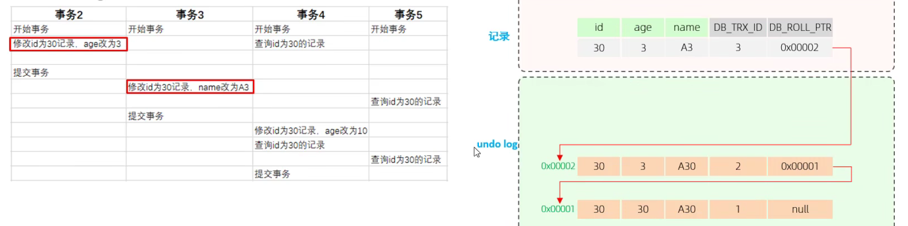

当事务3执行第一条修改语句时，也会记录undo log日志，记录数据变更之前的样子; 然后更新记录，并且记录本次操作的事务ID，回滚指针，回滚指针用来指定如果发生回滚，回滚到哪一个版本。

事务4：

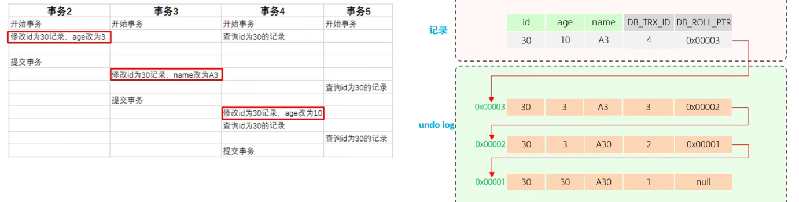

不同事务或相同事务对同一条记录进行修改，会导致该记录的undolog生成一条记录版本链表，链表的头部是最新的旧记录，链表尾部是最早的旧记录。


### readview

ReadView（读视图）是 快照读 SQL执行时MVCC提取数据的依据，记录并维护系统当前活跃的事务（未提交的）id。

包含四个核心字段：

| 字段           | 含义                                                 |
| -------------- | ---------------------------------------------------- |
| m_ids          | 当前活跃的事务ID集合                                 |
| min_trx_id     | 最小活跃事务ID                                       |
| max_trx_id     | 预分配事务ID，当前最大事务ID+1（因为事务ID是自增的） |
| creator_trx_id | ReadView创建者的事务ID                               |

而在readview中就规定了版本链数据的访问规则：

trx_id 代表当前undolog版本链对应事务ID。

| 条件                                 | 是否可以访问                                  | 说明                                       |
| ------------------------------------ | --------------------------------------------- | ------------------------------------------ |
| `trx_id == creator_trx_id`           | 可以访问该版本                                | 成立，说明数据是当前这个事务更改的。       |
| `trx_id < min_trx_id`                | 可以访问该版本                                | 成立，说明数据已经提交了。                 |
| `trx_id > max_trx_id`                | 不可以访问该版本                              | 成立，说明该事务是在ReadView生成后才开启。 |
| `min_trx_id <= trx_id <= max_trx_id` | 如果`trx_id`不在`m_ids`中，是可以访问该版本的 | 成立，说明数据已经提交。                   |

不同的隔离级别，生成ReadView的时机不同：

+ READ COMMITTED ：在事务中每一次执行快照读时生成ReadView。
+ REPEATABLE READ：仅在事务中第一次执行快照读时生成ReadView，后续复用该ReadView。


### 原理分析

#### RC

以事务5为例：

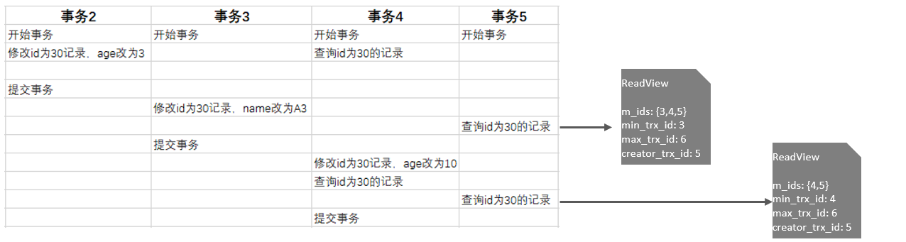

第一次快照读：

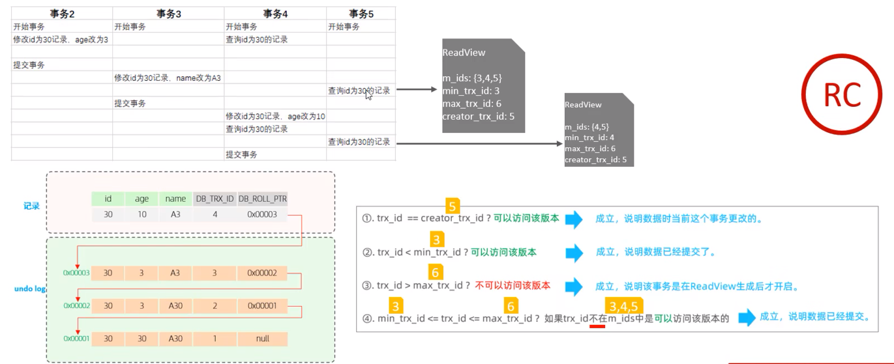


在进行匹配时，会从undo log的版本链，从上到下进行挨个匹配：

+ 先匹配DB_TRX_ID为4这行记录，将4带入右侧的匹配规则中。 ①不满足 ②不满足 ③不满足 ④也不满足 ，都不满足，则继续匹配undo log版本链的下一条。
+ 再匹配DB_TRX_ID为3这行记录，将3带入右侧的匹配规则中。①不满足 ②不满足 ③不满足 ④也不满足 ，都不满足，则继续匹配undo log版本链的下一条。
+ 再匹配DB_TRX_ID为2这行记录，将2带入右侧的匹配规则中。①不满足 ②满足 终止匹配，此次快照读，返回的数据就是版本链中记录的这条数据。

第二次快照读：

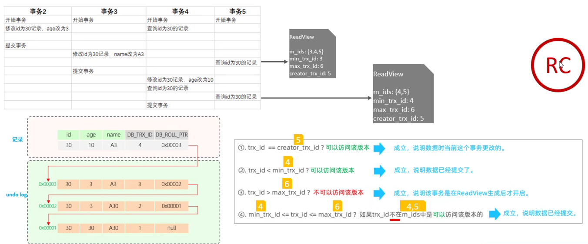

+ 先匹配DB_TRX_ID为4这行记录，将4带入右侧的匹配规则中。 ①不满足 ②不满足 ③不满足 ④也不满足 ，都不满足，则继续匹配undo log版本链的下一条。
+ 再匹配DB_TRX_ID为3这行记录，将3带入右侧的匹配规则中。①不满足 ②满足 。终止匹配，此次快照读，返回的数据就是版本链中记录的这条数据。


#### RR

RR隔离级别下，仅在事务中第一次执行快照读时生成ReadView，后续复用该ReadView。 RR 是可重复读，在一个事务中，执行两次相同的select语句，查询到的结果是一样的。

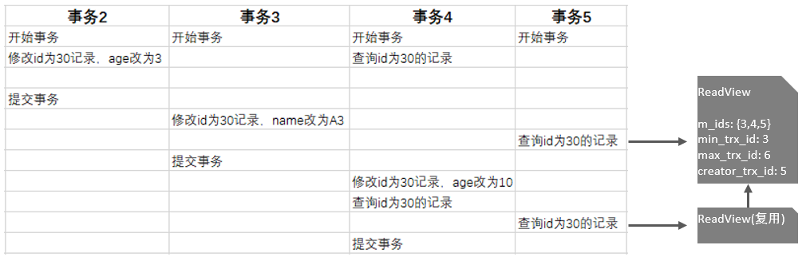


# MySQL管理

## 系统数据库

Mysql数据库安装完成后，自带了一下四个数据库，具体作用如下：

| 数据库             | 含义                                                         |
| ------------------ | ------------------------------------------------------------ |
| mysql              | 存储MySQL服务器正常运行所需要的各种信息（时区、主从、用户、权限等） |
| information_schema | 提供了访问数据库元数据的各种表和视图，包含数据库、表、字段类型及访问权限等 |
| performance_schema | 为MySQL服务器运行时状态提供了一个底层监控功能，主要用于收集数据库服务器性能参数 |
| sys                | 包含了一系列方便DBA和开发人员利用performance_schema性能数据库进行性能调优和诊断的视图 |


## 常用工具

### mysql

```sql
语法 ：
	mysql [options] [database]
选项 ：
	-u, --user=name #指定用户名
	-p, --password[=name] #指定密码
	-h, --host=name #指定服务器IP或域名
	-P, --port=port #指定连接端口
	-e, --execute=name #执行SQL语句并退出
```

-e选项可以在Mysql客户端执行SQL语句，而不用连接到MySQL数据库再执行，对于一些批处理脚本，这种方式尤其方便。

例子：

```sql
mysql -uroot –p123456 db01 -e "1 select * from stu";
```


### mysqladmin

mysqladmin 是一个执行管理操作的客户端程序。可以用它来检查服务器的配置和当前状态、创建并删除数据库等。

```sql
语法:
	mysqladmin [options] command ...
选项:
	-u, --user=name #指定用户名
	-p, --password[=name] #指定密码
	-h, --host=name #指定服务器IP或域名
	-P, --port=port #指定连接端口
```

例子：

```sql
mysqladmin -uroot –p1234 drop 'test01';
mysqladmin -uroot –p1234 version;
mysqladmin -uroot –p1234 create db02;
```


### mysqlbinlog

由于服务器生成的二进制日志文件以二进制格式保存，所以如果想要检查这些文本的文本格式，就会使用到mysqlbinlog 日志管理工具。

```sql
语法 ：
	mysqlbinlog [options] log-files1 log-files2 ...
选项 ：
	-d, --database=name 指定数据库名称，只列出指定的数据库相关操作。
	-o, --offset=# 忽略掉日志中的前n行命令。
	-r,--result-file=name 将输出的文本格式日志输出到指定文件。
	-s, --short-form 显示简单格式， 省略掉一些信息。
	--start-datatime=date1 --stop-datetime=date2 指定日期间隔内的所有日志。
	--start-position=pos1 --stop-position=pos2 指定位置间隔内的所有日志。
```


### mysqlshow

mysqlshow 客户端对象查找工具，用来很快地查找存在哪些数据库、数据库中的表、表中的列或者索引。

```sql
语法 ：
	mysqlshow [options] [db_name [table_name [col_name]]]
选项 ：
	--count 显示数据库及表的统计信息（数据库，表 均可以不指定）
	-i 显示指定数据库或者指定表的状态信息
	
示例：
	#查询test库中每个表中的字段书，及行数
		mysqlshow -uroot -p2143 test --count
	#查询test库中book表的详细情况
		mysqlshow -uroot -p2143 test book --count
```


### mysqldump

mysqldump 客户端工具用来备份数据库或在不同数据库之间进行数据迁移。备份内容包含创建表，及插入表的SQL语句。

```sql
语法 ：
	mysqldump [options] db_name [tables]
	mysqldump [options] --database/-B db1 [db2 db3...]
	mysqldump [options] --all-databases/-A
连接选项 ：
	-u, --user=name 指定用户名
	-p, --password[=name] 指定密码
	-h, --host=name 指定服务器ip或域名
	-P, --port=# 指定连接端口
输出选项：
	--add-drop-database 在每个数据库创建语句前加上 drop database 语句
	--add-drop-table 在每个表创建语句前加上 drop table 语句 , 默认开启 ; 不开启 (--skip-add-drop-table)
	-n, --no-create-db 不包含数据库的创建语句
	-t, --no-create-info 不包含数据表的创建语句
	-d --no-data 不包含数据
	-T, --tab=name 自动生成两个文件：一个.sql文件，创建表结构的语句；一个.txt文件，数据文件
```


### mysqlimport/source

mysqlimport 是客户端数据导入工具，用来导入mysqldump 加 -T 参数后导出的文本文件。

```sql
语法 ：
	mysqlimport [options] db_name textfile1 [textfile2...]
示例 ：
	mysqlimport -uroot -p2143 test /tmp/city.txt
```


如果需要导入sql文件,可以使用mysql中的source 指令 :

```sql
语法 ：
	source /root/xxxxx.sql
```

