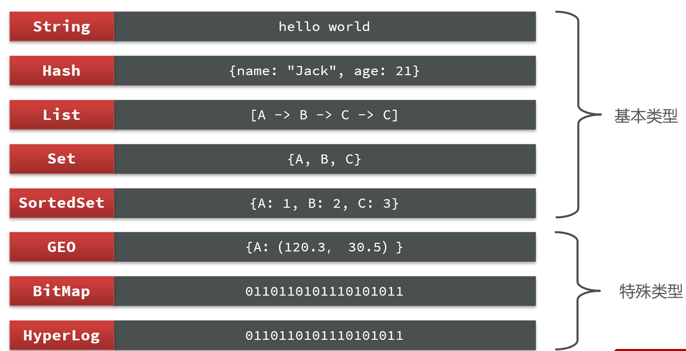

# img/Redis基础

## SQL & NoSQL


## img/Redis安装

### 安装

+ 安装gcc tcl依赖：`sudo apt install -y gcc tcl`
+ 编译安装redis：
  + 解压redis：`tar -xzf redis-6.2.6.tar.gz`
  + 进入redis目录：`cd redis-6.2.6`
  + 编译并安装：`make && make install`
+ 默认安装在 `/usr/local/bin`目录下，默认配置到环境变量
  + redis-cli：是redis提供的命令行客户端
  + redis-server：是redis的服务端启动脚本
  + redis-sentinel：是redis的哨兵启动脚本

```bash
baicai@baicai:~$ ll /usr/local/bin
total 19056
drwxr-xr-x  2 root root    4096 Jan 31 20:37 ./
drwxr-xr-x 10 root root    4096 Jan  4  2023 ../
-rwxr-xr-x  1 root root 5042768 Jan 31 20:37 redis-benchmark*
lrwxrwxrwx  1 root root      12 Jan 31 20:37 redis-check-aof -> redis-server*
lrwxrwxrwx  1 root root      12 Jan 31 20:37 redis-check-rdb -> redis-server*
-rwxr-xr-x  1 root root 4876064 Jan 31 20:37 redis-cli*
lrwxrwxrwx  1 root root      12 Jan 31 20:37 redis-sentinel -> redis-server*
-rwxr-xr-x  1 root root 9577456 Jan 31 20:37 redis-server*
```

### 运行

#### 默认启动

`redis-server`

这种启动属于 前台启动，会阻塞整个会话窗口。

#### 指定配置启动

配置文件redis.conf在redis-6.2.6目录下。

```bash
baicai@baicai:~/workspace/learnredis/redis-6.2.6$ ll
total 360
drwxr-xr-x  7 baicai baicai  4096 Jan 31 20:54 ./
drwxr-xr-x  4 baicai baicai  4096 Jan 31 21:02 ../
drwxr-xr-x  4 baicai baicai  4096 Oct  4  2021 .github/
-rw-r--r--  1 baicai baicai   483 Oct  4  2021 .gitignore
-rw-r--r--  1 baicai baicai 33624 Oct  4  2021 00-RELEASENOTES
-rw-r--r--  1 baicai baicai    51 Oct  4  2021 BUGS
-rw-r--r--  1 baicai baicai  5026 Oct  4  2021 CONDUCT
-rw-r--r--  1 baicai baicai  3384 Oct  4  2021 CONTRIBUTING
-rw-r--r--  1 baicai baicai  1487 Oct  4  2021 COPYING
-rw-r--r--  1 baicai baicai    11 Oct  4  2021 INSTALL
-rw-r--r--  1 baicai baicai  6888 Oct  4  2021 MANIFESTO
-rw-r--r--  1 baicai baicai   151 Oct  4  2021 Makefile
-rw-r--r--  1 baicai baicai 21567 Oct  4  2021 README.md
-rw-r--r--  1 baicai baicai  3055 Oct  4  2021 TLS.md
drwxr-xr-x  7 baicai baicai  4096 Jan 31 20:27 deps/
-rw-r--r--  1 baicai baicai 93760 Jan 31 20:52 redis.conf
-rw-r--r--  1 root   root   93724 Jan 31 20:41 redis.conf.bck
-rw-r--r--  1 root   root     919 Jan 31 20:54 redis.log
-rwxr-xr-x  1 baicai baicai   275 Oct  4  2021 runtest*
-rwxr-xr-x  1 baicai baicai   279 Oct  4  2021 runtest-cluster*
-rwxr-xr-x  1 baicai baicai  1079 Oct  4  2021 runtest-moduleapi*
-rwxr-xr-x  1 baicai baicai   281 Oct  4  2021 runtest-sentinel*
-rw-r--r--  1 baicai baicai 13768 Oct  4  2021 sentinel.conf
drwxr-xr-x  3 baicai baicai 12288 Jan 31 20:37 src/
drwxr-xr-x 11 baicai baicai  4096 Oct  4  2021 tests/
drwxr-xr-x  9 baicai baicai  4096 Oct  4  2021 utils/
```

修改配置文件：

+ 备份配置文件：`cp redis.conf redis.conf.bck`
+ 修改redis的配置

```shell
# 监听的地址，默认是127.0.0.1，会导致只能在本地访问。修改为0.0.0.0则可以在任意IP访问，生产环境不要设置为0.0.0.0
bind 0.0.0.0
# 守护进程，修改为yes后即可后台运行
daemonize yes 
# 密码，设置后访问img/Redis必须输入密码
requirepass 123456
```

+ redis其他常见配置

```shell
# 监听的端口
port 6379
# 工作目录，默认是当前目录，也就是运行redis-server时的命令，日志、持久化等文件会保存在这个目录
dir .
# 数据库数量，设置为1，代表只使用1个库，默认有16个库，编号0~15
databases 1
# 设置redis能够使用的最大内存
maxmemory 512mb
# 日志文件，默认为空，不记录日志，可以指定日志文件名
logfile "redis.log"
```

启动img/Redis：

```shell
# 进入redis安装目录 
# 启动
redis-server redis.conf
```

停止服务：

```shell
# 利用redis-cli来执行 shutdown 命令，即可停止 img/Redis 服务，
# 因为之前配置了密码，因此需要通过 -u 来指定密码
redis-cli -u 123456 shutdown
```

#### 开机启动

新建一个系统服务文件：

```bash
vim /etc/systemd/system/redis.service
```

内容如下：

```sh
[Unit]
Description=redis-server
After=network.target

[Service]
Type=forking
ExecStart=/usr/local/bin/redis-server /home/baicai/workspace/learnredis/redis-6.2.6/redis.conf
PrivateTmp=true

[Install]
WantedBy=multi-user.target
```

重载系统服务：

```sh
systemctl daemon-reload
```

现在可以用下面这组命令来操作redis了：

```sh
# 启动
systemctl start redis
# 停止
systemctl stop redis
# 重启
systemctl restart redis
# 查看状态
systemctl status redis
```

让redis开机自启：

```sh
systemctl enable redis
```

### redis客户端

#### 命令行客户端

img/Redis安装完成后就自带了命令行客户端：redis-cli

```sh
redis-cli [options] [commonds]
```

常见的options有：

- `-h 127.0.0.1`：指定要连接的redis节点的IP地址，默认是127.0.0.1
- `-p 6379`：指定要连接的redis节点的端口，默认是6379
- `-a 123456`：指定redis的访问密码 。也可以不指定密码，在进入控制台后通过`auth 123456`命令来指定密码。

commonds就是img/Redis的操作命令，如：

- `ping`：与redis服务端做心跳测试，服务端正常会返回`pong`
- `select 0~15之间数字`：选择仓库

不指定commond时，会进入`redis-cli`的交互控制台：

```bash
baicai@baicai:~/workspace/learnredis/redis-6.2.6$ redis-cli
127.0.0.1:6379> ping
(error) NOAUTH Authentication required.
127.0.0.1:6379> auth 123456
OK
127.0.0.1:6379> ping
PONG
127.0.0.1:6379> help @generic

  COPY source destination [DB destination-db] [REPLACE]
  summary: Copy a key
  since: 6.2.0
......
```

#### resp

使用resp连接wsl中的redis：


进入resp主页面：


img/Redis默认有16个仓库，编号从0至15.  通过配置文件可以设置仓库数量，但是不超过16，并且不能自定义仓库名称。


## img/Redis常用命令

### img/Redis数据结构




### 通用命令

+ help [command]：帮助命令
+ KEYS：查看符合模板的所有key。耗时且会阻塞线程（redis是单线程的），因此不建议在生产环境中使用
+ DEL：删除一个指定的key
  + 返回值表示删除的数量
+ EXISTS：判断key是否存在
+ EXPIRE：给一个key设置有效期，有效期到期时该key会被自动删除
+ TTL：查看一个KEY的剩余有效期
  + 返回-1是永久有效

```bash
127.0.0.1:6379> KEYS *
1) "age"
2) "name"
127.0.0.1:6379> DEL age
(integer) 1
127.0.0.1:6379> KEYS *
1) "name"
127.0.0.1:6379> MSET k1 v1 k2 v2 k3 v3
OK
127.0.0.1:6379> keys *
1) "k2"
2) "k1"
3) "name"
4) "k3"
127.0.0.1:6379> DEL k1 k2 k3 k4
(integer) 3
127.0.0.1:6379> keys *
1) "name"
127.0.0.1:6379> EXISTS name
(integer) 1
127.0.0.1:6379> EXISTS age
(integer) 0
127.0.0.1:6379> EXPIRE name 10
(integer) 1
127.0.0.1:6379> TTL name
(integer) 6
127.0.0.1:6379> TTL name
(integer) 4
127.0.0.1:6379> TTL name
(integer) 2
127.0.0.1:6379> TTL name
(integer) 1
127.0.0.1:6379> TTL name
(integer) -2
127.0.0.1:6379> keys *
(empty array)
127.0.0.1:6379> set name tom
OK
127.0.0.1:6379> TTL name
(integer) -1  
127.0.0.1:6379>
```


### String类型

String字符串类型，是img/Redis中最简单的存储类型。

其value是字符串，不过根据字符串的格式不同，又可以分为3类：

+ string：普通字符串

+ int：整数类型，可以做自增、自减操作

+ float：浮点类型，可以做自增、自减操作

不管是哪种格式，**底层都是字节数组形式存储**，只不过是编码方式不同。字符串类型的最大空间不能超过512M

String的常见命令有：

+ SET：添加或者修改已经存在的一个String类型的键值对

+ GET：根据key获取String类型的value

+ MSET：批量添加多个String类型的键值对

+ MGET：根据多个key获取多个String类型的value

+ INCR：让一个整型的key自增1

+ INCRBY:让一个整型的key自增并指定步长，例如：incrby num 2 让num值自增2

+ INCRBYFLOAT：让一个浮点类型的数字自增并指定步长

+ SETNX：添加一个String类型的键值对，前提是这个key不存在，否则不执行
  + 真正的新增

+ SETEX：添加一个String类型的键值对，并且指定有效期
  + EXPIRE命令是给一个存在的key添加有效期，SETEX是在添加key的同时添加有效期
  + 等同于：`set k v ex 秒数`

```bash
127.0.0.1:6379> KEYS *
1) "name"
127.0.0.1:6379> get name
"tom"
127.0.0.1:6379> set name zhang3
OK
127.0.0.1:6379> get name
"zhang3"
127.0.0.1:6379> MSET k1 v1 name wang5
OK
127.0.0.1:6379> MGET k1 name
1) "v1"
2) "wang5"
127.0.0.1:6379> set age 18
OK
127.0.0.1:6379> get age
"18"
127.0.0.1:6379> INCR age
(integer) 19
127.0.0.1:6379> get age
"19"
127.0.0.1:6379> INCRBY age 10
(integer) 29
127.0.0.1:6379> get age
"29"
127.0.0.1:6379> INCRBY age -10
(integer) 19
127.0.0.1:6379> get age
"19"
127.0.0.1:6379> set score 10.1
OK
127.0.0.1:6379> INCRBYFLOAT score 0.5
"10.6"
127.0.0.1:6379> get score
"10.6"
127.0.0.1:6379> keys *
1) "age"
2) "score"
3) "k1"
4) "name"
127.0.0.1:6379> SETNX score 9.9
(integer) 0
127.0.0.1:6379> get score
"10.6"
127.0.0.1:6379> SETEX name 8 wangmazi
OK
127.0.0.1:6379> TTL name
(integer) 3
127.0.0.1:6379> TTL name
(integer) 2
127.0.0.1:6379> TTL name
(integer) -2
127.0.0.1:6379> set name wang5 ex 8 
OK
127.0.0.1:6379> TTL name
(integer) 2
127.0.0.1:6379> TTL name
(integer) 0
127.0.0.1:6379> TTL name
(integer) -2
127.0.0.1:6379> help set

  SET key value [EX seconds|PX milliseconds|EXAT timestamp|PXAT milliseconds-timestamp|KEEPTTL] [NX|XX] [GET]
  summary: Set the string value of a key
  since: 1.0.0
  group: string

```

如何区分不同类型的key？

> redis的key允许有多个单词形成层级结构，多个单词之间用 `:` 隔开，如`项目名:业务名:类型:id`。这个按需修改词条。
>
> 如果Value是一个Java对象，则可以将对象序列化为JSON字符串后存储：
>
> | key            | value                                  |
> | -------------- | -------------------------------------- |
> | demo:user:1    | '{"id":1,"name":"jack","age":21}'      |
> | demo:product:1 | '{"id":1,"name":"apple","price":9999}' |
>
> 

### Hash类型

Hash类型，也叫散列，其value是一个无序字典


Hash的常见命令：

+ HSET key field value：添加或者修改hash类型key的field的值

+ HGET key field：获取一个hash类型key的field的值

+ HMSET：批量添加多个hash类型key的field的值

+ HMGET：批量获取多个hash类型key的field的值

+ HGETALL：获取一个hash类型的key中的所有的field和value

+ HKEYS：获取一个hash类型的key中的所有的field

+ HVALS：获取一个hash类型的key中的所有的value

+ HINCRBY:让一个hash类型key的字段值自增并指定步长

+ HSETNX：添加一个hash类型的key的field值，前提是这个field不存在，否则不执行

```bash
127.0.0.1:6379> keys *
(empty array)
127.0.0.1:6379> HSET demo:user:2 name lucy
(integer) 1
127.0.0.1:6379> HSET demo:user:2 age 21
(integer) 1
127.0.0.1:6379> HSET demo:user:2 age 17
(integer) 0
127.0.0.1:6379> HGET demo:user:2 age
"17"
127.0.0.1:6379> HMSET demo:user:3 name tom age 99
OK
127.0.0.1:6379> HMGET demo:user:3 name age
1) "tom"
2) "99"
127.0.0.1:6379> HGETALL demo:user:3
1) "name"
2) "tom"
3) "age"
4) "99"
127.0.0.1:6379> HKEYS demo:user:3
1) "name"
2) "age"
127.0.0.1:6379> HVALS demo:user:3
1) "tom"
2) "99"
127.0.0.1:6379> HINCRBY demo:user:3 age -88
(integer) 11
127.0.0.1:6379> HSETNX demo:user:3 age 10
(integer) 0
127.0.0.1:6379> HGET demo:user:3 age
"11"
127.0.0.1:6379> HSETNX demo:user:3 sex man
(integer) 1
127.0.0.1:6379> HGET demo:user:3 sex
"man"
127.0.0.1:6379>
```

### List类型

List类型可以看做是一个双向链表结构，既可以支持正向检索和也可以支持反向检索。

特征与Java中的LinkedList类似：

+ 有序

+ 元素可以重复

+ 插入和删除快

+ 查询速度一般

List的常见命令有：

+ LPUSH key element ... ：向列表左侧插入一个或多个元素

+ LPOP key：移除并返回列表左侧的第一个元素，没有则返回nil

+ RPUSH key element ... ：向列表右侧插入一个或多个元素

+ RPOP key：移除并返回列表右侧的第一个元素

+ LRANGE key star end：返回一段角标范围内的所有元素

+ BLPOP和BRPOP：与LPOP和RPOP类似，只不过在没有元素时等待指定时间，而不是直接返回nil


```bash
127.0.0.1:6379> lpush users 1  2 3 4
(integer) 4
127.0.0.1:6379> rpush user 4 5 6
(integer) 3
127.0.0.1:6379> DEL user
(integer) 1
127.0.0.1:6379> rpush users 4 5 6
(integer) 7
127.0.0.1:6379> lpop users 1
1) "4"
127.0.0.1:6379> lpop users 1
1) "3"
127.0.0.1:6379> lpop users 1
1) "2"
127.0.0.1:6379> rpop users 1
1) "6"
127.0.0.1:6379> rpop users 1
1) "5"
127.0.0.1:6379> LRANGE users 0 1
1) "1"
2) "4"
127.0.0.1:6379> blpop users2 100
1) "users2"
2) "1"
(60.62s)
```

### Set类型

img/Redis的Set结构与Java中的HashSet类似，可以看做是一个value为null的HashMap。因为也是一个hash表，因此与HashSet特征类似：

+ 无序
+ 元素不可重复
+ 查找快
+ 支持交集、并集、差集等功能

String的常见命令有：

+ SADD key member ... ：向set中添加一个或多个元素

+ SREM key member ... : 移除set中的指定元素

+ SCARD key： 返回set中元素的个数

+ SISMEMBER key member：判断一个元素是否存在于set中

+ SMEMBERS：获取set中的所有元素

+ SINTER key1 key2 ... ：求key1与key2的交集

+ SDIFF key1 key2 ... ：求key1与key2的差集

+ SUNION key1 key2 ..：求key1和key2的并集

```bash
127.0.0.1:6379> sadd s1 a b c
(integer) 3
127.0.0.1:6379> SMEMBERS s1
1) "b"
2) "a"
3) "c"
127.0.0.1:6379> srem s1 a
(integer) 1
127.0.0.1:6379> SISMEMBER s1 a
(integer) 0
127.0.0.1:6379> SISMEMBER s1 b
(integer) 1
127.0.0.1:6379> SCARD s1
(integer) 2
127.0.0.1:6379>
```


> Set命令练习：
>
> 将下列数据用img/Redis的Set集合来存储：
>
> + 张三的好友有：李四、王五、赵六
> + 李四的好友有：王五、麻子、二狗
>
> 利用Set的命令实现下列功能：
>
> 1. 计算张三的好友有几人
> 2. 计算张三和李四有哪些共同好友
> 3. 查询哪些人是张三的好友却不是李四的好友
> 4. 查询张三和李四的好友总共有哪些人
> 5. 判断李四是否是张三的好友
> 6. 判断张三是否是李四的好友
> 7. 将李四从张三的好友列表中移除
>
> ```bash
> 127.0.0.1:6379> sadd zs lisi wangwu zhaoliu
> (integer) 3
> 127.0.0.1:6379> sadd ls wangwu mazi ergou
> (integer) 3
> 127.0.0.1:6379> SCARD zs
> (integer) 3
> 127.0.0.1:6379> SINTER zs ls
> 1) "wangwu"
> 127.0.0.1:6379> sdiff zs ls
> 1) "lisi"
> 2) "zhaoliu"
> 127.0.0.1:6379> SUNION zs ls
> 1) "wangwu"
> 2) "ergou"
> 3) "lisi"
> 4) "zhaoliu"
> 5) "mazi"
> 127.0.0.1:6379> SISMEMBER zs lisi
> (integer) 1
> 127.0.0.1:6379> SISMEMBER ls zhangsan
> (integer) 0
> 127.0.0.1:6379> SREM zs lisi
> (integer) 1
> 127.0.0.1:6379>
> ```
>
> 


### SortedSet类型

img/Redis的SortedSet是一个可排序的set集合，与Java中的TreeSet有些类似，但底层数据结构却差别很大。

SortedSet中的每一个元素都带有一个score属性，可以基于score属性对元素排序，底层的实现是一个跳表（SkipList）加 hash表。

SortedSet具备下列特性：

+ 可排序
+ 元素不重复
+ 查询速度快

SortedSet的常见命令有：

+ ZADD key score member：添加一个或多个元素到sorted set ，如果已经存在则更新其score值
+ ZREM key member：删除sorted set中的一个指定元素
+ ZSCORE key member : 获取sorted set中的指定元素的score值
+ ZRANK key member：获取sorted set 中的指定元素的排名
+ ZCARD key：获取sorted set中的元素个数
+ ZCOUNT key min max：统计score值在给定范围内的所有元素的个数
+ ZINCRBY key increment member：让sorted set中的指定元素自增，步长为指定的increment
+ ZRANGE key min max：按照score排序后，获取指定排名范围内的元素
+ ZRANGEBYSCORE key min max：按照score排序后，获取指定score范围内的元素
+ ZDIFF、ZINTER、ZUNION：求差集、交集、并集
+ 注意：所有的排名默认都是升序，如果要降序则在命令的Z后面添加REV即可

> SortedSet命令练习：
>
> 将班级的下列学生得分存入img/Redis的SortedSet中：Jack 85, Lucy 89, Rose 82, Tom 95, Jerry 78, Amy 92, Miles 76，并实现下列功能：
>
> 1. 删除Tom同学
> 2. 获取Amy同学的分数
> 3. 获取Rose同学的排名
> 4. 查询80分以下有几个学生
> 5. 给Amy同学加2分
> 6. 查出成绩前3名的同学
> 7. 查出成绩80分以下的所有同学
>
> ```bash
> 127.0.0.1:6379> zadd stus 85 jack 89 lucy 82 rose 95 tom 78 jerry 92 amy 76 miles
> (integer) 7
> 127.0.0.1:6379> zrem stus tom
> (integer) 1
> 127.0.0.1:6379> zscore stus amy
> "92"
> 127.0.0.1:6379> ZREVRANK stus rose
> (integer) 3
> 127.0.0.1:6379> zcount stus 0 80
> (integer) 2
> 127.0.0.1:6379> ZINCRBY stus 2 amy
> "94"
> 127.0.0.1:6379> zrevrange stus 0 2
> 1) "amy"
> 2) "lucy"
> 3) "jack"
> 127.0.0.1:6379> ZRANGEBYSCORE stus 0 80
> 1) "miles"
> 2) "jerry"
> 127.0.0.1:6379>
> ```
>
> 


## img/Redis的Java客户端

Jedis以img/Redis命令作为方法名称，学习成本低，简单实用。但是Jedis实例是线程不安全的，多线程环境下需要基于连接池来使用。

Lettuce是基于Netty实现的，支持同步、异步和响应式编程方式，并且是线程安全的。支持img/Redis的哨兵模式、集群模式和管道模式。Spring默认支持这种。

img/Redisson是一个基于img/Redis实现的分布式、可伸缩的Java数据结构集合。包含了诸如Map、Queue、Lock、 Semaphore、AtomicLong等强大功能

.......

### Jedis

+ 引入依赖

```xml
<dependency>
    <groupId>redis.clients</groupId>
    <artifactId>jedis</artifactId>
    <version>3.7.0</version>
</dependency>
```

+ 创建Jedis对象，建立连接

+ 使用Jedis，方法名与img/Redis命令一致

+ 释放资源

```java

public class JedisTest {
    private Jedis jedis;

    @BeforeEach
    void setUp(){
        // 建立连接
        jedis = new Jedis("localhost",6379);
        jedis.auth("123456");
        // 选择库
        jedis.select(0);
    }

    @Test
    void testString(){
        //插入数据，方法名就是redis命令名称
        String result = jedis.set("name","张三");
        System.out.println("result="+result);

        // 获取数据
        String name = jedis.get("name");
        System.out.println("name="+name);
    }

    @AfterEach
    void tearDown(){
        //  释放资源
        if(jedis != null){
            jedis.close();
        }
    }
}

```

```java
result=OK
name=张三
```

#### Jedis连接池

```java
public class JedisConnectionFactory {
    private static final JedisPool jedisPool;

    static {
        JedisPoolConfig jedisPoolConfig = new JedisPoolConfig();
        // 最大连接数
        jedisPoolConfig.setMaxTotal(8);
        //  最大空闲连接
        jedisPoolConfig.setMaxIdle(8);
        // 最小空闲连接
        jedisPoolConfig.setMinIdle(1);
        //  设置最长等待时间 ms
        jedisPoolConfig.setMaxWaitMillis(1000);
        // 创建连接池对象
        jedisPool = new JedisPool(jedisPoolConfig,"localhost",6379,1000,"123456");
    }

    public static Jedis getJedis(){
        return jedisPool.getResource();
    }
}
```

```java
public class JedisTest {
    private Jedis jedis;

    @BeforeEach
    void setUp(){
        // 从池子里获取连接
        jedis=JedisConnectionFactory.getJedis();
        // 选择库
        jedis.select(0);
    }

    @Test
    void testString(){
        //插入数据，方法名就是redis命令名称
        String result = jedis.set("name","张三");
        System.out.println("result="+result);

        // 获取数据
        String name = jedis.get("name");
        System.out.println("name="+name);
    }

    @AfterEach
    void tearDown(){
        if (jedis!=null){
            jedis.close();
        }
    }
}
```

### SpringDataimg/Redis

SpringData是Spring中数据操作的模块，包含对各种数据库的集成，其中对img/Redis的集成模块就叫做[SpringDataimg/Redis](https://spring.io/projects/spring-data-redis)

+ 提供了对不同img/Redis客户端的整合（Lettuce和Jedis）
+ 提供了img/RedisTemplate统一API来操作img/Redis
+ 支持img/Redis的发布订阅模型
+ 支持img/Redis哨兵和img/Redis集群
+ 支持基于Lettuce的响应式编程
+ 支持基于JDK、JSON、字符串、Spring对象的数据序列化及反序列化
+ 支持基于img/Redis的JDKCollection实现


#### SpringDataimg/Redis使用

+ 引入spring-boot-starter-data-redis依赖

```xml
<!-- redis依赖 -->
<dependency>
    <groupId>org.springframework.boot</groupId>
    <artifactId>spring-boot-starter-data-redis</artifactId>
</dependency>

<!-- common-pool-->
<dependency>
    <groupId>org.apache.commons</groupId>
    <artifactId>commons-parent</artifactId>
</dependency>
```

+ 在application.yml配置img/Redis信息

```yaml
spring:
  data:
    redis:
      host: localhost
      port: 6379
      password: 123456
      lettuce:
        pool:
          max-active: 8
          max-idle: 8
          min-idle: 1
          max-wait: 1000ms
```

+ 注入img/RedisTemplate，使用

```java
@SpringBootTest
public class img/RedisDemoApplicationTests {

    @Autowired
    private img/RedisTemplate redisTemplate;

    @Test
    void testString(){
        // 写入String类型
        redisTemplate.opsForValue().set("name","张老二");

        // 获取数据
        Object name=redisTemplate.opsForValue().get("name"); //张老二
        System.out.println(name);
    }

}
```


#### SpringDataimg/Redis序列化方式

上边代码运行后实际上插入的key：

```bash
127.0.0.1:6379> keys *
1) "\xac\xed\x00\x05t\x00\x04name"
......
```

img/RedisTemplate可以接收任意Object作为值写入img/Redis，只不过写入前会把Object序列化为字节形式，默认是采用JDK序列化，缺点是：可读性差、内存占用较大。

#### 自定义img/RedisTemplate的序列化方式

```java
@Configuration
public class img/RedisConfig {

    @Bean
    public img/RedisTemplate<String, Object> redisTemplate(img/RedisConnectionFactory connectionFactory){
        // 创建img/RedisTemplate对象
        img/RedisTemplate<String, Object> template = new img/RedisTemplate<>();
        // 设置连接工厂
        template.setConnectionFactory(connectionFactory);
        // 创建JSON序列化工具
        GenericJackson2Jsonimg/RedisSerializer jsonimg/RedisSerializer = new GenericJackson2Jsonimg/RedisSerializer();
        // 设置Key的序列化
        template.setKeySerializer(img/RedisSerializer.string());
        template.setHashKeySerializer(img/RedisSerializer.string());
        // 设置Value的序列化
        template.setValueSerializer(jsonimg/RedisSerializer);
        template.setHashValueSerializer(jsonimg/RedisSerializer);
        // 返回
        return template;
    }
}
```

```java
@SpringBootTest
class img/RedisDemoApplicationTests {

    @Autowired
    private img/RedisTemplate<String,Object> redisTemplate;

    @Test
    void testString() {
        // 写入一条String数据
        redisTemplate.opsForValue().set("name", "虎哥");
        // 获取string数据
        Object name = redisTemplate.opsForValue().get("name");
        System.out.println("name = " + name);
    }

    @Test
    void testSaveUser() {
        // 写入数据
        redisTemplate.opsForValue().set("user:100", new User("虎哥", 21));
        // 获取数据
        User o = (User) redisTemplate.opsForValue().get("user:100");
        System.out.println("o = " + o);
    }
}
```

这种方式会自动序列化反序列化，但会在redis中记录类的字节码导致占用空间：

```json
{
  "@class": "com.heima.redis.pojo.User",
  "name": "虎哥",
  "age": 21
}
```


#### Stringimg/RedisTemplate

为了节省内存空间，并不会使用JSON序列化器来处理value，而是统一使用String序列化器，要求只能存储String类型的key和value。当需要存储Java对象时，手动完成对象的序列化和反序列化。

Spring默认提供了一个Stringimg/RedisTemplate类，它的key和value的序列化方式默认就是String方式。

```java
@SpringBootTest
class img/RedisStringTests {

    @Autowired
    private Stringimg/RedisTemplate stringimg/RedisTemplate;

    @Test
    void testString() {
        // 写入一条String数据
        stringimg/RedisTemplate.opsForValue().set("verify:phone:13600527634", "124143");
        // 获取string数据
        Object name = stringimg/RedisTemplate.opsForValue().get("name");
        System.out.println("name = " + name);
    }

    private static final ObjectMapper mapper = new ObjectMapper();

    @Test
    void testSaveUser() throws JsonProcessingException {
        // 创建对象
        User user = new User("虎哥", 21);
        // 手动序列化
        String json = mapper.writeValueAsString(user);
        // 写入数据
        stringimg/RedisTemplate.opsForValue().set("user:200", json);

        // 获取数据
        String jsonUser = stringimg/RedisTemplate.opsForValue().get("user:200");
        // 手动反序列化
        User user1 = mapper.readValue(jsonUser, User.class);
        System.out.println("user1 = " + user1);
    }

    @Test
    void testHash() {
        stringimg/RedisTemplate.opsForHash().put("user:400", "name", "虎哥");
        stringimg/RedisTemplate.opsForHash().put("user:400", "age", "21");

        Map<Object, Object> entries = stringimg/RedisTemplate.opsForHash().entries("user:400");
        System.out.println("entries = " + entries);
    }

}

```

# img/Redis实战

## 短信登录


## 商户查询缓存


## 优惠券秒杀


## 达人探店


## 好友关注


## 附近的商户


## 用户签到


## UV统计


# img/Redis高级


# img/Redis原理

