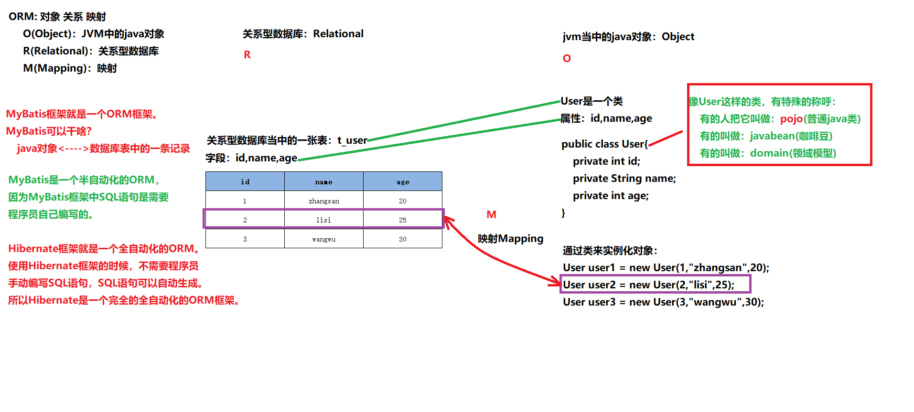

# img/MyBatis概述

## 框架

- 框架其实就是对通用代码的封装，提前写好了一堆接口和类，我们可以在做项目的时候直接引入这些接口和类（引入框架），基于这些现有的接口和类进行开发，可以大大提高开发效率。
- 框架一般都以jar包的形式存在。(jar包中有class文件以及各种配置文件等。)

## 三层架构


- 表现层（UI）：直接跟前端打交互（一是接收前端ajax请求，二是返回json数据给前端）
- 业务逻辑层（BLL）：一是处理表现层转发过来的前端请求（也就是具体业务），二是将从持久层获取的数据返回到表现层。
- 数据访问层（DAL）：直接操作数据库完成CRUD，并将获得的数据返回到上一层（也就是业务逻辑层）。
- Java持久层框架：
   - img/MyBatis
   - Hibernate（实现了JPA规范）
   - Spring Data（实现了JPA规范）
   - ......


## JDBC不足

- 示例代码1：


```java
// ......
// sql语句写死在java程序中
String sql = "insert into t_user(id,idCard,username,password,birth,gender,email,city,street,zipcode,phone,grade) values(?,?,?,?,?,?,?,?,?,?,?,?)";
PreparedStatement ps = conn.prepareStatement(sql);
// 繁琐的赋值，可以通过反射机制来做自动化。
ps.setString(1, "1");
ps.setString(2, "123456789");
ps.setString(3, "zhangsan");
ps.setString(4, "123456");
ps.setString(5, "1980-10-11");
ps.setString(6, "男");
ps.setString(7, "zhangsan@126.com");
ps.setString(8, "北京");
ps.setString(9, "大兴区凉水河二街");
ps.setString(10, "1000000");
ps.setString(11, "16398574152");
ps.setString(12, "A");
// 执行SQL
int count = ps.executeUpdate();
// ......
```

- 示例代码2：


```java
// ......
// sql语句写死在java程序中
String sql = "select id,idCard,username,password,birth,gender,email,city,street,zipcode,phone,grade from t_user";
PreparedStatement ps = conn.prepareStatement(sql);
ResultSet rs = ps.executeQuery();
List<User> userList = new ArrayList<>();
// 循环中的所有代码是否可以使用反射进行自动化封装？
while(rs.next()){
    // 获取数据
    String id = rs.getString("id");
    String idCard = rs.getString("idCard");
    String username = rs.getString("username");
    String password = rs.getString("password");
    String birth = rs.getString("birth");
    String gender = rs.getString("gender");
    String email = rs.getString("email");
    String city = rs.getString("city");
    String street = rs.getString("street");
    String zipcode = rs.getString("zipcode");
    String phone = rs.getString("phone");
    String grade = rs.getString("grade");
    // 创建对象
    User user = new User();
    // 给对象属性赋值
    user.setId(id);
    user.setIdCard(idCard);
    user.setUsername(username);
    user.setPassword(password);
    user.setBirth(birth);
    user.setGender(gender);
    user.setEmail(email);
    user.setCity(city);
    user.setStreet(street);
    user.setZipcode(zipcode);
    user.setPhone(phone);
    user.setGrade(grade);
    // 添加到集合
    userList.add(user);
}
// ......
```

- JDBC不足：
   - SQL语句写死在Java程序中，违背开闭原则OCP。
   - 给?传值是繁琐的。不能自动化。
   - 将结果集封装成Java对象是繁琐的，不能自动化。


## 了解img/MyBatis

- img/MyBatis本质上就是对JDBC的封装，通过img/MyBatis完成CRUD。
- ORM：对象关系映射
   - O（Object）：Java虚拟机中的Java对象
   - R（Relational）：关系型数据库
   - M（Mapping）：将Java虚拟机中的Java对象映射到数据库表中一行记录，或是将数据库表中一行记录映射成Java虚拟机中的一个Java对象。



# img/MyBatis入门
## img/MyBatis入门程序

- 步骤1：打包方式：jar（这不是web项目，打jar包即可）


```xml
<groupId>com.powernode</groupId>
<artifactId>mybatis-001-introduction</artifactId>
<version>1.0-SNAPSHOT</version>
<packaging>jar</packaging>
```

- 步骤2：引入依赖（mybatis依赖 + mysql驱动依赖）


```xml
<!--mybatis核心依赖-->
<dependency>
  <groupId>org.mybatis</groupId>
  <artifactId>mybatis</artifactId>
  <version>3.5.10</version>
</dependency>
<!--mysql驱动依赖-->
<dependency>
  <groupId>mysql</groupId>
  <artifactId>mysql-connector-java</artifactId>
  <version>8.0.30</version>
</dependency>
```

- 步骤3：在resources根目录下新建mybatis-config.xml配置文件


```xml
<configuration>
    <environments default="development">
        <environment id="development">
            <transactionManager type="JDBC"/>
            <dataSource type="POOLED">
                <property name="driver" value="com.mysql.cj.jdbc.Driver"/>
                <property name="url" value="jdbc:mysql://localhost:3306/powernode"/>
                <property name="username" value="root"/>
                <property name="password" value="root"/>
            </dataSource>
        </environment>
    </environments>
    <mappers>
        <!--sql映射文件创建好之后，需要将该文件路径配置到这里-->
        <mapper resource=""/>
    </mappers>
</configuration>
```
- 步骤4：在resources根目录下新建CarMapper.xml配置文件


```xml
<?xml version="1.0" encoding="UTF-8" ?>
<!DOCTYPE mapper
        PUBLIC "-//mybatis.org//DTD Mapper 3.0//EN"
        "http://mybatis.org/dtd/mybatis-3-mapper.dtd">
<!--namespace先随意写一个-->
<mapper namespace="car">
    <!--insert sql：保存一个汽车信息-->
    <insert id="insertCar">
        insert into t_car
            (id,car_num,brand,guide_price,produce_time,car_type) 
        values
            (null,'102','丰田mirai',40.30,'2014-10-05','氢能源')
    </insert>
</mapper>
```
注意1：**sql语句最后结尾可以不写“;”**
注意2：CarMapper.xml文件的名字不是固定的。可以使用其它名字。
注意3：CarMapper.xml文件的位置也是随意的。这里选择放在resources根下，相当于放到了类的根路径下。
注意4：将CarMapper.xml文件路径配置到mybatis-config.xml：

```xml
<mapper resource="CarMapper.xml"/>
```

- 步骤5：编写img/MyBatisIntroductionTest代码


```java
public class img/MyBatisIntroductionTest {
     public static void main(String[] args) throws Exception {

        // 获取SqlSessionFactoryBuilder对象
        SqlSessionFactoryBuilder sqlSessionFactoryBuilder = new SqlSessionFactoryBuilder();
        // 获取SqlSessionFactory对象
        InputStream is = Resources.getResourceAsStream("mybatis-config.xml"); // Resources.getResourceAsStream默认就是从类的根路径下开始查找资源。
        SqlSessionFactory sqlSessionFactory = sqlSessionFactoryBuilder.build(is); // 一般情况下都是一个数据库对应一个SqlSessionFactory对象。
        // 获取SqlSession对象
        SqlSession sqlSession = sqlSessionFactory.openSession(); // 如果使用的事务管理器是JDBC的话，底层实际上会执行：conn.setAutoCommit(false);
        // 执行SQL语句
        int count = sqlSession.insert("insertCar"); // 返回值是影响数据库表当中的记录条数。
        System.out.println("插入了几条记录：" + count);
        // 手动提交
        sqlSession.commit(); // 如果使用的事务管理器是JDBC的话，底层实际上还是会执行conn.commit();

    }
}
```


## 核心配置文件的名字和路径详解

- 核心配置文件的名字是随意的，因为以下的代码：


```java
// 文件名是出现在程序中的，文件名如果修改了，对应这里的java程序也改一下就行了。
InputStream is = Thread.currentThread().getContextClassLoader().getResourceAsStream("mybatis-config.xml");
```

- 核心配置文件如果放到其他目录下

将mybatis-config.xml文件拷贝一份放到D盘根下，然后编写以下程序：

```java
public class img/MyBatisConfigFilePath {
    public static void main(String[] args) throws Exception{
        // 1. 创建SqlSessionFactoryBuilder对象
        SqlSessionFactoryBuilder sqlSessionFactoryBuilder = new SqlSessionFactoryBuilder();
        // 2. 创建SqlSessionFactory对象
        // 这只是一个输入流，可以自己new。
        InputStream is = new FileInputStream("D:/mybatis-config.xml"); 
        SqlSessionFactory sqlSessionFactory = sqlSessionFactoryBuilder.build(is);
        // 3. 创建SqlSession对象
        SqlSession sqlSession = sqlSessionFactory.openSession();
        // 4. 执行sql
        int count = sqlSession.insert("insertCar");
        System.out.println("插入几条数据：" + count);
        // 5. 提交（mybatis默认采用的事务管理器是JDBC，默认是不提交的，需要手动提交。）
        sqlSession.commit();
        // 6. 关闭资源（只关闭是不会提交的）
        sqlSession.close();
    }

```
这样写程序健壮性差。

- 在mybatis中提供了一个类：**Resources**【org.apache.ibatis.io.Resources】

```java
// 这种方式只能从类路径当中获取资源，也就是说mybatis-config.xml文件需要在类路径下。
InputStream is = Resources.getResourceAsStream("mybatis-config.xml");
```
底层的源代码其实就是：

```java
InputStream is = ClassLoader.getSystemClassLoader().getResourceAsStream("mybatis-config.xml");
```


## 完整的代码写法

```java
public class img/MyBatisCompleteCodeTest {
    public static void main(String[] args) {
        SqlSession sqlSession = null;
        try {
            // 1.创建SqlSessionFactoryBuilder对象
            SqlSessionFactoryBuilder sqlSessionFactoryBuilder = new SqlSessionFactoryBuilder();
            // 2.创建SqlSessionFactory对象
            SqlSessionFactory sqlSessionFactory = sqlSessionFactoryBuilder.build(Resources.getResourceAsStream("mybatis-config.xml"));
            // 3.创建SqlSession对象
            sqlSession = sqlSessionFactory.openSession();
            // 4.执行SQL
            int count = sqlSession.insert("insertCar");
            System.out.println("更新了几条记录：" + count);
            // 5.提交
            sqlSession.commit();
        } catch (Exception e) {
            // 回滚
            if (sqlSession != null) {
                sqlSession.rollback();
            }
            e.printStackTrace();
        } finally {
            // 6.关闭
            if (sqlSession != null) {
                sqlSession.close();
            }
        }
    }
}
```


## 引入日志框架logback

- 引入日志框架的目的是为了看清楚mybatis执行的具体sql。
- 启用标准日志组件，只需要在mybatis-config.xml文件中添加以下配置：
```xml
<settings>
  <setting name="logImpl" value="STDOUT_LOGGING" />
</settings>
```
标准日志也可以用，但是配置不够灵活，可以集成其他的日志组件，例如：log4j，logback等。

- logback是目前日志框架中性能较好的，较流行的，所以我们选它。
- 引入logback的步骤：

第一步：引入logback相关依赖

```xml
<dependency>
  <groupId>ch.qos.logback</groupId>
  <artifactId>logback-classic</artifactId>
  <version>1.2.11</version>
  <scope>test</scope>
</dependency>
```

第二步：引入logback相关配置文件（文件名叫做logback.xml或logback-test.xml，放到类路径当中）
```xml
<configuration debug="false">
    <!-- 控制台输出 -->
    <appender name="STDOUT" class="ch.qos.logback.core.ConsoleAppender">
        <encoder class="ch.qos.logback.classic.encoder.PatternLayoutEncoder">
            <!--格式化输出：%d表示日期，%thread表示线程名，%-5level：级别从左显示5个字符宽度%msg：日志消息，%n是换行符-->
            <pattern>%d{yyyy-MM-dd HH:mm:ss.SSS} [%thread] %-5level %logger{50} - %msg%n</pattern>
        </encoder>
    </appender>
    <!-- 按照每天生成日志文件 -->
    <appender name="FILE" class="ch.qos.logback.core.rolling.RollingFileAppender">
        <rollingPolicy class="ch.qos.logback.core.rolling.TimeBasedRollingPolicy">
            <!--日志文件输出的文件名-->
            <FileNamePattern>${LOG_HOME}/TestWeb.log.%d{yyyy-MM-dd}.log</FileNamePattern>
            <!--日志文件保留天数-->
            <MaxHistory>30</MaxHistory>
        </rollingPolicy>
        <encoder class="ch.qos.logback.classic.encoder.PatternLayoutEncoder">
            <!--格式化输出：%d表示日期，%thread表示线程名，%-5level：级别从左显示5个字符宽度%msg：日志消息，%n是换行符-->
            <pattern>%d{yyyy-MM-dd HH:mm:ss.SSS} [%thread] %-5level %logger{50} - %msg%n</pattern>
        </encoder>
        <!--日志文件最大的大小-->
        <triggeringPolicy class="ch.qos.logback.core.rolling.SizeBasedTriggeringPolicy">
            <MaxFileSize>100MB</MaxFileSize>
        </triggeringPolicy>
    </appender>

    <!--mybatis log configure-->
    <logger name="com.apache.ibatis" level="TRACE"/>
    <logger name="java.sql.Connection" level="DEBUG"/>
    <logger name="java.sql.Statement" level="DEBUG"/>
    <logger name="java.sql.PreparedStatement" level="DEBUG"/>

    <!-- 日志输出级别,logback日志级别包括五个：TRACE < DEBUG < INFO < WARN < ERROR -->
    <root level="DEBUG">
        <appender-ref ref="STDOUT"/>
        <appender-ref ref="FILE"/>
    </root>

</configuration>
```


## SqlSession的封装

- 每一次获取SqlSession对象代码太繁琐，封装一个工具类

```java
public class SqlSessionUtil {
    private static SqlSessionFactory sqlSessionFactory;

    /**
     * 类加载时初始化sqlSessionFactory对象
     */
    static {
        try {
            SqlSessionFactoryBuilder sqlSessionFactoryBuilder = new SqlSessionFactoryBuilder();
            sqlSessionFactory = sqlSessionFactoryBuilder.build(Resources.getResourceAsStream("mybatis-config.xml"));
        } catch (Exception e) {
            e.printStackTrace();
        }
    }

    /**
     * 每调用一次openSession()可获取一个新的会话，该会话支持自动提交。
     *
     * @return 新的会话对象
     */
    public static SqlSession openSession() {
        return sqlSessionFactory.openSession(true);
    }
}
```

- 测试工具类

```java
@Test
public void testInsertCar(){
    SqlSession sqlSession = SqlSessionUtil.openSession();
    // 执行SQL
    int count = sqlSession.insert("insertCar");
    System.out.println("插入了几条记录:" + count);
    sqlSession.close();
}
```


# 使用img/MyBatis完成CRUD

## insert（Create）
**将数据放到Map集合中**
**在sql语句中使用 #{map集合的key} 来完成传值，#{} 等同于JDBC中的 ? ，#{}就是占位符**

如果使用了Map中不存在的key，不会报错，但是会导致插入NULL

Java程序这样写：

```java
public class CarMapperTest {
    @Test
    public void testInsertCar(){
        // 准备数据
		Map<String, Object> map = new HashMap<>();
		map.put("carNum", "103");
		map.put("brand", "奔驰E300L");
		map.put("guidePrice", 50.3);
		map.put("produceTime", "2020-10-01");
		map.put("carType", "燃油车");
        // 获取SqlSession对象
        SqlSession sqlSession = SqlSessionUtil.openSession();
        // 执行SQL语句（使用map集合给sql语句传递数据）
        int count = sqlSession.insert("insertCar", map);
        System.out.println("插入了几条记录：" + count);
    }
}
```
SQL语句：
```xml
<mapper namespace="car">
    <insert id="insertCar">
        insert into t_car(car_num,brand,guide_price,produce_time,car_type) values(#{carNum},#{brand},#{guidePrice},#{produceTime},#{carType})
    </insert>
</mapper>
```

使用**pojo**（简单普通的java对象）传参吗：

- 第一步：定义一个pojo类Car，提供相关属性。
```java
public class Car {
    private Long id;
    private String carNum;
    private String brand;
    private Double guidePrice;
    private String produceTime;
    private String carType;

    @Override
    public String toString() {
        return "Car{" +
                "id=" + id +
                ", carNum='" + carNum + '\'' +
                ", brand='" + brand + '\'' +
                ", guidePrice=" + guidePrice +
                ", produceTime='" + produceTime + '\'' +
                ", carType='" + carType + '\'' +
                '}';
    }

    public Car() {
    }

    public Car(Long id, String carNum, String brand, Double guidePrice, String produceTime, String carType) {
        this.id = id;
        this.carNum = carNum;
        this.brand = brand;
        this.guidePrice = guidePrice;
        this.produceTime = produceTime;
        this.carType = carType;
    }

    public Long getId() {
        return id;
    }

    public void setId(Long id) {
        this.id = id;
    }

    public String getCarNum() {
        return carNum;
    }

    public void setCarNum(String carNum) {
        this.carNum = carNum;
    }

    public String getBrand() {
        return brand;
    }

    public void setBrand(String brand) {
        this.brand = brand;
    }

    public Double getGuidePrice() {
        return guidePrice;
    }

    public void setGuidePrice(Double guidePrice) {
        this.guidePrice = guidePrice;
    }

    public String getProduceTime() {
        return produceTime;
    }

    public void setProduceTime(String produceTime) {
        this.produceTime = produceTime;
    }

    public String getCarType() {
        return carType;
    }

    public void setCarType(String carType) {
        this.carType = carType;
    }
}
```

- 第二步：Java程序
```java
@Test
public void testInsertCarByPOJO(){
    // 创建POJO，封装数据
    Car car = new Car();
    car.setCarNum("103");
    car.setBrand("奔驰C200");
    car.setGuidePrice(33.23);
    car.setProduceTime("2020-10-11");
    car.setCarType("燃油车");
    // 获取SqlSession对象
    SqlSession sqlSession = SqlSessionUtil.openSession();
    // 执行SQL，传数据
    int count = sqlSession.insert("insertCarByPOJO", car);
    System.out.println("插入了几条记录" + count);
}
```

- 第三步：SQL语句
```xml
<insert id="insertCarByPOJO">
  <!--#{} 里写的是POJO的属性名-->
  insert into t_car(car_num,brand,guide_price,produce_time,car_type) values(#{carNum},#{brand},#{guidePrice},#{produceTime},#{carType})
</insert>
```


**如果采用POJO传参，#{} 里写的是get方法的方法名去掉get之后将剩下的单词首字母变小写（例如：getAge对应的是#{age}，getUserName对应的是#{userName})，如果这样的get方法不存在会报错。**
在传参数的时候有一个属性`parameterType`，这个属性用来指定传参的数据类型，可以省略

```xml
<insert id="insertCar" parameterType="java.util.Map">
  insert into t_car(car_num,brand,guide_price,produce_time,car_type) values(#{carNum},#{brand},#{guidePrice},#{produceTime},#{carType})
</insert>

<insert id="insertCarByPOJO" parameterType="com.powernode.mybatis.pojo.Car">
  insert into t_car(car_num,brand,guide_price,produce_time,car_type) values(#{carNum},#{brand},#{guidePrice},#{produceTime},#{carType})
</insert>
```
## delete（Delete）

SQL语句：
```xml
<delete id="deleteByCarNum">
  delete from t_car where car_num = #{SuiBianXie}
</delete>
```
Java程序：
```java
@Test
public void testDeleteByCarNum(){
    // 获取SqlSession对象
    SqlSession sqlSession = SqlSessionUtil.openSession();
    // 执行SQL语句
    int count = sqlSession.delete("deleteByCarNum", "102");
    System.out.println("删除了几条记录：" + count);
}
```
**当占位符只有一个的时候，${} 里面的内容可以随便写。**


## update（Update）

SQL语句：

```xml
<update id="updateCarByPOJO">
  update t_car set 
    car_num = #{carNum}, brand = #{brand}, 
    guide_price = #{guidePrice}, produce_time = #{produceTime}, 
    car_type = #{carType} 
  where id = #{id}
</update>
```
Java代码如下：
```java
    @Test
    public void testUpdateCarByPOJO(){
        // 准备数据
        Car car = new Car();
        car.setId(34L);
        car.setCarNum("102");
        car.setBrand("比亚迪汉");
        car.setGuidePrice(30.23);
        car.setProduceTime("2018-09-10");
        car.setCarType("电车");
        // 获取SqlSession对象
        SqlSession sqlSession = SqlSessionUtil.openSession();
        // 执行SQL语句
        int count = sqlSession.update("updateCarByPOJO", car);
        System.out.println("更新了几条记录：" + count);
    }
```
使用**map**传数据也可以


## select（Retrieve）
select语句和其它语句不同的是：查询会有一个结果集。来看mybatis是怎么处理结果集的！！！
### 查询一条数据

让mybatis查询之后返回一个Java对象的话，要告诉mybatis返回一个什么类型的Java对象，可以在`<select>`标签中添加`resultType`属性，用来指定查询要转换的类型：

SQL语句：
```xml
<select id="selectCarById" resultType="com.powernode.mybatis.pojo.Car">
  select * from t_car where id = #{id}
</select>
```
Java程序：
```java
@Test
public void testSelectCarById(){
    // 获取SqlSession对象
    SqlSession sqlSession = SqlSessionUtil.openSession();
    // 执行SQL语句
    Object car = sqlSession.selectOne("selectCarById", 1);
    System.out.println(car);
}
```

在结果集中，只有id和brand是一致的，其他字段名和属性名对应不上，使用as关键字解决：

```xml
<select id="selectCarById" resultType="com.powernode.mybatis.pojo.Car">
  select 
    id, car_num as carNum, brand, guide_price as guidePrice, produce_time as produceTime, car_type as carType 
  from 
    t_car 
  where 
    id = #{id}
</select>
```
**还有其它解决方案**。


### 查询多条数据
SQL语句：
```xml
<!--结果是List集合，resultType属性需要指定的是List集合中元素的类型。-->
<select id="selectCarAll" resultType="com.powernode.mybatis.pojo.Car">
  <!--使用as起别名，让查询结果的字段名和java类的属性名对应上。-->
  select
    id, car_num as carNum, brand, guide_price as guidePrice, produce_time as produceTime, car_type as carType
  from
    t_car
</select>
```
Java代码：
```java
@Test
public void testSelectCarAll(){
    // 获取SqlSession对象
    SqlSession sqlSession = SqlSessionUtil.openSession();
    // 执行SQL语句
    List<Object> cars = sqlSession.selectList("selectCarAll");
    // 输出结果
    cars.forEach(car -> System.out.println(car));
}
```

## 关于Mapper的namespace
在SQL Mapper配置文件中`<mapper>`标签的`namespace`属性可以翻译为命名空间，这个命名空间主要是为了防止sqlId冲突的。

如果CarMapper.xml（namespace="car1"）和CarMapper2.xml（namespace="car2"）文件中**都有 id="selectCarAll"**

Java这样写，不然报错。
```java
@Test
public void testNamespace(){
    // 获取SqlSession对象
    SqlSession sqlSession = SqlSessionUtil.openSession();
    // 执行SQL语句
    //List<Object> cars = sqlSession.selectList("car.selectCarAll");
    List<Object> cars = sqlSession.selectList("car2.selectCarAll");
    // 输出结果
    cars.forEach(car -> System.out.println(car));
}
```


# 核心配置文件详解
```xml
<configuration>
    <environments default="development">
        <environment id="development">
            <transactionManager type="JDBC"/>
            <dataSource type="POOLED">
                <property name="driver" value="com.mysql.cj.jdbc.Driver"/>
                <property name="url" value="jdbc:mysql://localhost:3306/powernode"/>
                <property name="username" value="root"/>
                <property name="password" value="root"/>
            </dataSource>
        </environment>
    </environments>
    <mappers>
        <mapper resource="CarMapper.xml"/>
        <mapper resource="CarMapper2.xml"/>
    </mappers>
</configuration>
```

- configuration：根标签，表示配置信息。
- environments：环境，以“s”结尾表示复数，也就是说mybatis的环境可以配置多个数据源。
   - default属性：表示默认使用的是哪个环境，default的值只需要和environment的id值一致即可。
- environment：具体的环境配置（**主要包括：事务管理器的配置 + 数据源的配置**）
   - id：给当前环境一个唯一标识，该标识用在environments的default后面，用来指定默认环境的选择。
- transactionManager：配置事务管理器
   - type属性：指定事务管理器具体使用什么方式，可选值包括两个
      - **JDBC**：使用JDBC原生的事务管理机制。**底层原理：事务开启conn.setAutoCommit(false); ...处理业务...事务提交conn.commit();**
      - **MANAGED**：交给其它容器来管理事务，比如WebLogic、JBOSS等。如果没有管理事务的容器，则没有事务。**没有事务的含义：只要执行一条DML语句，则提交一次**。
- dataSource：指定数据源。（**能给程序提供connection对象的都叫数据源，数据源是套规范 即 javax.sql.DataSource**）
   - type属性：用来**指定具体使用的数据库连接池**的策略，可选值包括三个
      - **UNPOOLED**：不使用数据库连接池技术，每次创建新的Connection对象，虽然也实现Javax.sql.DataSource接口，但是并没有使用池的思想。
         - property可以是：
            - driver 这是 JDBC 驱动的 Java 类全限定名。
            - url 这是数据库的 JDBC URL 地址。
            - username 登录数据库的用户名。
            - password 登录数据库的密码。
            - defaultTransactionIsolationLevel 默认的连接事务隔离级别。
            - defaultNetworkTimeout 等待数据库操作完成的默认网络超时时间（单位：毫秒）
      - **POOLED**：采用传统的javax.sql.DataSource规范中的连接池，mybatis中有针对规范的实现。
         - property可以是（除了包含**UNPOOLED**中之外）：
            - poolMaximumActiveConnections 最大的活动的连接数量。默认值10
            - poolMaximumIdleConnections 最大的空闲连接数量。默认值5。
            - poolMaximumCheckoutTime：强行回归池的时间。默认值20秒。
            - poolTimeToWait：当无法获取到空闲连接时，每隔20秒打印一次日志，避免因代码配置有误，导致傻等。（时长是可以配置的）
            - 其它....
      - **JNDI**：（java命名目录接口）是一套规范。大部分的web容器都实现了JNDI规范，如Tomcat..。采用服务器提供的JNDI技术实现来获取DataSource对象，不同的服务器集成的DataSource是不一样（如druid、c3p0、...）。如果不是web或者maven的war工程，JNDI是不能使用的。
         - property可以是（最多只包含以下两个属性，目的是寻找web服务器提供的数据源）：
            - initial_context 这个属性用来在 InitialContext 中寻找上下文（即，initialContext.lookup(initial_context)）这是个可选属性，如果忽略，那么将会直接从 InitialContext 中寻找 data_source 属性。
            - data_source 这是引用数据源实例位置的上下文路径。提供了 initial_context 配置时会在其返回的上下文中进行查找，没有提供时则直接在 InitialContext 中查找。
- mappers：在mappers标签中可以配置多个sql映射文件的路径。
- mapper：配置某个sql映射文件的路径
   - resource属性：使用相对于类路径的资源引用方式：`<mapper resource="test/CarMapper.xml"/>`
   - url属性：使用完全限定资源定位符（URL）方式：`<mapper url="file:///d:/CarMapper.xml"/>`


## properties
mybatis提供了更加灵活的配置，连接数据库的信息可以单独写到一个属性资源文件中，假设在类的根路径下创建jdbc.properties文件，配置如下：
```properties
jdbc.driver=com.mysql.cj.jdbc.Driver
jdbc.url=jdbc:mysql://localhost:3306/powernode
```
在mybatis核心配置文件中引入并使用：
```xml
<?xml version="1.0" encoding="UTF-8" ?>
<!DOCTYPE configuration
        PUBLIC "-//mybatis.org//DTD Config 3.0//EN"
        "http://mybatis.org/dtd/mybatis-3-config.dtd">
<configuration>

    <!--引入外部属性资源文件-->
    <properties resource="jdbc.properties">
        <property name="jdbc.username" value="root"/>
        <property name="jdbc.password" value="root"/>
    </properties>

    <environments default="dev">
        <environment id="dev">
            <transactionManager type="JDBC"/>
            <dataSource type="POOLED">
                <!--${key}使用-->
                <property name="driver" value="${jdbc.driver}"/>
                <property name="url" value="${jdbc.url}"/>
                <property name="username" value="${jdbc.username}"/>
                <property name="password" value="${jdbc.password}"/>
            </dataSource>
        </environment>
    </environments>
    <mappers>
        <mapper resource="CarMapper.xml"/>
    </mappers>
</configuration>
```
**properties两个属性：**

+ **resource：这个属性从类的根路径下开始加载**
+ **url：从指定的url加载，假设文件放在`d:/jdbc.properties`，这个url可以写成：`file:///d:/jdbc.properties`。**


# 手写img/MyBatis框架

## dom4j解析XML文件

第一步：引入dom4j的依赖
```xml
    <dependencies>
        <!--dom4j依赖-->
        <dependency>
            <groupId>org.dom4j</groupId>
            <artifactId>dom4j</artifactId>
            <version>2.1.3</version>
        </dependency>
        <!--jaxen依赖-->
        <dependency>
            <groupId>jaxen</groupId>
            <artifactId>jaxen</artifactId>
            <version>1.2.0</version>
        </dependency>
        <!--junit依赖-->
        <dependency>
            <groupId>junit</groupId>
            <artifactId>junit</artifactId>
            <version>4.13.2</version>
            <scope>test</scope>
        </dependency>
    </dependencies>
```
第二步：编写配置文件godbatis-config.xml
```xml
<configuration>
    <environments default="dev">
        <environment id="dev">
            <transactionManager type="JDBC"/>
            <dataSource type="POOLED">
                <property name="driver" value="com.mysql.cj.jdbc.Driver"/>
                <property name="url" value="jdbc:mysql://localhost:3306/powernode"/>
                <property name="username" value="root"/>
                <property name="password" value="root"/>
            </dataSource>
        </environment>
        <mappers>
            <mapper resource="sqlmapper.xml"/>
        </mappers>
    </environments>
</configuration>
```
第三步：解析godbatis-config.xml
```java
public class ParseXMLByDom4j {
    @Test
    public void testGodBatisConfig() throws Exception{

        // 读取xml，获取document对象
        SAXReader saxReader = new SAXReader();
        Document document = saxReader.read(Thread.currentThread().getContextClassLoader().getResourceAsStream("godbatis-config.xml"));

        // 获取<environments>标签的default属性的值
        Element environmentsElt = (Element)document.selectSingleNode("/configuration/environments");
        String defaultId = environmentsElt.attributeValue("default");
        System.out.println(defaultId);

        // 获取environment标签
        Element environmentElt = (Element)document.selectSingleNode("/configuration/environments/environment[@id='" + defaultId + "']");

        // 获取事务管理器类型
        Element transactionManager = environmentElt.element("transactionManager");
        String transactionManagerType = transactionManager.attributeValue("type");
        System.out.println(transactionManagerType);

        // 获取数据源类型
        Element dataSource = environmentElt.element("dataSource");
        String dataSourceType = dataSource.attributeValue("type");
        System.out.println(dataSourceType);

        // 将数据源信息封装到Map集合
        Map<String,String> dataSourceMap = new HashMap<>();
        dataSource.elements().forEach(propertyElt -> {
            dataSourceMap.put(propertyElt.attributeValue("name"), propertyElt.attributeValue("value"));
        });

        dataSourceMap.forEach((k, v) -> System.out.println(k + ":" + v));

        // 获取sqlmapper.xml文件的路径
        Element mappersElt = (Element) document.selectSingleNode("/configuration/environments/mappers");
        mappersElt.elements().forEach(mapper -> {
            System.out.println(mapper.attributeValue("resource"));
        });
    }
}
```
执行结果：

第四步：编写配置文件sqlmapper.xml
```xml
<mapper namespace="car">
    <insert id="insertCar">
        insert into t_car(id,car_num,brand,guide_price,produce_time,car_type) values(null,#{carNum},#{brand},#{guidePrice},#{produceTime},#{carType})
    </insert>
    <select id="selectCarByCarNum" resultType="com.powernode.mybatis.pojo.Car">
        select id,car_num carNum,brand,guide_price guidePrice,produce_time produceTime,car_type carType from t_car where car_num = #{carNum}
    </select>
</mapper>
```
第五步：解析sqlmapper.xml
```java
@Test
public void testSqlMapper() throws Exception{
    // 读取xml，获取document对象
    SAXReader saxReader = new SAXReader();
    Document document = saxReader.read(Thread.currentThread().getContextClassLoader().getResourceAsStream("sqlmapper.xml"));

    // 获取namespace
    Element mapperElt = (Element) document.selectSingleNode("/mapper");
    String namespace = mapperElt.attributeValue("namespace");
    System.out.println(namespace);

    // 获取sql id
    mapperElt.elements().forEach(statementElt -> {
        // 标签名
        String name = statementElt.getName();
        System.out.println("name:" + name);
        // 如果是select标签，还要获取它的resultType
        if ("select".equals(name)) {
            String resultType = statementElt.attributeValue("resultType");
            System.out.println("resultType:" + resultType);
        }
        // sql id
        String id = statementElt.attributeValue("id");
        System.out.println("sqlId:" + id);
        // sql语句
        String sql = statementElt.getTextTrim();
        System.out.println("sql:" + sql);
    });
}
```
执行结果：


## GodBatis

手写框架之前，如果没有思路，可以先参考一下mybatis的客户端程序，通过客户端程序来逆推需要的类，参考代码：
```java
@Test
public void testInsert(){
    SqlSession sqlSession = null;
    try {
        // 1.创建SqlSessionFactoryBuilder对象
        SqlSessionFactoryBuilder sqlSessionFactoryBuilder = new SqlSessionFactoryBuilder();
        // 2.创建SqlSessionFactory对象
        SqlSessionFactory sqlSessionFactory = sqlSessionFactoryBuilder.build(Resources.getResourceAsStream("mybatis-config.xml"));
        // 3.创建SqlSession对象
        sqlSession = sqlSessionFactory.openSession();
        // 4.执行SQL
        Car car = new Car(null, "111", "宝马X7", "70.3", "2010-10-11", "燃油车");
        int count = sqlSession.insert("insertCar",car);
        System.out.println("更新了几条记录：" + count);
        // 5.提交
        sqlSession.commit();
    } catch (Exception e) {
        // 回滚
        if (sqlSession != null) {
            sqlSession.rollback();
        }
        e.printStackTrace();
    } finally {
        // 6.关闭
        if (sqlSession != null) {
            sqlSession.close();
        }
    }
}

@Test
public void testSelectOne(){
    SqlSession sqlSession = null;
    try {
        // 1.创建SqlSessionFactoryBuilder对象
        SqlSessionFactoryBuilder sqlSessionFactoryBuilder = new SqlSessionFactoryBuilder();
        // 2.创建SqlSessionFactory对象
        SqlSessionFactory sqlSessionFactory = sqlSessionFactoryBuilder.build(Resources.getResourceAsStream("mybatis-config.xml"));
        // 3.创建SqlSession对象
        sqlSession = sqlSessionFactory.openSession();
        // 4.执行SQL
        Car car = (Car)sqlSession.selectOne("selectCarByCarNum", "111");
        System.out.println(car);
        // 5.提交
        sqlSession.commit();
    } catch (Exception e) {
        // 回滚
        if (sqlSession != null) {
            sqlSession.rollback();
        }
        e.printStackTrace();
    } finally {
        // 6.关闭
        if (sqlSession != null) {
            sqlSession.close();
        }
    }
}
```
### 第一步：IDEA中创建模块
模块：godbatis（创建普通的Java Maven模块，打包方式jar），引入相关依赖
```xml
<project xmlns="http://maven.apache.org/POM/4.0.0"
         xmlns:xsi="http://www.w3.org/2001/XMLSchema-instance"
         xsi:schemaLocation="http://maven.apache.org/POM/4.0.0 http://maven.apache.org/xsd/maven-4.0.0.xsd">
    <modelVersion>4.0.0</modelVersion>

    <groupId>org.god</groupId>
    <artifactId>godbatis</artifactId>
    <version>1.0.0</version>
    <packaging>jar</packaging>

    <dependencies>
        <!--dom4j依赖-->
        <dependency>
            <groupId>org.dom4j</groupId>
            <artifactId>dom4j</artifactId>
            <version>2.1.3</version>
        </dependency>
        <!--jaxen依赖-->
        <dependency>
            <groupId>jaxen</groupId>
            <artifactId>jaxen</artifactId>
            <version>1.2.0</version>
        </dependency>
        <!--junit依赖-->
        <dependency>
            <groupId>junit</groupId>
            <artifactId>junit</artifactId>
            <version>4.13.2</version>
            <scope>test</scope>
        </dependency>
    </dependencies>
    
    <properties>
        <maven.compiler.source>17</maven.compiler.source>
        <maven.compiler.target>17</maven.compiler.target>
    </properties>

</project>
```
### 第二步：资源工具类，方便获取指向配置文件的输入流
```java
package org.god.core;

import java.io.InputStream;

/**
 * 资源工具类
 * @author 老杜
 * @version 1.0
 * @since 1.0
 */
public class Resources {

    /**
     * 从类路径中获取配置文件的输入流
     * @param config
     * @return 输入流，该输入流指向类路径中的配置文件
     */
    public static InputStream getResourcesAsStream(String config){
        return Thread.currentThread().getContextClassLoader().getResourceAsStream(config);
    }
}
```
### 第三步：定义SqlSessionFactoryBuilder类
提供一个无参数构造方法，再提供一个build方法，该build方法要返回SqlSessionFactory对象
```java
package org.god.core;

import java.io.InputStream;

/**
 * SqlSessionFactory对象构建器
 * @author 老杜
 * @version 1.0
 * @since 1.0
 */
public class SqlSessionFactoryBuilder {

    /**
     * 创建构建器对象
     */
    public SqlSessionFactoryBuilder() {
    }


    /**
     * 获取SqlSessionFactory对象
     * 该方法主要功能是：读取godbatis核心配置文件，并构建SqlSessionFactory对象
     * @param inputStream 指向核心配置文件的输入流
     * @return SqlSessionFactory对象
     */
    public SqlSessionFactory build(InputStream inputStream){
        // 解析配置文件，创建数据源对象
        // 解析配置文件，创建事务管理器对象
        // 解析配置文件，获取所有的SQL映射对象
        // 将以上信息封装到SqlSessionFactory对象中
        // 返回
        return null;
    }
}
```
### 第四步：分析SqlSessionFactory类中有哪些属性

- 事务管理器
   - GodJDBCTransaction
- SQL映射对象集合
   - Map<String, GodMappedStatement>
### 第五步：定义GodJDBCTransaction
事务管理器最好是定义一个接口，然后每一个具体的事务管理器都实现这个接口。
```java
package org.god.core;

import java.sql.Connection;

/**
 * 事务管理器接口
 * @author 老杜
 * @version 1.0
 * @since 1.0
 */
public interface TransactionManager {
    /**
     * 提交事务
     */
    void commit();

    /**
     * 回滚事务
     */
    void rollback();

    /**
     * 关闭事务
     */
    void close();

    /**
     * 开启连接
     */
    void openConnection();
    
    /**
     * 获取连接对象
     * @return 连接对象
     */
    Connection getConnection();
}

```
```java
package org.god.core;

import javax.sql.DataSource;
import java.sql.Connection;
import java.sql.SQLException;

/**
 * 事务管理器
 * @author 老杜
 * @version 1.0
 * @since 1.0
 */
public class GodJDBCTransaction implements TransactionManager {
    /**
     * 连接对象，控制事务时需要
     */
    private Connection conn;

    /**
     * 数据源对象
     */
    private DataSource dataSource;

    /**
     * 自动提交标志：
     * true表示自动提交
     * false表示不自动提交
     */
    private boolean autoCommit;

    /**
     * 构造事务管理器对象
     * @param autoCommit
     */
    public GodJDBCTransaction(DataSource dataSource, boolean autoCommit) {
        this.dataSource = dataSource;
        this.autoCommit = autoCommit;
    }

    /**
     * 提交事务
     */
    public void commit(){
        try {
            conn.commit();
        } catch (SQLException e) {
            throw new RuntimeException(e);
        }
    }

    /**
     * 回滚事务
     */
    public void rollback(){
        try {
            conn.rollback();
        } catch (SQLException e) {
            throw new RuntimeException(e);
        }
    }

    @Override
    public void close() {
        try {
            conn.close();
        } catch (SQLException e) {
            throw new RuntimeException(e);
        }
    }

    @Override
    public void openConnection() {
        try {
            this.conn = dataSource.getConnection();
            this.conn.setAutoCommit(this.autoCommit);
        } catch (SQLException e) {
            throw new RuntimeException(e);
        }
    }

    @Override
    public Connection getConnection() {
        return conn;
    }
}
```
### 第六步：事务管理器中需要数据源，定义GodUNPOOLEDDataSource
```java
package org.god.core;

import java.io.PrintWriter;
import java.sql.Connection;
import java.sql.DriverManager;
import java.sql.SQLException;
import java.sql.SQLFeatureNotSupportedException;
import java.util.logging.Logger;

/**
 * 数据源实现类，不使用连接池
 * @author 老杜
 * @version 1.0
 * @since 1.0
 */
public class GodUNPOOLEDDataSource implements javax.sql.DataSource{
    private String url;
    private String username;
    private String password;

    public GodUNPOOLEDDataSource(String driver, String url, String username, String password) {
        try {
            // 注册驱动
            Class.forName(driver);
        } catch (ClassNotFoundException e) {
            throw new RuntimeException(e);
        }
        this.url = url;
        this.username = username;
        this.password = password;
    }

    @Override
    public Connection getConnection() throws SQLException {
        return DriverManager.getConnection(url, username, password);
    }

    @Override
    public Connection getConnection(String username, String password) throws SQLException {
        return null;
    }

    @Override
    public PrintWriter getLogWriter() throws SQLException {
        return null;
    }

    @Override
    public void setLogWriter(PrintWriter out) throws SQLException {

    }

    @Override
    public void setLoginTimeout(int seconds) throws SQLException {

    }

    @Override
    public int getLoginTimeout() throws SQLException {
        return 0;
    }

    @Override
    public Logger getParentLogger() throws SQLFeatureNotSupportedException {
        return null;
    }

    @Override
    public <T> T unwrap(Class<T> iface) throws SQLException {
        return null;
    }

    @Override
    public boolean isWrapperFor(Class<?> iface) throws SQLException {
        return false;
    }
}
```
### 第七步：定义GodMappedStatement
```java
package org.god.core;

/**
 * SQL映射实体类
 * @author 老杜
 * @version 1.0
 * @since 1.0
 */
public class GodMappedStatement {
    private String sqlId;
    private String resultType;
    private String sql;
    private String parameterType;

    private String sqlType;

    @Override
    public String toString() {
        return "GodMappedStatement{" +
                "sqlId='" + sqlId + '\'' +
                ", resultType='" + resultType + '\'' +
                ", sql='" + sql + '\'' +
                ", parameterType='" + parameterType + '\'' +
                ", sqlType='" + sqlType + '\'' +
                '}';
    }

    public String getSqlId() {
        return sqlId;
    }

    public void setSqlId(String sqlId) {
        this.sqlId = sqlId;
    }

    public String getResultType() {
        return resultType;
    }

    public void setResultType(String resultType) {
        this.resultType = resultType;
    }

    public String getSql() {
        return sql;
    }

    public void setSql(String sql) {
        this.sql = sql;
    }

    public String getParameterType() {
        return parameterType;
    }

    public void setParameterType(String parameterType) {
        this.parameterType = parameterType;
    }

    public String getSqlType() {
        return sqlType;
    }

    public void setSqlType(String sqlType) {
        this.sqlType = sqlType;
    }

    public GodMappedStatement(String sqlId, String resultType, String sql, String parameterType, String sqlType) {
        this.sqlId = sqlId;
        this.resultType = resultType;
        this.sql = sql;
        this.parameterType = parameterType;
        this.sqlType = sqlType;
    }
}


```
### 第八步：完善SqlSessionFactory类
```java
package org.god.core;

import javax.sql.DataSource;
import java.util.List;
import java.util.Map;

/**
 * SqlSession工厂对象，使用SqlSessionFactory可以获取会话对象
 * @author 老杜
 * @version 1.0
 * @since 1.0
 */
public class SqlSessionFactory {
    private TransactionManager transactionManager;
    private Map<String, GodMappedStatement> mappedStatements;

    public SqlSessionFactory(TransactionManager transactionManager, Map<String, GodMappedStatement> mappedStatements) {
        this.transactionManager = transactionManager;
        this.mappedStatements = mappedStatements;
    }

    public TransactionManager getTransactionManager() {
        return transactionManager;
    }

    public void setTransactionManager(TransactionManager transactionManager) {
        this.transactionManager = transactionManager;
    }

    public Map<String, GodMappedStatement> getMappedStatements() {
        return mappedStatements;
    }

    public void setMappedStatements(Map<String, GodMappedStatement> mappedStatements) {
        this.mappedStatements = mappedStatements;
    }
}


```
### 第九步：完善SqlSessionFactoryBuilder中的build方法
```java
package org.god.core;

import org.dom4j.Document;
import org.dom4j.DocumentException;
import org.dom4j.Element;
import org.dom4j.io.SAXReader;

import javax.sql.DataSource;
import java.io.InputStream;
import java.util.HashMap;
import java.util.Map;

/**
 * SqlSessionFactory对象构建器
 *
 * @author 老杜
 * @version 1.0
 * @since 1.0
 */
public class SqlSessionFactoryBuilder {

    /**
     * 创建构建器对象
     */
    public SqlSessionFactoryBuilder() {
    }


    /**
     * 获取SqlSessionFactory对象
     * 该方法主要功能是：读取godbatis核心配置文件，并构建SqlSessionFactory对象
     *
     * @param inputStream 指向核心配置文件的输入流
     * @return SqlSessionFactory对象
     */
    public SqlSessionFactory build(InputStream inputStream) throws DocumentException {
        SAXReader saxReader = new SAXReader();
        Document document = saxReader.read(inputStream);
        Element environmentsElt = (Element) document.selectSingleNode("/configuration/environments");
        String defaultEnv = environmentsElt.attributeValue("default");
        Element environmentElt = (Element) document.selectSingleNode("/configuration/environments/environment[@id='" + defaultEnv + "']");
        // 解析配置文件，创建数据源对象
        Element dataSourceElt = environmentElt.element("dataSource");
        DataSource dataSource = getDataSource(dataSourceElt);
        // 解析配置文件，创建事务管理器对象
        Element transactionManagerElt = environmentElt.element("transactionManager");
        TransactionManager transactionManager = getTransactionManager(transactionManagerElt, dataSource);
        // 解析配置文件，获取所有的SQL映射对象
        Element mappers = environmentsElt.element("mappers");
        Map<String, GodMappedStatement> mappedStatements = getMappedStatements(mappers);
        // 将以上信息封装到SqlSessionFactory对象中
        SqlSessionFactory sqlSessionFactory = new SqlSessionFactory(transactionManager, mappedStatements);
        // 返回
        return sqlSessionFactory;
    }

    private Map<String, GodMappedStatement> getMappedStatements(Element mappers) {
        Map<String, GodMappedStatement> mappedStatements = new HashMap<>();
        mappers.elements().forEach(mapperElt -> {
            try {
                String resource = mapperElt.attributeValue("resource");
                SAXReader saxReader = new SAXReader();
                Document document = saxReader.read(Resources.getResourcesAsStream(resource));
                Element mapper = (Element) document.selectSingleNode("/mapper");
                String namespace = mapper.attributeValue("namespace");

                mapper.elements().forEach(sqlMapper -> {
                    String sqlId = sqlMapper.attributeValue("id");
                    String sql = sqlMapper.getTextTrim();
                    String parameterType = sqlMapper.attributeValue("parameterType");
                    String resultType = sqlMapper.attributeValue("resultType");
                    String sqlType = sqlMapper.getName().toLowerCase();
                    // 封装GodMappedStatement对象
                    GodMappedStatement godMappedStatement = new GodMappedStatement(sqlId, resultType, sql, parameterType, sqlType);
                    mappedStatements.put(namespace + "." + sqlId, godMappedStatement);
                });

            } catch (DocumentException e) {
                throw new RuntimeException(e);
            }
        });
        return mappedStatements;
    }


    private TransactionManager getTransactionManager(Element transactionManagerElt, DataSource dataSource) {
        String type = transactionManagerElt.attributeValue("type").toUpperCase();
        TransactionManager transactionManager = null;
        if ("JDBC".equals(type)) {
            // 使用JDBC事务
            transactionManager = new GodJDBCTransaction(dataSource, false);
        } else if ("MANAGED".equals(type)) {
            // 事务管理器是交给JEE容器的
        }
        return transactionManager;
    }

    private DataSource getDataSource(Element dataSourceElt) {
        // 获取所有数据源的属性配置
        Map<String, String> dataSourceMap = new HashMap<>();
        dataSourceElt.elements().forEach(propertyElt -> {
            dataSourceMap.put(propertyElt.attributeValue("name"), propertyElt.attributeValue("value"));
        });

        String dataSourceType = dataSourceElt.attributeValue("type").toUpperCase();
        DataSource dataSource = null;
        if ("POOLED".equals(dataSourceType)) {

        } else if ("UNPOOLED".equals(dataSourceType)) {
            dataSource = new GodUNPOOLEDDataSource(dataSourceMap.get("driver"), dataSourceMap.get("url"), dataSourceMap.get("username"), dataSourceMap.get("password"));
        } else if ("JNDI".equals(dataSourceType)) {

        }
        return dataSource;
    }
}

```
### 第十步：在SqlSessionFactory中添加openSession方法
```java
public SqlSession openSession(){
    transactionManager.openConnection();
    SqlSession sqlSession = new SqlSession(transactionManager, mappedStatements);
    return sqlSession;
}
```
### 第十一步：编写SqlSession类中commit rollback close方法
```java
package org.god.core;

import java.sql.SQLException;
import java.util.Map;

/**
 * 数据库会话对象
 * @author 老杜
 * @version 1.0
 * @since 1.0
 */
public class SqlSession {
    private TransactionManager transactionManager;
    private Map<String, GodMappedStatement> mappedStatements;

    public SqlSession(TransactionManager transactionManager, Map<String, GodMappedStatement> mappedStatements) {
        this.transactionManager = transactionManager;
        this.mappedStatements = mappedStatements;
    }

    public void commit(){
        try {
            transactionManager.getConnection().commit();
        } catch (SQLException e) {
            throw new RuntimeException(e);
        }
    }

    public void rollback(){
        try {
            transactionManager.getConnection().rollback();
        } catch (SQLException e) {
            throw new RuntimeException(e);
        }
    }

    public void close(){
        try {
            transactionManager.getConnection().close();
        } catch (SQLException e) {
            throw new RuntimeException(e);
        }
    }
}

```
### 第十二步：编写SqlSession类中的insert方法
```java
/**
 * 插入数据
 *
 * @param sqlId 要执行的sqlId
 * @param obj   插入的数据
 * @return
 */
public int insert(String sqlId, Object obj) {
    GodMappedStatement godMappedStatement = mappedStatements.get(sqlId);
    Connection connection = transactionManager.getConnection();
    // 获取sql语句
    // insert into t_car(id,car_num,brand,guide_price,produce_time,car_type) values(null,#{carNum},#{brand},#{guidePrice},#{produceTime},#{carType})
    String godbatisSql = godMappedStatement.getSql();
    // insert into t_car(id,car_num,brand,guide_price,produce_time,car_type) values(null,?,?,?,?,?)
    String sql = godbatisSql.replaceAll("#\\{[a-zA-Z0-9_\\$]*}", "?");

    // 重点一步
    Map<Integer, String> map = new HashMap<>();
    int index = 1;
    while (godbatisSql.indexOf("#") >= 0) {
        int beginIndex = godbatisSql.indexOf("#") + 2;
        int endIndex = godbatisSql.indexOf("}");
        map.put(index++, godbatisSql.substring(beginIndex, endIndex).trim());
        godbatisSql = godbatisSql.substring(endIndex + 1);
    }

    final PreparedStatement ps;
    try {
        ps = connection.prepareStatement(sql);

        // 给?赋值
        map.forEach((k, v) -> {
            try {
                // 获取java实体类的get方法名
                String getMethodName = "get" + v.toUpperCase().charAt(0) + v.substring(1);
                Method getMethod = obj.getClass().getDeclaredMethod(getMethodName);
                ps.setString(k, getMethod.invoke(obj).toString());
            } catch (Exception e) {
                throw new RuntimeException(e);
            }
        });
        int count = ps.executeUpdate();
        ps.close();
        return count;
    } catch (Exception e) {
        throw new RuntimeException(e);
    }
}
```
### 第十三步：编写SqlSession类中的selectOne方法
```java
/**
 * 查询一个对象
 * @param sqlId
 * @param parameterObj
 * @return
 */
public Object selectOne(String sqlId, Object parameterObj){
    GodMappedStatement godMappedStatement = mappedStatements.get(sqlId);
    Connection connection = transactionManager.getConnection();
    // 获取sql语句
    String godbatisSql = godMappedStatement.getSql();
    String sql = godbatisSql.replaceAll("#\\{[a-zA-Z0-9_\\$]*}", "?");
    // 执行sql
    PreparedStatement ps = null;
    ResultSet rs = null;
    Object obj = null;
    try {
        ps = connection.prepareStatement(sql);
        ps.setString(1, parameterObj.toString());
        rs = ps.executeQuery();
        if (rs.next()) {
            // 将结果集封装对象，通过反射
            String resultType = godMappedStatement.getResultType();
            Class<?> aClass = Class.forName(resultType);
            Constructor<?> con = aClass.getDeclaredConstructor();
            obj = con.newInstance();
            // 给对象obj属性赋值
            ResultSetMetaData rsmd = rs.getMetaData();
            int columnCount = rsmd.getColumnCount();
            for (int i = 1; i <= columnCount; i++) {
                String columnName = rsmd.getColumnName(i);
                String setMethodName = "set" + columnName.toUpperCase().charAt(0) + columnName.substring(1);
                Method setMethod = aClass.getDeclaredMethod(setMethodName, aClass.getDeclaredField(columnName).getType());
                setMethod.invoke(obj, rs.getString(columnName));
            }
        }
    } catch (Exception e) {
        throw new RuntimeException(e);
    } finally {
        if (rs != null) {
            try {
                rs.close();
            } catch (SQLException e) {
                throw new RuntimeException(e);
            }
        }
        try {
            ps.close();
        } catch (SQLException e) {
            throw new RuntimeException(e);
        }
    }
    return obj;
}
```


## GodBatis使用Maven打包


查看本地仓库中是否已经有jar包：


## 使用GodBatis

使用GodBatis就和使用img/MyBatis是一样的。
第一步：准备数据库表t_user

第二步：创建模块，普通的Java Maven模块：godbatis-test
第三步：引入依赖
```xml
<?xml version="1.0" encoding="UTF-8"?>
<project xmlns="http://maven.apache.org/POM/4.0.0"
         xmlns:xsi="http://www.w3.org/2001/XMLSchema-instance"
         xsi:schemaLocation="http://maven.apache.org/POM/4.0.0 http://maven.apache.org/xsd/maven-4.0.0.xsd">
  <modelVersion>4.0.0</modelVersion>
  
  <groupId>com.powernode</groupId>
  <artifactId>godbatis-test</artifactId>
  <version>1.0-SNAPSHOT</version>
  <packaging>jar</packaging>
  
  <dependencies>
    <!--godbatis依赖-->
    <dependency>
      <groupId>org.god</groupId>
      <artifactId>godbatis</artifactId>
      <version>1.0.0</version>
    </dependency>
    <!--mysql-->
    <dependency>
      <groupId>mysql</groupId>
      <artifactId>mysql-connector-java</artifactId>
      <version>8.0.30</version>
    </dependency>
    <!--junit-->
    <dependency>
      <groupId>junit</groupId>
      <artifactId>junit</artifactId>
      <version>4.13.2</version>
      <scope>test</scope>
    </dependency>
  </dependencies>
  
  <properties>
    <maven.compiler.source>17</maven.compiler.source>
    <maven.compiler.target>17</maven.compiler.target>
  </properties>
  
</project>
```
第四步：编写pojo类
```java
package com.powernode.godbatis.pojo;

public class User {
    private String id;
    private String name;
    private String email;
    private String address;

    @Override
    public String toString() {
        return "User{" +
                "id='" + id + '\'' +
                ", name='" + name + '\'' +
                ", email='" + email + '\'' +
                ", address='" + address + '\'' +
                '}';
    }

    public String getId() {
        return id;
    }

    public void setId(String id) {
        this.id = id;
    }

    public String getName() {
        return name;
    }

    public void setName(String name) {
        this.name = name;
    }

    public String getEmail() {
        return email;
    }

    public void setEmail(String email) {
        this.email = email;
    }

    public String getAddress() {
        return address;
    }

    public void setAddress(String address) {
        this.address = address;
    }

    public User() {
    }

    public User(String id, String name, String email, String address) {
        this.id = id;
        this.name = name;
        this.email = email;
        this.address = address;
    }
}

```
第五步：编写核心配置文件：godbatis-config.xml
```xml
<?xml version="1.0" encoding="UTF-8" ?>

<configuration>
    <environments default="dev">
        <environment id="dev">
            <transactionManager type="JDBC"/>
            <dataSource type="UNPOOLED">
                <property name="driver" value="com.mysql.cj.jdbc.Driver"/>
                <property name="url" value="jdbc:mysql://localhost:3306/powernode"/>
                <property name="username" value="root"/>
                <property name="password" value="root"/>
            </dataSource>
        </environment>
        <mappers>
            <mapper resource="UserMapper.xml"/>
        </mappers>
    </environments>
</configuration>
```
第六步：编写sql映射文件：UserMapper.xml
```xml
<?xml version="1.0" encoding="UTF-8" ?>

<mapper namespace="user">
    <insert id="insertUser">
        insert into t_user(id,name,email,address) values(#{id},#{name},#{email},#{address})
    </insert>
    <select id="selectUserById" resultType="com.powernode.godbatis.pojo.User">
        select * from t_user where id = #{id}
    </select>
</mapper>
```
第七步：编写测试类
```java
package com.powernode.godbatis.test;

import com.powernode.godbatis.pojo.User;
import org.god.core.Resources;
import org.god.core.SqlSession;
import org.god.core.SqlSessionFactory;
import org.god.core.SqlSessionFactoryBuilder;
import org.junit.Test;

public class GodBatisTest {
    
    @Test
    public void testInsertUser() throws Exception{
        User user = new User("1", "zhangsan", "zhangsan@1234.com", "北京大兴区");
        SqlSessionFactoryBuilder sqlSessionFactoryBuilder = new SqlSessionFactoryBuilder();
        SqlSessionFactory sqlSessionFactory = sqlSessionFactoryBuilder.build(Resources.getResourcesAsStream("godbatis-config.xml"));
        SqlSession sqlSession = sqlSessionFactory.openSession();
        int count = sqlSession.insert("user.insertUser", user);
        System.out.println("插入了几条记录：" + count);
        sqlSession.commit();
        sqlSession.close();
    }
    
    @Test
    public void testSelectUserById() throws Exception{
        SqlSessionFactoryBuilder sqlSessionFactoryBuilder = new SqlSessionFactoryBuilder();
        SqlSessionFactory sqlSessionFactory = sqlSessionFactoryBuilder.build(Resources.getResourcesAsStream("godbatis-config.xml"));
        SqlSession sqlSession = sqlSessionFactory.openSession();
        Object user = sqlSession.selectOne("user.selectUserById", "1");
        System.out.println(user);
        sqlSession.close();
    }
}

```
第八步：运行结果


## 总结img/MyBatis框架的重要实现原理

```xml
<?xml version="1.0" encoding="UTF-8" ?>

<mapper namespace="user">
  <insert id="insertUser">
    insert into t_user(id,name,email,address) values(#{id},#{name},#{email},#{address})
  </insert>
  <select id="selectUserById" resultType="com.powernode.godbatis.pojo.User">
    select id,name,email,address from t_user where id = #{id}
  </select>
</mapper>

```
思考两个问题：

- 为什么insert语句中 #{} 里填写的必须是属性名？
- 为什么select语句查询结果列名要属性名一致？


# 在WEB中应用img/MyBatis（使用MVC架构）


## 实现步骤
### 第一步：环境搭建

- IDEA中创建Maven WEB模块

- 配置Tomcat，并部署应用到tomcat。

- 有没有java和resources目录，没有的话创建

- web.xml文件的版本较低，可以从tomcat10的样例文件中复制，然后修改
```xml
<?xml version="1.0" encoding="UTF-8"?>
<web-app xmlns="https://jakarta.ee/xml/ns/jakartaee"
         xmlns:xsi="http://www.w3.org/2001/XMLSchema-instance"
         xsi:schemaLocation="https://jakarta.ee/xml/ns/jakartaee
                      https://jakarta.ee/xml/ns/jakartaee/web-app_5_0.xsd"
         version="5.0"
         metadata-complete="true">
    <!--在web.xml中，metadata-complete="true"表示只支持配置不支持注解，="false"表示既支持配置又支持注解-->

</web-app>
```

- 删除index.jsp文件。
- 引入相关依赖
   - 编译器版本修改为17
   - 引入的依赖包括：mybatis，mysql驱动，junit，logback，servlet。
- 引入相关配置文件，放到resources目录下（全部放到类的根路径下）
   - mybatis-config.xml
   - AccountMapper.xml
   - logback.xml
   - jdbc.properties


### 第二步：前端页面index.html
```html
<!DOCTYPE html>
<html lang="en">
<head>
    <meta charset="UTF-8">
    <title>银行账户转账</title>
</head>
<body>
<!--/bank是应用的根，部署web应用到tomcat的时候一定要注意这个名字-->
<form action="/bank/transfer" method="post">
    转出账户：<input type="text" name="fromActno"/><br>
    转入账户：<input type="text" name="toActno"/><br>
    转账金额：<input type="text" name="money"/><br>
    <input type="submit" value="转账"/>
</form>
</body>
</html>
```
### 第三步：创建pojo包、service包、dao包、web包、utils、exceptions包

### 第四步：定义pojo类：Account
```java
public class Account {
    private Long id;
    private String actno;
    private Double balance;

    @Override
    public String toString() {
        return "Account{" +
                "id=" + id +
                ", actno='" + actno + '\'' +
                ", balance=" + balance +
                '}';
    }

    public Account() {
    }

    public Account(Long id, String actno, Double balance) {
        this.id = id;
        this.actno = actno;
        this.balance = balance;
    }

    public Long getId() {
        return id;
    }

    public void setId(Long id) {
        this.id = id;
    }

    public String getActno() {
        return actno;
    }

    public void setActno(String actno) {
        this.actno = actno;
    }

    public Double getBalance() {
        return balance;
    }

    public void setBalance(Double balance) {
        this.balance = balance;
    }
}

```
### 第五步：编写AccountDao接口，以及AccountDaoImpl实现类
```java
public interface AccountDao {

    /**
     * 根据账号获取账户信息
     * @param actno 账号
     * @return 账户信息
     */
    Account selectByActno(String actno);

    /**
     * 更新账户信息
     * @param act 账户信息
     * @return 1表示更新成功，其他值表示失败
     */
    int update(Account act);
}

```
```java
public class AccountDaoImpl implements AccountDao {
    @Override
    public Account selectByActno(String actno) {
        SqlSession sqlSession = SqlSessionUtil.openSession();
        Account act = (Account)sqlSession.selectOne("selectByActno", actno);
        sqlSession.close();
        return act;
    }

    @Override
    public int update(Account act) {
        SqlSession sqlSession = SqlSessionUtil.openSession();
        int count = sqlSession.update("update", act);
        sqlSession.commit();
        sqlSession.close();
        return count;
    }
}

```
### 第六步：编写SQL映射文件了
```xml
<mapper namespace="account">
    <select id="selectByActno" resultType="com.powernode.bank.pojo.Account">
        select * from t_act where actno = #{actno}
    </select>
    <update id="update">
        update t_act set balance = #{balance} where actno = #{actno}
    </update>
</mapper>
```
### 第七步：编写AccountService接口以及AccountServiceImpl
```java
public class MoneyNotEnoughException extends Exception{
    public MoneyNotEnoughException(){}
    public MoneyNotEnoughException(String msg){ super(msg); }
}

```
```java
public class AppException extends Exception{
    public AppException(){}
    public AppException(String msg){ super(msg); }
}

```
```java
public interface AccountService {

    /**
     * 银行账户转正
     * @param fromActno 转出账户
     * @param toActno 转入账户
     * @param money 转账金额
     * @throws MoneyNotEnoughException 余额不足异常
     * @throws AppException App发生异常
     */
    void transfer(String fromActno, String toActno, double money) throws MoneyNotEnoughException, AppException;
}

```
```java
public class AccountServiceImpl implements AccountService {

    private AccountDao accountDao = new AccountDaoImpl();

    @Override
    public void transfer(String fromActno, String toActno, double money) throws MoneyNotEnoughException, AppException {
        // 查询转出账户的余额
        Account fromAct = accountDao.selectByActno(fromActno);
        if (fromAct.getBalance() < money) {
            throw new MoneyNotEnoughException("对不起，您的余额不足。");
        }
        try {
            // 程序如果执行到这里说明余额充足
            // 修改账户余额
            Account toAct = accountDao.selectByActno(toActno);
            fromAct.setBalance(fromAct.getBalance() - money);
            toAct.setBalance(toAct.getBalance() + money);
            // 更新数据库
            accountDao.update(fromAct);
            accountDao.update(toAct);
        } catch (Exception e) {
            throw new AppException("转账失败，未知原因！");
        }
    }
}

```
### 第八步：编写AccountController
```java
@WebServlet("/transfer")
public class AccountController extends HttpServlet {

    private AccountService accountService = new AccountServiceImpl();

    @Override
    protected void doPost(HttpServletRequest request, HttpServletResponse response)
            throws ServletException, IOException {
        // 获取响应流
        response.setContentType("text/html;charset=UTF-8");
        PrintWriter out = response.getWriter();
        // 获取账户信息
        String fromActno = request.getParameter("fromActno");
        String toActno = request.getParameter("toActno");
        double money = Integer.parseInt(request.getParameter("money"));
        // 调用业务方法完成转账
        try {
            accountService.transfer(fromActno, toActno, money);
            out.print("<h1>转账成功！！！</h1>");
        } catch (MoneyNotEnoughException e) {
            out.print(e.getMessage());
        } catch (AppException e) {
            out.print(e.getMessage());
        }
    }
}

```

## img/MyBatis对象作用域以及事务问题
### img/MyBatis核心对象的作用域
#### SqlSessionFactoryBuilder
这个类可以被实例化、使用和丢弃，一旦创建了 SqlSessionFactory，就不再需要它了。 因此 SqlSessionFactoryBuilder 实例的最佳作用域是方法作用域（也就是局部方法变量）。 
#### SqlSessionFactory
SqlSessionFactory 一旦被创建就应该在应用的运行期间一直存在， SqlSessionFactory 不要重复创建多次。因此 SqlSessionFactory 的最佳作用域是应用作用域。 有很多方法可以做到，最简单的就是使用单例模式或者静态单例模式。
#### SqlSession
每个线程都应该有它自己的 SqlSession 实例。SqlSession 的实例不是线程安全的，因此是不能被共享的，所以它的最佳的作用域是请求或方法作用域。 绝对不能将 SqlSession 实例的引用放在一个类的静态域，甚至一个类的实例变量也不行。 也绝不能将 SqlSession 实例的引用放在任何类型的托管作用域中，比如 Servlet 框架中的 HttpSession。 如果你现在正在使用一种 Web 框架，考虑将 SqlSession 放在一个和 HTTP 请求相似的作用域中。 换句话说，每次收到 HTTP 请求，就可以打开一个 SqlSession，返回一个响应后，就关闭它。 这个关闭操作很重要，为了确保每次都能执行关闭操作，你应该把这个关闭操作放到 finally 块中。 下面的示例就是一个确保 SqlSession 关闭的标准模式：
```java
try (SqlSession session = sqlSessionFactory.openSession()) {
  // 你的应用逻辑代码
}
```

### 事务问题

```java
public class AccountServiceImpl implements AccountService {

    private AccountDao accountDao = new AccountDaoImpl();

    @Override
    public void transfer(String fromActno, String toActno, double money) throws MoneyNotEnoughException, AppException {
        // 查询转出账户的余额
        Account fromAct = accountDao.selectByActno(fromActno);
        if (fromAct.getBalance() < money) {
            throw new MoneyNotEnoughException("对不起，您的余额不足。");
        }
        try {
            // 程序如果执行到这里说明余额充足
            // 修改账户余额
            Account toAct = accountDao.selectByActno(toActno);
            fromAct.setBalance(fromAct.getBalance() - money);
            toAct.setBalance(toAct.getBalance() + money);
            // 更新数据库（添加事务）
            SqlSession sqlSession = SqlSessionUtil.openSession();
            accountDao.update(fromAct);
            
            // 模拟异常
            String s = null;
            s.toString();
            
            accountDao.update(toAct);
            sqlSession.commit();
            sqlSession.close();
        } catch (Exception e) {
            throw new AppException("转账失败，未知原因！");
        }
    }
}

```
**事务出问题了，转账失败了，钱少了1万。因为service和dao中使用的SqlSession对象不是同一个。**

**使用ThreadLocal解决：**

为了保证service和dao中使用的SqlSession对象是同一个，可以将SqlSession对象存放到ThreadLocal当中。修改SqlSessionUtil工具类：

```java
public class SqlSessionUtil {
    private static SqlSessionFactory sqlSessionFactory;

    /**
     * 类加载时初始化sqlSessionFactory对象
     */
    static {
        try {
            SqlSessionFactoryBuilder sqlSessionFactoryBuilder = new SqlSessionFactoryBuilder();
            sqlSessionFactory = sqlSessionFactoryBuilder.build(Resources.getResourceAsStream("mybatis-config.xml"));
        } catch (Exception e) {
            e.printStackTrace();
        }
    }

    private static ThreadLocal<SqlSession> local = new ThreadLocal<>();

    /**
     * 每调用一次openSession()可获取一个新的会话，该会话支持自动提交。
     *
     * @return 新的会话对象
     */
    public static SqlSession openSession() {
        SqlSession sqlSession = local.get();
        if (sqlSession == null) {
            sqlSession = sqlSessionFactory.openSession();
            local.set(sqlSession);
        }
        return sqlSession;
    }

    /**
     * 关闭SqlSession对象
     * @param sqlSession
     */
    public static void close(SqlSession sqlSession){
        if (sqlSession != null) {
            sqlSession.close();
        }
        local.remove();
    }
}
```
修改dao中的方法：AccountDaoImpl中所有方法中的提交commit和关闭close代码全部删除。

修改service中的方法：
```java
public class AccountServiceImpl implements AccountService {

    private AccountDao accountDao = new AccountDaoImpl();

    @Override
    public void transfer(String fromActno, String toActno, double money) throws MoneyNotEnoughException, AppException {
        // 查询转出账户的余额
        Account fromAct = accountDao.selectByActno(fromActno);
        if (fromAct.getBalance() < money) {
            throw new MoneyNotEnoughException("对不起，您的余额不足。");
        }
        try {
            // 程序如果执行到这里说明余额充足
            // 修改账户余额
            Account toAct = accountDao.selectByActno(toActno);
            fromAct.setBalance(fromAct.getBalance() - money);
            toAct.setBalance(toAct.getBalance() + money);
            // 更新数据库（添加事务）
            SqlSession sqlSession = SqlSessionUtil.openSession();
            accountDao.update(fromAct);
            
            // 模拟异常
            String s = null;
            s.toString();
            
            accountDao.update(toAct);
            sqlSession.commit();
            
            SqlSessionUtil.close(sqlSession);  // 只修改了这一行代码。
        } catch (Exception e) {
            throw new AppException("转账失败，未知原因！");
        }
    }
}

```


# img/MyBatis接口代理机制


## 生成类原理

### Javassist的使用
引入它的依赖
```xml
<dependency>
  <groupId>org.javassist</groupId>
  <artifactId>javassist</artifactId>
  <version>3.29.1-GA</version>
</dependency>
```
样例代码：
```java
public class JavassistTest {
    public static void main(String[] args) throws Exception {
        // 获取类池，这个类池就是用来给我生成class的
        ClassPool pool = ClassPool.getDefault();
        // 制造类（需要告诉javassist，类名是啥）
        CtClass ctClass = pool.makeClass("com.powernode.bank.dao.impl.AccountDaoImpl");
        // 制造方法
        String methodCode = "public void insert(){System.out.println(123);}";
        CtMethod ctMethod = CtMethod.make(methodCode, ctClass);
        // 将方法添加到类中
        ctClass.addMethod(ctMethod);
        // 在内存中生成class
        ctClass.toClass();


        // 类加载到JVM当中，返回AccountDaoImpl类的字节码
        Class<?> clazz = Class.forName("com.powernode.bank.dao.impl.AccountDaoImpl");
        // 创建对象
        Object obj = clazz.newInstance();
        // 获取AccountDaoImpl中的insert方法
        Method insertMethod = clazz.getDeclaredMethod("insert");
        // 调用方法insert
        insertMethod.invoke(obj);
    }
}

```
运行要注意：加两个参数，要不然会有异常。

- `--add-opens java.base/java.lang=ALL-UNNAMED`
- `--add-opens java.base/sun.net.util=ALL-UNNAMED`


### 生成DaoImpl类
```java
/**
 * 工具类：可以动态的生成DAO的实现类。（或者说可以动态生成DAO的代理类）
 * 注意注意注意注意注意！！！！！！：
 *      凡是使用GenerateDaoProxy的，SQLMapper.xml映射文件中namespace必须是dao接口的全名，id必须是dao接口中的方法名。
 */
public class GenerateDaoProxy { // GenerateDaoProxy是mybatis框架的开发者写的。

    /**
     * 生成dao接口实现类，并且将实现类的对象创建出来并返回。
     * @param daoInterface dao接口
     * @return dao接口实现类的实例化对象。
     */
    public static Object generate(SqlSession sqlSession, Class daoInterface){
        // 类池
        ClassPool pool = ClassPool.getDefault();
        // 制造类(com.powernode.bank.dao.AccountDao --> com.powernode.bank.dao.AccountDaoProxy)
        CtClass ctClass = pool.makeClass(daoInterface.getName() + "Proxy"); // 实际本质上就是在内存中动态生成一个代理类。
        // 制造接口
        CtClass ctInterface = pool.makeInterface(daoInterface.getName());
        // 实现接口
        ctClass.addInterface(ctInterface);
        // 实现接口中所有的方法
        Method[] methods = daoInterface.getDeclaredMethods();
        Arrays.stream(methods).forEach(method -> {
            // method是接口中的抽象方法
            // 将method这个抽象方法进行实现
            try {
                // Account selectByActno(String actno);
                // public Account selectByActno(String actno){ 代码; }
                StringBuilder methodCode = new StringBuilder();
                methodCode.append("public ");
                methodCode.append(method.getReturnType().getName());
                methodCode.append(" ");
                methodCode.append(method.getName());
                methodCode.append("(");
                // 需要方法的形式参数列表
                Class<?>[] parameterTypes = method.getParameterTypes();
                for (int i = 0; i < parameterTypes.length; i++) {
                    Class<?> parameterType = parameterTypes[i];
                    methodCode.append(parameterType.getName());
                    methodCode.append(" ");
                    methodCode.append("arg" + i);
                    if(i != parameterTypes.length - 1){
                        methodCode.append(",");
                    }
                }
                methodCode.append(")");
                methodCode.append("{");
                // 需要方法体当中的代码
                methodCode.append("org.apache.ibatis.session.SqlSession sqlSession = com.powernode.bank.utils.SqlSessionUtil.openSession();");
                // 需要知道是什么类型的sql语句
                // sql语句的id是框架使用者提供的，具有多变性。对于我框架的开发人员来说。我不知道。
                // 既然我框架开发者不知道sqlId，怎么办呢？mybatis框架的开发者于是就出台了一个规定：凡是使用GenerateDaoProxy机制的。
                // sqlId都不能随便写。namespace必须是dao接口的全限定名称。id必须是dao接口中方法名。
                String sqlId = daoInterface.getName() + "." + method.getName();
                SqlCommandType sqlCommandType = sqlSession.getConfiguration().getMappedStatement(sqlId).getSqlCommandType();
                if (sqlCommandType == SqlCommandType.INSERT) {

                }
                if (sqlCommandType == SqlCommandType.DELETE) {

                }
                if (sqlCommandType == SqlCommandType.UPDATE) {
                    methodCode.append("return sqlSession.update(\""+sqlId+"\", arg0);");
                }
                if (sqlCommandType == SqlCommandType.SELECT) {
                    String returnType = method.getReturnType().getName();
                    methodCode.append("return ("+returnType+")sqlSession.selectOne(\""+sqlId+"\", arg0);");
                }

                methodCode.append("}");
                CtMethod ctMethod = CtMethod.make(methodCode.toString(), ctClass);
                ctClass.addMethod(ctMethod);
            } catch (Exception e) {
                e.printStackTrace();
            }

        });

        // 创建对象
        Object obj = null;
        try {
            Class<?> clazz = ctClass.toClass();
            obj = clazz.newInstance();
        } catch (Exception e) {
            e.printStackTrace();
        }
        return obj;
    }
}
```
**修改AccountMapper.xml文件：namespace必须是dao接口的全限定名称，id必须是dao接口中的方法名：**

```xml
<mapper namespace="com.powernode.bank.dao.AccountDao">
    <select id="selectByActno" resultType="com.powernode.bank.pojo.Account">
        select * from t_act where actno = #{actno}
    </select>
    <update id="update">
        update t_act set balance = #{balance} where actno = #{actno}
    </update>
</mapper>
```
修改service类中获取dao对象的代码：

```java
private AccountDao accountDao = (AccountDao) GenerateDaoProxy.generate(SqlSessionUtil.openSession(), AccountDao.class);
```


## img/MyBatis中接口代理使用
上面的内容mybatis内部已经实现了。直接调用以下代码即可获取dao接口的代理类：
```java
AccountDao accountDao = (AccountDao)sqlSession.getMapper(AccountDao.class);
```
使用以上代码的前提是：**AccountMapper.xml文件中的namespace必须和dao接口的全限定名称一致，id必须和dao接口中方法名一致。**
将service中获取dao对象的代码修改如下：

```java
private AccountDao accountDao = SqlSessionUtil.openSession().getMapper(AccountDao.class);
```


# img/MyBatis小技巧

## `#{}`和`${}`

#{}：先编译sql语句，再给占位符传值，底层是PreparedStatement实现。可以防止sql注入，比较常用。

${}：先进行sql语句拼接，然后再编译sql语句，底层是Statement实现。存在sql注入现象。只有在需要进行sql语句关键字拼接的情况下才会用到。

### 使用`#{}`


通过执行可以清楚的看到，sql语句中是带有 ? 的，这个 ? 就是JDBC中的占位符，专门用来接收值的。

把“燃油车”以String类型的值，传递给 ? 

**这就是 `#{}`，它会先进行sql语句的预编译，然后再给占位符传值**

### 使用`${}`

CarMapper.xml文件修改如下：

```xml
<mapper namespace="com.powernode.mybatis.mapper.CarMapper">
    <select id="selectByCarType" resultType="com.powernode.mybatis.pojo.Car">
        select
            id,car_num as carNum,brand,guide_price as guidePrice,produce_time as produceTime,car_type as carType
        from
            t_car
        where
            <!--car_type = #{carType}-->
            car_type = ${carType}
    </select>
</mapper>
```
出现异常了，看看生成的sql语句：

${} 是先进行sql语句的拼接，然后再编译。因为 燃油车 是一个字符串，在sql语句中应该添加单引号
修改：

```xml
<?xml version="1.0" encoding="UTF-8" ?>
<!DOCTYPE mapper
        PUBLIC "-//mybatis.org//DTD Mapper 3.0//EN"
        "http://mybatis.org/dtd/mybatis-3-mapper.dtd">

<mapper namespace="com.powernode.mybatis.mapper.CarMapper">
    <select id="selectByCarType" resultType="com.powernode.mybatis.pojo.Car">
        select
            id,car_num as carNum,brand,guide_price as guidePrice,produce_time as produceTime,car_type as carType
        from
            t_car
        where
            <!--car_type = #{carType}-->
            <!--car_type = ${carType}-->
            car_type = '${carType}'
    </select>
</mapper>
```

**能用 #{} 就不用 ${}**

### 什么情况下必须使用`${}`

当需要进行sql语句关键字拼接的时候。必须使用${}。

- **先使用`#{}`尝试：**

CarMapper接口：
```java
/**
 * 查询所有的Car
 * @param ascOrDesc asc或desc
 * @return
 */
List<Car> selectAll(String ascOrDesc);
```
CarMapper.xml文件：
```xml
<select id="selectAll" resultType="com.powernode.mybatis.pojo.Car">
  select
  id,car_num as carNum,brand,guide_price as guidePrice,produce_time as produceTime,car_type as carType
  from
  t_car
  order by carNum #{key}
</select>
```
测试程序
```java
@Test
public void testSelectAll(){
    CarMapper mapper = (CarMapper) SqlSessionUtil.openSession().getMapper(CarMapper.class);
    List<Car> cars = mapper.selectAll("desc");
    cars.forEach(car -> System.out.println(car));
}
```
运行：

报错的原因是sql语句不合法，
desc是一个关键字，不能带单引号的，所以在进行sql语句关键字拼接的时候，必须使用`${}`

- **使用`${} `改造**
```xml
<select id="selectAll" resultType="com.powernode.mybatis.pojo.Car">
  select
  id,car_num as carNum,brand,guide_price as guidePrice,produce_time as produceTime,car_type as carType
  from
  t_car
  <!--order by carNum #{key}-->
  order by carNum ${key}
</select>
```

### 拼接表名
实际开发中，有的表数据量非常庞大，可能会采用分表方式进行存储，比如每天生成一张表，表的名字与日期挂钩

例如：2022年8月1日生成的表：t_user20220108。2000年1月1日生成的表：t_user20000101。此时前端在进行查询的时候会提交一个具体的日期，比如前端提交的日期为：2000年1月1日，那么后端就会根据这个日期动态拼接表名为：t_user20000101。有了这个表名之后，将表名拼接到sql语句当中，返回查询结果。

```xml
<select id="selectAllByTableName" resultType="car">
  select
  id,car_num as carNum,brand,guide_price as guidePrice,produce_time as produceTime,car_type as carType
  from
  ${tableName}
</select>
```
```java
/**
 * 根据表名查询所有的Car
 * @param tableName
 * @return
 */
List<Car> selectAllByTableName(String tableName);
```
```java
@Test
public void testSelectAllByTableName(){
    CarMapper mapper = SqlSessionUtil.openSession().getMapper(CarMapper.class);
    List<Car> cars = mapper.selectAllByTableName("t_car");
    cars.forEach(car -> System.out.println(car));
}
```
执行结果：


### 批量删除
对应的sql语句：

- delete from t_user where id = 1 or id = 2 or id = 3;
- delete from t_user where id in(1, 2, 3);

```java
/**
     * 根据id批量删除
     * @param ids
     * @return
     */
int deleteBatch(String ids);
```
```xml
<delete id="deleteBatch">
  delete from t_car where id in(${ids})
</delete>
```
```java
@Test
public void testDeleteBatch(){
    CarMapper mapper = SqlSessionUtil.openSession().getMapper(CarMapper.class);
    int count = mapper.deleteBatch("1,2,3");
    System.out.println("删除了几条记录：" + count);
    SqlSessionUtil.openSession().commit();
}
```
执行结果：


### 模糊查询

#### 使用`${}`

```java
/**
     * 根据品牌进行模糊查询
     * @param likeBrank
     * @return
     */
List<Car> selectLikeByBrand(String likeBrank);
```
```xml
<select id="selectLikeByBrand" resultType="Car">
  select
  id,car_num as carNum,brand,guide_price as guidePrice,produce_time as produceTime,car_type as carType
  from
  t_car
  where
  brand like '%${brand}%'
</select>
```
```java
@Test
public void testSelectLikeByBrand(){
    CarMapper mapper = SqlSessionUtil.openSession().getMapper(CarMapper.class);
    List<Car> cars = mapper.selectLikeByBrand("奔驰");
    cars.forEach(car -> System.out.println(car));
}
```
执行结果：


#### 使用`#{}`

第一种：concat函数
```xml
<select id="selectLikeByBrand" resultType="Car">
  select
  id,car_num as carNum,brand,guide_price as guidePrice,produce_time as produceTime,car_type as carType
  from
  t_car
  where
  brand like concat('%',#{brand},'%')
</select>
```
执行结果：

第二种：双引号方式

```xml
<select id="selectLikeByBrand" resultType="Car">
  select
  id,car_num as carNum,brand,guide_price as guidePrice,produce_time as produceTime,car_type as carType
  from
  t_car
  where
  brand like "%"#{brand}"%"
</select>
```


## typeAliases

mapper xml 文件中的resultType属性用来指定查询结果集的封装类型，名字太长，可以起别名。

namespace不能起别名。

在mybatis-config.xml文件中使用typeAliases标签来起别名，包括两种方式：

### 第一种方式：typeAlias
```xml
<typeAliases>
  <typeAlias type="com.powernode.mybatis.pojo.Car" alias="Car"/>
</typeAliases>
```

- typeAliases标签中的typeAlias可以写多个。
- typeAlias：
   - type属性：指定给哪个类起别名
   - alias属性：别名。
      - alias属性不是必须的，如果缺省的话，就以类名作为别名。
      - alias是大小写不敏感的。

### 第二种方式：package
如果一个包下的类太多，每个类都要起别名，会导致typeAlias标签配置较多，所以mybatis用提供package的配置方式，只需要指定包名，该包下的所有类都自动起别名，别名就是简类名。并且别名不区分大小写。
```xml
<typeAliases>
  <package name="com.powernode.mybatis.pojo"/>
</typeAliases>
```
package也可以配置多个的。


## mappers
SQL映射文件的配置方式包括四种：

- resource：从类路径中加载
- url：从指定的全限定资源路径中加载
- class：使用映射器接口实现类的完全限定类名
- package：将包内的映射器接口实现全部注册为映射器


### resource
这种方式是从类路径中加载配置文件，所以这种方式要求SQL映射文件必须放在resources目录下或其子目录下。
```xml
<mappers>
  <mapper resource="org/mybatis/builder/AuthorMapper.xml"/>
</mappers>

```

### url
这种方式使用了绝对路径的方式，这种配置对SQL映射文件存放的位置没有要求，随意。
```xml
<mappers>
  <mapper url="file:///var/mappers/AuthorMapper.xml"/>
  <mapper url="file:///var/mappers/BlogMapper.xml"/>
</mappers>

```

### class
如果使用这种方式必须满足以下条件：

- SQL映射文件和mapper接口放在同一个目录下。
- SQL映射文件的名字也必须和mapper接口名一致。

将CarMapper.xml文件移动到和mapper接口同一个目录下：

- 在resources目录下新建：`com/powernode/mybatis/mapper`（这里注意：**不能这样新建 com.powernode.mybatis.dao**）
- 移动CarMapper.xml到该目录下
- 修改mybatis-config.xml文件

```xml
<mappers>
  <mapper class="com.powernode.mybatis.mapper.CarMapper"/>
</mappers>

```

### package
如果class较多，可以使用这种package的方式，但前提条件和上一种方式一样。
```xml
<!-- 将包内的映射器接口实现全部注册为映射器 -->
<mappers>
  <package name="com.powernode.mybatis.mapper"/>
</mappers>
```


## idea配置文件模板
mybatis-config.xml和SqlMapper.xml文件可以在IDEA中提前创建好模板，以后通过模板创建配置文件。


## 插入数据时获取自动生成的主键


```java
/**
     * 获取自动生成的主键
     * @param car
     */
void insertUseGeneratedKeys(Car car);
```
```xml
<insert id="insertUseGeneratedKeys" useGeneratedKeys="true" keyProperty="id">
  insert into t_car(id,car_num,brand,guide_price,produce_time,car_type) values(null,#{carNum},#{brand},#{guidePrice},#{produceTime},#{carType})
</insert>
```
```java
@Test
public void testInsertUseGeneratedKeys(){
    CarMapper mapper = SqlSessionUtil.openSession().getMapper(CarMapper.class);
    Car car = new Car();
    car.setCarNum("5262");
    car.setBrand("BYD汉");
    car.setGuidePrice(30.3);
    car.setProduceTime("2020-10-11");
    car.setCarType("新能源");
    mapper.insertUseGeneratedKeys(car);
    SqlSessionUtil.openSession().commit();
    System.out.println(car.getId());
}
```


# img/MyBatis参数处理


## 单个简单类型参数
简单类型包括：

- byte short int long float double char
- Byte Short Integer Long Float Double Character
- String
- java.util.Date
- java.sql.Date


```java
/**
 * 学生数据Sql映射器
 * @author 老杜
 * @version 1.0
 * @since 1.0
 */
public interface StudentMapper {
    /**
     * 根据name查询
     * @param name
     * @return
     */
    List<Student> selectByName(String name);

    /**
     * 根据id查询
     * @param id
     * @return
     */
    Student selectById(Long id);

    /**
     * 根据birth查询
     * @param birth
     * @return
     */
    List<Student> selectByBirth(Date birth);

    /**
     * 根据sex查询
     * @param sex
     * @return
     */
    List<Student> selectBySex(Character sex);
}

```
```xml
<mapper namespace="com.powernode.mybatis.mapper.StudentMapper">
    <select id="selectByName" resultType="student">
        select * from t_student where name = #{name}
    </select>
    <select id="selectById" resultType="student">
        select * from t_student where id = #{id}
    </select>
    <select id="selectByBirth" resultType="student">
        select * from t_student where birth = #{birth}
    </select>
    <select id="selectBySex" resultType="student">
        select * from t_student where sex = #{sex}
    </select>
</mapper>
```
```java
public class StudentMapperTest {

    StudentMapper mapper = SqlSessionUtil.openSession().getMapper(StudentMapper.class);

    @Test
    public void testSelectByName(){
        List<Student> students = mapper.selectByName("张三");
        students.forEach(student -> System.out.println(student));
    }
    @Test
    public void testSelectById(){
        Student student = mapper.selectById(2L);
        System.out.println(student);
    }
    @Test
    public void testSelectByBirth(){
        try {
            Date birth = new SimpleDateFormat("yyyy-MM-dd").parse("2022-08-16");
            List<Student> students = mapper.selectByBirth(birth);
            students.forEach(student -> System.out.println(student));
        } catch (ParseException e) {
            throw new RuntimeException(e);
        }

    }
    @Test
    public void testSelectBySex(){
        List<Student> students = mapper.selectBySex('男');
        students.forEach(student -> System.out.println(student));
    }
}

```
简单类型对于mybatis来说都是可以自动类型识别的，也就是说对于mybatis来说，它是可以自动推断出ps.setXxxx()方法的。ps.setString()还是ps.setInt()。

> ps：PreparedStatement

其实SQL映射文件中的配置真正为：

```xml
<select id="selectByName" resultType="student" parameterType="java.lang.String">
  select * from t_student where name = #{name, javaType=String, jdbcType=VARCHAR}
</select>
```

其中sql语句中的javaType，jdbcType，以及select标签中的parameterType属性，都是用来帮助mybatis进行类型确定的。不过这些配置多数是可以省略的。因为mybatis它有强大的自动类型推断机制。

**如果参数只有一个的话，#{} 里面的内容就随便写了。对于 ${} 来说，注意加单引号。**


## Map参数

```java
/**
* 根据name和age查询
* @param paramMap
* @return
*/
List<Student> selectByParamMap(Map<String,Object> paramMap);
```
```java
@Test
public void testSelectByParamMap(){
    // 准备Map
    Map<String,Object> paramMap = new HashMap<>();
    paramMap.put("nameKey", "张三");
    paramMap.put("ageKey", 20);

    List<Student> students = mapper.selectByParamMap(paramMap);
    students.forEach(student -> System.out.println(student));
}
```
```xml
<select id="selectByParamMap" resultType="student">
  select * from t_student where name = #{nameKey} and age = #{ageKey}
</select>
```

**这种方式是手动封装Map集合，将每个条件以key和value的形式存放到集合中。然后在使用的时候通过#{map集合的key}来取值。**

## 实体类参数

```java
/**
 * 保存学生数据
 * @param student
 * @return
 */
int insert(Student student);
```
```xml
<insert id="insert">
  insert into t_student values(null,#{name},#{age},#{height},#{birth},#{sex})
</insert>
```
```java
@Test
public void testInsert(){
    Student student = new Student();
    student.setName("李四");
    student.setAge(30);
    student.setHeight(1.70);
    student.setSex('男');
    student.setBirth(new Date());
    int count = mapper.insert(student);
    SqlSessionUtil.openSession().commit();
}
```

**这里需要注意的是：#{} 里面写的是属性名字。这个属性名其本质上是：`set/get`方法名去掉`set/get`之后的名字。**

## 多参数
```java
    /**
     * 根据name和sex查询
     * @param name
     * @param sex
     * @return
     */
    List<Student> selectByNameAndSex(String name, Character sex);
```
```java
@Test
public void testSelectByNameAndSex(){
    List<Student> students = mapper.selectByNameAndSex("张三", '女');
    students.forEach(student -> System.out.println(student));
}
```
```xml
<select id="selectByNameAndSex" resultType="student">
  select * from t_student where name = #{name} and sex = #{sex}
</select>
```
执行结果：

异常信息描述了：name参数找不到，可用的参数包括[arg1, arg0, param1, param2]
修改StudentMapper.xml配置文件：尝试使用[arg1, arg0, param1, param2]去参数

```xml
<select id="selectByNameAndSex" resultType="student">
  select * from t_student where name = #{arg0} and sex = #{arg1}
</select>
```
再次尝试修改StudentMapper.xml文件

```xml
<select id="selectByNameAndSex" resultType="student">
  <!--select * from t_student where name = #{name} and sex = #{sex}-->
  <!--select * from t_student where name = #{arg0} and sex = #{arg1}-->
  <!--select * from t_student where name = #{param1} and sex = #{param2}-->
  select * from t_student where name = #{arg0} and sex = #{param2}
</select>
```
通过测试可以看到：

- arg0 是第一个参数
- param1是第一个参数
- arg1 是第二个参数
- param2是第二个参数
- ......

实现原理：**实际上在mybatis底层会创建一个map集合，以arg0/param1为key**，例如以下代码：
```java
Map<String,Object> map = new HashMap<>();
map.put("arg0", name);
map.put("arg1", sex);
map.put("param1", name);
map.put("param2", sex);

// 所以可以这样取值：#{arg0} #{arg1} #{param1} #{param2}
// 其本质就是#{map集合的key}
```
注意：**使用mybatis3.4.2之前的版本时：要用#{0}和#{1}这种形式。**


## @Param注解（命名参数）
```java
    /**
     * 根据name和age查询
     * @param name
     * @param age
     * @return
     */
    List<Student> selectByNameAndAge(@Param(value="name") String name, @Param("age") int age);
```
```java
    @Test
    public void testSelectByNameAndAge(){
        List<Student> stus = mapper.selectByNameAndAge("张三", 20);
        stus.forEach(student -> System.out.println(student));
    }
```
```xml
<select id="selectByNameAndAge" resultType="student">
  select * from t_student where name = #{name} and age = #{age}
</select>
```
@Param("**这里填写的其实就是map集合的key**")

**源码分析：**


# img/MyBatis查询返回

## 返回Car
当查询的结果，有对应的实体类，并且查询结果只有一条时：
```java
public interface CarMapper {

    /**
     * 根据id主键查询：结果最多只有一条
     * @param id
     * @return
     */
    Car selectById(Long id);
}

```
```xml
<mapper namespace="com.powernode.mybatis.mapper.CarMapper">
    <select id="selectById" resultType="Car">
        select id,car_num carNum,brand,guide_price guidePrice,produce_time produceTime,car_type carType from t_car where id = #{id}
    </select>
</mapper>
```
```java
public class CarMapperTest {

    @Test
    public void testSelectById(){
        CarMapper mapper = SqlSessionUtil.openSession().getMapper(CarMapper.class);
        Car car = mapper.selectById(35L);
        System.out.println(car);
    }
}

```

**查询结果是一条的话也可以使用List集合接收：**

```java
List<Car> selectByIdToList(Long id);
```
```xml
<select id="selectByIdToList" resultType="Car">
  select id,car_num carNum,brand,guide_price guidePrice,produce_time produceTime,car_type carType from t_car where id = #{id}
</select>
```
```java
@Test
public void testSelectByIdToList(){
    CarMapper mapper = SqlSessionUtil.openSession().getMapper(CarMapper.class);
    List<Car> cars = mapper.selectByIdToList(35L);
    System.out.println(cars);
}
```
执行结果：


## 返回`List<Car>`
当查询的记录条数是多条的时候，必须使用集合接收。如果使用单个实体类接收会出现异常。
```java
List<Car> selectAll();
```
```xml
<select id="selectAll" resultType="Car">
  select id,car_num carNum,brand,guide_price guidePrice,produce_time produceTime,car_type carType from t_car
</select>
```
```java
@Test
public void testSelectAll(){
    CarMapper mapper = SqlSessionUtil.openSession().getMapper(CarMapper.class);
    List<Car> cars = mapper.selectAll();
    cars.forEach(car -> System.out.println(car));
}
```


## 返回Map
当返回的数据，没有合适的实体类对应的话，可以采用Map集合接收。
查询如果可以保证只有**一条数据**，则返回一个Map集合即可。

```java
Map<String, Object> selectByIdRetMap(Long id);
```
```xml
<select id="selectByIdRetMap" resultType="map">
  select id,car_num carNum,brand,guide_price guidePrice,produce_time produceTime,car_type carType from t_car where id = #{id}
</select>
```
**resultMap="map"，这是因为mybatis内置了很多别名。**

```java
@Test
public void testSelectByIdRetMap(){
    CarMapper mapper = SqlSessionUtil.openSession().getMapper(CarMapper.class);
    Map<String,Object> car = mapper.selectByIdRetMap(35L);
    System.out.println(car);
}
```
执行结果：


## 返回`List<Map>`
查询结果条数大于等于1条数据，则可以返回一个存储Map集合的List集合。
```java
List<Map<String,Object>> selectAllRetListMap();
```
```xml
<select id="selectAllRetListMap" resultType="map">
  select id,car_num carNum,brand,guide_price guidePrice,produce_time produceTime,car_type carType from t_car
</select>
```
```java
@Test
public void testSelectAllRetListMap(){
    CarMapper mapper = SqlSessionUtil.openSession().getMapper(CarMapper.class);
    List<Map<String,Object>> cars = mapper.selectAllRetListMap();
    System.out.println(cars);
}
```

## 返回`Map<String,Map>`
拿Car的**id做key**，**以后取出对应的Map集合时更方便**。

```java
/**
     * 获取所有的Car，返回一个Map集合。
     * Map集合的key是Car的id。
     * Map集合的value是对应Car。
     * @return
     */
@MapKey("id")
Map<Long,Map<String,Object>> selectAllRetMap();
```
```xml
<select id="selectAllRetMap" resultType="map">
  select id,car_num carNum,brand,guide_price guidePrice,produce_time produceTime,car_type carType from t_car
</select>
```
```java
@Test
public void testSelectAllRetMap(){
    CarMapper mapper = SqlSessionUtil.openSession().getMapper(CarMapper.class);
    Map<Long,Map<String,Object>> cars = mapper.selectAllRetMap();
    System.out.println(cars);
}
```
执行结果：
```json
{
64={carType=燃油车, carNum=133, guidePrice=50.30, produceTime=2020-01-10, id=64, brand=丰田霸道}, 
66={carType=燃油车, carNum=133, guidePrice=50.30, produceTime=2020-01-10, id=66, brand=丰田霸道}, 
67={carType=燃油车, carNum=133, guidePrice=50.30, produceTime=2020-01-10, id=67, brand=丰田霸道}, 
69={carType=燃油车, carNum=133, guidePrice=50.30, produceTime=2020-01-10, id=69, brand=丰田霸道},
......
}
```

## resultMap结果映射

查询结果的列名和java对象的属性名对应不上怎么办？

- 第一种方式：as 给列起别名（麻烦）
- 第二种方式：使用resultMap进行结果映射
- 第三种方式：是否开启驼峰命名自动映射（配置settings）


### 使用resultMap进行结果映射

```java
List<Car> selectAllByResultMap();
```
```xml
<!--
        resultMap:
            id：这个结果映射的标识，作为select标签的resultMap属性的值。
            type：结果集要映射的类。可以使用别名。
-->
<resultMap id="carResultMap" type="car">
  <!--对象的唯一标识，官方解释是：为了提高mybatis的性能。建议写上。-->
  <id property="id" column="id"/>
  <result property="carNum" column="car_num"/>
  <!--当属性名和数据库列名一致时，可以省略。但建议都写上。-->
  <!--javaType用来指定属性类型。jdbcType用来指定列类型。一般可以省略。-->
  <result property="brand" column="brand" javaType="string" jdbcType="VARCHAR"/>
  <result property="guidePrice" column="guide_price"/>
  <result property="produceTime" column="produce_time"/>
  <result property="carType" column="car_type"/>
</resultMap>

<!--resultMap属性的值必须和resultMap标签中id属性值一致。-->
<select id="selectAllByResultMap" resultMap="carResultMap">
  select * from t_car
</select>
```
```java
@Test
public void testSelectAllByResultMap(){
    CarMapper carMapper = SqlSessionUtil.openSession().getMapper(CarMapper.class);
    List<Car> cars = carMapper.selectAllByResultMap();
    System.out.println(cars);
}
```


### 开启驼峰命名自动映射
使用这种方式的前提是：**属性名遵循Java的命名规范，数据库表的列名遵循SQL的命名规范**。
Java命名规范：首字母小写，后面每个单词首字母大写，遵循驼峰命名方式。
SQL命名规范：全部小写，单词之间采用下划线分割。
比如以下的对应关系：

| **实体类中的属性名** | **数据库表的列名** |
| --- | --- |
| carNum | car_num |
| carType | car_type |
| produceTime | produce_time |

如何启用该功能，在mybatis-config.xml文件中进行配置：
```xml
<!--放在properties标签后面-->
<settings>
  <setting name="mapUnderscoreToCamelCase" value="true"/>
</settings>
```
```java
List<Car> selectAllByMapUnderscoreToCamelCase();
```
```xml
<select id="selectAllByMapUnderscoreToCamelCase" resultType="Car">
  select * from t_car
</select>
```
```java
@Test
public void testSelectAllByMapUnderscoreToCamelCase(){
    CarMapper carMapper = SqlSessionUtil.openSession().getMapper(CarMapper.class);
    List<Car> cars = carMapper.selectAllByMapUnderscoreToCamelCase();
    System.out.println(cars);
}
```

## 返回总记录条数

```java
/**
     * 获取总记录条数
     * @return
     */
Long selectTotal();
```
```xml
<!--long是别名。-->
<select id="selectTotal" resultType="long">
  select count(*) from t_car
</select>
```
```java
@Test
public void testSelectTotal(){
    CarMapper carMapper = SqlSessionUtil.openSession().getMapper(CarMapper.class);
    Long total = carMapper.selectTotal();
    System.out.println(total);
}
```


# 动态SQL

## if标签

```java
public interface CarMapper {

    /**
     * 根据多条件查询Car
     */
    List<Car> selectByMultiCondition(@Param("brand") String brand, @Param("guidePrice") Double guidePrice, @Param("carType") String carType);
}

```
```xml
<mapper namespace="com.powernode.mybatis.mapper.CarMapper">

    <select id="selectByMultiCondition" resultType="car">
        select * from t_car where
        <if test="brand != null and brand != ''">
            brand like #{brand}"%"
        </if>
        <if test="guidePrice != null and guidePrice != ''">
            and guide_price >= #{guidePrice}
        </if>
        <if test="carType != null and carType != ''">
            and car_type = #{carType}
        </if>
    </select>

</mapper>
```
```java
public class CarMapperTest {
    @Test
    public void testSelectByMultiCondition(){
        CarMapper mapper = SqlSessionUtil.openSession().getMapper(CarMapper.class);
        List<Car> cars = mapper.selectByMultiCondition("丰田", 20.0, "燃油车");
        System.out.println(cars);
    }
}

```

如果第一个条件为空，剩下两个条件不为空：

```java
List<Car> cars = mapper.selectByMultiCondition("", 20.0, "燃油车");
```
报错：where后面出现了and


- 可以where后面添加一个恒成立的条件(如0=0）来解决。


## where标签
where标签：让where子句更加动态智能。

- 所有条件都为空时，where标签保证不会生成where子句。
- 自动去除某些条件**前面**多余的and或or。

```java
List<Car> selectByMultiConditionWithWhere(@Param("brand") String brand, @Param("guidePrice") Double guidePrice, @Param("carType") String carType);
```
```xml
<select id="selectByMultiConditionWithWhere" resultType="car">
  select * from t_car
  <where>
    <if test="brand != null and brand != ''">
      and brand like #{brand}"%"
    </if>
    <if test="guidePrice != null and guidePrice != ''">
      and guide_price >= #{guidePrice}
    </if>
    <if test="carType != null and carType != ''">
      and car_type = #{carType}
    </if>
  </where>
</select>
```
```java
@Test
public void testSelectByMultiConditionWithWhere(){
    CarMapper mapper = SqlSessionUtil.openSession().getMapper(CarMapper.class);
    List<Car> cars = mapper.selectByMultiConditionWithWhere("丰田", 20.0, "燃油车");
    System.out.println(cars);
}
```
如果所有条件都不为空：

如果所有条件都是空：


它不能自动去掉后面多余的and：

```xml
<select id="selectByMultiConditionWithWhere" resultType="car">
  select * from t_car
  <where>
    <if test="brand != null and brand != ''">
      brand like #{brand}"%" and
    </if>
    <if test="guidePrice != null and guidePrice != ''">
      guide_price >= #{guidePrice} and
    </if>
    <if test="carType != null and carType != ''">
      car_type = #{carType}
    </if>
  </where>
</select>
```
```xml
// 最后一个条件为空
List<Car> cars = mapper.selectByMultiConditionWithWhere("丰田", 20.0, "");
```
报错：


## trim标签
trim标签的属性：

- prefix：在trim标签中的语句前**添加**内容
- suffix：在trim标签中的语句后**添加**内容
- prefixOverrides：前缀**覆盖掉（去掉）**
- suffixOverrides：后缀**覆盖掉（去掉）**
```java
/**
* 根据多条件查询Car，使用trim标签
*/
List<Car> selectByMultiConditionWithTrim(@Param("brand") String brand, @Param("guidePrice") Double guidePrice, @Param("carType") String carType);
```
```xml
<select id="selectByMultiConditionWithTrim" resultType="car">
  select * from t_car
  <trim prefix="where" suffixOverrides="and|or">
    <if test="brand != null and brand != ''">
      brand like #{brand}"%" and
    </if>
    <if test="guidePrice != null and guidePrice != ''">
      guide_price >= #{guidePrice} and
    </if>
    <if test="carType != null and carType != ''">
      car_type = #{carType}
    </if>
  </trim>
</select>
```
```java
@Test
public void testSelectByMultiConditionWithTrim(){
    CarMapper mapper = SqlSessionUtil.openSession().getMapper(CarMapper.class);
    List<Car> cars = mapper.selectByMultiConditionWithTrim("丰田", 20.0, "");  //最后一个条件为空
    System.out.println(cars);
}
```

如果所有条件为空：


## set标签
主要使用在update语句当中，用来生成set关键字，同时去掉最后多余的“,”
比如只更新提交的不为空的字段：

```java
/**
* 更新信息，使用set标签
* @param car
* @return
*/
int updateWithSet(Car car);
```
```xml
<update id="updateWithSet">
  update t_car
  <set>
    <if test="carNum != null and carNum != ''">car_num = #{carNum},</if>
    <if test="brand != null and brand != ''">brand = #{brand},</if>
    <if test="guidePrice != null and guidePrice != ''">guide_price = #{guidePrice},</if>
    <if test="produceTime != null and produceTime != ''">produce_time = #{produceTime},</if>
    <if test="carType != null and carType != ''">car_type = #{carType},</if>
  </set>
  where id = #{id}
</update>
```
```java
@Test
public void testUpdateWithSet(){
    CarMapper mapper = SqlSessionUtil.openSession().getMapper(CarMapper.class);
    Car car = new Car(38L,"1001","丰田霸道2",10.0,"",null);
    int count = mapper.updateWithSet(car);
    System.out.println(count);
    SqlSessionUtil.openSession().commit();
}
```
执行结果：


## choose when otherwise
这三个标签是在一起使用的：
```xml
<choose>
  <when></when>
  <when></when>
  <when></when>
  <otherwise></otherwise>
</choose>
```
等同于：`if(){} else if(){} else if(){} ... else{}`

只有一个分支会被选择！！！！
例如：先根据品牌查询，如果没有提供品牌，再根据指导价格查询，如果没有提供指导价格，就根据生产日期查询。

```java
/**
* 使用choose when otherwise标签查询
* @param brand
* @param guidePrice
* @param produceTime
* @return
*/
List<Car> selectWithChoose(@Param("brand") String brand, @Param("guidePrice") Double guidePrice, @Param("produceTime") String produceTime);
```
```xml
<select id="selectWithChoose" resultType="car">
  select * from t_car
  <where>
    <choose>
      <when test="brand != null and brand != ''">
        brand like #{brand}"%"
      </when>
      <when test="guidePrice != null and guidePrice != ''">
        guide_price >= #{guidePrice}
      </when>
      <otherwise>
        produce_time >= #{produceTime}
      </otherwise>
    </choose>
  </where>
</select>
```
```java
@Test
public void testSelectWithChoose(){
    CarMapper mapper = SqlSessionUtil.openSession().getMapper(CarMapper.class);
    List<Car> cars = mapper.selectWithChoose("", null, "");
    System.out.println(cars);
}
```

## foreach标签
### 批量删除

- 用in来删除


```java
/**
* 通过foreach完成批量删除
* @param ids
* @return
*/
int deleteBatchByForeach(@Param("ids") Long[] ids);
```
```xml
<!--
collection：集合或数组
item：集合或数组中的元素
separator：分隔符
open：foreach标签中所有内容的开始
close：foreach标签中所有内容的结束
-->
<delete id="deleteBatchByForeach">
  delete from t_car where id in
  <foreach collection="ids" item="id" separator="," open="(" close=")">
    #{id}
  </foreach>
</delete>
```
```java
@Test
public void testDeleteBatchByForeach(){
    CarMapper mapper = SqlSessionUtil.openSession().getMapper(CarMapper.class);
    int count = mapper.deleteBatchByForeach(new Long[]{40L, 41L, 42L});
    System.out.println("删除了几条记录：" + count);
    SqlSessionUtil.openSession().commit();
}
```
执行结果：


- 用or来删除

```java
/**
* 通过foreach完成批量删除
* @param ids
* @return
*/
int deleteBatchByForeach2(@Param("ids") Long[] ids);
```
```xml
<delete id="deleteBatchByForeach2">
  delete from t_car where
  <foreach collection="ids" item="id" separator="or">
    id = #{id}
  </foreach>
</delete>
```
```java
@Test
public void testDeleteBatchByForeach2(){
    CarMapper mapper = SqlSessionUtil.openSession().getMapper(CarMapper.class);
    int count = mapper.deleteBatchByForeach2(new Long[]{40L, 41L, 42L});
    System.out.println("删除了几条记录：" + count);
    SqlSessionUtil.openSession().commit();
}
```
执行结果：


### 批量添加
```java
/**
* 批量添加，使用foreach标签
* @param cars
* @return
*/
int insertBatchByForeach(@Param("cars") List<Car> cars);
```
```xml
<insert id="insertBatchByForeach">
  insert into t_car values 
  <foreach collection="cars" item="car" separator=",">
    (null,#{car.carNum},#{car.brand},#{car.guidePrice},#{car.produceTime},#{car.carType})
  </foreach>
</insert>
```
```java
@Test
public void testInsertBatchByForeach(){
    CarMapper mapper = SqlSessionUtil.openSession().getMapper(CarMapper.class);
    Car car1 = new Car(null, "2001", "兰博基尼", 100.0, "1998-10-11", "燃油车");
    Car car2 = new Car(null, "2001", "兰博基尼", 100.0, "1998-10-11", "燃油车");
    Car car3 = new Car(null, "2001", "兰博基尼", 100.0, "1998-10-11", "燃油车");
    List<Car> cars = Arrays.asList(car1, car2, car3);
    int count = mapper.insertBatchByForeach(cars);
    System.out.println("插入了几条记录" + count);
    SqlSessionUtil.openSession().commit();
}
```
执行结果：


## sql标签与include标签
sql标签用来声明sql片段
include标签用来将声明的sql片段包含到某个sql语句当中
作用：代码复用。易维护。

```xml
<sql id="carCols">id,car_num carNum,brand,guide_price guidePrice,produce_time produceTime,car_type carType</sql>

<select id="selectAllRetMap" resultType="map">
  select <include refid="carCols"/> from t_car
</select>

<select id="selectAllRetListMap" resultType="map">
  select <include refid="carCols"/> carType from t_car
</select>

<select id="selectByIdRetMap" resultType="map">
  select <include refid="carCols"/> from t_car where id = #{id}
</select>
```


# img/MyBatis的高级映射及延迟加载

前面的都是低级映射，即数据存储在一张数据表，且映射到JVM中的一个对象

数据如果存在多张表并且表之间有关系（如学生表和班级表），该怎么映射到JVM中的对象？

## 多对一


多种方式，常见的包括三种：

- 第一种方式：一条SQL语句，级联属性映射。
- 第二种方式：一条SQL语句，association。
- 第三种方式：两条SQL语句，分步查询。（这种方式常用：优点一是可复用。优点二是支持懒加载。）


### 第一种方式：级联属性映射

pojo类Student中添加一个属性：Clazz clazz; 表示学生关联的班级对象。

```java
public class Student {
    private Integer sid;
    private String sname;
    private Clazz clazz;

    public Clazz getClazz() {
        return clazz;
    }

    public void setClazz(Clazz clazz) {
        this.clazz = clazz;
    }

    @Override
    public String toString() {
        return "Student{" +
                "sid=" + sid +
                ", sname='" + sname + '\'' +
                ", clazz=" + clazz +
                '}';
    }

    public Student() {
    }

    public Student(Integer sid, String sname) {
        this.sid = sid;
        this.sname = sname;
    }

    public Integer getSid() {
        return sid;
    }

    public void setSid(Integer sid) {
        this.sid = sid;
    }

    public String getSname() {
        return sname;
    }

    public void setSname(String sname) {
        this.sname = sname;
    }
}

```
```xml
<mapper namespace="com.powernode.mybatis.mapper.StudentMapper">

    <resultMap id="studentResultMap" type="Student">
        <id property="sid" column="sid"/>
        <result property="sname" column="sname"/>
        <result property="clazz.cid" column="cid"/>
        <result property="clazz.cname" column="cname"/>
    </resultMap>

    <select id="selectBySid" resultMap="studentResultMap">
        select s.*, c.* from t_student s join t_clazz c on s.cid = c.cid where sid = #{sid}
    </select>

</mapper>
```
```java
public class StudentMapperTest {
    @Test
    public void testSelectBySid(){
        StudentMapper mapper = SqlSessionUtil.openSession().getMapper(StudentMapper.class);
        Student student = mapper.selectBySid(1);
        System.out.println(student);
    }
}

```
执行结果：


### 第二种方式：association
其他位置都不需要修改，只需要修改resultMap中的配置：association即可。
```xml
<resultMap id="studentResultMap" type="Student">
  <id property="sid" column="sid"/>
  <result property="sname" column="sname"/>
  <association property="clazz" javaType="Clazz">
    <id property="cid" column="cid"/>
    <result property="cname" column="cname"/>
  </association>
</resultMap>
```
学生对象关联一个班级对象。

### 第三种方式：分步查询

其他位置不需要修改，只需要修改以及添加以下三处：
第一处：association中select位置填写sqlId。sqlId=namespace+id。其中column属性作为这条子sql语句的条件。

```xml
<resultMap id="studentResultMap" type="Student">
  <id property="sid" column="sid"/>
  <result property="sname" column="sname"/>
  <association property="clazz"
               select="com.powernode.mybatis.mapper.ClazzMapper.selectByCid"
               column="cid"/>
</resultMap>

<select id="selectBySid" resultMap="studentResultMap">
  select s.* from t_student s where sid = #{sid}
</select>
```
第二处：在ClazzMapper接口中添加方法
```java
public interface ClazzMapper {

    /**
     * 根据cid获取Clazz信息
     * @param cid
     * @return
     */
    Clazz selectByCid(Integer cid);
}

```
第三处：在ClazzMapper.xml文件中进行配置
```xml
<mapper namespace="com.powernode.mybatis.mapper.ClazzMapper">
    <select id="selectByCid" resultType="Clazz">
        select * from t_clazz where cid = #{cid}
    </select>
</mapper>
```
执行结果，可以很明显看到先后有两条sql语句执行：

分步优点：

- 第一个优点：代码复用性增强。
- 第二个优点：支持延迟加载。【暂时访问不到的数据可以先不查询。提高程序的执行效率。】


## 多对一延迟加载
要想支持延迟加载，只需要在association标签中添加fetchType="lazy"即可。
修改StudentMapper.xml文件：

```xml
<resultMap id="studentResultMap" type="Student">
  <id property="sid" column="sid"/>
  <result property="sname" column="sname"/>
  <association property="clazz"
               select="com.powernode.mybatis.mapper.ClazzMapper.selectByCid"
               column="cid"
               fetchType="lazy"/>
</resultMap>
```
我们现在只查询学生名字：
```java
public class StudentMapperTest {
    @Test
    public void testSelectBySid(){
        StudentMapper mapper = SqlSessionUtil.openSession().getMapper(StudentMapper.class);
        Student student = mapper.selectBySid(1);
        //System.out.println(student);
        // 只获取学生姓名
        String sname = student.getSname();
        System.out.println("学生姓名：" + sname);
    }
}
```

如果后续使用到学生所在班级的名称，这个时候才会执行关联的sql语句：

```java
public class StudentMapperTest {
    @Test
    public void testSelectBySid(){
        StudentMapper mapper = SqlSessionUtil.openSession().getMapper(StudentMapper.class);
        Student student = mapper.selectBySid(1);
        //System.out.println(student);
        // 只获取学生姓名
        String sname = student.getSname();
        System.out.println("学生姓名：" + sname);
        // 到这里之后，想获取班级名字了
        String cname = student.getClazz().getCname();
        System.out.println("学生的班级名称：" + cname);
    }
}
```


在mybatis中开启全局的延迟加载：在mybatis-config.xml中添加：

```xml
<settings>
  <setting name="lazyLoadingEnabled" value="true"/>
</settings>
```
开启全局延迟加载之后，所有的sql都会支持延迟加载，如果某个sql不希望它支持延迟：将fetchType设置为**eager**。


## 一对多


一对多的实现，通常是在一的一方中有List集合属性。

一对多的实现通常包括两种实现方式：

- 第一种方式：collection
- 第二种方式：分步查询


### 第一种方式：collection

```java
public interface ClazzMapper {

    /**
     * 根据cid获取Clazz信息
     */
    Clazz selectByCid(Integer cid);

    /**
     * 根据班级编号查询班级信息。同时班级中所有的学生信息也要查询。
     */
    Clazz selectClazzAndStusByCid(Integer cid);
}

```
```xml
<resultMap id="clazzResultMap" type="Clazz">
  <id property="cid" column="cid"/>
  <result property="cname" column="cname"/>
  <collection property="stus" ofType="Student">
    <id property="sid" column="sid"/>
    <result property="sname" column="sname"/>
  </collection>
</resultMap>

<select id="selectClazzAndStusByCid" resultMap="clazzResultMap">
  select * from t_clazz c join t_student s on c.cid = s.cid where c.cid = #{cid}
</select>
```
注意是ofType，表示“集合中的类型”。
```java
public class ClazzMapperTest {
    @Test
    public void testSelectClazzAndStusByCid() {
        ClazzMapper mapper = SqlSessionUtil.openSession().getMapper(ClazzMapper.class);
        Clazz clazz = mapper.selectClazzAndStusByCid(1001);
        System.out.println(clazz);
    }
}

```
执行结果：


### 第二种方式：分步查询
修改以下三个位置即可：
```xml
<resultMap id="clazzResultMap" type="Clazz">
  <id property="cid" column="cid"/>
  <result property="cname" column="cname"/>
  <!--主要看这里-->
  <collection property="stus"
              select="com.powernode.mybatis.mapper.StudentMapper.selectByCid"
              column="cid"/>
</resultMap>

<!--sql语句也变化了-->
<select id="selectClazzAndStusByCid" resultMap="clazzResultMap">
  select * from t_clazz c where c.cid = #{cid}
</select>
```
```java
/**
* 根据班级编号获取所有的学生。
* @param cid
* @return
*/
List<Student> selectByCid(Integer cid);
```
```xml
<select id="selectByCid" resultType="Student">
  select * from t_student where cid = #{cid}
</select>
```
执行结果：


## 一对多延迟加载

一对多延迟加载机制和多对一是一样的。同样是通过两种方式：

- 第一种：fetchType="lazy"
- 第二种：`<setting name="lazyLoadingEnabled" value="true"/>`，开启全局延迟加载，想让某个sql不使用延迟加载：fetchType="eager"


# img/MyBatis的缓存
mybatis的缓存：将select语句的查询结果放到缓存（内存）当中，下一次还是这条select语句的话，直接从缓存中取，不再查数据库。一方面是减少了IO。另一方面不再执行繁琐的查找算法。效率大大提升。
mybatis缓存包括：

- 一级缓存：将查询到的数据存储到SqlSession中。
- 二级缓存：将查询到的数据存储到SqlSessionFactory中。
- 或者集成其它第三方的缓存：比如EhCache【Java语言开发的】、Memcache【C语言开发的】等。

**缓存机制只对应select语句。**

## 一级缓存
一级缓存默认是开启的。不需要做任何配置。
原理：只要使用同一个SqlSession对象执行同一条SQL语句，就会走缓存。

```java
public interface CarMapper {

    Car selectById(Long id);
}

```
```xml
<mapper namespace="com.powernode.mybatis.mapper.CarMapper">

  <select id="selectById" resultType="Car">
    select * from t_car where id = #{id}
  </select>

</mapper>
```
```java
public class CarMapperTest {

    @Test
    public void testSelectById() throws Exception{
        
        SqlSessionFactoryBuilder builder = new SqlSessionFactoryBuilder();
        SqlSessionFactory sqlSessionFactory = builder.build(Resources.getResourceAsStream("mybatis-config.xml"));

        SqlSession sqlSession1 = sqlSessionFactory.openSession();

        CarMapper mapper1 = sqlSession1.getMapper(CarMapper.class);
        Car car1 = mapper1.selectById(83L);
        System.out.println(car1);

        CarMapper mapper2 = sqlSession1.getMapper(CarMapper.class);
        Car car2 = mapper2.selectById(83L);
        System.out.println(car2);

        SqlSession sqlSession2 = sqlSessionFactory.openSession();

        CarMapper mapper3 = sqlSession2.getMapper(CarMapper.class);
        Car car3 = mapper3.selectById(83L);
        System.out.println(car3);

        CarMapper mapper4 = sqlSession2.getMapper(CarMapper.class);
        Car car4 = mapper4.selectById(83L);
        System.out.println(car4);

    }
}

```
执行结果：

什么情况下不走缓存？

- 第一种：不同的SqlSession对象。
- 第二种：查询条件变化了。

一级缓存失效情况包括两种：

- 第一种：第一次查询和第二次查询之间，手动清空了一级缓存。
```java
sqlSession.clearCache();
```

- 第二种：第一次查询和第二次查询之间，执行了增删改操作。【这个增删改和哪张表没有关系，只要有insert delete update操作，一级缓存就失效。】


## 二级缓存
二级缓存的范围是SqlSessionFactory。
使用二级缓存需要具备以下几个条件：

1. `<setting name="cacheEnabled" value="true">` 全局性地开启或关闭所有映射器配置文件中已配置的任何缓存。默认就是true，无需设置。
2. 在需要使用二级缓存的SqlMapper.xml文件中添加配置：`<cache />`
3. 使用二级缓存的实体类对象必须是可序列化的，也就是必须实现java.io.Serializable接口
4. SqlSession对象关闭或提交之后，一级缓存中的数据才会被写入到二级缓存当中。此时二级缓存才可用。

测试二级缓存：
```xml
<cache/>
```
```java
public class Car implements Serializable {
//......
}
```
```java
@Test
public void testSelectById2() throws Exception{
    SqlSessionFactory sqlSessionFactory = new SqlSessionFactoryBuilder().build(Resources.getResourceAsStream("mybatis-config.xml"));

    SqlSession sqlSession1 = sqlSessionFactory.openSession();
    CarMapper mapper1 = sqlSession1.getMapper(CarMapper.class);
    Car car1 = mapper1.selectById(83L); //缓存在一级缓存
    System.out.println(car1);
    
    // 关键一步
    sqlSession1.close();//放到二级缓存里面了
    
    SqlSession sqlSession2 = sqlSessionFactory.openSession();
    CarMapper mapper2 = sqlSession2.getMapper(CarMapper.class);
    Car car2 = mapper2.selectById(83L);
    System.out.println(car2);
}
```


**二级缓存的失效：只要两次查询之间出现了增删改操作。二级缓存就会失效。【一级缓存也会失效】**
**二级缓存的相关配置：**


1. eviction：指定从缓存中移除某个对象的淘汰算法。默认采用LRU策略。
   1. LRU：Least Recently Used。最近最少使用。优先淘汰在间隔时间内使用频率最低的对象。(其实还有一种淘汰算法LFU，最不常用。)
   2. FIFO：First In First Out。一种先进先出的数据缓存器。先进入二级缓存的对象最先被淘汰。
   3. SOFT：软引用。淘汰软引用指向的对象。具体算法和JVM的垃圾回收算法有关。
   4. WEAK：弱引用。淘汰弱引用指向的对象。具体算法和JVM的垃圾回收算法有关。
2. flushInterval：
   1. 二级缓存的刷新时间间隔。单位毫秒。如果没有设置。就代表不刷新缓存，只要内存足够大，一直会向二级缓存中缓存数据。除非执行了增删改。
3. readOnly：
   1. true：多条相同的sql语句执行之后返回的对象是共享的同一个。性能好。但是多线程并发可能会存在安全问题。
   2. false：多条相同的sql语句执行之后返回的对象是副本，调用了clone方法。性能一般。但安全。
4. size：
   1. 设置二级缓存中最多可存储的java对象数量。默认值1024。

## img/MyBatis集成EhCache
集成EhCache是为了代替mybatis自带的二级缓存。一级缓存是无法替代的。
EhCache是Java写的，所以mybatis集成EhCache较为常见。
第一步：引入mybatis整合ehcache的依赖。

```xml
<!--mybatis集成ehcache的组件-->
<dependency>
  <groupId>org.mybatis.caches</groupId>
  <artifactId>mybatis-ehcache</artifactId>
  <version>1.2.2</version>
</dependency>
```
第二步：在类的根路径下新建echcache.xml文件，并提供以下配置信息。
```xml
<ehcache xmlns:xsi="http://www.w3.org/2001/XMLSchema-instance"
         xsi:noNamespaceSchemaLocation="http://ehcache.org/ehcache.xsd"
         updateCheck="false">
    <!--磁盘存储:将缓存中暂时不使用的对象,转移到硬盘,类似于Windows系统的虚拟内存-->
    <diskStore path="e:/ehcache"/>
  
    <!--defaultCache：默认的管理策略-->
    <!--eternal：设定缓存的elements是否永远不过期。如果为true，则缓存的数据始终有效，如果为false那么还要根据timeToIdleSeconds，timeToLiveSeconds判断-->
    <!--maxElementsInMemory：在内存中缓存的element的最大数目-->
    <!--overflowToDisk：如果内存中数据超过内存限制，是否要缓存到磁盘上-->
    <!--diskPersistent：是否在磁盘上持久化。指重启jvm后，数据是否有效。默认为false-->
    <!--timeToIdleSeconds：对象空闲时间(单位：秒)，指对象在多长时间没有被访问就会失效。只对eternal为false的有效。默认值0，表示一直可以访问-->
    <!--timeToLiveSeconds：对象存活时间(单位：秒)，指对象从创建到失效所需要的时间。只对eternal为false的有效。默认值0，表示一直可以访问-->
    <!--memoryStoreEvictionPolicy：缓存的3 种清空策略-->
    <!--FIFO：first in first out (先进先出)-->
    <!--LFU：Less Frequently Used (最少使用).意思是一直以来最少被使用的。缓存的元素有一个hit 属性，hit 值最小的将会被清出缓存-->
    <!--LRU：Least Recently Used(最近最少使用). (ehcache 默认值).缓存的元素有一个时间戳，当缓存容量满了，而又需要腾出地方来缓存新的元素的时候，那么现有缓存元素中时间戳离当前时间最远的元素将被清出缓存-->
    <defaultCache eternal="false" maxElementsInMemory="1000" overflowToDisk="false" diskPersistent="false"
                  timeToIdleSeconds="0" timeToLiveSeconds="600" memoryStoreEvictionPolicy="LRU"/>

</ehcache>
```
第三步：修改SqlMapper.xml文件中的`<cache/>`标签，添加type属性。
```xml
<cache type="org.mybatis.caches.ehcache.EhcacheCache"/>
```
第四步：编写测试程序使用。
```java
@Test
public void testSelectById2() throws Exception{
    SqlSessionFactory sqlSessionFactory = new SqlSessionFactoryBuilder().build(Resources.getResourceAsStream("mybatis-config.xml"));
    
    SqlSession sqlSession1 = sqlSessionFactory.openSession();
    CarMapper mapper1 = sqlSession1.getMapper(CarMapper.class);
    Car car1 = mapper1.selectById(83L);
    System.out.println(car1);
    
    sqlSession1.close();
    
    SqlSession sqlSession2 = sqlSessionFactory.openSession();
    CarMapper mapper2 = sqlSession2.getMapper(CarMapper.class);
    Car car2 = mapper2.selectById(83L);
    System.out.println(car2);
}
```


# img/MyBatis的逆向工程
所谓的逆向工程是：根据数据库表逆向生成Java的pojo类，SqlMapper.xml文件，以及Mapper接口类等。


## 逆向工程配置与生成
### 在pom中添加逆向工程插件
```xml
<!--定制构建过程-->
<build>
  <!--可配置多个插件-->
  <plugins>
    <!--其中的一个插件：mybatis逆向工程插件-->
    <plugin>
      <!--插件的GAV坐标-->
      <groupId>org.mybatis.generator</groupId>
      <artifactId>mybatis-generator-maven-plugin</artifactId>
      <version>1.4.1</version>
      <!--允许覆盖-->
      <configuration>
        <overwrite>true</overwrite>
      </configuration>
      <!--插件的依赖-->
      <dependencies>
        <!--mysql驱动依赖-->
        <dependency>
          <groupId>mysql</groupId>
          <artifactId>mysql-connector-java</artifactId>
          <version>8.0.30</version>
        </dependency>
      </dependencies>
    </plugin>
  </plugins>
</build>
```
### 配置generatorConfig.xml
该文件名必须叫做：generatorConfig.xml
该文件必须放在类的根路径下。

```xml
<generatorConfiguration>
    <!--
        targetRuntime有两个值：
            img/MyBatis3Simple：生成的是基础版，只有基本的增删改查。
            img/MyBatis3：生成的是增强版，除了基本的增删改查之外还有复杂的增删改查。
    -->
    <context id="DB2Tables" targetRuntime="img/MyBatis3">
        <!--防止生成重复代码-->
        <plugin type="org.mybatis.generator.plugins.UnmergeableXmlMappersPlugin"/>
      
        <commentGenerator>
            <!--是否去掉生成日期-->
            <property name="suppressDate" value="true"/>
            <!--是否去除注释-->
            <property name="suppressAllComments" value="true"/>
        </commentGenerator>

        <!--连接数据库信息-->
        <jdbcConnection driverClass="com.mysql.cj.jdbc.Driver"
                        connectionURL="jdbc:mysql://localhost:3306/powernode"
                        userId="root"
                        password="root">
        </jdbcConnection>

        <!-- 生成pojo包名和位置 -->
        <javaModelGenerator targetPackage="com.powernode.mybatis.pojo" targetProject="src/main/java">
            <!--是否开启子包-->
            <property name="enableSubPackages" value="true"/>
            <!--是否去除字段名的前后空白-->
            <property name="trimStrings" value="true"/>
        </javaModelGenerator>

        <!-- 生成SQL映射文件的包名和位置 -->
        <sqlMapGenerator targetPackage="com.powernode.mybatis.mapper" targetProject="src/main/resources">
            <!--是否开启子包-->
            <property name="enableSubPackages" value="true"/>
        </sqlMapGenerator>

        <!-- 生成Mapper接口的包名和位置 -->
        <javaClientGenerator
                type="xmlMapper"
                targetPackage="com.powernode.mybatis.mapper"
                targetProject="src/main/java">
            <property name="enableSubPackages" value="true"/>
        </javaClientGenerator>

        <!-- 表名和对应的实体类名-->
        <table tableName="t_car" domainObjectName="Car"/>

    </context>
</generatorConfiguration>
```
### 运行插件


# img/MyBatis使用PageHelper
## limit分页

mysql的limit后面两个数字：

- 第一个数字：startIndex（起始下标。下标从0开始。）
- 第二个数字：pageSize（每页显示的记录条数）

假设已知页码pageNum和pageSize：

- startIndex = (pageNum - 1) * pageSize （页数是从1开始的）

通用的mysql分页代码：
```sql
select 
  * 
from 
  tableName ...... 
limit 
  (pageNum - 1) * pageSize, pageSize
```
使用mybatis分页：
```java
public interface CarMapper {
    
    /**
    * 通过分页的方式获取Car列表
    * @param startIndex 页码
    * @param pageSize 每页显示记录条数
    * @return
    */
    List<Car> selectAllByPage(@Param("startIndex") Integer startIndex, @Param("pageSize") Integer pageSize);
}
```
```xml
<mapper namespace="com.powernode.mybatis.mapper.CarMapper">

    <select id="selectAllByPage" resultType="Car">
        select * from t_car limit #{startIndex},#{pageSize}
    </select>
</mapper>
```
```java
public class PageTest {
    @Test
    public void testPage()throws Exception{
        SqlSessionFactory sqlSessionFactory = new SqlSessionFactoryBuilder().build(Resources.getResourceAsStream("mybatis-config.xml"));
        SqlSession sqlSession = sqlSessionFactory.openSession();
        CarMapper mapper = sqlSession.getMapper(CarMapper.class);

        // 页码
        Integer pageNum = 2;
        // 每页显示记录条数
        Integer pageSize = 3;
        // 起始下标
        Integer startIndex = (pageNum - 1) * pageSize;

        List<Car> cars = mapper.selectAllByPage(startIndex, pageSize);
        cars.forEach(car -> System.out.println(car));

        sqlSession.commit();
        sqlSession.close();
    }
}

```


## PageHelper插件
### 第一步：引入依赖
```xml
<dependency>
  <groupId>com.github.pagehelper</groupId>
  <artifactId>pagehelper</artifactId>
  <version>5.3.1</version>
</dependency>
```

### 第二步：在mybatis-config.xml文件中配置插件

typeAliases标签下面进行配置：
```xml
<plugins>
  <plugin interceptor="com.github.pagehelper.PageInterceptor"></plugin>
</plugins>
```

### 第三步：编写Java代码

```java
List<Car> selectAll();
```
```xml
<select id="selectAll" resultType="Car">
  select * from t_car
</select>
```
关键点：

- 在查询语句之前开启分页功能。
- 在查询语句之后封装PageInfo对象。（PageInfo对象将来会存储到request域当中。在页面上展示。）


```java
@Test
public void testPageHelper() throws Exception{
    SqlSessionFactory sqlSessionFactory = new SqlSessionFactoryBuilder().build(Resources.getResourceAsStream("mybatis-config.xml"));
    SqlSession sqlSession = sqlSessionFactory.openSession();
    CarMapper mapper = sqlSession.getMapper(CarMapper.class);

    // 开启分页
    PageHelper.startPage(2, 2);// 第二页，每页2条数据

    // 执行查询语句
    List<Car> cars = mapper.selectAll();

    // 获取分页信息对象
    PageInfo<Car> pageInfo = new PageInfo<>(cars, 5); //  5是导航页数

    System.out.println(pageInfo);
}
```
对输出结果进行格式化：

```json
PageInfo{
  pageNum=2, pageSize=2, size=2, startRow=3, endRow=4, total=6, pages=3, 
  list=Page{count=true, pageNum=2, pageSize=2, startRow=2, endRow=4, total=6, pages=3, reasonable=false, pageSizeZero=false}
  [Car{id=86, carNum='1234', brand='丰田霸道', guidePrice=50.5, produceTime='2020-10-11', carType='燃油车'}, 
  Car{id=87, carNum='1234', brand='丰田霸道', guidePrice=50.5, produceTime='2020-10-11', carType='燃油车'}], 
  prePage=1, nextPage=3, isFirstPage=false, isLastPage=false, hasPreviousPage=true, hasNextPage=true, 
  navigatePages=5, navigateFirstPage=1, navigateLastPage=3, navigatepageNums=[1, 2, 3]
}
```

# img/MyBatis的注解式开发
简单sql可以注解。复杂sql使用xml。

## @Insert
```java
public interface CarMapper {

    @Insert(value="insert into t_car values(null,#{carNum},#{brand},#{guidePrice},#{produceTime},#{carType})")
    int insert(Car car);
}
```


## @Delete
```java
@Delete("delete from t_car where id = #{id}")
int deleteById(Long id);
```


## @Update
```java
@Update("update t_car set car_num=#{carNum},brand=#{brand},guide_price=#{guidePrice},produce_time=#{produceTime},car_type=#{carType} where id=#{id}")
int update(Car car);
```


## @Select
```java
@Select("select * from t_car where id = #{id}")
@Results({
    @Result(column = "id", property = "id", id = true),
    @Result(column = "car_num", property = "carNum"),
    @Result(column = "brand", property = "brand"),
    @Result(column = "guide_price", property = "guidePrice"),
    @Result(column = "produce_time", property = "produceTime"),
    @Result(column = "car_type", property = "carType")
})
Car selectById(Long id);
```
```java
@Test
public void testSelectById() throws Exception{
    SqlSessionFactory sqlSessionFactory = new SqlSessionFactoryBuilder().build(Resources.getResourceAsStream("mybatis-config.xml"));
    SqlSession sqlSession = sqlSessionFactory.openSession();
    CarMapper carMapper = sqlSession.getMapper(CarMapper.class);
    Car car = carMapper.selectById(88L);
    System.out.println(car);
}
```

