# Spring概述

## OCP开闭原则

在软件开发过程中应当**对扩展开放，对修改关闭**。也就是说，如果在进行功能扩展的时候，添加额外的类是没问题的，但因为功能扩展而修改之前运行正常的程序，是不被允许的。因为一旦修改之前运行正常的程序，就会导致项目整体要进行全方位的重新测试。这是相当麻烦的过程。导致以上问题的主要原因是：代码和代码之间的耦合度太高。

## 依赖倒置原则DIP

依赖倒置原则(Dependence Inversion Principle)，简称DIP，主要倡导面向抽象编程，面向接口编程，不要面向具体编程，让**上层不再依赖下层**，下面改动了，上面的代码不会受到牵连。这样可以大大降低程序的耦合度，耦合度低了，扩展力就强了，同时代码复用性也会增强。（**软件七大开发原则都是在为解耦合服务**）

如以下代码（符合DIP）：

```java
public class UserServiceImpl implements UserService {
    //private UserDao userDao = new UserDaoImplForMySQL();
    
	// 如果后期改用oracle数据库的话
    // 修改为
    //private UserDao userDao = new UserDaoImplForOracle(); // 这样就造成上层依赖下层，不能这样写！

    private UserDao userDao;

    @Override
    public void deleteUser() {
        userDao.deleteById();
    }
}
```

- 第一个问题：谁来负责对象的创建。【也就是说谁来：new UserDaoImplForOracle() 、new UserDaoImplForMySQL()】
- 第二个问题：谁来负责把创建的对象赋到这个属性上。【也就是说谁来把上面创建的对象赋给userDao属性】

如果我们把以上两个核心问题解决了，就可以做到既符合OCP开闭原则，又符合依赖倒置原则。

Spring框架可以帮助我们new对象，并且它还可以将new出来的对象赋到属性上。

这种方式是将对象的创建权、管理权交出去了，不再使用硬编码的方式了。同时也把对象关系的管理权交出去了，也不再使用硬编码的方式了。像这种把对象的创建权交出去，把对象关系的管理权交出去，被称为**控制反转**。


## 控制反转IoC

控制反转（Inversion of Control，缩写为IoC），是面向对象编程中的一种设计思想，可以用来降低代码之间的耦合度，符合依赖倒置原则。

控制反转的核心是：**将对象的创建权交出去，将对象和对象之间关系的管理权交出去，由第三方容器来负责创建与维护**。

而Spring框架就是一个实现了IoC思想的框架。

IoC可以认为是一种**全新的设计模式**，但是理论和时间成熟相对较晚，并没有包含在GoF中。（GoF指的是23种设计模式）


## Spring8大模块

注意：Spring5版本之后是8个模块。在Spring5中新增了WebFlux模块。

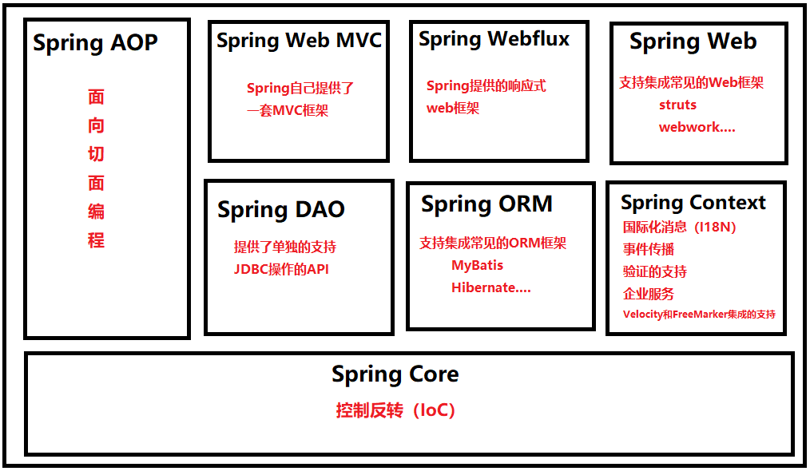

1. **Spring Core模块**

这是Spring框架最基础的部分，它提供了依赖注入特征来实现容器对Bean的管理。核心容器的主要组件是 BeanFactory，BeanFactory是工厂模式的一个实现，是任何Spring应用的核心。它使用IoC将应用配置和依赖从实际的应用代码中分离出来。

2. **Spring Context模块**

如果说核心模块中的BeanFactory使Spring成为容器的话，那么上下文模块就是Spring成为框架的原因。
这个模块扩展了BeanFactory，增加了对国际化（I18N）消息、事件传播、验证的支持。另外提供了许多企业服务，例如电子邮件、JNDI访问、EJB集成、远程以及时序调度（scheduling）服务。也包括了对模版框架例如Velocity和FreeMarker集成的支持

3. **Spring AOP模块**

Spring在它的AOP模块中提供了对面向切面编程的丰富支持，Spring AOP 模块为基于 Spring 的应用程序中的对象提供了事务管理服务。通过使用 Spring AOP，不用依赖组件，就可以将声明性事务管理集成到应用程序中，可以自定义拦截器、切点、日志等操作。

4. **Spring DAO模块**

提供了一个JDBC的抽象层和异常层次结构，消除了烦琐的JDBC编码和数据库厂商特有的错误代码解析，用于简化JDBC。

5. **Spring ORM模块**

Spring提供了ORM模块。Spring并不试图实现它自己的ORM解决方案，而是为几种流行的ORM框架提供了集成方案，包括Hibernate、JDO和iBATIS SQL映射，这些都遵从 Spring 的通用事务和 DAO 异常层次结构。

6. **Spring Web MVC模块**

Spring为构建Web应用提供了一个功能全面的MVC框架。虽然Spring可以很容易地与其它MVC框架集成，例如Struts，但Spring的MVC框架使用IoC对控制逻辑和业务对象提供了完全的分离。

7. **Spring WebFlux模块**

Spring Framework 中包含的原始 Web 框架 Spring Web MVC 是专门为 Servlet API 和 Servlet 容器构建的。反应式堆栈 Web 框架 Spring WebFlux 是在 5.0 版的后期添加的。它是完全非阻塞的，支持反应式流(Reactive Stream)背压，并在Netty，Undertow和Servlet 3.1+容器等服务器上运行。


8. **Spring Web模块**

Web 上下文模块建立在应用程序上下文模块之上，为基于 Web 的应用程序提供了上下文，提供了Spring和其它Web框架的集成，比如Struts、WebWork。还提供了一些面向服务支持，例如：实现文件上传的multipart请求。

## Spring特点

1. 轻量
   1. 从大小与开销两方面而言Spring都是轻量的。完整的Spring框架可以在一个大小只有1MB多的 JAR 文件里发布。并且Spring所需的处理开销也是微不足道的。
   2. Spring是非侵入式的：Spring应用中的对象不依赖于Spring的特定类。
2. 控制反转
   1. Spring通过一种称作控制反转（IoC）的技术促进了松耦合。当应用了IoC，一个对象依赖的其它对象会通过被动的方式传递进来，而不是这个对象自己创建或者查找依赖对象。
3. 面向切面
   1. Spring提供了面向切面编程的丰富支持，允许通过分离应用的业务逻辑与系统级服务（例如审计（auditing）和事务（transaction）管理）进行内聚性的开发。应用对象只实现它们应该做的——完成业务逻辑——仅此而已。它们并不负责（甚至是意识）其它的系统级关注点，例如日志或事务支持。
4. 容器
   1. Spring包含并管理应用对象的配置和生命周期，在这个意义上它是一种容器，可以配置每个bean如何被创建——基于一个可配置原型（prototype），决定bean可以创建一个单独的实例或者每次需要时都生成一个新的实例——以及它们是如何相互关联的。
5. 框架
   1. Spring可以将简单的组件配置、组合成为复杂的应用。在Spring中，应用对象被声明式地组合，典型地是在一个XML文件里。Spring也提供了很多基础功能（事务管理、持久化框架集成等等）。


# Spring的入门程序

## Spring的jar文件

打开libs目录，会看到很多jar包：

img/Spring-core-5.3.9.jar：字节码（**这个是支撑程序运行的jar包**)

img/Spring-core-5.3.9-javadoc.jar：代码中的注释

img/Spring-core-5.3.9-sources.jar：源码

| **JAR文件** | **描述** |
| --- | --- |
| img/Spring-aop-5.3.9.jar | **这个jar 文件包含在应用中使用Spring 的AOP 特性时所需的类** |
| img/Spring-aspects-5.3.9.jar | **提供对AspectJ的支持，以便可以方便的将面向切面的功能集成进IDE中** |
| img/Spring-beans-5.3.9.jar | **这个jar 文件是所有应用都要用到的，它包含访问配置文件、创建和管理bean 以及进行Inversion ofControl / Dependency Injection（IoC/DI）操作相关的所有类。如果应用只需基本的IoC/DI 支持，引入img/Spring-core.jar 及img/Spring-beans.jar 文件就可以了。** |
| img/Spring-context-5.3.9.jar | **这个jar 文件为Spring 核心提供了大量扩展。可以找到使用Spring ApplicationContext特性时所需的全部类，JDNI 所需的全部类，instrumentation组件以及校验Validation 方面的相关类。** |
| img/Spring-context-indexer-5.3.9.jar | 虽然类路径扫描非常快，但是Spring内部存在大量的类，添加此依赖，可以通过在编译时创建候选对象的静态列表来提高大型应用程序的启动性能。 |
| img/Spring-context-support-5.3.9.jar | 用来提供Spring上下文的一些扩展模块,例如实现邮件服务、视图解析、缓存、定时任务调度等 |
| img/Spring-core-5.3.9.jar | **Spring 框架基本的核心工具类。Spring 其它组件要都要使用到这个包里的类，是其它组件的基本核心，当然你也可以在自己的应用系统中使用这些工具类。** |
| img/Spring-expression-5.3.9.jar | Spring表达式语言。 |
| img/Spring-instrument-5.3.9.jar | Spring3.0对服务器的代理接口。 |
| img/Spring-jcl-5.3.9.jar | Spring的日志模块。JCL，全称为"Jakarta Commons Logging"，也可称为"Apache Commons Logging"。 |
| img/Spring-jdbc-5.3.9.jar | **Spring对JDBC的支持。** |
| img/Spring-jms-5.3.9.jar | 这个jar包提供了对JMS 1.0.2/1.1的支持类。JMS是Java消息服务。属于JavaEE规范之一。 |
| img/Spring-messaging-5.3.9.jar | 为集成messaging api和消息协议提供支持 |
| img/Spring-orm-5.3.9.jar | **Spring集成ORM框架的支持，比如集成hibernate，mybatis等。** |
| img/Spring-oxm-5.3.9.jar | 为主流O/X Mapping组件提供了统一层抽象和封装，OXM是Object Xml Mapping。对象和XML之间的相互转换。 |
| img/Spring-r2dbc-5.3.9.jar | Reactive Relational Database Connectivity (关系型数据库的响应式连接) 的缩写。这个jar文件是Spring对r2dbc的支持。 |
| img/Spring-test-5.3.9.jar | 对Junit等测试框架的简单封装。 |
| img/Spring-tx-5.3.9.jar | **为JDBC、Hibernate、JDO、JPA、Beans等提供的一致的声明式和编程式事务管理支持。** |
| img/Spring-web-5.3.9.jar | **Spring集成MVC框架的支持，比如集成Struts等。** |
| img/Spring-webflux-5.3.9.jar | **WebFlux是 Spring5 添加的新模块，用于 web 的开发，功能和 SpringMVC 类似的，Webflux 使用当前一种比较流程响应式编程出现的框架。** |
| img/Spring-webmvc-5.3.9.jar | **SpringMVC框架的类库** |
| img/Spring-websocket-5.3.9.jar | **Spring集成WebSocket框架时使用** |

**注意：**

**如果只是用Spring的IoC功能，仅需要引入 img/Spring-context**


## 第一个Spring程序

**第一步：添加img/Spring context的依赖，pom.xml配置如下**

```xml
<?xml version="1.0" encoding="UTF-8"?>
<project xmlns="http://maven.apache.org/POM/4.0.0"
         xmlns:xsi="http://www.w3.org/2001/XMLSchema-instance"
         xsi:schemaLocation="http://maven.apache.org/POM/4.0.0 http://maven.apache.org/xsd/maven-4.0.0.xsd">
    <modelVersion>4.0.0</modelVersion>

    <groupId>com.powernode</groupId>
    <artifactId>img/Spring6-001-first</artifactId>
    <version>1.0-SNAPSHOT</version>
    <packaging>jar</packaging>

    <dependencies>
        <!--img/Spring context依赖-->
        <dependency>
            <groupId>org.img/Springframework</groupId>
            <artifactId>img/Spring-context</artifactId>
            <version>6.2.0</version>
        </dependency>
        
        <!--junit-->
        <dependency>
            <groupId>junit</groupId>
            <artifactId>junit</artifactId>
            <version>4.13.2</version>
            <scope>test</scope>
        </dependency>
    </dependencies>

    <properties>
        <maven.compiler.source>17</maven.compiler.source>
        <maven.compiler.target>17</maven.compiler.target>
    </properties>

</project>
```
**第二步：定义bean：User**

```java
public class User {
}
```
**第三步：编写img/Spring的配置文件：beans.xml。该文件放在类的根路径下。**

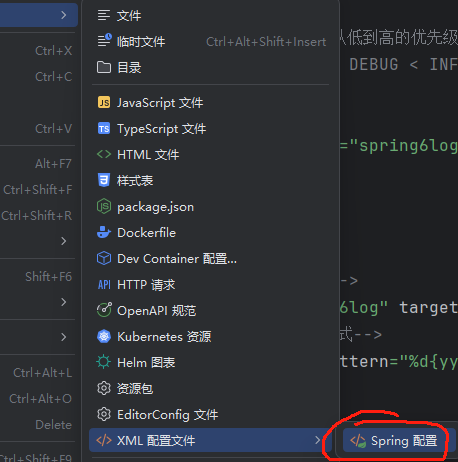


配置文件中进行bean的配置。

```xml
<beans xmlns="http://www.img/Springframework.org/schema/beans"
       xmlns:xsi="http://www.w3.org/2001/XMLSchema-instance"
       xsi:schemaLocation="http://www.img/Springframework.org/schema/beans http://www.img/Springframework.org/schema/beans/img/Spring-beans.xsd">
    
    <bean id="userBean" class="com.powernode.img/Spring6.bean.User"/>
</beans>
```
bean的id和class属性：

- **id属性：代表对象的唯一标识。不能重复**
- **class属性：用来指定要创建的java对象的类名，这个类名必须是全限定类名。**

**第四步：编写测试程序**

```java
public class Spring6Test {

    @Test
    public void testFirst(){
        // 初始化Spring容器上下文（解析beans.xml文件，创建所有的bean对象）
        ApplicationContext applicationContext = new ClassPathXmlApplicationContext("beans.xml");
        // 根据id获取bean对象
        Object userBean = applicationContext.getBean("userBean");
        System.out.println(userBean);
    }
}

```
**第五步：运行测试程序**
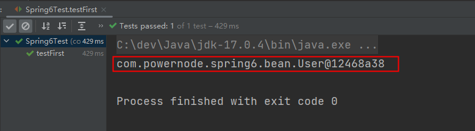


### 程序剖析

**底层是通过反射机制调用无参数构造方法，必须保证无参数构造方法是存在的**

```java
public class User {
    public User() {
        System.out.println("User的无参数构造方法执行");
    }
}

```
在User类中添加无参数构造方法，如上。
运行测试程序：
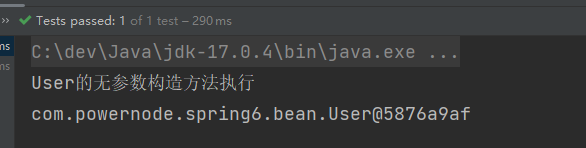
Spring是如何创建对象的原理：

```java
// dom4j解析beans.xml文件，从中获取class的全限定类名
// 通过反射机制调用无参数构造方法创建对象
Class clazz = Class.forName("com.powernode.img/Spring6.bean.User");
Object obj = clazz.newInstance();
```

**把创建好的对象存储到一个什么样的数据结构中？**

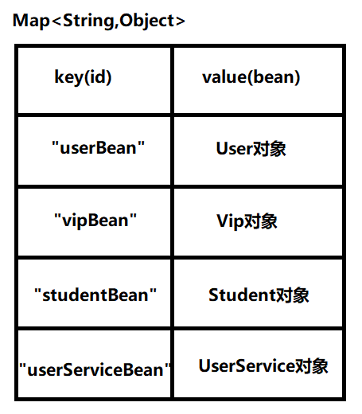

**beans.xml文件可以有多个**

再创建一个img/Spring配置文件，起名：img/Spring.xml
```xml
<beans xmlns="http://www.img/Springframework.org/schema/beans"
       xmlns:xsi="http://www.w3.org/2001/XMLSchema-instance"
       xsi:schemaLocation="http://www.img/Springframework.org/schema/beans http://www.img/Springframework.org/schema/beans/img/Spring-beans.xsd">
    <bean id="vipBean" class="com.powernode.img/Spring6.bean.Vip"/>
</beans>
```
```java
public class Spring6Test {

    @Test
    public void testFirst(){
        // 初始化Spring容器上下文（解析beans.xml文件，创建所有的bean对象）
        ApplicationContext applicationContext = new ClassPathXmlApplicationContext("beans.xml","img/Spring.xml");

        // 根据id获取bean对象
        Object userBean = applicationContext.getBean("userBean");
        Object vipBean = applicationContext.getBean("vipBean");

        System.out.println(userBean);
        System.out.println(vipBean);
    }
}

```
运行测试程序：
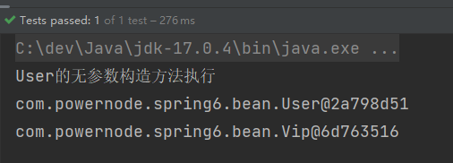
通过源码可以看到：
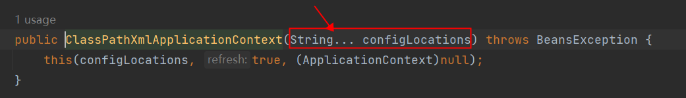

**在img/Spring配置文件中配置的bean可以任意类，只要这个类不是抽象的，并且提供了无参数构造方法。**

```xml
<beans xmlns="http://www.img/Springframework.org/schema/beans"
       xmlns:xsi="http://www.w3.org/2001/XMLSchema-instance"
       xsi:schemaLocation="http://www.img/Springframework.org/schema/beans http://www.img/Springframework.org/schema/beans/img/Spring-beans.xsd">

    <bean id="userBean" class="com.powernode.img/Spring6.bean.User"/>
    <bean id="dateBean" class="java.util.Date"/> 
</beans>
```


**getBean()方法返回的类型是Object，如果访问子类的特有属性和方法时，需要向下转型，其它办法:**

```java
User user = applicationContext.getBean("userBean", User.class);
```

**如果配置文件没有在类路径当中，如何加载：**

```java
ApplicationContext applicationContext2 = new FileSystemXmlApplicationContext("d:/img/Spring6.xml");
Vip vip = applicationContext2.getBean("vipBean2", Vip.class);
System.out.println(vip);
```
没有在类路径中的话，需要使用FileSystemXmlApplicationContext类进行加载配置文件。

**ApplicationContext的超级父接口：BeanFactory。**

```java
BeanFactory beanFactory = new ClassPathXmlApplicationContext("img/Spring.xml");
Object vipBean = beanFactory.getBean("vipBean");
System.out.println(vipBean);
```
BeanFactory是Spring容器的超级接口。ApplicationContext是BeanFactory的子接口。


## Spring6启用Log4j2日志框架

第一步：引入Log4j2的依赖

```xml
<!--log4j2的依赖-->
<dependency>
  <groupId>org.apache.logging.log4j</groupId>
  <artifactId>log4j-core</artifactId>
  <version>2.19.0</version>
</dependency>
<dependency>
  <groupId>org.apache.logging.log4j</groupId>
  <artifactId>log4j-slf4j2-impl</artifactId>
  <version>2.19.0</version>
</dependency>
```
第二步：在类的根路径下提供log4j2.xml配置文件（文件名固定为：log4j2.xml，必须放到类根路径下。）
```xml
<configuration>

    <loggers>
        <!--
            level指定日志级别，从低到高的优先级：
                ALL < TRACE < DEBUG < INFO < WARN < ERROR < FATAL < OFF
        -->
        <!--
			Level=DEBUG会输出这些级别的信息：DEBUG INFO WARN ERROR FATAL OFF
			级别越低输出的信息越丰富，级别越高输出的信息越少
	·	-->
        <root level="DEBUG">
            <appender-ref ref="img/Spring6log"/>
        </root>
    </loggers>

    <appenders>
        <!--输出日志信息到控制台-->
        <console name="img/Spring6log" target="SYSTEM_OUT">
            <!--控制日志输出的格式-->
            <PatternLayout pattern="%d{yyyy-MM-dd HH:mm:ss SSS} [%t] %-3level %logger{1024} - %msg%n"/>
        </console>
    </appenders>

</configuration>
```
第三步：使用日志框架
```java
Logger logger = LoggerFactory.getLogger(FirstSpringTest.class);
logger.info("我是一条日志消息");
```


# Spring对IoC的实现

## IoC 控制反转

- 控制反转是一种思想。
- 控制反转是为了降低程序耦合度，提高程序扩展力，达到OCP原则，达到DIP原则。
- 控制反转
   - 将对象的创建权利交出去，交给第三方容器负责。
   - 将对象和对象之间关系的维护权交出去，交给第三方容器负责。
- 控制反转思想的具体实现：
   - DI（Dependency Injection）：依赖注入

## 依赖注入

依赖注入实现了控制反转的思想。
**Spring通过依赖注入的方式来完成Bean管理的。**
**Bean管理说的是：Bean对象的创建，以及Bean对象中属性的赋值（或者叫做Bean对象之间关系的维护）。**
依赖注入：

- 依赖指的是对象和对象之间的关联关系。
- 注入指的是一种数据传递行为，通过注入行为来让对象和对象产生关系。

依赖注入常见的实现方式包括两种：

- 第一种：set注入
- 第二种：构造注入

### set注入

set注入，基于set方法实现的，底层会通过反射机制调用属性对应的set方法然后给属性赋值。这种方式要求属性必须对外提供set方法。
```java
public class UserDao {

    public void insert(){
        System.out.println("正在保存用户数据。");
    }
}

```
```java
public class UserService {

    private UserDao userDao;

    // 使用set方式注入，必须提供set方法。
    // 反射机制要调用这个方法给属性赋值的。
    public void setUserDao(UserDao userDao) {
        this.userDao = userDao;
    }

    public void save(){
        userDao.insert();
    }
}

```
```xml
<beans xmlns="http://www.img/Springframework.org/schema/beans"
       xmlns:xsi="http://www.w3.org/2001/XMLSchema-instance"
       xsi:schemaLocation="http://www.img/Springframework.org/schema/beans http://www.img/Springframework.org/schema/beans/img/Spring-beans.xsd">

    <bean id="userDaoBean" class="com.powernode.img/Spring6.dao.UserDao"/>

    <bean id="userServiceBean" class="com.powernode.img/Spring6.service.UserService">
        <!--name:set方法的方法名去掉set，然后把剩下的单词首字母变小写，写到这里。ref后面指定的是要注入的bean的id-->
        <property name="userDao" ref="userDaoBean"/>
    </bean>

</beans>
```
```java
public class DITest {

    @Test
    public void testSetDI(){
        ApplicationContext applicationContext = new ClassPathXmlApplicationContext("img/Spring.xml");
        UserService userService = applicationContext.getBean("userServiceBean", UserService.class);
        userService.save();
    }
}

```
运行结果：
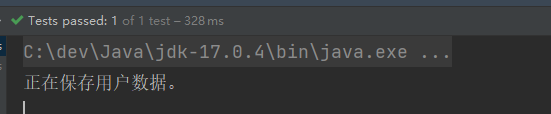

实现原理：

+ 通过property标签获取到属性名：userDao
+ 通过属性名推断出set方法名：setUserDao
+ 通过反射机制调用setUserDao()方法给属性赋值

ref属性也可以采用标签的方式，但使用ref属性是多数的：
```xml
<bean id="userServiceBean" class="com.powernode.img/Spring6.service.UserService">
  <property name="userDao">
    <ref bean="userDaoBean"/>
  </property>
</bean>
```


### 构造注入

核心原理：通过调用构造方法来给属性赋值。
```java
public class OrderDao {
    public void deleteById(){
        System.out.println("正在删除订单。。。");
    }
}
```
```java
public class OrderService {
    private OrderDao orderDao;
    private UserDao userDao;

    // 通过反射机制调用构造方法给属性赋值
    public OrderService(OrderDao orderDao, UserDao userDao) {
        this.orderDao = orderDao;
        this.userDao = userDao;
    }

    public void delete(){
        orderDao.deleteById();
        userDao.insert();
    }
}

```
```xml
<bean id="orderDaoBean" class="com.powernode.img/Spring6.dao.OrderDao"/>

<bean id="orderServiceBean" class="com.powernode.img/Spring6.service.OrderService">
  <!--第一个参数下标是0-->
  <constructor-arg index="0" ref="orderDaoBean"/>
  <!--第二个参数下标是1-->
  <constructor-arg index="1" ref="userDaoBean"/>
</bean>

<bean id="userDaoBean" class="com.powernode.img/Spring6.dao.UserDao"/>
```
```java
@Test
public void testConstructorDI(){
    ApplicationContext applicationContext = new ClassPathXmlApplicationContext("img/Spring.xml");
    OrderService orderServiceBean = applicationContext.getBean("orderServiceBean", OrderService.class);
    orderServiceBean.delete();
}
```
运行结果如下：
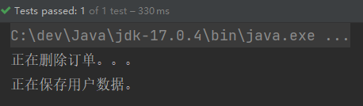

**不使用参数下标，使用参数的名字也可以：**

```xml
<bean id="orderDaoBean" class="com.powernode.img/Spring6.dao.OrderDao"/>

<bean id="orderServiceBean" class="com.powernode.img/Spring6.service.OrderService">
  <!--这里使用了构造方法上参数的名字-->
  <constructor-arg name="orderDao" ref="orderDaoBean"/>
  <constructor-arg name="userDao" ref="userDaoBean"/>
</bean>

<bean id="userDaoBean" class="com.powernode.img/Spring6.dao.UserDao"/>
```


**不指定参数下标，不指定参数名字，也可以**

```xml
<bean id="orderDaoBean" class="com.powernode.img/Spring6.dao.OrderDao"/>
<bean id="orderServiceBean" class="com.powernode.img/Spring6.service.OrderService">
  <!--没有指定下标，也没有指定参数名字-->
  <constructor-arg ref="orderDaoBean"/>
  <constructor-arg ref="userDaoBean"/>
</bean>

<bean id="userDaoBean" class="com.powernode.img/Spring6.dao.UserDao"/>
```

**配置文件中构造方法参数的类型顺序和构造方法参数的类型顺序不一致呢？**

```xml
<bean id="orderDaoBean" class="com.powernode.img/Spring6.dao.OrderDao"/>

<bean id="orderServiceBean" class="com.powernode.img/Spring6.service.OrderService">
  <!--顺序已经和构造方法的参数顺序不同了-->
  <!--这种方式实际上是根据类型进行注入的。img/Spring会自动根据类型来判断把ref注入给哪个参数。-->
  <constructor-arg ref="userDaoBean"/>
  <constructor-arg ref="orderDaoBean"/>
</bean>

<bean id="userDaoBean" class="com.powernode.img/Spring6.dao.UserDao"/>
```
执行测试程序：
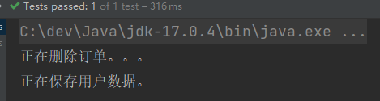
通过测试得知，通过构造方法注入的时候：

- 可以通过下标
- 可以通过参数名
- 也可以不指定下标和参数名，可以类型自动推断。

Spring在装配方面做的还是比较健壮的。


## set注入专题

### 注入外部Bean

```xml
<beans xmlns="http://www.img/Springframework.org/schema/beans"
       xmlns:xsi="http://www.w3.org/2001/XMLSchema-instance"
       xsi:schemaLocation="http://www.img/Springframework.org/schema/beans http://www.img/Springframework.org/schema/beans/img/Spring-beans.xsd">

    <bean id="userDaoBean" class="com.powernode.img/Spring6.dao.UserDao"/>

    <bean id="userServiceBean" class="com.powernode.img/Spring6.service.UserService">
        <property name="userDao" ref="userDaoBean"/>
    </bean>

</beans>
```
bean定义到外面，在property标签中使用ref属性进行注入。通常这种方式是常用。

### 注入内部Bean

内部Bean的方式：在bean标签中嵌套bean标签。
```xml
<beans xmlns="http://www.img/Springframework.org/schema/beans"
       xmlns:xsi="http://www.w3.org/2001/XMLSchema-instance"
       xsi:schemaLocation="http://www.img/Springframework.org/schema/beans http://www.img/Springframework.org/schema/beans/img/Spring-beans.xsd">

    <bean id="userServiceBean" class="com.powernode.img/Spring6.service.UserService">
        <property name="userDao">
            <bean class="com.powernode.img/Spring6.dao.UserDao"/>
        </property>
    </bean>

</beans>
```


### 注入简单类型

那如果对象的属性是简单类型，也可以通过set注入的方式给该属性赋值：

```java
public class User {
    private int age;

    public void setAge(int age) {
        this.age = age;
    }
    
    @Override
    public String toString() {
        return "User{" +
                "age=" + age +
                '}';
    }
}

```
```xml
<beans xmlns="http://www.img/Springframework.org/schema/beans"
       xmlns:xsi="http://www.w3.org/2001/XMLSchema-instance"
       xsi:schemaLocation="http://www.img/Springframework.org/schema/beans http://www.img/Springframework.org/schema/beans/img/Spring-beans.xsd">
    <bean id="userBean" class="com.powernode.img/Spring6.beans.User">
        <!--如果像这种int类型的属性，我们称为简单类型，这种简单类型在注入的时候要使用value属性，不能使用ref-->
        <!--<property name="age" value="20"/>-->
        <property name="age">
            <value>20</value>
        </property>
    </bean>
</beans>
```
```java
@Test
public void testSimpleType(){
    ApplicationContext applicationContext = new ClassPathXmlApplicationContext("img/Spring-simple-type.xml");
    User user = applicationContext.getBean("userBean", User.class);
    System.out.println(user);
}
```
运行：
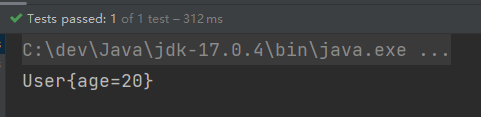
**如果给简单类型赋值，使用value属性或value标签。而不是ref。**

**简单类型包括：**

- **基本数据类型**
- **基本数据类型对应的包装类**
- **String或其他的CharSequence子类**
- **Number子类**
- **Date子类**
- **Enum子类**
- **URI**
- **URL**
- **Temporal子类**
- **Locale**
- **Class**
- **另外还包括以上简单值类型对应的数组类型。**


**需要注意的是：**

- **如果把Date当做简单类型的话，日期字符串格式不能随便写。格式必须符合Date的toString()方法格式。**
  - **所以可以把Date当做简单类型，也可以看做复杂类型**

- **img/Spring6之后，当注入的是URL，那么这个url字符串是会进行有效性检测的。如果是一个存在的url，那就没问题。如果不存在则报错。**


### 级联属性赋值

```java
public class Clazz {
    private String name;

    public Clazz() {
    }

    public Clazz(String name) {
        this.name = name;
    }

    public String getName() {
        return name;
    }

    public void setName(String name) {
        this.name = name;
    }

    @Override
    public String toString() {
        return "Clazz{" +
                "name='" + name + '\'' +
                '}';
    }
}

```
```java
public class Student {
    private String name;
    private Clazz clazz;

    public Student() {
    }

    public Student(String name, Clazz clazz) {
        this.name = name;
        this.clazz = clazz;
    }

    public void setName(String name) {
        this.name = name;
    }

    public void setClazz(Clazz clazz) {
        this.clazz = clazz;
    }

    public Clazz getClazz() {
        return clazz;
    }

    @Override
    public String toString() {
        return "Student{" +
                "name='" + name + '\'' +
                ", clazz=" + clazz +
                '}';
    }
}

```
```xml
<beans xmlns="http://www.img/Springframework.org/schema/beans"
       xmlns:xsi="http://www.w3.org/2001/XMLSchema-instance"
       xsi:schemaLocation="http://www.img/Springframework.org/schema/beans http://www.img/Springframework.org/schema/beans/img/Spring-beans.xsd">

    <bean id="clazzBean" class="com.powernode.img/Spring6.beans.Clazz"/>

    <bean id="student" class="com.powernode.img/Spring6.beans.Student">
        <property name="name" value="张三"/>

        <!--要点1：以下两行配置的顺序不能颠倒-->
        <property name="clazz" ref="clazzBean"/>
        <!--要点2：clazz属性必须有getter方法-->
        <property name="clazz.name" value="高三一班"/>
    </bean>
</beans>
```
```java
@Test
public void testCascade(){
    ApplicationContext applicationContext = new ClassPathXmlApplicationContext("img/Spring-cascade.xml");
    Student student = applicationContext.getBean("student", Student.class);
    System.out.println(student);
}
```
运行结果：
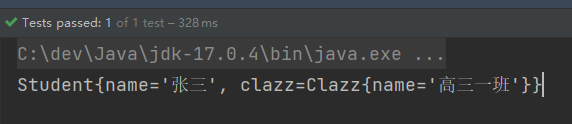


###  注入数组

**当数组中的元素是简单类型**：
```java
package com.powernode.img/Spring6.beans;

import java.util.Arrays;

public class Person {
    private String[] favariteFoods;

    public void setFavariteFoods(String[] favariteFoods) {
        this.favariteFoods = favariteFoods;
    }

    @Override
    public String toString() {
        return "Person{" +
                "favariteFoods=" + Arrays.toString(favariteFoods) +
                '}';
    }
}

```
```xml
<beans xmlns="http://www.img/Springframework.org/schema/beans"
       xmlns:xsi="http://www.w3.org/2001/XMLSchema-instance"
       xsi:schemaLocation="http://www.img/Springframework.org/schema/beans http://www.img/Springframework.org/schema/beans/img/Spring-beans.xsd">

    <bean id="person" class="com.powernode.img/Spring6.beans.Person">
        <property name="favariteFoods">
            <array>
                <value>鸡排</value>
                <value>汉堡</value>
                <value>鹅肝</value>
            </array>
        </property>
    </bean>
</beans>
```


**当数组中的元素是非简单类型：一个订单中包含多个商品。**
```java
public class Goods {
    private String name;

    public Goods() {
    }

    public Goods(String name) {
        this.name = name;
    }

    public String getName() {
        return name;
    }

    public void setName(String name) {
        this.name = name;
    }

    @Override
    public String toString() {
        return "Goods{" +
                "name='" + name + '\'' +
                '}';
    }
}

```
```java
public class Order {
    // 一个订单中有多个商品
    private Goods[] goods;

    public Order() {
    }

    public Order(Goods[] goods) {
        this.goods = goods;
    }

    public void setGoods(Goods[] goods) {
        this.goods = goods;
    }

    @Override
    public String toString() {
        return "Order{" +
                "goods=" + Arrays.toString(goods) +
                '}';
    }
}

```
```xml
<beans xmlns="http://www.img/Springframework.org/schema/beans"
       xmlns:xsi="http://www.w3.org/2001/XMLSchema-instance"
       xsi:schemaLocation="http://www.img/Springframework.org/schema/beans http://www.img/Springframework.org/schema/beans/img/Spring-beans.xsd">

    <bean id="goods1" class="com.powernode.img/Spring6.beans.Goods">
        <property name="name" value="西瓜"/>
    </bean>

    <bean id="goods2" class="com.powernode.img/Spring6.beans.Goods">
        <property name="name" value="苹果"/>
    </bean>

    <bean id="order" class="com.powernode.img/Spring6.beans.Order">
        <property name="goods">
            <array>
                <!--这里使用ref标签即可-->
                <ref bean="goods1"/>
                <ref bean="goods2"/>
            </array>
        </property>
    </bean>

</beans>
```
测试程序：
```java
@Test
public void testArray(){
    ApplicationContext applicationContext = new ClassPathXmlApplicationContext("img/Spring-array.xml");
    Order order = applicationContext.getBean("order", Order.class);
    System.out.println(order);
}
```
执行结果：
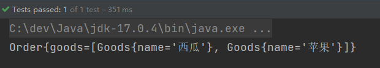
**要点：**

- **如果数组中是简单类型，使用value标签。**
- **如果数组中是非简单类型，使用ref标签。**


### 注入List集合

```java
public class People {
    // 一个人有多个名字
    private List<String> names;

    public void setNames(List<String> names) {
        this.names = names;
    }

    @Override
    public String toString() {
        return "People{" +
                "names=" + names +
                '}';
    }
}

```
```xml
<beans xmlns="http://www.img/Springframework.org/schema/beans"
       xmlns:xsi="http://www.w3.org/2001/XMLSchema-instance"
       xsi:schemaLocation="http://www.img/Springframework.org/schema/beans http://www.img/Springframework.org/schema/beans/img/Spring-beans.xsd">

    <bean id="peopleBean" class="com.powernode.img/Spring6.beans.People">
        <property name="names">
            <list>
                <value>铁锤</value>
                <value>张三</value>
                <value>张三</value>
                <value>张三</value>
                <value>狼</value>
            </list>
        </property>
    </bean>
</beans>
```
```java
@Test
public void testCollection(){
    ApplicationContext applicationContext = new ClassPathXmlApplicationContext("img/Spring-collection.xml");
    People peopleBean = applicationContext.getBean("peopleBean", People.class);
    System.out.println(peopleBean);
}
```
执行结果：
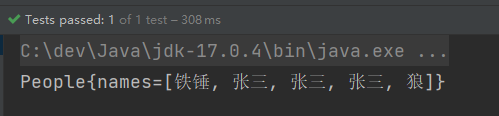
**注入List集合的时候使用list标签，如果List集合中是简单类型使用value标签，反之使用ref标签。**


###  注入Set集合

```java

public class People {
    // 一个人有多个电话
    private Set<String> phones;

    public void setPhones(Set<String> phones) {
        this.phones = phones;
    }
    
    //......
    
    @Override
    public String toString() {
        return "People{" +
                "phones=" + phones +
                ", names=" + names +
                '}';
    }
}

```
```xml
<beans xmlns="http://www.img/Springframework.org/schema/beans"
       xmlns:xsi="http://www.w3.org/2001/XMLSchema-instance"
       xsi:schemaLocation="http://www.img/Springframework.org/schema/beans http://www.img/Springframework.org/schema/beans/img/Spring-beans.xsd">

    <bean id="peopleBean" class="com.powernode.img/Spring6.beans.People">
        <property name="phones">
            <set>
                <!--非简单类型可以使用ref，简单类型使用value-->
                <value>110</value>
                <value>110</value>
                <value>120</value>
                <value>120</value>
                <value>119</value>
                <value>119</value>
            </set>
        </property>
    </bean>
</beans>
```
执行结果：
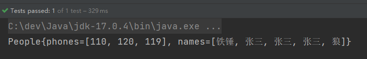

### 注入Map集合

```java
public class People {
    // 一个人有多个住址
    private Map<Integer, String> addrs;

    public void setAddrs(Map<Integer, String> addrs) {
        this.addrs = addrs;
    }
    
    //......
    
    @Override
    public String toString() {
        return "People{" +
                "addrs=" + addrs +
                ", phones=" + phones +
                ", names=" + names +
                '}';
    }

}

```
```xml
<beans xmlns="http://www.img/Springframework.org/schema/beans"
       xmlns:xsi="http://www.w3.org/2001/XMLSchema-instance"
       xsi:schemaLocation="http://www.img/Springframework.org/schema/beans http://www.img/Springframework.org/schema/beans/img/Spring-beans.xsd">

    <bean id="peopleBean" class="com.powernode.img/Spring6.beans.People">
        <property name="addrs">
            <map>
                <!--如果key不是简单类型，使用 key-ref 属性-->
                <!--如果value不是简单类型，使用 value-ref 属性-->
                <entry key="1" value="北京大兴区"/>
                <entry key="2" value="上海浦东区"/>
                <entry key="3" value="深圳宝安区"/>
            </map>
        </property>
    </bean>
</beans>
```
执行结果：
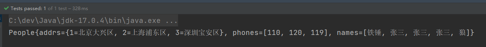

### 注入Properties

java.util.Properties继承java.util.Hashtable，所以Properties也是一个Map集合。
```java
public class People {

    private Properties properties;

    public void setProperties(Properties properties) {
        this.properties = properties;
    }
    
    //......

    @Override
    public String toString() {
        return "People{" +
                "properties=" + properties +
                ", addrs=" + addrs +
                ", phones=" + phones +
                ", names=" + names +
                '}';
    }
}

```
```xml
<beans xmlns="http://www.img/Springframework.org/schema/beans"
       xmlns:xsi="http://www.w3.org/2001/XMLSchema-instance"
       xsi:schemaLocation="http://www.img/Springframework.org/schema/beans http://www.img/Springframework.org/schema/beans/img/Spring-beans.xsd">

    <bean id="peopleBean" class="com.powernode.img/Spring6.beans.People">
        <property name="properties">
            <props>
                <prop key="driver">com.mysql.cj.jdbc.Driver</prop>
                <prop key="url">jdbc:mysql://localhost:3306/img/Spring</prop>
                <prop key="username">root</prop>
                <prop key="password">123456</prop>
            </props>
        </property>
    </bean>
</beans>
```
执行测试程序：
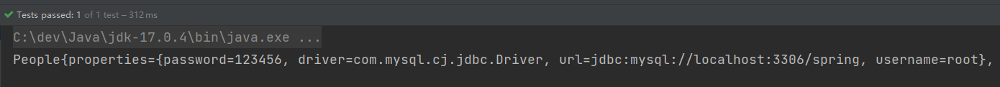

### 注入null和空字符串

注入空字符串使用：`<value/> `或者 value=""
注入null使用：`<null/> `或者 不为该属性赋值

- 注入空字符串。
```java
public class Vip {
    private String email;

    public void setEmail(String email) {
        this.email = email;
    }

    @Override
    public String toString() {
        return "Vip{" +
                "email='" + email + '\'' +
                '}';
    }
}

```
```xml
<?xml version="1.0" encoding="UTF-8"?>
<beans xmlns="http://www.img/Springframework.org/schema/beans"
       xmlns:xsi="http://www.w3.org/2001/XMLSchema-instance"
       xsi:schemaLocation="http://www.img/Springframework.org/schema/beans http://www.img/Springframework.org/schema/beans/img/Spring-beans.xsd">

    <bean id="vipBean" class="com.powernode.img/Spring6.beans.Vip">
        <!--空串的第一种方式-->
        <!--<property name="email" value=""/>-->
        <!--空串的第二种方式-->
        <property name="email">
            <value/>
        </property>
    </bean>

</beans>
```
```java
@Test
public void testNull(){
    ApplicationContext applicationContext = new ClassPathXmlApplicationContext("img/Spring-null.xml");
    Vip vipBean = applicationContext.getBean("vipBean", Vip.class);
    System.out.println(vipBean);
}
```
执行结果：
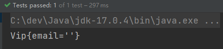

- 注入null

第一种方式：不给属性赋值
```xml
<?xml version="1.0" encoding="UTF-8"?>
<beans xmlns="http://www.img/Springframework.org/schema/beans"
       xmlns:xsi="http://www.w3.org/2001/XMLSchema-instance"
       xsi:schemaLocation="http://www.img/Springframework.org/schema/beans http://www.img/Springframework.org/schema/beans/img/Spring-beans.xsd">

    <bean id="vipBean" class="com.powernode.img/Spring6.beans.Vip" />

</beans>
```

第二种方式：使用<null/>

```xml
<beans xmlns="http://www.img/Springframework.org/schema/beans"
       xmlns:xsi="http://www.w3.org/2001/XMLSchema-instance"
       xsi:schemaLocation="http://www.img/Springframework.org/schema/beans http://www.img/Springframework.org/schema/beans/img/Spring-beans.xsd">

    <bean id="vipBean" class="com.powernode.img/Spring6.beans.Vip">
        <property name="email">
            <null/>
        </property>
    </bean>

</beans>
```
执行结果：
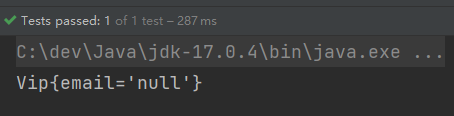


### 注入的值中含有特殊符号

XML中有5个特殊字符，分别是：`<`、`>`、`'`、`"`、`&`
以上5个特殊符号在XML中会被特殊对待，会被当做XML语法的一部分进行解析，如果这些特殊符号直接出现在注入的字符串当中，会报错。

解决方案两种：

- 特殊符号使用转义字符代替。
- 将含有特殊符号的字符串放到：`<![CDATA[]]> `当中。因为放在CDATA区中的数据不会被XML文件解析器解析。

5个特殊字符对应的转义字符分别是：

| **特殊字符** | **转义字符** |
| --- | --- |
| > | `&gt;` |
| < | `&lt;` |
| ' | `&apos;` |
| " | `&quot;` |
| & | `&amp;` |

先使用转义字符来代替：
```java
public class Math {
    private String result;

    public void setResult(String result) {
        this.result = result;
    }

    @Override
    public String toString() {
        return "Math{" +
                "result='" + result + '\'' +
                '}';
    }
}

```
```xml
<beans xmlns="http://www.img/Springframework.org/schema/beans"
       xmlns:xsi="http://www.w3.org/2001/XMLSchema-instance"
       xsi:schemaLocation="http://www.img/Springframework.org/schema/beans http://www.img/Springframework.org/schema/beans/img/Spring-beans.xsd">
    <bean id="mathBean" class="com.powernode.img/Spring6.beans.Math">
        <property name="result" value="2 &lt; 3"/>
    </bean>
</beans>
```
```java
@Test
public void testSpecial(){
    ApplicationContext applicationContext = new ClassPathXmlApplicationContext("img/Spring-special.xml");
    Math mathBean = applicationContext.getBean("mathBean", Math.class);
    System.out.println(mathBean);
}
```
执行结果：
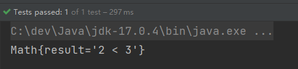
使用CDATA方式：

```xml
<beans xmlns="http://www.img/Springframework.org/schema/beans"
       xmlns:xsi="http://www.w3.org/2001/XMLSchema-instance"
       xsi:schemaLocation="http://www.img/Springframework.org/schema/beans http://www.img/Springframework.org/schema/beans/img/Spring-beans.xsd">

    <bean id="mathBean" class="com.powernode.img/Spring6.beans.Math">
        <property name="result">
            <!--只能使用value标签-->
            <value><![CDATA[2 < 3]]></value>
        </property>
    </bean>

</beans>
```
**使用CDATA时，不能使用value属性，只能使用value标签。**

## p命名空间注入

目的：简化配置。
使用p命名空间注入的前提条件包括两个：

- 第一：在XML头部信息中添加p命名空间的配置信息：`xmlns:p="http://www.img/Springframework.org/schema/p"`
- 第二：p命名空间注入是基于setter方法的，所以需要对应的属性提供setter方法。
```java
public class Customer {
    private String name;
    private int age;

    public void setName(String name) {
        this.name = name;
    }

    public void setAge(int age) {
        this.age = age;
    }

    @Override
    public String toString() {
        return "Customer{" +
                "name='" + name + '\'' +
                ", age=" + age +
                '}';
    }
}

```
```xml
<beans xmlns="http://www.img/Springframework.org/schema/beans"
       xmlns:p="http://www.img/Springframework.org/schema/p"
       xmlns:xsi="http://www.w3.org/2001/XMLSchema-instance"
       xsi:schemaLocation="http://www.img/Springframework.org/schema/beans http://www.img/Springframework.org/schema/beans/img/Spring-beans.xsd">

    <bean id="customerBean" class="com.powernode.img/Spring6.beans.Customer" p:name="zhangsan" p:age="20"/>

</beans>
```
```java
@Test
public void testP(){
    ApplicationContext applicationContext = new ClassPathXmlApplicationContext("img/Spring-p.xml");
    Customer customerBean = applicationContext.getBean("customerBean", Customer.class);
    System.out.println(customerBean);
}
```
执行结果：
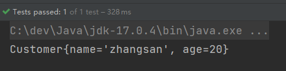

## c命名空间注入

c命名空间是简化构造方法注入的。
使用c命名空间的两个前提条件：

+ 第一：需要在xml配置文件头部添加信息：`xmlns:c="http://www.img/Springframework.org/schema/c"`
+ 第二：需要提供构造方法。


```java
public class MyTime {
    private int year;
    private int month;
    private int day;

    public MyTime(int year, int month, int day) {
        this.year = year;
        this.month = month;
        this.day = day;
    }

    @Override
    public String toString() {
        return "MyTime{" +
                "year=" + year +
                ", month=" + month +
                ", day=" + day +
                '}';
    }
}

```
```xml
<beans xmlns="http://www.img/Springframework.org/schema/beans"
       xmlns:c="http://www.img/Springframework.org/schema/c"
       xmlns:xsi="http://www.w3.org/2001/XMLSchema-instance"
       xsi:schemaLocation="http://www.img/Springframework.org/schema/beans http://www.img/Springframework.org/schema/beans/img/Spring-beans.xsd">

    <!--<bean id="myTimeBean" class="com.powernode.img/Spring6.beans.MyTime" c:year="1970" c:month="1" c:day="1"/>-->

    <bean id="myTimeBean" class="com.powernode.img/Spring6.beans.MyTime" c:_0="2008" c:_1="8" c:_2="8"/>

</beans>
```
```java
@Test
public void testC(){
    ApplicationContext applicationContext = new ClassPathXmlApplicationContext("img/Spring-c.xml");
    MyTime myTimeBean = applicationContext.getBean("myTimeBean", MyTime.class);
    System.out.println(myTimeBean);
}
```
执行结果：


##  util命名空间

使用util命名空间可以让**配置复用**。
使用util命名空间的前提是：在img/Spring配置文件头部添加配置信息。如下：
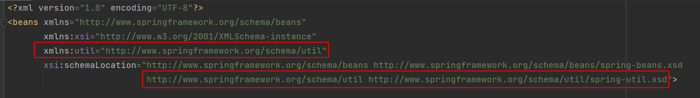

```java
public class MyDataSource1 {
    private Properties properties;

    public void setProperties(Properties properties) {
        this.properties = properties;
    }

    @Override
    public String toString() {
        return "MyDataSource1{" +
                "properties=" + properties +
                '}';
    }
}

```
```java
public class MyDataSource2 {
    private Properties properties;

    public void setProperties(Properties properties) {
        this.properties = properties;
    }

    @Override
    public String toString() {
        return "MyDataSource2{" +
                "properties=" + properties +
                '}';
    }
}

```
```xml
<beans xmlns="http://www.img/Springframework.org/schema/beans"
       xmlns:xsi="http://www.w3.org/2001/XMLSchema-instance"
       xmlns:util="http://www.img/Springframework.org/schema/util"
       xsi:schemaLocation="http://www.img/Springframework.org/schema/beans http://www.img/Springframework.org/schema/beans/img/Spring-beans.xsd
                           http://www.img/Springframework.org/schema/util http://www.img/Springframework.org/schema/util/img/Spring-util.xsd">

    <util:properties id="prop">
        <prop key="driver">com.mysql.cj.jdbc.Driver</prop>
        <prop key="url">jdbc:mysql://localhost:3306/img/Spring</prop>
        <prop key="username">root</prop>
        <prop key="password">123456</prop>
    </util:properties>

    <bean id="dataSource1" class="com.powernode.img/Spring6.beans.MyDataSource1">
        <property name="properties" ref="prop"/>
    </bean>

    <bean id="dataSource2" class="com.powernode.img/Spring6.beans.MyDataSource2">
        <property name="properties" ref="prop"/>
    </bean>
</beans>
```
```java
@Test
public void testUtil(){
    ApplicationContext applicationContext = new ClassPathXmlApplicationContext("img/Spring-util.xml");

    MyDataSource1 dataSource1 = applicationContext.getBean("dataSource1", MyDataSource1.class);
    System.out.println(dataSource1);

    MyDataSource2 dataSource2 = applicationContext.getBean("dataSource2", MyDataSource2.class);
    System.out.println(dataSource2);
}
```
执行结果：
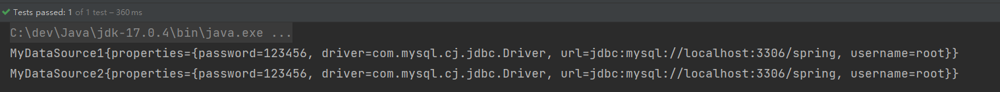


##  基于XML的自动装配

Spring还可以完成自动化的注入，自动化注入又被称为自动装配。它可以根据**名字**进行自动装配，也可以根据**类型**进行自动装配。

### 根据名称自动装配

```java
public class UserDao {

    public void insert(){
        System.out.println("正在保存用户数据。");
    }
}

```
```java
public class UserService {

    private UserDao aaa;

    // 这个set方法非常关键
    public void setAaa(UserDao aaa) {
        this.aaa = aaa;
    }

    public void save(){
        aaa.insert();
    }
}

```
Spring的配置文件这样配置：
```xml
<beans xmlns="http://www.img/Springframework.org/schema/beans"
       xmlns:xsi="http://www.w3.org/2001/XMLSchema-instance"
       xsi:schemaLocation="http://www.img/Springframework.org/schema/beans http://www.img/Springframework.org/schema/beans/img/Spring-beans.xsd">

    <bean id="userService" class="com.powernode.img/Spring6.service.UserService" autowire="byName"/>
    
    <bean id="aaa" class="com.powernode.img/Spring6.dao.UserDao"/>

</beans>
```
这个配置起到关键作用：

- UserService Bean中需要添加autowire="byName"，表示通过名称进行装配。
- UserService类中有一个UserDao属性，而UserDao属性的名字是aaa，**对应的set方法是setAaa()**，正好和UserDao Bean的id是一样的。这就是根据名称自动装配。
```java
@Test
public void testAutowireByName(){
    ApplicationContext applicationContext = new ClassPathXmlApplicationContext("img/Spring-autowire.xml");
    UserService userService = applicationContext.getBean("userService", UserService.class);
    userService.save();
}
```
执行结果：
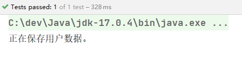
**底层会调用set方法进行注入**。

###  根据类型自动装配

```java
public class AccountDao {
    public void insert(){
        System.out.println("正在保存账户信息");
    }
}

```
```java
public class AccountService {
    private AccountDao accountDao;

    public void setAccountDao(AccountDao accountDao) {
        this.accountDao = accountDao;
    }

    public void save(){
        accountDao.insert();
    }
}

```
```xml
<beans xmlns="http://www.img/Springframework.org/schema/beans"
       xmlns:xsi="http://www.w3.org/2001/XMLSchema-instance"
       xsi:schemaLocation="http://www.img/Springframework.org/schema/beans http://www.img/Springframework.org/schema/beans/img/Spring-beans.xsd">

    <!--byType表示根据类型自动装配-->
    <bean id="accountService" class="com.powernode.img/Spring6.service.AccountService" autowire="byType"/>

    <bean class="com.powernode.img/Spring6.dao.AccountDao"/>

</beans>
```
```java
@Test
public void testAutowireByType(){
    ApplicationContext applicationContext = new ClassPathXmlApplicationContext("img/Spring-autowire.xml");
    AccountService accountService = applicationContext.getBean("accountService", AccountService.class);
    accountService.save();
}
```
执行结果：


无论是byName还是byType，在装配的时候**都是基于set方法的**。


##  Spring引入外部属性配置文件

写一个数据源类，提供相关属性。
```java
public class MyDataSource implements DataSource {
    @Override
    public String toString() {
        return "MyDataSource{" +
                "driver='" + driver + '\'' +
                ", url='" + url + '\'' +
                ", username='" + username + '\'' +
                ", password='" + password + '\'' +
                '}';
    }

    private String driver;
    private String url;
    private String username;
    private String password;

    public void setDriver(String driver) {
        this.driver = driver;
    }

    public void setUrl(String url) {
        this.url = url;
    }

    public void setUsername(String username) {
        this.username = username;
    }

    public void setPassword(String password) {
        this.password = password;
    }

    //......
}

```
在类路径下新建jdbc.properties文件，并配置信息。
```properties
driver=com.mysql.cj.jdbc.Driver
url=jdbc:mysql://localhost:3306/img/Spring
username=root
password=root123
```
在img/Spring中配置使用jdbc.properties文件。
```xml
<beans xmlns="http://www.img/Springframework.org/schema/beans"
       xmlns:xsi="http://www.w3.org/2001/XMLSchema-instance"
       xmlns:context="http://www.img/Springframework.org/schema/context"
       xsi:schemaLocation="http://www.img/Springframework.org/schema/beans http://www.img/Springframework.org/schema/beans/img/Spring-beans.xsd
                           http://www.img/Springframework.org/schema/context http://www.img/Springframework.org/schema/context/img/Spring-context.xsd">

    <context:property-placeholder location="jdbc.properties"/>
    
    <bean id="dataSource" class="com.powernode.img/Spring6.beans.MyDataSource">
        <property name="driver" value="${driver}"/>
        <property name="url" value="${url}"/>
        <property name="username" value="${username}"/>
        <property name="password" value="${password}"/>
    </bean>
</beans>
```
测试：
```java
@Test
public void testProperties(){
    ApplicationContext applicationContext = new ClassPathXmlApplicationContext("img/Spring-properties.xml");
    MyDataSource dataSource = applicationContext.getBean("dataSource", MyDataSource.class);
    System.out.println(dataSource);
}
```
执行结果：
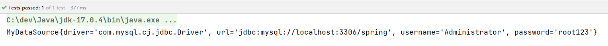

# Bean的作用域

## singleton

默认情况下，Spring的IoC容器创建的Bean对象是单例的：
```java
public class SpringBean {
}

```
```xml
<beans xmlns="http://www.img/Springframework.org/schema/beans"
       xmlns:xsi="http://www.w3.org/2001/XMLSchema-instance"
       xsi:schemaLocation="http://www.img/Springframework.org/schema/beans http://www.img/Springframework.org/schema/beans/img/Spring-beans.xsd">

    <bean id="sb" class="com.powernode.img/Spring6.beans.SpringBean" />
    
</beans>
```
```java
@Test
public void testScope(){
    ApplicationContext applicationContext = new ClassPathXmlApplicationContext("img/Spring-scope.xml");

    SpringBean sb1 = applicationContext.getBean("sb", SpringBean.class);
    System.out.println(sb1);

    SpringBean sb2 = applicationContext.getBean("sb", SpringBean.class);
    System.out.println(sb2);
}
```
执行结果：


默认情况下，Bean对象的创建是在初始化Spring上下文的时候就完成的：

```java
public class SpringBean {
    public SpringBean() {
        System.out.println("SpringBean的无参数构造方法执行。");
    }
}

```
```java
@Test
public void testScope(){
    ApplicationContext applicationContext = new ClassPathXmlApplicationContext("img/Spring-scope.xml");
}
```
执行测试：
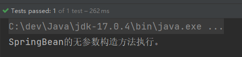


## prototype

如果想让Spring的Bean对象以多例的形式存在，可以在bean标签中指定scope属性的值为：**prototype**，这样Spring会在每一次执行getBean()方法的时候创建Bean对象，调用几次则创建几次。
```xml
<beans xmlns="http://www.img/Springframework.org/schema/beans"
       xmlns:xsi="http://www.w3.org/2001/XMLSchema-instance"
       xsi:schemaLocation="http://www.img/Springframework.org/schema/beans http://www.img/Springframework.org/schema/beans/img/Spring-beans.xsd">

    <!--scope如果没有配置，它的默认值是singleton-->
    <bean id="sb" class="com.powernode.img/Spring6.beans.SpringBean" scope="prototype" />

</beans>
```
```java
@Test
public void testScope(){
    ApplicationContext applicationContext = new ClassPathXmlApplicationContext("img/Spring-scope.xml");

    SpringBean sb1 = applicationContext.getBean("sb", SpringBean.class);
    System.out.println(sb1);

    SpringBean sb2 = applicationContext.getBean("sb", SpringBean.class);
    System.out.println(sb2);
}
```
执行结果：
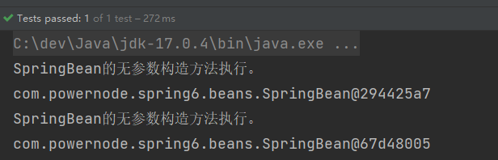


多例模式下，在初始化Spring上下文的时候，并没有创建Bean对象：

```java
@Test
public void testScope(){
    ApplicationContext applicationContext = new ClassPathXmlApplicationContext("img/Spring-scope.xml");
}
```
执行结果：
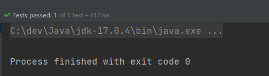

## 其它scope

**scope属性的值不止两个，它一共包括8个选项：**

- singleton：默认的，单例。
- prototype：原型。每调用一次getBean()方法则获取一个新的Bean对象。或每次注入的时候都是新对象。
- request：一个请求对应一个Bean。**仅限于在WEB应用中使用**。
- session：一个会话对应一个Bean。**仅限于在WEB应用中使用**。
- global session：**portlet应用中专用的**。如果在Servlet的WEB应用中使用global session的话，和session一个效果。（portlet和servlet都是规范。servlet运行在servlet容器中，例如Tomcat。portlet运行在portlet容器中。）
- application：一个应用对应一个Bean。**仅限于在WEB应用中使用。**
- websocket：一个websocket生命周期对应一个Bean。**仅限于在WEB应用中使用。**
- 自定义scope：很少使用。


# GoF之工厂模式

- 设计模式：一种可以被重复利用的解决方案。
- 不过除了GoF23种设计模式之外，还有其它的设计模式，如：JavaEE的设计模式（DAO模式、MVC模式等）。
- GoF23种设计模式可分为三大类：
   - **创建型**（5个）：解决对象创建问题。
      - 单例模式
      - 工厂方法模式
      - 抽象工厂模式
      - 建造者模式
      - 原型模式
   - **结构型**（7个）：一些类或对象组合在一起的经典结构。
      - 代理模式
      - 装饰模式
      - 适配器模式
      - 组合模式
      - 享元模式
      - 外观模式
      - 桥接模式
   - **行为型**（11个）：解决类或对象之间的交互问题。
      - 策略模式
      - 模板方法模式
      - 责任链模式
      - 观察者模式
      - 迭代子模式
      - 命令模式
      - 备忘录模式
      - 状态模式
      - 访问者模式
      - 中介者模式
      - 解释器模式
- 工厂模式是解决对象创建问题的，所以工厂模式属于创建型设计模式。


## 工厂模式的三种形态

工厂模式通常有三种形态：

- 第一种：**简单工厂模式（Simple Factory）：不属于23种设计模式之一。简单工厂模式又叫做：静态 工厂方法模式。简单工厂模式是工厂方法模式的一种特殊实现。**
- 第二种：工厂方法模式（Factory Method）：是23种设计模式之一。
- 第三种：抽象工厂模式（Abstract Factory）：是23种设计模式之一。
  - 在Spring框架中没用到


## 简单工厂模式

简单工厂模式的角色包括三个：

- 抽象产品 角色
- 具体产品 角色
- 工厂类 角色

简单工厂模式的代码如下：
抽象产品角色：

```java
public abstract class Weapon {
    /**
     * 所有的武器都有攻击行为
     */
    public abstract void attack();
}
```
具体产品角色：
```java
public class Tank extends Weapon{
    @Override
    public void attack() {
        System.out.println("坦克开炮！");
    }
}

```
```java
public class Fighter extends Weapon{
    @Override
    public void attack() {
        System.out.println("战斗机投下原子弹！");
    }
}

```
```java
public class Dagger extends Weapon{
    @Override
    public void attack() {
        System.out.println("砍他丫的！");
    }
}

```
工厂类角色：
```java
public class WeaponFactory {
    /**
     * 根据不同的武器类型生产武器
     * @param weaponType 武器类型
     * @return 武器对象
     */
    public static Weapon get(String weaponType){
        if (weaponType == null || weaponType.trim().length() == 0) {
            return null;
        }
        Weapon weapon = null;
        if ("TANK".equals(weaponType)) {
            weapon = new Tank();
        } else if ("FIGHTER".equals(weaponType)) {
            weapon = new Fighter();
        } else if ("DAGGER".equals(weaponType)) {
            weapon = new Dagger();
        } else {
            throw new RuntimeException("不支持该武器！");
        }
        return weapon;
    }
}

```
测试程序（客户端程序）：
```java
public class Client {
    public static void main(String[] args) {
        Weapon weapon1 = WeaponFactory.get("TANK");
        weapon1.attack();

        Weapon weapon2 = WeaponFactory.get("FIGHTER");
        weapon2.attack();

        Weapon weapon3 = WeaponFactory.get("DAGGER");
        weapon3.attack();
    }
}

```
执行结果：
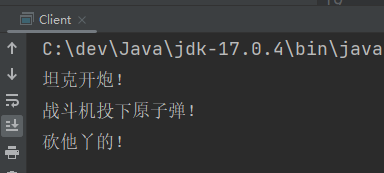
简单工厂模式的优点：

- 客户端程序不需要关心对象的创建细节，需要哪个对象时，只需要向工厂索要即可，初步实现了责任的分离。客户端只负责“消费”，工厂负责“生产”。生产和消费分离。

简单工厂模式的缺点：

- 缺点1：工厂类集中了所有产品的创造逻辑，形成一个无所不知的全能类，有人把它叫做上帝类。显然工厂类非常关键，不能出问题，一旦出问题，整个系统瘫痪。
- 缺点2：不符合OCP开闭原则，在进行系统扩展时，需要修改工厂类。

**Spring中的BeanFactory就使用了简单工厂模式。**


##  工厂方法模式

工厂方法模式既保留了简单工厂模式的优点，同时又解决了简单工厂模式的缺点。
工厂方法模式的角色包括：

- **抽象工厂角色**
- **具体工厂角色**
- 抽象产品角色
- 具体产品角色

代码如下：
```java
public abstract class Weapon {
    /**
     * 所有武器都有攻击行为
     */
    public abstract void attack();
}

```
```java
public class Gun extends Weapon{
    @Override
    public void attack() {
        System.out.println("开枪射击！");
    }
}

```
```java
public class Fighter extends Weapon{
    @Override
    public void attack() {
        System.out.println("战斗机发射核弹！");
    }
}

```
```java
public interface WeaponFactory {
    Weapon get();
}

```
```java
public class GunFactory implements WeaponFactory{
    @Override
    public Weapon get() {
        return new Gun();
    }
}

```
```java
public class FighterFactory implements WeaponFactory{
    @Override
    public Weapon get() {
        return new Fighter();
    }
}

```
客户端程序：
```java
public class Client {
    public static void main(String[] args) {
        WeaponFactory factory = new GunFactory();
        Weapon weapon = factory.get();
        weapon.attack();

        WeaponFactory factory1 = new FighterFactory();
        Weapon weapon1 = factory1.get();
        weapon1.attack();
    }
}

```
执行客户端程序：
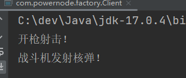
如果想扩展一个新的产品，只要新增一个产品类，再新增一个该产品对应的工厂即可：

```java
public class Dagger extends Weapon{
    @Override
    public void attack() {
        System.out.println("砍丫的！");
    }
}

```
```java
public class DaggerFactory implements WeaponFactory{
    @Override
    public Weapon get() {
        return new Dagger();
    }
}

```
客户端程序：
```java
public class Client {
    public static void main(String[] args) {
        WeaponFactory factory = new GunFactory();
        Weapon weapon = factory.get();
        weapon.attack();

        WeaponFactory factory1 = new FighterFactory();
        Weapon weapon1 = factory1.get();
        weapon1.attack();

        WeaponFactory factory2 = new DaggerFactory();
        Weapon weapon2 = factory2.get();
        weapon2.attack();
    }
}

```
在进行功能扩展的时候，不需要修改之前的源代码，显然工厂方法模式符合OCP原则。
工厂方法模式的优点：

- 一个调用者想创建一个对象，只要知道其名称就可以了。 
- 扩展性高，如果想增加一个产品，只要扩展一个工厂类就可以。
- 屏蔽产品的具体实现，调用者只关心产品的接口。

工厂方法模式的缺点：

- 每次增加一个产品时，都需要增加一个具体类和对象实现工厂，使得系统中类的个数成倍增加，在一定程度上增加了系统的复杂度，同时也增加了系统具体类的依赖。


# Bean的实例化方式

Spring为Bean提供了多种实例化方式，通常包括4种方式。

- 第一种：通过构造方法实例化
- 第二种：通过简单工厂模式实例化
- 第三种：通过factory-bean实例化
- 第四种：通过FactoryBean接口实例化

## 通过构造方法实例化

之前一直使用的就是这种方式。默认情况下，会调用Bean的无参数构造方法。
```java
public class User {
    public User() {
        System.out.println("User类的无参数构造方法执行。");
    }
}

```
```xml
<beans xmlns="http://www.img/Springframework.org/schema/beans"
       xmlns:xsi="http://www.w3.org/2001/XMLSchema-instance"
       xsi:schemaLocation="http://www.img/Springframework.org/schema/beans http://www.img/Springframework.org/schema/beans/img/Spring-beans.xsd">

    <bean id="userBean" class="com.powernode.img/Spring6.bean.User"/>

</beans>
```
```java
public class SpringInstantiationTest {

    @Test
    public void testConstructor(){
        ApplicationContext applicationContext = new ClassPathXmlApplicationContext("img/Spring.xml");
        User user = applicationContext.getBean("userBean", User.class);
        System.out.println(user);
    }
}

```
执行结果：
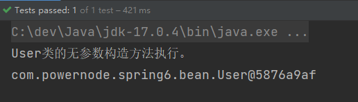


## 通过简单工厂模式实例化

第一步：定义一个Bean
```java
public class Vip {
}

```
第二步：编写简单工厂模式当中的工厂类
```java
public class VipFactory {
    public static Vip get(){ // 静态方法，所以VipFactory不需要被Spring管理创建对象
        return new Vip();
    }
}

```
第三步：在Spring配置文件中指定创建该Bean的方法（使用factory-method属性指定）
```xml
<bean id="vipBean" class="com.powernode.img/Spring6.bean.VipFactory" factory-method="get"/>
```
第四步：编写测试程序
```java
@Test
public void testSimpleFactory(){
    ApplicationContext applicationContext = new ClassPathXmlApplicationContext("img/Spring.xml");
    Vip vip = applicationContext.getBean("vipBean", Vip.class);
    System.out.println(vip);
}
```
执行结果：
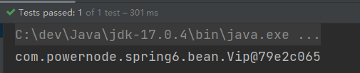


##  通过factory-bean实例化

这种方式本质上是：通过工厂方法模式进行实例化。
第一步：定义一个Bean
```java
public class Order {
}

```
第二步：定义具体工厂类，工厂类中定义实例方法
```java
public class OrderFactory {
    public Order get(){
        return new Order();
    }
}

```
第三步：在Spring配置文件中指定factory-bean以及factory-method
```xml
<bean id="orderFactory" class="com.powernode.img/Spring6.bean.OrderFactory"/>
<bean id="orderBean" factory-bean="orderFactory" factory-method="get"/>
```
第四步：编写测试程序
```java
@Test
public void testSelfFactoryBean(){
    ApplicationContext applicationContext = new ClassPathXmlApplicationContext("img/Spring.xml");
    Order orderBean = applicationContext.getBean("orderBean", Order.class);
    System.out.println(orderBean);
}
```
执行结果：
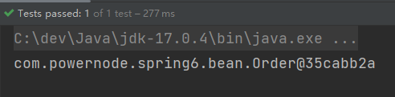


## 通过FactoryBean接口实例化

在factory-bean实例化方式中，factory-bean是我们自定义的，factory-method也是我们自己定义的。

在Spring中，当编写的类直接**实现FactoryBean接口**之后，factory-bean不需要指定了，factory-method也不需要指定了。
factory-bean会自动指向实现FactoryBean接口的类，factory-method会自动指向getObject()方法。
第一步：定义一个Bean

```java
public class Person {
}

```
第二步：编写一个类实现FactoryBean接口
```java
public class PersonFactoryBean implements FactoryBean<Person> {

    @Override
    public Person getObject() throws Exception {
        return new Person();
    }

    @Override
    public Class<?> getObjectType() {
        return null;
    }

    @Override
    public boolean isSingleton() {
        // true表示单例
        // false表示原型
        return true;
    }
}

```
第三步：在Spring配置文件中配置FactoryBean
```xml
<bean id="personBean" class="com.powernode.img/Spring6.bean.PersonFactoryBean"/>
```
测试程序：
```java
@Test
public void testFactoryBean(){
    ApplicationContext applicationContext = new ClassPathXmlApplicationContext("img/Spring.xml");
    Person personBean = applicationContext.getBean("personBean", Person.class);
    System.out.println(personBean);

    Person personBean2 = applicationContext.getBean("personBean", Person.class);
    System.out.println(personBean2);
}
```
执行结果：
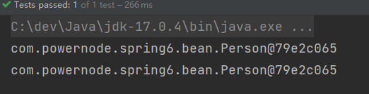

**FactoryBean在Spring中是一个接口。被称为“工厂Bean”。“工厂Bean”是一种特殊的Bean。所有的“工厂Bean”都是用来协助Spring框架来创建其他Bean对象的。**


## BeanFactory和FactoryBean的区别

###  BeanFactory

Spring IoC容器的顶级对象，BeanFactory被翻译为“Bean工厂”，在Spring的IoC容器中，“Bean工厂”负责创建Bean对象。
BeanFactory是工厂。

###  FactoryBean

FactoryBean：它是一个Bean，是一个能够**辅助Spring**实例化其它Bean对象的一个Bean。
在Spring中，Bean可以分为两类：

- 第一类：普通Bean
- 第二类：工厂Bean（记住：工厂Bean也是一种Bean，只不过这种Bean比较特殊，它可以辅助Spring实例化其它Bean对象。）

## 注入自定义Date

java.util.Date在Spring中被当做简单类型，简单类型在注入的时候可以直接使用value属性或value标签来完成。但对于Date类型来说，采用value属性或value标签赋值的时候，对日期字符串的格式要求非常严格，必须是这种格式的：Mon Oct 10 14:30:26 CST 2022。其他格式是不会被识别的。

可以使用FactoryBean来解决：

```java
public class Student {
    private Date birth;

    public void setBirth(Date birth) {
        this.birth = birth;
    }

    @Override
    public String toString() {
        return "Student{" +
                "birth=" + birth +
                '}';
    }
}

```
```java
public class DateFactoryBean implements FactoryBean<Date> {

    // 定义属性接收日期字符串
    private String date;

    // 通过构造方法给日期字符串属性赋值
    public DateFactoryBean(String date) {
        this.date = date;
    }

    @Override
    public Date getObject() throws Exception {
        SimpleDateFormat sdf = new SimpleDateFormat("yyyy-MM-dd");
        return sdf.parse(this.date);
    }

    @Override
    public Class<?> getObjectType() {
        return null;
    }
}

```
```xml
<bean id="dateBean" class="com.powernode.img/Spring6.bean.DateFactoryBean">
  <constructor-arg name="date" value="1999-10-11"/>
</bean>

<bean id="studentBean" class="com.powernode.img/Spring6.bean.Student">
  <property name="birth" ref="dateBean"/>
</bean>
```
```xml
@Test
public void testDate(){
    ApplicationContext applicationContext = new ClassPathXmlApplicationContext("img/Spring.xml");
    Student studentBean = applicationContext.getBean("studentBean", Student.class);
    System.out.println(studentBean);
}
```
执行测试程序：
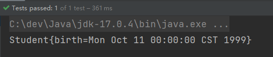

# Bean的生命周期

Spring其实就是一个管理Bean对象的工厂。它负责对象的创建，对象的销毁等。
所谓的生命周期就是：对象从创建开始到最终销毁的整个过程。

## Bean的生命周期之5步

Bean生命周期的管理，可以参考Spring的源码：**AbstractAutowireCapableBeanFactory类的doCreateBean()方法。**
Bean生命周期可以粗略的划分为五大步：

- 第一步：实例化Bean
- 第二步：Bean属性赋值
- 第三步：初始化Bean
- 第四步：使用Bean
- 第五步：销毁Bean

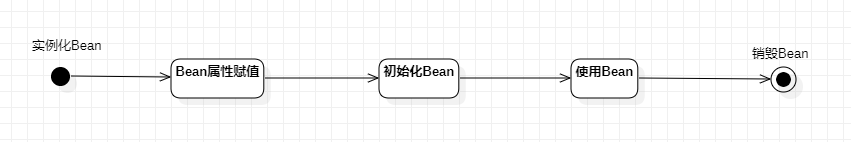
编写测试程序：
定义一个Bean

```java
public class User {
    private String name;

    public User() {
        System.out.println("1.实例化Bean");
    }

    public void setName(String name) {
        this.name = name;
        System.out.println("2.Bean属性赋值");
    }

    public void initBean(){
        System.out.println("3.初始化Bean");
    }

    public void destroyBean(){
        System.out.println("5.销毁Bean");
    }

}

```
```xml
<beans xmlns="http://www.img/Springframework.org/schema/beans"
       xmlns:xsi="http://www.w3.org/2001/XMLSchema-instance"
       xsi:schemaLocation="http://www.img/Springframework.org/schema/beans http://www.img/Springframework.org/schema/beans/img/Spring-beans.xsd">

    <!--
    init-method属性指定初始化方法。
    destroy-method属性指定销毁方法。
    -->
    <bean id="userBean" class="com.powernode.img/Spring6.bean.User" init-method="initBean" destroy-method="destroyBean">
        <property name="name" value="zhangsan"/>
    </bean>

</beans>
```
```java
public class BeanLifecycleTest {
    @Test
    public void testLifecycle(){
        ApplicationContext applicationContext = new ClassPathXmlApplicationContext("img/Spring.xml");
        User userBean = applicationContext.getBean("userBean", User.class);
        System.out.println("4.使用Bean");
        // 只有正常关闭img/Spring容器才会执行销毁方法
        ClassPathXmlApplicationContext context = (ClassPathXmlApplicationContext) applicationContext;
        context.close();
    }
}

```
执行结果：
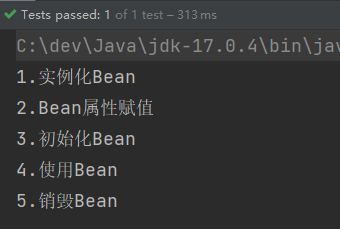
需要注意的：

- 第一：只有正常关闭img/Spring容器，bean的销毁方法才会被调用。
- 第二：ClassPathXmlApplicationContext类才有close()方法。


##  Bean生命周期之7步

在以上的5步中，第3步是初始化Bean，可以在初始化前和初始化后添加代码，需要加入“Bean后处理器”。
编写一个类实现BeanPostProcessor类，并且重写before和after方法：

```java
public class LogBeanPostProcessor implements BeanPostProcessor {
    @Override
    public Object postProcessBeforeInitialization(Object bean, String beanName) throws BeansException {
        System.out.println("Bean后处理器的before方法执行，即将开始初始化");
        return bean;
    }

    @Override
    public Object postProcessAfterInitialization(Object bean, String beanName) throws BeansException {
        System.out.println("Bean后处理器的after方法执行，已完成初始化");
        return bean;
    }
}

```
在img/Spring.xml文件中配置“Bean后处理器”：
```xml
<!--配置Bean后处理器。这个后处理器将作用于当前配置文件中所有的bean。-->
<bean class="com.powernode.img/Spring6.bean.LogBeanPostProcessor"/>
```
**在img/Spring.xml文件中配置的Bean后处理器将作用于当前配置文件中所有的Bean。**
执行测试程序：
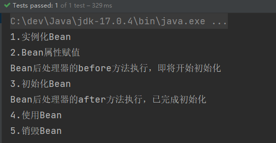
如果加上Bean后处理器的话，Bean的生命周期就是7步了：


##  Bean生命周期之10步

如果根据源码跟踪，可以划分更细粒度的步骤，10步：


Aware相关的接口包括：BeanNameAware、BeanClassLoaderAware、BeanFactoryAware

- 当Bean实现了BeanNameAware，Spring会将Bean的名字传递给Bean。
- 当Bean实现了BeanClassLoaderAware，Spring会将加载该Bean的类加载器传递给Bean。
- 当Bean实现了BeanFactoryAware，Spring会将Bean工厂对象传递给Bean。

测试以上10步，可以让User类实现5个接口，并实现所有方法： 

- BeanNameAware
- BeanClassLoaderAware
- BeanFactoryAware
- InitializingBean
- DisposableBean

代码如下：
```java
public class User implements BeanNameAware, BeanClassLoaderAware, BeanFactoryAware, InitializingBean, DisposableBean {
    private String name;

    public User() {
        System.out.println("1.实例化Bean");
    }

    public void setName(String name) {
        this.name = name;
        System.out.println("2.Bean属性赋值");
    }

    public void initBean(){
        System.out.println("6.初始化Bean");
    }

    public void destroyBean(){
        System.out.println("10.销毁Bean");
    }

    @Override
    public void setBeanClassLoader(ClassLoader classLoader) {
        System.out.println("3.类加载器：" + classLoader);
    }

    @Override
    public void setBeanFactory(BeanFactory beanFactory) throws BeansException {
        System.out.println("3.Bean工厂：" + beanFactory);
    }

    @Override
    public void setBeanName(String name) {
        System.out.println("3.bean名字：" + name);
    }

    @Override
    public void destroy() throws Exception {
        System.out.println("9.DisposableBean destroy");
    }

    @Override
    public void afterPropertiesSet() throws Exception {
        System.out.println("5.afterPropertiesSet执行");
    }
}

```
```java
public class LogBeanPostProcessor implements BeanPostProcessor {
    @Override
    public Object postProcessBeforeInitialization(Object bean, String beanName) throws BeansException {
        System.out.println("4.Bean后处理器的before方法执行，即将开始初始化");
        return bean;
    }

    @Override
    public Object postProcessAfterInitialization(Object bean, String beanName) throws BeansException {
        System.out.println("7.Bean后处理器的after方法执行，已完成初始化");
        return bean;
    }
}

```
执行结果：

**通过测试可以看出来：**

- **InitializingBean的方法早于init-method的执行。**
- **DisposableBean的方法早于destroy-method的执行。**


## Bean的作用域不同，管理方式不同

Spring 根据Bean的作用域来选择管理方式。

- 对于singleton作用域的Bean，Spring 能够精确地知道该Bean何时被创建，何时初始化完成，以及何时被销毁；
- 而对于 prototype 作用域的 Bean，Spring 只负责创建，当容器创建了 Bean 的实例后，Bean 的实例就交给客户端代码管理，Spring 容器将不再跟踪其生命周期。

修改配置文件：

```xml
<beans xmlns="http://www.img/Springframework.org/schema/beans"
       xmlns:xsi="http://www.w3.org/2001/XMLSchema-instance"
       xsi:schemaLocation="http://www.img/Springframework.org/schema/beans http://www.img/Springframework.org/schema/beans/img/Spring-beans.xsd">

    <!--
    init-method属性指定初始化方法。
    destroy-method属性指定销毁方法。
    -->
    <bean id="userBean" class="com.powernode.img/Spring6.bean.User" init-method="initBean" destroy-method="destroyBean" scope="prototype">
        <property name="name" value="zhangsan"/>
    </bean>

    <!--配置Bean后处理器。这个后处理器将作用于当前配置文件中所有的bean。-->
    <bean class="com.powernode.img/Spring6.bean.LogBeanPostProcessor"/>

</beans>
```
执行测试程序：
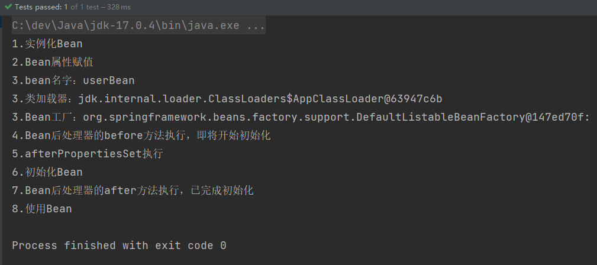
只执行了前8步，第9和10都没有执行。


## 自己new的对象如何让Spring管理

```java
public class User {
}

```
```java
public class RegisterBeanTest {

    @Test
    public void testBeanRegister(){
        // 自己new的对象
        User user = new User();
        System.out.println(user);

        // 创建 默认可列表BeanFactory 对象
        DefaultListableBeanFactory factory = new DefaultListableBeanFactory();
        // 注册Bean
        factory.registerSingleton("userBean", user);
        // 从img/Spring容器中获取bean
        User userBean = factory.getBean("userBean", User.class);
        System.out.println(userBean);
    }
}

```
执行结果：
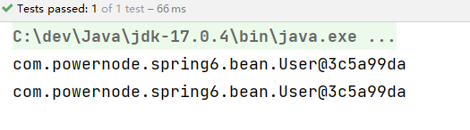


# Bean的循环依赖问题

## 什么是Bean的循环依赖

A对象中有B属性。B对象中有A属性。
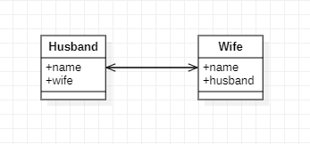


## singleton下的set注入产生的循环依赖

我们来编写程序，测试一下在singleton+setter的模式下产生的循环依赖，Spring是否能够解决？
```java
public class Husband {
    private String name;
    private Wife wife;

    public void setName(String name) {
        this.name = name;
    }

    public String getName() {
        return name;
    }

    public void setWife(Wife wife) {
        this.wife = wife;
    }

    // toString()方法重写时需要注意：不能直接输出wife，输出wife.getName()。要不然会出现递归导致的栈内存溢出错误。
    @Override
    public String toString() {
        return "Husband{" +
                "name='" + name + '\'' +
                ", wife=" + wife.getName() +
                '}';
    }
}

```
```java
public class Wife {
    private String name;
    private Husband husband;

    public void setName(String name) {
        this.name = name;
    }

    public String getName() {
        return name;
    }

    public void setHusband(Husband husband) {
        this.husband = husband;
    }

    // toString()方法重写时需要注意：不能直接输出husband，输出husband.getName()。要不然会出现递归导致的栈内存溢出错误。
    @Override
    public String toString() {
        return "Wife{" +
                "name='" + name + '\'' +
                ", husband=" + husband.getName() +
                '}';
    }
}

```
```xml
<beans xmlns="http://www.img/Springframework.org/schema/beans"
       xmlns:xsi="http://www.w3.org/2001/XMLSchema-instance"
       xsi:schemaLocation="http://www.img/Springframework.org/schema/beans http://www.img/Springframework.org/schema/beans/img/Spring-beans.xsd">

    <bean id="husbandBean" class="com.powernode.img/Spring6.bean.Husband" scope="singleton">
        <property name="name" value="张三"/>
        <property name="wife" ref="wifeBean"/>
    </bean>
    <bean id="wifeBean" class="com.powernode.img/Spring6.bean.Wife" scope="singleton">
        <property name="name" value="小花"/>
        <property name="husband" ref="husbandBean"/>
    </bean>
</beans>
```
```java
public class CircularDependencyTest {

    @Test
    public void testSingletonAndSet(){
        ApplicationContext applicationContext = new ClassPathXmlApplicationContext("img/Spring.xml");
        Husband husbandBean = applicationContext.getBean("husbandBean", Husband.class);
        Wife wifeBean = applicationContext.getBean("wifeBean", Wife.class);
        System.out.println(husbandBean);
        System.out.println(wifeBean);
    }
}

```
执行结果：
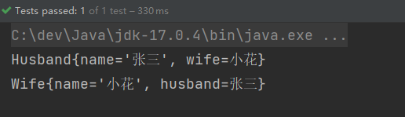
**在singleton + set注入的情况下，循环依赖是没有问题的。Spring可以解决这个问题。**

主要的原因是，在这种模式下Spring对Bean的管理主要分为清晰的两个阶段：

+ 第一个阶段：在Spring容器加载的时候，实例化Bean，只要其中任意一个Bean实例化之后，马上进行 “曝光”【不等属性赋值就曝光】
+ 第二个阶段：Bean“曝光”之后，再进行属性的赋值(调用set方法)。


## prototype下的set注入产生的循环依赖

```xml
<beans xmlns="http://www.img/Springframework.org/schema/beans"
       xmlns:xsi="http://www.w3.org/2001/XMLSchema-instance"
       xsi:schemaLocation="http://www.img/Springframework.org/schema/beans http://www.img/Springframework.org/schema/beans/img/Spring-beans.xsd">

    <bean id="husbandBean" class="com.powernode.img/Spring6.bean.Husband" scope="prototype">
        <property name="name" value="张三"/>
        <property name="wife" ref="wifeBean"/>
    </bean>
    <bean id="wifeBean" class="com.powernode.img/Spring6.bean.Wife" scope="prototype">
        <property name="name" value="小花"/>
        <property name="husband" ref="husbandBean"/>
    </bean>
</beans>
```
修改配置，将两个都改为prototype，发生了异常。

当循环依赖的**所有Bean**的scope="prototype"的时候，产生的循环依赖，Spring是无法解决的，会出现**BeanCurrentlyInCreationException**异常。

如果其中一个是singleton，另一个是prototype，是没有问题的。

为什么两个Bean都是prototype时会出错呢？
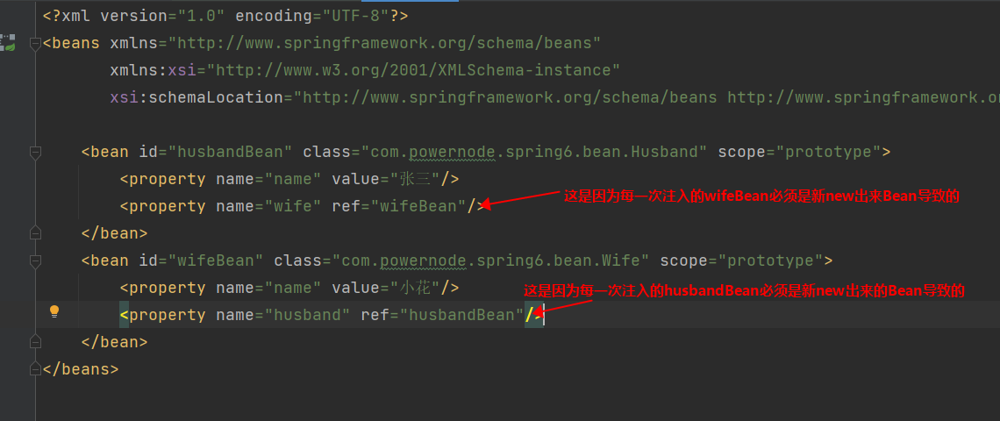


## singleton下的构造注入产生的循环依赖

```java
public class Husband {
    private String name;
    private Wife wife;

    public Husband(String name, Wife wife) {
        this.name = name;
        this.wife = wife;
    }

    // -----------------------分割线--------------------------------
    public String getName() {
        return name;
    }

    @Override
    public String toString() {
        return "Husband{" +
                "name='" + name + '\'' +
                ", wife=" + wife +
                '}';
    }
}

```
```java
public class Wife {
    private String name;
    private Husband husband;

    public Wife(String name, Husband husband) {
        this.name = name;
        this.husband = husband;
    }

    // -------------------------分割线--------------------------------
    public String getName() {
        return name;
    }

    @Override
    public String toString() {
        return "Wife{" +
                "name='" + name + '\'' +
                ", husband=" + husband +
                '}';
    }
}

```
```xml
<beans xmlns="http://www.img/Springframework.org/schema/beans"
       xmlns:xsi="http://www.w3.org/2001/XMLSchema-instance"
       xsi:schemaLocation="http://www.img/Springframework.org/schema/beans http://www.img/Springframework.org/schema/beans/img/Spring-beans.xsd">

    <bean id="hBean" class="com.powernode.img/Spring6.bean2.Husband" scope="singleton">
        <constructor-arg name="name" value="张三"/>
        <constructor-arg name="wife" ref="wBean"/>
    </bean>

    <bean id="wBean" class="com.powernode.img/Spring6.bean2.Wife" scope="singleton">
        <constructor-arg name="name" value="小花"/>
        <constructor-arg name="husband" ref="hBean"/>
    </bean>
</beans>
```
```java
@Test
public void testSingletonAndConstructor(){
    ApplicationContext applicationContext = new ClassPathXmlApplicationContext("img/Spring2.xml");
    Husband hBean = applicationContext.getBean("hBean", Husband.class);
    Wife wBean = applicationContext.getBean("wBean", Wife.class);
    System.out.println(hBean);
    System.out.println(wBean);
}
```
执行后发生了异常

**主要原因是：构造方法注入会导致实例化对象的过程和对象属性赋值的过程没有分离开，必须在一起完成导致的。**

## Spring解决循环依赖的机理

Spring为什么可以解决set + singleton模式下循环依赖？
根本的原因在于：这种方式可以做到将“实例化Bean”和“给Bean属性赋值”这两个动作分开去完成。
实例化Bean的时候：调用无参数构造方法来完成。**此时可以先不给属性赋值，可以提前将该Bean对象“曝光”给外界。**
给Bean属性赋值的时候：调用setter方法来完成。

也就是说，Bean都是单例的，先把所有的单例Bean实例化出来，放到一个集合当中（称之为缓存），所有的单例Bean全部实例化完成之后，以后再慢慢的调用setter方法给属性赋值。这样就解决了循环依赖的问题。

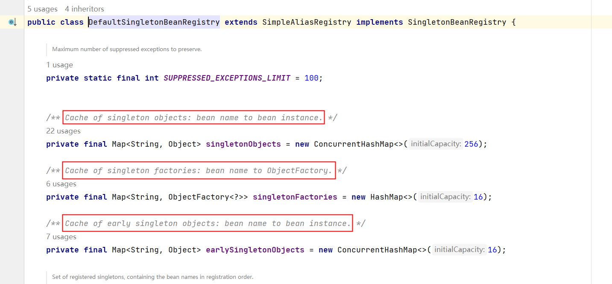
在以上类中包含三个重要的属性：
_**Cache of singleton objects: bean name to bean instance. **_**单例对象的缓存：key存储bean名称，value存储Bean对象【一级缓存】**
_**Cache of early singleton objects: bean name to bean instance. **_**早期单例对象的缓存：key存储bean名称，value存储早期的Bean对象【二级缓存】**
_**Cache of singleton factories: bean name to ObjectFactory. **_**单例工厂缓存：key存储bean名称，value存储该Bean对应的ObjectFactory对象【三级缓存】**
这三个缓存其实本质上是三个Map集合。
在该类中有这样一个方法addSingletonFactory()，这个方法的作用是：将创建Bean对象的ObjectFactory对象提前曝光。


再分析下面的源码：

从源码中可以看到，img/Spring会先从一级缓存中获取Bean，如果获取不到，则从二级缓存中获取Bean，如果二级缓存还是获取不到，则从三级缓存中获取之前曝光的ObjectFactory对象，通过ObjectFactory对象获取Bean实例，这样就解决了循环依赖的问题。
**总结：**
**Spring只能解决setter方法注入的单例bean之间的循环依赖。ClassA依赖ClassB，ClassB又依赖ClassA，形成依赖闭环。Spring在创建ClassA对象后，不需要等给属性赋值，直接将其曝光到bean缓存当中。在解析ClassA的属性时，又发现依赖于ClassB，再次去获取ClassB，当解析ClassB的属性时，又发现需要ClassA的属性，但此时的ClassA已经被提前曝光加入了正在创建的bean的缓存中，则无需创建新的的ClassA的实例，直接从缓存中获取即可。从而解决循环依赖问题。**

# 回顾反射机制

## 分析方法四要素

调用一个方法，一般涉及到4个要素：

- 调用哪个对象
- 哪个方法
- 传什么参数
- 返回什么值

反射也是如此。

## 获取Method

```java
public class SystemService {

    public void logout(){
        System.out.println("退出系统");
    }

    public boolean login(String username, String password){
        if ("admin".equals(username) && "admin123".equals(password)) {
            return true;
        }
        return false;
    }
    
    public boolean login(String password){
        if("110".equals(password)){
            return true;
        }
        return false;
    }
}

```

要获取方法Method，首先需要获取这个类Class。

```java
Class clazz = Class.forName("com.powernode.reflect.SystemService");
```
当拿到Class之后，调用getDeclaredMethod()方法可以获取到方法。
假如要获取这个方法：login(String username, String password)

```java
Method loginMethod = clazz.getDeclaredMethod("login", String.class, String.class);
```
假如要获取到这个方法：login(String password)
```java
Method loginMethod = clazz.getDeclaredMethod("login", String.class);
```

## 调用Method

假如要调用的方法是：login(String, String)

第一步：创建对象

```java
Class clazz = Class.forName("com.powernode.reflect.SystemService");
Object obj = clazz.newInstance();
```
第二步：获取方法login(String,String)
```java
Method loginMethod = clazz.getDeclaredMethod("login", String.class, String.class);
```
第三步：调用方法
```java
Object retValue = loginMethod.invoke(obj, "admin", "admin123");
```

```java
public class ReflectTest02 {
    public static void main(String[] args) throws Exception{
        Class clazz = Class.forName("com.powernode.reflect.SystemService");
        Object obj = clazz.newInstance();
        Method loginMethod = clazz.getDeclaredMethod("login", String.class, String.class);
        Object retValue = loginMethod.invoke(obj, "admin", "admin123");
        System.out.println(retValue);
    }
}

```
执行结果：


##  假设知道属性名

```java
public class User {
    private String name;
    private int age;

    public String getName() {
        return name;
    }

    public void setName(String name) {
        this.name = name;
    }

    public int getAge() {
        return age;
    }

    public void setAge(int age) {
        this.age = age;
    }

    @Override
    public String toString() {
        return "User{" +
                "name='" + name + '\'' +
                ", age=" + age +
                '}';
    }
}

```
通过反射机制给User对象的age属性赋值20岁：
```java
public class UserTest {
    public static void main(String[] args) throws Exception{
        // 已知类名
        String className = "com.powernode.reflect.User";
        // 已知属性名
        String propertyName = "age";

        // 通过反射机制给User对象的age属性赋值20岁
        Class<?> clazz = Class.forName(className);
        Object obj = clazz.newInstance(); // 创建对象

        // 根据属性名获取setter方法名
        String setMethodName = "set" + propertyName.toUpperCase().charAt(0) + propertyName.substring(1);

        // 获取Method
        Method setMethod = clazz.getDeclaredMethod(setMethodName, int.class);

        // 调用Method
        setMethod.invoke(obj, 20);

        System.out.println(obj);
    }
}

```
执行结果：
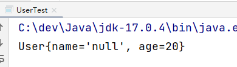


# 手写Spring框架

Spring IoC容器的实现原理：工厂模式 + 解析XML + 反射机制。

## 第一步：创建模块myimg/Spring

采用Maven方式新建Module：myimg/Spring

打包方式采用jar，并且引入dom4j和jaxen的依赖，因为要使用它解析XML文件，还有junit依赖。
```xml
<?xml version="1.0" encoding="UTF-8"?>
<project xmlns="http://maven.apache.org/POM/4.0.0"
         xmlns:xsi="http://www.w3.org/2001/XMLSchema-instance"
         xsi:schemaLocation="http://maven.apache.org/POM/4.0.0 http://maven.apache.org/xsd/maven-4.0.0.xsd">
    <modelVersion>4.0.0</modelVersion>

    <groupId>org.myimg/Springframework</groupId>
    <artifactId>myimg/Spring</artifactId>
    <version>1.0.0</version>
    <packaging>jar</packaging>

    <dependencies>
        <dependency>
            <groupId>org.dom4j</groupId>
            <artifactId>dom4j</artifactId>
            <version>2.1.3</version>
        </dependency>
        <dependency>
            <groupId>jaxen</groupId>
            <artifactId>jaxen</artifactId>
            <version>1.2.0</version>
        </dependency>
        <dependency>
            <groupId>junit</groupId>
            <artifactId>junit</artifactId>
            <version>4.13.2</version>
            <scope>test</scope>
        </dependency>
    </dependencies>

    <properties>
        <maven.compiler.source>17</maven.compiler.source>
        <maven.compiler.target>17</maven.compiler.target>
    </properties>

</project>
```


## 第二步：准备好我们要管理的Bean
准备好我们要管理的Bean（**这些Bean在将来开发完框架之后是要删除的**）
注意包名，不要用org.myimg/Springframework包，因为这些Bean不是框架内置的。是将来使用我们框架的程序员提供的。
```java
package com.powernode.myimg/Spring.bean;

/**
 * @author 动力节点
 * @version 1.0
 * @className Address
 * @since 1.0
 **/
public class Address {
    private String city;
    private String street;
    private String zipcode;

    public Address() {
    }

    public String getCity() {
        return city;
    }

    public void setCity(String city) {
        this.city = city;
    }

    public String getStreet() {
        return street;
    }

    public void setStreet(String street) {
        this.street = street;
    }

    public String getZipcode() {
        return zipcode;
    }

    public void setZipcode(String zipcode) {
        this.zipcode = zipcode;
    }

    @Override
    public String toString() {
        return "Address{" +
                "city='" + city + '\'' +
                ", street='" + street + '\'' +
                ", zipcode='" + zipcode + '\'' +
                '}';
    }
}

```
```java
package com.powernode.myimg/Spring.bean;

/**
 * @author 动力节点
 * @version 1.0
 * @className User
 * @since 1.0
 **/
public class User {
    private String name;
    private int age;
    private Address addr;

    public User() {
    }

    public String getName() {
        return name;
    }

    public void setName(String name) {
        this.name = name;
    }

    public int getAge() {
        return age;
    }

    public void setAge(int age) {
        this.age = age;
    }

    public Address getAddr() {
        return addr;
    }

    public void setAddr(Address addr) {
        this.addr = addr;
    }

    @Override
    public String toString() {
        return "User{" +
                "name='" + name + '\'' +
                ", age=" + age +
                ", addr=" + addr +
                '}';
    }
}

```


## 第三步：准备myimg/Spring.xml配置文件
将来在框架开发完毕之后，这个文件也是要删除的。因为这个配置文件的提供者应该是使用这个框架的程序员。
文件名随意，我们这里叫做：myimg/Spring.xml
文件放在类路径当中即可，我们这里把文件放到类的根路径下。
```xml
<?xml version="1.0" encoding="UTF-8"?>
<beans>

    <bean id="userBean" class="com.powernode.myimg/Spring.bean.User">
        <property name="name" value="张三"/>
        <property name="age" value="20"/>
        <property name="addr" ref="addrBean"/>
    </bean>
    
    <bean id="addrBean" class="com.powernode.myimg/Spring.bean.Address">
        <property name="city" value="北京"/>
        <property name="street" value="大兴区"/>
        <property name="zipcode" value="1000001"/>
    </bean>

</beans>
```
使用value给简单属性赋值。使用ref给非简单属性赋值。


## 第四步：编写ApplicationContext接口
ApplicationContext接口中提供一个getBean()方法，通过该方法可以获取Bean对象。
注意包名：这个接口就是myimg/Spring框架中的一员了。
```java
package org.myimg/Springframework.core;

/**
 * @author 动力节点
 * @version 1.0
 * @className ApplicationContext
 * @since 1.0
 **/
public interface ApplicationContext {
    /**
     * 根据bean的id获取bean实例。
     * @param beanId bean的id
     * @return bean实例
     */
    Object getBean(String beanId);
}

```


## 第五步：编写ClassPathXmlApplicationContext
ClassPathXmlApplicationContext是ApplicationContext接口的实现类。该类从类路径当中加载myimg/Spring.xml配置文件。
```java
package org.myimg/Springframework.core;

/**
 * @author 动力节点
 * @version 1.0
 * @className ClassPathXmlApplicationContext
 * @since 1.0
 **/
public class ClassPathXmlApplicationContext implements ApplicationContext{
    @Override
    public Object getBean(String beanId) {
        return null;
    }
}

```


## 第六步：确定采用Map集合存储Bean
确定采用Map集合存储Bean实例。Map集合的key存储beanId，value存储Bean实例。Map<String,Object>
在ClassPathXmlApplicationContext类中添加Map<String,Object>属性。
并且在ClassPathXmlApplicationContext类中添加构造方法，该构造方法的参数接收myimg/Spring.xml文件。
同时实现getBean方法。
```java
package org.myimg/Springframework.core;

import java.util.HashMap;
import java.util.Map;

/**
 * @author 动力节点
 * @version 1.0
 * @className ClassPathXmlApplicationContext
 * @since 1.0
 **/
public class ClassPathXmlApplicationContext implements ApplicationContext{
    /**
     * 存储bean的Map集合
     */
    private Map<String,Object> beanMap = new HashMap<>();

    /**
     * 在该构造方法中，解析myimg/Spring.xml文件，创建所有的Bean实例，并将Bean实例存放到Map集合中。
     * @param resource 配置文件路径（要求在类路径当中）
     */
    public ClassPathXmlApplicationContext(String resource) {

    }

    @Override
    public Object getBean(String beanId) {
        return beanMap.get(beanId);
    }
}

```


## 第七步：解析配置文件实例化所有Bean
在ClassPathXmlApplicationContext的构造方法中解析配置文件，获取所有bean的类名，通过反射机制调用无参数构造方法创建Bean。并且将Bean对象存放到Map集合中。
```java
/**
* 在该构造方法中，解析myimg/Spring.xml文件，创建所有的Bean实例，并将Bean实例存放到Map集合中。
* @param resource 配置文件路径（要求在类路径当中）
*/
public ClassPathXmlApplicationContext(String resource) {
    try {
        SAXReader reader = new SAXReader();
        Document document = reader.read(ClassLoader.getSystemClassLoader().getResourceAsStream(resource));
        // 获取所有的bean标签
        List<Node> beanNodes = document.selectNodes("//bean");
        // 遍历集合
        beanNodes.forEach(beanNode -> {
            Element beanElt = (Element) beanNode;
            // 获取id
            String id = beanElt.attributeValue("id");
            // 获取className
            String className = beanElt.attributeValue("class");
            try {
                // 通过反射机制创建对象
                Class<?> clazz = Class.forName(className);
                Constructor<?> defaultConstructor = clazz.getDeclaredConstructor();
                Object bean = defaultConstructor.newInstance();
                // 存储到Map集合
                beanMap.put(id, bean);
            } catch (Exception e) {
                e.printStackTrace();
            }
        });
    } catch (Exception e) {
        e.printStackTrace();
    }
}
```


## 第八步：测试能否获取到Bean
编写测试程序。
```java
package com.powernode.myimg/Spring.test;

import org.junit.Test;
import org.myimg/Springframework.core.ApplicationContext;
import org.myimg/Springframework.core.ClassPathXmlApplicationContext;

/**
 * @author 动力节点
 * @version 1.0
 * @className MySpringTest
 * @since 1.0
 **/
public class MySpringTest {
    @Test
    public void testMySpring(){
        ApplicationContext applicationContext = new ClassPathXmlApplicationContext("myimg/Spring.xml");
        Object userBean = applicationContext.getBean("userBean");
        Object addrBean = applicationContext.getBean("addrBean");
        System.out.println(userBean);
        System.out.println(addrBean);
    }
}

```
执行结果：

通过测试Bean已经实例化成功了，属性的值是null，这是我们能够想到的，毕竟我们调用的是无参数构造方法，所以属性都是默认值。
下一步就是我们应该如何给Bean的属性赋值呢？


## 第九步：给Bean的属性赋值
通过反射机制调用set方法，给Bean的属性赋值。
继续在ClassPathXmlApplicationContext构造方法中编写代码。
```java
package org.myimg/Springframework.core;

import org.dom4j.Document;
import org.dom4j.Element;
import org.dom4j.Node;
import org.dom4j.io.SAXReader;

import java.lang.reflect.Constructor;
import java.lang.reflect.Method;
import java.util.HashMap;
import java.util.List;
import java.util.Map;

/**
 * @author 动力节点
 * @version 1.0
 * @className ClassPathXmlApplicationContext
 * @since 1.0
 **/
public class ClassPathXmlApplicationContext implements ApplicationContext{
    /**
     * 存储bean的Map集合
     */
    private Map<String,Object> beanMap = new HashMap<>();

    /**
     * 在该构造方法中，解析myimg/Spring.xml文件，创建所有的Bean实例，并将Bean实例存放到Map集合中。
     * @param resource 配置文件路径（要求在类路径当中）
     */
    public ClassPathXmlApplicationContext(String resource) {
        try {
            SAXReader reader = new SAXReader();
            Document document = reader.read(ClassLoader.getSystemClassLoader().getResourceAsStream(resource));
            // 获取所有的bean标签
            List<Node> beanNodes = document.selectNodes("//bean");
            // 遍历集合（这里的遍历只实例化Bean，不给属性赋值。为什么要这样做？）
            beanNodes.forEach(beanNode -> {
                Element beanElt = (Element) beanNode;
                // 获取id
                String id = beanElt.attributeValue("id");
                // 获取className
                String className = beanElt.attributeValue("class");
                try {
                    // 通过反射机制创建对象
                    Class<?> clazz = Class.forName(className);
                    Constructor<?> defaultConstructor = clazz.getDeclaredConstructor();
                    Object bean = defaultConstructor.newInstance();
                    // 存储到Map集合
                    beanMap.put(id, bean);
                } catch (Exception e) {
                    e.printStackTrace();
                }
            });
            // 再重新遍历集合，这次遍历是为了给Bean的所有属性赋值。
            // 思考：为什么不在上面的循环中给Bean的属性赋值，而在这里再重新遍历一次呢？
            // 通过这里你是否能够想到Spring是如何解决循环依赖的：实例化和属性赋值分开。
            beanNodes.forEach(beanNode -> {
                Element beanElt = (Element) beanNode;
                // 获取bean的id
                String beanId = beanElt.attributeValue("id");
                // 获取所有property标签
                List<Element> propertyElts = beanElt.elements("property");
                // 遍历所有属性
                propertyElts.forEach(propertyElt -> {
                    try {
                        // 获取属性名
                        String propertyName = propertyElt.attributeValue("name");
                        // 获取属性类型
                        Class<?> propertyType = beanMap.get(beanId).getClass().getDeclaredField(propertyName).getType();
                        // 获取set方法名
                        String setMethodName = "set" + propertyName.toUpperCase().charAt(0) + propertyName.substring(1);
                        // 获取set方法
                        Method setMethod = beanMap.get(beanId).getClass().getDeclaredMethod(setMethodName, propertyType);
                        // 获取属性的值，值可能是value，也可能是ref。
                        // 获取value
                        String propertyValue = propertyElt.attributeValue("value");
                        // 获取ref
                        String propertyRef = propertyElt.attributeValue("ref");
                        Object propertyVal = null;
                        if (propertyValue != null) {
                            // 该属性是简单属性
                            String propertyTypeSimpleName = propertyType.getSimpleName();
                            switch (propertyTypeSimpleName) {
                                case "byte": case "Byte":
                                    propertyVal = Byte.valueOf(propertyValue);
                                    break;
                                case "short": case "Short":
                                    propertyVal = Short.valueOf(propertyValue);
                                    break;
                                case "int": case "Integer":
                                    propertyVal = Integer.valueOf(propertyValue);
                                    break;
                                case "long": case "Long":
                                    propertyVal = Long.valueOf(propertyValue);
                                    break;
                                case "float": case "Float":
                                    propertyVal = Float.valueOf(propertyValue);
                                    break;
                                case "double": case "Double":
                                    propertyVal = Double.valueOf(propertyValue);
                                    break;
                                case "boolean": case "Boolean":
                                    propertyVal = Boolean.valueOf(propertyValue);
                                    break;
                                case "char": case "Character":
                                    propertyVal = propertyValue.charAt(0);
                                    break;
                                case "String":
                                    propertyVal = propertyValue;
                                    break;
                            }
                            setMethod.invoke(beanMap.get(beanId), propertyVal);
                        }
                        if (propertyRef != null) {
                            // 该属性不是简单属性
                            setMethod.invoke(beanMap.get(beanId), beanMap.get(propertyRef));
                        }
                    } catch (Exception e) {
                        e.printStackTrace();
                    }
                });
            });

        } catch (Exception e) {
            e.printStackTrace();
        }
    }

    @Override
    public Object getBean(String beanId) {
        return beanMap.get(beanId);
    }
}

```
重点处理：当property标签中是value怎么办？是ref怎么办？
执行测试程序：


## 第十步：打包发布
将多余的类以及配置文件删除，使用maven打包发布。


## 第十一步：站在程序员角度使用myimg/Spring框架
新建模块：myimg/Spring-test

引入myimg/Spring框架的依赖：
```xml
<?xml version="1.0" encoding="UTF-8"?>
<project xmlns="http://maven.apache.org/POM/4.0.0"
         xmlns:xsi="http://www.w3.org/2001/XMLSchema-instance"
         xsi:schemaLocation="http://maven.apache.org/POM/4.0.0 http://maven.apache.org/xsd/maven-4.0.0.xsd">
    <modelVersion>4.0.0</modelVersion>

    <groupId>com.powernode</groupId>
    <artifactId>myimg/Spring-test</artifactId>
    <version>1.0-SNAPSHOT</version>
    <packaging>jar</packaging>

    <dependencies>
        <dependency>
            <groupId>org.myimg/Springframework</groupId>
            <artifactId>myimg/Spring</artifactId>
            <version>1.0.0</version>
        </dependency>
        <dependency>
            <groupId>junit</groupId>
            <artifactId>junit</artifactId>
            <version>4.13.2</version>
            <scope>test</scope>
        </dependency>
    </dependencies>

    <properties>
        <maven.compiler.source>17</maven.compiler.source>
        <maven.compiler.target>17</maven.compiler.target>
    </properties>

</project>
```
编写Bean
```java
package com.powernode.myimg/Spring.bean;

/**
 * @author 动力节点
 * @version 1.0
 * @className UserDao
 * @since 1.0
 **/
public class UserDao {
    public void insert(){
        System.out.println("UserDao正在插入数据");
    }
}

```
```java
package com.powernode.myimg/Spring.bean;

/**
 * @author 动力节点
 * @version 1.0
 * @className UserService
 * @since 1.0
 **/
public class UserService {
    private UserDao userDao;

    public void setUserDao(UserDao userDao) {
        this.userDao = userDao;
    }

    public void save(){
        System.out.println("UserService开始执行save操作");
        userDao.insert();
        System.out.println("UserService执行save操作结束");
    }
}

```
编写myimg/Spring.xml文件
```xml
<?xml version="1.0" encoding="UTF-8"?>

<beans>

    <bean id="userServiceBean" class="com.powernode.myimg/Spring.bean.UserService">
        <property name="userDao" ref="userDaoBean"/>
    </bean>

    <bean id="userDaoBean" class="com.powernode.myimg/Spring.bean.UserDao"/>

</beans>
```
编写测试程序
```java
package com.powernode.myimg/Spring.test;

import com.powernode.myimg/Spring.bean.UserService;
import org.junit.Test;
import org.myimg/Springframework.core.ApplicationContext;
import org.myimg/Springframework.core.ClassPathXmlApplicationContext;

/**
 * @author 动力节点
 * @version 1.0
 * @className MySpringTest
 * @since 1.0
 **/
public class MySpringTest {

    @Test
    public void testMySpring(){
        ApplicationContext applicationContext = new ClassPathXmlApplicationContext("myimg/Spring.xml");
        UserService userServiceBean = (UserService) applicationContext.getBean("userServiceBean");
        userServiceBean.save();
    }
}

```
执行结果


# Spring IoC注解式开发

## 回顾注解

注解的存在主要是为了简化XML的配置。**Spring6倡导全注解开发**。

**注解定义：**

```java
@Target(value = {ElementType.TYPE})
@Retention(value = RetentionPolicy.RUNTIME)
public @interface Component {
    String value();
}
```
以上是自定义了一个注解：Component

该注解上面修饰的注解包括：Target注解和Retention注解，这两个注解被称为元注解。

Target注解用来设置Component注解可以出现的位置，以上代表表示Component注解只能用在类和接口上。

Retention注解用来设置Component注解的保持性策略，以上代表Component注解可以被反射机制读取。

String value(); 是Component注解中的一个属性。该属性类型String，属性名是value。

**注解使用：**

```java
@Component(value = "userBean")
public class User {
}

```
语法格式：@注解类型名(属性名=属性值, 属性名=属性值, 属性名=属性值......)

另外如果属性名是value，则在使用的时候可以省略属性名：

```java
@Component("userBean")
public class User {
}

```
**通过反射机制读取注解：**

获取包内有@Component注解的类，并反射创建对象：

```java
public class Test {
    public static void main(String[] args) throws Exception {
        // 存放Bean的Map集合。key存储beanId。value存储Bean。
        Map<String,Object> beanMap = new HashMap<>();

        String packageName = "com.powernode.bean";
        String path = packageName.replaceAll("\\.", "/");
        URL url = ClassLoader.getSystemClassLoader().getResource(path);
        File file = new File(url.getPath());
        File[] files = file.listFiles();
        Arrays.stream(files).forEach(f -> {
            String className = packageName + "." + f.getName().split("\\.")[0];
            try {
                Class<?> clazz = Class.forName(className);
                if (clazz.isAnnotationPresent(Component.class)) {
                    Component component = clazz.getAnnotation(Component.class);
                    String beanId = component.value();
                    Object bean = clazz.newInstance();
                    beanMap.put(beanId, bean);
                }
            } catch (Exception e) {
                e.printStackTrace();
            }
        });

        System.out.println(beanMap);
    }
}
```


##  声明Bean的注解

负责声明Bean的注解，常见的包括四个：

- @Component
- @Controller
- @Service
- @Repository

源码如下：
```java
@Target(value = {ElementType.TYPE})
@Retention(value = RetentionPolicy.RUNTIME)
public @interface Component {
    String value();
}

```
```java
@Target({ElementType.TYPE})
@Retention(RetentionPolicy.RUNTIME)
@Documented
@Component
public @interface Controller {
    @AliasFor(
        annotation = Component.class
    )
    String value() default "";
}

```
```java
@Target({ElementType.TYPE})
@Retention(RetentionPolicy.RUNTIME)
@Documented
@Component
public @interface Service {
    @AliasFor(
        annotation = Component.class
    )
    String value() default "";
}

```
```java
@Target({ElementType.TYPE})
@Retention(RetentionPolicy.RUNTIME)
@Documented
@Component
public @interface Repository {
    @AliasFor(
        annotation = Component.class
    )
    String value() default "";
}

```
通过源码可以看到，**@Controller、@Service、@Repository这三个注解都是@Component注解的别名**。
也就是说：这四个注解的功能都一样。用哪个都可以。

- 控制器类上使用：Controller
- service类上使用：Service
- dao类上使用：Repository

他们都是只有一个value属性。value属性用来指定bean的id，也就是bean的名字。

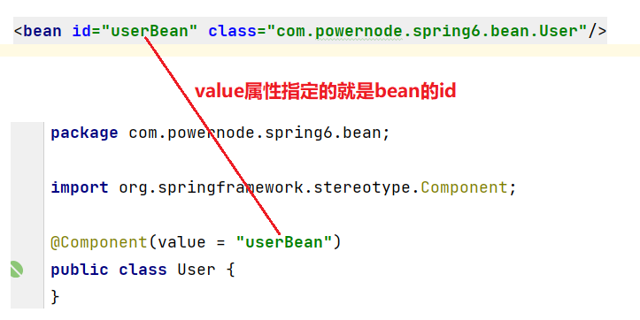


## Spring注解的使用

**第一步：加入aop的依赖**
可以看到当加入img/Spring-context依赖之后，会关联加入aop的依赖。


**第二步：在配置文件中添加context命名空间**

**第三步：在配置文件中指定要扫描的包**
```xml
<?xml version="1.0" encoding="UTF-8"?>
<beans xmlns="http://www.img/Springframework.org/schema/beans"
       xmlns:xsi="http://www.w3.org/2001/XMLSchema-instance"
       xmlns:context="http://www.img/Springframework.org/schema/context"
       xsi:schemaLocation="http://www.img/Springframework.org/schema/beans http://www.img/Springframework.org/schema/beans/img/Spring-beans.xsd
                           http://www.img/Springframework.org/schema/context http://www.img/Springframework.org/schema/context/img/Spring-context.xsd">
    <context:component-scan base-package="com.powernode.img/Spring6.bean"/>
</beans>
```
**第四步：在Bean类上使用注解**
```java
package com.powernode.img/Spring6.bean;

import org.img/Springframework.stereotype.Component;

@Component(value = "userBean")
public class User {
}

```
编写测试程序：
```java
public class AnnotationTest {
    @Test
    public void testBean(){
        ApplicationContext applicationContext = new ClassPathXmlApplicationContext("img/Spring.xml");
        User userBean = applicationContext.getBean("userBean", User.class);
        System.out.println(userBean);
    }
}

```
执行结果：

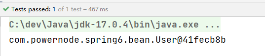

**如果注解的属性名是value，那么value是可以省略的。**

如果把value属性彻底去掉即只写`@Component`，img/Spring会给Bean自动取名，默认是类名首字母小写。

也就是说，这个BankDao的bean的名字为：bankDao


**如果是多个包怎么配置：**

- **第一种：在配置文件中指定多个包，用逗号隔开。**
  - `<context:component-scan base-package="com.powernode.img/Spring6.bean,com.powernode.img/Spring6.bean2"/>`

- **第二种：指定多个包的共同父包。**
  - `<context:component-scan base-package="com.powernode.img/Spring6"/>`


##  选择性实例化Bean

假设在某个包下有很多Bean，有的Bean上标注了Component，有的标注了Controller，有的标注了Service，有的标注了Repository，现在由于某种特殊业务的需要，只允许其中所有的Controller参与Bean管理，其他的都不实例化：
```java
@Component
public class A {
    public A() {
        System.out.println("A的无参数构造方法执行");
    }
}

@Controller
class B {
    public B() {
        System.out.println("B的无参数构造方法执行");
    }
}

@Service
class C {
    public C() {
        System.out.println("C的无参数构造方法执行");
    }
}

@Repository
class D {
    public D() {
        System.out.println("D的无参数构造方法执行");
    }
}

@Controller
class E {
    public E() {
        System.out.println("E的无参数构造方法执行");
    }
}

@Controller
class F {
    public F() {
        System.out.println("F的无参数构造方法执行");
    }
}

```
配置文件这样写：
```xml
<context:component-scan base-package="com.powernode.img/Spring6.bean3" use-default-filters="false">
    <context:include-filter type="annotation" expression="org.img/Springframework.stereotype.Controller"/>
</context:component-scan>
```
use-default-filters="true" 表示：使用img/Spring默认的规则，只要有Component、Controller、Service、Repository中的任意一个注解标注，则进行实例化。
**use-default-filters="false"** 表示：不再img/Spring默认实例化规则，即使有Component、Controller、Service、Repository这些注解标注，也不再实例化。
`<context:include-filter type="annotation" expression="org.img/Springframework.stereotype.Controller"/> ` 表示只有Controller进行实例化。

```java
@Test
public void testChoose(){
    ApplicationContext applicationContext = new ClassPathXmlApplicationContext("img/Spring-choose.xml");
}
```
执行结果：
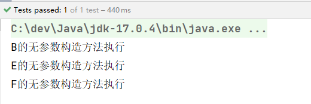
也可以将use-default-filters设置为true（不写就是true)，并且采用exclude-filter方式排出哪些注解标注的Bean不参与实例化：

```xml
<context:component-scan base-package="com.powernode.img/Spring6.bean3">
  <context:exclude-filter type="annotation" expression="org.img/Springframework.stereotype.Repository"/>
  <context:exclude-filter type="annotation" expression="org.img/Springframework.stereotype.Service"/>
  <context:exclude-filter type="annotation" expression="org.img/Springframework.stereotype.Controller"/>
</context:component-scan>
```
执行测试程序：

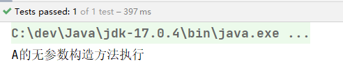


##  负责注入的注解

给Bean属性赋值需要用到这些注解：

- @Value
- @Autowired
- @Qualifier
- @Resource

### `@Value`

当属性的类型是简单类型时，可以使用@Value注解进行注入。
```java
@Component
public class User {
    @Value(value = "zhangsan")
    private String name;
    @Value("20")
    private int age;

    @Override
    public String toString() {
        return "User{" +
                "name='" + name + '\'' +
                ", age=" + age +
                '}';
    }
}

```
开启包扫描：
```xml
<context:component-scan base-package="com.powernode.img/Spring6.bean4"/>
```
```java
@Test
public void testValue(){
    ApplicationContext applicationContext = new ClassPathXmlApplicationContext("img/Spring-injection.xml");
    Object user = applicationContext.getBean("user");
    System.out.println(user);
}
```
执行结果：

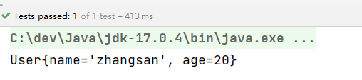

没有给属性提供setter方法，但仍然可以完成属性赋值。

如果提供setter方法，并且在setter方法上添加@Value注解，同样可以完成注入：

```java
@Component
public class User {
    
    private String name;
    private int age;

    @Value("李四")
    public void setName(String name) {
        this.name = name;
    }

    @Value("30")
    public void setAge(int age) {
        this.age = age;
    }

    @Override
    public String toString() {
        return "User{" +
                "name='" + name + '\'' +
                ", age=" + age +
                '}';
    }
}

```
执行结果：


为了简化代码，以后我们一般不提供setter方法，直接在属性上使用@Value注解完成属性赋值。

还可以通过构造方法完成注入：

```java
@Component
public class User {

    private String name;
    private int age;

    public User(@Value("隔壁老王") String name, @Value("33") int age) {
        this.name = name;
        this.age = age;
    }

    @Override
    public String toString() {
        return "User{" +
                "name='" + name + '\'' +
                ", age=" + age +
                '}';
    }
}

```
执行结果：


### `@Autowired`与`@Qualifier`

@Autowired注解可以用来注入**非简单类型**。
单独使用@Autowired注解，**默认根据类型装配**（=byType）。
它的源码：

```java
@Target({ElementType.CONSTRUCTOR, ElementType.METHOD, ElementType.PARAMETER, ElementType.FIELD, ElementType.ANNOTATION_TYPE})
@Retention(RetentionPolicy.RUNTIME)
@Documented
public @interface Autowired {
	boolean required() default true;
}
```

- 该注解标注位置：
   - 构造方法上
   - 方法上
   - 形参上
   - 属性上
   - 注解上
- 该注解有一个required属性，默认值是true，表示在注入的时候要求被注入的Bean必须是存在的，如果不存在则报错。如果required属性设置为false，表示注入的Bean存在或者不存在都没关系，存在的话就注入，不存在的话，也不报错。

**在属性上使用@Autowired注解：**

```java
public interface UserDao {
    void insert();
}

```
```java
@Repository //纳入bean管理
public class UserDaoForMySQL implements UserDao{
    @Override
    public void insert() {
        System.out.println("正在向mysql数据库插入User数据");
    }
}

```
```java
@Service // 纳入bean管理
public class UserService {

    @Autowired // 在属性上注入
    private UserDao userDao;
    
    // 没有提供构造方法和setter方法。

    public void save(){
        userDao.insert();
    }
}
```
```xml
<context:component-scan base-package="com.powernode.img/Spring6.dao,com.powernode.img/Spring6.service"/>
```
```java
@Test
public void testAutowired(){
    ApplicationContext applicationContext = new ClassPathXmlApplicationContext("img/Spring-injection.xml");
    UserService userService = applicationContext.getBean("userService", UserService.class);
    userService.save();
}
```
执行结果：


以上构造方法和setter方法都没有提供，仍然可以注入成功。
@Autowired注解出现在setter方法、构造方法上都是可以成功注入的。

```java
@Autowired
public void setUserDao(UserDao userDao) {
    this.userDao = userDao;
}

```
```java
@Autowired
public UserService(UserDao userDao) {
    this.userDao = userDao;
}

```
注解也可以只标注在构造方法的形参上

```java
public UserService(@Autowired UserDao userDao) {
    this.userDao = userDao;
}

```
当有参数的构造方法只有一个时，@Autowired注解可以省略：

```java
public UserService(UserDao userDao) {
    this.userDao = userDao;
}

```
但是如果有多个构造方法，@Autowired不能省略。


**@Qualifier注解**

如果以上程序中，UserDao接口还有另外一个实现类，会出现问题：

```java
package com.powernode.img/Spring6.dao;

import org.img/Springframework.stereotype.Repository;

@Repository //纳入bean管理
public class UserDaoForOracle implements UserDao{
    @Override
    public void insert() {
        System.out.println("正在向Oracle数据库插入User数据");
    }
}

```


报错：不能装配，UserDao这个Bean的数量大于1.
解决：@Autowired注解和@Qualifier注解联合起来才可以根据名称进行装配，在@Qualifier注解中指定Bean名称。

```java
@Autowired
@Qualifier("userDaoForOracle") // 这个是bean的名字。
public void setUserDao(UserDao userDao) {
    this.userDao = userDao;
}

```
执行结果：


###  `@Resource`

@Resource注解也可以完成非简单类型注入。它和@Autowired注解的区别：

- @Resource注解是JDK扩展包中的，也就是说属于JDK的一部分。所以该注解是标准注解，更加具有通用性。
- @Autowired注解是Spring框架自己的。
- **@Resource注解默认根据名称装配byName，未指定name时，使用属性名作为name。通过name找不到的话会自动启动通过类型byType装配。**
- **@Autowired注解默认根据类型装配byType，如果想根据名称装配，需要配合@Qualifier注解一起用。**
- @Resource注解用在属性上、setter方法上。
- @Autowired注解用在属性上、setter方法上、构造方法上、构造方法参数上。

@Resource注解属于JDK扩展包，所以不在JDK当中，需要额外引入以下依赖：【**如果是JDK8的话不需要额外引入依赖。高于JDK11或低于JDK8需要引入以下依赖。**】
```xml
<dependency>
  <groupId>jakarta.annotation</groupId>
  <artifactId>jakarta.annotation-api</artifactId>
  <version>2.1.1</version>
</dependency>
```
注意：**Spring6不再支持JavaEE，它支持的是JakartaEE9。（Oracle把JavaEE贡献给Apache了，Apache把JavaEE的名字改成JakartaEE了，所以之前所接触的所有的  javax.*  包名统一修改为  jakarta.*包名了。）**

@Resource注解的源码如下：


测试一下：

```java
@Repository("xyz")
public class UserDaoForOracle implements UserDao{
    @Override
    public void insert() {
        System.out.println("正在向Oracle数据库插入User数据");
    }
}
```
```java
@Service
public class UserService {

    @Resource(name = "xyz")
    private UserDao userDao;

    public void save(){
        userDao.insert();
    }
}
```
执行测试程序：


**把UserDaoForOracle的名字xyz修改为userDao，让这个Bean的名字和UserService类中的UserDao属性名一致：**

```java
@Repository("userDao")
public class UserDaoForOracle implements UserDao{
    @Override
    public void insert() {
        System.out.println("正在向Oracle数据库插入User数据");
    }
}

```
```java
@Service
public class UserService {

    @Resource
    private UserDao userDao;

    public void save(){
        userDao.insert();
    }
}

```
执行测试程序：


通过测试得知，当@Resource注解使用时没有指定name的时候，还是根据name进行查找，这个name是属性名。

把UserService类中的属性名修改一下：

```java
@Service
public class UserService {

    @Resource
    private UserDao userDao2;

    public void save(){
        userDao2.insert();
    }
}

```
执行结果：

根据异常信息得知：当通过name找不到的时候，自然会启动byType进行注入。以上的错误是因为UserDao接口下有两个实现类导致的。所以根据类型注入就会报错。
@Resource注解也可以使用在setter方法上：

```java
@Service
public class UserService {

    private UserDao userDao;

    @Resource
    public void setUserDao(UserDao userDao) {
        this.userDao = userDao;
    }

    public void save(){
        userDao.insert();
    }
}

```
这个setter方法的方法名setUserDao去掉set之后，将首字母变小写userDao，userDao就是name

执行结果：


也可以指定name：

```java
@Service
public class UserService {

    private UserDao userDao;

    @Resource(name = "userDaoForMySQL")
    public void setUserDao(UserDao userDao) {
        this.userDao = userDao;
    }

    public void save(){
        userDao.insert();
    }
}

```
执行结果：


一句话总结@Resource注解：默认byName注入，没有指定name时把属性名当做name，根据name找不到时，才会byType注入。byType注入时，某种类型的Bean只能有一个。


## 全注解式开发

全注解开发就是不再使用img/Spring配置文件了。**写一个配置类来代替配置文件**。
```java
@Configuration
@ComponentScan({"com.powernode.img/Spring6.dao", "com.powernode.img/Spring6.service"})
public class Spring6Configuration {
}

```
编写测试程序：不再new ClassPathXmlApplicationContext()对象了。
```java
@Test
public void testNoXml(){
    ApplicationContext applicationContext = new AnnotationConfigApplicationContext(Spring6Configuration.class);
    UserService userService = applicationContext.getBean("userService", UserService.class);
    userService.save();
}
```
执行结果：


# JdbcTemplate

JdbcTemplate是Spring提供的一个JDBC模板类，是对JDBC的封装，简化JDBC代码。

可以不用，让Spring集成其它的ORM框架如MyBatis、Hibernate等。


# GoF之代理模式

## 对代理模式的理解

代理模式是GoF23种设计模式之一。属于结构型设计模式。

代理模式的作用是：为其他对象提供一种代理以控制对这个对象的访问。在某些情况下，一个客户不想或者不能直接引用一个对象，此时可以通过一个称之为“代理”的第三者来实现间接引用。代理对象可以在客户端和目标对象之间起到中介的作用，并且可以通过代理对象去掉客户不应该看到的内容和服务或者添加客户需要的额外服务。 通过引入一个新的对象来实现对真实对象的操作或者将新的对象作为真实对象的一个替身，这种实现机制即为代理模式，通过引入代理对象来间接访问一个对象，这就是代理模式的模式动机。

代理模式中的角色：

- 代理类（代理主题）
- 目标类（真实主题）
- 代理类和目标类的公共接口（抽象主题）：客户端在使用代理类时就像在使用目标类，不被客户端所察觉，所以代理类和目标类要有共同的行为，也就是实现共同的接口。

代理模式的类图：


代理模式在代码实现上，包括两种形式：

- 静态代理
- 动态代理


## 静态代理

计算OrderService接口的实现类OrderServiceImpl 的每个方法的耗时。

```java
public interface OrderService {
    /**
     * 生成订单
     */
    void generate();

    /**
     * 查看订单详情
     */
    void detail();

    /**
     * 修改订单
     */
    void modify();
}

```

```java
public class OrderServiceProxy implements OrderService{ // 代理对象

    // 目标对象
    private OrderService orderService;

    // 通过构造方法将目标对象传递给代理对象
    public OrderServiceProxy(OrderService orderService) {
        this.orderService = orderService;
    }

    @Override
    public void generate() {
        long begin = System.currentTimeMillis();
        // 执行目标对象的目标方法
        orderService.generate();
        long end = System.currentTimeMillis();
        System.out.println("耗时"+(end - begin)+"毫秒");
    }

    @Override
    public void detail() {
        long begin = System.currentTimeMillis();
        // 执行目标对象的目标方法
        orderService.detail();
        long end = System.currentTimeMillis();
        System.out.println("耗时"+(end - begin)+"毫秒");
    }

    @Override
    public void modify() {
        long begin = System.currentTimeMillis();
        // 执行目标对象的目标方法
        orderService.modify();
        long end = System.currentTimeMillis();
        System.out.println("耗时"+(end - begin)+"毫秒");
    }
}

```
符合OCP开闭原则，同时采用的是关联关系，所以程序的耦合度较低。

客户端程序：

```java
public class Client {
    public static void main(String[] args) {
        // 创建目标对象
        OrderService target = new OrderServiceImpl();
        // 创建代理对象
        OrderService proxy = new OrderServiceProxy(target);
        // 调用代理对象的代理方法
        proxy.generate();
        proxy.modify();
        proxy.detail();
    }
}

```
运行结果：


静态代理，如果系统中业务接口很多，一个接口对应一个代理类，会导致类爆炸。


## 动态代理

在程序运行阶段，**在内存中动态生成代理类**，目的是为了减少代理类的数量。解决代码复用的问题。

在内存当中动态生成类的技术常见的包括：

- JDK动态代理技术：只能代理接口。
- CGLIB动态代理技术：CGLIB(Code Generation Library)是一个开源项目。是一个强大的，高性能，高质量的Code生成类库，它可以在运行期扩展Java类与实现Java接口。它既可以代理接口，又可以代理类，**底层是通过继承的方式实现的**。性能比JDK动态代理要好。**（底层有一个小而快的字节码处理框架ASM。）**
- Javassist动态代理技术：Javassist是一个开源的分析、编辑和创建Java字节码的类库。


### JDK动态代理

在静态代理的时候，除了以上一个接口和一个实现类之外，还要写一个代理类UserServiceProxy，在动态代理中UserServiceProxy代理类是可以动态生成的。

```java
public class Client {
    public static void main(String[] args) {
        // 第一步：创建目标对象
        OrderService target = new OrderServiceImpl();
        // 第二步：创建代理对象
        OrderService orderServiceProxy = Proxy.newProxyInstance(target.getClass().getClassLoader(), target.getClass().getInterfaces(), 调用处理器对象);
        // 第三步：调用代理对象的代理方法
        orderServiceProxy.detail();
        orderServiceProxy.modify();
        orderServiceProxy.generate();
    }
}
```
第二步这行代码做了两件事：

- 在内存中生成了代理类的字节码
- 创建代理对象

Proxy类全名：java.lang.reflect.Proxy。这是JDK提供的一个类，通过这个类在内存中生成代理类的字节码。

newProxyInstance()方法有三个参数：

- 第一个参数：类加载器。在内存中生成了字节码，要想执行这个字节码，也是需要先把这个字节码加载到内存当中的。所以要指定使用哪个类加载器加载。
- 第二个参数：接口类型。代理类和目标类实现相同的接口，所以要通过这个参数告诉JDK动态代理生成的类要实现哪些接口。
- 第三个参数：调用处理器。这是一个JDK动态代理规定的接口，接口全名：java.lang.reflect.InvocationHandler。这是一个回调接口。

实现java.lang.reflect.InvocationHandler接口：
```java
public class TimerInvocationHandler implements InvocationHandler {
    // 目标对象
    private Object target;

    // 通过构造方法来传目标对象
    public TimerInvocationHandler(Object target) {
        this.target = target;
    }

    @Override
    public Object invoke(Object proxy, Method method, Object[] args) throws Throwable {
        // 目标执行之前增强。
        long begin = System.currentTimeMillis();
        // 调用目标对象的目标方法
        Object retValue = method.invoke(target, args);
        // 目标执行之后增强。
        long end = System.currentTimeMillis();
        System.out.println("耗时"+(end - begin)+"毫秒");
        // 一定要记得返回哦。
        return retValue;
    }
}

```
InvocationHandler接口中有一个方法invoke，这个invoke方法上有三个参数：

- 第一个参数：Object proxy。代理对象。设计这个参数只是为了后期的方便，如果想在invoke方法中使用代理对象的话，尽管通过这个参数来使用。
- 第二个参数：Method method。目标方法。（要执行的目标方法）
- 第三个参数：Object[] args。目标方法调用时要传的参数。

继续完善Client程序：
```java
public class Client {
    public static void main(String[] args) {
        // 创建目标对象
        OrderService target = new OrderServiceImpl();
        // 创建代理对象
        OrderService orderServiceProxy = (OrderService) Proxy.newProxyInstance(target.getClass().getClassLoader(),
                                                                                target.getClass().getInterfaces(),
                                                                                new TimerInvocationHandler(target));
        // 调用代理对象的代理方法
        orderServiceProxy.detail();
        orderServiceProxy.modify();
        orderServiceProxy.generate();
    }
}

```
当调用代理对象（orderServiceProxy）的代理方法的时候，注册在InvocationHandler接口中的invoke()方法会被调用。

上面代码有点繁琐，提供一个工具类：ProxyUtil，封装一个方法：

```java
public class ProxyUtil {
    public static Object newProxyInstance(Object target) {
        return Proxy.newProxyInstance(target.getClass().getClassLoader(), 
                target.getClass().getInterfaces(), 
                new TimerInvocationHandler(target));
    }
}
```
修改测试代码：
```java
// 创建代理对象
OrderService orderServiceProxy = (OrderService) ProxyUtil.newProxyInstance(target);

```


###  CGLIB动态代理

CGLIB既可以代理接口，又可以代理类。底层采用**继承的方式实现**，所以被代理的目标类不能使用final修饰。

引入它的依赖：

```xml
<dependency>
  <groupId>cglib</groupId>
  <artifactId>cglib</artifactId>
  <version>3.3.0</version>
</dependency>
```
没有实现接口的类：
```java
public class UserService {

    public void login(){
        System.out.println("用户正在登录系统....");
    }

    public void logout(){
        System.out.println("用户正在退出系统....");
    }
}
```
使用CGLIB在内存中为UserService类生成代理类，并创建对象：
```java
public class Client {
    public static void main(String[] args) {
        // 创建字节码增强器
        Enhancer enhancer = new Enhancer();
        // 告诉cglib要继承哪个类
        enhancer.setSuperclass(UserService.class);
        // 设置回调接口
        enhancer.setCallback(方法拦截器对象);
        // 生成源码，编译class，加载到JVM，并创建代理对象
        UserService userServiceProxy = (UserService)enhancer.create();

        userServiceProxy.login();
        userServiceProxy.logout();

    }
}
```
和JDK动态代理原理差不多，在CGLIB中需要提供的不是InvocationHandler，而是：net.sf.cglib.proxy.MethodInterceptor

MethodInterceptor接口实现类：

```java
public class TimerMethodInterceptor implements MethodInterceptor {
    @Override
    public Object intercept(Object target, Method method, Object[] objects, MethodProxy methodProxy) throws Throwable {
        return null;
    }
}
```
MethodInterceptor接口中有一个方法intercept()，该方法有4个参数：

+ 第一个参数：目标对象
+ 第二个参数：目标方法
+ 第三个参数：目标方法调用时的实参
+ 第四个参数：代理方法

在MethodInterceptor的intercept()方法中调用目标以及添加增强：

```java
public class TimerMethodInterceptor implements MethodInterceptor {
    @Override
    public Object intercept(Object target, Method method, Object[] objects, MethodProxy methodProxy) throws Throwable {
        // 前增强
        long begin = System.currentTimeMillis();
        // 调用目标
        Object retValue = methodProxy.invokeSuper(target, objects);
        // 后增强
        long end = System.currentTimeMillis();
        System.out.println("耗时" + (end - begin) + "毫秒");
        // 一定要返回
        return retValue;
    }
}

```
修改客户端程序：
```java
// 设置回调接口
enhancer.setCallback(new TimerMethodInterceptor());

```
对于高版本的JDK，如果使用CGLIB，需要在启动项中添加两个启动参数：


- --add-opens java.base/java.lang=ALL-UNNAMED
- --add-opens java.base/sun.net.util=ALL-UNNAMED


# 面向切面编程AOP

IoC使软件组件松耦合。AOP使的能够捕捉系统中经常使用的功能，把它转化成组件。

AOP（Aspect Oriented Programming）：面向切面编程，面向方面编程。（AOP是一种编程技术）

AOP是对OOP的补充延伸。

AOP底层使用的就是动态代理来实现的。

Spring的AOP使用的动态代理是：JDK动态代理 + CGLIB动态代理技术。Spring在这两种动态代理中灵活切换，如果是代理接口，会默认使用JDK动态代理，如果要代理某个类，这个类没有实现接口，就会切换使用CGLIB。当然也可以通过配置让Spring只使用CGLIB。


## AOP介绍

一个系统当中会有一些系统服务，例如：日志、事务管理、安全等。这些系统服务被称为：**交叉业务**，这些**交叉业务**几乎是通用的。

如果在每一个业务处理过程当中，都掺杂这些交叉业务代码进去的话，存在两方面问题：

- 第一：交叉业务代码在多个业务流程中反复出现，交叉业务代码没有得到复用。并且修改这些交叉业务代码的话，需要修改多处。
- 第二：无法专注核心业务代码的编写，在编写核心业务代码的同时还需要处理这些交叉业务。

使用AOP可以很轻松的解决以上问题：


**AOP：将与核心业务无关的代码独立的抽取出来，形成一个独立的组件，然后以横向交叉的方式应用到业务流程当中。**

**优点：**

- **代码复用性增强。**
- **代码易维护。**
- **使开发者更关注业务逻辑。**


## AOP的七大术语

- **连接点 Joinpoint**
   - 本质是位置，在程序的整个执行流程中，**可以织入**切面的位置。方法的执行前后，异常抛出之后等位置。
- **切点 Pointcut**
   - 本质是方法，在程序执行流程中，**真正织入**切面的方法。（一个切点对应多个连接点）


- **通知 Advice**
   - 通知又叫增强，就是具体你要织入的代码，如日志代码、安全代码。通知描述的是代码。
   - 通知包括：
      - 前置通知：如只在do1()上面的连接点放代码
      - 后置通知：如只在do1()下面的连接点放代码
      - 环绕通知：如在do1()上下的连接点都放代码
      - 异常通知：通知代码放在catch块中
      - 最终通知：增强代码放在finally块中
- **切面 Aspect**
   - **切点 + 通知就是切面。**
- 织入 Weaving
   - 把通知应用到目标对象上的过程。
- 代理对象 Proxy
   - 一个目标对象被织入通知后产生的新对象。
- 目标对象 Target
   - 被织入通知的对象。


##  切点表达式

切点表达式用来定义通知（Advice）往哪些方法上切入。

切入点表达式语法格式：

```
execution([访问控制权限修饰符] 返回值类型 [全限定类名]方法名(形式参数列表) [异常])
```
> `[]`表示可选项


访问控制权限修饰符：

- 没写，就是4个权限都包括。
- 写public就表示只包括公开的方法。

返回值类型：

- `* `表示返回值类型任意。

全限定类名：

- `..`代表当前包以及子包下的所有类。
- 省略时表示所有的类。

方法名：

- `*`表示所有方法。
- `set*`表示所有的set方法。

形式参数列表：

- `()` 表示没有参数的方法
- `(..)` 参数类型和个数随意的方法
- `(*) `只有一个参数的方法
- `(*, String)` 第一个参数类型随意，第二个参数是String的。

异常：

- 省略时表示任意异常类型。


##  使用Spring的AOP

Spring对AOP的实现包括以下3种方式：

- **第一种方式：Spring框架结合AspectJ框架实现的AOP，基于注解方式。**
- **第二种方式：Spring框架结合AspectJ框架实现的AOP，基于XML方式。**
- 第三种方式：Spring框架自己实现的AOP，基于XML配置方式。

实际开发中，都是Spring+AspectJ来实现AOP。

AspectJ：Eclipse组织的一个支持AOP的框架。AspectJ框架是独立于Spring框架之外的一个框架，Spring框架用了AspectJ


### 准备工作

使用Spring+AspectJ的AOP需要引入`img/Spring context`、`img/Spring aop（在引入context时自动关联引入）`、`img/Spring aspects`的依赖。

在Spring配置文件中添加context命名空间和aop命名空间
```xml
<?xml version="1.0" encoding="UTF-8"?>
<beans xmlns="http://www.img/Springframework.org/schema/beans"
       xmlns:xsi="http://www.w3.org/2001/XMLSchema-instance"
       xmlns:context="http://www.img/Springframework.org/schema/context"
       xmlns:aop="http://www.img/Springframework.org/schema/aop"
       xsi:schemaLocation="http://www.img/Springframework.org/schema/beans http://www.img/Springframework.org/schema/beans/img/Spring-beans.xsd
                           http://www.img/Springframework.org/schema/context http://www.img/Springframework.org/schema/context/img/Spring-context.xsd
                           http://www.img/Springframework.org/schema/aop http://www.img/Springframework.org/schema/aop/img/Spring-aop.xsd">

</beans>
```


###  基于AspectJ的AOP注解式开发

#### 实现步骤
第一步：定义目标类以及目标方法
```java
// 目标类
public class OrderService {
    // 目标方法
    public void generate(){
        System.out.println("订单已生成！");
    }
}
```
第二步：定义切面类
```java
// 切面类
@Aspect
public class MyAspect {
}
```
第三步：目标类和切面类都添加@Component纳入img/Spring bean管理

第四步：在img/Spring配置文件中添加组建扫描

```xml
<beans xmlns="http://www.img/Springframework.org/schema/beans"
       xmlns:xsi="http://www.w3.org/2001/XMLSchema-instance"
       xmlns:context="http://www.img/Springframework.org/schema/context"
       xmlns:aop="http://www.img/Springframework.org/schema/aop"
       xsi:schemaLocation="http://www.img/Springframework.org/schema/beans http://www.img/Springframework.org/schema/beans/img/Spring-beans.xsd
                           http://www.img/Springframework.org/schema/context http://www.img/Springframework.org/schema/context/img/Spring-context.xsd
                           http://www.img/Springframework.org/schema/aop http://www.img/Springframework.org/schema/aop/img/Spring-aop.xsd">
    <!--开启组件扫描-->
    <context:component-scan base-package="com.powernode.img/Spring6.service"/>
</beans>
```
第五步：在切面类中添加通知和切点表达式
```java
// 切面类
@Aspect
@Component
public class MyAspect {
    
    // 切点表达式
    @Before("execution(* com.powernode.img/Spring6.service.OrderService.*(..))")
    // 这就是需要增强的代码（通知）
    public void advice(){
        System.out.println("我是一个通知");
    }
}
```
**注解@Before表示前置通知。**

第六步：在img/Spring配置文件中启用自动代理

```xml
<beans xmlns="http://www.img/Springframework.org/schema/beans"
       xmlns:xsi="http://www.w3.org/2001/XMLSchema-instance"
       xmlns:context="http://www.img/Springframework.org/schema/context"
       xmlns:aop="http://www.img/Springframework.org/schema/aop"
       xsi:schemaLocation="http://www.img/Springframework.org/schema/beans http://www.img/Springframework.org/schema/beans/img/Spring-beans.xsd
                           http://www.img/Springframework.org/schema/context http://www.img/Springframework.org/schema/context/img/Spring-context.xsd
                           http://www.img/Springframework.org/schema/aop http://www.img/Springframework.org/schema/aop/img/Spring-aop.xsd">
    <!--开启组件扫描-->
    <context:component-scan base-package="com.powernode.img/Spring6.service"/>
    <!--开启自动代理-->
    <!--开启自动代理之后，带有@Aspect注解的bean都会生成代理对象。-->
    <aop:aspectj-autoproxy proxy-target-class="true"/>
</beans>
```
proxy-target-class="true" 表示采用cglib动态代理。

proxy-target-class="false" 表示采用jdk动态代理。默认值是false。即使写成false，当没有接口的时候，也会自动选择cglib生成代理类。

测试程序：

```java
public class AOPTest {
    @Test
    public void testAOP(){
        ApplicationContext applicationContext = new ClassPathXmlApplicationContext("img/Spring-aspectj-aop-annotation.xml");
        OrderService orderService = applicationContext.getBean("orderService", OrderService.class);
        orderService.generate();
    }
}

```
运行结果：


#### 通知类型

通知类型包括：

- 前置通知：@Before 目标方法执行之前的通知
- 后置通知：@AfterReturning 目标方法执行之后的通知
- 环绕通知：@Around 目标方法之前添加通知，同时目标方法执行之后添加通知。
- 异常通知：@AfterThrowing 发生异常之后执行的通知
- 最终通知：@After 放在finally语句块中的通知


```java
// 切面类
@Component
@Aspect
public class MyAspect {

    @Around("execution(* com.powernode.img/Spring6.service.OrderService.*(..))")
    public void aroundAdvice(ProceedingJoinPoint proceedingJoinPoint) throws Throwable {
        System.out.println("环绕通知开始");
        // 执行目标方法。
        proceedingJoinPoint.proceed();
        System.out.println("环绕通知结束");
    }

    @Before("execution(* com.powernode.img/Spring6.service.OrderService.*(..))")
    public void beforeAdvice(){
        System.out.println("前置通知");
    }

    @AfterReturning("execution(* com.powernode.img/Spring6.service.OrderService.*(..))")
    public void afterReturningAdvice(){
        System.out.println("后置通知");
    }

    @AfterThrowing("execution(* com.powernode.img/Spring6.service.OrderService.*(..))")
    public void afterThrowingAdvice(){
        System.out.println("异常通知");
    }

    @After("execution(* com.powernode.img/Spring6.service.OrderService.*(..))")
    public void afterAdvice(){
        System.out.println("最终通知");
    }

}
```
```java
// 目标类
@Component
public class OrderService {
    // 目标方法
    public void generate(){
        System.out.println("订单已生成！");
    }
}

```
```java
public class AOPTest {
    @Test
    public void testAOP(){
        ApplicationContext applicationContext = new ClassPathXmlApplicationContext("img/Spring-aspectj-aop-annotation.xml");
        OrderService orderService = applicationContext.getBean("orderService", OrderService.class);
        orderService.generate();
    }
}
```
执行结果：


通过上面的执行结果就可以判断通知的执行顺序。

目标方法发生异常：

```java
// 目标类
@Component
public class OrderService {
    // 目标方法
    public void generate(){
        System.out.println("订单已生成！");
        if (1 == 1) {
            throw new RuntimeException("模拟异常发生");
        }
    }
}
```
结果如下：


当发生异常之后，最终通知也会执行，因为最终通知@After会出现在finally语句块中。

出现异常之后，**后置通知**和**环绕通知的结束部分**不会执行。


#### 切面的先后顺序
业务流程中有的切面控制事务，有的记录日志，有的进行安全控制，多个切面顺序如何控制：**可以使用@Order注解来标识切面类，为@Order注解的value指定一个整数型的数字，数字越小，优先级越高**。
```java
@Aspect
@Component
@Order(1) //设置优先级
public class YourAspect {

    @Around("execution(* com.powernode.img/Spring6.service.OrderService.*(..))")
    public void aroundAdvice(ProceedingJoinPoint proceedingJoinPoint) throws Throwable {
        System.out.println("YourAspect环绕通知开始");
        // 执行目标方法。
        proceedingJoinPoint.proceed();
        System.out.println("YourAspect环绕通知结束");
    }

    @Before("execution(* com.powernode.img/Spring6.service.OrderService.*(..))")
    public void beforeAdvice(){
        System.out.println("YourAspect前置通知");
    }

    @AfterReturning("execution(* com.powernode.img/Spring6.service.OrderService.*(..))")
    public void afterReturningAdvice(){
        System.out.println("YourAspect后置通知");
    }

    @AfterThrowing("execution(* com.powernode.img/Spring6.service.OrderService.*(..))")
    public void afterThrowingAdvice(){
        System.out.println("YourAspect异常通知");
    }

    @After("execution(* com.powernode.img/Spring6.service.OrderService.*(..))")
    public void afterAdvice(){
        System.out.println("YourAspect最终通知");
    }
}

```
```java
// 切面类
@Component
@Aspect
@Order(2) //设置优先级
public class MyAspect {

    @Around("execution(* com.powernode.img/Spring6.service.OrderService.*(..))")
    public void aroundAdvice(ProceedingJoinPoint proceedingJoinPoint) throws Throwable {
        System.out.println("环绕通知开始");
        // 执行目标方法。
        proceedingJoinPoint.proceed();
        System.out.println("环绕通知结束");
    }

    @Before("execution(* com.powernode.img/Spring6.service.OrderService.*(..))")
    public void beforeAdvice(){
        System.out.println("前置通知");
    }

    @AfterReturning("execution(* com.powernode.img/Spring6.service.OrderService.*(..))")
    public void afterReturningAdvice(){
        System.out.println("后置通知");
    }

    @AfterThrowing("execution(* com.powernode.img/Spring6.service.OrderService.*(..))")
    public void afterThrowingAdvice(){
        System.out.println("异常通知");
    }

    @After("execution(* com.powernode.img/Spring6.service.OrderService.*(..))")
    public void afterAdvice(){
        System.out.println("最终通知");
    }

}
```
执行测试程序：


#### 通用切点表达式

将切点表达式单独的定义出来，在需要的位置引入即可：
```java
// 切面类
@Component
@Aspect
@Order(2)
public class MyAspect {
    
    @Pointcut("execution(* com.powernode.img/Spring6.service.OrderService.*(..))")
    public void pointcut(){}

    @Around("pointcut()")
    public void aroundAdvice(ProceedingJoinPoint proceedingJoinPoint) throws Throwable {
        System.out.println("环绕通知开始");
        // 执行目标方法。
        proceedingJoinPoint.proceed();
        System.out.println("环绕通知结束");
    }

    @Before("pointcut()")
    public void beforeAdvice(){
        System.out.println("前置通知");
    }

    @AfterReturning("pointcut()")
    public void afterReturningAdvice(){
        System.out.println("后置通知");
    }

    @AfterThrowing("pointcut()")
    public void afterThrowingAdvice(){
        System.out.println("异常通知");
    }

    @After("pointcut()")
    public void afterAdvice(){
        System.out.println("最终通知");
    }

}

```
使用@Pointcut注解来定义独立的切点表达式。

跨类使用：`@Before("com.powernode.img/Spring6.service.LogAspect.通用切点()")`，写全类名。


#### 全注解式开发AOP
在类上面使用大量注解来代替img/Spring的配置文件：
```java
@Configuration // 代替img/Spring.xml
@ComponentScan("com.powernode.img/Spring6.service")
@EnableAspectJAutoProxy(proxyTargetClass = true)
public class Spring6Configuration {
}
```
测试程序：
```java
@Test
public void testAOPWithAllAnnotation(){
    ApplicationContext applicationContext = new AnnotationConfigApplicationContext(Spring6Configuration.class);
    OrderService orderService = applicationContext.getBean("orderService", OrderService.class);
    orderService.generate();
}
```


### 基于XML配置方式的AOP

了解即可

目标类：
```java
// 目标类
public class VipService {
    public void add(){
        System.out.println("保存vip信息。");
    }
}
```
切面类：
```java
// 负责计时的切面类
public class TimerAspect {
    
    public void time(ProceedingJoinPoint proceedingJoinPoint) throws Throwable {
        long begin = System.currentTimeMillis();
        //执行目标
        proceedingJoinPoint.proceed();
        long end = System.currentTimeMillis();
        System.out.println("耗时"+(end - begin)+"毫秒");
    }
}

```
img/Spring配置文件：
```xml
<beans xmlns="http://www.img/Springframework.org/schema/beans"
       xmlns:xsi="http://www.w3.org/2001/XMLSchema-instance"
       xmlns:context="http://www.img/Springframework.org/schema/context"
       xmlns:aop="http://www.img/Springframework.org/schema/aop"
       xsi:schemaLocation="http://www.img/Springframework.org/schema/beans http://www.img/Springframework.org/schema/beans/img/Spring-beans.xsd
                           http://www.img/Springframework.org/schema/context http://www.img/Springframework.org/schema/context/img/Spring-context.xsd
                           http://www.img/Springframework.org/schema/aop http://www.img/Springframework.org/schema/aop/img/Spring-aop.xsd">

    <!--纳入img/Spring bean管理-->
    <bean id="vipService" class="com.powernode.img/Spring6.service.VipService"/>
    <bean id="timerAspect" class="com.powernode.img/Spring6.service.TimerAspect"/>

    <!--aop配置-->
    <aop:config>
        <!--切点表达式-->
        <aop:pointcut id="p" expression="execution(* com.powernode.img/Spring6.service.VipService.*(..))"/>
        <!--切面-->
        <aop:aspect ref="timerAspect">
            <!--切面=通知 + 切点-->
            <aop:around method="time" pointcut-ref="p"/>
        </aop:aspect>
    </aop:config>
</beans>
```
测试程序：
```java
public class AOPTest3 {

    @Test
    public void testAOPXml(){
        ApplicationContext applicationContext = new ClassPathXmlApplicationContext("img/Spring-aop-xml.xml");
        VipService vipService = applicationContext.getBean("vipService", VipService.class);
        vipService.add();
    }
}

```
执行结果：


## AOP案例：事务处理

```java
class 业务类1{
    public void 业务方法1(){
        try{
            // 开启事务
            startTransaction();
            
            // 执行核心业务逻辑
            step1();
            step2();
            step3();
            ....
            
            // 提交事务
            commitTransaction();
        }catch(Exception e){
            // 回滚事务
            rollbackTransaction();
        }
    }
    ......
}

class 业务类2{
    public void 业务方法1(){
        try{
            // 开启事务
            startTransaction();
            
            // 执行核心业务逻辑
            step1();
            step2();
            step3();
            ....
            
            // 提交事务
            commitTransaction();
        }catch(Exception e){
            // 回滚事务
            rollbackTransaction();
        }
    }
  	......
}
......
```
这些业务类中的每一个业务方法都是需要控制事务的，控制事务的代码是固定的格式：
```java
try{
    // 开启事务
    startTransaction();

    // 执行核心业务逻辑
    //......

    // 提交事务
    commitTransaction();
}catch(Exception e){
    // 回滚事务
    rollbackTransaction();
}
```
这个控制事务的代码就是和业务逻辑没有关系的“**交叉业务**”。

用AOP实现：

```java
@Component
// 业务类
public class AccountService {
    // 转账业务方法
    public void transfer(){
        System.out.println("正在进行银行账户转账");
    }
    // 取款业务方法
    public void withdraw(){
        System.out.println("正在进行取款操作");
    }
}

```
```java
@Component
// 业务类
public class OrderService {
    // 生成订单
    public void generate(){
        System.out.println("正在生成订单");
    }
    // 取消订单
    public void cancel(){
        System.out.println("正在取消订单");
    }
}
```
```java
@Aspect
@Component
// 事务切面类
public class TransactionAspect {
    
    @Around("execution(* com.powernode.img/Spring6.biz..*(..))")
    public void aroundAdvice(ProceedingJoinPoint proceedingJoinPoint){
        try {
            System.out.println("开启事务");
            // 执行目标
            proceedingJoinPoint.proceed();
            System.out.println("提交事务");
        } catch (Throwable e) {
            System.out.println("回滚事务");
        }
    }
}

```
测试程序：
```java
public class AOPTest2 {
    @Test
    public void testTransaction(){
        ApplicationContext applicationContext = new AnnotationConfigApplicationContext(Spring6Configuration.class);
        OrderService orderService = applicationContext.getBean("orderService", OrderService.class);
        AccountService accountService = applicationContext.getBean("accountService", AccountService.class);
        // 生成订单
        orderService.generate();
        // 取消订单
        orderService.cancel();
        // 转账
        accountService.transfer();
        // 取款
        accountService.withdraw();
    }
}
```
执行结果：


## AOP案例：安全日志

给增删改操作添加日志记录：

```java
@Component
//用户业务
public class UserService {
    public void getUser(){
        System.out.println("获取用户信息");
    }
    public void saveUser(){
        System.out.println("保存用户");
    }
    public void deleteUser(){
        System.out.println("删除用户");
    }
    public void modifyUser(){
        System.out.println("修改用户");
    }
}
```

```java
// 商品业务类
@Component
public class ProductService {
    public void getProduct(){
        System.out.println("获取商品信息");
    }
    public void saveProduct(){
        System.out.println("保存商品");
    }
    public void deleteProduct(){
        System.out.println("删除商品");
    }
    public void modifyProduct(){
        System.out.println("修改商品");
    }
}


```
```java
@Component
@Aspect
public class SecurityAspect {

    @Pointcut("execution(* com.powernode.img/Spring6.biz..save*(..))")
    public void savePointcut(){}

    @Pointcut("execution(* com.powernode.img/Spring6.biz..delete*(..))")
    public void deletePointcut(){}

    @Pointcut("execution(* com.powernode.img/Spring6.biz..modify*(..))")
    public void modifyPointcut(){}

    @Before("savePointcut() || deletePointcut() || modifyPointcut()")
    public void beforeAdivce(JoinPoint joinpoint){
        System.out.println("XXX操作员正在操作"+joinpoint.getSignature().getName()+"方法");
    }
}

```
```java
@Test
public void testSecurity(){
    ApplicationContext applicationContext = new AnnotationConfigApplicationContext(Spring6Configuration.class);
    UserService userService = applicationContext.getBean("userService", UserService.class);
    ProductService productService = applicationContext.getBean("productService", ProductService.class);
    userService.getUser();
    userService.saveUser();
    userService.deleteUser();
    userService.modifyUser();
    productService.getProduct();
    productService.saveProduct();
    productService.deleteProduct();
    productService.modifyProduct();
}
```
执行结果：


# Spring对事务的支持

## Spring实现事务的两种方式

- 编程式事务
   - 通过编写代码的方式来实现事务的管理。
- 声明式事务
   - 基于注解方式
   - 基于XML配置方式

## Spring事务管理API

Spring对事务的管理底层实现方式是基于AOP实现的。采用AOP的方式进行了封装。

PlatformTransactionManager接口：img/Spring事务管理器的核心接口。在**Spring6**中它有两个实现：

- DataSourceTransactionManager：支持JdbcTemplate、MyBatis、Hibernate等事务管理。
- JtaTransactionManager：支持分布式事务管理。


## 声明式事务之注解实现方式

- 第一步：在img/Spring配置文件中配置事务管理器。
```xml
<bean id="transactionManager" class="org.img/Springframework.jdbc.datasource.DataSourceTransactionManager">
  <property name="dataSource" ref="dataSource"/>
</bean>
```

- 第二步：在img/Spring配置文件中引入tx命名空间。
```xml
<?xml version="1.0" encoding="UTF-8"?>
<beans xmlns="http://www.img/Springframework.org/schema/beans"
       xmlns:xsi="http://www.w3.org/2001/XMLSchema-instance"
       xmlns:context="http://www.img/Springframework.org/schema/context"
       xmlns:tx="http://www.img/Springframework.org/schema/tx"
       xsi:schemaLocation="http://www.img/Springframework.org/schema/beans http://www.img/Springframework.org/schema/beans/img/Spring-beans.xsd
                           http://www.img/Springframework.org/schema/context http://www.img/Springframework.org/schema/context/img/Spring-context.xsd
                           http://www.img/Springframework.org/schema/tx http://www.img/Springframework.org/schema/tx/img/Spring-tx.xsd">
```

- 第三步：在img/Spring配置文件中配置“事务注解驱动器”，开始注解的方式控制事务。
```xml
<tx:annotation-driven transaction-manager="transactionManager"/>
```

- 第四步：在service类上或方法上添加@Transactional注解，该类中所有的方法都有事务。如果在某个方法上添加该注解，表示只有这个方法使用事务。

```java
@Service("accountService")
@Transactional
public class AccountServiceImpl implements AccountService {

    @Resource(name = "accountDao")
    private AccountDao accountDao;

    @Override
    public void transfer(String fromActno, String toActno, double money) {
        // 查询账户余额是否充足
        Account fromAct = accountDao.selectByActno(fromActno);
        if (fromAct.getBalance() < money) {
            throw new RuntimeException("账户余额不足");
        }
        // 余额充足，开始转账
        Account toAct = accountDao.selectByActno(toActno);
        fromAct.setBalance(fromAct.getBalance() - money);
        toAct.setBalance(toAct.getBalance() + money);
        int count = accountDao.update(fromAct);

        // 模拟异常
        String s = null;
        s.toString();

        count += accountDao.update(toAct);
        if (count != 2) {
            throw new RuntimeException("转账失败，请联系银行");
        }
    }
}

```
通过测试，发生异常了，数据库数据并没有变化，事务起作用了。


## 事务属性


事务中的重点属性：

- 事务传播行为
- 事务隔离级别
- 事务超时
- 只读事务
- 设置出现哪些异常回滚事务
- 设置出现哪些异常不回滚事务


### 事务传播行为
在service类中有a()方法和b()方法，a()方法上有事务，b()方法上也有事务，当a()方法执行过程中调用了b()方法，事务是如何传递的？合并到一个事务里？还是开启一个新的事务？这就是事务传播行为。

事务传播行为在img/Spring框架中被定义为枚举类型：

- REQUIRED：支持当前事务，如果不存在就新建一个(默认)**【没有就新建，有就加入】**
- SUPPORTS：支持当前事务，如果当前没有事务，就以非事务方式执行**【有就加入，没有就不管了】**
- MANDATORY：必须运行在一个事务中，如果当前没有事务正在发生，将抛出一个异常**【有就加入，没有就抛异常】**
- REQUIRES_NEW：开启一个新的事务，如果一个事务已经存在，则将这个存在的事务挂起**【不管有没有，直接开启一个新事务，开启的新事务和之前的事务不存在嵌套关系，之前事务被挂起】**
- NOT_SUPPORTED：以非事务方式运行，如果有事务存在，挂起当前事务**【不支持事务，存在就挂起】**
- NEVER：以非事务方式运行，如果有事务存在，抛出异常**【不支持事务，存在就抛异常】**
- NESTED：如果当前正有一个事务在进行中，则该方法应当运行在一个嵌套式事务中。被嵌套的事务可以独立于外层事务进行提交或回滚。如果外层事务不存在，行为就像REQUIRED一样。**【有事务的话，就在这个事务里再嵌套一个完全独立的事务，嵌套的事务可以独立的提交和回滚。没有事务就和REQUIRED一样。】**


### 事务隔离级别
数据库中读取数据存在的三大问题：

- **脏读：读取到没有提交到数据库的数据，即读到缓存中的数据，叫做脏读。**
- **不可重复读：在同一个事务当中，第一次和第二次读取的数据不一样。即在A事务的两次读取之间另一个事务修改了数据并提交了。**
- **幻读：读到的数据是假的。并发环境下一定存在幻读。**


**事务隔离级别包括四个级别：**

- 读未提交：READ_UNCOMMITTED
   - 这种隔离级别，存在脏读问题，所谓的脏读表示能够读取到其它事务未提交的数据。
- 读提交：READ_COMMITTED
   - 解决了脏读问题，其它事务提交之后才能读到，但存在不可重复读问题。
- 可重复读：REPEATABLE_READ
   - 解决了不可重复读，可以达到可重复读效果，只要当前事务不结束，读取到的数据一直都是一样的。但存在幻读问题。
- 序列化：SERIALIZABLE
   - 解决了幻读问题，事务排队执行。不支持并发。


| **隔离级别** | **脏读** | **不可重复读** | **幻读** |
| --- | --- | --- | --- |
| 读未提交（读到缓存中数据）） | **有** | **有** | **有** |
| 读提交 | 无 | **有** | **有** |
| 可重复读 | 无 | 无 | **有** |
| 序列化 | 无 | 无 | 无 |

隔离级别在img/Spring中以枚举类型存在（隔离界别依次增强）：


Oracle数据库默认隔离界别是2，MySQL的默认隔离级别是4。


### 事务超时

```java
@Transactional(timeout = 10)
```
**表示超过10秒如果该事务中所有的DML语句还没有执行完毕的话，最终结果会选择回滚。**

默认值-1，表示没有时间限制。

**事务的超时时间指的是：**
**在当前事务当中，最后一条DML语句的执行时间+之前消耗的时间。如果最后一条DML语句后面很有很多业务逻辑，这些业务代码执行的时间不被计入超时时间。**

**当然，如果想让整个方法的所有代码都计入超时时间的话，可以在方法最后一行添加一行无关紧要的DML语句。**

 

### 只读事务

```java
@Transactional(readOnly = true)
```
将当前事务设置为只读事务，在该事务执行过程中只允许select语句执行，delete insert update均不可执行。

该特性的作用是：**启动img/Spring的优化策略。提高select语句执行效率。**

如果该事务中确实没有增删改操作，建议设置为只读事务。


### 设置哪些异常回滚事务

```java
@Transactional(rollbackFor = RuntimeException.class)
```
表示只有发生RuntimeException异常或该异常的子类异常才回滚。

### 设置哪些异常不回滚事务

```java
@Transactional(noRollbackFor = NullPointerException.class)
```
表示发生NullPointerException或该异常的子类异常不回滚，其他异常则回滚。


## 事务的全注解式开发

```java
@Configuration
@ComponentScan("com.powernode.bank")
@EnableTransactionManagement //开始注解的方式控制事务
public class Spring6Config {

    //配置数据源
    //Spring框架，看到这个@Bean(方法级别的注解)注解后，会调用这个被标注的方法，这个方法的返回值是一个java对象，这个java对象会自动纳入IoC容器管理。可以使用name/value指定名字
    @Bean
    public DataSource getDataSource(){
        dataSource.setDriverClassName("com.mysql.cj.jdbc.Driver");
        dataSource.setUrl("jdbc:mysql://localhost:3306/img/Spring6");
        dataSource.setUsername("root");
        dataSource.setPassword("root");
        return dataSource;
    }

    // 开启事务
    @Bean
    public DataSourceTransactionManager getDataSourceTransactionManager(DataSource dataSource){
        DataSourceTransactionManager dataSourceTransactionManager = new DataSourceTransactionManager();
        dataSourceTransactionManager.setDataSource(dataSource);
        return dataSourceTransactionManager;
    }

}

```
测试程序：
```java
@Test
public void testNoXml(){
    ApplicationContext applicationContext = new AnnotationConfigApplicationContext(Spring6Config.class);
    AccountService accountService = applicationContext.getBean("accountService", AccountService.class);
    try {
        accountService.transfer("act-001", "act-002", 10000);
        System.out.println("转账成功");
    } catch (Exception e) {
        e.printStackTrace();
    }
}
```


## 声明式事务之XML实现方式
配置步骤：

- 第一步：配置事务管理器
- 第二步：配置通知
- 第三步：配置切面

添加aspectj的依赖：

Spring配置文件修改：

```xml
<!--配置事务管理器-->
<bean id="transactionManager" class="org.img/Springframework.jdbc.datasource.DataSourceTransactionManager">
    <property name="dataSource" ref="dataSource"/>
</bean>

<!--配置通知-->
<tx:advice id="txAdvice" transaction-manager="txManager">
    <tx:attributes>
        <tx:method name="save*" propagation="REQUIRED" rollback-for="java.lang.Throwable"/>
        <tx:method name="del*" propagation="REQUIRED" rollback-for="java.lang.Throwable"/>
        <tx:method name="update*" propagation="REQUIRED" rollback-for="java.lang.Throwable"/>
        <tx:method name="transfer*" propagation="REQUIRED" rollback-for="java.lang.Throwable"/>
    </tx:attributes>
</tx:advice>

<!--配置切面-->
<aop:config>
    <aop:pointcut id="txPointcut" expression="execution(* com.powernode.bank.service..*(..))"/>
    <!--切面 = 通知 + 切点-->
    <aop:advisor advice-ref="txAdvice" pointcut-ref="txPointcut"/>
</aop:config>

```

