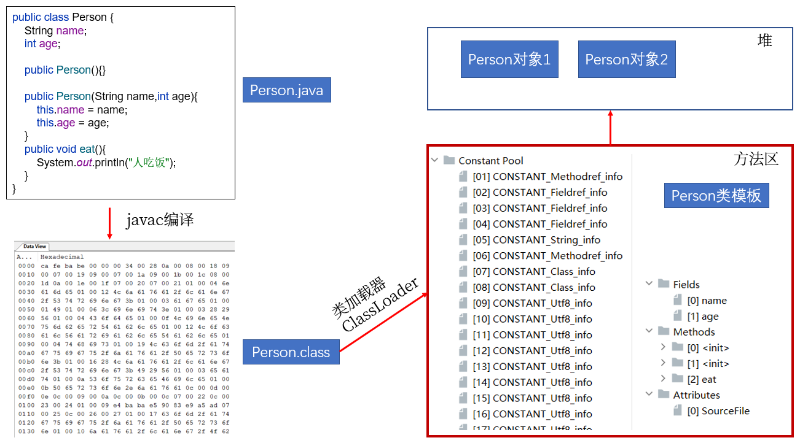
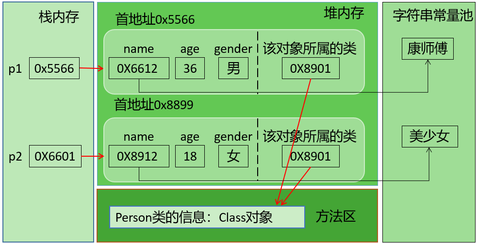
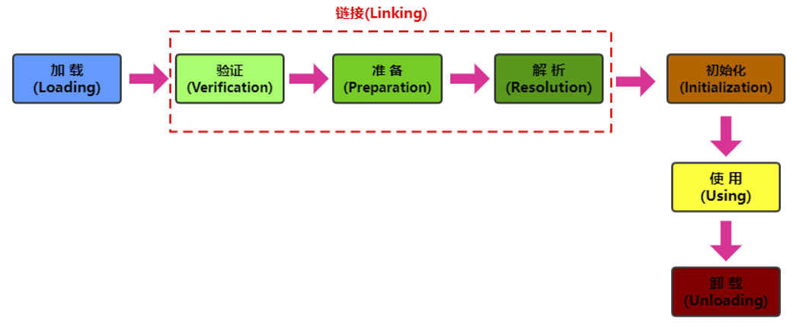
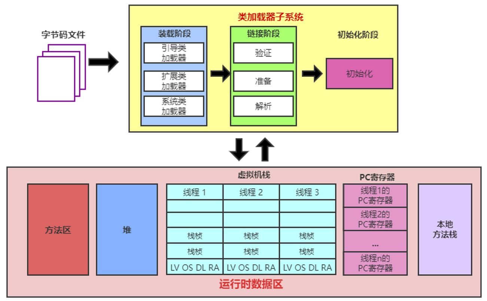
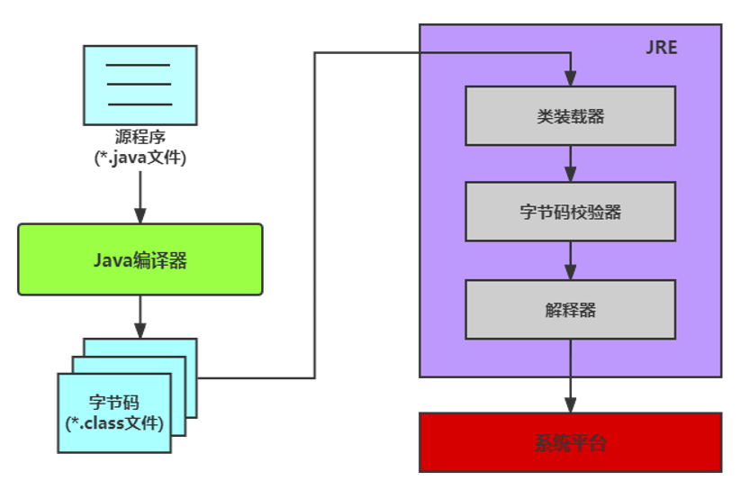
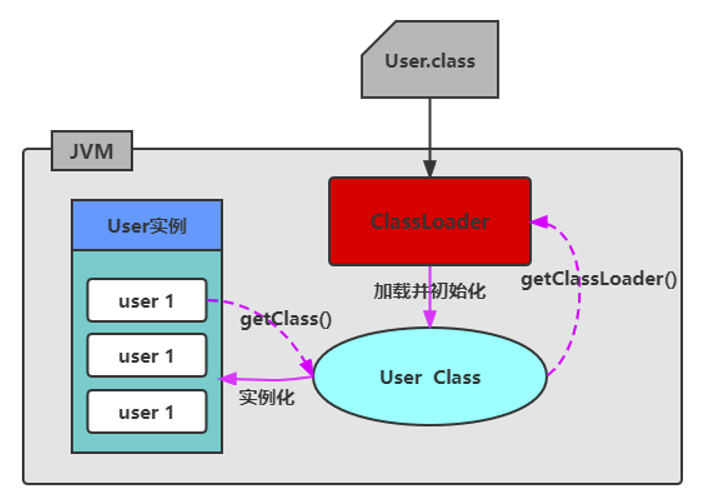
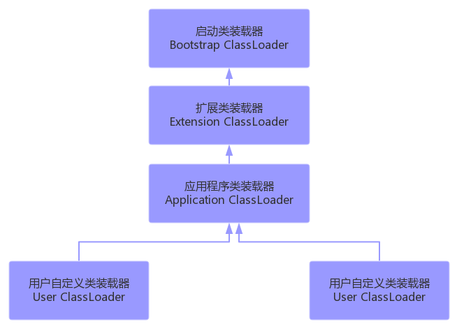

# 反射的概念

Java程序中，所有的对象都有两种类型：`编译时类型`和`运行时类型`，而很多时候对象的编译时类型和运行时类型`不一致`。

> 例如：某些变量或形参的声明类型是Object类型，但是程序却需要调用该对象运行时类型的方法，该方法不是Object中的方法:
>
> + 方案1：在编译和运行时都完全知道类型的具体信息，在先使用`instanceof`运算符进行判断，再利用强制类型转换符将其转换成运行时类型的变量即可。
> + 方案2：编译时根本无法预知该对象和类的真实信息，程序只能依靠`运行时信息`来发现该对象和类的真实信息，这就必须使用**反射**。


Reflection（反射）是被视为`动态语言`的关键，反射机制允许程序在`运行期间`借助于Reflection API取得任何类的内部信息，并能直接操作任意对象的内部属性及方法。

加载完类之后，在堆内存的方法区中就产生了一个Class类型的对象（一个类只有一个Class对象），这个对象就包含了完整的类的结构信息。我们可以通过这个对象看到类的结构。



Java反射机制提供的功能：

- 在运行时判断任意一个对象所属的类
- 在运行时构造任意一个类的对象
- 在运行时判断任意一个类所具有的成员变量和方法
- 在运行时获取泛型信息
- 在运行时调用任意一个对象的成员变量和方法
- 在运行时处理注解
- 生成动态代理


反射的优缺点：

+ **优点：**

  - 提高了Java程序的灵活性和扩展性，`降低了耦合性`，提高`自适应`能力


  - 允许程序创建和控制任何类的对象，无需提前`硬编码`目标类


+ **缺点：**

  - 反射的`性能较低`。
    - 反射机制主要应用在对灵活性和扩展性要求很高的系统框架上


  - 反射会`模糊`程序内部逻辑，`可读性较差`。


# 理解Class类并获取Class实例

## 理解Class

在Object类中定义了以下的方法，此方法将被所有子类继承：

```java
public final Class getClass()
```

对于每个类而言，JRE 都为其保留一个不变的 Class 类型的对象。一个 Class 对象包含了特定某个结构(`class/interface/enum/annotation/primitive type/void/[]`)的有关信息。

- Class本身也是一个类
- Class 对象只能由系统建立对象
- 一个加载的类在 JVM 中只会有一个Class实例 
- 一个Class对象对应的是一个加载到JVM中的一个.class文件
- 每个类的实例都会记得自己是由哪个 Class 实例所生成
- 通过Class可以完整地得到一个类中的所有被加载的结构 
- Class类是Reflection的根源，针对任何想动态加载、运行的类，唯有先获得相应的Class对象

在内存结构上：



> 字符串常量池在JDK6中存储在方法区；JDK7及以后，存储在堆空间。


## 获取Class类的实例

方式1：要求编译期间已知类型

前提：若已知具体的类，通过类的class属性获取，该方法最为安全可靠，程序性能最高

实例：

```java
Class clazz = String.class;
```

方式2：获取对象的运行时类型

前提：已知某个类的实例，调用该实例的getClass()方法获取Class对象

实例：

```java
Class clazz = "www.atguigu.com".getClass();
```

方式3：可以获取编译期间未知的类型

前提：已知一个类的全类名，且该类在类路径下，可通过Class类的静态方法forName()获取，可能抛出ClassNotFoundException

实例：

```java
Class clazz = Class.forName("java.lang.String");
```

方式4：其他方式

前提：可以用系统类加载对象或自定义加载器对象加载指定路径下的类型

实例：

```java
ClassLoader cl = this.getClass().getClassLoader();
Class clazz4 = cl.loadClass("类的全类名");
```


## 哪些类型可以有Class对象

所有Java类型！

（1）class：外部类，成员(成员内部类，静态内部类)，局部内部类，匿名内部类
（2）interface：接口
（3）[]：数组
（4）enum：枚举
（5）annotation：注解@interface
（6）primitive type：基本数据类型
（7）void

```java
Class c1 = Object.class;
Class c2 = Comparable.class;
Class c3 = String[].class;
Class c4 = int[][].class;
Class c5 = ElementType.class;
Class c6 = Override.class;
Class c7 = int.class;
Class c8 = void.class;
Class c9 = Class.class;

int[] a = new int[10];
int[] b = new int[100];
Class c10 = a.getClass();
Class c11 = b.getClass();
// 只要元素类型与维度一样，就是同一个Class
System.out.println(c10 == c11);
```

## Class类的常用方法

| **方法名**                                         | **功能说明**                                                 |
| -------------------------------------------------- | ------------------------------------------------------------ |
| static  Class forName(String  name)                | 返回指定类名  name  的  Class  对象                          |
| Object  newInstance()                              | 调用缺省构造函数，返回该Class对象的一个实例                  |
| getName()                                          | 返回此Class对象所表示的实体（类、接口、数组类、基本类型或void）名称 |
| Class  getSuperClass()                             | 返回当前Class对象的父类的Class对象                           |
| Class  [] getInterfaces()                          | 获取当前Class对象的接口                                      |
| ClassLoader  getClassLoader()                      | 返回该类的类加载器                                           |
| Class  getSuperclass()                             | 返回表示此Class所表示的实体的超类的Class                     |
| Constructor[]  getConstructors()                   | 返回一个包含某些Constructor对象的数组                        |
| Field[]  getDeclaredFields()                       | 返回Field对象的一个数组                                      |
| Method  getMethod(String  name,Class … paramTypes) | 返回一个Method对象，此对象的形参类型为paramType              |


# 类的加载与ClassLoader的理解

## 类的生命周期

类在内存中完整的生命周期：加载-->使用-->卸载。其中加载过程又分为：装载、链接、初始化三个阶段。



## 类的加载过程

当程序主动使用某个类时，如果该类还未被加载到内存中，系统会通过**加载、链接、初始化**三个步骤来对该类进行初始化。如果没有意外，JVM将会连续完成这三个步骤，所以有时也把这三个步骤统称为类加载。



（1）装载（Loading）

将类的class文件读入内存，并为之创建一个java.lang.Class对象。此过程由类加载器完成

（2）链接（Linking）

①验证Verify：确保加载的类信息符合JVM规范，例如：以cafebabe开头，没有安全方面的问题。

②准备Prepare：正式为类变量（static）分配内存并`设置类变量默认初始值`的阶段，这些内存都将在方法区中进行分配。

③解析Resolve：虚拟机常量池内的符号引用（常量名）替换为直接引用（地址）的过程。

（3）初始化（Initialization）

- 执行`类构造器<clinit>()方法`的过程。`类构造器<clinit>()方法`是由编译期自动收集类中所有类变量的赋值动作和静态代码块中的语句合并产生的。（类构造器是构造类信息的，不是构造该类对象的构造器）。

- 当初始化一个类的时候，如果发现其父类还没有进行初始化，则需要先触发其父类的初始化。

- 虚拟机会保证一个`类的<clinit>()方法`在多线程环境中被正确加锁和同步。

## 类加载器（classloaded）



### 类加载器作用

将class文件字节码内容加载到内存中，并将这些静态数据转换成方法区的运行时数据结构，然后在堆中生成一个代表这个类的java.lang.Class对象，作为方法区中类数据的访问入口。

类缓存：标准的JavaSE类加载器可以按要求查找类，但一旦某个类被加载到类加载器中，它将维持加载（缓存）一段时间。不过JVM垃圾回收机制可以回收这些Class对象。



### 类加载器的分类(JDK8)

JVM支持两种类型的类加载器，分别为`引导类加载器（Bootstrap ClassLoader）`和`自定义类加载器（User-Defined ClassLoader）`。

从概念上来讲，自定义类加载器一般指的是程序中由开发人员自定义的一类类加载器，但是Java虚拟机规范却没有这么定义，而是将所有派生于抽象类ClassLoader的类加载器都划分为自定义类加载器。无论类加载器的类型如何划分，在程序中最常见的类加载器结构主要是如下情况：



**（1）启动类加载器（引导类加载器，Bootstrap ClassLoader）**

- 这个类加载使用`C/C++语言`实现的，嵌套在JVM内部。获取它的对象时往往返回null
- 它用来加载Java的核心库（`JAVA_HOME/jre/lib/rt.jar`或`sun.boot.class.path`路径下的内容）。用于提供JVM自身需要的类。
- 并不继承自java.lang.ClassLoader，没有父加载器。
- 出于安全考虑，Bootstrap启动类加载器只加载包名为java、javax、sun等开头的类
- 加载扩展类和应用程序类加载器，并指定为他们的父类加载器。

**（2）扩展类加载器（Extension ClassLoader）**

- Java语言编写，由sun.misc.Launcher$ExtClassLoader实现。
- 继承于ClassLoader类
- 父类加载器为启动类加载器
- 从`java.ext.dirs`系统属性所指定的目录中加载类库，或从JDK的安装目录的`jre/lib/ext`子目录下加载类库。如果用户创建的JAR放在此目录下，也会自动由扩展类加载器加载。

**（3）应用程序类加载器（系统类加载器，AppClassLoader）**

- java语言编写，由sun.misc.Launcher$AppClassLoader实现
- 继承于ClassLoader类
- 父类加载器为扩展类加载器
- 它负责加载环境变量classpath或系统属性 java.class.path 指定路径下的类库 
- 应用程序中的类加载器默认是系统类加载器。
- 它是用户自定义类加载器的默认父加载器
- 通过ClassLoader的getSystemClassLoader()方法可以获取到该类加载器

**（4）用户自定义类加载器**

- 在Java的日常应用程序开发中，类的加载几乎是由上述3种类加载器相互配合执行的。在必要时，我们还可以自定义类加载器，来定制类的加载方式。
- 体现Java语言强大生命力和巨大魅力的关键因素之一便是，Java开发者可以自定义类加载器来实现类库的动态加载，加载源可以是本地的JAR包，也可以是网络上的远程资源。
- 同时，自定义加载器能够实现`应用隔离`，例如 Tomcat，Spring等中间件和组件框架都在内部实现了自定义的加载器，并通过自定义加载器隔离不同的组件模块。这种机制比C/C++程序要好太多，想不修改C/C++程序就能为其新增功能，几乎是不可能的，仅仅一个兼容性便能阻挡住所有美好的设想。
- 自定义类加载器通常需要继承于ClassLoader。


### 查看某个类的类加载器对象

（1）获取默认的系统类加载器

```java
ClassLoader classloader = ClassLoader.getSystemClassLoader();
```

（2）查看某个类是哪个类加载器加载的

```java
ClassLoader classloader = Class.forName("exer2.ClassloaderDemo").getClassLoader();

//如果是根加载器加载的类，则会得到null
ClassLoader classloader1 = Class.forName("java.lang.Object").getClassLoader();
```

（3）获取某个类加载器的父加载器

```java
ClassLoader parentClassloader = classloader.getParent();
```

示例代码：

```java
import org.junit.Test;

public class TestClassLoader {
    @Test
    public void test01(){
        ClassLoader systemClassLoader = ClassLoader.getSystemClassLoader();
        System.out.println("systemClassLoader = " + systemClassLoader);
    }

    @Test
    public void test02()throws Exception{
        ClassLoader c1 = String.class.getClassLoader();
        System.out.println("加载String类的类加载器：" + c1);

        ClassLoader c2 = Class.forName("sun.util.resources.cldr.zh.TimeZoneNames_zh").getClassLoader();
        System.out.println("加载sun.util.resources.cldr.zh.TimeZoneNames_zh类的类加载器：" + c2);

        ClassLoader c3 = TestClassLoader.class.getClassLoader();
        System.out.println("加载当前类的类加载器：" + c3);
    }

    @Test
    public void test03(){
        ClassLoader c1 = TestClassLoader.class.getClassLoader();
        System.out.println("加载当前类的类加载器c1=" + c1);

        ClassLoader c2 = c1.getParent();
        System.out.println("c1.parent = " + c2);

        ClassLoader c3 = c2.getParent();
        System.out.println("c2.parent = " + c3);

    }
}
```

### 使用ClassLoader获取流

类加载器的一个主要方法：getResourceAsStream(String str):获取类路径下的指定文件的输入流

```java
InputStream in = null;
in = this.getClass().getClassLoader().getResourceAsStream("exer2\\test.properties");
System.out.println(in);

```

# 反射的应用

## 创建运行时类的对象

这是反射机制应用最多的地方。创建运行时类的对象有两种方式：

**方式1：直接调用Class对象的newInstance()方法**

要 求： 1）类必须有一个无参数的构造器。2）类的构造器的访问权限需要足够。

**方式2：通过获取构造器对象来进行实例化**

方式一的步骤：

1）获取该类型的Class对象  2）调用Class对象的newInstance()方法创建对象

方式二的步骤：

1）通过Class类的getDeclaredConstructor(Class … parameterTypes)取得本类的指定形参类型的构造器
2）向构造器的形参中传递一个对象数组进去，里面包含了构造器中所需的各个参数。
3）通过Constructor实例化对象。

> 如果构造器的权限修饰符修饰的范围不可见，也可以调用setAccessible(true)


示例：

```java
public class Student {
    private int id;
    private String name;
    private int score;
    private int age;

    public Student(int id, String name, int score, int age) {
        this.id = id;
        this.name = name;
        this.score = score;
        this.age = age;
    }

    public Student() {

    }

}
```

```java
import org.junit.Test;

import java.lang.reflect.Constructor;

public class TestCreateObject {
    @Test
    public void test1() throws Exception{

        Class<?> clazz = Class.forName("Student");
        //clazz代表Student类型
        //clazz.newInstance()创建的就是Student的对象
        Object obj = clazz.newInstance();
        System.out.println(obj); // Student{id=0, name='null', score=0, age=0}
    }
    
    @Test
    public void test2()throws Exception{
        //(1)获取Class对象
        Class<?> clazz = Class.forName("Student");
        /*
         * 获取AStudent类型中的有参构造
         * 如果构造器有多个，通常是根据形参【类型】列表来获取指定的一个构造器的
         */
        //(2)获取构造器对象
        Constructor<?> constructor = clazz.getDeclaredConstructor(int.class,String.class,int.class,int.class);

        //(3)创建实例对象
        // T newInstance(Object... initargs)  这个Object...是在创建对象时，给有参构造的实参列表
        Object obj = constructor.newInstance(10,"奥特曼",10,10);
        System.out.println(obj); // Student{id=10, name='奥特曼', score=10, age=10}
    }
}
```


## 获取运行时类的完整结构

可以获取：包、修饰符、类型名、父类（包括泛型父类）、父接口（包括泛型父接口）、成员（属性、构造器、方法）、注解（类上的、方法上的、属性上的）。

### 相关API

```java
//1.实现的全部接口
public Class<?>[] getInterfaces()   
//确定此对象所表示的类或接口实现的接口。 

//2.所继承的父类
public Class<? Super T> getSuperclass()
//返回表示此 Class 所表示的实体（类、接口、基本类型）的父类的 Class。

//3.全部的构造器
public Constructor<T>[] getConstructors()
//返回此 Class 对象所表示的类的所有public构造方法。
public Constructor<T>[] getDeclaredConstructors()
//返回此 Class 对象表示的类声明的所有构造方法。

//Constructor类中：
//取得修饰符: 
public int getModifiers();
//取得方法名称: 
public String getName();
//取得参数的类型：
public Class<?>[] getParameterTypes();

//4.全部的方法
public Method[] getDeclaredMethods()
//返回此Class对象所表示的类或接口的全部方法
public Method[] getMethods()  
//返回此Class对象所表示的类或接口的public的方法

//Method类中：
public Class<?> getReturnType()
//取得全部的返回值
public Class<?>[] getParameterTypes()
//取得全部的参数
public int getModifiers()
//取得修饰符
public Class<?>[] getExceptionTypes()
//取得异常信息

//5.全部的Field
public Field[] getFields() 
//返回此Class对象所表示的类或接口的public的Field。
public Field[] getDeclaredFields() 
//返回此Class对象所表示的类或接口的全部Field。

//Field方法中：
public int getModifiers()
//以整数形式返回此Field的修饰符
public Class<?> getType()  
//得到Field的属性类型
public String getName()  
//返回Field的名称。

//6. Annotation相关
get Annotation(Class<T> annotationClass) 
getDeclaredAnnotations() 

//7.泛型相关
//获取父类泛型类型：
Type getGenericSuperclass()
//泛型类型：ParameterizedType
//获取实际的泛型类型参数数组：
getActualTypeArguments()

//8.类所在的包
Package getPackage() 
```

## 调用运行时类的指定结构

### 调用指定的属性

在反射机制中，可以直接通过Field类操作类中的属性，通过Field类提供的set()和get()方法就可以完成设置和取得属性内容的操作。

（1）获取该类型的Class对象

Class clazz = Class.forName("包.类名");

（2）获取属性对象

Field field = clazz.getDeclaredField("属性名");

（3）如果属性的权限修饰符不是public，那么需要设置属性可访问

field.setAccessible(true);

（4）创建实例对象：如果操作的是非静态属性，需要创建实例对象

Object obj = clazz.newInstance(); //有公共的无参构造

Object obj = 构造器对象.newInstance(实参...);//通过特定构造器对象创建实例对象

（4）设置指定对象obj上此Field的属性内容

field.set(obj,"属性值");

> 如果操作静态变量，那么实例对象可以省略，用null表示

（5）取得指定对象obj上此Field的属性内容

Object value = field.get(obj);

> 如果操作静态变量，那么实例对象可以省略，用null表示


示例代码：

```java
package demo1;
public class Student {
    private int id;
    private String name;

    public int getId() {
        return id;
    }

    public void setId(int id) {
        this.id = id;
    }

    public String getName() {
        return name;
    }

    public void setName(String name) {
        this.name = name;
    }

    @Override
    public String toString() {
        return "Student{" +
                "id=" + id +
                ", name='" + name + '\'' +
                '}';
    }
}

```

```java
package demo1;
import java.lang.reflect.Field;

public class TestField {
    public static void main(String[] args)throws Exception {
        //1、获取Student的Class对象
        Class clazz = Class.forName("demo1.Student");

        //2、获取属性对象，例如：id属性
        Field idField = clazz.getDeclaredField("id");

        //3、如果id是私有的等在当前类中不可访问access的，我们需要做如下操作
        idField.setAccessible(true);

        //4、创建实例对象，即，创建Student对象
        Object stu = clazz.newInstance();

        //5、获取属性值
        /*
         * 以前：int 变量= 学生对象.getId()
         * 现在：Object id属性对象.get(学生对象)
         */
        Object value = idField.get(stu);
        System.out.println("id = "+ value); // id = 0

        //6、设置属性值
        /*
         * 以前：学生对象.setId(值)
         * 现在：id属性对象.set(学生对象,值)
         */
        idField.set(stu, 2);

        value = idField.get(stu);
        System.out.println("id = "+ value); // id = 2
    }
}
```

**关于setAccessible方法的使用：**

- Method和Field、Constructor对象都有setAccessible()方法。
- setAccessible启动和禁用访问安全检查的开关。
- 参数值为true则指示反射的对象在使用时应该取消Java语言访问检查。
  - 提高反射的效率。如果代码中必须用反射，而该句代码需要频繁的被调用，那么请设置为true。
  - 使得原本无法访问的私有成员也可以访问
- 参数值为false则指示反射的对象应该实施Java语言访问检查。

### 调用指定的方法


（1）获取该类型的Class对象

Class clazz = Class.forName("包.类名");

（2）获取方法对象

Method method = clazz.getDeclaredMethod("方法名",方法的形参类型列表);

（3）创建实例对象

Object obj = clazz.newInstance();

（4）调用方法

Object result = method.invoke(obj, 方法的实参值列表);

> 如果方法的权限修饰符修饰的范围不可见，也可以调用setAccessible(true)
>
> 如果方法是静态方法，实例对象也可以省略，用null代替

示例代码：

```java
package demo1;

import org.junit.Test;

import java.lang.reflect.Method;

public class TestMethod {
    @Test
    public void test() throws Exception {
        // 1、获取Student的Class对象
        Class<?> clazz = Class.forName("demo1.Student");

        //2、获取方法对象
        /*
         * 在一个类中，唯一定位到一个方法，需要：（1）方法名（2）形参列表，因为方法可能重载
         *
         * 例如：void setName(String name)
         */
        Method setNameMethod = clazz.getDeclaredMethod("setName", String.class);

        //3、创建实例对象
        Object stu = clazz.newInstance();

        //4、调用方法
        /*
         * 以前：学生对象.setName(值)
         * 现在：方法对象.invoke(学生对象，值)
         */
        Object setNameMethodReturnValue = setNameMethod.invoke(stu, "张三");

        System.out.println("stu = " + stu); // stu = Student{id=0, name='张三'}
        //setName方法返回值类型void，没有返回值，所以setNameMethodReturnValue为null
        System.out.println("setNameMethodReturnValue = " + setNameMethodReturnValue); // setNameMethodReturnValue = null

        Method getNameMethod = clazz.getDeclaredMethod("getName");
        Object getNameMethodReturnValue = getNameMethod.invoke(stu);
        //getName方法返回值类型String，有返回值，getNameMethod.invoke的返回值就是getName方法的返回值
        System.out.println("getNameMethodReturnValue = " + getNameMethodReturnValue);// getNameMethodReturnValue = 张三
    }
    
}

```


## 读取注解信息

一个完整的注解应该包含三个部分：
（1）声明
（2）使用
（3）读取

### 声明自定义注解

```java
package annotation;

import java.lang.annotation.*;

@Inherited
@Target(ElementType.TYPE)
@Retention(RetentionPolicy.RUNTIME)
public @interface Table {
    String value();
}

```

```java
package annotation;

import java.lang.annotation.*;

@Inherited
@Target(ElementType.FIELD)
@Retention(RetentionPolicy.RUNTIME)
public @interface Column {
    String columnName();
    String columnType();
}
```

* 自定义注解可以通过四个元注解@Retention,@Target，@Inherited,@Documented，分别说明它的声明周期，使用位置，是否被继承，是否被生成到API文档中。
* Annotation 的成员在 Annotation 定义中以无参数有返回值的抽象方法的形式来声明，我们又称为配置参数。返回值类型只能是八种基本数据类型、String类型、Class类型、enum类型、Annotation类型、以上所有类型的数组
* 可以使用 default 关键字为抽象方法指定默认返回值
* 如果定义的注解含有抽象方法，那么使用时必须指定返回值，除非它有默认值。格式是“方法名 = 返回值”，如果只有一个抽象方法需要赋值，且方法名为value，可以省略“value=”，所以如果注解只有一个抽象方法成员，建议使用方法名value。


### 使用自定义注解

```java
package annotation;

@Table("t_stu")
public class Student {
    @Column(columnName = "sid",columnType = "int")
    private int id;
    @Column(columnName = "sname",columnType = "varchar(20)")
    private String name;

    public int getId() {
        return id;
    }

    public void setId(int id) {
        this.id = id;
    }

    public String getName() {
        return name;
    }

    public void setName(String name) {
        this.name = name;
    }

    @Override
    public String toString() {
        return "Student{" +
                "id=" + id +
                ", name='" + name + '\'' +
                '}';
    }
}

```


### 读取和处理自定义注解

自己定义的注解，只能使用反射的代码读取。所以自定义注解的声明周期必须是RetentionPolicy.RUNTIME。

```java
package annotation;

import java.lang.reflect.Field;

public class TestAnnotation {
    public static void main(String[] args) {
        Class studentClass = Student.class;
        Table tableAnnotation = (Table) studentClass.getAnnotation(Table.class);
        String tableName = "";
        if(tableAnnotation != null){
            tableName = tableAnnotation.value();
        }

        Field[] declaredFields = studentClass.getDeclaredFields();
        String[] columns = new String[declaredFields.length];
        int index = 0;
        for (Field declaredField : declaredFields) {
            Column column = declaredField.getAnnotation(Column.class);
            if(column!= null) {
                columns[index++] = column.columnName();
            }
        }

        String sql = "select ";
        for (int i=0; i<index; i++) {
            sql += columns[i];
            if(i<index-1){
                sql += ",";
            }
        }
        sql += " from " + tableName;
        System.out.println("sql = " + sql); // sql = select sid,sname from t_stu
    }
}

```

# 体会反射的动态性

案例一：

```java
public class ReflectionTest {

    // 动态的创建给定字符串对应的类的对象
    public <T> T getInstance(String className) throws Exception {

        Class clazz = Class.forName(className);

        Constructor constructor = clazz.getDeclaredConstructor();
        constructor.setAccessible(true);
        return (T) constructor.newInstance();

    }

    @Test
    public void test1() throws Exception {
        String className = "com.atguigu.java1.Person";
        Person p1 = getInstance(className);
        System.out.println(p1);
    }
}
```

案例二：

```java
public class ReflectionTest {
    // 动态的创建指定字符串对应类的对象，并调用指定的方法
    public Object  invoke(String className,String methodName) throws Exception {
        Class clazz = Class.forName(className);
        Constructor constructor = clazz.getDeclaredConstructor();
        constructor.setAccessible(true);
        //动态的创建指定字符串对应类的对象
        Object obj = constructor.newInstance();

        Method method = clazz.getDeclaredMethod(methodName);
        method.setAccessible(true);
        return method.invoke(obj);
    }

    @Test
    public void test2() throws Exception {
        String info = (String) invoke("com.atguigu.java1.Person", "show");

        System.out.println("返回值为：" + info);

    }
}
```

案例三：

```java
public class ReflectionTest {
	@Test
    public void test1() throws Exception {
        //1.加载配置文件，并获取指定的fruitName值
        Properties pros = new Properties();
        InputStream is = ClassLoader.getSystemClassLoader().getResourceAsStream("config.properties");
        pros.load(is);
        String fruitStr = pros.getProperty("fruitName");
        //2.创建指定全类名对应类的实例
        Class clazz = Class.forName(fruitStr);
        Constructor constructor = clazz.getDeclaredConstructor();
        constructor.setAccessible(true);
        Fruit fruit = (Fruit) constructor.newInstance();
        //3. 调用相关方法，进行测试
        Juicer juicer = new Juicer();
        juicer.run(fruit);

    }

}

interface Fruit {
	public void squeeze();
}

class Apple implements Fruit {
	public void squeeze() {
		System.out.println("榨出一杯苹果汁儿");
	}
}

class Orange implements Fruit {
	public void squeeze() {
		System.out.println("榨出一杯桔子汁儿");
	}
}

class Juicer {
	public void run(Fruit f) {
		f.squeeze();
	}
}

```

其中，配置文件【config.properties】存放在当前Module的src下

```
demo.Orange
```

