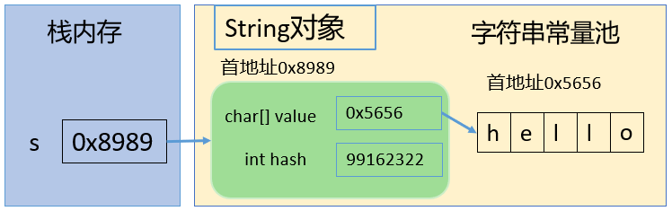
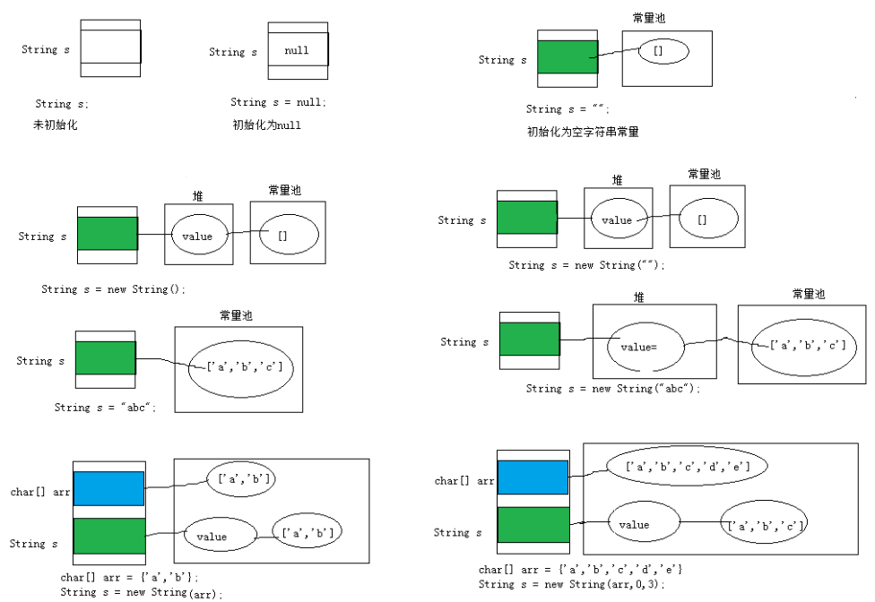
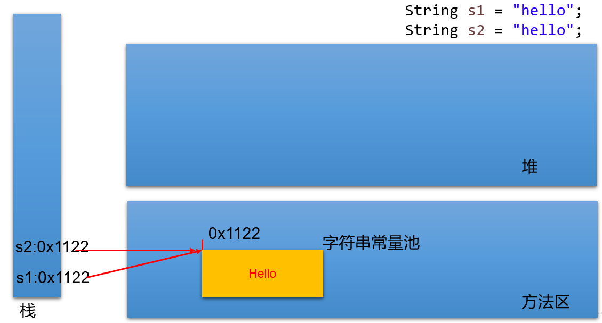
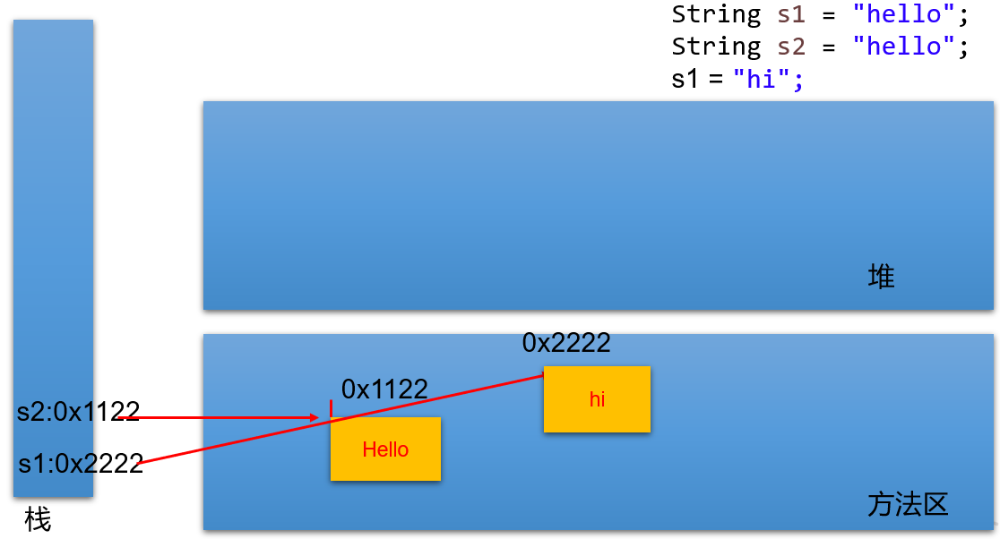
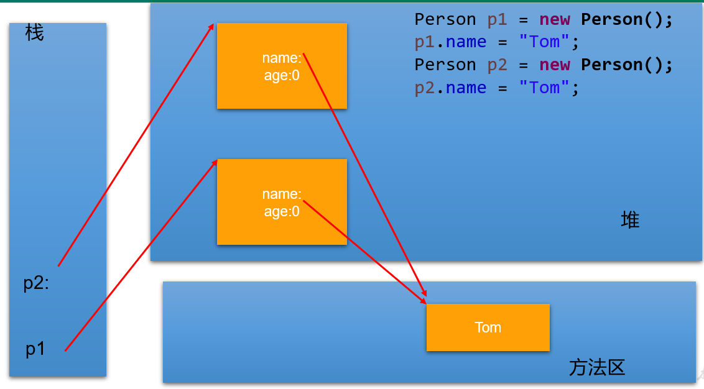
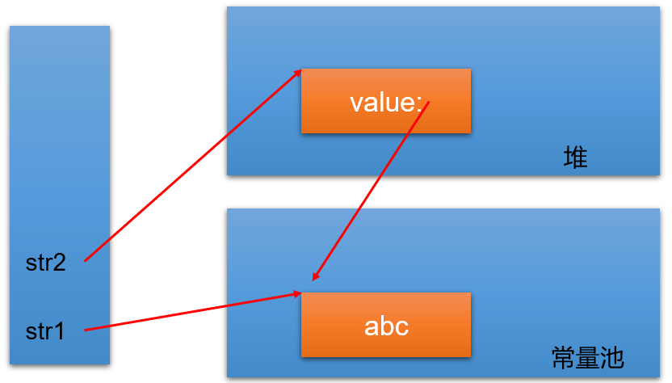
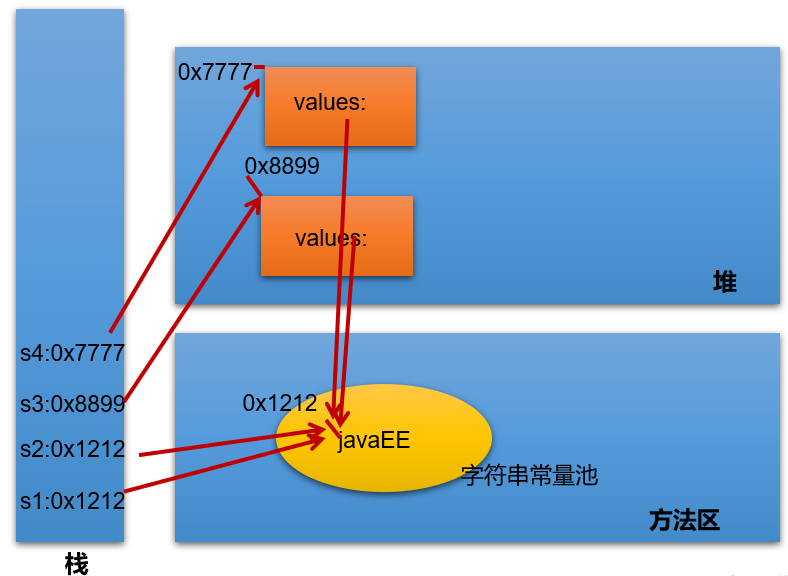
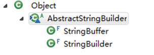
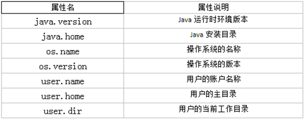

# String、StringBuffer、StringBuilder

## 不可变字符序列：String

### String的特性

- `java.lang.String` 类代表字符串。

- 字符串是常量，用双引号引起来表示。它们的值在创建之后不能更改。

- 字符串String类型本身是final声明的，意味着不能继承String。

- String对象的字符内容是存储在一个字符数组value[]中的。`"hello"` 等效于 `char[] s={'h','e','l','l','o'}`。



```java
//jdk8中的String源码：
public final class String
    implements java.io.Serializable, Comparable<String>, CharSequence {
    /** The value is used for character storage. */
    private final char value[]; //String对象的字符内容是存储在此数组中
 
    /** Cache the hash code for the string */
    private int hash; // Default to 0

```

private意味着外面无法直接获取字符数组，而且String没有提供value的get和set方法。final意味着字符数组的引用不可改变，而且String也没有提供方法来修改value数组某个元素值。因此字符串的字符数组内容也不可变的，即String代表着不可变的字符序列。即，一旦对字符串进行修改，就会产生新对象。

在JDK9中底层使用byte[]数组：

```java
public final class String implements java.io.Serializable, Comparable<String>, CharSequence { 
    @Stable
    private final byte[] value;
}
```

### String的内存结构

因为字符串对象设计为不可变，那么所以字符串有常量池来保存很多常量对象。

JDK6中，字符串常量池在方法区。JDK7开始，就移到堆空间，直到目前JDK17版本。



#### 字符串拼接（内存结构以JDK6为例）





```java
public class demo1 {
    public static void main(String[] args) {
        Person p1 = new Person();
        p1.name = "Tom";

        Person p2 = new Person();
        p2.name = "Tom";

        System.out.println(p1.name.equals( p2.name)); //true
        System.out.println(p1.name == p2.name); //true
        System.out.println(p1.name == "Tom"); //true
    }
}

class Person {
    public String name;
    public void setName(String name) {this.name = name;}

}
```



#### new

String str1 = “abc”; 与 String str2 = new String(“abc”);的区别：

str2 首先指向堆中的一个字符串对象，然后堆中字符串的value数组指向常量池中常量对象的value数组。



> - 字符串常量存储在字符串常量池，目的是共享。
>
> - 字符串非常量对象存储在堆中。
>
> - String str2 = new String("hello"); 在内存中创建了几个对象?
>   - 两个


```java
String s1 = "javaEE";
String s2 = "javaEE";
String s3 = new String("javaEE");
String s4 = new String("javaEE");

System.out.println(s1 == s2);//true
System.out.println(s1 == s3);//false
System.out.println(s1 == s4);//false
System.out.println(s3 == s4);//false
```



#### intern()

**String s1 = "a";** 

- `s1`通过字符串字面量的方式创建。当使用字符串字面量创建字符串对象时，Java 会先在字符串常量池中查找是否已经存在相同内容的字符串对象。如果存在，则直接返回该对象的引用；如果不存在，则在字符串常量池中创建一个新的字符串对象，并返回其引用。因此，`s1` 指向字符串常量池中 "a"这个字符串对象。

**s1 = s1 + "b";** 

+ 由于 `s1` 是一个变量，`s1 + "b"` 这种拼接操作在运行时进行。Java 会创建一个 `StringBuilder` 对象，先调用 `append` 方法将 `s1` 的内容添加到 `StringBuilder` 中，再将 `"b"` 添加进去，最后调用 `toString` 方法生成一个新的 `String` 对象。因此，`s1` 指向的是堆内存中的一个新的字符串对象。

**String s2 = "ab";**

+ Java 会在字符串常量池中查找 `"ab"`，如果存在就指向，如果不存在就在常量池中创建并指向。

**String s3 = "a" + "b";**

+ 在编译阶段，Java 编译器会对字符串常量的拼接进行优化，将 `"a" + "b"` 直接合并为 `"ab"`。因此，`s3` 指向字符串常量池中 `"ab"` 这个字符串对象。

**String s4 = s1.intern();**

+ `intern` 方法会先检查字符串常量池中是否已经存在与该字符串内容相同的对象。如果存在，则返回常量池中该对象的引用；如果不存在，则将该字符串对象添加到常量池中，并返回其引用。由于 `"ab"` 已经在常量池中存在，所以 `s4` 指向的是字符串常量池中 `"ab"` 这个字符串对象。

```java
public static void main(String[] args) {
        String s1 = "hello";
        String s2 = "world";
        String s3 = "hello" + "world";
        String s4 = s1 + "world";
        String s5 = s1 + s2;
        String s6 = (s1 + s2).intern();

        System.out.println(s3 == s4); //false
        System.out.println(s3 == s5); //false
        System.out.println(s4 == s5); //false
        System.out.println(s3 == s6); //true
    }
```

> （1）常量+常量：结果是常量池。且常量池中不会存在相同内容的常量。
>
> （2）常量与变量 或 变量与变量：结果在堆中
>
> （3）拼接后调用intern方法：返回值在常量池中

```java
@Test
public void test01(){
	String s1 = "hello";
	String s2 = "world";
	String s3 = "helloworld";
		
	String s4 = s1 + "world";//s4字符串内容也helloworld，s1是变量，"world"常量，变量 + 常量的结果在堆中
	String s5 = s1 + s2;//s5字符串内容也helloworld，s1和s2都是变量，变量 + 变量的结果在堆中
	String s6 = "hello" + "world";//常量+ 常量 结果在常量池中，因为编译期间就可以确定结果
		
	System.out.println(s3 == s4);//false
	System.out.println(s3 == s5);//false
	System.out.println(s3 == s6);//true
}

@Test
public void test02(){
	final String s1 = "hello";
	final String s2 = "world";
	String s3 = "helloworld";
	
	String s4 = s1 + "world";//s4字符串内容也helloworld，s1是常量，"world"常量，常量+常量结果在常量池中
	String s5 = s1 + s2;//s5字符串内容也helloworld，s1和s2都是常量，常量+ 常量 结果在常量池中
	String s6 = "hello" + "world";//常量+ 常量 结果在常量池中，因为编译期间就可以确定结果
		
	System.out.println(s3 == s4);//true
	System.out.println(s3 == s5);//true
	System.out.println(s3 == s6);//true
}

@Test
public void test03(){
	String s1 = "hello";
	String s2 = "world";
	String s3 = "helloworld";
		
	String s4 = (s1 + "world").intern();//把拼接的结果放到常量池中
	String s5 = (s1 + s2).intern();
		
	System.out.println(s3 == s4);//true
	System.out.println(s3 == s5);//true
}

@Test
public void test04(){
    String str = "hello";
    String str2 = "world";
    String str3 ="helloworld";

    String str4 = "hello".concat("world");
    String str5 = "hello"+"world";

    System.out.println(str3 == str4);//false
    System.out.println(str3 == str5);//true
}
```

> concat方法拼接，哪怕是两个常量对象拼接，结果也是在堆。

```java
public class StringTest {
    String str = new String("good");
    char[] ch = { 't', 'e', 's', 't' };

    public void change(String str, char ch[]) {
        str = "test ok";
        ch[0] = 'b';
    }
    public static void main(String[] args) {
        StringTest ex = new StringTest();
        ex.change(ex.str, ex.ch);
        System.out.print(ex.str + " and ");
        System.out.println(ex.ch);
        // good and best
    }
}

```

### String的常用API

####  构造器

* `public String() ` ：初始化新创建的 String对象，以使其表示空字符序列。
* ` String(String original)`： 初始化一个新创建的 `String` 对象，使其表示一个与参数相同的字符序列；换句话说，新创建的字符串是该参数字符串的副本。
* `public String(char[] value) ` ：通过当前参数中的字符数组来构造新的String。
* `public String(char[] value,int offset, int count) ` ：通过字符数组的一部分来构造新的String。
* `public String(byte[] bytes) ` ：通过使用平台的**默认字符集**解码当前参数中的字节数组来构造新的String。
* `public String(byte[] bytes,String charsetName) ` ：通过使用指定的字符集解码当前参数中的字节数组来构造新的String。

#### String与其他结构间的转换

**字符串 --> 基本数据类型、包装类：**

- Integer包装类的public static int parseInt(String s)：可以将由“数字”字符组成的字符串转换为整型。...

**基本数据类型、包装类 --> 字符串：**

- 调用String类的public String valueOf(int n)可将int型转换为字符串。...

 **字符数组 -->  字符串：**

- String 类的构造器：String(char[]) 和 String(char[]，int offset，int length) 分别用字符数组中的全部字符和部分字符创建字符串对象。 

 **字符串 -->  字符数组：**

- public char[] toCharArray()：将字符串中的全部字符存放在一个字符数组中的方法。

- public void getChars(int srcBegin, int srcEnd, char[] dst, int dstBegin)：提供了将指定索引范围内的字符串存放到数组中的方法。

**字符串 --> 字节数组：（编码）**

- public byte[] getBytes() ：使用平台的默认字符集将此 String 编码为 byte 序列，并将结果存储到一个新的 byte 数组中。
- public byte[] getBytes(String charsetName) ：使用指定的字符集将此 String 编码到 byte 序列，并将结果存储到新的 byte 数组。

 **字节数组 --> 字符串：（解码）**

- String(byte[])：通过使用平台的默认字符集解码指定的 byte 数组，构造一个新的 String。
- String(byte[]，int offset，int length) ：用指定的字节数组的一部分，即从数组起始位置offset开始取length个字节构造一个字符串对象。
- String(byte[], String charsetName ) 或 new String(byte[], int, int,String charsetName )：解码，按照指定的编码方式进行解码。

#### 常用方法

1. boolean isEmpty()：字符串是否为空
2. int length()：返回字符串的长度
3. String concat(xx)：拼接
4. boolean equals(Object obj)：比较字符串是否相等，区分大小写
5. boolean equalsIgnoreCase(Object obj)：比较字符串是否相等，不区分大小写
6. int compareTo(String other)：比较字符串大小，区分大小写，按照Unicode编码值比较大小
7. int compareToIgnoreCase(String other)：比较字符串大小，不区分大小写
8. String toLowerCase()：将字符串中大写字母转为小写
9. String toUpperCase()：将字符串中小写字母转为大写
10. String trim()：去掉字符串前后空白符
11. public String intern()：结果在常量池中共享
12. boolean contains(xx)：是否包含xx
13. int indexOf(xx)：从前往后找当前字符串中xx，即如果有返回第一次出现的下标，要是没有返回-1
14. int indexOf(String str, int fromIndex)：返回指定子字符串在此字符串中第一次出现处的索引，从指定的索引开始
15. int lastIndexOf(xx)：从后往前找当前字符串中xx，即如果有返回最后一次出现的下标，要是没有返回-1
16. int lastIndexOf(String str, int fromIndex)：返回指定子字符串在此字符串中最后一次出现处的索引，从指定的索引开始反向搜索。
17. String substring(int beginIndex) ：返回一个新的字符串，它是此字符串的从beginIndex开始截取到最后的一个子字符串。 
18. String substring(int beginIndex, int endIndex) ：返回一个新字符串，它是此字符串从beginIndex开始截取到endIndex(不包含)的一个子字符串。 
19. char charAt(index)：返回[index]位置的字符
20. char[] toCharArray()： 将此字符串转换为一个新的字符数组返回
21. static String valueOf(char[] data)  ：返回指定数组中表示该字符序列的 String
22. static String valueOf(char[] data, int offset, int count) ： 返回指定数组中表示该字符序列的 String
23. static String copyValueOf(char[] data)： 返回指定数组中表示该字符序列的 String
24. static String copyValueOf(char[] data, int offset, int count)：返回指定数组中表示该字符序列的 String
25. boolean startsWith(xx)：测试此字符串是否以指定的前缀开始 
26. boolean startsWith(String prefix, int toffset)：测试此字符串从指定索引开始的子字符串是否以指定前缀开始
27. boolean endsWith(xx)：测试此字符串是否以指定的后缀结束 
28. String replace(char oldChar, char newChar)：返回一个新的字符串，它是通过用 newChar 替换此字符串中出现的所有 oldChar 得到的。 不支持正则。
29. String replace(CharSequence target, CharSequence replacement)：使用指定的字面值替换序列替换此字符串所有匹配字面值目标序列的子字符串。 
30. String replaceAll(String regex, String replacement)：使用给定的 replacement 替换此字符串所有匹配给定的正则表达式的子字符串。 
31. String replaceFirst(String regex, String replacement)：使用给定的 replacement 替换此字符串匹配给定的正则表达式的第一个子字符串。 

## 可变字符序列：StringBuffer、StringBuilder

### StringBuffer与StringBuilder

+ java.lang.StringBuffer代表`可变的字符序列`，JDK1.0中声明，可以对字符串内容进行增删，此时不会产生新的对象。
+ StringBuilder 和 StringBuffer 非常类似，均代表可变的字符序列，而且提供相关功能的方法也一样。
+ 区分String、StringBuffer、StringBuilder
  - String:不可变的字符序列； 底层使用char[]数组存储(JDK8.0中)
  - StringBuffer:可变的字符序列；线程安全（方法有synchronized修饰），效率低；底层使用char[]数组存储 (JDK8.0中)
  - StringBuilder:可变的字符序列； jdk1.5引入，线程不安全的，效率高；底层使用char[]数组存储(JDK8.0中)
+ 继承结构：



### StringBuilder、StringBuffer的API

StringBuilder、StringBuffer的API是完全一致的，并且很多方法与String相同。

1. StringBuffer append(xx)：提供了很多的append()方法，用于进行字符串追加的方式拼接
2. StringBuffer delete(int start, int end)：删除[start,end)之间字符
3. StringBuffer deleteCharAt(int index)：删除[index]位置字符
4. StringBuffer replace(int start, int end, String str)：替换[start,end)范围的字符序列为str
5. void setCharAt(int index, char c)：替换[index]位置字符
6. char charAt(int index)：查找指定index位置上的字符
7. StringBuffer insert(int index, xx)：在[index]位置插入xx
8. int length()：返回存储的字符数据的长度
9. StringBuffer reverse()：反转
10. int indexOf(String str)：在当前字符序列中查询str的第一次出现下标
11. int indexOf(String str, int fromIndex)：在当前字符序列[fromIndex,最后]中查询str的第一次出现下标
12. int lastIndexOf(String str)：在当前字符序列中查询str的最后一次出现下标
13. int lastIndexOf(String str, int fromIndex)：在当前字符序列[fromIndex,最后]中查询str的最后一次出现下标
14. String substring(int start)：截取当前字符序列[start,最后]
15. String substring(int start, int end)：截取当前字符序列[start,end)
16. String toString()：返回此序列中数据的字符串表示形式
17. void setLength(int newLength) ：设置当前字符序列长度为newLength

> 当append和insert时，如果原来value数组长度不够，可扩容。
>
> 如上(1)(2)(3)(4)(9)这些方法支持`方法链操作`。原理：
>
> 

# 日期时间API（JDK8）

Java 8 以一个新的开始为 Java 创建优秀的 API。新的日期时间API包含：

* `java.time` – 包含值对象的基础包
* `java.time.chrono` – 提供对不同的日历系统的访问。
* `java.time.format` – 格式化和解析时间和日期
* `java.time.temporal` – 包括底层框架和扩展特性
* `java.time.zone` – 包含时区支持的类

说明：新的 java.time 中包含了所有关于时钟（Clock），本地日期（LocalDate）、本地时间（LocalTime）、本地日期时间（LocalDateTime）、时区（ZonedDateTime）和持续时间（Duration）的类。

> 大多数开发者只会用到基础包和format包

## 本地日期时间：LocalDate、LocalTime、LocalDateTime

| 方法                                                         | **描述**                                                     |
| ------------------------------------------------------------ | ------------------------------------------------------------ |
| `now() / now(ZoneId zone)`                                   | 静态方法，根据当前时间创建对象/指定时区的对象                |
| `of(xx,xx,xx,xx,xx,xxx)`                                     | 静态方法，根据指定日期/时间创建对象                          |
| `getDayOfMonth()/getDayOfYear()`                             | 获得月份天数(1-31) /获得年份天数(1-366)                      |
| `getDayOfWeek()`                                             | 获得星期几(返回一个 DayOfWeek 枚举值)                        |
| `getMonth()`                                                 | 获得月份, 返回一个 Month 枚举值                              |
| `getMonthValue() / getYear()`                                | 获得月份(1-12) /获得年份                                     |
| `getHours()/getMinute()/getSecond()`                         | 获得当前对象对应的小时、分钟、秒                             |
| `withDayOfMonth()/withDayOfYear()/withMonth()/withYear()`    | 将月份天数、年份天数、月份、年份修改为指定的值并返回新的对象 |
| `with(TemporalAdjuster  t)`                                  | 将当前日期时间设置为校对器指定的日期时间                     |
| `plusDays(), plusWeeks(), plusMonths(), plusYears(),plusHours()` | 向当前对象添加几天、几周、几个月、几年、几小时               |
| `minusMonths() / minusWeeks()/minusDays()/minusYears()/minusHours()` | 从当前对象减去几月、几周、几天、几年、几小时                 |
| `plus(TemporalAmount t)/minus(TemporalAmount t)`             | 添加或减少一个 Duration 或 Period                            |
| `isBefore()/isAfter()`                                       | 比较两个 LocalDate                                           |
| `isLeapYear()`                                               | 判断是否是闰年（在LocalDate类中声明）                        |
| `format(DateTimeFormatter  t)`                               | 格式化本地日期、时间，返回一个字符串                         |
| `parse(Charsequence text)`                                   | 将指定格式的字符串解析为日期、时间                           |


测试：

```java
import java.time.LocalDate;
import java.time.LocalDateTime;
import java.time.LocalTime;

public class TestLocalDateTime {
    public static void main(String[] args) {
        TestLocalDateTime tldt=new TestLocalDateTime();
        tldt.test01(); // 2025-02-06
        tldt.test02(); // 16:03:06.572388900
        tldt.test03(); // 2025-02-06T16:03:24.847622400
        tldt.test04(); // 2025-02-06
        tldt.test05(); // 37
        tldt.test06(); // 2025-03-08
        tldt.test07(); // 2025-01-07

    }

    public void test01(){
        LocalDate now = LocalDate.now();
        System.out.println(now);
    }

    public void test02(){
        LocalTime now = LocalTime.now();
        System.out.println(now);
    }

    public void test03(){
        LocalDateTime now = LocalDateTime.now();
        System.out.println(now);
    }

    public void test04(){
        LocalDate lai = LocalDate.of(2025, 2, 6);
        System.out.println(lai);
    }

    public void test05(){
        LocalDate lai = LocalDate.of(2025, 2, 6);
        System.out.println(lai.getDayOfYear());
    }

    public void test06(){
        LocalDate lai = LocalDate.of(2025, 2, 6);
        LocalDate go = lai.plusDays(30);
        System.out.println(go);
    }

    public void test07(){
        LocalDate now = LocalDate.now();
        LocalDate before = now.minusDays(30);
        System.out.println(before);
    }
}
```

## 瞬时：Instant

-  Instant：时间线上的一个瞬时点。 这可能被用来记录应用程序中的事件时间戳。
   -  时间戳是指格林威治时间1970年01月01日00时00分00秒(北京时间1970年01月01日08时00分00秒)起至现在的总秒数。

## 日期时间格式化：DateTimeFormatter

该类提供了三种格式化方法：

- (了解)预定义的标准格式。如：ISO_LOCAL_DATE_TIME、ISO_LOCAL_DATE、ISO_LOCAL_TIME


- (了解)本地化相关的格式。如：ofLocalizedDate(FormatStyle.LONG)
- 自定义的格式。如：ofPattern(“yyyy-MM-dd hh:mm:ss”)

| **方**   **法**                    | **描**   **述**                                     |
| ---------------------------------- | --------------------------------------------------- |
| **ofPattern(String**  **pattern)** | 静态方法，返回一个指定字符串格式的DateTimeFormatter |
| **format(TemporalAccessor** **t)** | 格式化一个日期、时间，返回字符串                    |
| **parse(CharSequence**  **text)**  | 将指定格式的字符序列解析为一个日期、时间            |

# Java比较器

- 在Java中经常会涉及到对象数组的排序问题，那么就涉及到对象之间的比较问题。


- Java实现对象排序的方式有两种：
  - 自然排序：java.lang.Comparable
  - 定制排序：java.util.Comparator

## 自然排序：java.lang.Comparable

- Comparable接口强行对实现它的每个类的对象进行整体排序。这种排序被称为类的自然排序。
- 实现 Comparable 的类必须实现 `compareTo(Object obj) `方法，两个对象即通过 compareTo(Object obj) 方法的返回值来比较大小。如果当前对象this大于形参对象obj，则返回正整数，如果当前对象this小于形参对象obj，则返回负整数，如果当前对象this等于形参对象obj，则返回零。
- 实现Comparable接口的对象列表（和数组）可以通过 Collections.sort 或 Arrays.sort进行自动排序。实现此接口的对象可以用作有序映射中的键或有序集合中的元素，无需指定比较器。
- 对于类 C 的每一个 e1 和 e2 来说，当且仅当 e1.compareTo(e2) == 0 与 e1.equals(e2) 具有相同的 boolean 值时，类 C 的自然排序才叫做与 equals 一致。建议最好使自然排序与 equals 一致。

- Comparable 的典型实现：(`默认都是从小到大排列的`)
  - String：按照字符串中字符的Unicode值进行比较
  - Character：按照字符的Unicode值来进行比较
  - 数值类型对应的包装类以及BigInteger、BigDecimal：按照它们对应的数值大小进行比较
  - Boolean：true 对应的包装类实例大于 false 对应的包装类实例
  - Date、Time等：后面的日期时间比前面的日期时间大

举例：

```java
public class Student implements Comparable {
    private int id;
    private String name;
    private int score;
    private int age;

    public Student(int id, String name, int score, int age) {
        this.id = id;
        this.name = name;
        this.score = score;
        this.age = age;
    }

    @Override
    public String toString() {
        return "Student{" +
                "id=" + id +
                ", name='" + name + '\'' +
                ", score=" + score +
                ", age=" + age +
                '}';
    }

    @Override
    public int compareTo(Object o) {
        //这些需要强制，将o对象向下转型为Student类型的变量，才能调用Student类中的属性
        //默认按照学号比较大小
        Student stu = (Student) o;
        return this.id - stu.id;
    }
    
    public int getScore() {
        return score;
    }

    public int getId() {
        return id;
    }
}
```

```java
import java.util.Arrays;

public class TestStudent {
    public static void main(String[] args) {
        Student[] arr = new Student[5];
        arr[0] = new Student(3,"张三",90,23);
        arr[1] = new Student(1,"熊大",100,22);
        arr[2] = new Student(5,"王五",75,25);
        arr[3] = new Student(4,"李四",85,24);
        arr[4] = new Student(2,"熊二",85,18);

        //单独比较两个对象
        System.out.println(arr[0].compareTo(arr[1])); // 2
        System.out.println(arr[1].compareTo(arr[2])); // -4
        System.out.println(arr[2].compareTo(arr[2])); // 0

        System.out.println("所有学生按照学号排序：");
        for (int i = 1; i < arr.length; i++) {
            for (int j = 0; j < arr.length-i; j++) {
                if(arr[j].compareTo(arr[j+1])>0){
                    Student temp = arr[j];
                    arr[j] = arr[j+1];
                    arr[j+1] = temp;
                }
            }
        }
        for (int i = 0; i < arr.length; i++) {
            System.out.println(arr[i]);
        }
//        所有学生按照学号排序：
//        Student{id=1, name='熊大', score=100, age=22}
//        Student{id=2, name='熊二', score=85, age=18}
//        Student{id=3, name='张三', score=90, age=23}
//        Student{id=4, name='李四', score=85, age=24}
//        Student{id=5, name='王五', score=75, age=25}


        // 所有学生按照学号排序
        Arrays.sort(arr);
        System.out.println(Arrays.toString(arr));
        // [Student{id=1, name='熊大', score=100, age=22},
        // Student{id=2, name='熊二', score=85, age=18},
        // Student{id=3, name='张三', score=90, age=23},
        // Student{id=4, name='李四', score=85, age=24},
        // Student{id=5, name='王五', score=75, age=25}]
    }
}

```

## 定制排序：java.util.Comparator

- 重写compare(Object o1,Object o2)方法，比较o1和o2的大小：如果方法返回正整数，则表示o1大于o2；如果返回0，表示相等；返回负整数，表示o1小于o2。
- 可以将 Comparator 传递给 sort 方法（如 Collections.sort 或 Arrays.sort），从而允许在排序顺序上实现精确控制。

举例：

```java
import java.util.Comparator;
//定义定制比较器类
public class StudentScoreComparator implements Comparator { 
    @Override
    public int compare(Object o1, Object o2) {
        Student s1 = (Student) o1;
        Student s2 = (Student) o2;
        int result = s1.getScore() - s2.getScore();
        return result != 0 ? result : s1.getId() - s2.getId();
    }
}
```

```java
import java.util.Arrays;

public class TestStudent {
    public static void main(String[] args) {
        Student[] arr = new Student[5];
        arr[0] = new Student(3, "张三", 90, 23);
        arr[1] = new Student(1, "熊大", 100, 22);
        arr[2] = new Student(5, "王五", 75, 25);
        arr[3] = new Student(4, "李四", 85, 24);
        arr[4] = new Student(2, "熊二", 85, 18);

        System.out.println("按照成绩排序");
        StudentScoreComparator sc = new StudentScoreComparator();
        for (int i = 1; i < arr.length; i++) {
            for (int j = 0; j < arr.length - i; j++) {
                if (sc.compare(arr[j], arr[j + 1]) > 0) {
                    Student temp = arr[j];
                    arr[j] = arr[j + 1];
                    arr[j + 1] = temp;
                }
            }
        }
        for (int i = 0; i < arr.length; i++) {
            System.out.println(arr[i]);
        }
//        按照成绩排序
//        Student{id=5, name='王五', score=75, age=25}
//        Student{id=2, name='熊二', score=85, age=18}
//        Student{id=4, name='李四', score=85, age=24}
//        Student{id=3, name='张三', score=90, age=23}
//        Student{id=1, name='熊大', score=100, age=22}

        Arrays.sort(arr, sc);
        System.out.println(Arrays.toString(arr));
        //[Student{id=5, name='王五', score=75, age=25},
        // Student{id=2, name='熊二', score=85, age=18},
        // Student{id=4, name='李四', score=85, age=24},
        // Student{id=3, name='张三', score=90, age=23},
        // Student{id=1, name='熊大', score=100, age=22}]
        
    }
}
```

# 系统相关类

## java.lang.System

- System类代表系统，系统级的很多属性和控制方法都放置在该类的内部。该类位于`java.lang包`。

- 由于该类的构造器是private的，所以无法创建该类的对象。其内部的成员变量和成员方法都是`static的`，所以也可以很方便的进行调用。

- 成员变量   Scanner scan = new Scanner(System.in);

  - System类内部包含`in`、`out`和`err`三个成员变量，分别代表标准输入流(键盘输入)，标准输出流(显示器)和标准错误输出流(显示器)。
- 成员方法

  - `native long currentTimeMillis()`：该方法的作用是返回当前的计算机时间，时间的表达格式为当前计算机时间和GMT时间(格林威治时间)1970年1月1号0时0分0秒所差的毫秒数。

  - `void exit(int status)`：该方法的作用是退出程序。其中status的值为0代表正常退出，非零代表异常退出。使用该方法可以在图形界面编程中实现程序的退出功能等。

  - `void gc()`：该方法的作用是请求系统进行垃圾回收。至于系统是否立刻回收，则取决于系统中垃圾回收算法的实现以及系统执行时的情况。

  - `String getProperty(String key)`：该方法的作用是获得系统中属性名为key的属性对应的值。系统中常见的属性名以及属性的作用如下表所示：

  - `static void arraycopy(Object src, int srcPos, Object dest, int destPos, int length)`： 从指定源数组中复制一个数组，复制从指定的位置开始，到目标数组的指定位置结束。常用于数组的插入和删除


```java
public static void main(String[] args) {
    int[] arr1 = {1,2,3,4,5};
    int[] arr2 = new int[10];
    System.arraycopy(arr1,0,arr2,3,arr1.length);
    System.out.println(Arrays.toString(arr1)); // [1, 2, 3, 4, 5]
    System.out.println(Arrays.toString(arr2)); // [0, 0, 0, 1, 2, 3, 4, 5, 0, 0]
}
```

## java.lang.Runtime

每个 Java 应用程序都有一个 `Runtime` 类实例，使应用程序能够与其运行的环境相连接。

`public static Runtime getRuntime()`： 返回与当前 Java 应用程序相关的运行时对象。应用程序不能创建自己的 Runtime 类实例。

`public long totalMemory()`：返回 Java 虚拟机中初始化时的内存总量。此方法返回的值可能随时间的推移而变化，这取决于主机环境。默认为物理电脑内存的1/64。

`public long maxMemory()`：返回 Java 虚拟机中最大程度能使用的内存总量。默认为物理电脑内存的1/4。

`public long freeMemory()`：回 Java 虚拟机中的空闲内存量。调用 gc 方法可能导致 freeMemory 返回值的增加。

# 数学相关类

## java.lang.Math

`java.lang.Math` 类包含用于执行基本数学运算的方法，如初等指数、对数、平方根和三角函数。类似这样的工具类，其所有方法均为静态方法，并且不会创建对象，调用起来非常简单。

* `public static double abs(double a) ` ：返回 double 值的绝对值。 
* `public static double ceil(double a)` ：返回大于等于参数的最小的整数。
* `public static double floor(double a) ` ：返回小于等于参数最大的整数。
* `public static long round(double a)` ：返回最接近参数的 long。(相当于四舍五入方法)  
* public static double pow(double a,double b)：返回a的b幂次方法
* public static double sqrt(double a)：返回a的平方根
* `public static double random()`：返回[0,1)的随机值
* public static final double PI：返回圆周率
* public static double max(double x, double y)：返回x,y中的最大值
* public static double min(double x, double y)：返回x,y中的最小值
* 其它：acos,asin,atan,cos,sin,tan 三角函数

## java.math包

### BigInteger

- Integer类作为int的包装类，能存储的最大整型值为$ 2^{31-1}$， Long类也是有限的，最大为$2^{63-1}$。如果要表示再大的整数，不管是基本数据类型还是他们的包装类都无能为力，更不用说进行运算了。


- 构造器
  - BigInteger(String val)：根据字符串构建BigInteger对象

- 方法
  - public BigInteger `abs`()：返回此 BigInteger 的绝对值的 BigInteger。
  - BigInteger `add`(BigInteger val) ：返回其值为 (this + val) 的 BigInteger
  - BigInteger `subtract`(BigInteger val) ：返回其值为 (this - val) 的 BigInteger
  - BigInteger `multiply`(BigInteger val) ：返回其值为 (this * val) 的 BigInteger
  - BigInteger `divide`(BigInteger val) ：返回其值为 (this / val) 的 BigInteger。整数相除只保留整数部分。
  - BigInteger `remainder`(BigInteger val) ：返回其值为 (this % val) 的 BigInteger。
  - BigInteger[] `divideAndRemainder`(BigInteger val)：返回包含 (this / val) 后跟 (this % val) 的两个 BigInteger 的数组。
  - BigInteger `pow`(int exponent) ：返回其值为 (this^exponent) 的 BigInteger。 

### BigDecimal

- 一般的Float类和Double类可以用来做科学计算或工程计算，但在**商业计算中，要求数字精度比较高，故用到java.math.BigDecimal类。**

- BigDecimal类支持不可变的、任意精度的有符号十进制定点数。

- 构造器
  - public BigDecimal(double val)
  - public BigDecimal(String val) --> 推荐

- 常用方法
  - public BigDecimal `add`(BigDecimal augend)
  - public BigDecimal `subtract`(BigDecimal subtrahend)
  - public BigDecimal `multiply`(BigDecimal multiplicand)
  - public BigDecimal `divide`(BigDecimal divisor, int scale, int roundingMode)：divisor是除数，scale指明保留几位小数，roundingMode指明舍入模式（ROUND_UP :向上加1、ROUND_DOWN :直接舍去、ROUND_HALF_UP:四舍五入）

## java.util.Random

用于产生随机数

* `boolean nextBoolean()`:返回下一个伪随机数，它是取自此随机数生成器序列的均匀分布的 boolean 值。 

* `void nextBytes(byte[] bytes)`:生成随机字节并将其置于用户提供的 byte 数组中。 

* `double nextDouble()`:返回下一个伪随机数，它是取自此随机数生成器序列的、在 0.0 和 1.0 之间均匀分布的 double 值。 

* `float nextFloat()`:返回下一个伪随机数，它是取自此随机数生成器序列的、在 0.0 和 1.0 之间均匀分布的 float 值。 

* `double nextGaussian()`:返回下一个伪随机数，它是取自此随机数生成器序列的、呈高斯（“正态”）分布的 double 值，其平均值是 0.0，标准差是 1.0。 

* `int nextInt()`:返回下一个伪随机数，它是此随机数生成器的序列中均匀分布的 int 值。 

* `int nextInt(int n)`:返回一个伪随机数，它是取自此随机数生成器序列的、在 0（包括）和指定值（不包括）之间均匀分布的 int 值。 

* `long nextLong()`:返回下一个伪随机数，它是取自此随机数生成器序列的均匀分布的 long 值。


