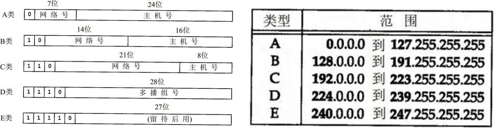
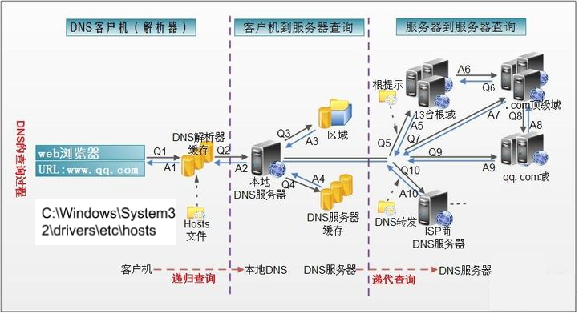
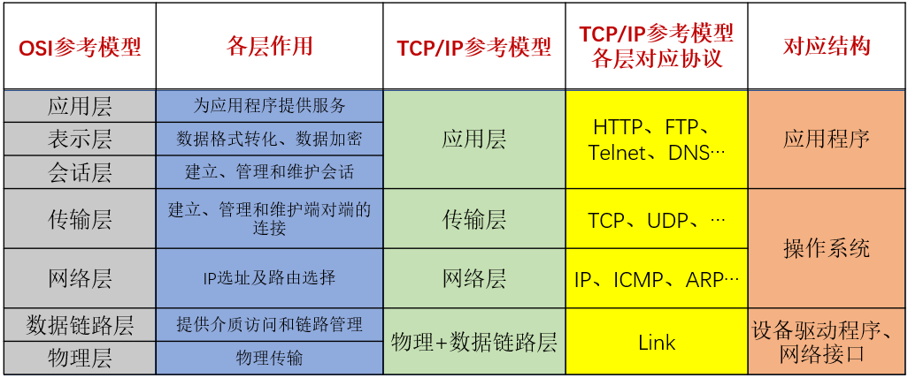
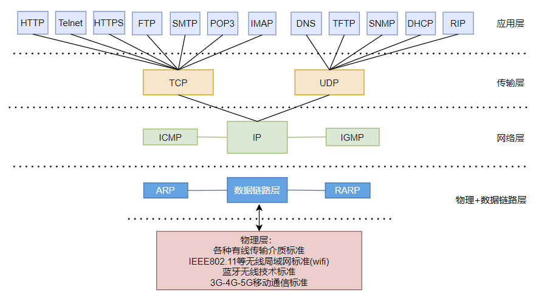
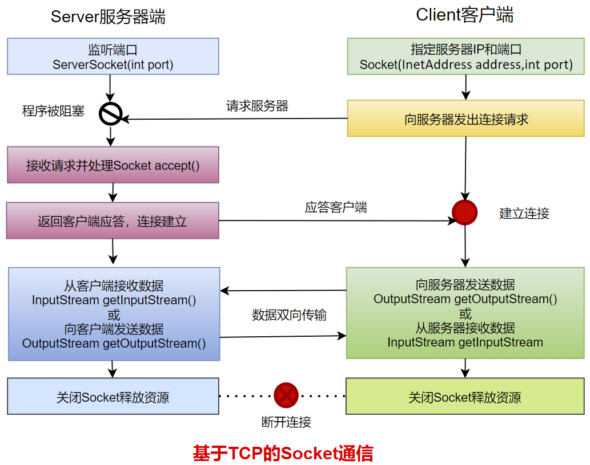
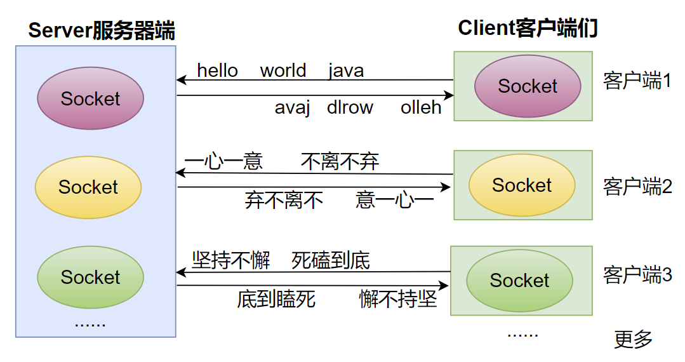
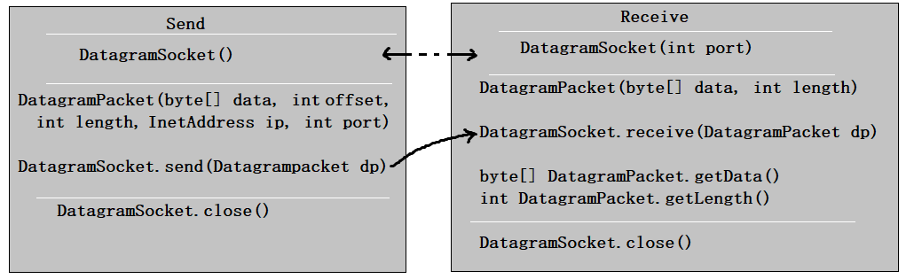

# 概述

Java提供的网络类库，可以实现无痛的网络连接，联网的底层细节被隐藏在 Java 的本机安装系统里，由 JVM 进行控制。

网络编程目的：直接或间接地通过网络协议与其它计算机实现数据交换，进行通讯

## 软件架构

**`C/S`架构** ：全称为`Client/Server`结构，是指客户端和服务器结构。常见程序有QQ、美团app、360安全卫士等软件。

**`B/S`架构** ：全称为`Browser/Server`结构，是指浏览器和服务器结构。常见浏览器有IE、谷歌、火狐等。


## 网络通信要素

### IP地址和域名

IP地址用来给网络中的一台计算机设备做唯一的编号。

IP地址的分类方式：

1. 方式一：IPV4、IPV6
   1. IPV4
   2. IPV6，为了扩大地址空间，通过IPv6重新定义地址空间，采用128位地址长度，共16个字节，写成8个无符号整数，每个整数用四个十六进制位表示，数之间用冒号（：）分开。比如：`ABCD:EF01:2345:6789:ABCD:EF01:2345:6789`
2. 方式二：公网地址( 万维网使用）和 私有地址( 局域网使用）
   1. 192.168.开头的就是私有地址，范围即为192.168.0.0--192.168.255.255
   2. 本地回环地址(hostAddress)：`127.0.0.1`  
   3. 主机名(hostName)：`localhost`

因为IP地址数字不便于记忆，因此出现了域名。域名容易记忆，当在连接网络时输入一个主机的域名后，域名服务器(DNS，Domain Name System，域名系统)负责将域名转化成IP地址，这样才能和主机建立连接。 

> 先找本地hosts，是否有输入的域名地址，没有的话，再通过DNS服务器找主机



1. 在浏览器中输入www . qq .com 域名，操作系统会先检查自己本地的`hosts文件`是否有这个网址映射关系，如果有，就先调用这个IP地址映射，完成域名解析。
2. 如果hosts里没有这个域名的映射，则查找`本地DNS解析器缓存`，是否有这个网址映射关系，如果有，直接返回，完成域名解析。
3. 如果hosts与本地DNS解析器缓存都没有相应的网址映射关系，首先会找`TCP/IP`参数中设置的首选DNS服务器，在此叫它`本地DNS服务器`，此服务器收到查询时，如果要查询的域名，包含在本地配置区域资源中，则返回解析结果给客户机，完成域名解析，此解析具有权威性。
4. 如果要查询的域名，不由本地DNS服务器区域解析，但该服务器已`缓存`了此网址映射关系，则调用这个IP地址映射，完成域名解析，此解析不具有权威性。
5. 如果本地DNS服务器本地区域文件与缓存解析都失效，则根据本地DNS服务器的设置（是否设置转发器）进行查询，如果未用转发模式，本地DNS就把请求发至13台根DNS，根DNS服务器收到请求后会判断这个域名(.com)是谁来授权管理，并会返回一个负责该顶级域名服务器的一个IP。本地DNS服务器收到IP信息后，将会联系负责.com域的这台服务器。这台负责.com域的服务器收到请求后，如果自己无法解析，它就会找一个管理.com域的下一级DNS服务器地址(`http://qq.com`)给本地DNS服务器。当本地DNS服务器收到这个地址后，就会找（`http://qq.com`)域服务器，重复上面的动作，进行查询，直至找到`www.qq.com`主机。
6. 如果用的是转发模式，此DNS服务器就会把请求转发至上一级DNS服务器，由上一级服务器进行解析，上一级服务器如果不能解析，或找根DNS或把转请求转至上上级，以此循环。不管是本地DNS服务器用是是转发，还是根提示，最后都是把结果返回给本地DNS服务器，由此DNS服务器再返回给客户机。

### 端口号

网络的通信，本质上是两个进程（应用程序）的通信。

**端口号**就可以唯一标识设备中的进程（应用程序）。

**端口号：用两个字节表示的整数，它的取值范围是0~65535**。

- 公认端口：0~1023。被预先定义的服务通信占用，如：HTTP（80），FTP（21），Telnet（23）
- 注册端口：1024~49151。分配给用户进程或应用程序。如：Tomcat（8080），MySQL（3306），Oracle（1521）。
- 动态/ 私有端口：49152~65535。

如果端口号被另外一个服务或应用所占用，会导致当前程序启动失败。

### 网络通信协议

`网络通信协议`：在计算机网络中，这些连接和通信的规则被称为网络通信协议，它对数据的传输格式、传输速率、传输步骤、出错控制等做了统一规定，通信双方必须同时遵守才能完成数据交换。

计算机网络通信涉及内容很多，比如指定源地址和目标地址，加密解密，压缩解压缩，差错控制，流量控制，路由控制，如何实现如此复杂的网络协议呢？`通信协议分层思想`。

在制定协议时，把复杂成份分解成一些简单的成份，再将它们复合起来。最常用的复合方式是层次方式，即`同层间可以通信、上一层可以调用下一层，而与再下一层不发生关系`。各层互不影响，利于系统的开发和扩展。

两套参考模型：

+ OSI参考模型：模型过于理想化，未能在因特网上进行广泛推广
+ TCP/IP参考模型(或TCP/IP协议)：事实上的国际标准。



**TCP/IP协议中的四层介绍：**

- `应用层`：应用层决定了向用户提供应用服务时通信的活动。主要协议有：HTTP协议、FTP协议、SNMP（简单网络管理协议）、SMTP（简单邮件传输协议）和POP3（Post Office Protocol 3的简称,即邮局协议的第3个版）等。
- `传输层`：主要使网络程序进行通信，在进行网络通信时，可以采用TCP协议，也可以采用UDP协议。TCP（Transmission Control Protocol）协议，即传输控制协议，是一种面向连接的、可靠的、基于字节流的传输层通信协议。UDP(User Datagram Protocol，用户数据报协议)：是一个无连接的传输层协议、提供面向事务的简单不可靠的信息传送服务。
- `网络层`：网络层是整个TCP/IP协议的核心，支持网间互连的数据通信。它主要用于将传输的数据进行分组，将分组数据发送到目标计算机或者网络。而IP协议是一种非常重要的协议。IP（internet protocal）又称为互联网协议。IP的责任就是把数据从源传送到目的地。它在源地址和目的地址之间传送一种称之为数据包的东西，它还提供对数据大小的重新组装功能，以适应不同网络对包大小的要求。

* `物理+数据链路层`：链路层是用于定义物理传输通道，通常是对某些网络连接设备的驱动协议，例如针对光纤、网线提供的驱动。



# 传输协议：TCP与UDP

通信的协议还是比较复杂的，`java.net` 包中包含的类和接口，它们提供低层次的通信细节。我们可以直接使用这些类和接口，来专注于网络程序开发，而不用考虑通信的细节。

`java.net` 包中提供了两种常见的网络协议的支持：

- **UDP**：用户数据报协议(User Datagram Protocol)。
- **TCP**：传输控制协议 (Transmission Control Protocol)。


**TCP协议：**

- TCP协议进行通信的两个应用进程：客户端、服务端。
- 使用TCP协议前，须先`建立TCP连接`，形成基于字节流的传输数据通道
- 传输前，采用“三次握手”方式，点对点通信，是`可靠的`
  - TCP协议使用`重发机制`，当一个通信实体发送一个消息给另一个通信实体后，需要收到另一个通信实体确认信息，如果没有收到另一个通信实体确认信息，则会再次重复刚才发送的消息。
- 在连接中可进行`大数据量的传输`
- 传输完毕，需`释放已建立的连接，效率低`

**UDP协议：**

- UDP协议进行通信的两个应用进程：发送端、接收端。
- 将数据、源、目的封装成数据包（传输的基本单位），`不需要建立连接`
- 发送不管对方是否准备好，接收方收到也不确认，不能保证数据的完整性，故是`不可靠的`
- 每个数据报的大小限制在`64K`内
- 发送数据结束时`无需释放资源，开销小，通信效率高`
- 适用场景：音频、视频和普通数据的传输。例如视频会议

# 网络编程API

## InetAddress类

InetAddress类主要表示IP地址，两个子类：Inet4Address、Inet6Address。

InetAddress 类没有提供公共的构造器，而是提供 了 如下几个 静态方法来获取InetAddress 实例

* public static InetAddress getLocalHost()
* public static InetAddress getByName(String host)
* public static InetAddress getByAddress(byte[] addr)

InetAddress 提供了如下几个常用的方法

* public String getHostAddress() ：返回 IP 地址字符串（以文本表现形式）
* public String getHostName() ：获取此 IP 地址的主机名
* public boolean isReachable(int timeout)：测试是否可以达到该地址

## Socket类

网络上具有唯一标识的**IP地址和端口号**组合在一起构成唯一能识别的标识符套接字（Socket）。

网络通信其实就是Socket间的通信。

Socket允许程序把网络连接当成一个流，数据在两个Socket间通过IO传输。

Socket分类：

- 流套接字（stream socket）：使用TCP提供可依赖的字节流服务
  - ServerSocket：此类实现TCP服务器套接字。服务器套接字等待请求通过网络传入。
  - Socket：此类实现客户端套接字（也可以就叫“套接字”）。套接字是两台机器间通信的端点。
- 数据报套接字（datagram socket）：使用UDP提供“尽力而为”的数据报服务
  - DatagramSocket：此类表示用来发送和接收UDP数据报包的套接字。

## Socket相关类API

**ServerSocket类**

+ 构造方法：ServerSocket(int port) ：创建绑定到特定端口的服务器套接字。
+ 常用方法：Socket accept()：侦听并接受到此套接字的连接。 

**Socket类**

+ 常用构造方法：
  + public Socket(InetAddress address,int port)：创建一个流套接字并将其连接到指定 IP 地址的指定端口号。
  + public Socket(String host,int port)：创建一个流套接字并将其连接到指定主机上的指定端口号。
+ 常用方法：
  + public InputStream getInputStream()：返回此套接字的输入流，可以用于接收消息
  + public OutputStream getOutputStream()：返回此套接字的输出流，可以用于发送消息
  + public InetAddress getInetAddress()：此套接字连接到的远程 IP 地址；如果套接字是未连接的，则返回 null。
  + public InetAddress getLocalAddress()：获取套接字绑定的本地地址。
  + public int getPort()：此套接字连接到的远程端口号；如果尚未连接套接字，则返回 0。
  + public int getLocalPort()：返回此套接字绑定到的本地端口。如果尚未绑定套接字，则返回 -1。
  + public void close()：关闭此套接字。套接字被关闭后，便不可在以后的网络连接中使用（即无法重新连接或重新绑定）。需要创建新的套接字对象。 关闭此套接字也将会关闭该套接字的 InputStream 和 OutputStream。 
  + public void shutdownInput()：如果在套接字上调用 shutdownInput() 后从套接字输入流读取内容，则流将返回 EOF（文件结束符）。 即不能在从此套接字的输入流中接收任何数据。
  + public void shutdownOutput()：禁用此套接字的输出流。对于 TCP 套接字，任何以前写入的数据都将被发送，并且后跟 TCP 的正常连接终止序列。 如果在套接字上调用 shutdownOutput() 后写入套接字输出流，则该流将抛出 IOException。 即不能通过此套接字的输出流发送任何数据。

> **注意：**先后调用Socket的shutdownInput()和shutdownOutput()方法，仅仅关闭了输入流和输出流，并不等于调用Socket的close()方法。在通信结束后，仍然要调用Scoket的close()方法，因为只有该方法才会释放Socket占用的资源，比如占用的本地端口号等。

**DatagramSocket类**

常用方法：

* public DatagramSocket(int port)创建数据报套接字并将其绑定到本地主机上的指定端口。套接字将被绑定到通配符地址，IP 地址由内核来选择。
* public DatagramSocket(int port,InetAddress laddr)创建数据报套接字，将其绑定到指定的本地地址。本地端口必须在 0 到 65535 之间（包括两者）。如果 IP 地址为 0.0.0.0，套接字将被绑定到通配符地址，IP 地址由内核选择。 
* public void close()关闭此数据报套接字。 
* public void send(DatagramPacket p)从此套接字发送数据报包。DatagramPacket 包含的信息指示：将要发送的数据、其长度、远程主机的 IP 地址和远程主机的端口号。 
* public void receive(DatagramPacket p)从此套接字接收数据报包。当此方法返回时，DatagramPacket 的缓冲区填充了接收的数据。数据报包也包含发送方的 IP 地址和发送方机器上的端口号。 此方法在接收到数据报前一直阻塞。数据报包对象的 length 字段包含所接收信息的长度。如果信息比包的长度长，该信息将被截短。 
* public InetAddress getLocalAddress()获取套接字绑定的本地地址。
* public int getLocalPort()返回此套接字绑定的本地主机上的端口号。 
* public InetAddress getInetAddress()返回此套接字连接的地址。如果套接字未连接，则返回 null。
* public int getPort()返回此套接字的端口。如果套接字未连接，则返回 -1。

**DatagramPacket类**

常用方法：

* public DatagramPacket(byte[] buf,int length)构造 DatagramPacket，用来接收长度为 length 的数据包。 length 参数必须小于等于 buf.length。
* public DatagramPacket(byte[] buf,int length,InetAddress address,int port)构造数据报包，用来将长度为 length 的包发送到指定主机上的指定端口号。length 参数必须小于等于 buf.length。
* public InetAddress getAddress()返回某台机器的 IP 地址，此数据报将要发往该机器或者是从该机器接收到的。
* public int getPort()返回某台远程主机的端口号，此数据报将要发往该主机或者是从该主机接收到的。
* `public byte[] getData()`返回数据缓冲区。接收到的或将要发送的数据从缓冲区中的偏移量 offset 处开始，持续 length 长度。
* `public int getLength()`返回将要发送或接收到的数据的长度。


# TCP网络编程

## 通信模型

Java语言的基于套接字TCP编程分为服务端编程和客户端编程，其通信模型如图所示：



## 开发步骤

**客户端程序包含以下四个基本的步骤 ：**

* 创建 Socket ：根据指定服务端的 IP 地址或端口号构造 Socket 类对象。若服务器端响应，则建立客户端到服务器的通信线路。若连接失败，会出现异常。
* 打开连接到 Socket  的输入`/ `出流： 使用 getInputStream()方法获得输入流，使用getOutputStream()方法获得输出流，进行数据传输
* 按照一定的协议对 Socket 进行读`/` 写操作：通过输入流读取服务器放入线路的信息（但不能读取自己放入线路的信息），通过输出流将信息写入线路。
* 关闭 Socket ：断开客户端到服务器的连接，释放线路

**服务器端程序包含以下四个基本的 步骤：**

* 调用 ServerSocket(int port)  ：创建一个服务器端套接字，并绑定到指定端口上。用于监听客户端的请求。
* 调用 accept() ：监听连接请求，如果客户端请求连接，则接受连接，返回通信套接字对象。
* 调用  该Socket 类对象的 getOutputStream()  和 getInputStream () ：获取输出流和输入流，开始网络数据的发送和接收。
* 关闭Socket 对象：客户端访问结束，关闭通信套接字。


## 案例

### 单个客户端与服务器单次通信

服务器端：

```java
import java.io.InputStream;
import java.io.OutputStream;
import java.net.InetAddress;
import java.net.ServerSocket;
import java.net.Socket;

public class Server {

    public static void main(String[] args)throws Exception {
        //1、准备一个ServerSocket对象，并绑定8888端口
        ServerSocket server =  new ServerSocket(8888);
        System.out.println("等待连接....");

        //2、在8888端口监听客户端的连接，该方法是个阻塞的方法，如果没有客户端连接，将一直等待
        Socket socket = server.accept();
        InetAddress inetAddress = socket.getInetAddress();
        System.out.println(inetAddress.getHostAddress() + "客户端连接成功！！");

        //3、获取输入流，用来接收该客户端发送给服务器的数据
        InputStream input = socket.getInputStream();
        //接收数据
        byte[] data = new byte[1024];
        StringBuilder s = new StringBuilder();
        int len;
        while ((len = input.read(data)) != -1) {
            s.append(new String(data, 0, len));
        }
        System.out.println(inetAddress.getHostAddress() + "客户端发送的消息是：" + s);

        //4、获取输出流，用来发送数据给该客户端
        OutputStream out = socket.getOutputStream();
        //发送数据
        out.write("欢迎登录".getBytes());
        out.flush();

        //5、关闭socket，不再与该客户端通信
        //socket关闭，意味着InputStream和OutputStream也关闭了
        socket.close();

        //6、如果不再接收任何客户端通信，可以关闭ServerSocket
        server.close();
    }
}

```

客户端：

```java
import java.io.InputStream;
import java.io.OutputStream;
import java.net.Socket;

public class Client {

    public static void main(String[] args) throws Exception {
        // 1、准备Socket，连接服务器，需要指定服务器的IP地址和端口号
        Socket socket = new Socket("127.0.0.1", 8888);

        // 2、获取输出流，用来发送数据给服务器
        OutputStream out = socket.getOutputStream();
        // 发送数据
        out.write("lalala".getBytes());
        //会在流末尾写入一个“流的末尾”标记，对方才能读到-1，否则对方的读取方法会一致阻塞
        socket.shutdownOutput();

        //3、获取输入流，用来接收服务器发送给该客户端的数据
        InputStream input = socket.getInputStream();
        // 接收数据
        byte[] data = new byte[1024];
        StringBuilder s = new StringBuilder();
        int len;
        while ((len = input.read(data)) != -1) {
            s.append(new String(data, 0, len));
        }
        System.out.println("服务器返回的消息是：" + s);

        //4、关闭socket，不再与服务器通信，即断开与服务器的连接
        //socket关闭，意味着InputStream和OutputStream也关闭了
        socket.close();
    }
}

```

### 多个客户端与服务器之间的多次通信



服务器端代码：

```java
public class Server {
    public static void main(String[] args) throws IOException {
        // 1、准备一个ServerSocket
        ServerSocket server = new ServerSocket(8888);
        System.out.println("等待连接...");

        int count = 0;
        while(true){
            // 2、监听一个客户端的连接
            Socket socket = server.accept();
            System.out.println("第" + ++count + "个客户端"+socket.getInetAddress().getHostAddress()+"连接成功！！");

            ClientHandlerThread ct = new ClientHandlerThread(socket);
            ct.start();
        }

        //这里没有关闭server，永远监听
    }
    static class ClientHandlerThread extends Thread{
        private Socket socket;
        private String ip;

        public ClientHandlerThread(Socket socket) {
            super();
            this.socket = socket;
            ip = socket.getInetAddress().getHostAddress();
        }

        public void run(){
            try{
                //（1）获取输入流，用来接收该客户端发送给服务器的数据
                BufferedReader br = new BufferedReader(new InputStreamReader(socket.getInputStream()));
                //（2）获取输出流，用来发送数据给该客户端
                PrintStream ps = new PrintStream(socket.getOutputStream());
                String str;
                // （3）接收数据
                while ((str = br.readLine()) != null) {
                    //（4）反转
                    StringBuilder word = new StringBuilder(str);
                    word.reverse();

                    //（5）返回给客户端
                    ps.println(word);
                }
                System.out.println("客户端" + ip+"正常退出");
            }catch(Exception  e){
                System.out.println("客户端" + ip+"意外退出");
            }finally{
                try {
                    //（6）断开连接
                    socket.close();
                } catch (IOException e) {
                    e.printStackTrace();
                }
            }
        }
    }
}

```

客户端代码：

```java
public class Client {
    public static void main(String[] args) throws Exception {
        // 1、准备Socket，连接服务器，需要指定服务器的IP地址和端口号
        Socket socket = new Socket("127.0.0.1", 8888);

        // 2、获取输出流，用来发送数据给服务器
        OutputStream out = socket.getOutputStream();
        PrintStream ps = new PrintStream(out);

        // 3、获取输入流，用来接收服务器发送给该客户端的数据
        InputStream input = socket.getInputStream();
        BufferedReader br;
        if(args!= null && args.length>0) {
            String encoding = args[0];
            br = new BufferedReader(new InputStreamReader(input,encoding));
        }else{
            br = new BufferedReader(new InputStreamReader(input));
        }

        Scanner scanner = new Scanner(System.in);
        while(true){
            System.out.println("输入发送给服务器的单词或成语：");
            String message = scanner.nextLine();
            if(message.equals("stop")){
                socket.shutdownOutput();
                break;
            }

            // 4、 发送数据
            ps.println(message);
            // 接收数据
            String feedback  = br.readLine();
            System.out.println("从服务器收到的反馈是：" + feedback);
        }

        //5、关闭socket，断开与服务器的连接
        scanner.close();
        socket.close();
    }
}
```

# UDP网络编程

## 通信模型

UDP适用于一次只传送少量数据、对可靠性要求不高的应用环境，数据报大小限制在64K以下。



 UDP数据报通过数据报套接字 DatagramSocket 发送和接收，系统不保证  UDP数据报一定能够安全送到目的地，也不能确定什么时候可以抵达。

 DatagramPacket 对象封装了UDP数据报，在数据报中包含了发送端的IP地址和端口号以及接收端的IP地址和端口号。

 UDP协议中每个数据报都给出了完整的地址信息，因此无须建立发送方和接收方的连接。如同发快递包裹一样。


## 开发步骤

**发送端程序包含以下四个基本的步骤：**

* 创建DatagramSocket ：默认使用系统随机分配端口号。
* 创建DatagramPacket：将要发送的数据用字节数组表示，并指定要发送的数据长度，接收方的IP地址和端口号。
* 调用  该DatagramSocket 类对象的 send方法 ：发送数据报DatagramPacket对象。
* 关闭DatagramSocket 对象：发送端程序结束，关闭通信套接字。

**接收端程序包含以下四个基本的步骤 ：**

* 创建DatagramSocket ：指定监听的端口号。
* 创建DatagramPacket：指定接收数据用的字节数组，起到临时数据缓冲区的效果，并指定最大可以接收的数据长度。
* 调用  该DatagramSocket 类对象的receive方法 ：接收数据报DatagramPacket对象。。
* 关闭DatagramSocket ：接收端程序结束，关闭通信套接字。

## 案例：发送和接收消息

基于UDP协议的网络编程仍然需要在通信实例的两端各建立一个Socket，但这两个Socket之间并没有虚拟链路，这两个Socket只是发送、接收数据报的对象，Java提供了DatagramSocket对象作为基于UDP协议的Socket，使用DatagramPacket代表DatagramSocket发送、接收的数据报。

发送方：

```java
public class Send {

    public static void main(String[] args)throws Exception {
//		1、建立发送端的DatagramSocket
        DatagramSocket ds = new DatagramSocket();

        //要发送的数据
        ArrayList<String> all = new ArrayList<String>();
        all.add("java！");
        all.add("python！");
        all.add("c++！");
        all.add("js！");

        //接收方的IP地址
        InetAddress ip = InetAddress.getByName("127.0.0.1");
        //接收方的监听端口号
        int port = 9999;
        //发送多个数据报
        for (int i = 0; i < all.size(); i++) {
//			2、建立数据包DatagramPacket
            byte[] data = all.get(i).getBytes();
            DatagramPacket dp = new DatagramPacket(data, 0, data.length, ip, port);
//			3、调用Socket的发送方法
            ds.send(dp);
        }

//		4、关闭Socket
        ds.close();
    }
}
```

接收方：

```java
public class Receive {

    public static void main(String[] args) throws Exception {
//		1、建立接收端的DatagramSocket，需要指定本端的监听端口号
        DatagramSocket ds = new DatagramSocket(9999);

        //一直监听数据
        while(true){
            //2、建立数据包DatagramPacket
            byte[] buffer = new byte[1024*64];
            DatagramPacket dp = new DatagramPacket(buffer,buffer.length);

            //3、调用Socket的接收方法
            ds.receive(dp);

            //4、拆封数据
            String str = new String(dp.getData(),0,dp.getLength());
            System.out.println(str);
        }

//        ds.close();
    }
}
```

# URL编程

## URL类

URL(Uniform Resource Locator)：统一资源定位符，它表示 Internet 上某一资源的地址。

通过 URL 可以访问 Internet 上的各种网络资源，比如最常见的 www，ftp 站点。浏览器通过解析给定的 URL 可以在网络上查找相应的文件或其他资源。 

URL的基本结构由5部分组成：

```http
<传输协议>://<主机名>:<端口号>/<文件名>#片段名?参数列表
```

为了表示URL，java.net 中实现了类 URL。可以通过下面的构造器来初始化一个 URL 对象：

- public URL (String spec)：通过一个表示URL地址的字符串可以构造一个URL对象。如：`URL url = new URL("http://www. atguigu.com/"); `

- public URL(URL context, String spec)：通过基 URL 和相对 URL 构造一个 URL 对象。如：`URL downloadUrl = new URL(url, “download.html")`

- public URL(String protocol, String host, String file); 如：`URL url = new URL("http", "www.atguigu.com", “download. html");`

- public URL(String protocol, String host, int port, String file); 如: `URL gamelan = new URL("http", "www.atguigu.com", 80, “download.html");`


URL类的构造器都声明抛出非运行时异常，必须要对这一异常进行处理，通常是用 try-catch 语句进行捕获。


## URL类常用方法

一个URL对象生成后，其属性是不能被改变的，但可以通过它给定的方法来获取这些属性：

- public String getProtocol( )   获取该URL的协议名

- public String getHost( )      获取该URL的主机名

- public String getPort( )      获取该URL的端口号

- public String getPath( )      获取该URL的文件路径

- public String getFile( )       获取该URL的文件名

- public String getQuery(  )    获取该URL的查询名

