# 集合概述

Java 集合可分为 Collection 和 Map 两大体系：

- Collection接口：用于存储一个一个的数据，也称`单列数据集合`。
  - List子接口：用来存储有序的、可以重复的数据（主要用来替换数组，"动态"数组）
    - 实现类：ArrayList(主要实现类)、LinkedList、Vector
  - Set子接口：用来存储无序的、不可重复的数据（类似于高中讲的"集合"）
    - 实现类：HashSet(主要实现类)、LinkedHashSet、TreeSet
- Map接口：用于存储具有映射关系“key-value对”的集合，即一对一对的数据，也称`双列数据集合`。
  - HashMap(主要实现类)、LinkedHashMap、TreeMap、Hashtable、Properties

- JDK提供的集合API位于java.util包内

- 集合框架图：

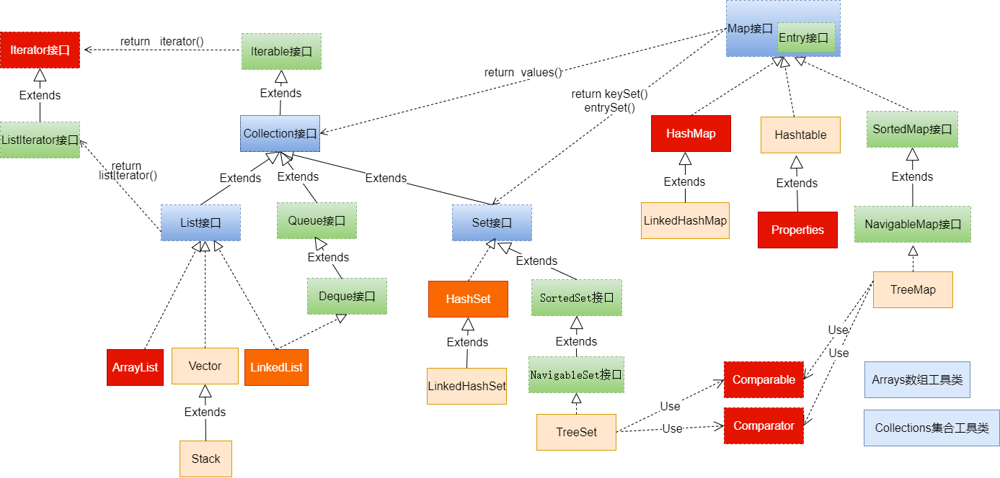

# Collection接口及方法

- JDK不提供此接口的任何直接实现，而是提供更具体的子接口（如：Set和List）去实现。
- Collection 接口是 List和Set接口的父接口，该接口里定义的方法既可用于操作 Set 集合，也可用于操作 List 集合。

## 添加

1. add(E obj)：添加元素对象到当前集合中
2. addAll(Collection other)：添加other集合中的所有元素对象到当前集合中

add和addAll的区别：

```java
import org.junit.Test;

import java.util.ArrayList;
import java.util.Collection;

public class TestCollectionAdd {

    @Test
    public void testAddAll(){
        Collection c1 = new ArrayList();
        c1.add(1);
        c1.add(2);
        System.out.println("c1 = " + c1); // c1 = [1, 2]

        Collection c2 = new ArrayList();
        c2.add(1);
        c2.add(2);
        System.out.println("c2 = " + c2); // c2 = [1, 2]

        Collection other = new ArrayList();
        other.add(1);
        other.add(2);
        other.add(3);
        System.out.println("other = " + other); // other = [1, 2, 3]

        c1.addAll(other);
        System.out.println("c1集合元素的个数：" + c1.size());//5
        System.out.println("c1.addAll(other) = " + c1); // c1.addAll(other) = [1, 2, 1, 2, 3]

        c2.add(other);
        System.out.println("c2集合元素的个数：" + c2.size());//3
        System.out.println("c2.add(other) = " + c2); // c2.add(other) = [1, 2, [1, 2, 3]]
    }
}
```

## 判断

1. int size()：获取当前集合中实际存储的元素个数
2. boolean isEmpty()：判断当前集合是否为空集合
3. boolean contains(Object obj)：判断当前集合中是否存在一个与obj对象equals返回true的元素
4. boolean containsAll(Collection coll)：判断coll集合中的元素是否在当前集合中都存在。即coll集合是否是当前集合的“子集”
5. boolean equals(Object obj)：判断当前集合与obj是否相等

## 删除

1. void clear()：清空集合元素
2. boolean remove(Object obj) ：从当前集合中删除第一个找到的与obj对象equals返回true的元素。
3. boolean removeAll(Collection coll)：从当前集合中删除所有与coll集合中相同的元素。
4. boolean retainAll(Collection coll)：从当前集合中删除两个集合中不同的元素，使得当前集合仅保留与coll集合中的元素相同的元素，即当前集合中仅保留两个集合的交集，

## 其他

1. Object[] toArray()：返回包含当前集合中所有元素的数组
2. hashCode()：获取集合对象的哈希值
3. iterator()：返回迭代器对象，用于集合遍历

# Iterator（迭代器）接口

## Iterator接口

- 在程序开发中，经常需要遍历集合中的所有元素。针对这种需求，JDK专门提供了一个接口`java.util.Iterator`。
  - Collection接口与Map接口主要用于`存储`元素
  - `Iterator`，被称为迭代器接口，本身并不提供存储对象的能力，主要用于`遍历`Collection中的元素


- Collection接口继承了java.lang.Iterable接口，该接口有一个iterator()方法，那么所有实现了Collection接口的集合类都有一个iterator()方法，用以返回一个实现了Iterator接口的对象。
  - `public Iterator iterator()`: 获取集合对应的迭代器，用来遍历集合中的元素的。
  - 集合对象每次调用iterator()方法都得到一个全新的迭代器对象，默认游标都在集合的第一个元素之前。

- Iterator接口的常用方法如下：
  - `public E next()`:返回迭代的下一个元素。
  - `public boolean hasNext()`:如果仍有元素可以迭代，则返回 true。

- 注意：在调用it.next()方法之前必须要调用it.hasNext()进行检测。若不调用，直接调用it.next()会抛出`NoSuchElementException异常`。

```java
import org.junit.Test;
import java.util.ArrayList;
import java.util.Collection;
import java.util.Iterator;

public class TestIterator {

    @Test
    public void test01(){
        Collection coll = new ArrayList();
        coll.add("小李广");
        coll.add("扫地僧");
        coll.add("石破天");

        Iterator iterator = coll.iterator();//获取迭代器对象
        while(iterator.hasNext()) {//判断是否还有元素可迭代
            System.out.println(iterator.next());//取出下一个元素
        }
    }
}

```

## 迭代器的执行原理


使用Iterator迭代器删除元素：java.util.Iterator迭代器中有一个方法：void remove() ;

```java
Iterator iter = coll.iterator();//回到起点
while(iter.hasNext()){
    Object obj = iter.next();
    if(obj.equals("Tom")){
        iter.remove();
    }
}
```

- Iterator可以删除集合的元素，但是遍历过程中通过迭代器对象的remove方法，不是集合对象的remove方法。
- 如果还未调用next()或在上一次调用 next() 方法之后已经调用了 remove() 方法，再调用remove()都会报IllegalStateException。
- 在JDK8.0时，Collection接口有了removeIf 方法，即可以根据条件删除。

```java
import org.junit.Test;
import java.util.ArrayList;
import java.util.Collection;
import java.util.Iterator;
import java.util.function.Predicate;

public class TestIteratorRemove {
    @Test
    public void test01(){
        Collection coll = new ArrayList();
        coll.add(1);
        coll.add(2);
        coll.add(3);
        coll.add(4);
        coll.add(5);
        coll.add(6);

        Iterator iterator = coll.iterator();
        while(iterator.hasNext()){
            Integer element = (Integer) iterator.next();
            if(element % 2 == 0){
                iterator.remove();
            }
        }
        System.out.println(coll); // [1, 3, 5]
    }

    @Test
    public void test02(){
        Collection coll = new ArrayList();
        coll.add("小李广");
        coll.add("扫地僧");
        coll.add("石破天");
        coll.add("佛地魔");
        System.out.println("coll = " + coll);

        coll.removeIf(new Predicate() {
            @Override
            public boolean test(Object o) {
                String str = (String) o;
                return str.contains("地");
            }
        });
        System.out.println("删除包含\"地\"字的元素之后coll = " + coll);
        // 删除包含"地"字的元素之后coll = [小李广, 石破天]
    }
}

```

## foreach循环

foreach循环（也称增强for循环）是 JDK5.0 中定义的一个高级for循环，专门用来`遍历数组和集合`的。

foreach循环用于遍历Collection和数组。通常只进行遍历元素，不要在遍历的过程中对集合元素进行增删操作。

语法格式：

```java
for(元素的数据类型 局部变量 : Collection集合或数组){ 
  	//操作局部变量的输出操作
}
```

> 对于集合的遍历，增强for的内部原理其实是个Iterator迭代器

```java
import org.junit.Test;
import java.util.ArrayList;
import java.util.Collection;

public class TestForeach {
    @Test
    public void test01(){
        Collection coll = new ArrayList();
        coll.add("小李广");
        coll.add("扫地僧");
        coll.add("石破天");
        //foreach循环其实就是使用Iterator迭代器来完成元素的遍历的。
        for (Object o : coll) {
            System.out.println(o);
        }
    }
    @Test
    public void test02(){
        int[] nums = {1,2,3,4,5};
        for (int num : nums) {
            System.out.println(num);
        }
        System.out.println("-----------------");
        String[] names = {"张三","李四","王五"};
        for (String name : names) {
            System.out.println(name);
        }
    }

    @Test
    public void test03(){
        String[] str = new String[5];
        for (String myStr : str) {
            myStr = "demo";
            System.out.println(myStr); //demo
        }
        for (int i = 0; i < str.length; i++) {
            System.out.println(str[i]); // null
        }
        /*
        增强for循环会依次将数组str中的每个元素赋值给临时变量myStr。
        myStr只是一个临时变量，它存储的是数组元素的副本，而不是数组元素本身的引用。
        当执行myStr = "demo";时，只是将临时变量myStr指向了新的字符串对象"demo"，并没有改变数组str中元素的引用。
        所以，在增强for循环中打印myStr时，会输出"demo"，但数组str中的元素仍然是null
         */
    }
}
```

# Collection子接口：List

## List接口特点

- 鉴于Java中数组用来存储数据的局限性，通常使用`java.util.List`替代数组
- List集合类中`元素有序`、且`可重复`，集合中的每个元素都有其对应的顺序索引。
- JDK API中List接口的实现类常用的有：`ArrayList`、`LinkedList`和`Vector`。

## List接口方法

List除了从Collection集合继承的方法外，List 集合里添加了一些`根据索引`来操作集合元素的方法。

- 插入元素
  - `void add(int index, Object ele)`:在index位置插入ele元素
  - boolean addAll(int index, Collection eles):从index位置开始将eles中的所有元素添加进来
- 获取元素
  - `Object get(int index)`:获取指定index位置的元素
  - List subList(int fromIndex, int toIndex):返回从fromIndex到toIndex位置的子集合
- 获取元素索引
  - int indexOf(Object obj):返回obj在集合中首次出现的位置
  - int lastIndexOf(Object obj):返回obj在当前集合中末次出现的位置
- 删除和替换元素
  - `Object remove(int index)`:移除指定index位置的元素，并返回此元素

  - `Object set(int index, Object ele)`:设置指定index位置的元素为ele

> 注意：在JavaSE中List名称的类型有两个，一个是java.util.List集合接口，一个是java.awt.List图形界面的组件，别导错包了。

## List接口实现类：ArrayList

- ArrayList 是 List 接口的`主要实现类`

- 本质上，ArrayList是对象引用的一个”变长”数组

- Arrays.asList(…) 方法返回的 List 集合，既不是 ArrayList 实例，也不是 Vector 实例。 Arrays.asList(…) 返回值是一个固定长度的 List 集合

### 相关方法图示

**ArrayList采用数组作为底层实现**

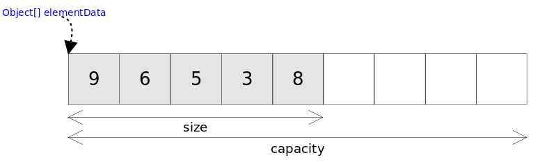

**ArrayList自动扩容过程**

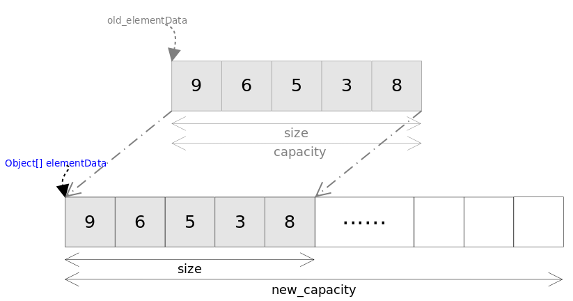

**ArrayList的add(E e)方法**

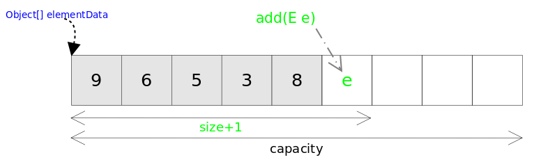

**ArrayList的add(int index,E e)方法**

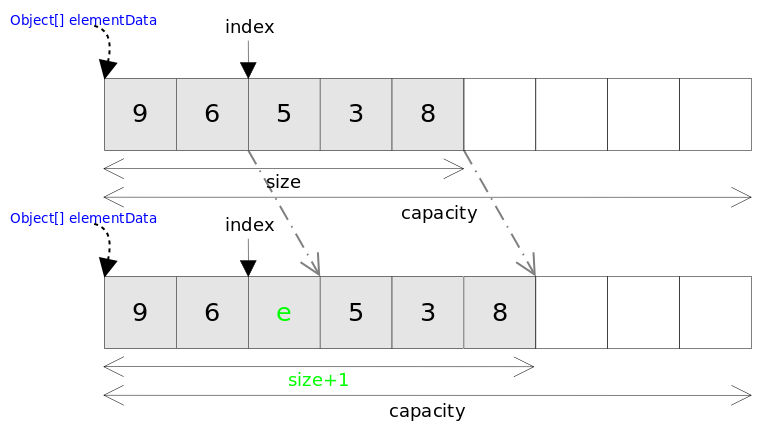

## List接口实现类：LinkedList

+ 对于频繁的插入或删除元素的操作，建议使用LinkedList类，效率较高。这是由底层采用链表（双向链表）结构存储数据决定的。

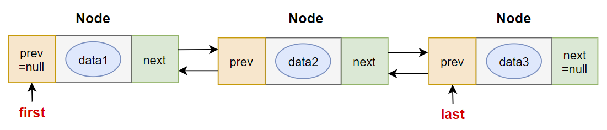

+ 特有方法：

  - void addFirst(Object obj)

  - void addLast(Object obj)	

  - Object getFirst()

  - Object getLast()

  - Object removeFirst()

  - Object removeLast()

### 链表与动态数组的区别

动态数组底层的物理结构是数组，因此根据索引访问的效率非常高。但是非末尾位置的插入和删除效率不高，因为涉及到移动元素。另外添加操作时涉及到扩容问题，就会增加时空消耗。

链表底层的物理结构是链表，因此根据索引访问的效率不高，即查找元素慢。但是插入和删除不需要移动元素，只需要修改前后元素的指向关系即可，所以插入、删除元素快。而且链表的添加不会涉及到扩容问题。

## List接口实现类：Vector

- Vector 是一个`古老`的集合，JDK1.0就有了。大多数操作与ArrayList相同，区别之处在于Vector是`线程安全`的。
- 在各种List中，最好把`ArrayList作为默认选择`。当插入、删除频繁时，使用LinkedList；Vector总是比ArrayList慢，所以尽量避免使用。
- 特有方法：
  - void addElement(Object obj)
  - void insertElementAt(Object obj,int index)
  - void setElementAt(Object obj,int index)
  - void removeElement(Object obj)
  - void removeAllElements()


## ArrayList和Vector的区别

底层物理结构都是数组，称为动态数组。

* ArrayList是新版的动态数组，线程不安全，效率高，Vector是旧版的动态数组，线程安全，效率低。
* 动态数组的扩容机制不同，ArrayList默认扩容为原来的1.5倍，Vector默认扩容增加为原来的2倍。
* 数组的初始化容量，如果在构建ArrayList与Vector的集合对象时，没有显式指定初始化容量，那么Vector的内部数组的初始容量默认为10，而ArrayList在JDK 6.0 及之前的版本也是10，JDK8.0 之后的版本ArrayList初始化为长度为0的空数组，之后在添加第一个元素时，再创建长度为10的数组。原因：
  * 用的时候，再创建数组，避免浪费。因为很多方法的返回值是ArrayList类型，需要返回一个ArrayList的对象，例如：后期从数据库查询对象的方法，返回值很多就是ArrayList。有可能要查询的数据不存在，要么返回null，要么返回一个没有元素的ArrayList对象。

# Collection子接口：Set

## Set接口概述

- Set接口是Collection的子接口，Set接口相较于Collection接口没有提供额外的方法
- Set 集合不允许包含相同的元素。
- Set集合支持的遍历方式和Collection集合一样：foreach和Iterator。
- Set的常用实现类有：HashSet、TreeSet、LinkedHashSet。

## Set接口实现类：HashSet

### HashSet概述

- HashSet 是 Set 接口的主要实现类，大多数时候使用 Set 集合时都使用这个实现类。

- HashSet 按 Hash 算法来存储集合中的元素，因此具有很好的存储、查找、删除性能。

- HashSet 具有以下`特点`：
  - 不能保证元素的排列顺序
  - HashSet 不是线程安全的
  - 集合元素可以是 null

- HashSet 集合`判断两个元素相等的标准`：两个对象通过 `hashCode()` 方法得到的哈希值相等，并且两个对象的 `equals() `方法返回值为true。

- 对于存放在Set容器中的对象，**对应的类一定要重写hashCode()和equals(Object obj)方法**，以实现对象相等规则。

- HashSet集合中元素的无序性，不等同于随机性。这里的无序性与元素的添加位置有关。具体来说：我们在添加每一个元素到数组中时，具体的存储位置是由元素的hashCode()调用后返回的hash值决定的。导致在数组中每个元素不是依次紧密存放的，表现出一定的无序性。

### HashSet添加元素的过程

- 第1步：当向 HashSet 集合中存入一个元素时，HashSet 会调用该对象的 hashCode() 方法得到该对象的 hashCode值，然后根据 hashCode值，通过某个散列函数决定该对象在 HashSet 底层数组中的存储位置。

- 第2步：如果要在数组中存储的位置上没有元素，则直接添加成功。

- 第3步：如果要在数组中存储的位置上有元素，则继续比较：

  - 如果两个元素的hashCode值不相等，则添加成功；
  - 如果两个元素的hashCode()值相等，则会继续调用equals()方法：
    - 如果equals()方法结果为false，则添加成功。
    - 如果equals()方法结果为true，则添加失败。

> 第2步添加成功，元素会保存在底层数组中。
>
> 第3步两种添加成功的操作，由于该底层数组的位置已经有元素了，则会通过`链表`的方式继续链接，存储。

```java
import org.junit.Test;
import java.util.HashSet;
import java.util.Objects;

public class TestHashSet {
    @Test
    public void test01(){
        HashSet set = new HashSet();
        set.add("张三");
        set.add("张三");
        set.add("李四");
        set.add("王五");
        set.add("王五");
        set.add("赵六");

        System.out.println("set = " + set);
        // set = [李四, 张三, 王五, 赵六]
    }

    @Test
    public void test02(){
        HashSet set = new HashSet();
        set.add(new MyDate(2021,1,1));
        set.add(new MyDate(2021,1,1));
        set.add(new MyDate(2022,2,4));
        set.add(new MyDate(2022,2,4));
        
        System.out.println("set = " + set);
        // set = [MyDate{year=2022, month=2, day=4}, MyDate{year=2021, month=1, day=1}]
    }
}


class MyDate {
    private int year;
    private int month;
    private int day;

    public MyDate(int year, int month, int day) {
        this.year = year;
        this.month = month;
        this.day = day;
    }

    @Override
    public boolean equals(Object o) {
        if (this == o) return true;
        if (o == null || getClass() != o.getClass()) return false;
        MyDate myDate = (MyDate) o;
        return year == myDate.year &&
                month == myDate.month &&
                day == myDate.day;
    }

    @Override
    public int hashCode() {
        return Objects.hash(year, month, day);
    }

    @Override
    public String toString() {
        return "MyDate{" +
                "year=" + year +
                ", month=" + month +
                ", day=" + day +
                '}';
    }
}
```

### 重写hashCode()方法的基本原则

- 在程序运行时，同一个对象多次调用 hashCode() 方法应该返回相同的值。
- 当两个对象的 equals() 方法比较返回 true 时，这两个对象的 hashCode() 方法的返回值也应相等。
- 对象中用作 equals() 方法比较的 Field，都应该用来计算 hashCode 值。


> 注意：如果两个元素的 equals() 方法返回 true，但它们的 hashCode() 返回值不相等，hashSet 将会把它们存储在不同的位置，但依然可以添加成功。

### 重写equals()方法的基本原则

- 重写equals方法的时候一般都需要同时复写hashCode方法。通常参与计算hashCode的对象的属性也应该参与到equals()中进行计算。

- 开发中直接调用IDEA里的快捷键自动重写equals()和hashCode()方法即可。

- 为什么用IDEA复写hashCode方法，有31这个数字？
  - 首先，选择系数的时候要选择尽量大的系数。因为如果计算出来的hash地址越大，所谓的“冲突”就越少，查找起来效率也会提高。（减少冲突）
  - 其次，31只占用5bits,相乘造成数据溢出的概率较小。
  - 再次，31可以 由i*31== (i<<5)-1来表示,现在很多虚拟机里面都有做相关优化。（提高算法效率）
  - 最后，31是一个素数，素数作用就是如果我用一个数字来乘以这个素数，那么最终出来的结果只能被素数本身和被乘数还有1来整除！(减少冲突)


## Set接口实现类：LinkedHashSet

- LinkedHashSet 是 HashSet 的子类，不允许集合元素重复。

- LinkedHashSet 根据元素的 hashCode 值来决定元素的存储位置，但它同时使用`双向链表`维护元素的次序，这使得元素看起来是以`添加顺序`保存的。

- LinkedHashSet`插入性能略低`于 HashSet，但在`迭代访问` Set 里的全部元素时有很好的性能。


## Set接口实现类：TreeSet

- TreeSet 是 SortedSet 接口的实现类，TreeSet 可以按照添加的元素的指定的属性的大小顺序进行遍历。
- TreeSet底层使用`红黑树`结构存储数据
- 新增的方法如下： (了解)
  - Comparator comparator()
  - Object first()
  - Object last()
  - Object lower(Object e)
  - Object higher(Object e)
  - SortedSet subSet(fromElement, toElement)
  - SortedSet headSet(toElement)
  - SortedSet tailSet(fromElement)
- TreeSet 两种排序方法：`自然排序`和`定制排序`。默认情况下，TreeSet 采用自然排序。
  - `自然排序`：TreeSet 会调用集合元素的 compareTo(Object obj) 方法来比较元素之间的大小关系，然后将集合元素按升序(默认情况)排列。
    - 如果试图把一个对象添加到 TreeSet 时，则该对象的类必须实现 Comparable 接口。
    - 实现 Comparable 的类必须实现 compareTo(Object obj) 方法，两个对象即通过 compareTo(Object obj) 方法的返回值来比较大小。
  - `定制排序`：如果元素所属的类没有实现Comparable接口，或不希望按照升序(默认情况)的方式排列元素或希望按照其它属性大小进行排序，则考虑使用定制排序。定制排序，通过Comparator接口来实现。需要重写compare(T o1,T o2)方法。
    - 利用int compare(T o1,T o2)方法，比较o1和o2的大小：如果方法返回正整数，则表示o1大于o2；如果返回0，表示相等；返回负整数，表示o1小于o2。
    - 要实现定制排序，需要将实现Comparator接口的实例作为形参传递给TreeSet的构造器。
- 因为只有相同类的两个实例才会比较大小，所以向 TreeSet 中添加的应该是`同一个类的对象`。

举例：

```java
public class TreeSetTest {
    /*
     * 自然排序：针对User类的对象
     * */
    @Test
    public void test1(){
        TreeSet set = new TreeSet();

        set.add(new User("Tom",12));
        set.add(new User("Rose",23));
        set.add(new User("Jerry",2));
        set.add(new User("Eric",18));
        set.add(new User("Tommy",44));
        set.add(new User("Jim",23));
        set.add(new User("Maria",18));
//        set.add("Tom"); //java.lang.ClassCastException

        Iterator iterator = set.iterator();
        while(iterator.hasNext()){
            System.out.println(iterator.next());
        }

        System.out.println(set.contains(new User("Jim", 23))); //true
    }

    /*
     * 定制排序
     * */
    @Test
    public void test2(){
        //按照User的姓名的从小到大的顺序排列
        Comparator comparator = new Comparator() {
            @Override
            public int compare(Object o1, Object o2) {
                if(o1 instanceof User && o2 instanceof User){
                    User u1 = (User)o1;
                    User u2 = (User)o2;

                    return u1.name.compareTo(u2.name);
                }
                throw new RuntimeException("输入的类型不匹配");
            }
        };
        TreeSet set = new TreeSet(comparator);

        set.add(new User("Tom",12));
        set.add(new User("Rose",23));
        set.add(new User("Jerry",2));
        set.add(new User("Eric",18));
        set.add(new User("Tommy",44));
        set.add(new User("Jim",23));
        set.add(new User("Maria",18));

        Iterator iterator = set.iterator();
        while(iterator.hasNext()){
            System.out.println(iterator.next());
        }
    }
}

class User implements Comparable{
    String name;
    int age;

    public User() {
    }

    public User(String name, int age) {
        this.name = name;
        this.age = age;
    }

    @Override
    public String toString() {
        return "User{" +
                "name='" + name + '\'' +
                ", age=" + age +
                '}';
    }
    /*
    举例：按照age从小到大的顺序排列，如果age相同，则按照name从大到小的顺序排列
    * */
    public int compareTo(Object o) {
        if(this == o){
            return 0;
        }

        if(o instanceof User){
            User user = (User)o;
            int value = this.age - user.age;
            if(value != 0){
                return value;
            }
            return -this.name.compareTo(user.name);
        }
        throw new RuntimeException("输入的类型不匹配");
    }
}

```

## Set接口分析

### Set集合与Map集合的关系

Set的内部实现其实是一个Map，Set中的元素，存储在HashMap的key中。即HashSet的内部实现是一个HashMap，TreeSet的内部实现是一个TreeMap，LinkedHashSet的内部实现是一个LinkedHashMap。

### 源码剖析

**HashSet源码：**

```java
//构造器
public HashSet() {
    map = new HashMap<>();
}

public HashSet(int initialCapacity, float loadFactor) {
    map = new HashMap<>(initialCapacity, loadFactor);
}

public HashSet(int initialCapacity) {
    map = new HashMap<>(initialCapacity);
}

//这个构造器是给子类LinkedHashSet调用的
HashSet(int initialCapacity, float loadFactor, boolean dummy) {
    map = new LinkedHashMap<>(initialCapacity, loadFactor);
}

//add()方法：
public boolean add(E e) {
    return map.put(e, PRESENT)==null;
}
//其中，
private transient HashMap<E,Object> map;
private static final Object PRESENT = new Object();

//iterator()方法：
public Iterator<E> iterator() {
    return map.keySet().iterator();
}
```

**LinkedHashSet源码：**

```java
//构造器
public LinkedHashSet() {
    super(16, .75f, true);
} 
public LinkedHashSet(int initialCapacity) {
    super(initialCapacity, .75f, true);//调用HashSet的某个构造器
}
public LinkedHashSet(int initialCapacity, float loadFactor) {
    super(initialCapacity, loadFactor, true);//调用HashSet的某个构造器
} 
```

**TreeSet源码：**

```java
public TreeSet() {
    this(new TreeMap<E,Object>());
}

TreeSet(NavigableMap<E,Object> m) {
    this.m = m;
}
//其中，
private transient NavigableMap<E,Object> m;

//add()方法：
public boolean add(E e) {
    return m.put(e, PRESENT)==null;
}
//其中，
private static final Object PRESENT = new Object();
```

# Map接口

## Map接口概述

Java提供了专门的集合框架用来存储映射关系的对象，即`java.util.Map`接口。

- Map与Collection并列存在。用于保存具有`映射关系`的数据：key-value
  - Map 中的 key 和  value 都可以是任何引用类型的数据。但常用String类作为Map的“键”。
  - Map 中的 `key用Set来存放`，`不允许重复`，即同一个 Map 对象所对应的类，须重写hashCode()和equals()方法
  - key 和 value 之间存在单向一对一关系，即通过指定的 key 总能找到唯一的、确定的 value，不同key对应的`value可以重复`。value所在的类要重写equals()方法。
  - key和value构成一个entry。所有的entry彼此之间是`无序的`、`不可重复的`。


- Map接口的常用实现类：`HashMap`、`LinkedHashMap`、`TreeMap`和``Properties`。其中，HashMap是 Map 接口使用`频率最高`的实现类。

## Map接口常用方法

- **添加、修改操作：**
  - Object put(Object key,Object value)：将指定key-value添加到(或修改)当前map对象中
  - void putAll(Map m):将m中的所有key-value对存放到当前map中
- **删除操作：**
  - Object remove(Object key)：移除指定key的key-value对，并返回value
  - void clear()：清空当前map中的所有数据
- **元素查询的操作：**
  - Object get(Object key)：获取指定key对应的value
  - boolean containsKey(Object key)：是否包含指定的key
  - boolean containsValue(Object value)：是否包含指定的value
  - int size()：返回map中key-value对的个数
  - boolean isEmpty()：判断当前map是否为空
  - boolean equals(Object obj)：判断当前map和参数对象obj是否相等
- **元视图操作的方法：**
  - Set keySet()：返回所有key构成的Set集合
  - Collection values()：返回所有value构成的Collection集合
  - Set entrySet()：返回所有key-value对构成的Set集合

## 哈希表的物理结构

HashMap和Hashtable底层都是哈希表（也称散列表），其中维护了一个长度为**2的幂次方**的Entry类型的数组table，数组的每一个索引位置被称为一个桶(bucket)，添加的映射关系(key,value)最终都被封装为一个Map.Entry类型的对象，放到某个table[index]桶中。

使用数组的目的是查询和添加的效率高，可以根据索引直接定位到某个table[index]。


## Map接口实现类：HashMap

### HashMap概述

- HashMap是 Map 接口`使用频率最高`的实现类。
- HashMap是线程不安全的。允许添加 null 键和 null 值。
- 存储数据采用的哈希表结构，底层使用`一维数组`+`单向链表`+`红黑树`进行key-value数据的存储。元素的存取顺序不能保证一致。
- HashMap `判断两个key相等的标准`是：两个 key 的hashCode值相等，通过 equals() 方法返回 true。
- HashMap `判断两个value相等的标准`是：两个 value 通过 equals() 方法返回 true。

举例：

```java
public class SingerTest1 {
    public static void main(String[] args) {

        //创建一个HashMap用于保存歌手和其歌曲集
        HashMap singers = new HashMap();
        
        String singer1 = "周杰伦";
        ArrayList songs1 = new ArrayList();
        songs1.add("双节棍");
        songs1.add("本草纲目");
        songs1.add("夜曲");
        songs1.add("稻香");
        singers.put(singer1,songs1);

        String singer2 = "陈奕迅";
        List songs2 = Arrays.asList("浮夸", "十年", "红玫瑰", "好久不见", "孤勇者");
        singers.put(singer2,songs2);

        //遍历map
        Set entrySet = singers.entrySet();
        for(Object obj : entrySet){
            Map.Entry entry = (Map.Entry)obj;
            String singer = (String) entry.getKey();
            List songs = (List) entry.getValue();

            System.out.println("歌手：" + singer);
            System.out.println("歌曲有：" + songs);
        }
//        歌手：周杰伦
//        歌曲有：[双节棍, 本草纲目, 夜曲, 稻香]
//        歌手：陈奕迅
//        歌曲有：[浮夸, 十年, 红玫瑰, 好久不见, 孤勇者]

    }
}
```

```java
import org.junit.Test;

import java.util.HashMap;
import java.util.HashSet;

//方式2：改为HashSet实现
public class SingerTest2 {
    @Test
    public void test1() {

        Singer singer1 = new Singer("周杰伦");
        Singer singer2 = new Singer("陈奕迅");

        Song song1 = new Song("双节棍");
        Song song2 = new Song("本草纲目");
        Song song3 = new Song("夜曲");
        Song song4 = new Song("浮夸");
        Song song5 = new Song("十年");
        Song song6 = new Song("孤勇者");

        HashSet h1 = new HashSet();// 放歌手一的歌曲
        h1.add(song1);
        h1.add(song2);
        h1.add(song3);

        HashSet h2 = new HashSet();// 放歌手二的歌曲
        h2.add(song4);
        h2.add(song5);
        h2.add(song6);

        HashMap hashMap = new HashMap();// 放歌手和他对应的歌曲
        hashMap.put(singer1, h1);
        hashMap.put(singer2, h2);

        for (Object obj : hashMap.keySet()) {
            System.out.println(obj + "=" + hashMap.get(obj));
        }
//        陈奕迅=[《十年》, 《孤勇者》, 《浮夸》]
//        周杰伦=[《双节棍》, 《本草纲目》, 《夜曲》]

    }
}

//歌曲
class Song implements Comparable{
    private String songName;//歌名

    public Song() {
        super();
    }

    public Song(String songName) {
        super();
        this.songName = songName;
    }

    public String getSongName() {
        return songName;
    }

    public void setSongName(String songName) {
        this.songName = songName;
    }

    @Override
    public String toString() {
        return "《" + songName + "》";
    }

    @Override
    public int compareTo(Object o) {
        if(o == this){
            return 0;
        }
        if(o instanceof Song){
            Song song = (Song)o;
            return songName.compareTo(song.getSongName());
        }
        return 0;
    }


}
//歌手
class Singer implements Comparable{
    private String name;
    private Song song;

    public Singer() {
        super();
    }

    public Singer(String name) {
        super();
        this.name = name;

    }

    public String getName() {
        return name;
    }

    public void setName(String name) {
        this.name = name;
    }

    public Song getSong() {
        return song;
    }

    public void setSong(Song song) {
        this.song = song;
    }

    @Override
    public String toString() {
        return name;
    }

    @Override
    public int compareTo(Object o) {
        if(o == this){
            return 0;
        }
        if(o instanceof Singer){
            Singer singer = (Singer)o;
            return name.compareTo(singer.getName());
        }
        return 0;
    }
}
```

### HashMap添加数据的过程

#### JDK7中的过程分析

```java
// 在底层创建了长度为16的Entry[] table的数组
HashMap map = new HashMap(); 
```

```java
map.put(key1,value1);
/*
分析过程如下：

将(key1,value1)添加到当前hashmap的对象中。首先会调用key1所在类的hashCode()方法，计算key1的哈希值1，
此哈希值1再经过某种运算(hash())，得到哈希值2。此哈希值2再经过某种运算(indexFor())，确定在底层table数组中的索引位置i。
   （1）如果数组索引为i上的数据为空，则(key1,value1)直接添加成功   ------位置1
   （2）如果数组索引为i上的数据不为空，有(key2,value2)，则需要进一步判断：
       判断key1的哈希值2与key2的哈希值是否相同：
         （3） 如果哈希值不同，则(key1,value1)直接添加成功   ------位置2
              如果哈希值相同，则需要继续调用key1所在类的equals()方法，将key2放入equals()形参进行判断
                （4） equals方法返回false : 则(key1,value1)直接添加成功   ------位置3
                      equals方法返回true : 默认情况下，value1会覆盖value2。

位置1：直接将(key1,value1)以Entry对象的方式存放到table数组索引i的位置。
位置2、位置3：(key1,value1) 与现有的元素以链表的方式存储在table数组索引i的位置，新添加的元素指向旧添加的元素。

...
在不断的添加的情况下，满足如下条件的情况下，会进行扩容:
if ((size >= threshold) && (null != table[bucketIndex])) :
默认情况下，当要添加的元素个数超过12(即：数组的长度 * loadFactor得到的结果)时，就要考虑扩容。

补充：jdk7源码中定义的：
static class Entry<K,V> implements Map.Entry<K,V>
*/
```

```java
map.get(key1);
/*
① 计算key1的hash值，用这个方法hash(key1)

② 找index = table.length-1 & hash;

③ 如果table[index]不为空，那么就挨个比较哪个Entry的key与它相同，就返回它的value
*/

```

```java
map.remove(key1);
/*
① 计算key1的hash值，用这个方法hash(key1)

② 找index = table.length-1 & hash;

③ 如果table[index]不为空，那么就挨个比较哪个Entry的key与它相同，就删除它，把它前面的Entry的next的值修改为被删除Entry的next
*/
```

#### JDK8中过程分析

JDK8相较于JDK7的不同之处：

```java
/*
①
使用HashMap()的构造器创建对象时，并没有在底层初始化长度为16的table数组。

②
jdk8中添加的key,value封装到了HashMap.Node类的对象中。而非jdk7中的HashMap.Entry。

③
jdk8中新增的元素所在的索引位置如果有其他元素。在经过一系列判断后，如果能添加，则是旧的元素指向新的元素。而非jdk7中的新的元素指向旧的元素。

④
jdk7时底层的数据结构是：数组+单向链表。 而jdk8时，底层的数据结构是：数组+单向链表+红黑树。
红黑树出现的时机：当某个索引位置i上的链表的长度达到8，且数组的长度超过64时，此索引位置上的元素要从单向链表改为红黑树。
如果索引i位置是红黑树的结构，当不断删除元素的情况下，当前索引i位置上的元素的个数低于6时，要从红黑树改为单向链表。

*/
```

### HashMap源码剖析

#### JDK7源码

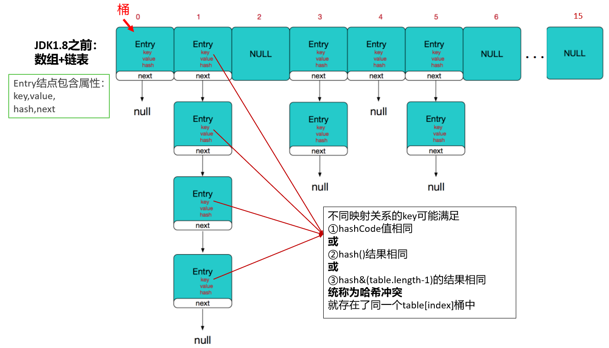

##### Entry

key-value被封装为HashMap.Entry类型，而这个类型实现了Map.Entry接口。

```java
public class HashMap<K,V>{
    transient Entry<K,V>[] table;
    
    static class Entry<K,V> implements Map.Entry<K,V> {
        final K key;
        V value;
        Entry<K,V> next;
        int hash;

        /**
         * Creates new entry.
         */
        Entry(int h, K k, V v, Entry<K,V> n) {
            value = v;
            next = n;
            key = k;
            hash = h;
        }
        //略
    }
}
```

##### 属性

```java
//table数组的默认初始化长度
static final int DEFAULT_INITIAL_CAPACITY = 16;
//哈希表
transient Entry<K,V>[] table;
//哈希表中key-value的个数
transient int size;
//临界值、阈值（扩容的临界值）
int threshold;
//加载因子
final float loadFactor;
//默认加载因子
static final float DEFAULT_LOAD_FACTOR = 0.75f;
```

##### 构造器

```java
public HashMap() {
    //DEFAULT_INITIAL_CAPACITY：默认初始容量16
  	//DEFAULT_LOAD_FACTOR：默认加载因子0.75
    this(DEFAULT_INITIAL_CAPACITY, DEFAULT_LOAD_FACTOR);
}
```

```java
public HashMap(int initialCapacity, float loadFactor) {
    //校验initialCapacity合法性
    if (initialCapacity < 0)
        throw new IllegalArgumentException("Illegal initial capacity: " + initialCapacity);
    //校验initialCapacity合法性 
    if (initialCapacity > MAXIMUM_CAPACITY)
        initialCapacity = MAXIMUM_CAPACITY;
    //校验loadFactor合法性
    if (loadFactor <= 0 || Float.isNaN(loadFactor))
        throw new IllegalArgumentException("Illegal load factor: " + loadFactor);

    //计算得到table数组的长度（保证capacity是2的整次幂）
    int capacity = 1;
    while (capacity < initialCapacity)
        capacity <<= 1;
	//加载因子，初始化为0.75
    this.loadFactor = loadFactor;
    // threshold 初始为默认容量
    threshold = (int)Math.min(capacity * loadFactor, MAXIMUM_CAPACITY + 1);
    //初始化table数组
    table = new Entry[capacity];
    useAltHashing = sun.misc.VM.isBooted() &&
                                       (capacity >= Holder.ALTERNATIVE_HASHING_THRESHOLD);
    init();
}
```

##### put方法

```java
public V put(K key, V value) {
    //如果key是null，单独处理，存储到table[0]中，如果有另一个key为null，value覆盖
    if (key == null)
        return putForNullKey(value);
    //对key的hashCode进行干扰，算出一个hash值
    /*
      hashCode值        xxxxxxxxxx
      table.length-1    000001111
   
      hashCode值 xxxxxxxxxx  无符号右移几位和原来的hashCode值做^运算，使得hashCode高位二进制值参与计算，
                            也发挥作用，降低index冲突的概率。
    */
    int hash = hash(key);
    //计算新的映射关系应该存到table[i]位置，
    //i = hash & table.length-1，可以保证i在[0,table.length-1]范围内
    int i = indexFor(hash, table.length);
    //检查table[i]下面有没有key与我新的映射关系的key重复，如果重复替换value
    for (Entry<K,V> e = table[i]; e != null; e = e.next) {
        Object k;
        if (e.hash == hash && ((k = e.key) == key || key.equals(k))) {
            V oldValue = e.value;
            e.value = value;
            e.recordAccess(this);
            return oldValue;
        }
    }

    modCount++;
    //添加新的映射关系
    addEntry(hash, key, value, i);
    return null;
}
```

其中，

```java
//如果key是null，直接存入[0]的位置
private V putForNullKey(V value) {
    //判断是否有重复的key，如果有重复的，就替换value
    for (Entry<K,V> e = table[0]; e != null; e = e.next) {
        if (e.key == null) {
            V oldValue = e.value;
            e.value = value;
            e.recordAccess(this);
            return oldValue;
        }
    }
    modCount++;
    //把新的映射关系存入[0]的位置，而且key的hash值用0表示
    addEntry(0, null, value, 0);
    return null;
}
```

```java
final int hash(Object k) {
    int h = 0;
    if (useAltHashing) {
        if (k instanceof String) {
            return sun.misc.Hashing.stringHash32((String) k);
        }
        h = hashSeed;
    }

    h ^= k.hashCode();

    // This function ensures that hashCodes that differ only by
    // constant multiples at each bit position have a bounded
    // number of collisions (approximately 8 at default load factor).
    h ^= (h >>> 20) ^ (h >>> 12);
    return h ^ (h >>> 7) ^ (h >>> 4);
}
```

```java
static int indexFor(int h, int length) {
    return h & (length-1);
}
```

```java
void addEntry(int hash, K key, V value, int bucketIndex) {
    //判断是否需要库容
    //扩容：（1）size达到阈值（2）table[i]正好非空
    if ((size >= threshold) && (null != table[bucketIndex])) {
        //table扩容为原来的2倍，并且扩容后，会重新调整所有key-value的存储位置
        resize(2 * table.length); 
        //新的key-value的hash和index也会重新计算
        hash = (null != key) ? hash(key) : 0;
        bucketIndex = indexFor(hash, table.length);
    }
	//存入table中
    createEntry(hash, key, value, bucketIndex);
}
```

```java
void createEntry(int hash, K key, V value, int bucketIndex) {
    Entry<K,V> e = table[bucketIndex];
    //原来table[i]下面的映射关系作为新的映射关系next
    table[bucketIndex] = new Entry<>(hash, key, value, e);
    //个数增加
    size++; 
}
```

#### JDK8源码

##### Node

key-value被封装为HashMap.Node类型或HashMap.TreeNode类型，它俩都直接或间接的实现了Map.Entry接口。

存储到table数组的可能是Node结点对象，也可能是TreeNode结点对象，它们也是Map.Entry接口的实现类。即table[index]下的映射关系可能串起来一个链表或一棵红黑树。

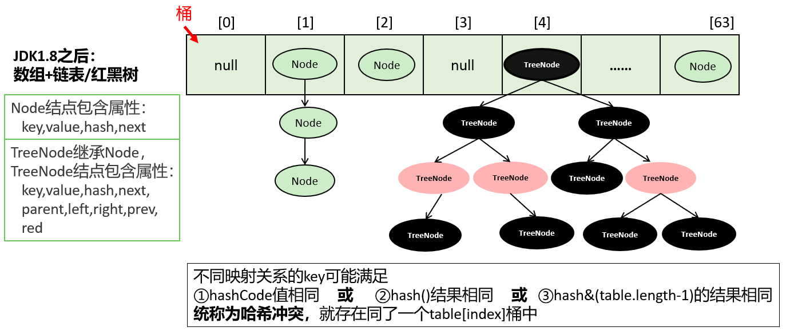

```java
public class HashMap<K,V>{
    transient Node<K,V>[] table;
    
    //Node类
    static class Node<K,V> implements Map.Entry<K,V> {
        final int hash;
        final K key;
        V value;
        Node<K,V> next;

        Node(int hash, K key, V value, Node<K,V> next) {
            this.hash = hash;
            this.key = key;
            this.value = value;
            this.next = next;
        }
        // 其它结构：略
    }
    
    //TreeNode类
    static final class TreeNode<K,V> extends LinkedHashMap.Entry<K,V> {
        TreeNode<K,V> parent;
        TreeNode<K,V> left;
        TreeNode<K,V> right;
        TreeNode<K,V> prev;
        boolean red; //是红结点还是黑结点
        TreeNode(int hash, K key, V val, Node<K,V> next) {
            super(hash, key, val, next);
        }
    }
    
    //....
}
```

##### 属性

```java
static final int DEFAULT_INITIAL_CAPACITY = 1 << 4; // 默认的初始容量 16
static final int MAXIMUM_CAPACITY = 1 << 30; //最大容量  1 << 30
static final float DEFAULT_LOAD_FACTOR = 0.75f;  //默认加载因子
static final int TREEIFY_THRESHOLD = 8; //默认树化阈值8，当链表的长度达到这个值后，要考虑树化
static final int UNTREEIFY_THRESHOLD = 6;//默认反树化阈值6，当树中结点的个数达到此阈值后，要考虑变为链表

//当单个的链表的结点个数达到8，并且table的长度达到64，才会树化。
//当单个的链表的结点个数达到8，但是table的长度未达到64，会先扩容
static final int MIN_TREEIFY_CAPACITY = 64; //最小树化容量64

transient Node<K,V>[] table; //数组
transient int size;  //记录有效映射关系的对数，也是Entry对象的个数
int threshold; //阈值，当size达到阈值时，考虑扩容
final float loadFactor; //加载因子，影响扩容的频率
```

##### 构造器

```java
public HashMap() {
    this.loadFactor = DEFAULT_LOAD_FACTOR; // all other fields defaulted (其他字段都是默认值)
}
```

##### put方法

```java
public V put(K key, V value) {
    return putVal(hash(key), key, value, false, true);
}
```

其中，

```java
static final int hash(Object key) {
    int h;
    //如果key是null，hash是0
	//如果key非null，用key的hashCode值 与 key的hashCode值高16进行异或
	//		即就是用key的hashCode值高16位与低16位进行了异或的干扰运算
		
	/*
	index = hash & table.length-1
	如果用key的原始的hashCode值  与 table.length-1 进行按位与，那么基本上高16没机会用上。
	这样就会增加冲突的概率，为了降低冲突的概率，把高16位加入到hash信息中。
	*/
    return (key == null) ? 0 : (h = key.hashCode()) ^ (h >>> 16);
}
```

```java
final V putVal(int hash, K key, V value, boolean onlyIfAbsent,boolean evict) {
    Node<K,V>[] tab; //数组
    Node<K,V> p;  //一个结点
    int n, i; //n是数组的长度   i是下标
    
    //tab和table等价
	//如果table是空的
    if ((tab = table) == null || (n = tab.length) == 0){
        n = (tab = resize()).length;
        /*
		tab = resize();
		n = tab.length;*/
		/*
		如果table是空的，resize()完成了①创建了一个长度为16的数组②threshold = 12
		n = 16
		*/
	}
    //i = (n - 1) & hash ，下标 = 数组长度-1 & hash
	//p = tab[i] 第1个结点
	//if(p==null) 条件满足的话说明 table[i]还没有元素
    if ((p = tab[i = (n - 1) & hash]) == null){
        //把新的映射关系直接放入table[i]
        tab[i] = newNode(hash, key, value, null);
        //newNode（）方法就创建了一个Node类型的新结点，新结点的next是null
    }else {
        Node<K,V> e; K k;
        //p是table[i]中第一个结点
		//if(table[i]的第一个结点与新的映射关系的key重复)
        if (p.hash == hash &&
            ((k = p.key) == key || (key != null && key.equals(k))))
            e = p;//用e记录这个table[i]的第一个结点
        else if (p instanceof TreeNode){ //如果table[i]第一个结点是一个树结点
            //单独处理树结点
            //如果树结点中，有key重复的，就返回那个重复的结点用e接收，即e!=null
            //如果树结点中，没有key重复的，就把新结点放到树中，并且返回null，即e=null
            e = ((TreeNode<K,V>)p).putTreeVal(this, tab, hash, key, value);
        }else {
            //table[i]的第一个结点不是树结点，也与新的映射关系的key不重复
			//binCount记录了table[i]下面的结点的个数
            for (int binCount = 0; ; ++binCount) {
                //如果p的下一个结点是空的，说明当前的p是最后一个结点
                if ((e = p.next) == null) {
                    //把新的结点连接到table[i]的最后
                    p.next = newNode(hash, key, value, null);
                    //如果binCount>=8-1，达到7个时
                    if (binCount >= TREEIFY_THRESHOLD - 1) // -1 for 1st
                        //要么扩容，要么树化
                        treeifyBin(tab, hash);
                    break;
                }
                //如果key重复了，就跳出for循环，此时e结点记录的就是那个key重复的结点
                if (e.hash == hash &&
                        ((k = e.key) == key || (key != null && key.equals(k))))
                    break;
                p = e;//下一次循环，e=p.next，就类似于e=e.next，往链表下移动
            }
        }
        //如果这个e不是null，说明有key重复，就考虑替换原来的value
        if (e != null) { // existing mapping for key
            V oldValue = e.value;
            if (!onlyIfAbsent || oldValue == null)
                e.value = value;
            afterNodeAccess(e); //什么也没干
            return oldValue;
        }
    }
    ++modCount;
    
    //元素个数增加
	//size达到阈值
    if (++size > threshold)
        resize(); //一旦扩容，重新调整所有映射关系的位置
    afterNodeInsertion(evict); //什么也没干
    return null;
}
```

```java
final Node<K,V>[] resize() {
    Node<K,V>[] oldTab = table; //oldTab原来的table
    //oldCap：原来数组的长度
    int oldCap = (oldTab == null) ? 0 : oldTab.length;
    //oldThr：原来的阈值
    int oldThr = threshold;//最开始threshold是0
    
    //newCap，新容量
	//newThr：新阈值
    int newCap, newThr = 0;
    if (oldCap > 0) { //说明原来不是空数组
        if (oldCap >= MAXIMUM_CAPACITY) { //是否达到数组最大限制
            threshold = Integer.MAX_VALUE;
            return oldTab;
        }
        else if ((newCap = oldCap << 1) < MAXIMUM_CAPACITY &&
                 oldCap >= DEFAULT_INITIAL_CAPACITY)
            //newCap = 旧的容量*2 ，新容量<最大数组容量限制
			//新容量：32,64，...
			//oldCap >= 初始容量16
			//新阈值重新算 = 24，48 ....
            newThr = oldThr << 1; // double threshold
    }
    else if (oldThr > 0) // initial capacity was placed in threshold
        newCap = oldThr;
    else {               // zero initial threshold signifies using defaults
        newCap = DEFAULT_INITIAL_CAPACITY; //新容量是默认初始化容量16
        //新阈值= 默认的加载因子 * 默认的初始化容量 = 0.75*16 = 12
        newThr = (int)(DEFAULT_LOAD_FACTOR * DEFAULT_INITIAL_CAPACITY);
    }
    if (newThr == 0) {
        float ft = (float)newCap * loadFactor;
        newThr = (newCap < MAXIMUM_CAPACITY && ft < (float)MAXIMUM_CAPACITY ?
                  (int)ft : Integer.MAX_VALUE);
    }
    threshold = newThr; //阈值赋值为新阈值12，24.。。。
    //创建了一个新数组，长度为newCap，16，32,64.。。
    @SuppressWarnings({"rawtypes","unchecked"})
    Node<K,V>[] newTab = (Node<K,V>[])new Node[newCap];
    table = newTab;
    if (oldTab != null) { //原来不是空数组
        //把原来的table中映射关系，倒腾到新的table中
        for (int j = 0; j < oldCap; ++j) {
            Node<K,V> e;
            if ((e = oldTab[j]) != null) {//e是table下面的结点
                oldTab[j] = null; //把旧的table[j]位置清空
                if (e.next == null) //如果是最后一个结点
                    newTab[e.hash & (newCap - 1)] = e; //重新计算e的在新table中的存储位置，然后放入
                else if (e instanceof TreeNode) //如果e是树结点
                    //把原来的树拆解，放到新的table
                    ((TreeNode<K,V>)e).split(this, newTab, j, oldCap);
                else { // preserve order
                    Node<K,V> loHead = null, loTail = null;
                    Node<K,V> hiHead = null, hiTail = null;
                    Node<K,V> next;
                    //把原来table[i]下面的整个链表，重新挪到了新的table中
                    do {
                        next = e.next;
                        if ((e.hash & oldCap) == 0) {
                            if (loTail == null)
                                loHead = e;
                            else
                                loTail.next = e;
                            loTail = e;
                        }
                        else {
                            if (hiTail == null)
                                hiHead = e;
                            else
                                hiTail.next = e;
                            hiTail = e;
                        }
                    } while ((e = next) != null);
                    if (loTail != null) {
                        loTail.next = null;
                        newTab[j] = loHead;
                    }
                    if (hiTail != null) {
                        hiTail.next = null;
                        newTab[j + oldCap] = hiHead;
                    }
                }
            }
        }
    }
    return newTab;
}
```

```java
Node<K,V> newNode(int hash, K key, V value, Node<K,V> next) {
    //创建一个新结点
    return new Node<>(hash, key, value, next);
}
```

```java
final void treeifyBin(Node<K,V>[] tab, int hash) {
    int n, index; 
    Node<K,V> e;
    //MIN_TREEIFY_CAPACITY：最小树化容量64
    //如果table是空的，或者  table的长度没有达到64
    if (tab == null || (n = tab.length) < MIN_TREEIFY_CAPACITY)
        resize();//先扩容
    else if ((e = tab[index = (n - 1) & hash]) != null) {
        //用e记录table[index]的结点的地址
        TreeNode<K,V> hd = null, tl = null;
        /*
			do...while，把table[index]链表的Node结点变为TreeNode类型的结点
			*/
        do {
            TreeNode<K,V> p = replacementTreeNode(e, null);
            if (tl == null)
                hd = p;//hd记录根结点
            else {
                p.prev = tl;
                tl.next = p;
            }
            tl = p;
        } while ((e = e.next) != null);

        //如果table[index]下面不是空
        if ((tab[index] = hd) != null)
            hd.treeify(tab);//将table[index]下面的链表进行树化
    }
}	
```

总结：

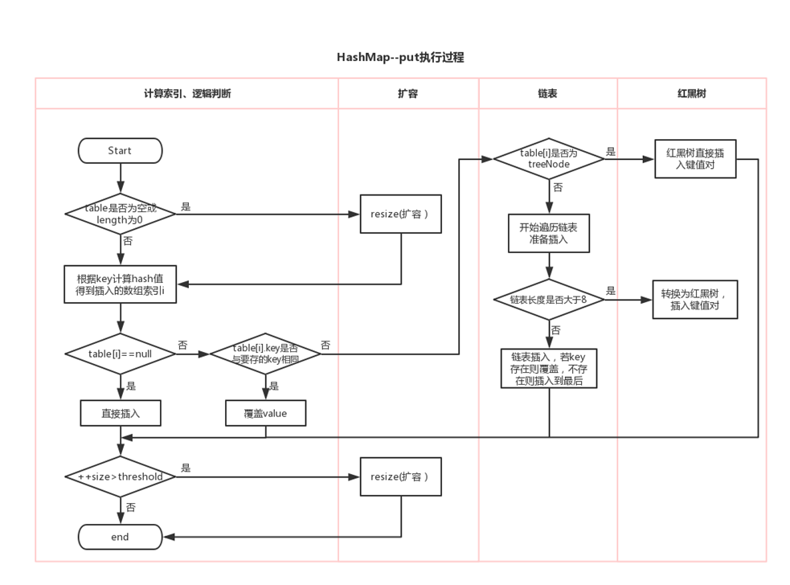


### HashMap的相关问题

#### 1、对哈希算法的理解？

hash算法是一种可以从任何数据中提取出其“指纹”的数据摘要算法，它将任意大小的数据映射到一个固定大小的序列上，这个序列被称为hash code、数据摘要或者指纹。比较出名的hash算法有MD5、SHA。hash是具有唯一性且不可逆的，唯一性是指相同的“对象”产生的hash code永远是一样的。

#### 2、Entry中的hash属性为什么不直接使用key的hashCode()返回值呢？

不管是JDK1.7还是JDK1.8中，都不是直接用key的hashCode值直接与table.length-1计算求下标的，而是先对key的hashCode值进行了一个运算，JDK1.7和JDK1.8关于hash()的实现代码不一样，但是不管怎么样都是为了提高hash code值与 (table.length-1)的按位与完的结果，尽量的均匀分布。

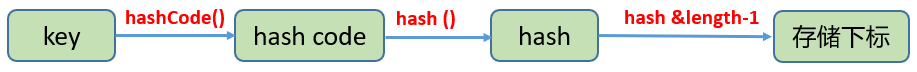

JDK1.7：

```java
    final int hash(Object k) {
        int h = hashSeed;
        if (0 != h && k instanceof String) {
            return sun.misc.Hashing.stringHash32((String) k);
        }

        h ^= k.hashCode();
        h ^= (h >>> 20) ^ (h >>> 12);
        return h ^ (h >>> 7) ^ (h >>> 4);
    }
```

JDK1.8：

```java
	static final int hash(Object key) {
        int h;
        return (key == null) ? 0 : (h = key.hashCode()) ^ (h >>> 16);
    }
```

虽然算法不同，但是思路都是将hashCode值的高位二进制与低位二进制值进行了异或，然高位二进制参与到index的计算中。

为什么要hashCode值的二进制的高位参与到index计算呢？

因为一个HashMap的table数组一般不会特别大，至少在不断扩容之前，那么table.length-1的大部分高位都是0，直接用hashCode和table.length-1进行&运算的话，就会导致总是只有最低的几位是有效的，那么就算你的hashCode()实现的再好也难以避免发生碰撞，这时让高位参与进来的意义就体现出来了。它对hashcode的低位添加了随机性并且混合了高位的部分特征，显著减少了碰撞冲突的发生。

#### 3、HashMap是如何决定某个key-value存在哪个桶的呢？

因为hash值是一个整数，而数组的长度也是一个整数，有两种思路：

①hash 值 % table.length会得到一个[0,table.length-1]范围的值，正好是下标范围，但是用%运算效率没有位运算符&高。

②hash 值 & (table.length-1)，任何数 & (table.length-1)的结果也一定在[0, table.length-1]范围。

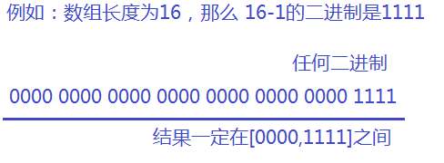

JDK1.7：

```java
static int indexFor(int h, int length) {
    // assert Integer.bitCount(length) == 1 : "length must be a non-zero power of 2";
    return h & (length-1); //此处h就是hash
}
```

JDK1.8：

```java
final V putVal(int hash, K key, V value, boolean onlyIfAbsent, boolean evict) {
    Node<K,V>[] tab; Node<K,V> p; int n, i;
    if ((tab = table) == null || (n = tab.length) == 0)
        n = (tab = resize()).length;
    if ((p = tab[i = (n - 1) & hash]) == null)  // i = (n - 1) & hash
        tab[i] = newNode(hash, key, value, null);
    //....省略大量代码
}
```

#### 4、为什么要保持table数组一直是2的n次幂呢？

因为如果数组的长度为2的n次幂，那么table.length-1的二进制就是一个高位全是0，低位全是1的数字，这样才能保证每一个下标位置都有机会被用到。

举例1：

```java
hashCode值是   ？
table.length是10
table.length-1是9

？   ????????
9	 00001001
&_____________
	 00000000	[0]
	 00000001	[1]
	 00001000	[8]
	 00001001	[9]
	 一定[0]~[9]
```

举例2：

```java
hashCode值是   ？
table.length是16
table.length-1是15

？   ????????
15	 00001111
&_____________
	 00000000	[0]
	 00000001	[1]
	 00000010	[2]
	 00000011	[3]
	 ...
	 00001111    [15]
	 范围是[0,15]，一定在[0,table.length-1]范围内
```

#### 5、解决[index]冲突问题

虽然从设计hashCode()到上面HashMap的hash()函数，都尽量减少冲突，但是仍然存在两个不同的对象返回的hashCode值相同，或者hashCode值就算不同，通过hash()函数计算后，得到的index也会存在大量的相同，因此key分布完全均匀的情况是不存在的。那么发生碰撞冲突时怎么办？

JDK1.8之间使用：数组+链表的结构。

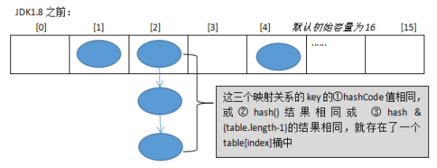

JDK1.8之后使用：数组+链表/红黑树的结构。

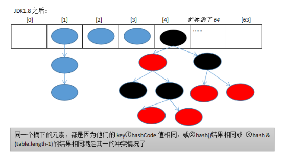

即hash相同或hash&(table.lengt-1)的值相同，那么就存入同一个“桶”table[index]中，使用链表或红黑树连接起来。

#### 6、为什么JDK1.8会出现红黑树和链表共存呢？

因为当冲突比较严重时，table[index]下面的链表就会很长，那么会导致查找效率大大降低，而如果此时选用二叉树可以大大提高查询效率。

但是二叉树的结构又过于复杂，占用内存也较多，如果结点个数比较少的时候，那么选择链表反而更简单。所以会出现红黑树和链表共存。

#### 7、加载因子的值大小有什么关系？

如果太大，threshold就会很大，那么如果冲突比较严重的话，就会导致table[index]下面的结点个数很多，影响效率。

如果太小，threshold就会很小，那么数组扩容的频率就会提高，数组的使用率也会降低，那么会造成空间的浪费。

#### 8、什么时候树化？什么时候反树化？

```java
static final int TREEIFY_THRESHOLD = 8;//树化阈值
static final int UNTREEIFY_THRESHOLD = 6;//反树化阈值
static final int MIN_TREEIFY_CAPACITY = 64;//最小树化容量
```

* 当某table[index]下的链表的结点个数达到8，并且table.length>=64，那么如果新Entry对象还添加到该table[index]中，那么就会将table[index]的链表进行树化。

* 当某table[index]下的红黑树结点个数少于6个，此时，
  * 当继续删除table[index]下的树结点，最后这个根结点的左右结点有null，或根结点的左结点的左结点为null，会反树化
  * 当重新添加新的映射关系到map中，导致了map重新扩容了，这个时候如果table[index]下面还是小于等于6的个数，那么会反树化

```java
package com.atguigu.map;

public class MyKey{
    int num;

    public MyKey(int num) {
        super();
        this.num = num;
    }

    @Override
    public int hashCode() {
        if(num<=20){
            return 1;
        }else{
            final int prime = 31;
            int result = 1;
            result = prime * result + num;
            return result;
        }
    }

    @Override
    public boolean equals(Object obj) {
        if (this == obj)
            return true;
        if (obj == null)
            return false;
        if (getClass() != obj.getClass())
            return false;
        MyKey other = (MyKey) obj;
        if (num != other.num)
            return false;
        return true;
    }

}

```

```java
package com.atguigu.map;

import org.junit.Test;

import java.util.HashMap;

public class TestHashMapMyKey {
    @Test
    public void test1(){
        //这里为了演示的效果，我们造一个特殊的类，这个类的hashCode（）方法返回固定值1
        //因为这样就可以造成冲突问题，使得它们都存到table[1]中
        HashMap<MyKey, String> map = new HashMap<>();
        for (int i = 1; i <= 11; i++) {
            map.put(new MyKey(i), "value"+i);//树化演示
        }
    }
    @Test
    public void test2(){
        HashMap<MyKey, String> map = new HashMap<>();
        for (int i = 1; i <= 11; i++) {
            map.put(new MyKey(i), "value"+i);
        }
        for (int i = 1; i <=11; i++) {
            map.remove(new MyKey(i));//反树化演示
        }
    }
    @Test
    public void test3(){
        HashMap<MyKey, String> map = new HashMap<>();
        for (int i = 1; i <= 11; i++) {
            map.put(new MyKey(i), "value"+i);
        }

        for (int i = 1; i <=5; i++) {
            map.remove(new MyKey(i));
        }//table[1]下剩余6个结点

        for (int i = 21; i <= 100; i++) {
            map.put(new MyKey(i), "value"+i);//添加到扩容时，反树化
        }
    }
}

```

#### 9、key-value中的key是否可以修改？

key-value存储到HashMap中会存储key的hash值，这样就不用在每次查找时重新计算每一个Entry或Node（TreeNode）的hash值了，因此如果已经put到Map中的key-value，再修改key的属性，而这个属性又参与hashcode值的计算，那么会导致匹配不上。

这个规则也同样适用于LinkedHashMap、HashSet、LinkedHashSet、Hashtable等所有散列存储结构的集合。

#### 10、JDK1.7中HashMap的循环链表是怎么回事？如何解决？

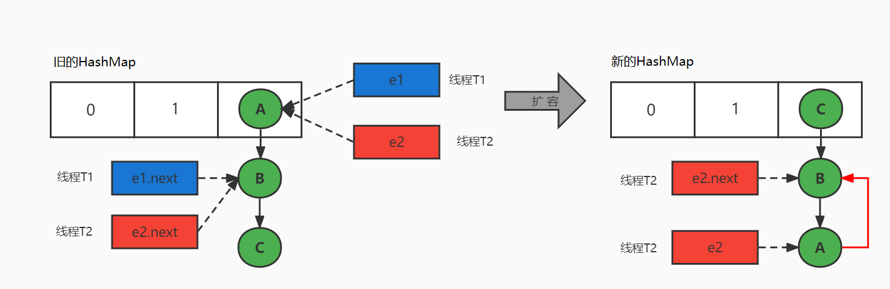

避免HashMap发生死循环的常用解决方案：

- 多线程环境下，使用线程安全的ConcurrentHashMap替代HashMap，推荐
- 多线程环境下，使用synchronized或Lock加锁，但会影响性能，不推荐
- 多线程环境下，使用线程安全的Hashtable替代，性能低，不推荐

HashMap死循环只会发生在JDK1.7版本中，主要原因：头插法+链表+多线程并发+扩容。

在JDK1.8中，HashMap改用尾插法，解决了链表死循环的问题。

## Map接口实现类：LinkedHashMap

- LinkedHashMap 是 HashMap 的子类
- 存储数据采用的哈希表结构+链表结构，在HashMap存储结构的基础上，使用了一对`双向链表`来`记录添加元素的先后顺序`，可以保证遍历元素时，与添加的顺序一致。
- 通过哈希表结构可以保证键的唯一、不重复，需要键所在类重写hashCode()方法、equals()方法。

```java
public class TestLinkedHashMap {
    public static void main(String[] args) {
        LinkedHashMap map = new LinkedHashMap();
        map.put("王五", 13000.0);
        map.put("张三", 10000.0);
        //key相同，新的value会覆盖原来的value
        //因为String重写了hashCode和equals方法
        map.put("张三", 12000.0);
        map.put("李四", 14000.0);
        //HashMap支持key和value为null值
        String name = null;
        Double salary = null;
        map.put(name, salary);

        Set entrySet = map.entrySet();
        for (Object obj : entrySet) {
            Map.Entry entry = (Map.Entry)obj;
            System.out.println(entry);
        }
//        王五=13000.0
//        张三=12000.0
//        李四=14000.0
//        null=null
    }
}
```

### LinkedHashMap源码剖析

#### 源码

内部定义的Entry如下：

```java
static class Entry<K,V> extends HashMap.Node<K,V> {
	Entry<K,V> before, after;
	
	Entry(int hash, K key, V value, Node<K,V> next) {
		super(hash, key, value, next);
	}
}
```

LinkedHashMap重写了HashMap中的newNode()方法：

```java
Node<K,V> newNode(int hash, K key, V value, Node<K,V> e) {
    LinkedHashMap.Entry<K,V> p =
        new LinkedHashMap.Entry<K,V>(hash, key, value, e);
    linkNodeLast(p);
    return p;
}
```

```java
TreeNode<K,V> newTreeNode(int hash, K key, V value, Node<K,V> next) {
    TreeNode<K,V> p = new TreeNode<K,V>(hash, key, value, next);
    linkNodeLast(p);
    return p;
}
```

#### 图示


## Map接口实现类：TreeMap

- TreeMap存储 key-value 对时，需要根据 key-value 对进行排序。TreeMap 可以保证所有的 key-value 对处于`有序状态`。
- TreeSet底层使用`红黑树`结构存储数据
- TreeMap 的 Key 的排序：
  - `自然排序`：TreeMap 的所有的 Key 必须实现 Comparable 接口，而且所有的 Key 应该是同一个类的对象，否则将会抛出 ClasssCastException
  - `定制排序`：创建 TreeMap 时，构造器传入一个 Comparator 对象，该对象负责对 TreeMap 中的所有 key 进行排序。此时不需要 Map 的 Key 实现 Comparable 接口
- TreeMap判断`两个key相等的标准`：两个key通过compareTo()方法或者compare()方法返回0。

举例：

```java

public class TestTreeMap {
    /*
     * 自然排序举例
     * */
    @Test
    public void test1(){
        TreeMap map = new TreeMap();

        map.put("CC",45);
        map.put("MM",78);
        map.put("DD",56);
        map.put("GG",89);
        map.put("JJ",99);

        Set entrySet = map.entrySet();
        for(Object entry : entrySet){
            System.out.println(entry);
        }

    }

    /*
     * 定制排序
     *
     * */
    @Test
    public void test2(){
        //按照User的姓名的从小到大的顺序排列

        TreeMap map = new TreeMap(new Comparator() {
            @Override
            public int compare(Object o1, Object o2) {
                if(o1 instanceof User && o2 instanceof User){
                    User u1 = (User)o1;
                    User u2 = (User)o2;

                    return u1.name.compareTo(u2.name);
                }
                throw new RuntimeException("输入的类型不匹配");
            }
        });

        map.put(new User("Tom",12),67);
        map.put(new User("Rose",23),"87");
        map.put(new User("Jerry",2),88);
        map.put(new User("Eric",18),45);
        map.put(new User("Tommy",44),77);
        map.put(new User("Jim",23),88);
        map.put(new User("Maria",18),34);

        Set entrySet = map.entrySet();
        for(Object entry : entrySet){
            System.out.println(entry);
        }
    }
}

class User implements Comparable{
    String name;
    int age;

    public User(String name, int age) {
        this.name = name;
        this.age = age;
    }

    public User() {
    }

    @Override
    public String toString() {
        return "User{" +
                "name='" + name + '\'' +
                ", age=" + age +
                '}';
    }
    /*
    举例：按照age从小到大的顺序排列，如果age相同，则按照name从大到小的顺序排列
    * */
    @Override
    public int compareTo(Object o) {
        if(this == o){
            return 0;
        }

        if(o instanceof User){
            User user = (User)o;
            int value = this.age - user.age;
            if(value != 0){
                return value;
            }
            return -this.name.compareTo(user.name);
        }
        throw new RuntimeException("输入的类型不匹配");
    }
}
```

## Map接口实现类：Hashtable

- Hashtable是Map接口的`古老实现类`，JDK1.0就提供了。不同于HashMap，Hashtable是线程安全的。
- Hashtable实现原理和HashMap相同，功能相同。底层都使用哈希表结构（数组+单向链表），查询速度快。
- 与HashMap一样，Hashtable 也不能保证其中 Key-Value 对的顺序
- Hashtable判断两个key相等、两个value相等的标准，与HashMap一致。
- 与HashMap不同，Hashtable 不允许使用 null 作为 key 或 value。

### Hashtable和HashMap的区别

1. HashMap:底层是一个哈希表（jdk7:数组+链表;jdk8:数组+链表+红黑树）,是一个线程不安全的集合,执行效率高
2. Hashtable:底层也是一个哈希表（数组+链表）,是一个线程安全的集合,执行效率低
3. HashMap集合:可以存储null的键、null的值；Hashtable集合,不能存储null的键、null的值
4. Hashtable和Vector集合一样,在jdk1.2版本之后被更先进的集合(HashMap,ArrayList)取代了。
5. Hashtable的子类Properties（配置文件）依然常用，Properties集合是一个唯一和IO流相结合的集合

## Map接口实现类：Properties

- Properties 类是 Hashtable 的子类，该对象用于处理属性文件

- 由于属性文件里的 key、value 都是字符串类型，所以 Properties 中要求 key 和 value 都是字符串类型

- 存取数据时，建议使用setProperty(String key,String value)方法和getProperty(String key)方法

举例：

```java
public class TestProperties {
    @Test
    public void test01() {
        Properties properties = System.getProperties();
        String fileEncoding = properties.getProperty("file.encoding");
        System.out.println("fileEncoding = " + fileEncoding); // fileEncoding = UTF-8
    }
    @Test
    public void test02() {
        Properties properties = new Properties();
        properties.setProperty("user","songhk");
        properties.setProperty("password","123456");
        System.out.println(properties); // {password=123456, user=songhk}
    }

    @Test
    public void test03() throws IOException {
        Properties pros = new Properties();
        pros.load(new FileInputStream("jdbc.properties"));
        String user = pros.getProperty("user"); 
        System.out.println(user); // root
    }
}

```

```properties
user=root
```


# Collections工具类

参考操作数组的工具类：Arrays。Collections 是一个操作 Set、List 和 Map 等集合的工具类。

## 常用方法

Collections 中提供了一系列静态的方法对集合元素进行排序、查询和修改等操作，还提供了对集合对象设置不可变、对集合对象实现同步控制等方法（均为static方法）：

**排序操作：**

- reverse(List)：反转 List 中元素的顺序
- shuffle(List)：对 List 集合元素进行随机排序
- sort(List)：根据元素的自然顺序对指定 List 集合元素按升序排序
- sort(List，Comparator)：根据指定的 Comparator 产生的顺序对 List 集合元素进行排序
- swap(List，int， int)：将指定 list 集合中的 i 处元素和 j 处元素进行交换

**查找**

- Object max(Collection)：根据元素的自然顺序，返回给定集合中的最大元素
- Object max(Collection，Comparator)：根据 Comparator 指定的顺序，返回给定集合中的最大元素
- Object min(Collection)：根据元素的自然顺序，返回给定集合中的最小元素
- Object min(Collection，Comparator)：根据 Comparator 指定的顺序，返回给定集合中的最小元素
- int binarySearch(List list,T key)在List集合中查找某个元素的下标，但是List的元素必须是T或T的子类对象，而且必须是可比较大小的，即支持自然排序的。而且集合也事先必须是有序的，否则结果不确定。
- int binarySearch(List list,T key,Comparator c)在List集合中查找某个元素的下标，但是List的元素必须是T或T的子类对象，而且集合也事先必须是按照c比较器规则进行排序过的，否则结果不确定。
- int frequency(Collection c，Object o)：返回指定集合中指定元素的出现次数

**复制、替换**

- void copy(List dest,List src)：将src中的内容复制到dest中
- boolean replaceAll(List list，Object oldVal，Object newVal)：使用新值替换 List 对象的所有旧值
- 提供了多个unmodifiableXxx()方法，该方法返回指定 Xxx的不可修改的视图。

**添加**

- boolean addAll(Collection  c,T... elements)将所有指定元素添加到指定 collection 中。

**同步**

- Collections 类中提供了多个 synchronizedXxx() 方法，该方法可使将指定集合包装成线程同步的集合，从而可以解决多线程并发访问集合时的线程安全问题：

# 泛型

## 泛型例子

### 在集合中使用泛型

集合类在设计阶段`/`声明阶段不能确定这个容器到底实际存的是什么类型的对象，所以**在JDK5.0之前只能把元素类型设计为Object，JDK5.0时Java引入了“参数化类型（Parameterized type）”的概念，允许我们在创建集合时指定集合元素的类型**。比如：`List<String>`，这表明该List只能保存字符串类型的对象。

Java泛型可以保证如果程序在编译时没有发出警告，运行时就不会产生ClassCastException异常。即，把不安全的因素在编译期间就排除了，而不是运行期；既然通过了编译，那么类型一定是符合要求的，就避免了类型转换。

举例：

```java
//泛型在List中的使用
@Test
public void test1(){
    //举例：将学生成绩保存在ArrayList中
    //标准写法：
    //ArrayList<Integer> list = new ArrayList<Integer>();
    //jdk7的新特性：类型推断
    ArrayList<Integer> list = new ArrayList<>();

    list.add(56); //自动装箱
    list.add(76);
    list.add(88);
    list.add(89);
    //当添加非Integer类型数据时，编译不通过
    //list.add("Tom");//编译报错

    Iterator<Integer> iterator = list.iterator();
    while(iterator.hasNext()){
        //不需要强转，直接可以获取添加时的元素的数据类型
        Integer score = iterator.next();
        System.out.println(score);
    }
}
```

```java
//泛型在Map中的使用
@Test
public void test2(){
    HashMap<String,Integer> map = new HashMap<>();

    map.put("Tom",67);
    map.put("Jim",56);
    map.put("Rose",88);
    //编译不通过
    //        map.put(67,"Jack");

    //遍历key集
    Set<String> keySet = map.keySet();
    for(String str:keySet){
        System.out.println(str);
    }

    //遍历value集
    Collection<Integer> values = map.values();
    Iterator<Integer> iterator = values.iterator();
    while(iterator.hasNext()){
        Integer value = iterator.next();
        System.out.println(value);
    }

    //遍历entry集
    Set<Map.Entry<String, Integer>> entrySet = map.entrySet();
    Iterator<Map.Entry<String, Integer>> iterator1 = entrySet.iterator();
    while(iterator1.hasNext()){
        Map.Entry<String, Integer> entry = iterator1.next();
        String key = entry.getKey();
        Integer value = entry.getValue();
        System.out.println(key + ":" + value);
    }

}
```

### 在比较器中使用泛型

`java.lang.Comparable`接口和`java.util.Comparator`接口，是用于比较对象大小的接口。这两个接口只是限定了当一个对象大于另一个对象时返回正整数，小于返回负整数，等于返回0，但是并不确定是什么类型的对象比较大小。JDK5.0之前只能用Object类型表示，使用时既麻烦又不安全，因此 JDK5.0 给它们增加了泛型

举例：

```java
import java.util.Comparator;

class CircleComparator1 implements Comparator<Circle> {

    @Override
    public int compare(Circle o1, Circle o2) {
        //不再需要强制类型转换，代码更简洁
        return Double.compare(o1.getRadius(), o2.getRadius());
    }
}

//测试类
public class TestHasGeneric {
    public static void main(String[] args) {
        CircleComparator1 com = new CircleComparator1();
        System.out.println(com.compare(new Circle(1), new Circle(2)));

        //System.out.println(com.compare("圆1", "圆2"));
        //编译错误，因为"圆1", "圆2"不是Circle类型，是String类型，编译器提前报错，
    }
}

class Circle{
    private double radius;

    public Circle(double radius) {
        super();
        this.radius = radius;
    }

    public double getRadius() {
        return radius;
    }

    public void setRadius(double radius) {
        this.radius = radius;
    }

    @Override
    public String toString() {
        return "Circle [radius=" + radius + "]";
    }

}
```

### 相关使用说明

- 在创建集合对象的时候，可以指明泛型的类型。

  具体格式为：`List<Integer> list = new ArrayList<Integer>();`

- JDK7.0时，有新特性，可以简写为：

  `List<Integer> list = new ArrayList<>(); `//类型推断

- 泛型，也称为泛型参数，即参数的类型，只能使用引用数据类型进行赋值。（不能使用基本数据类型，可以使用包装类替换）

- 集合声明时，声明泛型参数。在使用集合时，可以具体指明泛型的类型。一旦指明，类或接口内部，凡是使用泛型参数的位置，都指定为具体的参数类型。如果没有指明的话，看做是Object类型。


## 自定义泛型结构

### 自定义泛型类和泛型接口

1. 除创建泛型类对象外，子类继承泛型类时、实现类实现泛型接口时，也可以确定泛型结构中的泛型参数。如果在给泛型类提供子类时，子类也不确定泛型的类型，则可以继续使用泛型参数。还可以在现有的父类的泛型参数的基础上，新增泛型参数。
2. 泛型类可能有多个参数，此时应将多个参数一起放在尖括号内。比如：`<E1,E2,E3>`
3. 不能使用new E[]。但是可以：E[] elements = (E[])new Object[capacity];
4. 在类`/`接口上声明的泛型，在本类或本接口中即代表某种类型，但不可以在静态方法中使用类的泛型。
5. 异常类不能是带泛型的。

举例：

```java
class Person<T> {
    // 使用T类型定义变量
    private T info;
    // 使用T类型定义一般方法
    public T getInfo() {
        return info;
    }
    public void setInfo(T info) {
        this.info = info;
    }
    // 使用T类型定义构造器
    public Person() {
    }
    public Person(T info) {
        this.info = info;
    }
    // static的方法中不能声明泛型
    //public static void show(T t) {
    //
    //}
    // 不能在try-catch中使用泛型定义
    //public void test() {
        //try {
        //
        //} catch (MyException<T> ex) {
        //
        //}
    //}
}

```

```java
class Father<T1, T2> {
}
// - 子类不保留父类的泛型
// 1)没有类型 擦除
class Son1 extends Father {// 等价于class Son extends Father<Object,Object>{
}
// 2)具体类型
class Son2 extends Father<Integer, String> {
}

// - 子类保留父类的泛型
// 1)全部保留
class Son3<T1, T2> extends Father<T1, T2> {
}
// 2)部分保留
class Son4<T2> extends Father<Integer, T2> {
}

```

```java
class Father<T1, T2> {
}
// - 子类不保留父类的泛型
// 1)没有类型 擦除
class Son<A, B> extends Father{//等价于class Son extends Father<Object,Object>{
}
// 2)具体类型
class Son2<A, B> extends Father<Integer, String> {
}
// - 子类保留父类的泛型
// 1)全部保留
class Son3<T1, T2, A, B> extends Father<T1, T2> {
}
// 2)部分保留
class Son4<T2, A, B> extends Father<Integer, T2> {
}

```

### 自定义泛型方法

1. 语法格式：

```java
[访问权限]  <泛型>  返回值类型  方法名([泛型标识 参数名称])  [抛出的异常]{
    
}
```

2. 方法，也可以被泛型化，与其所在的类是否是泛型类没有关系。
3. 泛型方法中的泛型参数在方法被调用时确定。
4. 泛型方法可以根据需要，声明为static的。

举例：

```java
public static <T> void fromArrayToCollection(T[] a, Collection<T> c) {
    for (T o : a) {
        c.add(o);
    }
}

public static void main(String[] args) {
    Object[] ao = new Object[100];
    Collection<Object> co = new ArrayList<Object>();
    fromArrayToCollection(ao, co);

    String[] sa = new String[20];
    Collection<String> cs = new ArrayList<>();
    fromArrayToCollection(sa, cs);

    Collection<Double> cd = new ArrayList<>();
    // 下面代码中T是Double类，但sa是String类型，编译错误。
    // fromArrayToCollection(sa, cd);
    // 下面代码中T是Object类型，sa是String类型，可以赋值成功。
    fromArrayToCollection(sa, co);
}

```

```java
import java.util.Arrays;

class MyArrays {
    public static <T> void sort(T[] arr){
        for (int i = 1; i < arr.length; i++) {
            for (int j = 0; j < arr.length-i; j++) {
                if(((Comparable<T>)arr[j]).compareTo(arr[j+1])>0){
                    T temp = arr[j];
                    arr[j] = arr[j+1];
                    arr[j+1] = temp;
                }
            }
        }
    }
}
class Circle {
    private double radius;

    public Circle(double radius) {
        this.radius = radius;
    }
}

public class MyArraysTest {
    public static void main(String[] args) {
        int[] arr = {3,2,5,1,4};
//		MyArrays.sort(arr);//错误的，因为int[]不是对象数组

        String[] strings = {"hello","java","song"};
        MyArrays.sort(strings);
        System.out.println(Arrays.toString(strings));

        Circle[] circles = {new Circle(2.0),new Circle(1.2),new Circle(3.0)};
        MyArrays.sort(circles); //编译通过，运行报错，因为Circle没有实现Comparable接口
    }
}
```

## 泛型在继承上的体现

如果B是A的一个子类型（子类或者子接口），而G是具有泛型声明的类或接口，`G<B>`并不是`G<A>`的子类型

+ 比如：String是Object的子类，但是`List<String>`并不是`List<Object>`的子类。

举例：

```java
public void testGenericAndSubClass() {
    Person[] persons = null;
    Man[] mans = null;
    //Person[] 是 Man[] 的父类
    persons = mans;
    Person p = mans[0];

    // 在泛型的集合上
    List<Person> personList = null;
    List<Man> manList = null;
    //personList = manList;(报错)
}
```


## 通配符

当声明一个变量`/`形参时，这个变量`/`形参的类型是一个泛型类或泛型接口，如`Comparator<T>`类型，且仍然无法确定这个泛型类或泛型接口的类型变量`<T>`的具体类型，此时考虑使用类型通配符 `? `。

> 通配符的理解：
>
> 如`List<?>`是`List<String>`、`List<Object>`等各种泛型List的父类。

### 通配符的读与写

**写操作：**

将任意元素加入到其中不是类型安全的：

```java
Collection<?> c = new ArrayList<String>();

// c.add(new Object()); // 编译时错误
```

因为不知道c的元素类型，不能向其中添加对象。add方法有类型参数E作为集合的元素类型。传给add的任何参数都必须是一个未知类型的子类。因为不知道那是什么类型，所以无法传任何东西进去。

唯一可以插入的元素是null，因为它是所有引用类型的默认值。

**读操作：**

读取`List<?>`的对象list中的元素时，永远是安全的，因为不管 list 的真实类型是什么，它包含的都是Object。

举例：

```java
public class demo3 {
    public static void main(String[] args) {
        Collection<?> list = null;
        list = new ArrayList<Double>();
//        list.add(3);//编译不通过
        list.add(null);
        read(list); //null

        List<String> l1 = new ArrayList<String>();
        List<Integer> l2 = new ArrayList<Integer>();
        l1.add("尚硅谷");
        l2.add(15);
        read(l1); // 尚硅谷
        read(l2); // 15
    }

    public static void read(Collection<?> list) {
        for (Object o : list) {
            System.out.println(o);
        }
    }

}

```

### 使用注意点

注意点1：编译错误：不能用在泛型方法声明上，返回值类型前面<>不能使用?

```java
public static <?> void test(ArrayList<?> list){
}
```

注意点2：编译错误：不能用在泛型类的声明上

```java
class GenericTypeClass<?>{
}
```

注意点3：编译错误：不能用在创建对象上

```java
ArrayList<?> list2 = new ArrayList<?>();
```

### 有限制的通配符

- 通配符指定上限：`<? extends 类/接口 >`

  - 使用时指定的类型必须是继承某个类，或者实现某个接口，即<= 

- 通配符指定下限：`<? super 类/接口 >`

  - 使用时指定的类型必须是操作的类或接口，或者是操作的类的父类或接口的父接口，即>=

举例：

```java
<? extends Number>     //(无穷小 , Number]
//只允许泛型为Number及Number子类的引用调用

<? super Number>      //[Number , 无穷大)
//只允许泛型为Number及Number父类的引用调用

<? extends Comparable>
//只允许泛型为实现Comparable接口的实现类的引用调用
```


