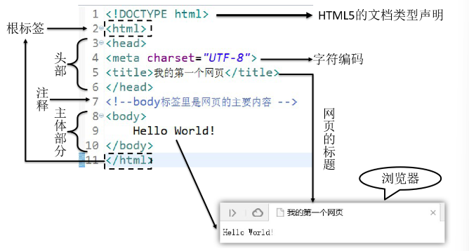
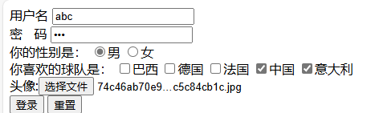
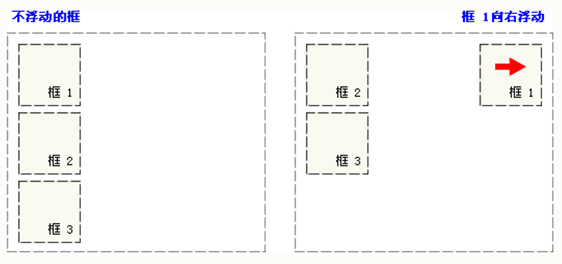
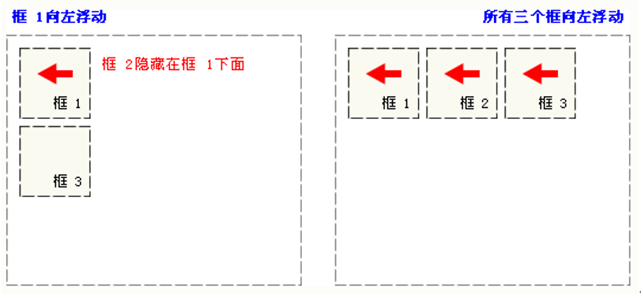
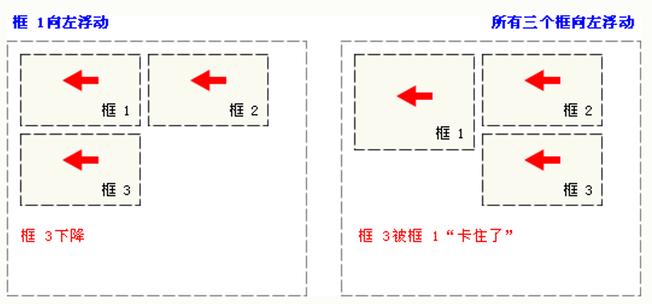
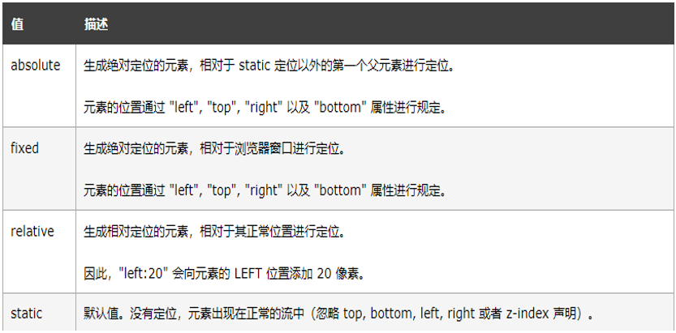
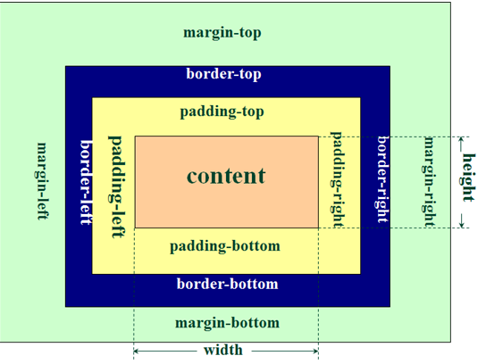
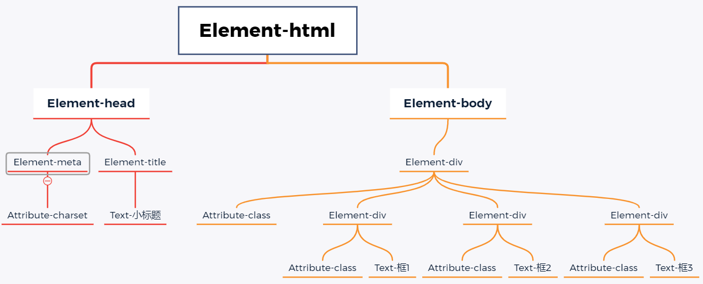
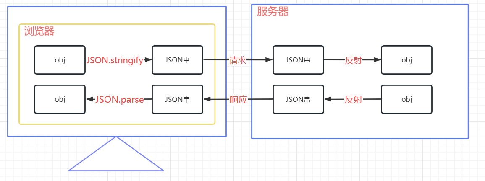

## HTML&CSS

### html5

是超文本标记语言

#### 基础结构

+ **文档类型声明**

  + html4：`<!DOCTYPE HTML PUBLIC "-//W3C//DTD HTML 4.01 Transitional//EN"
    "http://www.w3.org/TR/html4/loose.dtd">`

  + html5：`<!DOCTYPE html>`

+ **根标签**：`<html> </html>`

+ **头部元素**：`<head> </head>`

+ **主体元素**：`<body> </body>`

+ **注释**：`<!-- 注释内容 -->`



> **HTML规则：**
>
> 1. 无论是单 / 双标签都要正确关闭
> 2. 标签以及注释都不能嵌套
> 3. 属性必须有值，值必须加引号,H5中属性名和值相同时可以省略属性值
> 4. HTML中不严格区分字符串使用单双引号
> 5. HTML标签不严格区分大小写,但是不能大小写混用
> 6. 自定义标签无效


#### html标签

##### 常见标签

+ **标题标签**：`<h1> </h1> ... <h6> </h6>`

+ **段落标签**：`<p> </p>`

+ **换行标签**：`<br>`

  + 如果想添加分隔线,可以使用`<hr>`

+ **列表标签**：

  + 有序

    + 

      ```html
      <ol>
          <li>JAVA</li>
          <li>python</li>
          ...
      </ol>
      ```

  + 无序

    + 

      ```html
      <ul>
          <li>JAVA</li>
          ...
      </ul>
      ```

+ **超链接标签**：`<a href=''> </a>`

  + href用于定义链接
    + 可以使用绝对路径,以`/`开头,始终以一个固定路径作为基准路径作为出发点
    + 也可以使用相对路径,以当前文件所在路径为出发点
    + `href`中也可以定义完整的URL
  + target用于定义打开方式
    + `_blank` 在新窗口中打开目标资源
    + `_self`  在当前窗口中打开目标资源

+ **多媒体标签**：

  + **图片**：``
    + src定义图片的链接
    + title定义鼠标悬停时显示的文字
    + alt定义图片加载失败时显示的提示文字
  + **音频**：`<audio src='' />`
    + src定义目标声音资源
    + autoplay控制打开页面时是否自动播放
    + controls控制是否展示控制面板
    + loop控制是否进行循环播放

+ **表格标签**

  + `<table> </table>` 代表表格

  + `<thead> </thead>` 代表表头 可以省略不写

  + `<tbody> </tbody>` 代表表体 可以省略不写

  + `<tfoot> </tfoot>` 代表表尾  可以省略不写

  + `<tr> </tr>` 代表一行

  + `<td> </td>` 代表行内的一格，
    + **rowspan**属性实现上下跨行
    + **colspan**属性实现左右的跨列

  + `<th> </th>` 标签 自带加粗和居中效果的td

+ **布局**
  + `<div> </div>`  俗称"块",主要用于划分页面结构,做**页面布局**
  + `<span> </span>` 俗称"层",主要用于划分元素范围,配合CSS做页面元素样式的修饰
+ **特殊字符**：特殊含义的字符,需要通过转移字符来表示


##### 表单标签

+ `<form> </form>`,其内部用于定义可以让用户输入信息的表单项标签

  + `action`属性，用于定义信息提交的服务器的地址
  + `method`，用于定义信息的提交方式
    + `get`， 数据会缀到url后,以?作为参数开始的标识,多个参数用&隔开
    + ``post`，数据会通过请求体发送,不会在缀到url后

+ `<input/>`,主要的表单项标签,可以用于定义表单项

  + `name`属性,用于定义提交的参数名
  + `type`，用于定义表单项类型
    + `text`   文本框
    + `password`  密码框
    + `submit` 提交按钮
    + `reset`    重置按钮
    + `radio`  单选框
      + name属性相同的radio为一组，组内互斥
      + checked="checked"默认被选中
        + 如果属性名和属性值一样的话，可以省略属性值，只写checked即可
    + `checkbox`  复选框
      + checked="checked"默认被选中
    + `hidden` 不会显示到页面上，但是提交表单时会一起被提交。用来设置一些需要和表单一起提交但是不希望用户看到的数据
    + `file`  上传文件

+ 下拉框

  + 

    ```html
    你喜欢的运动是：
    <select name="interesting">
        <option value="swimming">游泳</option>
        <option value="running">跑步</option>
        <option value="shooting" selected="selected">射击</option>
        <option value="skating">溜冰</option>
    </select>
    ```

+ 按钮

  + 

    ```html
    <button type="button">普通按钮</button>或<input type="button" value="普通按钮"/>
    <button type="reset">重置按钮</button>或<input type="reset" value="重置按钮"/>
    <button type="submit">提交按钮</button>或<input type="submit" value="提交按钮"/>
    ```

+ 多行文本框：`<textarea name=''> </textarea>`

  + 没有value属性，如果要设置默认值需要写在开始和结束标签之间


**例子**：

```html
<!DOCTYPE html>
<html lang="en">
  <head>
    <meta charset="UTF-8" />
    <title>Document</title>
  </head>
  <body>
    <form action="" method="get">
      用户名 <input type="text" name="username" /> 
      <br />
      密&nbsp;&nbsp;&nbsp;码 <input type="password" name="password" /> 
      <br />
      你的性别是：
      <input type="radio" name="sex" value="boy" />男
      <input type="radio" name="sex" value="girl" checked="checked" />女
      <br />
      你喜欢的球队是： <input type="checkbox" name="team" value="Brazil" />巴西
      <input type="checkbox" name="team" value="German"  />德国
      <input type="checkbox" name="team" value="France" />法国
      <input type="checkbox" name="team" value="China" checked />中国
      <input type="checkbox" name="team" value="Italian" />意大利
      <br>
      头像:<input type="file" name="file"/>
      <br>
      <input type="submit" value="登录" />
      <input type="reset" value="重置" />
    </form>
  </body>
</html>

```



```
提交后url栏显示：
http://127.0.0.1:5500/HTML/%E8%A1%A8%E5%8D%95.html?username=abc&password=123&sex=boy&team=China&team=Italian&file=74c46ab70e9bda99d26189915df6d6bc5c84cb1c.jpg
```


### css

#### 引入方式

+ **行内式**
  + html代码和css样式代码交织在一起，css样式代码仅对当前元素有效
+ **内嵌式**
  + 需要在head标签中,通过一对style标签定义CSS样式
  + 样式的作用范围控制要依赖选择器
  + 样式代码中注释的方式为  /*   */
+ **连接式/外部样式表**
  + 创建单独的css文件存放样式代码
  + 在head标签中,通过`<link href="" rel="stylesheet" type="text/css"/>`引入外部CSS样式


#### css选择器

+ 元素选择器
  + `元素名 { }`
+ id选择器
  + `#元素id属性值 { }`
+ class选择器
  + `.class属性值 {}`
  + class属性值可以有多个


#### css浮动

CSS 的 Float（浮动）使元素脱离文档流，按照指定的方向（左或右发生移动），直到它的外边缘碰到包含框或另一个浮动框的边框为止。

+ 当把框 1 向右浮动时，它脱离文档流并且向右移动，直到它的右边缘碰到包含框的右边缘



+ 当框 1 向左浮动时，它脱离文档流并且向左移动，直到它的左边缘碰到包含框的左边缘。因为它不再处于文档流中，所以它不占据空间，实际上覆盖住了框 2，使框 2 从视图中消失。如果把所有三个框都向左移动，那么框 1 向左浮动直到碰到包含框，另外两个框向左浮动直到碰到前一个浮动框。



+ 如果包含框太窄，无法容纳水平排列的三个浮动元素，那么其它浮动块向下移动，直到有足够的空间。如果浮动元素的高度不同，那么当它们向下移动时可能被其它浮动元素“卡住”



浮动样式名：`float`

+ left 元素向左浮动
+ right 元素向右浮动
+ none 默认，元素不浮动


#### css定位



+ **绝对**定位后元素会**让出原来位置**,其他元素可以占用
+ **relative** 相对于自己原来的位置进行地位，相对定位后**保留原来的位置**,其他元素不会移动到该位置
+ **fixed** 定位在浏览器窗口固定位置,不会随着页面的上下移动而移动，元素定位后会**让出原来的位置**

> 块级元素垂直排列，行内元素水平排列


#### css盒子模型

所有HTML元素可以看作盒子。

+ Margin(外边距) - 清除边框外的区域，外边距是透明的。
+ Border(边框) - 围绕在内边距和内容外的边框。
+ Padding(内边距) - 清除内容周围的区域，内边距是透明的。
+ Content(内容) - 盒子的内容，显示文本和图像。




## js

### js基础语法

js特点：

+ 解释型脚本语言
+ 基于对象。可以创建、使用对象，能够实现封装，但不支持多态，所以不是面向对象语言。
+ 弱类型
+ 事件驱动
+ 跨平台


#### js组成

+ **BOM**：浏览器对象模型。
  + BOM由一系列对象组成，是访问、控制、修改浏览器的属性和方法
  + 没有统一的标准
  + window 顶级对象,代表整个浏览器窗口
    + **location**对象        浏览器的地址栏
    + **history**对象          浏览器的访问历史
    + **screen**对象           屏幕
    + **navigator**对象      浏览器软件本身
    + **document**对象     浏览器窗口目前解析的html文档
    + **console**对象                  浏览器开发者工具的控制台
    + **localStorage**对象          浏览器的本地数据持久化存储
    + **sessionStorage**对象      浏览器的本地数据会话级存储
+ **ECMA核心**
+ **DOM**
  + document对象代表整个html文档，DOM编程就是使用document对象的API完成对网页HTML文档进行动态修改,以实现网页数据和样式动态变化效果的编程.




#### js引入方式

+ 内部脚本引入
  + 通过一对script标签引入JS代码，位置随意，一般放在head标签中
+ 外部脚本方式引入
  + 在head标签中使用`<script src="js/button.js" type="text/javascript"></script>`引入，可以有多个script标签来引用外部js文件
  + 一对script标签要么用于定义内部脚本,要么用于引入外部js文件,不能混用


#### 数据类型和运算符

**数据类型**

+ 数值类型，统一为number，不区分整数、浮点数
+ 字符串类型，string，不严格区分单双引号
+ 布尔类型，boolean，非空字符串和非0数字都为‘真’
+ 引用数据类型，Object，各种对象和数组都为Object
+ function类型，各种函数都属于function类型
+ 命名未赋值，js为弱类型语言,统一使用 var 声明对象和变量,在赋值时才确定真正的数据类型,变量如果只声明没有赋值的话,数据类型为 undefined
+ 赋予NULL值，如果给一个变量赋值为null,其数据类型是Object, 可以通过**typeof关键字**判断数据类型

**变量**

+ `var`声明
+ `var`声明的变量可再次声明
+ js语句可以使用`;`结尾，也可以不用
+ 标识符大小写区分

**运算符**

+ 算数运算符：`+ - * / %`
  + `/` 在除0时,结果是`Infinity` ,而不是报错
  + `%`在模0时,结果是`NaN`,意思为 not a number ,而不是报错
+ 复合算数运算符：`++ -- += -= *= /= %=`
+ 关系运算符：`> < >= <= == === !=`
  + `== `符号,如果两端的数据类型不一致,会尝试将两端的数据转换成number,再对比number大小
    + '123'  这种字符串可以转换成数字
    + true会被转换成1 false会被转换成0
  + `=== ` 符号,如果两端数据类型不一致,直接返回false,数据类型一致在比较是否相同
+ 逻辑运算符：`|| &&`
  + 这里直接就是短路运算符，单个的 |   和 &  以及 ^ 是位运算符
+ 条件运算符：` 条件? 值1 : 值2 `
+ 位运算符：`& ^ << >> >>>`


#### 流程控制

+ if

  + f()中的非空字符串会被认为是true
  + if()中的非零数字会被认为是true

+ switch

+ while

+ for

+ foreach

  + 括号中的临时变量表示的是元素的索引,不是元素的值,

  + ()中也不在使用: 分隔,而是使用 in 关键字

  + 

    ```javascript
    var cities =["北京","上海","深圳","武汉","西安","成都"]
    document.write("<ul>")
    for(var index in  cities){
        document.write("<li>"+cities[index]+"</li>")
    }
    document.write("</ul>")
    ```


#### 函数

+ 函数没有权限控制符
+ 不用声明函数的返回值类型,需要返回直接return
+ 参数列表中,无需数据类型
+ 调用函数时,实参和形参的个数可以不一致
+ 声明函数时需要用function关键字
+ Js函数没有异常列表

```javascript
/* 
语法1 
    function 函数名 (参数列表){函数体}
            */
function sum(a, b){
    return a+b;
}
var result =sum(10,20);
console.log(result)

/* 
语法2
    var 函数名 = function (参数列表){函数体}
            */
var add = function(a, b){
    return a+b;
}
var result = add(1,2);
console.log(result);
```


#### 对象和JSON

##### 声明对象

+ `new Object()`

  + 

    ```javascript
    var person =new Object();
    // 给对象添加属性并赋值
    person.name="张小明";
    person.age=10;
    person.foods=["苹果","橘子","香蕉","葡萄"];
    // 给对象添加功能函数
    person.eat= function (){
        console.log(this.age+"岁的"+this.name+"喜欢吃:")
        for(var i = 0;i<this.foods.length;i++){
            console.log(this.foods[i])
        } 
    }
    //获得对象属性值
    console.log(person.name)
    console.log(person.age)
    //调用对象方法
    person.eat();
    ```

+ 通过`{}`创建对象

  + 

    ```javascript
    var person ={
        "name":"张小明",
        "age":10,
        "foods":["苹果","香蕉","橘子","葡萄"],
        "eat":function (){
            console.log(this.age+"岁的"+this.name+"喜欢吃:")
            for(var i = 0;i<this.foods.length;i++){
                console.log(this.foods[i])
            } 
        }
    }
    //获得对象属性值
    console.log(person.name)
    console.log(person.age)
    //调用对象方法
    person.eat();
    ```


##### JSON

+ 语法

  + 

    ```javascript
    var obj="{
    '属性名':'属性值',
    '属性名':{
    		'属性名':'属性值'
    	},
    '属性名':['值1','值1','值3']
    }"
    ```

  + JSON串转对象：`JSON.parse()`

  + 对象转JSON串：`JSON.stringify`

+ 前后端传数据




##### js常见对象

**Array**

+ 创建数组
  + new Array()                                                   创建空数组
  + new Array(5)                                                 创建数组时给定长度
  + new Array(ele1,ele2,ele3,... ... ,elen);          创建数组时指定元素值
  + [ele1,ele2,ele3,... ... ,elen];                           相当于第三种语法的简写
+ js中的数据长度是可以变化的

**Boolean**

+ `toString()`  把布尔值转换为字符串，并返回结果。
+ `valueOf()` 返回Boolean对象的原始值

**Date**

**Math**

**Number**

**String**


### 事件绑定

> 事件可以是浏览器行为，也可以是用户行为。 当这些一些行为发生时,可以自动触发对应的JS函数的运行

#### 常见事件

+ 鼠标事件

| 属性                                                         | 描述                                   |
| :----------------------------------------------------------- | :------------------------------------- |
| [onclick](https://www.runoob.com/jsref/event-onclick.html)   | 当用户点击某个对象时调用的事件句柄。   |
| [oncontextmenu](https://www.runoob.com/jsref/event-oncontextmenu.html) | 在用户点击鼠标右键打开上下文菜单时触发 |
| [ondblclick](https://www.runoob.com/jsref/event-ondblclick.html) | 当用户双击某个对象时调用的事件句柄。   |
| [onmousedown](https://www.runoob.com/jsref/event-onmousedown.html) | 鼠标按钮被按下。                       |
| [onmouseenter](https://www.runoob.com/jsref/event-onmouseenter.html) | 当鼠标指针移动到元素上时触发。         |
| [onmouseleave](https://www.runoob.com/jsref/event-onmouseleave.html) | 当鼠标指针移出元素时触发               |
| [onmousemove](https://www.runoob.com/jsref/event-onmousemove.html) | 鼠标被移动。                           |
| [onmouseover](https://www.runoob.com/jsref/event-onmouseover.html) | 鼠标移到某元素之上。                   |
| [onmouseout](https://www.runoob.com/jsref/event-onmouseout.html) | 鼠标从某元素移开。                     |
| [onmouseup](https://www.runoob.com/jsref/event-onmouseup.html) | 鼠标按键被松开。                       |

+ 键盘事件

| 属性                                                         | 描述                       |
| :----------------------------------------------------------- | :------------------------- |
| [onkeydown](https://www.runoob.com/jsref/event-onkeydown.html) | 某个键盘按键被按下。       |
| [onkeypress](https://www.runoob.com/jsref/event-onkeypress.html) | 某个键盘按键被按下并松开。 |
| [onkeyup](https://www.runoob.com/jsref/event-onkeyup.html)   | 某个键盘按键被松开。       |

+ 表单事件

| 属性                                                         | 描述                                                         |
| :----------------------------------------------------------- | :----------------------------------------------------------- |
| [onblur](https://www.runoob.com/jsref/event-onblur.html)     | 元素失去焦点时触发                                           |
| [onchange](https://www.runoob.com/jsref/event-onchange.html) | 该事件在表单元素的内容改变时触发(` <input>`,` <keygen>`, `<select>`, 和` <textarea>`) |
| [onfocus](https://www.runoob.com/jsref/event-onfocus.html)   | 元素获取焦点时触发                                           |
| [onfocusin](https://www.runoob.com/jsref/event-onfocusin.html) | 元素即将获取焦点时触发                                       |
| [onfocusout](https://www.runoob.com/jsref/event-onfocusout.html) | 元素即将失去焦点时触发                                       |
| [oninput](https://www.runoob.com/jsref/event-oninput.html)   | 元素获取用户输入时触发                                       |
| [onreset](https://www.runoob.com/jsref/event-onreset.html)   | 表单重置时触发                                               |
| [onsearch](https://www.runoob.com/jsref/event-onsearch.html) | 用户向搜索域输入文本时触发 ( `<input="search">`)             |
| [onselect](https://www.runoob.com/jsref/event-onselect.html) | 用户选取文本时触发 (` <input>` 和 `<textarea>`)              |
| [onsubmit](https://www.runoob.com/jsref/event-onsubmit.html) | 表单提交时触发                                               |

+ ......


#### 事件的绑定

通过属性绑定事件

```html
    <head>
        <meta charset="UTF-8">
        <title>小标题</title>
      
        <script>
            function testDown1(){
                console.log("down1")
            }
            function testDown2(){
                console.log("down2")
            }
            function testFocus(){
                console.log("获得焦点")
            }

            function testBlur(){
                console.log("失去焦点")
            }
            function testChange(input){
                console.log("内容改变")
                console.log(input.value);
            }
            function testMouseOver(){
                console.log("鼠标悬停")
            }
            function testMouseLeave(){
                console.log("鼠标离开")
            }
            function testMouseMove(){
                console.log("鼠标移动")
            }
        </script>
    </head>

    <body>
        <input type="text" 
        onkeydown="testDown1(),testDown2()"
        onfocus="testFocus()" 
        onblur="testBlur()" 
        onchange="testChange(this)"
        onmouseover="testMouseOver()" 
        onmouseleave="testMouseLeave()" 
        onmousemove="testMouseMove()" 
         />
    </body>
```

+ 方法中可以传入` this`对象,代表当前元素


通过DOM编程绑定

```html
    <head>
        <meta charset="UTF-8">
        <title>小标题</title>
      
        <script>
            // 页面加载完毕事件,浏览器加载完整个文档行为
            window.onload=function(){
                var in1 =document.getElementById("in1");
                // 通过DOM编程绑定事件
                in1.onchange=testChange
            }
            function testChange(){
                console.log("内容改变")
                console.log(event.target.value);
            }
        </script>
    </head>

    <body>
        <input id="in1" type="text" />
    </body>
```


### BOM

#### window对象的常见属性和方法

+ 常见属性

| 属性                                                         | 描述                                                         |
| :----------------------------------------------------------- | :----------------------------------------------------------- |
| [closed](https://www.runoob.com/jsref/prop-win-closed.html)  | 返回窗口是否已被关闭。                                       |
| [defaultStatus](https://www.runoob.com/jsref/prop-win-defaultstatus.html) | 设置或返回窗口状态栏中的默认文本。                           |
| [document](https://www.runoob.com/jsref/dom-obj-document.html) | 对 Document 对象的只读引用。(参阅[对象](https://www.runoob.com/jsref/dom-obj-document.html)) |
| [frames](https://www.runoob.com/jsref/prop-win-frames.html)  | 返回窗口中所有命名的框架。该集合是 Window 对象的数组，每个 Window 对象在窗口中含有一个框架。 |
| [history](https://www.runoob.com/jsref/obj-history.html)     | 对 History 对象的只读引用。参阅 [History 对象](https://www.runoob.com/jsref/obj-history.html)。 |
| [innerHeight](https://www.runoob.com/jsref/prop-win-innerheight.html) | 返回窗口的文档显示区的高度。                                 |
| [innerWidth](https://www.runoob.com/jsref/prop-win-innerheight.html) | 返回窗口的文档显示区的宽度。                                 |
| [localStorage](https://www.runoob.com/jsref/prop-win-localstorage.html) | 在浏览器中存储 key/value 对。没有过期时间。                  |
| [length](https://www.runoob.com/jsref/prop-win-length.html)  | 设置或返回窗口中的框架数量。                                 |
| [location](https://www.runoob.com/jsref/obj-location.html)   | 用于窗口或框架的 Location 对象。参阅 [Location 对象](https://www.runoob.com/jsref/obj-location.html)。 |
| [name](https://www.runoob.com/jsref/prop-win-name.html)      | 设置或返回窗口的名称。                                       |
| [navigator](https://www.runoob.com/jsref/obj-navigator.html) | 对 Navigator 对象的只读引用。参数 [Navigator 对象](https://www.runoob.com/jsref/obj-navigator.html)。 |
| [opener](https://www.runoob.com/jsref/prop-win-opener.html)  | 返回对创建此窗口的窗口的引用。                               |
| [outerHeight](https://www.runoob.com/jsref/prop-win-outerheight.html) | 返回窗口的外部高度，包含工具条与滚动条。                     |
| [outerWidth](https://www.runoob.com/jsref/prop-win-outerheight.html) | 返回窗口的外部宽度，包含工具条与滚动条。                     |
| [pageXOffset](https://www.runoob.com/jsref/prop-win-pagexoffset.html) | 设置或返回当前页面相对于窗口显示区左上角的 X 位置。          |
| [pageYOffset](https://www.runoob.com/jsref/prop-win-pagexoffset.html) | 设置或返回当前页面相对于窗口显示区左上角的 Y 位置。          |
| [parent](https://www.runoob.com/jsref/prop-win-parent.html)  | 返回父窗口。                                                 |
| [screen](https://www.runoob.com/jsref/obj-screen.html)       | 对 Screen 对象的只读引用。参阅 [Screen 对象](https://www.runoob.com/jsref/obj-screen.html)。 |
| [screenLeft](https://www.runoob.com/jsref/prop-win-screenleft.html) | 返回相对于屏幕窗口的x坐标                                    |
| [screenTop](https://www.runoob.com/jsref/prop-win-screenleft.html) | 返回相对于屏幕窗口的y坐标                                    |
| [screenX](https://www.runoob.com/jsref/prop-win-screenx.html) | 返回相对于屏幕窗口的x坐标                                    |
| [sessionStorage](https://www.runoob.com/jsref/prop-win-sessionstorage.html) | 在浏览器中存储 `key/value` 对。 在关闭窗口或标签页之后将会删除这些数据。 |
| [screenY](https://www.runoob.com/jsref/prop-win-screenx.html) | 返回相对于屏幕窗口的y坐标                                    |
| [self](https://www.runoob.com/jsref/prop-win-self.html)      | 返回对当前窗口的引用。等价于 Window 属性。                   |
| [status](https://www.runoob.com/jsref/prop-win-status.html)  | 设置窗口状态栏的文本。                                       |
| [top](https://www.runoob.com/jsref/prop-win-top.html)        | 返回最顶层的父窗口。                                         |


+ 常见方法

| 方法                                                         | 描述                                                         |
| :----------------------------------------------------------- | :----------------------------------------------------------- |
| [alert()](https://www.runoob.com/jsref/met-win-alert.html)   | 显示带有一段消息和一个确认按钮的警告框。                     |
| [atob()](https://www.runoob.com/jsref/met-win-atob.html)     | 解码一个 base-64 编码的字符串。                              |
| [btoa()](https://www.runoob.com/jsref/met-win-btoa.html)     | 创建一个 base-64 编码的字符串。                              |
| [blur()](https://www.runoob.com/jsref/met-win-blur.html)     | 把键盘焦点从顶层窗口移开。                                   |
| [clearInterval()](https://www.runoob.com/jsref/met-win-clearinterval.html) | 取消由 setInterval() 设置的 timeout。                        |
| [clearTimeout()](https://www.runoob.com/jsref/met-win-cleartimeout.html) | 取消由 setTimeout() 方法设置的 timeout。                     |
| [close()](https://www.runoob.com/jsref/met-win-close.html)   | 关闭浏览器窗口。                                             |
| [confirm()](https://www.runoob.com/jsref/met-win-confirm.html) | 显示带有一段消息以及确认按钮和取消按钮的对话框。             |
| [createPopup()](https://www.runoob.com/jsref/met-win-createpopup.html) | 创建一个 pop-up 窗口。                                       |
| [focus()](https://www.runoob.com/jsref/met-win-focus.html)   | 把键盘焦点给予一个窗口。                                     |
| [getSelection](https://www.runoob.com/jsref/met-win-getselection.html)() | 返回一个 Selection 对象，表示用户选择的文本范围或光标的当前位置。 |
| [getComputedStyle()](https://www.runoob.com/jsref/jsref-getcomputedstyle.html) | 获取指定元素的 CSS 样式。                                    |
| [matchMedia()](https://www.runoob.com/jsref/met-win-matchmedia.html) | 该方法用来检查 media query 语句，它返回一个 MediaQueryList对象。 |
| [moveBy()](https://www.runoob.com/jsref/met-win-moveby.html) | 可相对窗口的当前坐标把它移动指定的像素。                     |
| [moveTo()](https://www.runoob.com/jsref/met-win-moveto.html) | 把窗口的左上角移动到一个指定的坐标。                         |
| [open()](https://www.runoob.com/jsref/met-win-open.html)     | 打开一个新的浏览器窗口或查找一个已命名的窗口。               |
| [print()](https://www.runoob.com/jsref/met-win-print.html)   | 打印当前窗口的内容。                                         |
| [prompt()](https://www.runoob.com/jsref/met-win-prompt.html) | 显示可提示用户输入的对话框。                                 |
| [resizeBy()](https://www.runoob.com/jsref/met-win-resizeby.html) | 按照指定的像素调整窗口的大小。                               |
| [resizeTo()](https://www.runoob.com/jsref/met-win-resizeto.html) | 把窗口的大小调整到指定的宽度和高度。                         |
| scroll()                                                     | 已废弃。 该方法已经使用了 [scrollTo()](https://www.runoob.com/jsref/met-win-scrollto.html) 方法来替代。 |
| [scrollBy()](https://www.runoob.com/jsref/met-win-scrollby.html) | 按照指定的像素值来滚动内容。                                 |
| [scrollTo()](https://www.runoob.com/jsref/met-win-scrollto.html) | 把内容滚动到指定的坐标。                                     |
| [setInterval()](https://www.runoob.com/jsref/met-win-setinterval.html) | 按照指定的周期（以毫秒计）来调用函数或计算表达式。           |
| [setTimeout()](https://www.runoob.com/jsref/met-win-settimeout.html) | 在指定的毫秒数后调用函数或计算表达式。                       |
| [stop()](https://www.runoob.com/jsref/met-win-stop.html)     | 停止页面载入。                                               |
| [postMessage()](https://www.runoob.com/jsref/met-win-postmessage.html) | 安全地实现跨源通信。                                         |


#### BOM实现会话级和持久级数据存储

+ 会话级数据 : 内存型数据,浏览器关闭后,数据失去
+ 持久级数据 : 磁盘型数据,浏览器关闭后,数据仍在

```html
<!DOCTYPE html>
<html lang="en">
<head>
    <meta charset="UTF-8">
    <meta name="viewport" content="width=device-width, initial-scale=1.0">
    <title>Document</title>
    <script>
        function saveItem(){
            // 让浏览器存储一些会话级数据
            window.sessionStorage.setItem("sessionMsg","sessionValue")
            // 让浏览器存储一些持久级数据
            window.localStorage.setItem("localMsg","localValue")

            console.log("haha")
        }

        function removeItem(){
            // 删除数据
            sessionStorage.removeItem("sessionMsg")
            localStorage.removeItem("localMsg")
        }

        function readItem(){
            console.log("read")
            // 读取数据
            console.log("session:"+sessionStorage.getItem("sessionMsg"))
            console.log("local:"+localStorage.getItem("localMsg"))
        }
    </script>
</head>
<body>

    <button onclick="saveItem()">存储数据</button>
    <button onclick="removeItem()">删除数据</button>
    <button onclick="readItem()">读取数据</button>

</body>
</html>
```


### DOM

> 使用document对象的API完成对网页HTML文档进行动态修改,以实现网页数据和样式动态变化效果的编程.


#### 获取页面元素的方式

+ 在整个文档范围内查找元素节点

| 功能               | API                                     | 返回值           |
| ------------------ | --------------------------------------- | ---------------- |
| 根据id值查询       | document.getElementById(“id值”)         | 一个具体的元素节 |
| 根据标签名查询     | document.getElementsByTagName(“标签名”) | 元素节点数组     |
| 根据name属性值查询 | document.getElementsByName(“name值”)    | 元素节点数组     |
| 根据类名查询       | document.getElementsByClassName("类名") | 元素节点数组     |

+ 在具体元素节点范围内查找**子节点**

| 功能               | API                       | 返回值         |
| ------------------ | ------------------------- | -------------- |
| 查找子标签         | element.children          | 返回子标签数组 |
| 查找第一个子标签   | element.firstElementChild | 标签对象       |
| 查找最后一个子标签 | element.lastElementChild  | 节点对象       |

+ 查找指定元素节点的**兄弟节点**

| 功能               | API                         | 返回值   |
| ------------------ | --------------------------- | -------- |
| 查找前一个兄弟标签 | node.previousElementSibling | 标签对象 |
| 查找后一个兄弟标签 | node.nextElementSibling     | 标签对象 |


#### 操作元素属性值

+ 属性操作

| 需求       | 操作方式                   |
| ---------- | -------------------------- |
| 读取属性值 | 元素对象.属性名            |
| 修改属性值 | 元素对象.属性名=新的属性值 |

+ 内部文本操作

| 需求                         | 操作方式          |
| ---------------------------- | ----------------- |
| 获取或者设置标签体的文本内容 | element.innerText |
| 获取或者设置标签体的内容     | element.innerHTML |


#### 增删元素

| API                                      | 功能                                       |
| ---------------------------------------- | ------------------------------------------ |
| document.createElement(“标签名”)         | 创建元素节点并返回，但不会自动添加到文档中 |
| document.createTextNode(“文本值”)        | 创建文本节点并返回，但不会自动添加到文档中 |
| element.appendChild(ele)                 | 将ele添加到element所有子节点后面           |
| parentEle.insertBefore(newEle,targetEle) | 将newEle插入到targetEle前面                |
| parentEle.replaceChild(newEle, oldEle)   | 用新节点替换原有的旧子节点                 |
| element.remove()                         | 删除某个标签                               |


### 正则

语法：

```javascript
var patt=new RegExp(pattern,modifiers);
或者:
var patt=/pattern/modifiers; // modifiers是修饰符

```


#### 修饰符

| 修饰符                                             | 描述                                                     |
| :------------------------------------------------- | :------------------------------------------------------- |
| [i](https://www.runoob.com/js/jsref-regexp-i.html) | 执行对大小写不敏感的匹配。                               |
| [g](https://www.runoob.com/js/jsref-regexp-g.html) | 执行全局匹配（查找所有匹配而非在找到第一个匹配后停止）。 |
| m                                                  | 执行多行匹配。                                           |

+ 全文查找

```javascript
// 目标字符串
var targetStr = 'Hello World!';
// 使用了全局匹配的正则表达式
var reg = /[A-Z]/g;
// 获取全部匹配
var resultArr = targetStr.match(reg);
// 数组长度为2
console.log("resultArr.length="+resultArr.length);
// 遍历数组，发现可以获取到“H”和“W”
for(var i = 0; i < resultArr.length; i++){
  console.log("resultArr["+i+"]="+resultArr[i]);
}
```

+ 忽略大小写

```javascript
//目标字符串
var targetStr = 'Hello WORLD!';
//使用了忽略大小写的正则表达式
var reg = /o/gi;
//获取全部匹配
var resultArr = targetStr.match(reg);
//数组长度为2
console.log("resultArr.length="+resultArr.length);
//遍历数组，得到'o'和'O'
for(var i = 0; i < resultArr.length; i++){
  console.log("resultArr["+i+"]="+resultArr[i]);
}java
```


#### 方括号

| 表达式                                                       | 描述                               |
| :----------------------------------------------------------- | :--------------------------------- |
| [[abc\]](https://www.runoob.com/jsref/jsref-regexp-charset.html) | 查找方括号之间的任何字符。         |
| [[^abc\]](https://www.runoob.com/jsref/jsref-regexp-charset-not.html) | 查找任何不在方括号之间的字符。     |
| [0-9]                                                        | 查找任何从 0 至 9 的数字。         |
| [a-z]                                                        | 查找任何从小写 a 到小写 z 的字符。 |
| [A-Z]                                                        | 查找任何从大写 A 到大写 Z 的字符。 |
| [A-z]                                                        | 查找任何从大写 A 到小写 z 的字符。 |
| [adgk]                                                       | 查找给定集合内的任何字符。         |
| [^adgk]                                                      | 查找给定集合外的任何字符。         |
| (red\|blue\|green)                                           | 查找任何指定的选项。               |


#### 元字符

| 元字符                                                       | 描述                                        |
| :----------------------------------------------------------- | :------------------------------------------ |
| [.](https://www.runoob.com/jsref/jsref-regexp-dot.html)      | 查找单个字符，除了换行和行结束符。          |
| [\\w](https://www.runoob.com/jsref/jsref-regexp-wordchar.html) | 查找数字、字母及下划线。                    |
| [\\W](https://www.runoob.com/jsref/jsref-regexp-wordchar-non.html) | 查找非单词字符。                            |
| [\\d](https://www.runoob.com/jsref/jsref-regexp-digit.html)  | 查找数字。                                  |
| [\\D](https://www.runoob.com/jsref/jsref-regexp-digit-non.html) | 查找非数字字符。                            |
| [\\s](https://www.runoob.com/jsref/jsref-regexp-whitespace.html) | 查找空白字符。                              |
| [\\S](https://www.runoob.com/jsref/jsref-regexp-whitespace-non.html) | 查找非空白字符。                            |
| [\\b](https://www.runoob.com/jsref/jsref-regexp-begin.html)  | 匹配单词边界。                              |
| [\\B](https://www.runoob.com/jsref/jsref-regexp-begin-not.html) | 匹配非单词边界。                            |
| \\0                                                          | 查找 NULL 字符。                            |
| [\\n](https://www.runoob.com/jsref/jsref-regexp-newline.html) | 查找换行符。                                |
| \\f                                                          | 查找换页符。                                |
| \\r                                                          | 查找回车符。                                |
| \\t                                                          | 查找制表符。                                |
| \\v                                                          | 查找垂直制表符。                            |
| [\\xxx](https://www.runoob.com/jsref/jsref-regexp-octal.html) | 查找以八进制数 xxx 规定的字符。             |
| [\\xdd](https://www.runoob.com/jsref/jsref-regexp-hex.html)  | 查找以十六进制数 dd 规定的字符。            |
| [\\uxxxx](https://www.runoob.com/jsref/jsref-regexp-unicode-hex.html) | 查找以十六进制数 xxxx 规定的 Unicode 字符。 |


#### 量词

| 量词                                                         | 描述                                                         |
| :----------------------------------------------------------- | :----------------------------------------------------------- |
| [n+](https://www.runoob.com/jsref/jsref-regexp-onemore.html) | 匹配任何包含至少一个 n 的字符串。例如，/a+/ 匹配 "candy" 中的 "a"，"caaaaaaandy" 中所有的 "a"。 |
| [n*](https://www.runoob.com/jsref/jsref-regexp-zeromore.html) | 匹配任何包含零个或多个 n 的字符串。例如，/bo*/ 匹配 "A ghost booooed" 中的 "boooo"，"A bird warbled" 中的 "b"，但是不匹配 "A goat grunted"。 |
| [n?](https://www.runoob.com/jsref/jsref-regexp-zeroone.html) | 匹配任何包含零个或一个 n 的字符串。例如，/e?le?/ 匹配 "angel" 中的 "el"，"angle" 中的 "le"。 |
| [n{X}](https://www.runoob.com/jsref/jsref-regexp-nx.html)    | 匹配包含 X 个 n 的序列的字符串。例如，/a{2}/ 不匹配 "candy," 中的 "a"，但是匹配 "caandy," 中的两个 "a"，且匹配 "caaandy." 中的前两个 "a"。 |
| [n{X,}](https://www.runoob.com/jsref/jsref-regexp-nxcomma.html) | X 是一个正整数。前面的模式 n 连续出现至少 X 次时匹配。例如，/a{2,}/ 不匹配 "candy" 中的 "a"，但是匹配 "caandy" 和 "caaaaaaandy." 中所有的 "a"。 |
| [n{X,Y}](https://www.runoob.com/jsref/jsref-regexp-nxy.html) | X 和 Y 为正整数。前面的模式 n 连续出现至少 X 次，至多 Y 次时匹配。例如，/a{1,3}/ 不匹配 "cndy"，匹配 "candy," 中的 "a"，"caandy," 中的两个 "a"，匹配 "caaaaaaandy" 中的前面三个 "a"。注意，当匹配 "caaaaaaandy" 时，即使原始字符串拥有更多的 "a"，匹配项也是 "aaa"。 |
| [n$](https://www.runoob.com/jsref/jsref-regexp-ndollar.html) | 匹配任何结尾为 n 的字符串。                                  |
| [^n](https://www.runoob.com/jsref/jsref-regexp-ncaret.html)  | 匹配任何开头为 n 的字符串。                                  |
| [?=n](https://www.runoob.com/jsref/jsref-regexp-nfollow.html) | 匹配任何其后紧接指定字符串 n 的字符串。                      |
| [?!n](https://www.runoob.com/jsref/jsref-regexp-nfollow-not.html) | 匹配任何其后没有紧接指定字符串 n 的字符串。                  |

```javascript
var str01 = 'I love Java';
var str02 = 'Java love me';
// 匹配以Java开头
var reg = /^Java/g;
console.log('reg.test(str01)='+reg.test(str01)); // false
console.log("<br />");
console.log('reg.test(str02)='+reg.test(str02)); // true
```

```javascript
var str01 = 'I love Java';
var str02 = 'Java love me';
// 匹配以Java结尾
var reg = /Java$/g;
console.log('reg.test(str01)='+reg.test(str01)); // true
console.log("<br />");
console.log('reg.test(str02)='+reg.test(str02)); // false
```

```javascript
//n位数字的正则
var targetStr="123456789";
var reg=/^[0-9]{0,}$/;
//或者 ： var reg=/^\d*$/;
var b = reg.test(targetStr);//true
```

```javascript
//数字+字母+下划线，6-16位
var targetStr="HelloWorld";
var reg=/^[a-z0-9A-Z_]{6,16}$/;
var b = reg.test(targetStr);//true
```


#### RegExp对象方法

| 方法                                                         | 描述                                               |
| :----------------------------------------------------------- | :------------------------------------------------- |
| [exec](https://www.runoob.com/jsref/jsref-exec-regexp.html)  | 检索字符串中指定的值。返回找到的值，并确定其位置。 |
| [test](https://www.runoob.com/jsref/jsref-test-regexp.html)  | 检索字符串中指定的值。返回 true 或 false。         |
| [toString](https://www.runoob.com/jsref/jsref-regexp-tostring.html) | 返回正则表达式的字符串。                           |

+ 验证

```javascript
// 创建一个最简单的正则表达式对象
var reg = /o/;
// 创建一个字符串对象作为目标字符串
var str = 'Hello World!';
// 调用正则表达式对象的test()方法验证目标字符串是否满足我们指定的这个模式，返回结果true
console.log("/o/.test('Hello World!')="+reg.test(str));
```


#### 支持正则的String方法

| 方法                                                    | 描述                             |
| :------------------------------------------------------ | :------------------------------- |
| [search](https://www.runoob.com/js/jsref-search.html)   | 检索与正则表达式相匹配的值。     |
| [match](https://www.runoob.com/js/jsref-match.html)     | 找到一个或多个正则表达式的匹配。 |
| [replace](https://www.runoob.com/js/jsref-replace.html) | 替换与正则表达式匹配的子串。     |
| [split](https://www.runoob.com/js/jsref-split.html)     | 把字符串分割为字符串数组。       |

+ 匹配

```javascript
// 创建一个最简单的正则表达式对象
var reg = /o/;
// 创建一个字符串对象作为目标字符串
var str = 'Hello World!';
// 在目标字符串中查找匹配的字符，返回匹配结果组成的数组
var resultArr = str.match(reg);
// 数组长度为1
console.log("resultArr.length="+resultArr.length);

// 数组内容是o
console.log("resultArr[0]="+resultArr[0]);
```

+ 替换

```javascript
// 创建一个最简单的正则表达式对象
var reg = /o/;
// 创建一个字符串对象作为目标字符串
var str = 'Hello World!';
var newStr = str.replace(reg,'@');
// 只有第一个o被替换了，说明我们这个正则表达式只能匹配第一个满足的字符串
console.log("str.replace(reg)="+newStr);//Hell@ World!

// 原字符串并没有变化，只是返回了一个新字符串
console.log("str="+str);//str=Hello World!
```

