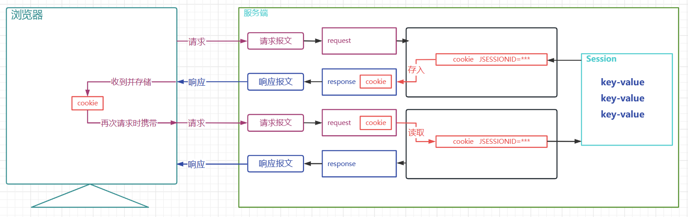
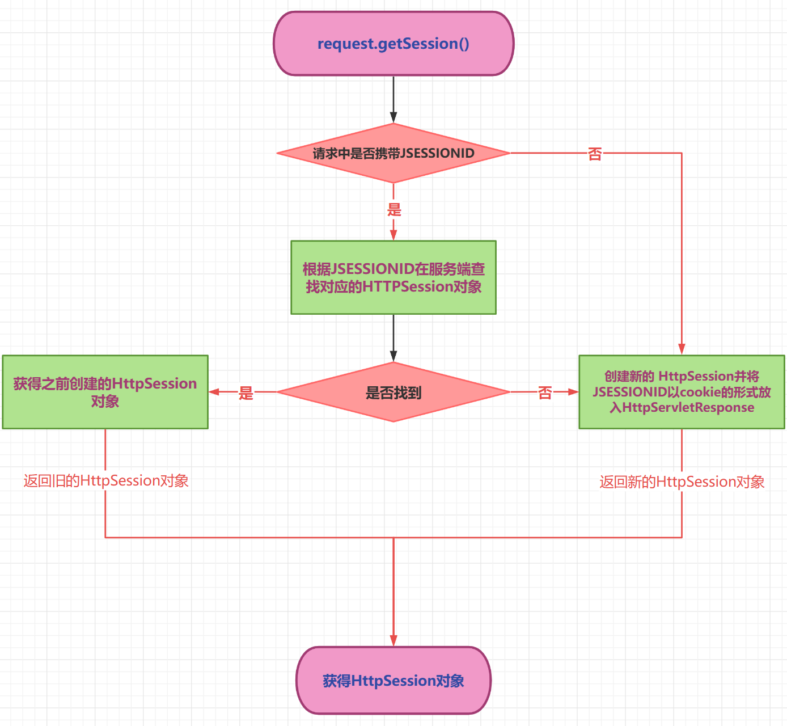
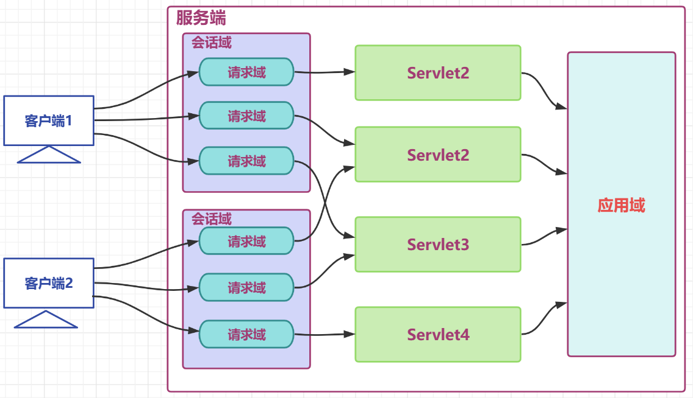
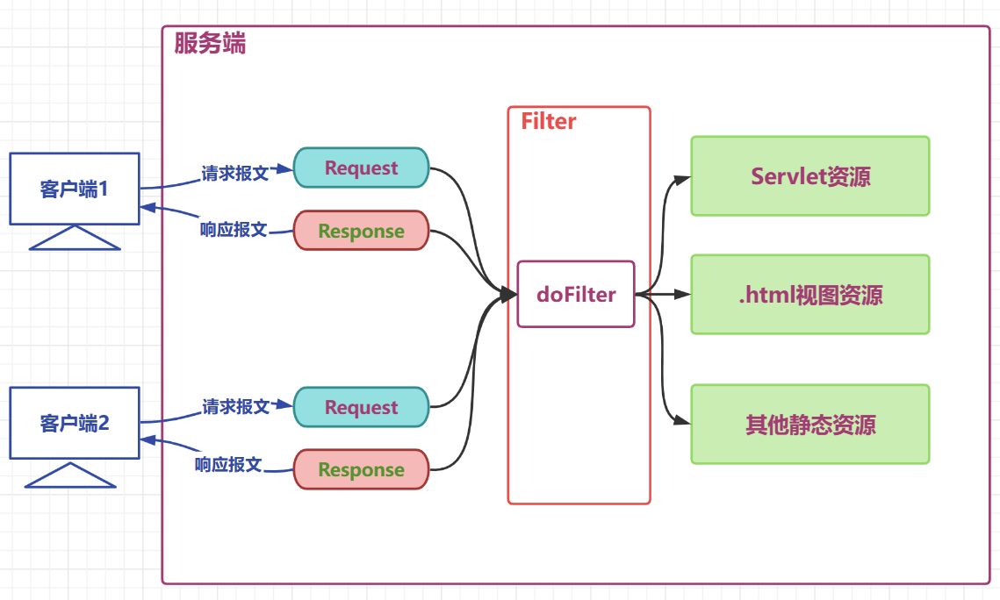
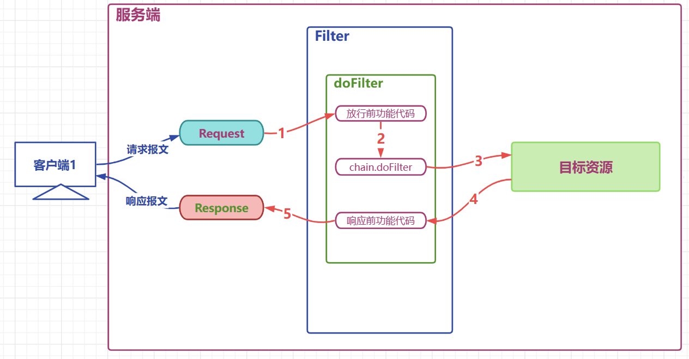
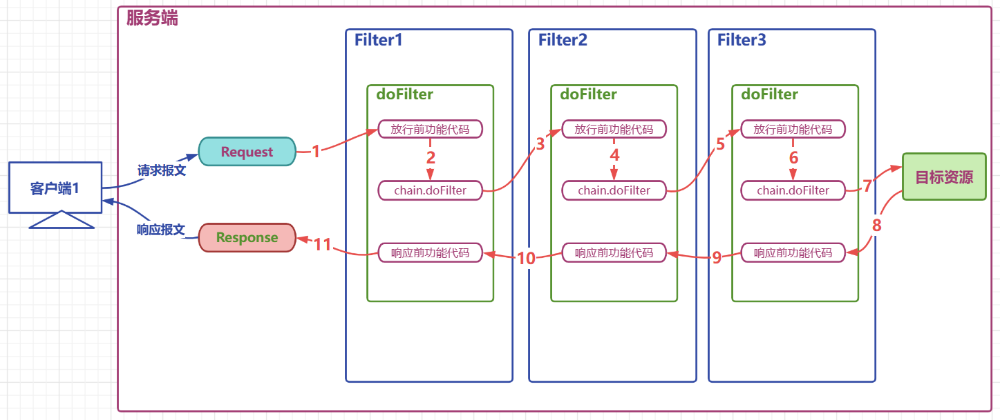

## 会话

HTTP是无状态协议

会话管理实现：

+ cookie是在客户端保留少量数据的技术,主要通过响应头向客户端响应一些客户端要保留的信息
+ session是在服务端保留更多数据的技术,主要通过HttpSession对象保存一些和客户端相关的信息


### Cookie

+ 服务端创建cookie,将cookie放入响应对象中,Tomcat容器将cookie转化为set-cookie响应头,响应给客户端
+ 客户端在收到cookie的响应头时,在下次请求该服务的资源时,会以cookie请求头的形式携带之前收到的Cookie
+ cookie是一种键值对格式的数据,从tomcat8.5开始可以保存中文,但是不推荐
+ 由于cookie是存储于客户端的数据,比较容易暴露,一般不存储一些敏感或者影响安全的数据

+ Cookie的持久性：
  + 默认情况下Cookie的有效期是一次会话范围内，我们可以通过cookie的setMaxAge()方法让Cookie持久化保存到浏览器上。
  + cookie.setMaxAge(int expiry)参数单位是秒，表示cookie的持久化时间，如果设置参数为0，表示将浏览器中保存的该cookie删除。

创建cookie：

```java
@WebServlet("/servletA")
public class ServletA extends HttpServlet {
    @Override
    protected void service(HttpServletRequest req, HttpServletResponse resp) throws ServletException, IOException {
        // 创建Cookie
        Cookie cookie1 =new Cookie("c1","c1_message");
        cookie1.setMaxAge(60);
        Cookie cookie2 =new Cookie("c2","c2_message");
        // 将cookie放入响应对象
        resp.addCookie(cookie1);
        resp.addCookie(cookie2);
    }
}
```

读取cookie：

```java
@WebServlet("/servletB")
public class ServletB extends HttpServlet {
    @Override
    protected void service(HttpServletRequest req, HttpServletResponse resp) throws ServletException, IOException {
        //获取请求中的cookie
        Cookie[] cookies = req.getCookies();
        //迭代cookies数组
        if (null != cookies && cookies.length!= 0) {
            for (Cookie cookie : cookies) {
                System.out.println(cookie.getName()+":"+cookie.getValue());
            }
        }
    }
}
```

> 可以在cookie里面存放用户名、视频进度等信息


+ Cookie的提交路径

  + 访问资源时不每次都需要把所有Cookie带上。访问不同的资源时,可以携带不同的cookie,我们可以通过cookie的setPath(String path) 对cookie的路径进行设置

  + 

    ```java
    public class ServletA extends HttpServlet {
        @Override
        protected void service(HttpServletRequest req, HttpServletResponse resp) throws ServletException, IOException {
            // 创建Cookie
            Cookie cookie1 =new Cookie("c1","c1_message");
            // 设置cookie的提交路径
            cookie1.setPath("/web03_war_exploded/servletB");
            Cookie cookie2 =new Cookie("c2","c2_message");
            // 将cookie放入响应对象
            resp.addCookie(cookie1);
            resp.addCookie(cookie2);
        }
    }
    
    ```


### Session

+ 服务器会为每一个客户端开辟一块内存空间,即session对象. 客户端在发送请求时,都可以使用自己的session. 这样服务端就可以通过session来记录某个客户端的状态了
+ 服务端在为客户端创建session时,会同时将session对象的id,即JSESSIONID以cookie的形式放入响应对象
+ 客户端下一次请求时携带JSESSIONID,后端收到后,根据JSESSIONID找到对应的session对象



> 可以用来记录账号的敏感信息、用户的访问痕迹、购物车记录 ...


+ session读取和写入数据

```java
@WebServlet("/servletA")
public class ServletA extends HttpServlet {
    @Override
    protected void service(HttpServletRequest req, HttpServletResponse resp) throws ServletException, IOException {
        // 获取请求中的参数
        String username = req.getParameter("username");
        // 获取session对象
        HttpSession session = req.getSession();
         // 获取Session的ID
        String jSessionId = session.getId();
        // 判断session是不是新创建的session
        boolean isNew = session.isNew();
        // 向session对象中存入数据
        session.setAttribute("username",username);
        // 从session中取出数据
        String username = (String)session.getAttribute("username");
        System.out.println(username);

    }
}
```

+ getSession 方法的处理逻辑




+ session的时效性

  + 默认30分钟

  + 可以在web.xml中修改

    + 
      
      ```xml
      <session-config>
      	<session-timeout>1</session-timeout>
      </session-config>
      ```
      
    + 通过HttpSession的API：`session.setMaxInactiveInterval(60);`
    
    + 直接失效：`session.invalidate();`

### 三大域对象

+ **请求域**对象是HttpServletRequest ,传递数据的范围是一次请求之内及请求转发
+ **会话域**对象是HttpSession,传递数据的范围是一次会话之内,可以跨多个请求
+ **应用域**对象是ServletContext,传递数据的范围是本应用之内,可以跨多个会话




域对象API：

| API                                         | 功能                    |
| ------------------------------------------- | ----------------------- |
| void setAttribute(String name,String value) | 向域对象中添加/修改数据 |
| Object getAttribute(String name);           | 从域对象中获取数据      |
| removeAttribute(String name);               | 移除域对象中的数据      |


## 过滤器

+ Filter接口定义了过滤器的开发规范,所有的过滤器都要实现该接口
+ Filter的工作位置是项目中所有目标资源之前,容器在创建HttpServletRequest和HttpServletResponse对象后,会先调用Filter的doFilter方法
+ Filter的doFilter方法可以控制请求是否继续,如果放行,则请求继续,如果拒绝,则请求到此为止,由过滤器本身做出响应



> 可以用来做：登录权限检查,解决网站乱码,过滤敏感字符,日志记录,性能分析... 

+ API

| API                                                          | 目标                                                         |
| ------------------------------------------------------------ | ------------------------------------------------------------ |
| default public void init(FilterConfig filterConfig)          | 初始化方法,由容器调用并传入初始配置信息filterConfig对象      |
| public void doFilter(ServletRequest request, ServletResponse response, FilterChain chain) | 过滤方法,核心方法,过滤请求,决定是否放行,响应之前的其他处理等都在该方法中 |
| default public void destroy()                                | 销毁方法,容器在回收过滤器对象之前调用的方法                  |


### 过滤器使用、

```java
//用户请求到达目标资源之前,记录用户的请求资源路径
//响应之前记录本次请求目标资源运算的耗时
//可以选择将日志记录进入文件,为了方便测试,这里将日志直接在控制台打印

public class LoggingFilter  implements Filter {

    private SimpleDateFormat dateFormat =new SimpleDateFormat("yyyy-MM-dd HH:mm:ss");
    @Override
    public void doFilter(ServletRequest servletRequest, ServletResponse servletResponse, FilterChain filterChain) throws IOException, ServletException {
        // 参数父转子
        HttpServletRequest request =(HttpServletRequest)  servletRequest;
        HttpServletResponse  response =(HttpServletResponse)  servletResponse;
        // 拼接日志文本
        String requestURI = request.getRequestURI();
        String time = dateFormat.format(new Date());
        String beforeLogging =requestURI+"在"+time+"被请求了";
        // 打印日志
        System.out.println(beforeLogging);
        // 获取系统时间
        long t1 = System.currentTimeMillis();
        // 放行请求
        filterChain.doFilter(request,response); //这行代码的功能是放行请求,如果没有这一行代码,则请求到此为止

        // 获取系统时间
        long t2 = System.currentTimeMillis();
        //  拼接日志文本
        String afterLogging =requestURI+"在"+time+"的请求耗时:"+(t2-t1)+"毫秒";
        // 打印日志
        System.out.println(afterLogging);

    }
}

```

配置过滤器以及过滤范围：

```xml
<?xml version="1.0" encoding="UTF-8"?>
<web-app xmlns="https://jakarta.ee/xml/ns/jakartaee"
         xmlns:xsi="http://www.w3.org/2001/XMLSchema-instance"
         xsi:schemaLocation="https://jakarta.ee/xml/ns/jakartaee https://jakarta.ee/xml/ns/jakartaee/web-app_5_0.xsd"
         version="5.0">

    <!--配置filter,并为filter起别名-->
   <filter>
       <filter-name>loggingFilter</filter-name>
       <filter-class>com.atguigu.filters.LoggingFilter</filter-class>
   </filter>
    <!--为别名对应的filter配置要过滤的目标资源-->
    <filter-mapping>
        <filter-name>loggingFilter</filter-name>
        <!--通过映射路径确定过滤资源-->
        <url-pattern>/servletA</url-pattern>
        <!--通过后缀名确定过滤资源-->
        <url-pattern>*.html</url-pattern>
        <!--通过servlet别名确定过滤资源-->
        <servlet-name>servletBName</servlet-name>

    </filter-mapping>
</web-app>
```

+ filter-mapping标签中定义了过滤器对那些资源进行过滤
+ 子标签url-pattern通过映射路径确定过滤范围
  + `/servletA`  精确匹配,表示对servletA资源的请求进行过滤
  + *.html 表示对以.html结尾的路径进行过滤
  + `/*` 表示对所有资源进行过滤
  + 一个filter-mapping下可以配置多个url-pattern
+ 子标签servlet-name通过servlet别名确定对那些servlet进行过滤
  + 使用该标签确定目标资源的前提是servlet已经起了别名
  + 一个filter-mapping下可以定义多个servlet-name
  + 一个filter-mapping下,servlet-name和url-pattern子标签可以同时存在



### 过滤器生命周期

| 阶段       | 对应方法                                                     | 执行时机      | 执行次数 |
| ---------- | ------------------------------------------------------------ | ------------- | -------- |
| 创建对象   | 构造器                                                       | web应用启动时 | 1        |
| 初始化方法 | void init(FilterConfig filterConfig)                         | 构造完毕      | 1        |
| 过滤请求   | void doFilter(ServletRequest servletRequest, ServletResponse servletResponse, FilterChain filterChain) | 每次请求      | 多次     |
| 销毁       | default void destroy()                                       | web应用关闭时 | 1次      |


### 过滤器链的使用

+ 过滤器链中的过滤器的顺序由filter-mapping顺序决定
+ 如果某个Filter是使用ServletName进行匹配规则的配置，那么这个Filter执行的优先级要更低


定义三个过滤器：

```java
public class Filter1  implements Filter {
    @Override
    public void doFilter(ServletRequest servletRequest, ServletResponse servletResponse, FilterChain filterChain) throws IOException, ServletException {
        System.out.println("filter1 before chain.doFilter code invoked");

        filterChain.doFilter(servletRequest,servletResponse);

        System.out.println("filter1 after  chain.doFilter code invoked");

    }
}


public class Filter2 implements Filter {
    @Override
    public void doFilter(ServletRequest servletRequest, ServletResponse servletResponse, FilterChain filterChain) throws IOException, ServletException {
        System.out.println("filter2 before chain.doFilter code invoked");

        filterChain.doFilter(servletRequest,servletResponse);

        System.out.println("filter2 after  chain.doFilter code invoked");

    }
}


public class Filter3 implements Filter {
    @Override
    public void doFilter(ServletRequest servletRequest, ServletResponse servletResponse, FilterChain filterChain) throws IOException, ServletException {
        System.out.println("filter3 before chain.doFilter code invoked");

        filterChain.doFilter(servletRequest,servletResponse);

        System.out.println("filter3 after  chain.doFilter code invoked");

    }
}
```

过滤器配置：

```xml
<?xml version="1.0" encoding="UTF-8"?>
<web-app xmlns="https://jakarta.ee/xml/ns/jakartaee"
         xmlns:xsi="http://www.w3.org/2001/XMLSchema-instance"
         xsi:schemaLocation="https://jakarta.ee/xml/ns/jakartaee https://jakarta.ee/xml/ns/jakartaee/web-app_5_0.xsd"
         version="5.0">
    <filter>
        <filter-name>filter1</filter-name>
        <filter-class>com.atguigu.filters.Filter1</filter-class>
    </filter>

    <filter>
        <filter-name>filter2</filter-name>
        <filter-class>com.atguigu.filters.Filter2</filter-class>
    </filter>

    <filter>
        <filter-name>filter3</filter-name>
        <filter-class>com.atguigu.filters.Filter3</filter-class>
    </filter>

    <!--filter-mapping的顺序决定了过滤器的工作顺序-->
    <filter-mapping>
        <filter-name>filter1</filter-name>
        <url-pattern>/servletC</url-pattern>
    </filter-mapping>

    <filter-mapping>
        <filter-name>filter2</filter-name>
        <url-pattern>/servletC</url-pattern>
    </filter-mapping>

    <filter-mapping>
        <filter-name>filter3</filter-name>
        <url-pattern>/servletC</url-pattern>
    </filter-mapping>

</web-app>
```


执行流程图：




### 注解方式配置过滤器

一个完整的Filter的XML配置：

```xml
<!--配置filter,并为filter起别名-->
<filter>
    <filter-name>loggingFilter</filter-name>
    <filter-class>com.atguigu.filters.LoggingFilter</filter-class>
    <!--配置filter的初始参数-->
    <init-param>
        <param-name>dateTimePattern</param-name>
        <param-value>yyyy-MM-dd HH:mm:ss</param-value>
    </init-param>
</filter>
<!--为别名对应的filter配置要过滤的目标资源-->
<filter-mapping>
    <filter-name>loggingFilter</filter-name>
    <!--通过映射路径确定过滤资源-->
    <url-pattern>/servletA</url-pattern>
    <!--通过后缀名确定过滤资源-->
    <url-pattern>*.html</url-pattern>
    <!--通过servlet别名确定过滤资源-->
    <servlet-name>servletBName</servlet-name>
</filter-mapping>
```

将XML配置转换成注解方式：

```java
@WebFilter(
        filterName = "loggingFilter",
        initParams = {@WebInitParam(name="dateTimePattern",value="yyyy-MM-dd HH:mm:ss")},
        urlPatterns = {"/servletA","*.html"},
        servletNames = {"servletBName"}
)
public class LoggingFilter  implements Filter {
    private SimpleDateFormat dateFormat ;

    /*init初始化方法,通过filterConfig获取初始化参数
    * init方法中,可以用于定义一些其他初始化功能代码
    * */
    @Override
    public void init(FilterConfig filterConfig) throws ServletException {
        // 获取初始参数
        String dateTimePattern = filterConfig.getInitParameter("dateTimePattern");
        // 初始化成员变量
        dateFormat=new SimpleDateFormat(dateTimePattern);
    }
    @Override
    public void doFilter(ServletRequest servletRequest, ServletResponse servletResponse, FilterChain filterChain) throws IOException, ServletException {
        // 参数父转子
        HttpServletRequest request =(HttpServletRequest)  servletRequest;
        HttpServletResponse  response =(HttpServletResponse)  servletResponse;
        // 拼接日志文本
        String requestURI = request.getRequestURI();
        String time = dateFormat.format(new Date());
        String beforeLogging =requestURI+"在"+time+"被请求了";
        // 打印日志
        System.out.println(beforeLogging);
        // 获取系统时间
        long t1 = System.currentTimeMillis();
        // 放行请求
        filterChain.doFilter(request,response);
        // 获取系统时间
        long t2 = System.currentTimeMillis();
        String afterLogging =requestURI+"在"+time+"的请求耗时:"+(t2-t1)+"毫秒";
        // 打印日志
        System.out.println(afterLogging);

    }
}
```


## 监听器

+ 观察者模式: 当被观察的对象发生某些改变时, 观察者自动采取对应的行动的一种设计模式

+ 监听器使用的感受类似JS中的事件,被观察的对象发生某些情况时,自动触发代码的执行
+ 监听器并不监听web项目中的所有组件,仅仅是对三大域对象做相关的事件监听

+ 监听器的分类：
  + 按**监听的对象**划分
    + application域监听器 
      + ServletContextListener  
      + ServletContextAttributeListener 
    + session域监听器 
      + HttpSessionListener  
      + HttpSessionAttributeListener  
      + HttpSessionBindingListener  
      + HttpSessionActivationListener  
    + request域监听器 
      + ServletRequestListener  
      + ServletRequestAttributeListener 
  + 按**监听的事件**分
    + 域对象的创建和销毁监听器 
      + ServletContextListener   
      + HttpSessionListener   
      + ServletRequestListener  
    + 域对象数据增删改事件监听器 
      + ServletContextAttributeListener  
      + HttpSessionAttributeListener   
      + ServletRequestAttributeListener 
    + 其他监听器  
      + HttpSessionBindingListener  
      + HttpSessionActivationListener  


### 监听器的六个主要接口

#### application域监听器

+ **ServletContextListener**，监听ServletContext对象的创建与销毁

| 方法名                                      | 作用                     |
| ------------------------------------------- | ------------------------ |
| contextInitialized(ServletContextEvent sce) | ServletContext创建时调用 |
| contextDestroyed(ServletContextEvent sce)   | ServletContext销毁时调用 |

> ServletContextEvent对象代表从ServletContext对象身上捕获到的事件，通过这个事件对象可以获取到ServletContext对象

+ **ServletContextAttributeListener** ，监听ServletContext中属性的添加、移除和修改

| 方法名                                               | 作用                                 |
| ---------------------------------------------------- | ------------------------------------ |
| attributeAdded(ServletContextAttributeEvent scab)    | 向ServletContext中添加属性时调用     |
| attributeRemoved(ServletContextAttributeEvent scab)  | 从ServletContext中移除属性时调用     |
| attributeReplaced(ServletContextAttributeEvent scab) | 当ServletContext中的属性被修改时调用 |

> ServletContextAttributeEvent对象代表属性变化事件，它包含的方法如下:
>
> | 方法名              | 作用                     |
> | ------------------- | ------------------------ |
> | getName()           | 获取修改或添加的属性名   |
> | getValue()          | 获取被修改或添加的属性值 |
> | getServletContext() | 获取ServletContext对象   |


#### session域监听器

+ **HttpSessionListener**  监听HttpSession对象的创建与销毁

| 方法名                                 | 作用                      |
| -------------------------------------- | ------------------------- |
| sessionCreated(HttpSessionEvent hse)   | HttpSession对象创建时调用 |
| sessionDestroyed(HttpSessionEvent hse) | HttpSession对象销毁时调用 |

> HttpSessionEvent对象代表从HttpSession对象身上捕获到的事件，通过这个事件对象可以获取到触发事件的HttpSession对象

+ **HttpSessionAttributeListener** 监听HttpSession中属性的添加、移除和修改

| 方法名                                        | 作用                              |
| --------------------------------------------- | --------------------------------- |
| attributeAdded(HttpSessionBindingEvent se)    | 向HttpSession中添加属性时调用     |
| attributeRemoved(HttpSessionBindingEvent se)  | 从HttpSession中移除属性时调用     |
| attributeReplaced(HttpSessionBindingEvent se) | 当HttpSession中的属性被修改时调用 |

> HttpSessionBindingEvent对象代表属性变化事件，包含以下方法：
>
> | 方法名       | 作用                          |
> | ------------ | ----------------------------- |
> | getName()    | 获取修改或添加的属性名        |
> | getValue()   | 获取被修改或添加的属性值      |
> | getSession() | 获取触发事件的HttpSession对象 |


#### request域监听器

+ **ServletRequestListener** 监听ServletRequest对象的创建与销毁

| 方法名                                      | 作用                         |
| ------------------------------------------- | ---------------------------- |
| requestInitialized(ServletRequestEvent sre) | ServletRequest对象创建时调用 |
| requestDestroyed(ServletRequestEvent sre)   | ServletRequest对象销毁时调用 |

> ServletRequestEvent对象代表从HttpServletRequest对象身上捕获到的事件，通过这个事件对象我们可以获取到触发事件的HttpServletRequest对象

+ **ServletRequestAttributeListener** 监听ServletRequest中属性的添加、移除和修改

| 方法名                                               | 作用                                 |
| ---------------------------------------------------- | ------------------------------------ |
| attributeAdded(ServletRequestAttributeEvent srae)    | 向ServletRequest中添加属性时调用     |
| attributeRemoved(ServletRequestAttributeEvent srae)  | 从ServletRequest中移除属性时调用     |
| attributeReplaced(ServletRequestAttributeEvent srae) | 当ServletRequest中的属性被修改时调用 |

> ServletRequestAttributeEvent对象代表属性变化事件，它包含的方法如下：
>
> | 方法名               | 作用                             |
> | -------------------- | -------------------------------- |
> | getName()            | 获取修改或添加的属性名           |
> | getValue()           | 获取被修改或添加的属性值         |
> | getServletRequest () | 获取触发事件的ServletRequest对象 |


### session域的两个特殊监视器

#### session绑定监视器


+ **HttpSessionBindingListener** 监听当前监听器对象在Session域中的增加与移除

| 方法名                                      | 作用                              |
| ------------------------------------------- | --------------------------------- |
| valueBound(HttpSessionBindingEvent event)   | 该类的实例被放到Session域中时调用 |
| valueUnbound(HttpSessionBindingEvent event) | 该类的实例从Session中移除时调用   |

> HttpSessionBindingEvent对象代表属性变化事件，它包含的方法如下
>
> | 方法名       | 作用                          |
> | ------------ | ----------------------------- |
> | getName()    | 获取当前事件涉及的属性名      |
> | getValue()   | 获取当前事件涉及的属性值      |
> | getSession() | 获取触发事件的HttpSession对象 |


定义监听器：

```java
public class MySessionBindingListener  implements HttpSessionBindingListener {
    //  监听绑定
    @Override
    public void valueBound(HttpSessionBindingEvent event) {
        HttpSession session = event.getSession();
        String name = event.getName();
        System.out.println("MySessionBindingListener"+this.hashCode()+" binding into session"+session.hashCode()+" with name "+name);
    }

    // 监听解除绑定
    @Override
    public void valueUnbound(HttpSessionBindingEvent event) {
        HttpSession session = event.getSession();
        String name = event.getName();
        System.out.println("MySessionBindingListener"+this.hashCode()+" unbond outof session"+session.hashCode()+" with name "+name);
    }
}
```

定义触发监听器的代码：

```java

@WebServlet(urlPatterns = "/servletA",name = "servletAName")
public class ServletA extends HttpServlet {
    @Override
    protected void service(HttpServletRequest req, HttpServletResponse resp) throws ServletException, IOException {
        HttpSession session = req.getSession();
        // 绑定监听器
        session.setAttribute("bindingListener",new MySessionBindingListener());
        // 解除绑定监听器
        session.removeAttribute("bindingListener");
    }
}
```


#### 钝化活化监视器

+ **HttpSessionActivationListener**  监听某个对象在Session中的序列化与反序列化。

| 方法名                                    | 作用                                  |
| ----------------------------------------- | ------------------------------------- |
| sessionWillPassivate(HttpSessionEvent se) | 该类实例和Session一起钝化到硬盘时调用 |
| sessionDidActivate(HttpSessionEvent se)   | 该类实例和Session一起活化到内存时调用 |

> HttpSessionEvent对象代表事件对象，通过getSession()方法获取事件涉及的HttpSession对象


**钝化活化：**

+ session对象在服务端是以对象的形式存储于内存的,session过多,服务器的内存也是吃不消的
+ 而且一旦服务器发生重启,所有的session对象都将被清除,也就意味着session中存储的不同客户端的登录状态丢失
+ 为了分摊内存 压力并且为了保证session重启不丢失,我们可以设置将session进行钝化处理
+ 在关闭服务器前或者到达了设定时间时,对session进行序列化到磁盘,这种情况叫做session的钝化
+ 在服务器启动后或者再次获取某个session时,将磁盘上的session进行反序列化到内存,这种情况叫做session的活化

**配置钝化活化**：

+ 在web目录下,添加 META-INF下创建Context.xml

+ 在Context.xml中：

  + 

    ```xml
    <?xml version="1.0" encoding="UTF-8"?>
    <Context>
        <Manager className="org.apache.catalina.session.PersistentManager" maxIdleSwap="1">
            <Store className="org.apache.catalina.session.FileStore" directory="d:\mysession"></Store>
        </Manager>
    </Context>
    ```

+ 定义监听器

  + 

    ```java
    public class ActivationListener  implements HttpSessionActivationListener, Serializable {
        //  监听钝化
        @Override
        public void sessionWillPassivate(HttpSessionEvent se) {
            HttpSession session = se.getSession();
            System.out.println("session with JSESSIONID "+ session.getId()+" will passivate");
        }
    
        //  监听活化
        @Override
        public void sessionDidActivate(HttpSessionEvent se) {
            HttpSession session = se.getSession();
            System.out.println("session with JSESSIONID "+ session.getId()+" did activate");
        }
    }
    ```
    
    

+ 定义触发监听器的代码

  + 

    ```java
    @WebServlet(urlPatterns = "/servletA",name = "servletAName")
    public class ServletA extends HttpServlet {
        @Override
        protected void service(HttpServletRequest req, HttpServletResponse resp) throws ServletException, IOException {
            HttpSession session = req.getSession();
            // 添加数据
            session.setAttribute("k1","v1");
            // 添加钝化活化监听器
            session.setAttribute("activationListener",new ActivationListener());
        }
    }
    ```


## ajax

+ AJAX = Asynchronous JavaScript and XML（异步的 JavaScript 和 XML）。
+ AJAX 可以在不重新加载整个页面的情况下，可以与服务器交换数据并更新部分网页内容。
+ XMLHttpRequest 只是实现 Ajax 的一种方式。

原生javascript方式进行ajax：

```html
<script>
  function loadXMLDoc(){
    var xmlhttp=new XMLHttpRequest();
      // 设置回调函数处理响应结果
    xmlhttp.onreadystatechange=function(){
      if (xmlhttp.readyState==4 && xmlhttp.status==200)
      {
        document.getElementById("myDiv").innerHTML=xmlhttp.responseText;
      }
    }
      // 设置请求方式和请求的资源路径
    xmlhttp.open("GET","/try/ajax/ajax_info.txt",true);
      // 发送请求
    xmlhttp.send();
  }
</script> 
```

