## mysql概述

### DB & DBMS &SQL &DBA

| 名称                   | 解释                                                         |
| ---------------------- | ------------------------------------------------------------ |
| 数据库（DB）           | 存储数据的仓库                                               |
| 数据库管理系统（DBMS） | 操纵和管理数据库的大型软件                                   |
| SQL                    | 操作关系型数据库的编程语言，定义了一套操作关系型数据库统一标准 |
| DBA                    | 数据库管理员                                                 |


### 客户端连接mysql

- MySQL  Command Line Client 
- CMD（使用这种方式需要在MySQL安装完后配置PATH）
  - mysql [-h 127.0.0.1] [-P 3306] -u root -p


### 数据模型

- 关系型数据库
  - 概念：建立在关系模型基础上，由多张相互连接的二维表组成的数据库
- 数据模型
  - 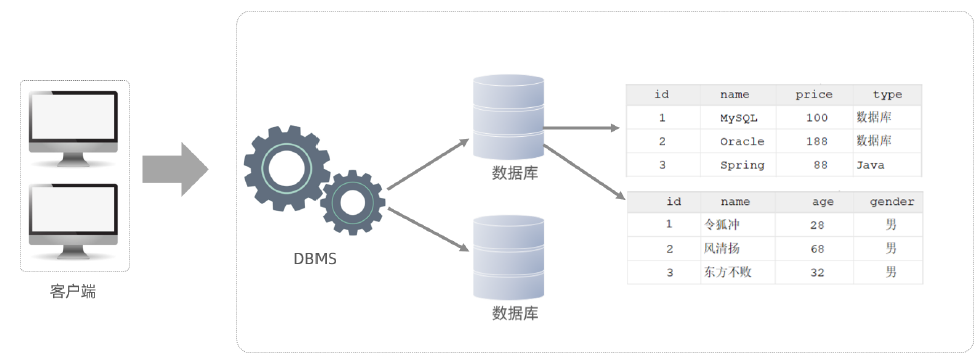
  - 客户端连接DBMS，客户端编写SQL语句并由DBMS解析来操作DB中的表及表中数据。
  - mysql是一个DBMS


## SQL

全称 Structured Query Language，结构化查询语言

### SQL通用语法

- 可以 单行/多行 书写，以分号结尾
- SQL不区分大小写，关键字一般大写

- SQL注释：
  - 单行注释：`-- 注释内容 `  或者 `# 注释内容` 
  - 多行注释： `/* 注释内容 */`


### SQL分类

#### DDL

数据定义语言，用来定义数据库对象（数据库、表、字段）

- **数据库操作**
  - 查询所有数据库：`show databases ;`
  - 查询当前数据库：`select database() ;`
  - 创建数据库：`create database [ if not exists ] 数据库名 [ default charset 字符集 ] [ collate 排序规则 ] ;`
  - 删除数据库：`drop database [ if exists ] 数据库名 ; `
  - 切换数据库（要操作某一个数据库下的表，需要通过该指令，切换到对应的数据库下） ：`use 数据库名`
  - 例子：
    - 创建demo1数据库，使用默认数据集：`create database demo1 ;`
    - 创建demo2数据库并指定字符集：`create database demo2 default charset utf8mb4 ;`
    - 使用demo2数据库：`use demo2;`
  
- **表操作**
  - **查询创建**
    
    - 查询当前数据库所有表：`show tables ;`
    
    - 查询指定表结构（可以查看到指定表的字段，字段的类型、是否为NULL，是否存在默认值等信息）：`desc 表名 ;`
    
    - 查询指定表的建表语句：`show create table 表名;`
    
      - 
        
        ```sql
        create table tb_user(
        	id int comment '编号',
        	name varchar(50) comment '姓名',
        	age int comment '年龄',
        	gender varchar(1) comment '性别'
        ) comment '用户表';
        ```
    
  - **数据类型**
  
    - 在建表语句中，指定字段的数据类型常见分三类：数值类型、字符串类型、日期时间类型
    - 数值类型
      - 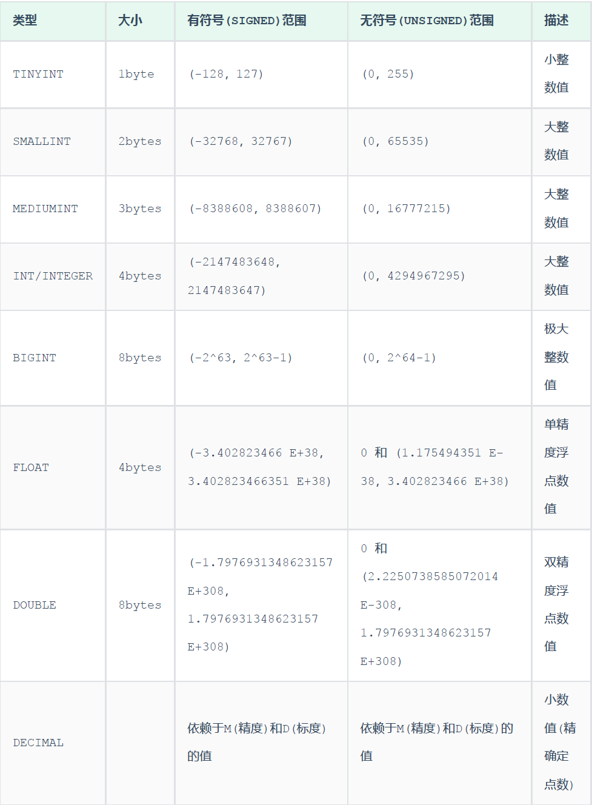
    - 字符串类型
      - 
      - char是定长字符串，指定长度多长，就占用多少个字符，和字段值的长度无关 。而varchar是变长字符串，指定的长度为最大占用长度。相对来说，char的性能会更高些。
    - 日期时间类型
      - 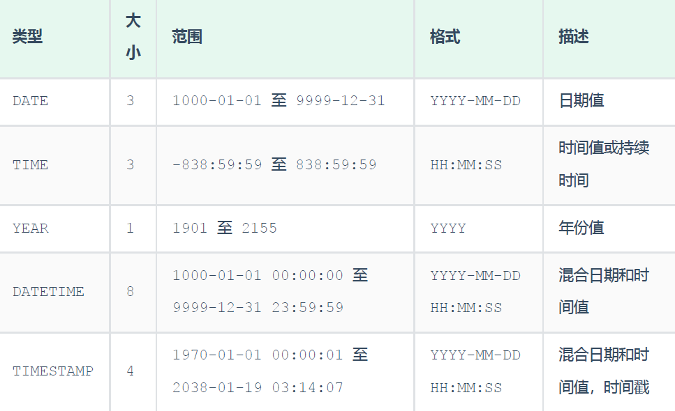
  
  - **修改**
  
    - 添加字段：`ALTER TABLE 表名 ADD 字段名 类型 (长度) [ COMMENT 注释 ] [ 约束 ];`
    - 修改数据类型：`ALTER TABLE 表名 MODIFY 字段名 新的数据类型(长度) ;`
    - 修改字段名和字段类型：`ALTER TABLE 表名 CHANGS 旧字段名 新字段名 类型(长度) [ COMMENT 注释 ] [ 约束 ];`
    - 删除字段：`ALTER TBALE  表名 DROP 字段名 ;`
    - 修改表名：`ALTER TABLE 表名 RENAME TO 新表名 ;`
  
  - **删除**
  
    - 删除表（删除一张不存在的表会报错）：`DROP TABLE [ IF EXISTS ] 表名;`
    - 删除指定表并创建新表：`TRUNCATE TABLE 表名;`
  
  - 案例：
  
    - 设计一张员工信息表
  
      - 
      
        ```sql
        create table emp(
        	id int comment '编号',
        	workno varchar(10) comment '工号',
        	name varchar(10) comment '姓名',
        	gender char(1) comment '性别',
        	age tinyint unsigned comment '年龄',
        	idcard char(18) comment '身份证号',
        	entrydate date comment '入职时间'
        ) comment '员工表';
        ```
      
    - 为emp表增加一个新的字段”昵称”为nickname，类型为varchar(20)：`ALTER TABLE emp ADD nickname varchar(20) COMMENT '昵称' ;`
    
    - 将emp表的nickname字段修改为username，类型为varchar(30)：`ALTER TABLE emp CHANGE nickname username varchar(30) COMMENT '昵称';`
    
    - 将emp表的字段username删除：`ALTER TABLE emp DROP username ;`
    
    - 将emp表的表名修改为 employee：`ALTER TABLE emp RENAME TO employee ;`


#### DML

Data Manipulation Language(数据操作语言)，用来对数据库中表的数据记录进行**增、删、改**操作。

- **添加数据**
  - 给指定字段添加数据（字符串、日期类型数据用引号包含）：`INSERT INTO 表名 (字段名1, 字段名2, ...) VALUES (值1, 值2, ...);`
  - 给全部字段添加数据：`INSERT INTO 表名 VALUES (值1, 值2, ...);`
  - 批量添加数据：
    - `INSERT INTO 表名 (字段名1, 字段名2, ...) VALUES (值1, 值2, ...), (值1, 值2, ...), (值1, 值2, ...) ;`
    - `INSERT INTO 表名 VALUES (值1, 值2, ...), (值1, 值2, ...), (值1, 值2, ...) ;`

- **修改数据**（没有where条件的话修改整张表）：`UPDATE 表名 SET 字段名1 = 值1 , 字段名2 = 值2 , .... [ WHERE 条件 ] ;`

- **删除数据**（没有where条件的话删除整张表所有数据）：`DELETE FROM 表名 [ WHERE 条件 ] ;`

  - 不能删除某个字段的值（一般使用update语句设置字段为NULL）

- 案例

  - 给employee表所有的字段添加数据 ：

    - 
      
      ```
      insert into employee(id,workno,name,gender,age,idcard,entrydate) values(1,'1','Itcast','男',10,'123456789012345678','2000-01-01');
      insert into employee values(2,'2','张无忌','男',18,'123456789012345670','2005-01-01');
      ```

  - 批量插入数据到employee表：`insert into employee values(3,'3','韦一笑','男',38,'123456789012345670','2005-01-01'),(4,'4','赵敏','女',18,'123456789012345670','2005-01-01');`

  - 修改id为1的数据, 将name修改为小昭, gender修改为 女：`update employee set name = '小昭' , gender = '女' where id = 1;`
  
  - 删除gender为女的员工：`delete from employee where gender = '女';`


#### DQL

Data Query Language(数据查询语言)，数据查询语言，用来查询数据库中表的记录

DQL语句语法结构：

```sql
SELECT
	字段列表
FROM
	表名列表
WHERE
	条件列表
GROUP BY
	分组字段列表
HAVING
	分组后条件列表
ORDER BY
	排序字段列表
LIMIT
	分页参数
```


- **基本查询**

  - 查询多个字段（*代表所有字段)
    - `SELECT 字段1, 字段2, 字1 段3 ... FROM 表名 ;`
    - `SELECT * FROM 表名 ;`
  - 字段设置别名
    - `SELECT 字段1 [ AS 别名1 ] , 字段2 [ AS 别名2 ] ... FROM 表名;`
    - `SELECT 字段1 [ 别名1 ] , 字段2 [ 别名2 ] ... FROM 表名;`
  - 去除重复记录：`SELECT DISTINCT 字段列表 FROM 表名;`

- **条件查询**：`SELECT 字段列表 FROM 表1 名 WHERE 条件列表 ;`

  - 常见的比较运算符：
    - 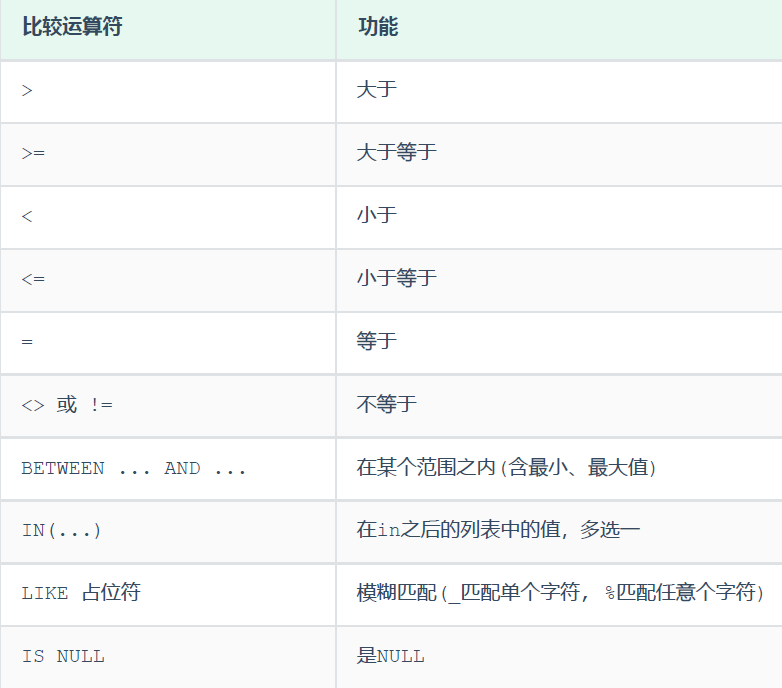
  - 常见的逻辑运算符：
    - 

- **聚合函数**（NULL值不参与任何聚合函数运算）：`SELECT 聚合函数(字段列表) FROM 表名 ;`

  - 常见的聚合函数：

    - | 函数  | 功能     |
      | ----- | -------- |
      | count | 统计数量 |
      | max   | 最大值   |
      | min   | 最小值   |
      | avg   | 平均值   |
      | sum   | 求和     |

- **分组查询**（支持多字段分组）：`SELECT 字段列表 FROM 表名 [ WHERE 条件 ] GROUP BY 分组字段名 [ HAVING 分组后过滤条件 ];`

  - where 和having的区别
    - 执行时机不同：where是分组之前进行过滤，不满足where条件，不参与分组；而having是分组之后对结果进行过滤。
    - 判断条件不同：where不能对聚合函数进行判断，而having可以。

- **排序查询**：`SELECT 字段列表 FROM 表名 ORDER BY 字段1 排1 序方式1 , 字段2 排序方式2 ;`

  - ASC : 升序(默认值)
  - DESC: 降序
  - 如果是多字段排序，当第一个字段值相同时，才会根据第二个字段进行排序 ;

- **分页查询**：`SELECT 字段列表 FROM 表名 LIMIT 起始索引, 查询记录数 ;`

  - 起始索引从`0`开始，`起始索引 = （查询页码 - 1）* 每页显示记录数`。
  - 分页查询是数据库的方言，不同的数据库有不同的实现，`MySQL`中是`LIMIT`。
  - 如果查询的是第一页数据，起始索引可以省略，直接简写为` limit 10`。

- 案例（运行SQL脚本1）

  - 查询公司员工的上班地址有哪些(不要重复)：`select distinct workaddress '工作地址' from emp;`

  - 查询身份证号最后一位是X的员工信息
  
    - `select * from emp where idcard like '%X';`
    - `select * from emp where idcard like '_________________X';`
  
  - 查询年龄等于18 或 20 或 40 的员工信息
  
    - `select * from emp where age = 18 or age = 20 or age =40;`
    - `select * from emp where age in(18,20,40);`
  
  - 查询年龄在15岁(包含) 到 20岁(包含)之间的员工信息
  
    - 
      
      ```sql
      select * from emp where age >= 15 && age <= 20;
      select * from emp where age >= 15 and age <= 20;
      select * from emp where age between 15 and 20;
      ```
  
  - 统计该企业员工数量
  
    - 
      
      ```sql
      select count(*) from emp; -- 统计的是总记录数
      select count(idcard) from emp; -- 统计的是idcard字段不为null的记录数
      select count(1) from emp; # 涉及到SQL 优化
      ```
  
  - 统计西安地区员工的年龄之和：`select sum(age) from emp where workaddress = '西安';`
  
  - 根据性别分组 , 统计男性员工 和 女性员工的平均年龄：`select gender, avg(age) from emp group by gender ;`
  
  - 查询年龄小于45的员工 , 并根据工作地址分组 , 获取员工数量大于等于3的工作地址：`select workaddress, count(*) address_count from emp where age < 45 group by workaddress having address_count >= 3;`
  
  - 统计各个工作地址上班的男性及女性员工的数量：`select workaddress, gender, count(*) '数量' from emp group by gender , workaddress;`
  
    - 
      
      ```
      北京,女,4
      北京,男,4
      上海,男,2
      上海,女,1
      天津,女,1
      江苏,男,2
      西安,女,1
      西安,男,1
      
      ```
  
  - 根据年龄对公司的员工进行升序排序 , 年龄相同 , 再按照入职时间进行降序排序：`select * from emp order by age asc , entrydate desc;`
  
  - 查询第2页员工数据, 每页展示10条记录：`select * from emp limit 10,10;`
  
  - 查询性别为 男 ，并且年龄在 20-40 岁(含)以内的姓名为三个字的员工：`select * from emp where gender = '男' and ( age between 20 and 40 ) and name like '___';`
  
  - 统计员工表中, 年龄小于60岁的 , 男性员工和女性员工的人数：`select gender, count(*) from emp where age < 60 group by gender;`
  
  - 查询所有年龄小于等于35岁员工的姓名和年龄，并对查询结果按年龄升序排序，如果年龄相同按入职时间降序排序：`select name , age from emp where age <= 35 order by age asc , entrydate desc;`
  
  - 查询性别为男，且年龄在20-40 岁(含)以内的前5个员工信息，对查询的结果按年龄升序排序，年龄相同按入职时间升序排序：`select * from emp where gender = '男' and age between 20 and 40 order by age asc ,entrydate asc limit 5 ;`


#### 执行顺序

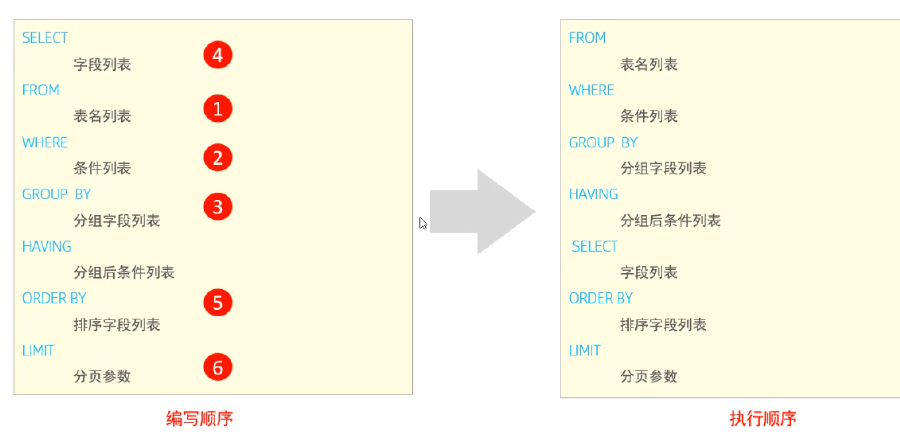


#### DCL

Data Control Language(数据控制语言)，用来管理数据库用户、控制数据库的访问权限。

这部分主要是DBA使用

- **管理用户**
  - 查询用户：`select * from mysql.user;`
    - 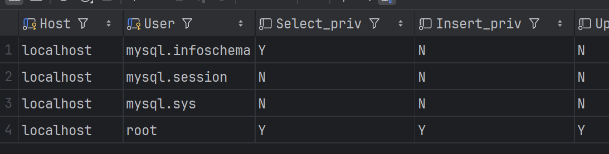
    - Host代表当前用户访问的主机, 如果为localhost, 仅代表只能够在当前本机访问，是不可以远程访问的。 User代表的是访问该数据库的用户名。在MySQL中需要通过Host和User来唯一标识一个用户。
  - 创建用户：`CREATE USER '用户名'@'主机名' IDENTIFIED BY '密码';`
  - 修改用户密码：`ALTER USER '用户名'@'主机名' IDENTIFIED WITH mysql_native_password BY '新密码' ;`
  - 删除用户：`DROP USER '用户名'@'主机名' ;`
- **权限控制**
  - 查询权限：`SHOW GRANTS  FOR '用户名'@'主机名' ;`
  - 授予权限：`GRANT 权限列表 ON 数据库名.表名 TO '用户名'@'主机名';`
  - 撤销权限：`REVOKE 权限列表 ON 数据库名.表名 FROM '用户名'@'主机名';`
- 案例
  - 创建用户user1, 只能够在当前主机localhost访问, 密码123456 ：`create user 'user1'@'localhost' identified by '123456';`
  - 创建用户user2, 可以在任意主机访问该数据库, 密码123456：`create user 'user2'@'%' identified by '123456';`
  - 授予 'user2'@'%' 用户test数据库所有表的所有操作权限：`grant all on test.* to 'user2'@'%';`
  - 撤销 'user2'@'%' 用户的test数据库的所有权限：`revoke all on test.* from 'user1'@'%';`


## 函数

### 字符串函数

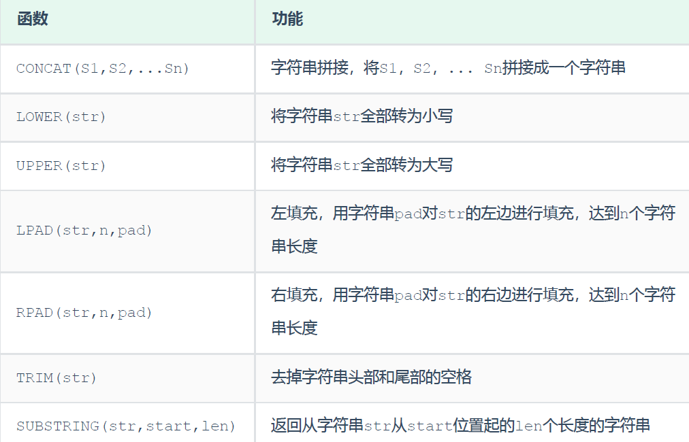

案例：

+ 去除空格：`select trim('  hello   ') ;`
+ 企业员工的工号，统一为5位数，目前不足5位数的全部在前面补0：`update emp set workno=lpad(workno,5,'0') ;`


### 数值函数

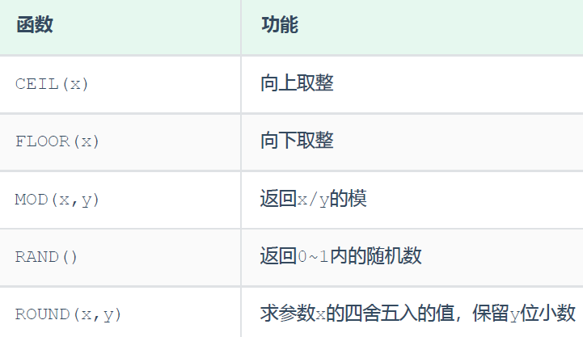

案例：

+ 通过数据库的函数，生成一个六位数的随机验证码：`select lpad(round(rand()*1000000,0),6,'0') ;`


### 日期函数

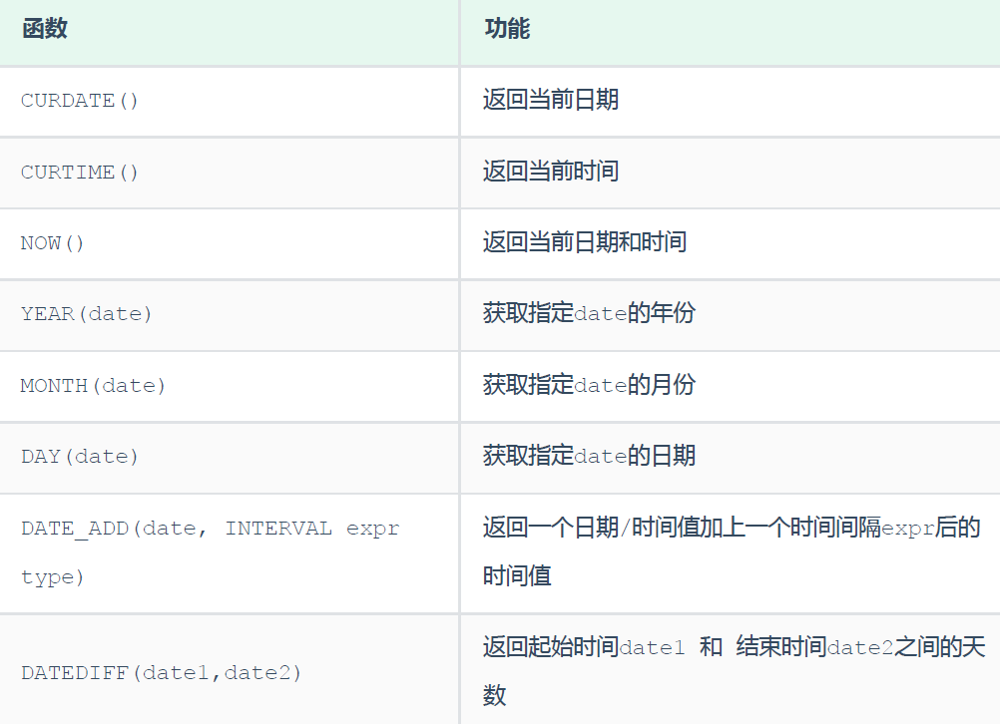

案例：

+ 获取当前日期：`select curdate() ;`
+ 查询所有员工的入职天数，并根据入职天数倒序排序：`select name ,datediff(curdate(),entrydate) as 'entrydays' from emp order by entrydays ;`


### 流程函数

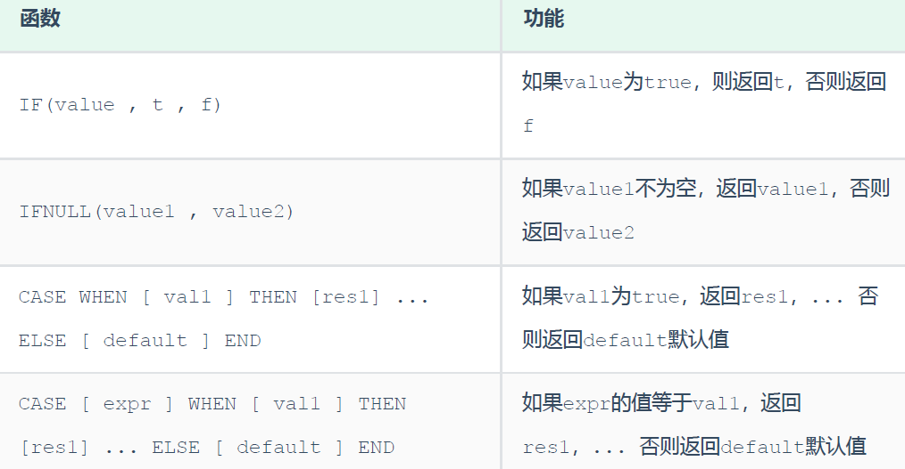

案例：

+ `select if(false,'ok','err') ;`
+ 查询emp表的员工姓名和工作地址 (北京/上海 ----> 一线城市 , 其他 ----> 二线城市)：`select name ,(case workaddress when '北京' then '一线城市' when '上海' then '一线城市' else '二线城市' end) as '工作地址' from emp ;`


## 约束

约束是作用于表中字段上的规则，用于限制存储在表中的数据。

目的：保证数据库中数据的**正确、有效性和完整性**。

约束分类：


可以在 创建表/修改表 的时候添加约束。

案例：

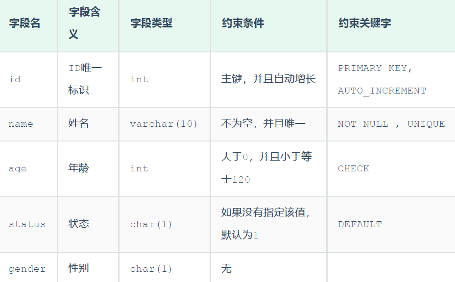

对应的建表语句：

```sql
CREATE TABLE tb_user(
	id int AUTO_INCREMENT PRIMARY KEY COMMENT 'ID唯一标识',
	name varchar(10) NOT NULL UNIQUE COMMENT '姓名' ,
	age int check (age > 0 && age <= 120) COMMENT '年龄' ,
	status char(1) default '1' COMMENT '状态',
	gender char(1) COMMENT '性别'
);
```


### 外键约束

外键：用来让两张表的数据之间建立连接，从而保证数据的**一致性和完整性**

语法：

+ 添加外键

```
CREATE TABLE 表名(
	字段名 数据类型,
	...
	[CONSTRAINT] [外键名称] FOREIGN KEY (外键字段名) REFERENCES 主表 (主表列名)
);
```

```
ALTER TABLE 表名 ADD CONSTRAINT 外键名称 FOREIGN KEY (外键字段名)
REFERENCES 主表 (主表列名) ;
```

+ 删除外键

```
ALTER TABLE 表名 DROP FOREIGN  KEY 外键名称;
```


案例：

+ 为emp表（员工表）的`dept_id`（部门id）字段添加外键约束,关联dept表（部门表）的主键`id`：`alter table emp add constraint fk_emp_dept_id foreign key (dept_id) references dept(id);`
+ 删除emp表的外键fk_emp_dept_id：`alter table emp drop foreign key fk_emp_dept_id;`


#### 删除/更新行为

添加了外键之后，再删除父表数据时产生的约束行为，称为删除/更新行为。具体的删除/更新行为有以下几种:

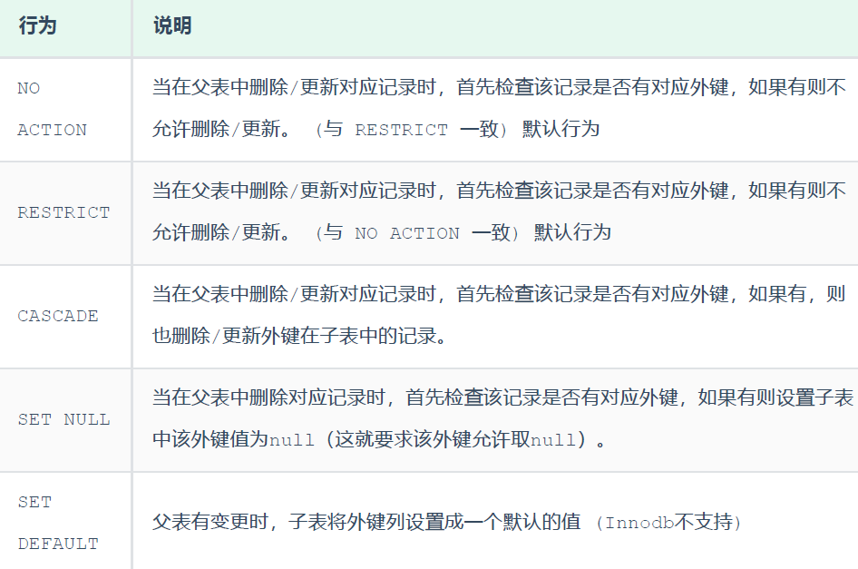

语法：

```
ALTER TABLE 表名 ADD CONSTRAINT 外键名称 FOREIGN KEY (外键字段) REFERENCES 主表名 (主表字段名) ON UPDATE CASCADE ON DELETE CASCADE;
```


## 多表查询

### 多表关系

+ 一对多

一个部门对应多个员工，一个员工对应一个部门

在多的一方建立外键，指向一的一方的主键

+ 多对多

一个学生可以选修多门课程，一门课程也可以供多个学生选择

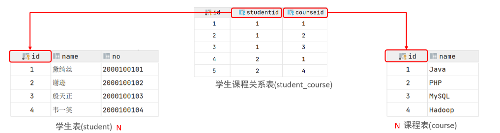

建立第三张中间表，中间表至少包含两个外键，分别关联两方主键

+ 一对一

多用于单表拆分，将一张表的基础字段放在一张表中，其他详情字段放在另一张表中，以提升操作效率。


### 多表查询概述

多表查询就是做了笛卡尔积。我们需要消除无用的部分，只保留笛卡尔集中两张表相互关联的那部分数据（加上连接查询条件）。

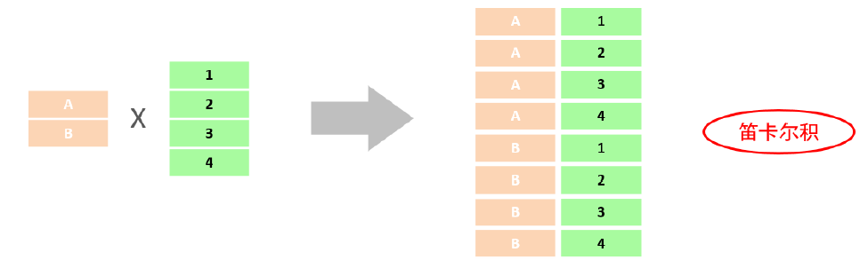

```
select * from emp , dept where emp.dept_id = dept.id;
```


分类：

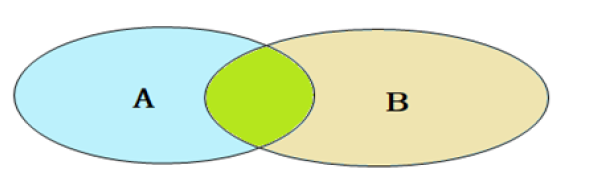

+ **连接查询**
  + **内连接**：相当于查询A、B交集部分数据（绿色部分数据）
  + **外连接**：
    + **左外连接**：查询左表所有数据，以及两张表交集部分数据
    + **右外连接**：查询右表所有数据，以及两张表交集部分数据
  + **自连接**：当前表与自身的连接查询，自连接必须使用表别名

+ **子查询**


运行sql2文件

### 内连接

+ 隐式内连接：`SELECT 字段列表 FROM 表1 , 表2 WHERE 条件 ... ;`
+ 显式内连接：`SELECT 字段列表 FROM 表1 [ INNER ] JOIN 表2 ON 连接条件 ... ;`

案例：

+ 查询每一个员工的姓名 , 及关联的部门的名称 

  + 

    ```sql
    select emp.name , dept.name from emp , dept where emp.dept_id = dept.id ;
    -- 为每一张表起别名,简化SQL编写,tables as 别名 或者 tables 别名
    -- 一旦为表起了别名，就只能够使用别名来指定字段。
    select e.name,d.name from emp e , dept d where e.dept_id = d.id;
    select e.name, d.name from emp e inner join dept d on e.dept_id = d.id;
    select e.name, d.name from emp e join dept d on e.dept_id = d.id;
    ```


### 外连接

+ 左外连接：`SELECT 字段列表 FROM 表1 LEFT [ OUTER ] JOIN 表2 ON 条件 ... ;`

+ 右外连接：`SELECT 字段列表 FROM 表1 RIGHT [ OUTER ] JOIN 表2 ON 条件 ... ;`


案例：

+ 查询emp表的所有数据, 和对应的部门信息：`select e.*, d.name from emp e left outer join dept d on e.dept_id = d.id;`
+ 查询dept表的所有数据, 和对应的员工信息：`select d.*, e.* from emp e right outer join dept d on e.dept_id = d.id;`


### 自连接

+ 自连接查询

```
SELECT 字段列表 FROM 表A 别名A JOIN 表A 别名B ON 条件 ... ;
```

对于自连接查询，可以是内连接查询，也可以是外连接查询。

在自连接查询中，必须要为表起别名

+ 联合查询

就是把多次查询的结果合并起来，形成一个新的查询结果集。

```
SELECT 字段列表 FROM 表A ...
UNION [ ALL ]
SELECT 字段列表 FROM 表B ....;
```

对于联合查询的多张表的**列数必须保持一致，字段类型也需要保持一致。**
`union all `会将全部的数据直接合并在一起，`union `会对合并之后的数据去重。


案例：

+ 查询员工 及其 所属领导的名字：`select a.name , b.name from emp a , emp b where a.managerid = b.id;`
+ 查询所有员工 emp 及其领导的名字 emp , 如果员工没有领导, 也需要查询出来：`select a.name '员工', b.name '领导' from emp a left join emp b on a.managerid = b.id;`
+ 将薪资低于 5000 的员工 , 和 年龄大于 50 岁的员工全部查询出来：`select * from emp where salary < 5000 union select * from emp where age > 50;`


### 子查询

SQL语句中嵌套SELECT语句，称为嵌套查询，又称子查询。

```
SELECT * FROM t1 WHERE column1 = ( SELECT column1 FROM t2 );
```

子查询的外部语句可以是 增删改查 任意一个

分类：

+ 根据子查询结果不同：
  + 标量子查询（子查询结果为单个值）
  + 列子查询(子查询结果为一列)
  + 行子查询(子查询结果为一行)
  + 表子查询(子查询结果为多行多列)
+ 根据子查询位置：
  + WHERE之后
  + FROM之后
  + SELECT之后

#### 标量子查询

常用的操作符：= <> > >= < <=

案例：

+ 根据 "销售部" 部门ID, 查询员工信息：`select * from emp where dept_id = (select id from dept where name = '销售部');`
+ 查询在 "方东白" 入职之后的员工信息：`select * from emp where entrydate > (select entrydate from emp where name = '方东白');`


#### 列子查询

常用的操作符：IN 、NOT IN 、 ANY 、SOME 、 ALL


案例：

+ 查询 "销售部" 和 "市场部" 的所有员工信息：`select * from emp where dept_id in (select id from dept where name = '销售部' or name = '市场部');`
+ 查询比 财务部 所有人工资都高的员工信息：`select * from emp where salary > all ( select salary from emp where dept_id = (select id from dept where name = '财务部') );`
+ 查询比研发部其中任意一人工资高的员工信息：`select * from emp where salary > any ( select salary from emp where dept_id = (select id from dept where name = '研发部') );`


#### 行子查询

常用的操作符：= 、<> 、IN 、NOT IN

案例：

+ 查询与 "张无忌" 的薪资及直属领导相同的员工信息：`select * from emp where (salary,managerid) = (select salary, managerid from emp where name = '张无忌');`


#### 表子查询

常用的操作符：IN

案例：

+ 查询与 "鹿杖客" , "宋远桥" 的职位和薪资相同的员工信息：`select * from emp where (job,salary) in ( select job, salary from emp where name = '鹿杖客' or name = '宋远桥' );`
+ 查询入职日期是 "2006-01-01" 之后的员工信息 , 及其部门信息：`select e.*, d.* from (select * from emp where entrydate > '2006-01-01') e left join dept d on e.dept_id = d.id ;`


### 多表查询案例

三张表：emp员工表、dept部门表、salgrade薪资等级表（SQL脚本3）

+ 查询所有员工的工资等级

```sql
-- 方式一
select e.* , s.grade , s.losal, s.hisal from emp e , salgrade s where e.salary >= s.losal and e.salary <= s.hisal;
-- 方式二
select e.* , s.grade , s.losal, s.hisal from emp e , salgrade s where e.salary between s.losal and s.hisal;
```

+ 查询 "研发部" 所有员工的信息及 工资等级

```sql
select e.* , s.grade from emp e , dept d , salgrade s where e.dept_id = d.id and ( e.salary between s.losal and s.hisal ) and d.name = '研发部';
```

+ 查询 "研发部" 员工的平均工资

```sql
select avg(e.salary) from emp e, dept d where e.dept_id = d.id and d.name = '研发部';
```

+ 查询工资比 "灭绝" 高的员工信息

```sql
select * from emp where salary > ( select salary from emp where name = '灭绝' );
```

+ 查询低于本部门平均工资的员工信息

```sql
select * from emp e2 where e2.salary < ( select avg(e1.salary) from emp e1 where e1.dept_id = e2.dept_id );
```

+ 查询所有的部门信息, 并统计部门的员工人数

```sql
select d.id, d.name , ( select count(*) from emp e where e.dept_id = d.id ) '人数' from dept d;
```


## 事务

事务 是一组操作的集合，它是一个不可分割的工作单位，事务会把所有的操作作为一个整体一起向系统提交或撤销操作请求，即这些操作要么同时成功，要么同时失败。

在业务逻辑执行之前开启事务，执行完毕后提交事务。如果执行过程中报错，则回滚事务，把数据恢复到事务开始之前的状态。

> 默认MySQL的事务是自动提交的，也就是说，当执行完一条DML语句时，MySQL会立即隐式的提交事务。


### 事务操作

+ 控制事务一

查看/ 设置 事务提交方式：

```sql
SELECT @@autocommit ;
SET @@autocommit = 0 ;
```

提交事务：`COMMIT ;`

回滚事务：`ROLLBACK ;`

> 这种方式修改了事务的自动提交行为, 把默认自动提交修改为了手动提交, 此时执行的DML语句都不会提交, 需要手动的执行commit进行提交。


+ 控制事务二

开启事务：`START TRANSACTION 或 BEGIN ;`

提交事务：`CMOMIT ;`

回滚事务：`ROLLBACK ;`


转账案例：

```sql
-- 开启事务
start transaction
-- 1. 查询张三余额
select * from account where name = '张三';
-- 2. 张三的余额减少1000
update account set money = money - 1000 where name = '张三';
-- 3. 李四的余额增加1000
update account set money = money + 1000 where name = '李四';
-- 如果正常执行完毕, 则提交事务
commit;
-- 如果执行过程中报错, 则回滚事务
-- rollback;
```


### 事务四大特性

+ **原子性**（Atomicity）：事务是不可分割的最小操作单元，要么全部成功，要么全部失败。
+ **一致性**（Consistency）：事务完成时，必须使所有的数据都保持一致状态。
+ **隔离性**（Isolation）：数据库系统提供的隔离机制，保证事务在不受外部并发操作影响的独立环境下运行。
+ **持久性**（Durability）：事务一旦提交或回滚，它对数据库中的数据的改变就是永久的。

简称ACID


### 并发事务问题

+ **赃读**：一个事务读到另外一个事务还没有提交的数据。

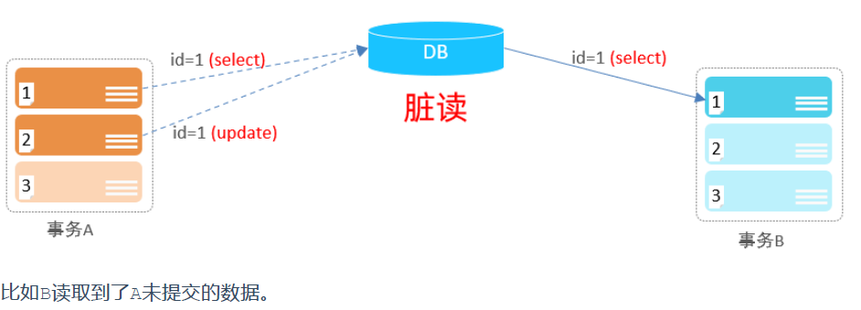

+ **不可重复读**：一个事务先后读取同一条记录，但两次读取的数据不同，称之为不可重复读。

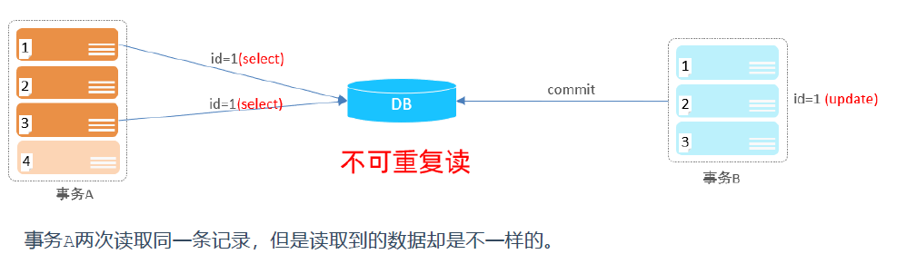

+ **幻读**：一个事务按照条件查询数据时，没有对应的数据行，但是在插入数据时，又发现这行数据已经存在，好像出现了 "幻影"。

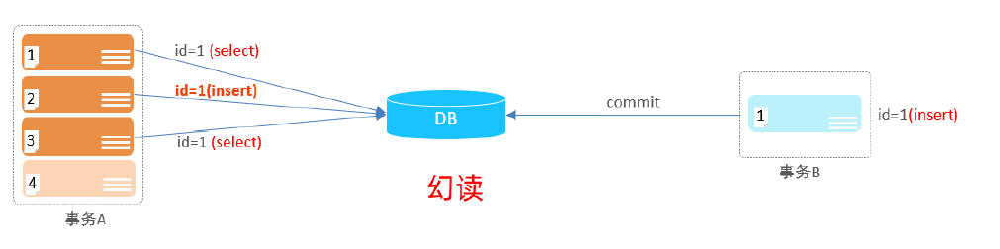


### 事务隔离级别

为了解决并发事务所引发的问题，在数据库中引入了事务隔离级别。

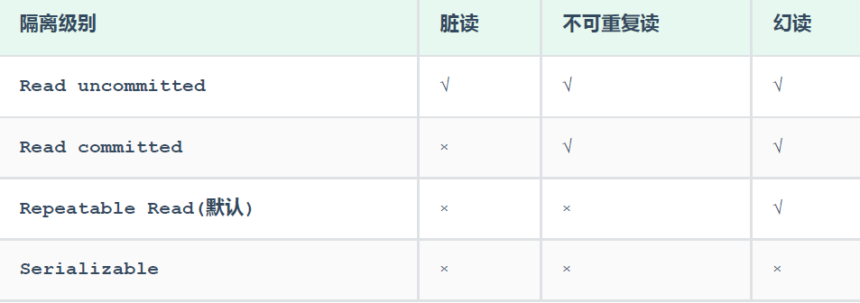

> 事务隔离级别越高，数据越安全，但是性能越低。


+ 查看事务隔离级别：`SELECT @@TRANSACTION_ISOLATION;`
+ 设置事务隔离界别：`SET [ SESSION | GLOBAL ] TRANSACTION ISOLATION LEVEL { READ UNCOMMITTED | READ COMMITTED | REPEATABLE READ | SERIALIZABLE }`


## 附

+ SQL脚本1：

```sql
drop table if exists employee;
create table emp(
	id int comment '编号',
	workno varchar(10) comment '工号',
	name varchar(10) comment '姓名',
	gender char(1) comment '性别',
	age tinyint unsigned comment '年龄',
	idcard char(18) comment '身份证号',
	workaddress varchar(50) comment '工作地址',
	entrydate date comment '入职时间'
)comment '员工表';

INSERT INTO emp (id, workno, name, gender, age, idcard, workaddress, entrydate) VALUES (1, '00001', '柳岩666', '女', 20, '123456789012345678', '北京', '2000-01-01');
INSERT INTO emp (id, workno, name, gender, age, idcard, workaddress, entrydate) VALUES (2, '00002', '张无忌', '男', 18, '123456789012345670', '北京', '2005-09-01');
INSERT INTO emp (id, workno, name, gender, age, idcard, workaddress, entrydate) VALUES (3, '00003', '韦一笑', '男', 38, '123456789712345670', '上海', '2005-08-01');
INSERT INTO emp (id, workno, name, gender, age, idcard, workaddress, entrydate) VALUES (4, '00004', '赵敏', '女', 18, '123456757123845670', '北京', '2009-12-01');
INSERT INTO emp (id, workno, name, gender, age, idcard, workaddress, entrydate) VALUES (5, '00005', '小昭', '女', 16, '123456769012345678', '上海', '2007-07-01');
INSERT INTO emp (id, workno, name, gender, age, idcard, workaddress, entrydate) VALUES (6, '00006', '杨逍', '男', 28, '12345678931234567X', '北京', '2006-01-01');
INSERT INTO emp (id, workno, name, gender, age, idcard, workaddress, entrydate) VALUES (7, '00007', '范瑶', '男', 40, '123456789212345670', '北京', '2005-05-01');
INSERT INTO emp (id, workno, name, gender, age, idcard, workaddress, entrydate) VALUES (8, '00008', '黛绮丝', '女', 38, '123456157123645670', '天津', '2015-05-01');
INSERT INTO emp (id, workno, name, gender, age, idcard, workaddress, entrydate) VALUES (9, '00009', '范凉凉', '女', 45, '123156789012345678', '北京', '2010-04-01');
INSERT INTO emp (id, workno, name, gender, age, idcard, workaddress, entrydate) VALUES (10, '00010', '陈友谅', '男', 53, '123456789012345670', '上海', '2011-01-01');
INSERT INTO emp (id, workno, name, gender, age, idcard, workaddress, entrydate) VALUES (11, '00011', '张士诚', '男', 55, '123567897123465670', '江苏', '2015-05-01');
INSERT INTO emp (id, workno, name, gender, age, idcard, workaddress, entrydate) VALUES (12, '00012', '常遇春', '男', 32, '123446757152345670', '北京', '2004-02-01');
INSERT INTO emp (id, workno, name, gender, age, idcard, workaddress, entrydate) VALUES (13, '00013', '张三丰', '男', 88, '123656789012345678', '江苏', '2020-11-01');
INSERT INTO emp (id, workno, name, gender, age, idcard, workaddress, entrydate) VALUES (14, '00014', '灭绝', '女', 65, '123456719012345670', '西安', '2019-05-01');
INSERT INTO emp (id, workno, name, gender, age, idcard, workaddress, entrydate) VALUES (15, '00015', '胡青牛', '男', 70, '12345674971234567X', '西安', '2018-04-01');
INSERT INTO emp (id, workno, name, gender, age, idcard, workaddress, entrydate) VALUES (16, '00016', '周芷若', '女', 18, null, '北京', '2012-06-01');
```

+ SQL脚本2：

```sql
-- 创建dept表，并插入数据
create table dept(
	id int auto_increment comment 'ID' primary key,
	name varchar(50) not null comment '部门名称'
) comment '部门表';

INSERT INTO dept (id, name) VALUES (1, '研发部'), (2, '市场部'),(3, '财务部'), (4,'销售部'), (5, '总经办'), (6, '人事部');

-- 创建emp表，并插入数据
create table emp(
	id int auto_increment comment 'ID' primary key,
	name varchar(50) not null comment '姓名',
	age int comment '年龄',
	job varchar(20) comment '职位',
	salary int comment '薪资',
	entrydate date comment '入职时间',
	managerid int comment '直属领导ID',
	dept_id int comment '部门ID'
)comment '员工表';

-- 添加外键
alter table emp add constraint fk_emp_dept_id foreign key (dept_id) referencesdept(id);

INSERT INTO emp (id, name, age, job,salary, entrydate, managerid, dept_id) VALUES
	(1, '金庸', 66, '总裁',20000, '2000-01-01', null,5),
	(2, '张无忌', 20, '项目经理',12500, '2005-12-05', 1,1),
	(3, '杨逍', 33, '开发', 8400,'2000-11-03', 2,1),
	(4, '韦一笑', 48, '开发',11000, '2002-02-05', 2,1),
	(5, '常遇春', 43, '开发',10500, '2004-09-07', 3,1),
	(6, '小昭', 19, '程序员鼓励师',6600, '2004-10-12', 2,1),
	(7, '灭绝', 60, '财务总监',8500, '2002-09-12', 1,3),
	(8, '周芷若', 19, '会计',48000, '2006-06-02', 7,3),
	(9, '丁敏君', 23, '出纳',5250, '2009-05-13', 7,3),
	(10, '赵敏', 20, '市场部总监',12500, '2004-10-12', 1,2),
	(11, '鹿杖客', 56, '职员',3750, '2006-10-03', 10,2),
	(12, '鹤笔翁', 19, '职员',3750, '2007-05-09', 10,2),
	(13, '方东白', 19, '职员',5500, '2009-02-12', 10,2),
	(14, '张三丰', 88, '销售总监',14000, '2004-10-12', 1,4),
	(15, '俞莲舟', 38, '销售',4600, '2004-10-12', 14,4),
	(16, '宋远桥', 40, '销售',4600, '2004-10-12', 14,4),
	(17, '陈友谅', 42, null,2000, '2011-10-12', 1,null);
```

+ SQL脚本3：

```sql
create table salgrade(
	grade int,
	losal int,
	hisal int
) comment '薪资等级表';
insert into salgrade values (1,0,3000);
insert into salgrade values (2,3001,5000);
insert into salgrade values (3,5001,8000);
insert into salgrade values (4,8001,10000);
insert into salgrade values (5,10001,15000);
insert into salgrade values (6,15001,20000);
insert into salgrade values (7,20001,25000);
insert into salgrade values (8,25001,30000);
```

