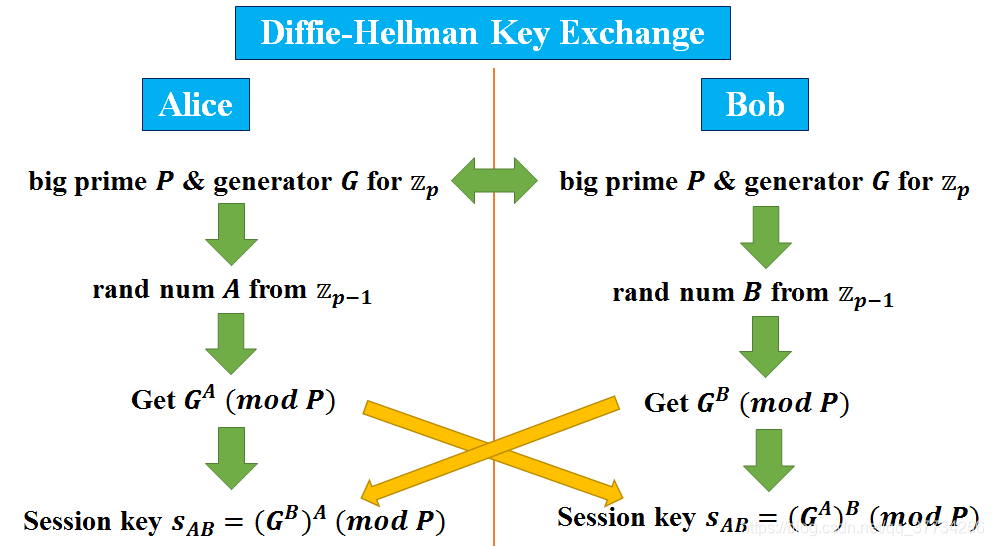
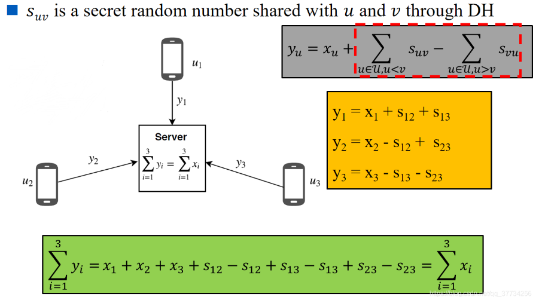
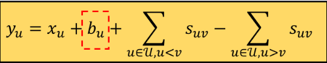

# Practical Secure Aggregation for Privacy-Preserving Machine Learning

> 用于隐私保护机器学习的实用安全聚合方法

## DH秘钥交换

目的是让想要通信的Alice、Bob双方，之间能够拥有一个私密的密钥，这个密钥只有A和B两个人知道。DH密钥交换包含如下步骤：

1. 首先，Alice和Bob商量好DH的参数，一个大数素数$\mathcal{P}$ ，和$\mathbb{z}_p$上的一个生成元$\mathcal{G}$（$1 < \mathcal{G} < \mathcal{P}$，一种比较特殊的素数）
2. Alice和Bob都各自产生一个随机数，A和B是Alice和Bob的私钥
3. Alice和Bob分别计算$\mathcal{G}^A = \mathcal{G}^A \pmod{\mathcal{P}}$和$\mathcal{G}^B = \mathcal{G}^B \pmod{\mathcal{P}}$，$\mathcal{G}^A$和$\mathcal{G}^B$是Alice和Bob的公钥。（由公钥推导出私钥是困难的） 
4. Alice和Bob分别将公钥发送给对方 
5. Alice收到Bob发来的他的公钥$\mathcal{G}^B$，计算出用来和Bob秘密通信的密钥$s_{AB} = (\mathcal{G}^B)^A \pmod{\mathcal{P}}$；同理Bob收到alice发来的他的公钥$\mathcal{G}^A$，计算出用来和Bob秘密通信的密钥$s_{BA} = (\mathcal{G}^A)^B \pmod{\mathcal{P}}$。显然$s_{AB} = s_{BA}$是相等的，他们在公开环境中，可以通过密钥建立私有通信通道，使用该密钥来加密消息。 

## 秘密分享

引理1 **Lemma 1**：一个二维平面上，给出任意$k$个点$(x_1, y_1), \ldots, (x_k, y_k)$的坐标，有且仅有一个$k - 1$次的多项式$q(x)$，对于所有给定的$x_i$，使得$q(x_i)=y_i$。 

## Masking with One-Time Pads

用户$u$和$v$之间通过DH建立秘密通信通道，他们之间知道一个秘密随机数$s_{uv}$。用户1发送给服务器的更新值$y_1$是真实值$x_1 + s_{12} + s_{13}$，这样服务器收到$y_1$时，并不知道$x_1$是多少。服务器对收到的所有值进行聚合以后，它们正负才会抵消，相当于真实值的聚合，等同于FedAVG。 

关于用户掉线问题：

因为上面的方案存在用户掉线后，聚合值失效的问题，所以考虑带恢复的方案。当用户2掉线时，在恢复阶段，它的值$s_{12}$和$s_{23}$用户1和用户3是知道的，服务器询问用户1和用户3，用户1和用户3进行报告。在恢复阶段结束后，服务器完成聚合。 

但是在恢复阶段如果用户1或3也掉线了....下一轮就需要继续对这个掉线进行处理，无穷无尽

## SMPC: Double-Masking

- 针对上面存在的问题，采用双掩码的策略，即使用两个随机数，为用户$u$引入另一个秘密随机数$b_{tu}$。所有的$b_{tu}$和$s_{*}$均使用秘密分享的方式分享给其它用户。恢复阶段，至少有$t$个用户才能恢复一个秘密。
- 在恢复阶段，诚实用户$v$不会把关于某个用户$u$的信息$b_{tu}$和$s_{uv}$同时说出去。对于掉线的用户$u$，他会说出$s_{uv}$的秘密，对于在线的用户$u$，则会说出$b_{tu}$的秘密。 

