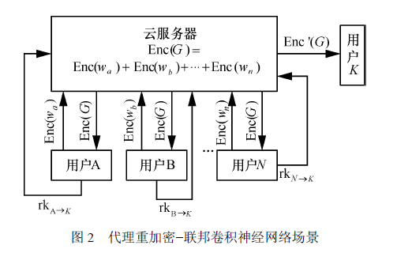

# 基于 NTRU 的多密钥同态代理重加密方案及其应用

## 安全假设

- RLWE ：密文的公钥 - 密文对服从 RLWE 分布，与均匀分布不可区分。
- DSPR ：公钥$h = g \cdot f^{-1} \mod q$的分布与均匀分布不可区分。
- 循环安全假设：重线性化过程中使用公钥加密私钥相关参数，假设此操作不泄露额外信息。

## 方案构造

+ 系统初始化，生成公私钥
	+ 确定RLWE问题的维数$n$、密文模数$q$、明文模数$t$，以及环$R$上的分布$\psi$和误差分布$\chi$。
	+ 随机抽取多项式$f', g \leftarrow \psi$，计算$f = tf' + 1 \pmod{q}$，若$f$在$R_q$中不可逆，则重新抽取$f'$。
	+ 计算$f$的逆元$f^{-1} \in R_q$，并构造公钥参数$h = tgf^{-1} \pmod{q}$。
	+ 随机抽取误差向量$\boldsymbol{e} \leftarrow \chi^d$，计算$\boldsymbol{b} = -\boldsymbol{a}f + \boldsymbol{e} \pmod{q}$。
	+ 构造向量$\boldsymbol{f} = (f, 1) \in R_q^{1 \times 2}$，随机抽取误差向量$\boldsymbol{e}' \leftarrow \chi^{n'}$，计算$\boldsymbol{d} = -\boldsymbol{f}\boldsymbol{A} + \boldsymbol{e}' \pmod{q}$。
	+ 公钥$pk = (h, \boldsymbol{b}, \boldsymbol{d})$和私钥$sk = f$。

+ 用户对训练参数加密，发送给服务器
+ 服务器对用户发来的的加密参数执行同态加法，并将加密结果分发给用户A、B ... N 和 K
+ 用户解密：
  + 参与用户A、B ... N解密：噪声泛洪
  + 第三方用户K解密：代理重加密

### 噪声泛洪

分布式解密由两个算法组成：PartDec 和 FinDec。

在 PartDec 算法中，用户标识为 $i$ 的运算参与方接收到多密钥密文 $\mathbf{ct}$ 的第 $i$ 个分量 $c_i$ 后，使用自己的私钥 $f_i$ 将其解密并添加随机抽取的噪声 $e_i^{\text{flood}} \leftarrow \phi$（噪声分布 $\phi$ 的标准差远大于噪声分布 $\chi$ 的标准差），计算输出得到 $\rho_i$。
$$
\rho_i = f_i c_i + e_i^{\text{flood}}
$$
在 FinDec 算法中，所有用户将自己的部分解密结果广播给其他用户，每个用户接收到所有其他用户的部分解密结果后，将其合并起来以恢复明文。

$$
\rho= \sum \rho_i \pmod{q} 
$$

$$
m= \left\lfloor \frac{t}{q} \rho \right\rfloor \pmod{t} 
$$

### 代理重加密

将多秘钥密文转换成用户k能解密的密文：

1. 用户A...N在本地根据自己私钥与用户K公钥构建重加密秘钥：通过原用户私钥、目标用户公钥及随机矩阵运算生成
2. 用户A...N将重加密秘钥发送给代理服务器。
3. 代理服务器将多秘钥密文转换为用户K可解密的单密钥密文。
4. 用户K用自己私钥解密密文。

