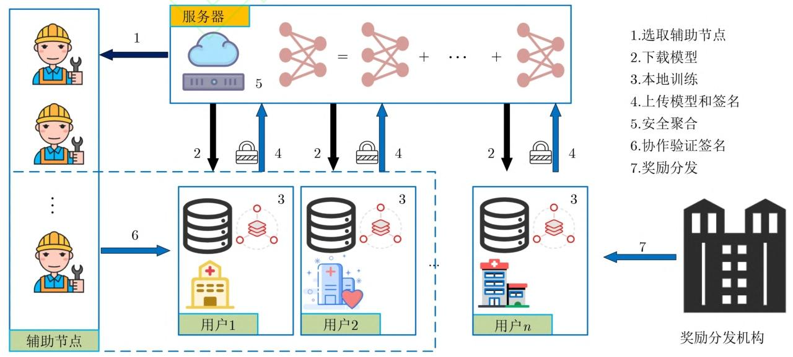
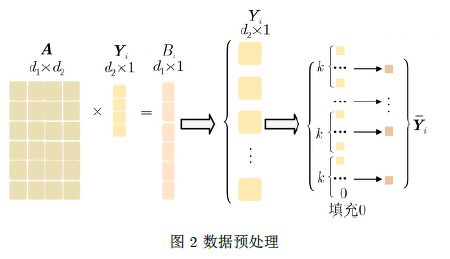
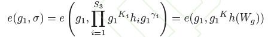

# 基于同态加密的可验证隐私保护联邦学习方案

## 主要工作

通过结合秘密共享算法实现密钥的生成和协作解密，并采用同态加密进一步保护模型，防止用户与服务器的合谋攻击。

基于双线性聚合签名算法使每个用户能够独立验证服务器提供的聚合结果。

为了鼓励更多拥有高质量数据的用户参与进来，该文提出一种激励机制，为用户提供相应的奖励。

## 系统模型

### 用户秘钥 和 分布式密钥生成（DKG）

每个用户生成自己的公私钥。

利用秘密共享思想，所有用户通过 DKG 协议协作生成一对公 / 私钥，解密需至少\(t+1\)个用户协作（t就是秘密共享协议中的阈值参数），避免单一用户或服务器掌握完整密钥，抵御合谋攻击。

### 辅助节点选择

服务器向空闲节点发送协作任务请求，并基于响应节点的性能评估结果，采用动态加权算法选取特定数量的高可信节点作为辅助节点。

### 签名和随机化模型参数

用户将本地权重$W_i$ 随机化处理：
$$
V_i = W_i + \sum_{j \in S_i, j \neq i} (-1)^{i > j} \text{CK}_{i,j} + \varphi B_i \pmod{R}
$$
$\varphi$ 是预先设置好的公共比例因子表示噪声强度，$\text{CK}_{i,j} = H(k_{i,j})$，其中 $H$ 为哈希操作，若 $i > j$ 则 $(-1)^{i > j} = -1$ 否则为 $1$。

因此服务器在聚合$V_i$后，要消除$B_i$，因此要传输$B_i$给服务器

其中$ B_i = A_{d_1 \times d_2} \times Y_i $ ，A为公共矩阵被用户和服务器共享，所以传输的时候只传输$Y_i$（维度为$d_2 * 1$)

将 $Y_i$ 通过CRT处理后得到 $\overline{Y}_i$。在处理过程中，用户 $P_i$ 将 $Y_i$ 除 $k$ 划分为 $\mu$ 个相等的块，若 $Y_i$ 不能被 $k$ 整除将使用0填充。 

使用同态加密算法和公共公钥加密$\overline{Y}_i$

采用双线性聚合签名：

每个用户$P_i$计算密文（$ (c_{i1}, c_{i2}) = (g_2^{r_i}, 2^{\overline{Y}_i} g_2^{\text{msk} \times r_i}) $，$r_i为随机数$）和签名（$ \sigma_i = g_1^{K_i} h_i $，$h_i = h(W_i) $），然后将元组 $(i, \sigma_i, c_{i1}, c_{i2})$ 发送给服务器。

### 服务器聚合阶段

响应用户集合为$S_2$，如果总用户$S_1=S_2$，则直接聚合，否则视为有用户掉线，需要服务器给每个用户广播列表$S_1-S_2$，在线用户$P_i$收到列表后发送$\beta_i$ 和 $\gamma_i$ 并发送给服务器 ：
$$
\begin{align*}
\beta_i = \sum_{b \in S_1 \setminus S_3, b \neq i} (-1)^{t > b} \text{CK}_{i,b}, \gamma_i 
= \sum_{b \in S_1 \setminus S_2, b \neq i} (-1)^{t > b} k_{i,b}
\end{align*}
$$
服务器聚合：
$$
\begin{align*}
\theta &= \sum_{i \in S_2} V_i + \beta_i \\
&= \sum_{i \in S_2} W_i + \sum_{j \in S_1, j \neq i} (-1)^{i > j} \text{CK}_{i,j} + \varphi \sum_{i \in S_2} B_i + \sum_{b \in S_1 \setminus S_2, b \neq i} (-1)^{t > b} \text{CK}_{i,b} \\
&= \sum_{i \in S_2} W_i + \varphi A \sum_{i \in S_2} Y_i
\end{align*}
$$

可得出聚合权重：

$$
\sum_{i \in S_2} W_i = \theta - \varphi A \sum_{i \in S_2} Y_i
$$

服务器选取  $t+1$个在线用户记作 $S_3$，联合解密$(c_1,c_2)$，并计算$(\sigma, \delta_i, \lambda_i 等签名操作的参数)$

服务器计算出 $ W_g = \sum_{i \in S_2} W_i = \theta - \varphi AY_g $

### 客户端验证

### 数据质量激励机制

鼓励数据质量好的用户加入

- 基本奖励 + 额外奖励。
- 额外奖励计算：
  - 数据质量$Q_i$：模型损失与全局平均损失的比值（$q_i^k = \frac{loss\_avg^k}{loss_i^k}$）。
  - 数据丰富度：用户数据与测试集的类型覆盖率（$Richness = \frac{|D_{same}|}{|D_i^l|}$）。
  - 数据相似度：特征分布差异。
  - $Reward_{extra} = \left(\frac{Richness \times Acc + Q_i}{\rho + Similarity_i}\right) \times Reward_{basic}$（$\rho$ 设为 0.5）。

