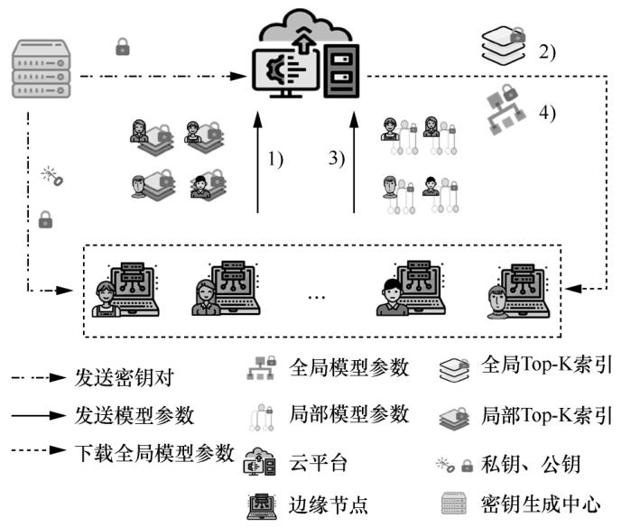
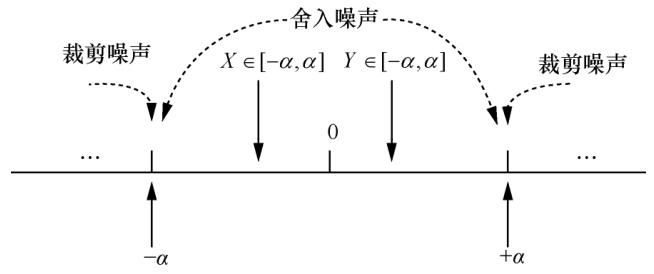

# 基于同态加密的高效安全联邦学习聚合框架

主要是压缩梯度。

## 系统结构

### Top-K

每个边缘节点本地训练后，计算当前模型与上一轮全局模型的梯度差异（即参数变化量），取绝对值最大的前K个梯度及其索引上传。压缩通信量，降低本地加密计算压力。 

设当前模型为 $ G^{\text{cur}} $，上一轮全局模型为 $ G^{\text{glob}} $，梯度差异为 $ g_i = (G_i^{\text{glob}} - G_i^{\text{cur}})^2 $，通过 Top-K函数 选择前K个最大的 $ g_i $ 对应的索引 $ L $。  

只上传索引信息。

### 压缩数据与加速加密

#### 候选索引量化协议（CIQP）

将边缘节点的梯度索引（二进制标记）压缩为大整数，减少加密次数和通信量。  

1. 对于Top-K筛选出的索引集合 $ L $，在对应位置标记为1，其余为0。  
2. 根据边缘节点数量 $ N $，用 $ l = \lceil \log_2 N \rceil $ 位表示每个标记位，其中1位用于标记是否选择（0/1），剩余 $ l-1 $ 位用于扩展防止聚合时溢出。  
3. 将多个标记位拼接成一个大整数，例如每个大整数包含 $ q $ 个梯度的标记，最终生成索引集合 $ I $。  

#### 梯度无符号量化协议（GUQP）

解决多边缘节点场景下梯度符号位溢出问题，确保聚合后反量化的准确性。  

1. 将梯度 $ w_k $ 的符号位与绝对值分离，绝对值部分量化为 $ r $ 位无符号整数。  
2. 将负数区间 $[-α, 0]$ 映射到 $[2^r, 2^{r+1}-1]$，正数区间 $[0, α]$ 映射到 $[0, 2^r-1]$，避免多节点聚合时符号位叠加导致溢出。  
3. 公式： $q_k = \frac{|w_k|}{α} (2^r - 1) + \text{ReLU}(-\text{sgn}(w_k)) \cdot 2^{r+1}$ ，其中，$ \text{ReLU} $ 函数用于提取符号位，$ α $ 为裁剪阈值（通过dACIQ协议计算）。  
4. 根据边缘节点数量 $ N $ 增加扩展位 $ l $，将量化后的梯度拼接成大整数，进一步压缩通信量。

#### dACIQ裁剪阈值计算

利用神经网络梯度服从高斯分布 $ X \sim N(0, σ^2) $ 的特性，通过梯度极值（最大值/最小值）和批量大小估算高斯参数 $ σ $，动态计算裁剪阈值 $ α $，最小化裁剪噪声和舍入噪声。  

- 通过极值期望边界 $ \frac{\text{max}(x)}{\sqrt{\ln n}} \approx \sqrt{2} σ $（$ n $ 为批量大小）估算 $ σ $。  
- 对噪声进行累计计算，通过误差函数 $ \text{erf} $ 计算裁剪噪声 $ δ_c $ 和舍入噪声 $ δ_r $，优化 $ α $ 使总误差 $ \text{Err} = δ_c + δ_r $ 最小。

