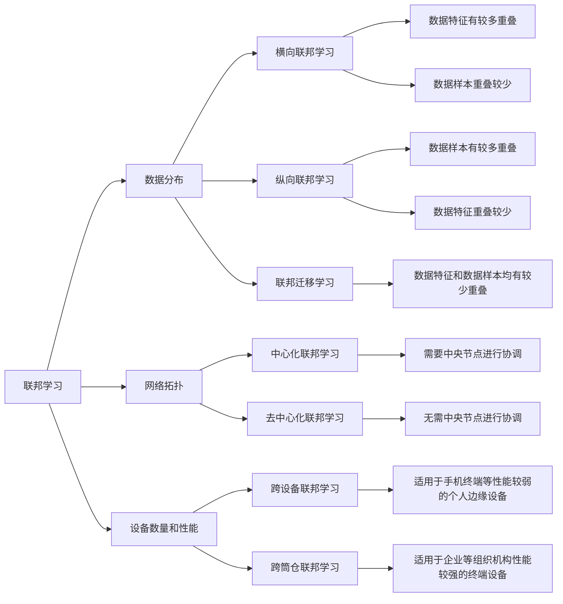
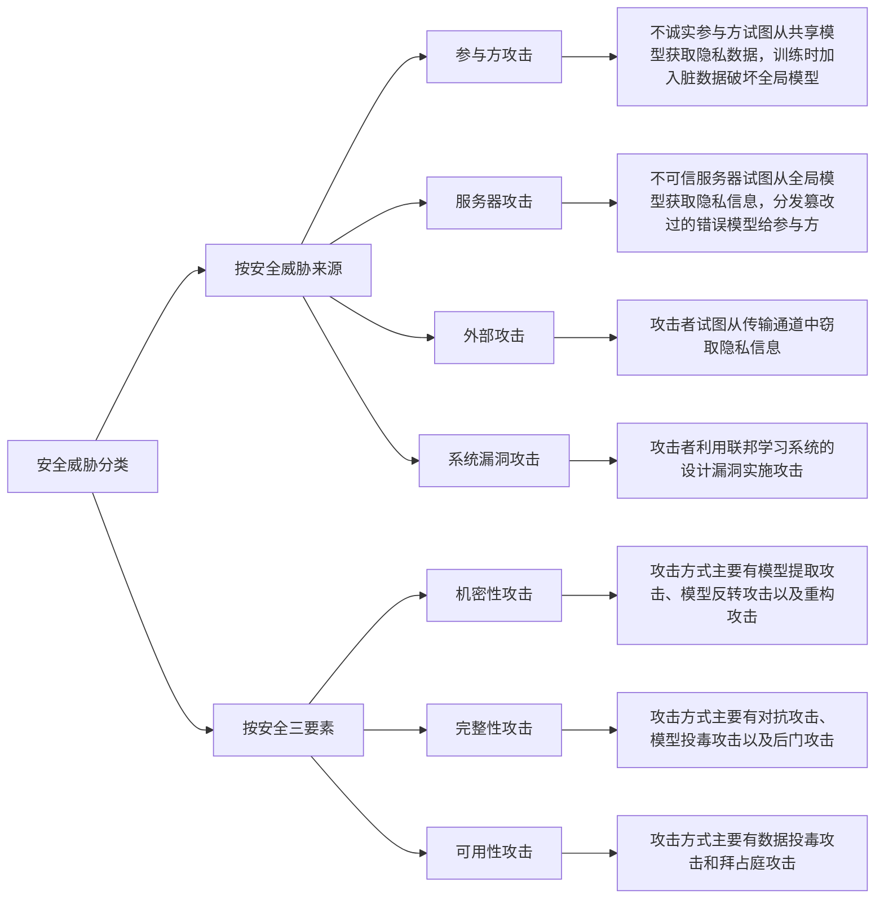
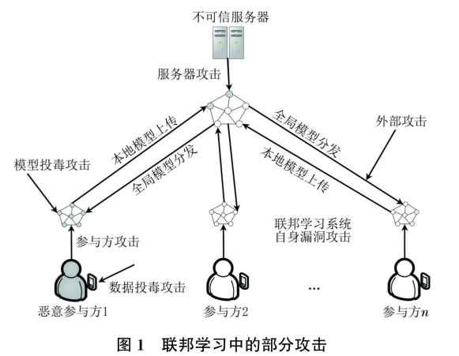
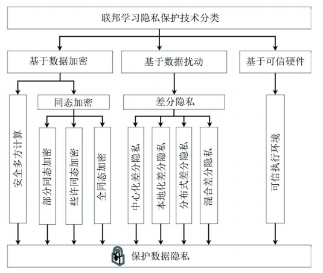
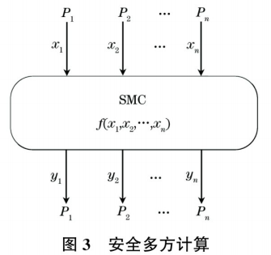
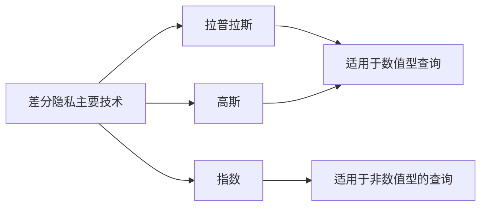

# 《联邦学习及其安全与隐私保护研究综述》

```txt
熊世强,何道敬,王振东,等. 联邦学习及其安全与隐私保护研究综述[J]. 计算机工程,2024,50(5):1-15. DOI:10.19678/j.issn.1000-3428.0067782.
```


## 联邦学习

**联邦学习定义:**

假设有$n$个提供数据参与模型训练的参与方，各参与方用$F_i$表示，各参与方所拥有的数据为$D_i$，其中，$i = \{1,2,\cdots,n\}$ ，使用各参与方的数据进行模型训练，传统的方法是将所有数据收集到一个中心节点，使用整合后的所有数据$D = D_1\cup D_2\cup\cdots\cup D_n$进行模型训练，该方式训练所得的模型记为$M_{sum}$、准确率记为$V_{sum}$ 。

在联邦学习中，各参与方$F_1,F_2,\cdots,F_n$分别使用各自的数据$D_1,D_2,\cdots,D_n$在各客户端本地进行局部模型训练，记聚合后的全局模型为$M_{fed}$、准确率为$V_{fed}$，其间任意参与方$F_i$都无法获知除本身以外的数据$D_i$ 。若存在非负实数$\delta$，满足$\vert V_{sum} - V_{fed}\vert < \delta$，则称模型$M_{fed}$的性能损失为$\delta$，其中，$\delta$​是一个足够小的浮点数，即表示通过 联邦学习方式训练所得的模型准确率应与传统将所有数据放在一起进行模型训练的方式的准确率相差不大。


**联邦学习分类：**



## 联邦学习安全

**安全三要素：**

+ 机密性：利用加密手段对数据信息进行加密处理，避免隐私信息泄露和非授权查看，在联邦学习中需要保证训练模型中的参数和数据等敏感信息不会被攻击者窃取
+ 完整性：指利用网络安全技术保障数据的完好无损，不能被非授权修改，在联邦学习中需要保证模型在训练和预测过程中不受到外界的干扰，能够保障结果的完整和正常输出
+ 可用性：指能够提供正常服务，保证服务不被中断，在联邦学习中需要保证训练出的模型能够被使用方正常使用。


 **联邦学习安全分类：**








## 隐私保护技术

联邦学习中只有模型和参数在参与方和服务器之问进行交换和传递，数据保留在参与方本地，在模型参数的传递过程中要用隐私保护技术来对其进行脱敏保护

### 隐私保护技术分类

主要分为四类，基于数据匿名的隐私保护技术研究较少，联邦学习中常用的隐私保护技术分类如图：



#### 基于数据加密

解决互不信任的参与方之间在保护数据隐私且没有可信的第三方的条件下协同计算的问题

+ 安全多方计算

假设共有 $n$ 位参与方，各参与方记为 $P_i$，各参与方输入的隐秘数据记为 $x_i$，输出记为 $y_i$，其中，$i = \{1, 2, \cdots, n\}$，则各方协同计算的函数表达式可表示为 $y_1, y_2, \cdots, y_n = f(x_1, x_2, \cdots, x_n)$，各参与方 $P_i$ 不能获知除其本身输入 $x_i$ 和输出 $y_i$ 以外的任意值，即只能根据自己的输入 $x_i$ 来得到计算结束后的输出 $y_i$，各方对自己的输入输出值严格保密。



+ 同态加密

一种基于数学计算的方式来进行加密的密码学技术，能够在不用对加密数据解密的情形下就对其直接进行计算，可支持多次加法或乘法运算，经由同态加密的方式处理过的数据能够在解密后与未加密的原始数据做同样的操作保持同样的输出。

**部分同态加密**可支持任意次数的运算，但加法和乘法不能同时使用，只允许使用其中一种

**些许同态加密**仅支持有限次数的运算，但允许加法和乘法同时混合使用

**全同态加密**则能够支持满足任意次数的加法同态和乘法同态之问的混合运算

目前同态加密在联邦学习中的应用以使用加法运算的同态加密最为常见。

具体定义：若将明文数据记为 $m_1$、$m_2$，其对应密文数据记为 $c_1$、$c_2$，$\text{Enc}()$ 记为某种加密函数，$f()$ 记为某种运算，可以为加法同态或乘法同态，则 $c_1 = \text{Enc}(m_1)$、$c_2 = \text{Enc}(m_2)$，同态加密的基本性质可表示为 $\text{Enc}(f(m_1, m_2)) = f(c_1, c_2)$，即对明文数据 $m_1$、$m_2$ 先加密后运算等价于先运算后加密。 


#### 基于数据扰动的隐私保护

差分隐私是一种通过在敏感数据上添加噪声的方式来对计算过程进行干扰从而保护数据隐私的方法。

主要目的是为了能够隐藏模型参数等隐私信息，使敏感数据失真，从而让参与方无法从中反推原始数据，主要思想是若对某数据集中的单个数据使用其他数据替换，该替换对数据集的影响可以忽略不计。由于当恶意方试图从数据集中查询某个单一个体时，无法从查询结果中获取到个体的任何有用信息，因此可认为这个数据集中的单个个体的隐私信息得到了保护

定义：对于给出的 2 个数据集 $D$ 和 $D'$，其中，$D$ 和 $D'$ 两者之间只相差 1 条数据记录，具备这种特性的数据集又称为相邻数据集，数据持有者以某个数据集为输入的随机算法记为 $A$，$A(D)$ 表示使用 $A$ 算法从数据集 $D$ 上进行某个体的查询时处理的输出，$A$ 的所有可能子集记为 $S$，即 $S \subseteq \text{Range}(A)$，$\text{Range}(A)$ 为 $A$ 的取值范围，$\text{Pr}[]$ 为取概率，若存在正实数 $\varepsilon$，使得$\text{Pr}[A(D) \in S] \leq \text{e}^{\varepsilon} \cdot \text{Pr}[A(D') \in S]$，则称算法 $A$ 能够满足 $\varepsilon$-差分隐私，以上不等式说明若在 2 个给定的相邻数据集 $D$ 和 $D'$ 上使用算法 $A$ 得到的输出结果 $A(D)$ 和 $A(D')$ 的概率相差不大，则该算法可达到差分隐私效果。 

差分隐私主要技术：



差分隐私分类：

+ 中心化差分隐私

差分隐私被提出之初在大多情形下是指中心化差分隐私，即将各方的原始数据收集至一个高度可信第三方进行汇总，通过对整体的计算结果来加噪进行干扰以实现差分隐私。

+ 本地化差分隐私

本地化差分隐私无须将数据进行收集，而是将各方原始数据存放在数据源本地，即认为第三方不可信，其数据完全由各数据提供方掌控，直接在本地数据集上实行差分隐私，然后再传输到第三方进行聚合，保护的是用户将脱敏数据上传至第三方的这个过程。

+ 分布式差分隐私

分布式差分隐私中需要用到若干个可信的中问节点，多个参与方先将各自处理过的模糊数据传递至可信的中问节点执行聚合操作后再进一步使用隐私技术，然后将脱敏后的数据传输至服务端，即需要参与方先在各自的本地使用差分隐私完成简单的扰动，接着将结果发送至可信中问节点，借助安全聚合或安全混洗等方式在可信的中间节点上再次使用隐私技术，最后各中问节点再将所得结果发送给服务端。

+ 混合差分隐私

本地化差分隐私与中心化差分隐私可以同时共存，通过参与方对服务器信任关系的不同对参与用户分类，各参与用户根据与服务器的信任关系来决定是直接上传原始数据还是在本地使用本地化差分隐私。


#### 基于可信硬件的隐私保护

可信执行环境(TEE)指的是一种可以信赖的计算环境，是存在于计算平台上的一个与不可信操作系统相互独立的可信隔离环境，运用了包括可信计算和虚拟隔离等在内的组合技术，为需要进行安全保护的隐私数据信息提供一个安全可信的空问，以确保在该环境下的程序和数据的安全和完整，是一种基于硬件环境的安全计算方案，即其安全性由相关硬件机制来保证。常见的可信环境有Intel软件防护扩展(SGX)、Intel管理引擎(ME)以及超微半导体(AMD)内存加密技术等。
