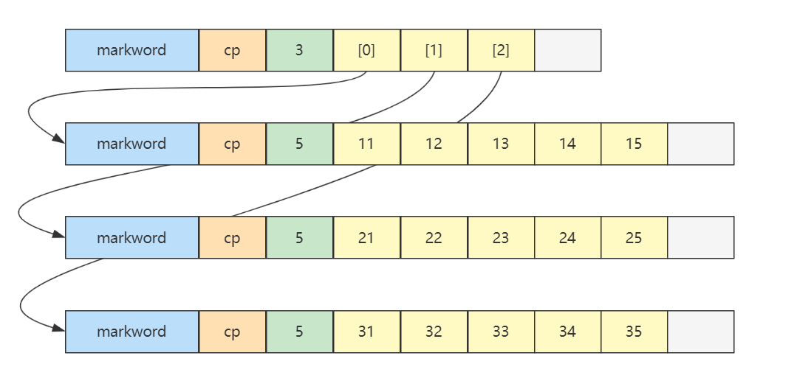

# 数据结构&算法

## 时间复杂度&空间复杂度

### 时间复杂度

用于衡量算法执行所需时间随输入规模增长的变化趋势

**大 $O$ 表示法：**


* $c, c_1, c_2$ 都为一个常数
* $f(n)$ 是实际执行代码行数与 n 的函数


**渐进上界**：从某个常数 $n_0$开始，$c*g(n)$ 总是位于 $f(n)$ 上方，那么记作 $O(g(n))$。代表执行最差的情况

**渐进下界**：从某个常数 $n_0$开始，$c*g(n)$ 总是位于 $f(n)$ 下方，那么记作 $\Omega(g(n))$。

**渐进紧界**：从某个常数 $n_0$开始，$f(n)$ 总是在 $c_1*g(n)$ 和 $c_2*g(n)$ 之间，那么记作 $\Theta(g(n))$


**常见的大 $O$ 表示法时间复杂度 由低到高：**

*  $O(1)$，常量时间，意味着算法时间并不随数据规模而变化
*  $O(log(n))$，对数时间
*  $O(n)$，线性时间，算法时间与数据规模成正比
*  $O(n*log(n))$，拟线性时间
*  $O(n^2)$ 平方时间
*  $O(2^n)$ 指数时间
*  $O(n!)$

 

### 空间复杂度

与时间复杂度类似，一般也使用大 $O$ 表示法来衡量：一个算法执行随数据规模增大，而增长的**额外**空间成本


## 二分查找

### 基础版

```java
public static int binarySearch(int[] a, int target) {
    int i = 0, j = a.length - 1;
    while (i <= j) {
        int m = (i + j) >>> 1;
        if (target < a[m]) {			// 在左边
            j = m - 1;
        } else if (a[m] < target) {		// 在右边
            i = m + 1;
        } else {
            return m;
        }
    }
    return -1;
}
```

$i,j$ 对应着搜索区间 $[0,a.length-1]$（闭合区间），$i<=j$ 意味着搜索区间内还有未比较的元素，$i,j$ 指向的元素也可能是比较的目标


另一种写法：

```java
public static int binarySearch(int[] a, int target) {
    int i = 0, j = a.length;
    while (i < j) {
        int m = (i + j) >>> 1;
        if (target < a[m]) {			// 在左边
            j = m;
        } else if (a[m] < target) {		// 在右边
            i = m + 1;
        } else {
            return m;
        }
    }
    return -1;
}
```

$i,j$ 对应着搜索区间 $[0,a.length)$（左闭右开的区间），$i<j$ 意味着搜索区间内还有未比较的元素，$j$ 指向的一定不是查找目标。

$j$ 不是查找目标，如果 $i==j$ 会导致死循环


### 平衡版

```java
public static int binarySearchBalance(int[] a, int target) {
    int i = 0, j = a.length;
    while (1 < j - i) {
        int m = (i + j) >>> 1;
        if (target < a[m]) {
            j = m;
        } else {
            i = m;
        }
    }
    return (a[i] == target) ? i : -1;
}
```

$i$ 可能是目标，$j$ 不是目标。

改变 $i$ 边界时，它指向的可能是目标，因此不能 $m+1$。

时间复杂度： $\Theta(log(n))$


### Java版

```java
private static int binarySearch(long[] a, int fromIndex, int toIndex, long key) {
    int low = fromIndex;
    int high = toIndex - 1;

    while (low <= high) {
        int mid = (low + high) >>> 1;
        long midVal = a[mid];

        if (midVal < key)
            low = mid + 1;
        else if (midVal > key)
            high = mid - 1;
        else
            return mid; // key found
    }
    return -(low + 1);  // key not found.
}
```


### 返回最左最右侧元素

**返回最左侧元素：**

```java
public static int binarySearchLeftmost1(int[] a, int target) {
    int i = 0, j = a.length - 1;
    int candidate = -1;
    while (i <= j) {
        int m = (i + j) >>> 1;
        if (target < a[m]) {
            j = m - 1;
        } else if (a[m] < target) {
            i = m + 1;
        } else {
            candidate = m; // 记录候选位置
            j = m - 1;     // 继续向左
        }
    }
    return candidate;
}
```

或者这样写：

```java
public static int binarySearchLeftmost(int[] a, int target) {
    int i = 0, j = a.length - 1;
    while (i <= j) {
        int m = (i + j) >>> 1;
        if (target <= a[m]) {
            j = m - 1;
        } else {
            i = m + 1;
        }
    }
    return i; 
}
```

* leftmost 返回值的另一层含义：$\lt target$ 的元素个数
* 小于等于中间值，都要向左找


**返回最右侧元素：**

```java
public static int binarySearchRightmost1(int[] a, int target) {
    int i = 0, j = a.length - 1;
    int candidate = -1;
    while (i <= j) {
        int m = (i + j) >>> 1;
        if (target < a[m]) {
            j = m - 1;
        } else if (a[m] < target) {
            i = m + 1;
        } else {
            candidate = m; // 记录候选位置
            i = m + 1;	   // 继续向右
        }
    }
    return candidate;
}
```

或者：

```java
public static int binarySearchRightmost(int[] a, int target) {
    int i = 0, j = a.length - 1;
    while (i <= j) {
        int m = (i + j) >>> 1;
        if (target < a[m]) {
            j = m - 1;
        } else {
            i = m + 1;
        }
    }
    return i - 1;
}
```

+ 大于等于中间值，都要向右找


### leetcode

#### [704](https://leetcode.cn/problems/binary-search/)


#### 35

#### 34


## 数组

### 数组空间占用&元素地址

根据数组起始地址计算索引元素 $i$ 的地址：

> 一维数组：
> ```java
> byte[] array = {1,2,3,4,5}
> ```
>
> 已知 array 的**数据**的起始地址是 0x7138f94c8，那么元素 3 的地址是什么？
>
> 0x7138f94c8 + 2 * 1 = 0x7138f94ca


Java 中数组结构空间占用：

* 8 字节 markword
* 4 字节 class 指针（压缩 class 指针的情况）
* 4 字节 数组大小（决定了数组最大容量是 $2^{32}$）
* 数组元素 + 对齐字节（java 中所有对象大小都是 8 字节的整数倍，不足的要用对齐字节补足）

> 例如
>
> ```java
> int[] array = {1, 2, 3, 4, 5};
> ```
>
> 大小为 40 个字节，组成如下
>
> ```
> 8 + 4 + 4 + 5*4 + 4(alignment)
> ```
>


对于二维数组的内存结构：

```java
int[][] array = {
    {11, 12, 13, 14, 15},
    {21, 22, 23, 24, 25},
    {31, 32, 33, 34, 35},
};
```




在内存布局上是连续的。

> Java 环境下（不考虑类指针和引用压缩，此为默认情况），有下面的二维数组：
>
> ```java
> byte[][] array = {
>     {11, 12, 13, 14, 15},
>     {21, 22, 23, 24, 25},
>     {31, 32, 33, 34, 35},
> };
> ```
>
> array **对象**起始地址是 0x1000，那么 23 这个元素的地址是什么？
>
> * 起始地址 0x1000
> * 外层数组大小：16字节对象头 + 3元素 * 每个引用4字节 + 4 对齐字节 = 32 = 0x20
> * 第一个内层数组大小：16字节对象头 + 5元素 * 每个byte1字节 + 3 对齐字节 = 24 = 0x18
> * 第二个内层数组，16字节对象头 = 0x10，待查找元素索引为 2
> * 最后结果 = 0x1000 + 0x20 + 0x18 + 0x10 + 2*1 = 0x104a


### 动态数组

```java
// 假设输入的index合法：

public class DynamicArray implements Iterable<Integer> {
    private int size = 0; // 逻辑大小
    private int capacity = 8; // 容量
    private int[] array = {};


    /**
     * 向最后位置 [size] 添加元素
     *
     * @param element 待添加元素
     */
    public void addLast(int element) {
        add(size, element);
    }

    /**
     * 向 [0 .. size] 位置添加元素
     *
     * @param index   索引位置
     * @param element 待添加元素
     */
    public void add(int index, int element) {
        checkAndGrow();

        // 添加逻辑
        if (index >= 0 && index < size) {
            // 向后挪动, 空出待插入位置
            System.arraycopy(array, index,
                    array, index + 1, size - index);
        }
        array[index] = element;
        size++;
    }

    private void checkAndGrow() {
        // 容量检查
        if (size == 0) {
            array = new int[capacity];
        } else if (size == capacity) {
            // 进行扩容, 1.5 1.618 2
            capacity += capacity >> 1;
            int[] newArray = new int[capacity];
            System.arraycopy(array, 0,
                    newArray, 0, size);
            array = newArray;
        }
    }

    /**
     * 从 [0 .. size) 范围删除元素
     *
     * @param index 索引位置
     * @return 被删除元素
     */
    public int remove(int index) { // [0..size)
        int removed = array[index];
        if (index < size - 1) {
            // 向前挪动
            System.arraycopy(array, index + 1,
                    array, index, size - index - 1);
        }
        size--;
        return removed;
    }


    /**
     * 查询元素
     *
     * @param index 索引位置, 在 [0..size) 区间内
     * @return 该索引位置的元素
     */
    public int get(int index) {
        return array[index];
    }

    /**
     * 遍历方法1
     *
     * @param consumer 遍历要执行的操作, 入参: 每个元素
     */
    public void foreach(Consumer<Integer> consumer) {
        for (int i = 0; i < size; i++) {
            // 提供 array[i]
            // 返回 void
            consumer.accept(array[i]);
        }
    }

    /**
     * 遍历方法2 - 迭代器遍历
     */
    @Override
    public Iterator<Integer> iterator() {
        return new Iterator<Integer>() {
            int i = 0;

            @Override
            public boolean hasNext() { // 有没有下一个元素
                return i < size;
            }

            @Override
            public Integer next() { // 返回当前元素,并移动到下一个元素
                return array[i++];
            }
        };
    }

    /**
     * 遍历方法3 - stream 遍历
     *
     * @return stream 流
     */
    public IntStream stream() {
        return IntStream.of(Arrays.copyOfRange(array, 0, size));
    }
}
```


### 空间局部性

* cpu 读取内存（速度慢）数据后，会将其放入高速缓存（速度快）当中，如果后来的计算再用到此数据，在缓存中能读到的话，就不必读内存了
* 缓存的最小存储单位是缓存行（cache line），一般是 64 bytes，一次读的数据少了不划算啊，因此最少读 64 bytes 填满一个缓存行，因此读入某个数据时也会读取其**临近的数据**，这就是所谓**空间局部性**

+ 因此遍历数组应先遍历行，再遍历列


### 时间复杂度

**随机访问**时间复杂度是 ：$O(1)$

**插入或删除**时间复杂度：

+ 头部位置， $O(n)$

+ 中间位置， $O(n)$

+ 尾部位置， $O(1)$


### leetcode

#### 88

```java
```


## 链表

### 时间复杂度

**随机访问**： $O(n)$

**插入或删除**：

* 起始位置：$O(1)$
* 结束位置：如果已知 tail 尾节点是 $O(1)$，不知道 tail 尾节点是 $O(n)$
* 中间位置：根据 index 查找时间 + $O(1)$


### 单向链表

```java
public class SinglyLinkedList implements Iterable<Integer>{
    
    private Node head; // 头部节点
    
    private static class Node { // 节点类
        int value;
        Node next;

        public Node(int value, Node next) {
            this.value = value;
            this.next = next;
        }
    }
    
    // 头部添加
    public void addFirst(int value) {
		this.head = new Node(value, this.head);
    }
    
    // while遍历
    public void loop() {
        Node curr = this.head;
        while (curr != null) {
            curr = curr.next;
        }
    }
    
    // for遍历
    public void loop() {
        for (Node curr = this.head; curr != null; curr = curr.next) {
        }
    }
    
    // 迭代器遍历
	private class NodeIterator implements Iterator<Integer> {
        Node curr = head;
        
        public boolean hasNext() {
            return curr != null;
        }

        public Integer next() {
            int value = curr.value;
            curr = curr.next;
            return value;
        }
    }
    
    // 返回迭代器
    public Iterator<Integer> iterator() {
        return new NodeIterator();
    }
    
    // 查找最后一个元素
    private Node findLast() {
        if (this.head == null) {
            return null;
        }
        Node curr;
        for (curr = this.head; curr.next != null; ) {
            curr = curr.next;
        }
        return curr;
    }
    
    // 尾部添加元素
    public void addLast(int value) {
        Node last = findLast();
        if (last == null) {
            addFirst(value);
            return;
        }
        last.next = new Node(value, null);
    }
    
    // 尾部添加多个
	public void addLast(int first, int... rest) {
        
        Node sublist = new Node(first, null);
        Node curr = sublist;
        for (int value : rest) {
            curr.next = new Node(value, null);
            curr = curr.next;
        }
        
        Node last = findLast();
        if (last == null) {
            this.head = sublist;
            return;
        }
        last.next = sublist;
    }
    
    // 根据索引获取
	private Node findNode(int index) {
        int i = 0;
        for (Node curr = this.head; curr != null; curr = curr.next, i++) {
            if (index == i) {
                return curr;
            }
        }
        return null;
    }
    
    
    public int get(int index) {
        Node node = findNode(index);
        if (node != null) {
            return node.value;
        }
    }
    
    // 插入
	public void insert(int index, int value) {
        if (index == 0) {
            addFirst(value);
            return;
        }
        Node prev = findNode(index - 1); // 找到上一个节点
        prev.next = new Node(value, prev.next);
    }
    
    // 删除
	public void remove(int index) {
        if (index == 0) {
            if (this.head != null) {
                this.head = this.head.next;
                return;
            }
        }
        Node prev = findNode(index - 1);
        Node curr;
        if (prev != null && (curr = prev.next) != null) {
            prev.next = curr.next;
        }
    }
    
}
```


#### 带哨兵

前单向链表的实现，每个方法内几乎都有判断 head 的代码，可以使用哨兵节点简化：

用一个不参与数据存储的特殊 Node 作为哨兵，它一般被称为哨兵或哑元，拥有哨兵节点的链表称为带头链表

```java
public class SinglyLinkedListSentinel {
    // ...
    private Node head = new Node(Integer.MIN_VALUE, null);
}
```

简化后的部分代码：

```java
public class SinglyLinkedListSentinel {
    // ...
    
    public void addLast(int value) {
        Node last = findLast();
        /*
        改动前
        if (last == null) {
            this.head = new Node(value, null);
            return;
        }
        */
        last.next = new Node(value, null);
    }
    
    public void insert(int index, int value) {
        /*
        改动前
        if (index == 0) {
            this.head = new Node(value, this.head);
            return;
        }
        */
        // index 传入 0 时，返回的是哨兵
        Node prev = findNode(index - 1);
        if (prev != null) {
            prev.next = new Node(value, prev.next);
        } else {
            throw illegalIndex(index);
        }
    }
    
    public void remove(int index) {
        /*
        改动前
        if (index == 0) {
            if (this.head != null) {
                this.head = this.head.next;
                return;
            }
        }
        */
        // index 传入 0 时，返回的是哨兵
        Node prev = findNode(index - 1);
        Node curr;
        if (prev != null && (curr = prev.next) != null) {
            prev.next = curr.next;
        }
    }
    
    public void addFirst(int value) {
        /*
        改动前
        this.head = new Node(value, this.head);
        */
		this.head.next = new Node(value, this.head.next);
        // 也可以视为 insert 的特例, 即 insert(0, value);
    }
}
```


### 双向链表

带哨兵

```java
public class DoublyLinkedListSentinel implements Iterable<Integer> {

    private final Node head;
    private final Node tail;

    public DoublyLinkedListSentinel() {
        head = new Node(null, 666, null);
        tail = new Node(null, 888, null);
        head.next = tail;
        tail.prev = head;
    }

    private Node findNode(int index) {
        int i = -1;
        for (Node p = head; p != tail; p = p.next, i++) {
            if (i == index) {
                return p;
            }
        }
        return null;
    }

    public void addFirst(int value) {
        insert(0, value);
    }

    public void removeFirst() {
        remove(0);
    }

    public void addLast(int value) {
        Node prev = tail.prev;
        Node added = new Node(prev, value, tail);
        prev.next = added;
        tail.prev = added;
    }

    public void removeLast() {
        Node removed = tail.prev;

        Node prev = removed.prev;
        prev.next = tail;
        tail.prev = prev;
    }

    public void insert(int index, int value) {
        Node prev = findNode(index - 1);

        Node next = prev.next;
        Node inserted = new Node(prev, value, next);
        prev.next = inserted;
        next.prev = inserted;
    }

    public void remove(int index) {
        Node prev = findNode(index - 1);

        Node removed = prev.next;
        Node next = removed.next;
        prev.next = next;
        next.prev = prev;
    }


    @Override
    public Iterator<Integer> iterator() {
        return new Iterator<Integer>() {
            Node p = head.next;

            @Override
            public boolean hasNext() {
                return p != tail;
            }

            @Override
            public Integer next() {
                int value = p.value;
                p = p.next;
                return value;
            }
        };
    }

    static class Node {
        Node prev;
        int value;
        Node next;

        public Node(Node prev, int value, Node next) {
            this.prev = prev;
            this.value = value;
            this.next = next;
        }
    }
}
```


### 环形链表

这时哨兵既作为头，也作为尾


```java
public class DoublyLinkedListSentinel implements Iterable<Integer> {

    @Override
    public Iterator<Integer> iterator() {
        return new Iterator<>() {
            Node p = sentinel.next;

            @Override
            public boolean hasNext() {
                return p != sentinel;
            }

            @Override
            public Integer next() {
                int value = p.value;
                p = p.next;
                return value;
            }
        };
    }

    static class Node {
        Node prev;
        int value;
        Node next;

        public Node(Node prev, int value, Node next) {
            this.prev = prev;
            this.value = value;
            this.next = next;
        }
    }

    private final Node sentinel = new Node(null, -1, null); // 哨兵

    public DoublyLinkedListSentinel() {
        sentinel.next = sentinel;
        sentinel.prev = sentinel;
    }

    /**
     * 添加到第一个
     * @param value 待添加值
     */
    public void addFirst(int value) {
        Node next = sentinel.next;
        Node prev = sentinel;
        Node added = new Node(prev, value, next);
        prev.next = added;
        next.prev = added;
    }

    /**
     * 添加到最后一个
     * @param value 待添加值
     */
    public void addLast(int value) {
        Node prev = sentinel.prev;
        Node next = sentinel;
        Node added = new Node(prev, value, next);
        prev.next = added;
        next.prev = added;
    }
    
    /**
     * 删除第一个
     */
    public void removeFirst() {
        Node removed = sentinel.next;
        if (removed == sentinel) {
            throw new IllegalArgumentException("非法");
        }
        Node a = sentinel;
        Node b = removed.next;
        a.next = b;
        b.prev = a;
    }

    /**
     * 删除最后一个
     */
    public void removeLast() {
        Node removed = sentinel.prev;
        if (removed == sentinel) {
            throw new IllegalArgumentException("非法");
        }
        Node a = removed.prev;
        Node b = sentinel;
        a.next = b;
        b.prev = a;
    }

    /**
     * 根据值删除节点
     * <p>假定 value 在链表中作为 key, 有唯一性</p>
     * @param value 待删除值
     */
    public void removeByValue(int value) {
        Node removed = findNodeByValue(value);
        if (removed != null) {
            Node prev = removed.prev;
            Node next = removed.next;
            prev.next = next;
            next.prev = prev;
        }
    }

    private Node findNodeByValue(int value) {
        Node p = sentinel.next;
        while (p != sentinel) {
            if (p.value == value) {
                return p;
            }
            p = p.next;
        }
        return null;
    }

}
```


### leetcode

#### 206


#### 203


#### 19

#### 83

#### 82

#### 21

#### 23

#### 876

#### 234

#### 141

#### 142

#### 237

#### 160


## 递归


## 队列

尾进头出

### 环形链表实现


```java
public class LinkedListQueue<E> implements Queue<E>, Iterable<E> {

    private static class Node<E> {
        E value;
        Node<E> next;

        public Node(E value, Node<E> next) {
            this.value = value;
            this.next = next;
        }
    }

    private Node<E> head = new Node<>(null, null);
    private Node<E> tail = head;
    private int size = 0;
    private int capacity = Integer.MAX_VALUE;

    {
        tail.next = head;
    }

    public LinkedListQueue() {
    }

    public LinkedListQueue(int capacity) {
        this.capacity = capacity;
    }

    @Override
    public boolean offer(E value) {
        if (isFull()) {
            return false;
        }
        Node<E> added = new Node<>(value, head);
        tail.next = added;
        tail = added;
        size++;
        return true;
    }

    @Override
    public E poll() {
        if (isEmpty()) {
            return null;
        }
        Node<E> first = head.next;
        head.next = first.next;
        if (first == tail) {
            tail = head;
        }
        size--;
        return first.value;
    }

    @Override
    public E peek() {
        if (isEmpty()) {
            return null;
        }
        return head.next.value;
    }

    @Override
    public boolean isEmpty() {
        return head == tail;
    }

    @Override
    public boolean isFull() {
        return size == capacity;
    }

    @Override
    public Iterator<E> iterator() {
        return new Iterator<E>() {
            Node<E> p = head.next;
            @Override
            public boolean hasNext() {
                return p != head;
            }
            @Override
            public E next() {
                E value = p.value;
                p = p.next;
                return value;
            }
        };
    }
}
```


### 环形数组实现


下标计算：

> 数组长度是 5，当前位置是 3 ，向前走 2 步，此时下标为 $(3 + 2)\%5 = 0$


判断空：

判断满：

**实现1：**

```java
public class ArrayQueue<E> implements Queue<E>, Iterable<E>{

    private int head = 0;
    private int tail = 0;
    private final E[] array;
    private final int length;

    @SuppressWarnings("all")
    public ArrayQueue(int capacity) {
        length = capacity + 1;
        array = (E[]) new Object[length];
    }

    @Override
    public boolean offer(E value) {
        if (isFull()) {
            return false;
        }
        array[tail] = value;
        tail = (tail + 1) % length;
        return true;
    }

    @Override
    public E poll() {
        if (isEmpty()) {
            return null;
        }
        E value = array[head];
        head = (head + 1) % length;
        return value;
    }

    @Override
    public E peek() {
        if (isEmpty()) {
            return null;
        }
        return array[head];
    }

    @Override
    public boolean isEmpty() {
        return tail == head;
    }

    @Override
    public boolean isFull() {
        return (tail + 1) % length == head;
    }

    @Override
    public Iterator<E> iterator() {
        return new Iterator<E>() {
            int p = head;
            @Override
            public boolean hasNext() {
                return p != tail;
            }

            @Override
            public E next() {
                E value = array[p];
                p = (p + 1) % array.length;
                return value;
            }
        };
    }
}
```

**实现2：**

引入size 判断满、空

```java
public class ArrayQueue2<E> implements Queue<E>, Iterable<E> {

    private int head = 0;
    private int tail = 0;
    private final E[] array;
    private final int capacity;
    private int size = 0;

    @SuppressWarnings("all")
    public ArrayQueue2(int capacity) {
        this.capacity = capacity;
        array = (E[]) new Object[capacity];
    }

    @Override
    public boolean offer(E value) {
        if (isFull()) {
            return false;
        }
        array[tail] = value;
        tail = (tail + 1) % capacity;
        size++;
        return true;
    }

    @Override
    public E poll() {
        if (isEmpty()) {
            return null;
        }
        E value = array[head];
        head = (head + 1) % capacity;
        size--;
        return value;
    }

    @Override
    public E peek() {
        if (isEmpty()) {
            return null;
        }
        return array[head];
    }

    @Override
    public boolean isEmpty() {
        return size == 0;
    }

    @Override
    public boolean isFull() {
        return size == capacity;
    }

    @Override
    public Iterator<E> iterator() {
        return new Iterator<E>() {
            int p = head;

            @Override
            public boolean hasNext() {
                return p != tail;
            }

            @Override
            public E next() {
                E value = array[p];
                p = (p + 1) % capacity;
                return value;
            }
        };
    }
}
```


### leetcode


## 栈

stack 是一种线性的数据结构，只能在其一端添加数据和移除数据。习惯来说，这一端称之为 栈顶，另一端不能操作数据的称之为栈底

### 链表实现

```Java
public class LinkedListStack<E> implements Stack<E>, Iterable<E> {

    private final int capacity;
    private int size;
    private final Node<E> head = new Node<>(null, null);

    public LinkedListStack(int capacity) {
        this.capacity = capacity;
    }

    @Override
    public boolean push(E value) {
        if (isFull()) {
            return false;
        }
        head.next = new Node<>(value, head.next);
        size++;
        return true;
    }

    @Override
    public E pop() {
        if (isEmpty()) {
            return null;
        }
        Node<E> first = head.next;
        head.next = first.next;
        size--;
        return first.value;
    }

    @Override
    public E peek() {
        if (isEmpty()) {
            return null;
        }
        return head.next.value;
    }

    @Override
    public boolean isEmpty() {
        return head.next == null;
    }

    @Override
    public boolean isFull() {
        return size == capacity;
    }

    @Override
    public Iterator<E> iterator() {
        return new Iterator<E>() {
            Node<E> p = head.next;
            @Override
            public boolean hasNext() {
                return p != null;
            }

            @Override
            public E next() {
                E value = p.value;
                p = p.next;
                return value;
            }
        };
    }

    static class Node<E> {
        E value;
        Node<E> next;

        public Node(E value, Node<E> next) {
            this.value = value;
            this.next = next;
        }
    }
}
```


### 数组实现

```java
public class ArrayStack<E> implements Stack<E>, Iterable<E>{
    private final E[] array;
    private int top = 0;

    @SuppressWarnings("all")
    public ArrayStack(int capacity) {
        this.array = (E[]) new Object[capacity];
    }

    @Override
    public boolean push(E value) {
        if (isFull()) {
            return false;
        }
        array[top++] = value;
        return true;
    }

    @Override
    public E pop() {
        if (isEmpty()) {
            return null;
        }
        return array[--top];
    }

    @Override
    public E peek() {
        if (isEmpty()) {
            return null;
        }
        return array[top-1];
    }

    @Override
    public boolean isEmpty() {
        return top == 0;
    }

    @Override
    public boolean isFull() {
        return top == array.length;
    }

    @Override
    public Iterator<E> iterator() {
        return new Iterator<E>() {
            int p = top;
            @Override
            public boolean hasNext() {
                return p > 0;
            }

            @Override
            public E next() {
                return array[--p];
            }
        };
    }
}
```


### leetcode


## 双端队列

双端队列、队列、栈对比：

|                | 定义                               | 特点                   |
| -------------- | ---------------------------------- | ---------------------- |
| 队列           | 一端删除（头）另一端添加（尾）     | First In First Out     |
| 栈             | 一端删除和添加（顶）               | Last In First Out      |
| 双端队列       | 两端都可以删除、添加               |                        |
| 优先级队列     |                                    | 优先级高者先出队       |
| 延时队列       |                                    | 根据延时时间确定优先级 |
| 并发非阻塞队列 | 队列空或满时不阻塞                 |                        |
| 并发阻塞队列   | 队列空时删除阻塞、队列满时添加阻塞 |                        |

> Java 中 LinkedList 即为典型双端队列实现，不过它同时实现了 Queue 接口，也提供了栈的 push pop 等方法


### 链表实现

```java
/**
 * 基于环形链表的双端队列
 * @param <E> 元素类型
 */
public class LinkedListDeque<E> implements Deque<E>, Iterable<E> {

    @Override
    public boolean offerFirst(E e) {
        if (isFull()) {
            return false;
        }
        size++;
        Node<E> a = sentinel;
        Node<E> b = sentinel.next;
        Node<E> offered = new Node<>(a, e, b);
        a.next = offered;
        b.prev = offered;
        return true;
    }

    @Override
    public boolean offerLast(E e) {
        if (isFull()) {
            return false;
        }
        size++;
        Node<E> a = sentinel.prev;
        Node<E> b = sentinel;
        Node<E> offered = new Node<>(a, e, b);
        a.next = offered;
        b.prev = offered;
        return true;
    }

    @Override
    public E pollFirst() {
        if (isEmpty()) {
            return null;
        }
        Node<E> a = sentinel;
        Node<E> polled = sentinel.next;
        Node<E> b = polled.next;
        a.next = b;
        b.prev = a;
        size--;
        return polled.value;
    }

    @Override
    public E pollLast() {
        if (isEmpty()) {
            return null;
        }
        Node<E> polled = sentinel.prev;
        Node<E> a = polled.prev;
        Node<E> b = sentinel;
        a.next = b;
        b.prev = a;
        size--;
        return polled.value;
    }

    @Override
    public E peekFirst() {
        if (isEmpty()) {
            return null;
        }
        return sentinel.next.value;
    }

    @Override
    public E peekLast() {
        if (isEmpty()) {
            return null;
        }
        return sentinel.prev.value;
    }

    @Override
    public boolean isEmpty() {
        return size == 0;
    }

    @Override
    public boolean isFull() {
        return size == capacity;
    }

    @Override
    public Iterator<E> iterator() {
        return new Iterator<E>() {
            Node<E> p = sentinel.next;
            @Override
            public boolean hasNext() {
                return p != sentinel;
            }

            @Override
            public E next() {
                E value = p.value;
                p = p.next;
                return value;
            }
        };
    }

    static class Node<E> {
        Node<E> prev;
        E value;
        Node<E> next;

        public Node(Node<E> prev, E value, Node<E> next) {
            this.prev = prev;
            this.value = value;
            this.next = next;
        }
    }

    Node<E> sentinel = new Node<>(null, null, null);
    int capacity;
    int size;

    public LinkedListDeque(int capacity) {
        sentinel.next = sentinel;
        sentinel.prev = sentinel;
        this.capacity = capacity;
    }
}
```


### 数组实现

```java
/**
 * 基于循环数组实现, 特点
 * <ul>
 *     <li>tail 停下来的位置不存储, 会浪费一个位置</li>
 * </ul>
 * @param <E>
 */
public class ArrayDeque1<E> implements Deque<E>, Iterable<E> {

    /*
                    h
            t
        0   1   2   3
        b           a
     */
    @Override
    public boolean offerFirst(E e) {
        if (isFull()) {
            return false;
        }
        head = dec(head, array.length);
        array[head] = e;
        return true;
    }

    @Override
    public boolean offerLast(E e) {
        if (isFull()) {
            return false;
        }
        array[tail] = e;
        tail = inc(tail, array.length);
        return true;
    }

    @Override
    public E pollFirst() {
        if (isEmpty()) {
            return null;
        }
        E e = array[head];
        array[head] = null;
        head = inc(head, array.length);
        return e;
    }

    @Override
    public E pollLast() {
        if (isEmpty()) {
            return null;
        }
        tail = dec(tail, array.length);
        E e = array[tail];
        array[tail] = null;
        return e;
    }

    @Override
    public E peekFirst() {
        if (isEmpty()) {
            return null;
        }
        return array[head];
    }

    @Override
    public E peekLast() {
        if (isEmpty()) {
            return null;
        }
        return array[dec(tail, array.length)];
    }

    @Override
    public boolean isEmpty() {
        return head == tail;
    }

    @Override
    public boolean isFull() {
        if (tail > head) {
            return tail - head == array.length - 1;
        } else if (tail < head) {
            return head - tail == 1;
        } else {
            return false;
        }
    }

    @Override
    public Iterator<E> iterator() {
        return new Iterator<E>() {
            int p = head;
            @Override
            public boolean hasNext() {
                return p != tail;
            }

            @Override
            public E next() {
                E e = array[p];
                p = inc(p, array.length);
                return e;
            }
        };
    }

    E[] array;
    int head;
    int tail;

    @SuppressWarnings("unchecked")
    public ArrayDeque1(int capacity) {
        array = (E[]) new Object[capacity + 1];
    }

    static int inc(int i, int length) {
        if (i + 1 >= length) {
            return 0;
        }
        return i + 1;
    }

    static int dec(int i, int length) {
        if (i - 1 < 0) {
            return length - 1;
        }
        return i - 1;
    }
}
```


### leetcode


## 优先级队列

### 无序数组实现

1. 入队保持顺序
2. 出队前找到优先级最高的出队，相当于一次选择排序

```java
public class PriorityQueue1<E extends Priority> implements Queue<E> {

    Priority[] array;
    int size;

    public PriorityQueue1(int capacity) {
        array = new Priority[capacity];
    }

    @Override // O(1)
    public boolean offer(E e) {
        if (isFull()) {
            return false;
        }
        array[size++] = e;
        return true;
    }

    // 返回优先级最高的索引值
    private int selectMax() {
        int max = 0;
        for (int i = 1; i < size; i++) {
            if (array[i].priority() > array[max].priority()) {
                max = i;
            }
        }
        return max;
    }

    @Override // O(n)
    public E poll() {
        if (isEmpty()) {
            return null;
        }
        int max = selectMax();
        E e = (E) array[max];
        remove(max);
        return e;
    }

    private void remove(int index) {
        if (index < size - 1) {
            System.arraycopy(array, index + 1,
                    array, index, size - 1 - index);
        }
        array[--size] = null; // help GC
    }

    @Override
    public E peek() {
        if (isEmpty()) {
            return null;
        }
        int max = selectMax();
        return (E) array[max];
    }

    @Override
    public boolean isEmpty() {
        return size == 0;
    }

    @Override
    public boolean isFull() {
        return size == array.length;
    }
}
```


### 有序数组实现

1. 入队后排好序，优先级最高的排列在尾部
2. 出队只需删除尾部元素即可

```java
public class PriorityQueue2<E extends Priority> implements Queue<E> {

    Priority[] array;
    int size;

    public PriorityQueue2(int capacity) {
        array = new Priority[capacity];
    }

    // O(n)
    @Override
    public boolean offer(E e) {
        if (isFull()) {
            return false;
        }
        insert(e);
        size++;
        return true;
    }

    // 一轮插入排序
    private void insert(E e) {
        int i = size - 1;
        while (i >= 0 && array[i].priority() > e.priority()) {
            array[i + 1] = array[i];
            i--;
        }
        array[i + 1] = e;
    }

    // O(1)
    @Override
    public E poll() {
        if (isEmpty()) {
            return null;
        }
        E e = (E) array[size - 1];
        array[--size] = null; // help GC
        return e;
    }

    @Override
    public E peek() {
        if (isEmpty()) {
            return null;
        }
        return (E) array[size - 1];
    }

    @Override
    public boolean isEmpty() {
        return size == 0;
    }

    @Override
    public boolean isFull() {
        return size == array.length;
    }
}
```


### 堆实现


### leetcode


## 阻塞队列

### 单锁实现

单锁实现主要有两种：

* synchronized 代码块，属于关键字级别提供锁保护，功能少
* ReentrantLock 类，功能丰富

这里使用Lock：


```Java
/**
 * 单锁实现
 * @param <E> 元素类型
 */
public class BlockingQueue1<E> implements BlockingQueue<E> {
    private final E[] array;
    private int head = 0;
    private int tail = 0;
    private int size = 0; // 元素个数

    @SuppressWarnings("all")
    public BlockingQueue1(int capacity) {
        array = (E[]) new Object[capacity];
    }

    ReentrantLock lock = new ReentrantLock(); // 单锁
    Condition tailWaits = lock.newCondition(); // 条件变量
    Condition headWaits = lock.newCondition(); // 条件变量

    @Override
    public void offer(E e) throws InterruptedException {
        lock.lockInterruptibly();
        try {
            while (isFull()) {
                tailWaits.await();
            }
            array[tail] = e;
            if (++tail == array.length) {
                tail = 0;
            }
            size++;
            headWaits.signal();
        } finally {
            lock.unlock();
        }
    }

    @Override
    public void offer(E e, long timeout) throws InterruptedException {
        lock.lockInterruptibly();
        try {
            long t = TimeUnit.MILLISECONDS.toNanos(timeout);
            while (isFull()) {
                if (t <= 0) {
                    return;
                }
                t = tailWaits.awaitNanos(t);
            }
            array[tail] = e;
            if (++tail == array.length) {
                tail = 0;
            }
            size++;
            headWaits.signal();
        } finally {
            lock.unlock();
        }
    }

    @Override
    public E poll() throws InterruptedException {
        lock.lockInterruptibly();
        try {
            while (isEmpty()) {
                headWaits.await();
            }
            E e = array[head];
            array[head] = null; // help GC
            if (++head == array.length) {
                head = 0;
            }
            size--;
            tailWaits.signal();
            return e;
        } finally {
            lock.unlock();
        }
    }

    private boolean isEmpty() {
        return size == 0;
    }

    private boolean isFull() {
        return size == array.length;
    }
}
```

* 条件变量底层也是个队列，用来存储这些需要等待的线程，当队列满了，就会将 offer 线程加入条件队列，并暂时释放锁
* 将来队列如果不满了（由 poll 线程那边得知）可以调用 tailWaits.signal() 来唤醒 tailWaits 中首个等待的线程，被唤醒的线程会再次抢到锁，从上次 await 处继续向下运行
* 为什么使用while而不是if ？
	+ 从 tailWaits 中唤醒的线程，会与新来的 offer 的线程争抢锁，如果后者先抢到，就会导致条件（如：isFull()）又发生变化


### 双锁实现

```java
public class BlockingQueue2<E> implements BlockingQueue<E> {

    private final E[] array;
    private int head = 0;
    private int tail = 0;
    private final AtomicInteger size = new AtomicInteger(0);
    ReentrantLock headLock = new ReentrantLock();
    Condition headWaits = headLock.newCondition();
    ReentrantLock tailLock = new ReentrantLock();
    Condition tailWaits = tailLock.newCondition();

    public BlockingQueue2(int capacity) {
        this.array = (E[]) new Object[capacity];
    }

    @Override
    public void offer(E e) throws InterruptedException {
        int c;
        tailLock.lockInterruptibly();
        try {
            while (isFull()) {
                tailWaits.await();
            }
            array[tail] = e;
            if (++tail == array.length) {
                tail = 0;
            }            
            c = size.getAndIncrement();
            // a. 队列不满, 但不是从满->不满, 由此offer线程唤醒其它offer线程
            if (c + 1 < array.length) {
                tailWaits.signal();
            }
        } finally {
            tailLock.unlock();
        }
        // b. 从0->不空, 由此offer线程唤醒等待的poll线程
        if (c == 0) {
            headLock.lock();
            try {
                headWaits.signal();
            } finally {
                headLock.unlock();
            }
        }
    }

    @Override
    public E poll() throws InterruptedException {
        E e;
        int c;
        headLock.lockInterruptibly();
        try {
            while (isEmpty()) {
                headWaits.await(); 
            }
            e = array[head]; 
            if (++head == array.length) {
                head = 0;
            }
            c = size.getAndDecrement();
            // b. 队列不空, 但不是从0变化到不空，由此poll线程通知其它poll线程
            if (c > 1) {
                headWaits.signal();
            }
        } finally {
            headLock.unlock();
        }
        // a. 从满->不满, 由此poll线程唤醒等待的offer线程
        if (c == array.length) {
            tailLock.lock();
            try {
                tailWaits.signal();
            } finally {
                tailLock.unlock();
            }
        }
        return e;
    }

    private boolean isEmpty() {
        return size.get() == 0;
    }

    private boolean isFull() {
        return size.get() == array.length;
    }

}
```


## 堆


## 二叉树

### 存储


### 遍历

