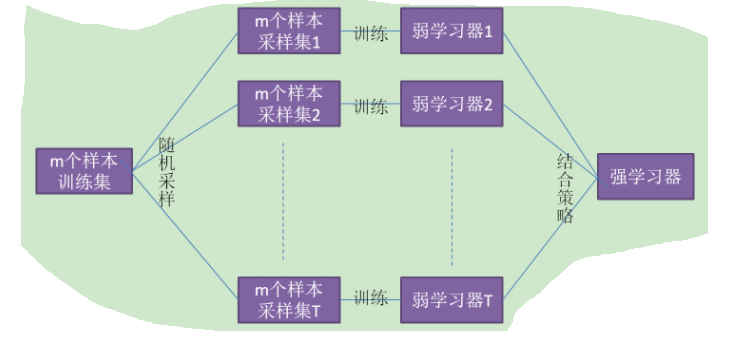
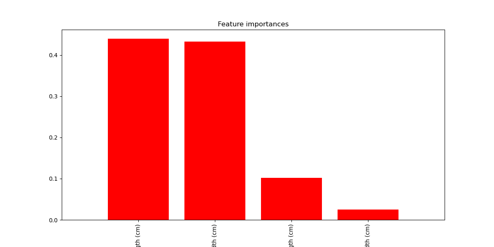

# 集成学习---Bagging之随机森林RF

## 集成学习

在机器学习的广袤领域中，集成学习是一种强大且灵活的策略，它通过将多个单独的学习器（或称为“基学习器”）组合起来，形成一个更加强大的学习器，以提升模型的预测性能。集成学习的核心思想在于“集体智慧”的力量，即多个学习器的联合决策通常会比单一学习器的决策更为准确和稳健。

集成学习的重要性在于它能够有效解决单一学习器可能存在的过拟合、欠拟合、稳定性差等问题。通过将多个基学习器的预测结果进行综合，集成学习不仅能够提高预测精度，还能增强模型的鲁棒性和泛化能力。此外，集成学习还能够利用不同基学习器之间的差异性，捕捉到数据中的更多信息，从而进一步提升预测性能。

在集成学习的众多策略中，Bagging（Bootstrap Aggregating）是一种非常受欢迎的方法。Bagging通过自助法采样生成多个不同的训练子集，并在每个子集上构建基学习器。由于每个基学习器都是在不同的数据子集上训练的，因此它们之间具有较大的差异性。这种差异性使得Bagging能够在集成过程中有效地降低模型的方差，提高预测的稳定性。


### 随机森林

随机森林（Random Forest，简称RF）则是Bagging算法的一个典型应用。随机森林以决策树作为基学习器，并在构建每棵决策树时引入了额外的随机性。具体来说，随机森林在构建决策树时不仅使用自助法采样生成不同的训练子集，还会在每个节点分裂时随机选择一部分特征进行考虑。这种随机性的引入进一步增加了基学习器之间的差异性，使得随机森林能够取得更好的预测性能。


## RF原理

### Bagging基本思想




1. Bagging的特点 “随机采样”。随机采集跟训练集个数m相同的样本，采集T次。得到采样集。(GBDT(Gradient Boosted Decision Tree)的子采样是无放回采样，而Bagging的子采样是放回采样。)

2. 对于一个样本，在m个样本的随机采样中，每次被采集到的概率是1/m。在m次采样中没有采集到的概率是：$P（一次都未被采集）=(1 - 1/m)^m$

   对m取极限得到：

$$
\lim_{m \to \infty} (1 - \frac{1}{m})^m \to \frac{1}{e} \approx 0.368
$$

​	也就是说bagging的每轮随机采样中，训练集大约有36.8%的数据没被采集，称为“袋外数据”。这些数据没参与训练集模型的拟合，但可以作为测试集用于测试模型的泛化能力，这样的测试结果称为“外包估计”。

3. bagging对于弱学习器没有限制，这和Adaboost一样。但是最常用的一般也是决策树和神经网络。
4. bagging的结合策略也比较简单，对于分类问题，通常使用简单投票法，得到最多票数的类别或者类别之一为最终的模型输出。对于回归问题，通常使用简单平均法，对T个弱学习器得到的回归结果进行算术平均得到最终的模型输出。
   

由于Bagging算法每次都进行采样来训练模型，因此泛化能力很强，对于降低模型的方差很有作用。当然对于训练集的拟合程度就会差一些，也就是模型的偏倚会大一些。

Bagging算法的基本思想是通过结合多个基学习器的预测结果来提升整体性能。具体来说，Bagging采用自助法（Bootstrap）采样来生成多个不同的训练子集，并在每个子集上构建基学习器。这种采样方式是有放回的，即每次从原始训练集中随机抽取一个样本后，该样本仍然可以被再次抽取。

通过自助法采样，每个基学习器都是在不同的数据子集上训练的，因此它们之间具有较大的差异性。这种差异性使得Bagging能够在集成过程中有效地降低模型的方差，提高预测的稳定性。

在构建基学习器时，Bagging通常采用决策树作为基学习器。决策树是一种易于理解和实现的分类与回归方法，通过递归地将数据集划分为若干个子集，并根据子集的纯度来选择最佳的划分属性。

在得到多个基学习器的预测结果后，Bagging通过投票或平均的方式将它们组合起来得到最终的预测结果。对于分类问题，通常采用投票的方式，即选择出现次数最多的类别作为最终的预测结果；对于回归问题，则采用平均的方式，即将所有基学习器的预测值取平均得到最终的预测值。


### RF的构造

随机森林在Bagging的基础上进行了扩展，通过在构建决策树时引入额外的随机性来增加模型的多样性。具体来说，随机森林在构建每棵决策树时，不仅使用自助法采样生成不同的训练子集，还会在每个节点分裂时随机选择一部分特征进行考虑。

这种随机选择特征子集的方式使得每棵决策树在构建过程中都只能看到部分特征的信息，从而增加了基学习器之间的差异性。由于每棵决策树都是基于不同的特征子集进行构建的，因此它们对于相同的输入数据可能会产生不同的预测结果。这种差异性使得随机森林能够在集成过程中捕捉到更多的信息，进一步提高预测的准确性。


### RF的工作机制

首先，通过对原始训练集进行自助法采样生成多个不同的子数据集。然后，在每个子数据集上构建一棵决策树，并在构建过程中随机选择特征子集进行分裂。这样，就得到了一个由多棵决策树组成的随机森林。

在预测阶段，对于一个新的输入样本，将其输入到随机森林中的每一棵决策树中，得到每棵树的预测结果。然后，根据具体的任务类型（分类或回归），通过投票或平均的方式将所有树的预测结果组合起来，得到最终的预测结果。

由于随机森林结合了多个基学习器的预测结果，并且基学习器之间具有较大的差异性，因此它能够有效地降低模型的方差和偏差，提高预测的准确性和稳定性。同时，随机森林还具有良好的可解释性和可视化能力，使得用户可以更好地理解和分析模型的预测结果。


流程：

```txt
输入：
    D：原始训练数据集
    m：每次分裂时考虑的特征数（m < 总特征数）
    n_trees：随机森林中决策树的数量

输出：
    RF：随机森林模型

算法流程：
1. 初始化随机森林模型RF为空

2. 对于i从1到n_trees：
    a. 使用自助法（Bootstrap）从D中有放回地随机抽取样本，形成训练子集D_i
    
    b. 在D_i上构建一棵决策树T_i：
        i. 初始化根节点，包含D_i中的所有样本
        ii. 对于当前节点N，如果它包含的样本都属于同一类别C，或者样本数少于预设阈值，或者没有更多特征可用进行分裂，则将该节点标记为叶节点，其类别为C（对于分类问题）或该节点样本的平均值（对于回归问题）
        iii. 否则，从D_i中的m个特征中随机选择一个特征子集
        iv. 使用最佳划分准则（如信息增益、基尼指数等）在选定的特征子集中选择一个特征进行分裂，将当前节点N分裂为多个子节点
        v. 对每个子节点递归执行步骤ii-iv，直到满足停止条件
    
    c. 将构建好的决策树T_i添加到随机森林模型RF中

3. 返回随机森林模型RF

```

首先，我们初始化一个空的随机森林模型。然后，对于每一棵树，使用自助法从原始训练数据集中随机抽取样本以形成训练子集。在构建每棵决策树时，采用了随机选择特征子集的策略来增加基学习器之间的差异性。具体来说，在每次分裂时，并不是考虑所有的特征，而是从特征集中随机选择一个子集来进行分裂。这样，每棵树都是在不同的特征和样本子集上构建的，从而增加了模型的多样性。最后，将所有构建好的决策树添加到随机森林模型中，并返回这个模型以供后续的预测使用。

随机森林中的每棵树都是独立构建的，并且它们的预测结果是通过投票（对于分类问题）或平均（对于回归问题）的方式来进行集成的。这种集成策略使得随机森林能够充分利用各个基学习器的优势，提高整体的预测性能。

此外，随机森林还有一些超参数可以调整，如每棵树的最大深度、分裂时考虑的最小样本数等，这些参数的选择会影响到模型的复杂度和性能。在实际应用中，可以通过交叉验证等方法来选择合适的超参数，以优化模型的预测效果。


### RF优点

1、预测精度高

  随机森林通过集成多个基学习器（通常是决策树）的预测结果，能够有效提升整体的预测精度。由于每棵决策树都是基于不同的样本子集和特征子集构建的，因此它们之间具有较大的差异性。当这些差异性的基学习器进行集成时，可以通过投票或平均的方式将各自的优点融合起来，从而得到更为准确和稳定的预测结果。这使得随机森林在分类和回归问题上都能表现出色，尤其在处理具有复杂结构和非线性关系的数据时更为有效。

2、能够处理高维数据

  在高维数据场景下，许多机器学习算法可能会面临维度灾难的问题，即随着特征数量的增加，模型的复杂度急剧上升，导致过拟合和计算效率下降。然而，随机森林在处理高维数据时具有天然的优势。它通过在每个节点分裂时随机选择特征子集进行考虑，有效地降低了模型的复杂度，并避免了过拟合的发生。同时，由于随机森林是基于树的算法，它能够自动地选择对预测结果有贡献的特征，忽略那些不相关的特征，从而提高了模型的泛化能力。

3、能够评估特征的重要性

  随机森林提供了一种有效的特征重要性评估方法。在构建每棵决策树的过程中，可以计算每个特征在分裂节点时所带来的不纯度减少量（如信息增益或基尼指数减少量）。通过将这些不纯度减少量在随机森林中所有决策树上进行平均，就可以得到每个特征的平均不纯度减少量，从而评估特征的重要性。这种方法不仅能够帮助我们理解哪些特征对预测结果有重要影响，还可以用于特征选择和降维，进一步提高模型的性能和可解释性。

4、对缺失值不敏感

  在实际应用中，数据往往存在缺失值的问题。许多机器学习算法在处理含有缺失值的数据时需要进行数据清洗或填充操作，这可能会引入额外的噪声或偏差。然而，随机森林对缺失值并不敏感。在构建决策树时，随机森林能够自动地处理含有缺失值的样本，通过考虑不同特征值的组合来找到最优的分裂方式。这使得随机森林能够在不进行数据清洗的情况下直接应用于实际数据集，提高了算法的灵活性和实用性。

5、易于并行化

  由于随机森林中的每棵决策树都是独立构建的，因此该算法可以很容易地进行并行化。这意味着我们可以利用多核处理器或分布式计算平台来同时构建多棵决策树，从而显著提高计算效率。这种并行化的特性使得随机森林能够处理大规模数据集和实时预测任务，满足实际应用中的性能需求。


### RF缺点

当数据集的样本量较小时，随机森林的性能可能受到影响。


## 案例

选择使用经典的Iris数据集进行分类任务。Iris数据集包含了150个样本，每个样本有四个特征（花萼长度、花萼宽度、花瓣长度、花瓣宽度），以及一个目标变量（鸢尾花的种类）。

```python
from sklearn.datasets import load_iris
from sklearn.model_selection import train_test_split
from sklearn.metrics import accuracy_score, classification_report
from sklearn.ensemble import RandomForestClassifier
from sklearn.model_selection import cross_val_score
import matplotlib.pyplot as plt
import numpy as np

# 加载数据
iris = load_iris()
X = iris.data
y = iris.target

# 划分训练集和测试集
X_train, X_test, y_train, y_test = train_test_split(X, y, test_size=0.3, random_state=42)

# 构建随机森林模型
rf = RandomForestClassifier(n_estimators=100, max_depth=3, random_state=42)

# 交叉验证评估模型性能
scores = cross_val_score(rf, X_train, y_train, cv=5)
print("Accuracy: %0.2f (+/- %0.2f)" % (scores.mean(), scores.std() * 2))

# 训练模型
rf.fit(X_train, y_train)

# 预测测试集
y_pred = rf.predict(X_test)

# 评估模型性能
print("Accuracy:", accuracy_score(y_test, y_pred));
print(classification_report(y_test, y_pred))


# 获取特征重要性
importances = rf.feature_importances_
indices = np.argsort(importances)[::-1]

# 打印特征排名
for f in range(X.shape[1]):
    print("%d. feature %d (%f)" % (f + 1, indices[f], importances[indices[f]]))

# 绘制特征重要性图
plt.figure(figsize=(12, 6))
plt.title("Feature importances")
plt.bar(range(X.shape[1]), importances[indices], color="r", align="center")
plt.xticks(range(X.shape[1]), iris.feature_names, rotation=90)
plt.xlim([-1, X.shape[1]])
plt.show()

```

```输出
Accuracy: 0.93 (+/- 0.10)
Accuracy: 1.0
              precision    recall  f1-score   support

           0       1.00      1.00      1.00        19
           1       1.00      1.00      1.00        13
           2       1.00      1.00      1.00        13

    accuracy                           1.00        45
   macro avg       1.00      1.00      1.00        45
weighted avg       1.00      1.00      1.00        45

1. feature 3 (0.439569)
2. feature 2 (0.433067)
3. feature 0 (0.102258)
4. feature 1 (0.025106)

```




## 参考

[集成学习---Bagging之随机森林（RF）](https://blog.csdn.net/qq_38614074/article/details/138250264)
