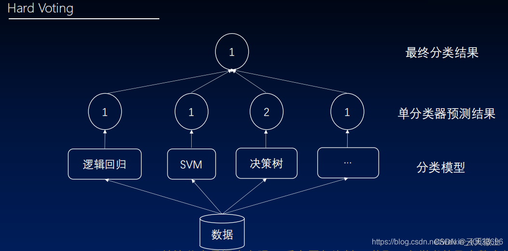
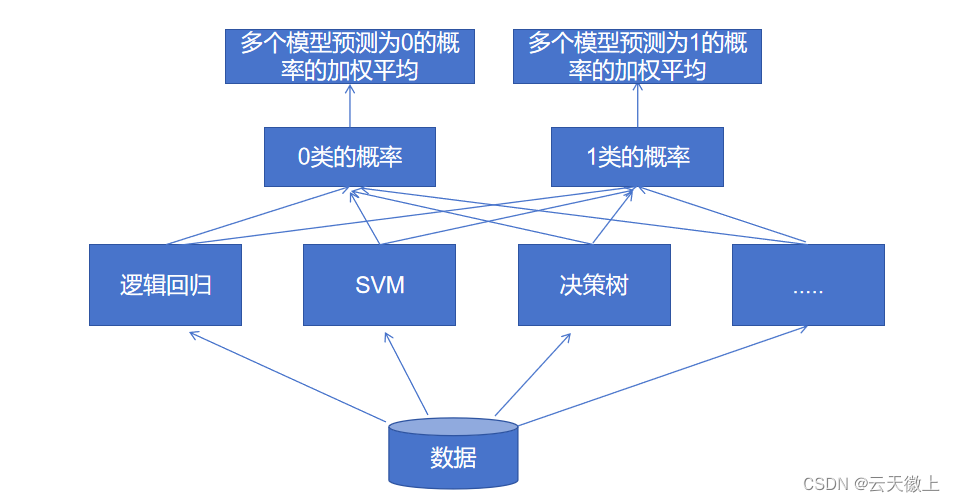

# 集成学习---投票法（Voting）

## 集成学习

集成学习是一种强大的机器学习方法，它通过构建并结合多个学习器（也称为“基学习器”或“弱学习器”）的预测结果来完成学习任务。集成学习的主要目的是通过结合多个学习器的预测结果来提高模型的泛化能力和鲁棒性，降低单一学习器可能存在的过拟合或欠拟合风险。

集成学习的基本原理在于，不同的学习器往往具有不同的偏差和方差特性，它们在各自的训练数据集上可能会产生不同的预测结果。当我们将这些学习器的预测结果进行某种形式的结合时，可以期望它们的偏差和方差特性能够相互抵消或互补，从而得到更加稳定和准确的预测结果。

集成学习的方法有很多种，其中一些常见的包括Bagging、Boosting和Stacking等。

Bagging（Bootstrap Aggregating）是一种基于自助采样法的集成学习方法。它通过从原始数据集中随机抽取多个子数据集，并在每个子数据集上训练一个学习器，然后将这些学习器的预测结果进行结合。由于每个子数据集都是随机抽取的，因此每个学习器都是在不同的数据分布上进行训练的，这有助于降低模型的过拟合风险。

Boosting则是一种通过迭代方式训练多个学习器的方法。在每次迭代中，Boosting都会根据当前学习器的预测结果对训练样本进行加权调整，使得后续学习器能够更加关注那些被错误分类的样本。通过这种方式，Boosting能够逐渐提高学习器的性能，并得到一个更加强大的集成模型。

Stacking则是一种更加复杂的集成学习方法，它通过训练一个元学习器（meta-learner）来结合多个基学习器的预测结果。具体来说，Stacking首先使用原始数据集训练多个基学习器，然后将这些基学习器的预测结果作为新的特征输入到元学习器中进行训练。通过这种方式，Stacking能够充分利用不同基学习器的优点，并得到一个更加准确的集成模型。

在这些集成学习方法中，Voting作为一种简单而有效的方法，受到了广泛的关注和应用。Voting的基本思想是将多个学习器的预测结果进行投票，选择票数最多的预测结果作为最终的输出。这种方法不需要像Bagging、Boosting或Stacking那样进行复杂的训练过程，因此实现起来相对简单。同时，由于Voting可以充分利用不同学习器的优点，它往往能够在分类任务中取得较好的性能。


## Voting

Voting，即投票法，是集成学习中一种直观且有效的方法。其核心思想是通过结合多个模型的预测结果来提高整体性能。在Voting集成中，每个模型都会根据输入数据给出自己的预测结果，然后这些预测结果会被汇总起来，通过某种方式产生一个最终的预测结果。

Voting通常分为硬投票和软投票两种方式。硬投票是指每个模型只输出一个最可能的类别标签，然后根据这些标签进行投票，选择票数最多的类别作为最终的预测结果。而软投票则允许模型输出每个类别的概率或置信度，然后根据这些概率或置信度进行加权投票，从而得到最终的预测结果。

硬投票的优点是简单直观，易于实现。但由于它只考虑了模型预测的类别标签，而没有利用模型对每个类别的概率或置信度信息，因此在某些情况下可能不是最优的。软投票则能够充分利用模型输出的概率或置信度信息，通过加权的方式结合不同模型的预测结果，通常能够取得更好的性能。

### 硬投票

对于硬投票，假设有$N$个模型参与投票，每个模型对样本$x$的预测结果为$c_i$（$i = 1,2,\ldots,N$），则最终的预测结果$C$可以通过下式得出：

$$
C = \underset{}{\mathrm{argmax}}\left(\sum_{i = 1}^{N} \delta(c_i = C_j)\right)
$$
其中$j = 1,2,\ldots,K$，$K$为类别总数，$\delta$为指示函数，当$c_i$等于$C_j$时取值为$1$，否则为$0$。 表示对每个类别进行投票计数，选择票数最多的类别作为最终的预测结果。




### 软投票

对于软投票，假设每个模型输出的是样本$x$属于各个类别的概率或置信度$p_i(j)$（$j = 1,2,\ldots,K$），则最终的预测结果$C$可以通过下式得出：

$$
C = \underset{}{\mathrm{argmax}}\left(\sum_{i = 1}^{N} w_i * p_i(j)\right)
$$
其中$w_i$为每个模型的权重，通常可以取平均值（即$w_i = 1/N$）或者根据模型的性能进行调整。 



### Voting优缺点

优点：

+ 提高稳定性：通过结合多个模型的预测结果，可以减少单一模型可能存在的误差和噪声，从而提高整体预测的稳定性。

+ 降低过拟合风险：当使用不同的模型进行投票时，由于不同模型可能具有不同的偏差和方差特性，它们之间可能存在一定的互补性，从而降低过拟合的风险。

+ 简单易实现：Voting方法相对简单直观，不需要复杂的训练过程，易于在实际应用中实现。  


缺点：

+ 模型多样性要求高：为了充分发挥Voting的优势，参与投票的模型应该具有一定的多样性。如果所有模型都过于相似或者性能较差，那么投票结果可能并不会比单一模型更好。
+ 对异常值敏感：在某些情况下，如果某个模型对某个样本的预测结果存在异常值（如极端概率或置信度），那么这可能会对整个投票结果产生较大影响。因此，在使用Voting方法时需要注意对异常值的处理。


## 案例

```python
import numpy as np
from sklearn.datasets import load_iris
from sklearn.model_selection import train_test_split
from sklearn.linear_model import LogisticRegression
from sklearn.svm import SVC
from sklearn.tree import DecisionTreeClassifier
from sklearn.ensemble import VotingClassifier
from sklearn.metrics import accuracy_score

# 加载iris数据集
iris = load_iris()
X = iris.data
y = iris.target

# 划分训练集和测试集
X_train, X_test, y_train, y_test = train_test_split(X, y, test_size=0.3, random_state=42)


# 创建多个基础模型
# 选择了逻辑回归、支持向量机和决策树作为基础模型
log_reg = LogisticRegression(max_iter=1000)
svm = SVC(probability=True)
dec_tree = DecisionTreeClassifier()

# 将模型放入列表中
models = [('lr', log_reg), ('svm', svm), ('dt', dec_tree)]


# 创建VotingClassifier对象，使用软投票
voting_clf = VotingClassifier(estimators=models, voting='soft')

# 训练VotingClassifier
voting_clf.fit(X_train, y_train)

# 对测试集进行预测
y_pred = voting_clf.predict(X_test)

# 计算准确率
accuracy = accuracy_score(y_test, y_pred)
print(f"Voting Classifier Accuracy: {accuracy:.2f}") # Voting Classifier Accuracy: 1.00

```

在实际应用中，可能需要进行更多的模型选择和调优，以及使用交叉验证等技术来更准确地评估模型的性能。此外，对于不同的问题和数据集，可能还需要进行适当的数据预处理和特征工程，以提高模型的性能。


## 参考

[集成学习---投票法（Voting）](https://blog.csdn.net/qq_38614074/article/details/138176957)
